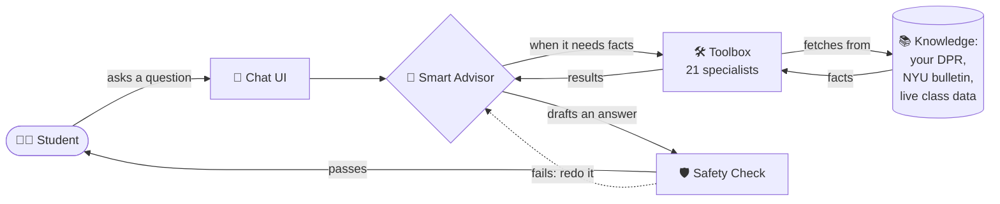
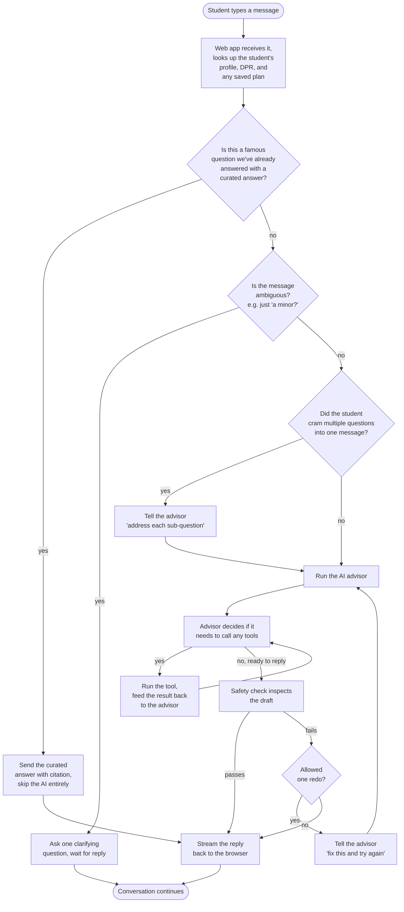
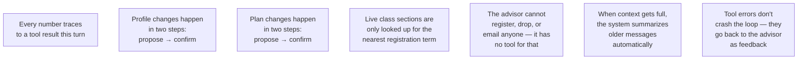
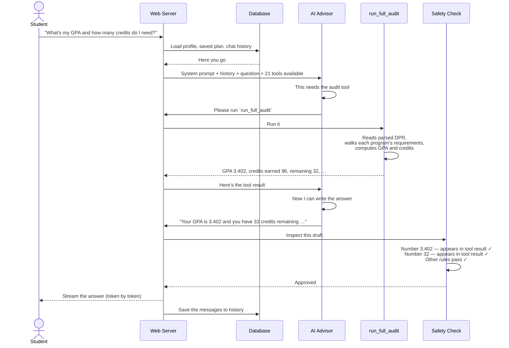

# NYU Path — Project Audit

> Last verified against code: 2026-06-16 (Phase 4 — Experience & continuity — complete). Prior: 2026-06-15 (cohort gate subsystem removed); 2026-06-13: added probe_counterfactual to the tool catalog, corrected the response validator to 8 checks, marked the Phase-3 advisor layer shipped, fixed the engine-docs count to 23.

> **Status — Phase 4 (Experience & continuity) is COMPLETE (2026-06-16).** Built ON TOP of the unchanged Phases 0–3 engine + advisor (it rebuilt no validity logic): the user-facing workspace (advisor chat left + plan canvas right over **one shared live state**), the chat↔sidebar bidirectional sync that closes PLAN-14, the **propose → preview → confirm** edit model (every gesture's already-staged proposal renders as a read-only canvas preview + review card; a clean apply is no longer a silent commit; `feasible:false` proposals never preview), the canvas-click → pre-filled-chat shortcut to the Phase-3 introspection/probe tools, an onboarding/preference wizard (home-school propose+confirm, the `correcting_data`-persists fix, free-text → the Phase-3 preference ladder — **built but its mount is DEFERRED**), and the DB wiring. Both verbatim design-§10 exit gates are **MET and verified LIVE against Neon**: (1) the chat/sidebar parity tests (`apps/web/tests/chatSidebarParity.test.ts`), and (2) e2e confirm→persist (`apps/web/tests/e2eConfirmPersist.test.ts`, plus the OTP-login smoke `otpLoginSmoke.test.ts`). See [`web/db-and-stores.md`](web/db-and-stores.md), [`web/plan-action-orchestrator.md`](web/plan-action-orchestrator.md), and the plan `Docs/plans/33-2026-06-15-planning-engine-phase4-experience.md`.

> **About this document set.** This is a code-truth audit of the NYU Path codebase. Every claim was derived from reading the actual source files. No code comments, no existing documentation, and no narrative prose were used as evidence. Where code and surrounding writing disagreed, the code won.

---

## 1. What NYU Path is, in one paragraph

NYU Path is a **chat-based academic advisor** for **NYU undergraduates**. A student logs in, uploads their official Albert Degree Progress Report (DPR) — the sole accepted onboarding artifact — and starts chatting. The system can answer "how many credits do I still need?", build a term-by-term graduation plan, simulate hypotheticals like "what if I added a math minor?", and pull live class sections from NYU's class search. Questions about internal transfer between NYU schools or about double-counting policy are answered the same way any rule is: by citing the bulletin through policy search (`search_policy`) — there is no longer a dedicated transfer-eligibility or overlap tool. The DPR is **required** to reach the agent: the chat route returns an "upload your DPR" error if it's missing, and the personal-record tools (`run_full_audit`, `get_academic_standing`) refuse without it (the legacy unofficial-transcript upload path has been removed; there is no authored-rules fallback). Impersonal lookups (policy search, course search) don't need a DPR at the tool level, but the product flow gates the whole conversation on one anyway.

> **Scope — all NYU undergrad (Phase E de-CAS largely done).** The scope is *all* NYU undergraduate schools, and the spine supports it: the student's home school is read from their DPR, and the policy RAG corpus covers every undergrad school. **Phase E removed the main CAS pins:** the system prompt now interpolates the student's school (no more hardcoded "College of Arts & Science"); `get_credit_caps` is **DPR-first** so a non-CAS student gets correct caps from their own DPR **without** a per-school config file (the old "only 3 of ~9 configs exist" gap no longer blocks cap answers); the two DPR-absent registration constants (per-semester ceiling, F-1 floor) come from a shared NYU-undergrad default; and `deriveHomeSchool` now **warns** instead of silently asserting CAS. **Remaining:** a few audit/planner rules still carry CAS-flavored defaults (notably the forward-planner's `classifyRequirementKind`, which is still CAS-coupled — see [engine/forward-schedule.md §10](engine/forward-schedule.md)), and *claiming* "equally good for school X" is gated on real non-CAS DPR validation — so non-CAS support is **honestly beta** until validated against real non-CAS DPRs. A **synthetic, clearly-labeled** non-CAS DPR (NYU Shanghai) now SCHEDULES END-TO-END through the classify→solve→validate pipeline as a regression guard (`packages/engine/tests/e2e/nonCasPlan.test.ts`): `buildForwardSchedule` reaches a valid state (`valid-with-trade-offs`) with all four `-SHU` requirement courses bound as `specific_planned` (e.g. `CSCI-SHU 210` → `SR7001/10`), proving the forward-planner works for non-CAS students. The classifier is **still CAS-coupled** (non-CAS core/elective leaves fall to `unknown`) but that coupling does **not** block scheduling, and the synthetic fixture does not de-CAS the classifier — so **real non-CAS DPR validation remains pending a real fixture**. See the implementation plan ([../plans/20-improvement-plan.md](../plans/20-improvement-plan.md)).

---

## 2. The simplest possible picture



That's the whole product in one picture. The "smart advisor" is a language model. The "toolbox" is 21 deterministic functions (no language model — pure logic) that handle audit math, planning, and policy/curriculum lookup. The "safety check" is a set of rules that inspect the draft reply for hallucinations before it ever reaches the student.

---

## 3. What happens when a student sends a message

Think of it as a relay race. Each runner does its part and passes the baton.



---

## 4. The three pieces of the runtime

Almost everything in the codebase serves one of these three pieces. Knowing which is which is enough to navigate. (One subsystem inside the toolbox — the constraint-search planner — is important enough to get its own callout below.)

### The advisor (the language model)

This is the "brain" — an LLM (Anthropic's Claude Sonnet 4.6 by default, OpenAI's GPT-4.1-mini as fallback; the primary model is overridable via the `NYUPATH_PRIMARY_MODEL` env var). It receives a long instructions document (the system prompt), the chat history, and a list of tools it's allowed to call. It either replies with text or asks the system to run a tool. It cannot do math on the student's transcript itself, cannot look up policy, and cannot save anything — every action requires a tool.

### The tools (deterministic functions)

There are **21 of them** (the live registry is `packages/engine/src/agent/registry.ts`). Each one knows how to do one thing — for example, "run a full degree audit", "plan every term until graduation", or "search the policy bulletin for the rule on pass/fail courses". Tools are written in TypeScript. They read data files and the student's session, they run their algorithm, and they return a result. They never call the language model. The advisor uses tools the way a doctor uses a calculator and a reference book — to get numbers and facts the doctor shouldn't be guessing.

### The planner (a constraint-search engine)

The term-by-term planner is not a greedy "fill each term until it's full" loop — that old greedy solver was deleted in the Phase 0-2 rebuild. The planner is now a **feasibility-first constraint search**. Given the student's remaining requirements, in-progress courses, and pinned choices, it searches for the **first complete plan that satisfies every constraint** (backtracking with forward-checking over a node budget), then polishes that plan with a local-improvement pass. The single entry point `solveForwardSchedule` runs the pipeline: `buildConstraintContext` (precompute the problem) → `findFirstValidPlan` (the backtracking search) → `localImprove` (refine) → `materializePlan` (assemble the full schedule). Alternatives ("what if I add a summer term?") come from `findDiverseValidPlans`, which finds distinct valid plans rather than re-ranking one. Code lives under `packages/engine/src/agent/forwardSchedule/` (`solver.ts`, `search.ts`, `localImprove.ts`, `materializePlan.ts`, `alternatives.ts`).

What makes a plan "valid" is defined in exactly one place: the **7-axis graduation-path validator** (`runGraduationPathValidator` in `forwardSchedule/graduationPathValidator.ts`). Its seven axes are: requirement groups satisfied, pool slots resolvable, total credits meet the minimum, thresholds met, visa axes pass, assumptions explicit, and graduation target met. This validator is the **contract**: every path that produces or mutates a plan — building (`plan_forward_degree`), proposing a change (`propose_plan_change`), confirming a change (`confirm_plan_change`), and simulating alternatives (`simulate_alternatives`) — routes its output back through `finalizeForwardSchedule`, which runs the validator and attaches the per-axis verdict. A plan the validator marks infeasible carries an honest infeasibility report rather than being silently shipped.

### The safety check (response validator)

Before the advisor's draft answer reaches the student, **eight deterministic rules** inspect it (`packages/engine/src/agent/responseValidator.ts`: `checkGrounding`, `checkInvocations`, `checkCompleteness`, `checkVerbatim`, `checkAttribution`, `checkIdentityDrift`, `checkQuantitativeShortfall`, `checkPlanClaims`). The most important rule: **every number in the answer must come from a tool result that ran this turn.** If the advisor wrote "your GPA is 3.4", and no tool returned 3.4 this turn, the safety check rejects the draft. The advisor gets one chance to fix it before the answer ships anyway (the system never blocks the student with a blank screen).

> Note: this response validator (which guards the *chat reply*) is a different mechanism from the 7-axis graduation-path validator (which guards the *plan*). The response validator has eight checks, the graduation-path validator has seven axes; they are unrelated.

---

## 5. The big invariants the system enforces

These are the rules the code actually enforces. They're worth knowing because they explain why the system behaves the way it does.



**1. Grounded numbers.** The advisor cannot write a number from memory. Every credit count, GPA, deadline, or section count in the reply must come from a tool result this turn — or be derivable as the sum/difference of two such numbers.

**2. Two-step writes.** When the student says "change my catalog year to 2024-2025", the advisor doesn't immediately mutate the profile. It stages the change, surfaces the consequences ("this will move requirement X to category Y"), and waits for explicit confirmation before applying.

**3. Two-step plan changes.** Same idea for "drop CSCI-UA 421 from Fall 2026" or "add a minor in Math". The change is proposed and its impact shown; only an explicit confirmation applies it.

**4. Lazy section data.** The student's forward schedule is initially structural — "this term has slots for two CS electives and a Core requirement". Only when the student is registering for the next term does the system fetch live sections (CRN, meeting times, instructor) from NYU's class search. Terms more than ~6 months out stay structural because NYU hasn't published sections that far ahead.

**5. Read-only posture.** The advisor cannot register the student for a class, drop a class, submit a transfer application, or send an email. There is no tool for any of those actions. When asked, the advisor refuses and explains the steps the student would take in Albert / advising / OGS portals.

**6. Self-healing context.** As the conversation grows, the system automatically summarizes older messages when it's about to run out of room. If it's nearly out of room, it ends the turn gracefully and asks the student to start a fresh chat with a summary preserved.

**7. Recoverable tool failures.** If a tool throws an error, the loop doesn't crash — it tells the advisor "this tool failed, here's why", and the advisor either tries something else or explains the problem to the student.

---

## 6. The shape of the codebase

```mermaid
graph TB
    subgraph Browser["What the student sees (Browser)"]
        UI[Chat page<br/>app/chat/page.tsx]
        SIDEBAR[Schedule sidebar with<br/>term-by-term plan]
    end

    subgraph NextJS["The web server (Next.js — apps/web)"]
        CHATAPI[Streaming chat endpoint<br/>/api/chat/v2]
        PLANAPI[Plan-edit endpoints<br/>/api/plan/{add,move,swap,...}]
        ONBOARD[Onboarding<br/>/api/onboard]
        AUTH[Email OTP login<br/>/api/auth/*]
        DB[(Postgres database<br/>via Drizzle ORM:<br/>chat history,<br/>saved schedules,<br/>profiles)]
    end

    subgraph Engine["The brain + tools (packages/engine)"]
        AGENT[Agent loop<br/>orchestrates LLM + tools]
        VALIDATOR[Response validator<br/>8 safety checks]
        TOOLS[21 tools]
        ALGOS[Audit, constraint-search planner,<br/>7-axis graduation-path validator,<br/>section materializer,<br/>RAG retriever, DPR parser]
        SESSION[Session state<br/>the shared bag every<br/>tool reads from]
    end

    subgraph Data["Static data (data/)"]
        BULLETIN[Bulletin pages<br/>scraped]
        PROGRAMS[Program rules<br/>for CAS degrees]
        SCHOOLS[Per-school configs:<br/>all 11 undergrad schools]
        POLICY[Policy text<br/>embedded for RAG]
        CATALOG[Course catalog<br/>with embeddings]
    end

    subgraph BuildTools["Build-time pipeline (tools/)"]
        SCRAPER[Bulletin scraper]
        PARSER[Bulletin parser]
        EMBEDDER[Course + policy<br/>embedders]
        FOSE_REC[FOSE recorder]
    end

    UI <-->|SSE| CHATAPI
    SIDEBAR -->|fetch| PLANAPI
    CHATAPI --> AGENT
    PLANAPI --> TOOLS
    ONBOARD --> ALGOS
    AUTH --> DB
    AGENT --> VALIDATOR
    AGENT --> TOOLS
    TOOLS --> ALGOS
    TOOLS --> SESSION
    ALGOS --> Data
    SCRAPER --> BULLETIN
    BULLETIN --> PARSER
    PARSER --> PROGRAMS
    EMBEDDER --> POLICY
    EMBEDDER --> CATALOG
    FOSE_REC --> CATALOG
```

**What lives where:**

- **`apps/web/`** — the Next.js website. The chat page, the sidebar, the database, the login flow, the streaming endpoint, the deterministic plan-edit endpoints.
- **`apps/cli/`** — a tiny command-line front end (mostly for debugging/scripting, not the main product).
- **`packages/engine/`** — the brain and the toolbox. Everything that thinks, retrieves, calculates, or validates lives here.
- **`packages/shared/`** — type definitions and grade utilities shared between engine and web.
- **`data/`** — the static knowledge: bulletin scrapes, parsed program rules, per-school configs (all 11 NYU undergrad schools, under `data/schools/`), policy text for the AI to retrieve, course catalog with embeddings.
- **`tools/`** — build-time scripts that produce the contents of `data/` (scrapers, parsers, embedders). The runtime never runs them.

---

## 7. What this audit covers

The live docs live under `Docs/current-system/`, split into four folders; superseded/dead-code docs are segregated under `Docs/deprecated/`.

### `current-system/engine/` — 23 documents
Every subsystem of the AI brain. The most important ones:
- **`agent-loop.md`** — the central orchestrator that runs the AI in a loop with the tools
- **`system-prompt.md`** — the instructions the AI is given before every turn
- **`response-validator.md`** — the eight safety checks
- **`tool-registry.md`** — how tools are organized and dispatched
- **`session-state.md`** — the shared data bag every tool reads from
- **`dpr.md`** — how the official transcript (Albert DPR) is parsed
- **`audit.md`** — the degree-audit engine (does it satisfy your major?)
- **`forward-schedule.md`** — the constraint-search multi-term planner and 7-axis validator
- **`rag.md`** — how policy text is retrieved when the AI needs to cite the bulletin
- **`section-materialization.md`** — how a structural plan becomes a real schedule with sections

Plus smaller pieces: the clarifier (handles ambiguous questions), the template matcher (curated answers for FAQs), the LLM clients (OpenAI/Anthropic adapters), and various data loaders.

### `current-system/tools/` — 21 documents
One file per **live** tool the AI can call. Each explains: what it does, what it needs, the algorithm, what it returns, and what other tools it works with. See the [tool catalog table](#8-quick-tool-catalog) below.

### `current-system/web/` — 12 documents
The Next.js website pieces: the chat endpoint, the chat UI, the plan-edit endpoints, the login flow, the database schema and stores, the sidebar components, the rate limiter.

### `current-system/surrounding/` — 3 documents
- The shared types package
- The build-time `tools/` pipeline
- The `data/` directory layout

### `Docs/deprecated/` — docs for superseded / dead code
Segregated so the live docs stay clean. These describe tools and subsystems that have been **removed from the live registry** (or never had a production role): the legacy single-term planner (`plan_semester`) and its `planner` / `plan-feasibility-verifier` subsystems, the two retired tools `check_overlap` and `check_transfer_eligibility` (their concerns now route through `search_policy` RAG), the dead unofficial-transcript parser (`transcript`), and the CLI app (`cli`). See [`../deprecated/README.md`](../deprecated/README.md).

---

## 8. Quick tool catalog

| Tool | What it does in plain English |
|---|---|
| `run_full_audit` | Runs the degree audit — what you've satisfied, what's left, your GPA |
| `plan_forward_degree` | Builds a term-by-term plan from now until graduation |
| `view_forward_plan` | Shows the most recently built plan, no recompute |
| `propose_plan_change` | "What would happen if I changed the plan in this way?" — shows impact |
| `probe_counterfactual` | Read-only what-if: re-solves a hypothetical and narrates whether it stays valid or is "INFEASIBLE because <failing axis + reason>" |
| `confirm_plan_change` | Applies a previously proposed change |
| `simulate_alternatives` | Tries 2–3 plan variants (summer, J-term, extend graduation) |
| `compare_plan_alternatives` | Side-by-side comparison of alternatives the planner already produced |
| `bind_free_elective` | "Use CSCI-UA 480 as my free elective" |
| `bind_pool_slot` | "Use this course for my major-elective pool slot" |
| `materialize_sections` | Fetches real class sections (CRN, time, instructor) for the next term |
| `confirm_section_combination` | "I pick this conflict-free combo of sections" — pins them into the plan |
| `search_policy` | Looks up policy in the bulletin (e.g. pass/fail rules); now also expands the top hit to its full section |
| `get_program_requirements` | Returns a program/major/minor/Core-Curriculum's **entire** requirement page (every section, reassembled) with a confidence band |
| `search_courses` | Semantic course search ("courses about quantum computing") |
| `search_availability` | Are sections of this course actually being offered next term? |
| `what_if_audit` | "What if I changed my major to X?" — runs a hypothetical audit |
| `get_credit_caps` | Per-semester ceiling, F-1 floor, total credits needed |
| `get_academic_standing` | Probation / academic-standing detail (good standing, probation, dismissal level) — requires a loaded DPR; refuses without one. For GPA + cumulative credits, `run_full_audit` is preferred. |
| `update_profile` | Proposes a profile change (school, catalog year, programs, visa) |
| `confirm_profile_update` | Applies a proposed profile change |

That's all **21** live tools (`packages/engine/src/agent/registry.ts`). Three tools that appeared in earlier versions of this doc are **gone**: `check_transfer_eligibility` and `check_overlap` were removed — internal-transfer eligibility and program double-counting are now answered by citing the bulletin through `search_policy` — and `plan_semester` (the legacy single-term planner) was fully deleted, not retained for reference. Docs for the removed pieces live in [`../deprecated/`](../deprecated/README.md).

---

## 9. The single most important picture: a typical conversation



---

## 10. Current gaps (honest)

Two limitations are worth knowing before you trust the system end-to-end:

- **Chat hydrates the persisted plan + preferences each turn; the profile write-clobber is fixed; full profile read-hydration is now done (Phase 4 E1.2).** As of **P3.1**, each chat turn loads the previously-saved `forward_schedules` / `schedule_preferences` rows back into `session.forwardSchedule` / `session.studentDraftPlan` / `session.schedulePreferences` at the start of the turn (`scheduleStore.loadLatestSchedule` + `loadPreferences` in `apps/web/app/api/chat/v2/route.ts`), so a plan built in an earlier turn — or via the sidebar — is in scope for later turns and the agent no longer runs blind to it. **P3.2** then gated the bootstrap profile upsert to fire **only on initial onboarding** (when `profileStore.get` is null), so a confirmed profile mutation is no longer clobbered by the body-DPR-derived profile on every message (and there is no per-message audit-row spam); the related preferences-from-`{}` wipe on chat-driven confirms is also resolved, because confirm now builds on the P3.1-hydrated `session.schedulePreferences` rather than `{}`. **Phase 4 E1.2** closed the last piece: the persisted/confirmed profile is now read back into `session.student` each turn, so the live session reflects the stored profile rather than the body-DPR-derived one (the old continuity gap is gone).
- **Counterfactual "why-not" framing is axis-level, not course-causal.** The advisor layer (Phase 3) is **built and merged**: the `probe_counterfactual` tool re-solves a hypothetical and narrates whether it stays valid or is "INFEASIBLE because <failing axis + reason>", surfacing the validator's per-axis verdicts as student-facing explanations. The honest limit is that the infeasibility "why" is the validator's *axis-level* reason (e.g. "the graduation-target axis failed"), not a course-causal sentence like "you can't graduate in Spring because requirement X has no offered section" — emitting that finer-grained causal binding constraint is optional future engine work.

---

## 11. How to read the rest

- If you want to understand **how the AI thinks turn by turn**, read [`engine/agent-loop.md`](engine/agent-loop.md).
- If you want to understand **why answers are accurate**, read [`engine/response-validator.md`](engine/response-validator.md).
- If you want to understand **what the AI is told to do**, read [`engine/system-prompt.md`](engine/system-prompt.md).
- If you want to understand **how the planner builds and validates a plan**, read [`engine/forward-schedule.md`](engine/forward-schedule.md).
- If you want to understand **how a specific tool works**, open `tools/<tool_name>.md`.
- If you want to understand **how the website is built**, start with [`web/chat-route-sse.md`](web/chat-route-sse.md).

Each doc starts with a *Purpose* paragraph in plain English, then goes into detail.
