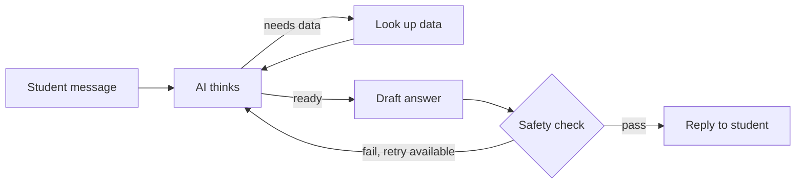
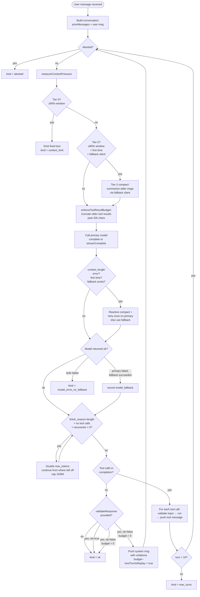
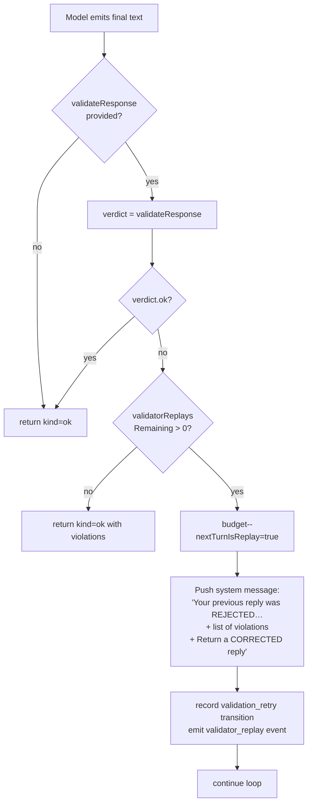
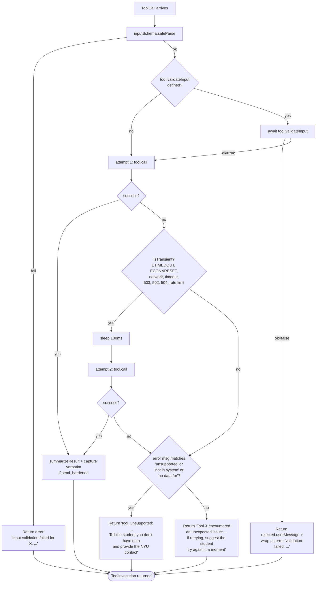

# Agent Loop

> **Source files:** `packages/engine/src/agent/agentLoop.ts`, `agent/loopState.ts`

## TL;DR

Think of this as the assistant's "brain on a treadmill." When a student sends a message, the system shows it to the AI, and the AI either writes a direct answer or asks the system to go fetch something (like the student's transcript or a course catalog). If the AI asked for data, the system runs that lookup, hands the results back to the AI, and asks "okay, now what?" This back-and-forth keeps going until the AI is ready to write a real answer to the student. To stay safe, the loop caps itself at 10 rounds, watches for things like the conversation getting too long, and gives the AI one chance to redo its answer if a safety check rejects it. There are two flavors: one that returns the whole answer at the end, and a streaming one that pipes words to the screen as the AI types them.



---

This is the central orchestrator. It hands the user's message to the language model, runs whatever tools the model asks for, feeds the results back, and repeats until the model produces a final text reply, until 10 round-trips have happened, or until something terminal fires (abort, model error with no fallback, context limit, validator rejection with no replay budget).

There are two public entry points:

- **`runAgentTurn`** — returns a single `ChatTurnResult` after the loop terminates. No streaming.
- **`runAgentTurnStreaming`** — async generator that yields events as they happen: `tool_invocation_start`, `tool_invocation_done`, `thinking_delta`, `text_delta`, `done`. Used by the SSE chat route.

The two are near-identical; the streaming version adds buffering rules around the validator-replay path so the user never sees text from a rejected draft.

---

## 1. The shape of one turn

A "turn" is a single user message → final assistant reply. Inside that turn, the loop may make many model calls.



---

## 2. The five terminal outcomes

The loop never throws on terminal conditions. It returns a `ChatTurnResult` whose `kind` discriminates:

| `kind` | When | What the result carries |
|---|---|---|
| `ok` | Model produced a final text-only reply and validator (if present) accepted it OR the replay budget was exhausted. | `finalText`, `invocations`, `turnMessages`, `usage`, `modelUsedId`, `transitions`. |
| `max_turns` | 10 model→tool→model round-trips elapsed without a final reply. | Everything except `finalText` and `usage`. |
| `aborted` | The caller's `AbortSignal` fired. | Everything except `finalText` and `usage`. |
| `model_error_no_fallback` | Primary failed and either no fallback client was configured, or the fallback also failed. | An `error` string with both errors concatenated. |
| `context_limit` | Tier-3 fired (95% of model window estimated). | A fixed `finalText`: *"I'm running out of context for this conversation. Please start a new chat …"* |

Tool errors are **not** terminal. They are converted to a `tool` message and fed back to the model so it can decide what to do.

---

## 3. Per-iteration sequence

Every iteration of the `for (turn = 0; turn < maxTurns; turn++)` loop does the following, in order:

1. **Set `state.iteration = turn`** — for transition records.
2. **Check abort signal.** If aborted, exit with `kind = aborted`.
3. **Measure context pressure** (`measureContextPressure(conversation, systemPrompt)`). This sums every message's content length, divides by 4 to estimate tokens, divides by the assumed window (128k for gpt-4.1-mini), and exposes `tier2 = fraction ≥ 0.80` and `tier3 = fraction ≥ 0.95`.
4. **If `tier3`** — record `context_limit_terminate`, emit a `context_limit_terminate` fallback log event, and return the canned text with `kind = context_limit`. (The model is never called this turn.)
5. **If `tier2` AND first time AND a fallback client is configured** — call `tryTier2Compact`. That builds a single summary system message via the fallback client (an "advising conversation segment" summarizer prompt asking for 6–12 bullets) and replaces the older messages with it, keeping the last 6 verbatim. Sets `hasFiredTier2Compaction = true` so it can't loop on the same conversation.
6. **Enforce the tool-result budget.** `enforceToolResultBudget` totals every `role: "tool"` message's content length; if it exceeds 32,000 chars AND there are more than 2 tool messages, walk from oldest forward truncating each to 200 chars + `"…[older tool result truncated under MAX_TOOL_RESULT_BUDGET; X chars elided]"` until the total is under budget, but never touch the 2 most recent. Returns the count of truncated messages and a `tool_results_compacted` transition fires.
7. **Record `next_turn` transition.**
8. **Call the model.** Build a `callArgs` object with `system`, `messages`, `tools`, `maxTokens` (1024 default), `temperature: 0`, `signal`. Try the primary client.
9. **If the primary throws** — check if the error matches `isContextLengthExceededError` (substring match against "context_length_exceeded", "context length exceeded", "maximum context length", "too long for context", "maximum allowed input", "413"). If yes AND `!hasAttemptedReactiveCompact` AND a fallback client is configured, run `tryTier2Compact` and retry the primary once. If the retry fails too, fall through to the fallback. Sets `hasAttemptedReactiveCompact = true` so this can only fire once per conversation. Records `reactive_compact` transition.
10. **Otherwise** call `callWithFallback` — try fallback if primary failed.
11. **Output-truncation recovery loop.** If the completion came back with `finishReason = "length"` AND no tool calls AND `outputTruncationRecoveriesRemaining > 0`: double `perCallMaxTokens` (cap 16,384), push the partial assistant text + a "Continue from where you left off. Do not repeat earlier text." user message, call `callWithFallback` again. Repeat. Default budget is 3. Records `output_truncation_recovery` transitions.
12. **If still failed** — record `model_error_no_fallback` and return.
13. **If the fallback was actually used** — emit `model_fallback_triggered` event, record `model_fallback` transition. Update `modelUsedId`.
14. **Add usage tokens to `totalUsage`.**
15. **Push the assistant message into the conversation** (with tool calls if any).
16. **If no tool calls** — this is a final reply candidate. Go to validator gate (see §4).
17. **Otherwise** — for each tool call: look up tool in registry, run `executeTool`, push a `tool` message containing the summary, error, or rejection string. Record the invocation.
18. **Loop.**

If the loop exits naturally (turn == maxTurns), emit `max_turns` and return.

---

## 4. The validator-replay gate

After the model produces a tool-call-free reply:



The replay budget starts at 1 (configurable via `loopStateOptions.validatorReplayLimit`). After consuming it, the loop returns the second attempt regardless of whether it passes — the system never blocks the user with no answer at all.

The streaming variant adds two extra rules at this gate:
1. **All `text_delta` events from this turn are buffered.** Nothing is sent to the user until the validator clears (or runs out of budget).
2. **All `thinking_delta` events from this turn are buffered too**, and discarded entirely if a replay is queued. The model often narrates "the validator caught my synthesized 16, let me remove that" during replay — that internal monologue must not leak.

The next iteration reads `state.nextTurnIsReplay`, clears it, and passes `isReplayTurn = true` into `runOneTurn` so even *that* turn's thinking deltas are suppressed.

---

## 5. The `executeTool` cascade

Each tool call goes through this:



Important details that the code enforces:

- **Validation rejections are NOT exceptions.** They become `invocation.rejected.userMessage` and also `invocation.error.message = "validation failed: " + userMessage` so that both observability and the validator can recognize the rejection class.
- **Transient retries.** Only network-class errors retry once, with 100ms backoff. Validation errors and tool-unsupported errors surface immediately so the model can adapt.
- **`callMs` is captured** for every invocation (wall-clock ms inside `tool.call`).
- **`verbatimText` is extracted** when `tool.outputMode === "semi_hardened"`. The response validator's `checkVerbatim` will reject the final reply if it doesn't include this text.

---

## 6. The conversation grows, but the loop keeps it small

Two complementary mechanisms keep the conversation under model-window limits:

### Tool-result budget (Step 6 above)
- **Limit**: `MAX_TOOL_RESULT_BUDGET = 32,000` chars across all `role: "tool"` messages.
- **Keep recent**: the last 2 tool messages stay verbatim.
- **Compaction**: older tool messages get truncated to first 200 chars + a tail like `"…[older tool result truncated under MAX_TOOL_RESULT_BUDGET; 1500 chars elided]"`.
- **Already-small protection**: messages ≤ 200 chars are skipped.

### Conversation summarization (Tier-2 / Tier-3 / reactive)
- **Tier-2 (80% of window, default 102,400 tokens)**: summarize older messages via the fallback client. Keeps last 6 messages verbatim. Replaces the head with a single `role: "system"` message starting with `"[Conversation auto-compacted under Tier-2 pressure. Earlier turns summarized below.]"`. Fires at most once per conversation.
- **Tier-3 (95% of window)**: don't even call the model. Return a fixed text asking the student to start a new chat.
- **Reactive compact**: if the primary returns a context-length error mid-turn, fire Tier-2 once (`hasAttemptedReactiveCompact = true`), retry the primary. Falls through to fallback if even the retry fails.

The token estimate is intentionally cheap: `Math.ceil(totalChars / 4)`. The thresholds (80%, 95%) have slack so this approximation doesn't matter.

---

## 7. Transition records — what happened, when

Every interesting state change writes a `TransitionRecord` to `state.transitions`:

```
{ iteration: number, reason: TransitionReason, ts: ISO date, detail?: string }
```

Possible `reason` values are exhaustive:

- `next_turn` — every iteration start
- `stop_hook_retry` — defined but currently unused by the loop
- `validation_retry` — validator rejected and replay queued
- `error_recovery` — defined but currently unused by the loop
- `model_fallback` — fallback client served this request
- `tool_results_compacted` — `enforceToolResultBudget` truncated messages
- `session_compacted` — Tier-2 fired
- `context_limit_terminate` — Tier-3 fired
- `output_truncation_recovery` — output was truncated and got auto-continued
- `reactive_compact` — context-length error caused mid-turn compaction

The `ChatTurnResult` carries the full transition list back to the caller so the chat route can echo it to telemetry.

Every transition is **also** mirrored to the `FallbackSink` (the observability bus). The streaming chat route uses this to update a sidebar telemetry pane.

---

## 8. Two model clients: primary + optional fallback

`AgentTurnOptions` accepts:

- `client` — the primary `LLMClient` (always present).
- `fallbackClient` — optional. Used when the primary throws.

`callWithFallback`:
1. Try `primary.complete(args)`. If it works, return its completion and `usedClientId = primary.id`.
2. If it throws and no fallback exists, return `{ ok: false, error: "Primary model X errored: ..." }`.
3. Otherwise try `fallback.complete(args)`. If it works, return its completion and `usedClientId = fallback.id`.
4. If both fail, return `{ ok: false, error: "Primary X errored: ...; Fallback Y errored: ..." }`.

The streaming variant has a similar fallback path inside `runOneTurn`; the only twist is that any partial deltas already buffered from the primary are discarded before the fallback runs, so the user never sees half a primary reply followed by a different fallback reply.

The same fallback client is used as the summarizer for Tier-2 / reactive compaction. The cheaper-tier model is intentional.

---

## 9. Converting tools to the LLM's tool schema

`toLLMToolDefs(registry, session)` maps each registered tool to a vendor-neutral `LLMToolDef`:

- `name` = `tool.name`
- `description` = `${tool.description}\n\n${tool.prompt({ session })}` (the static description plus a per-session dynamic prompt block — e.g. "DPR is loaded, prefer run_full_audit")
- `parameters` = `zodToJsonSchema(tool.inputSchema)`

The Zod-to-JSON-schema converter prefers Zod v4's native `toJSONSchema()` on the instance, falls back to `z.toJSONSchema(schema)`, and as a last resort returns `{ type: "object", properties: {}, additionalProperties: true }`. After conversion it strips `$schema` and, if the top-level result isn't `type: "object"` (as happens for discriminated unions), it wraps the schema in `{ type: "object", properties: { input: <schema> }, required: ["input"], additionalProperties: false }` to satisfy OpenAI's strict requirement that function parameters be an object schema.

---

## 10. Streaming vs non-streaming — what's different

Both functions implement the same loop. The streaming version adds:

- An `AgentStreamEvent` async generator surface: `tool_invocation_start`, `tool_invocation_done`, `text_delta`, `thinking_delta`, `done`.
- A `runOneTurn` helper that reads from `client.streamComplete` if present, capturing `text_delta` events into a buffer and yielding `thinking_delta` events upstream (unless the turn is a replay turn — see §4). On clients without `streamComplete`, it falls back to `complete()` and yields a single `text_delta` with the full text.
- **Replay-safe text buffering** — text deltas are pushed into `bufferedDeltas` and only flushed to the consumer once we know the validator won't replay the turn.
- **Replay-safe thinking buffering** — same idea for thinking deltas; additionally, the *next* (replay) turn's thinking is silenced via `isReplayTurn`.
- **Tier-3 produces a `text_delta` first**, then `done`, so the user sees the canned text even on the streaming path.

The two variants are kept hand-aligned. If the loop logic ever drifts between them, it would be observable as the streaming version producing different `transitions` or different terminal outcomes.

---

## 11. What the loop never does

Worth knowing explicitly:

- It does **not** invoke any tool itself. All tool calls come from the model's `toolCalls`.
- It does **not** modify `session` directly. Tools are responsible for any mutation, and they are allowed to do it (the type system permits it; `ToolSession` is not frozen).
- It does **not** call `validateResponse` unless the caller provides one. Pure callers that just want the model's draft can skip the gate.
- It does **not** retry tool errors more than once, and only for transient errors. Logic errors surface to the model immediately.
- It does **not** authenticate, authorize, rate-limit, or log to disk. Those concerns belong to the web layer.

---

## 12. Public types (consumer surface)

```
ChatTurnResult
  | { kind: "ok",                       finalText, invocations, turnMessages, usage, modelUsedId, transitions }
  | { kind: "max_turns",                            invocations, turnMessages,        modelUsedId, transitions }
  | { kind: "aborted",                              invocations, turnMessages,        modelUsedId, transitions }
  | { kind: "model_error_no_fallback",  error,      invocations, turnMessages,        modelUsedId, transitions }
  | { kind: "context_limit",            finalText, invocations, turnMessages,        modelUsedId, transitions }

ToolInvocation
  { toolName, args, rejected?, summary?, error?, callMs?, verbatimText? }

AgentStreamEvent
  | tool_invocation_start { toolName, args }
  | tool_invocation_done  { invocation }
  | text_delta            { text }
  | thinking_delta        { text }
  | done                  { result: ChatTurnResult }
```
