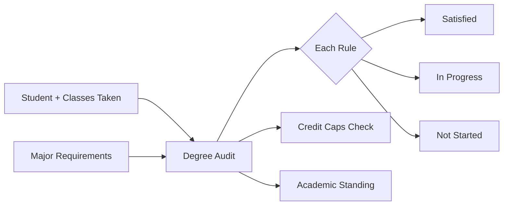
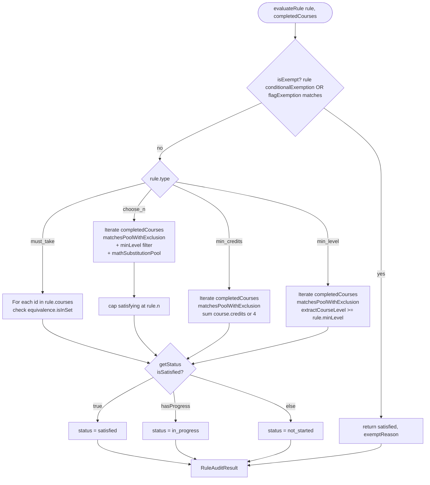
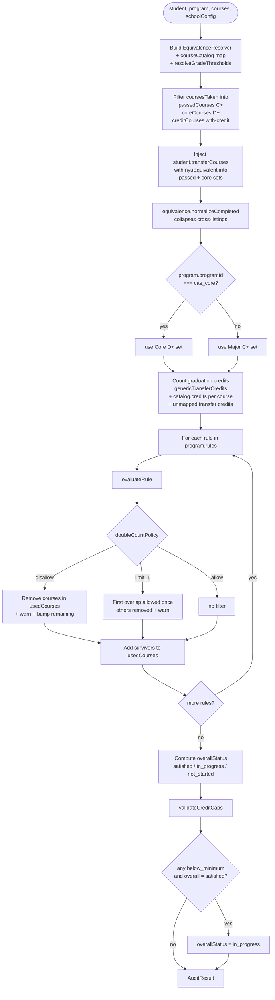

# Audit Subsystem

## TL;DR

This is the "are you on track to graduate" checker. Given a student and the rules of their major, it walks through every requirement and decides whether each one is done, partially done, or not started yet. It also adds up total credits, checks GPA, makes sure transfer credits and pass/fail courses are within limits, and catches problems like trying to count the same class for two different requirements. When a student has multiple majors or minors, it also checks the school's rules about how many courses can overlap between them. The headline degree audit (`run_full_audit`) is now **DPR-only**: it reads the official NYU degree report (Albert Degree Progress Report) directly and refuses if none is loaded — there is no authored-rules fallback anymore. The rule engine in this folder (`degreeAudit`, `crossProgramAudit`, and the side calculators) still exists and still runs, but it's now used by the *what-if* tools (`what_if_audit`, `check_overlap`) layered on top of the coursework derived from the DPR.



---

## 1. Overview

The audit subsystem is the engine's **program-rule evaluator**. It takes a `StudentProfile` (declared programs, courses-taken, transfer courses, flags) and a `Program` (a set of authored requirement rules) and produces a deterministic verdict for each requirement: satisfied, in-progress, or not-started, plus credit caps, cross-program double-counting checks, academic standing, and pool-restricted GPA values.

This is **not** the DPR pipeline. The DPR (Degree Progress Report) is NYU's pre-parsed Albert audit, ingested elsewhere in the engine and surfaced verbatim when present. The audit subsystem in this folder is the **rule engine** plus a set of side-calculators (GPA, standing, P/F, SPS, credit caps) that enforce school-level policy by walking the major's authored requirement rules.

Key distinction: **`run_full_audit` no longer calls this subsystem.** After the DPR-only pivot, `run_full_audit` requires `session.degreeProgressReport` (its `validateInput` refuses otherwise) and returns DPR-derived `AuditResult`s exclusively — the old authored-rules fallback (walking each declared program through `degreeAudit()`, then layering `validateCreditCaps()` + `calculateStanding()`) has been **removed**. `degreeAudit` and `crossProgramAudit` are still live, but they are reached through the what-if tools (`what_if_audit` wraps `whatIfAudit()`/`degreeAudit`; `check_overlap` wraps `crossProgramAudit()`), which themselves require a DPR and layer the rule engine on top of DPR-derived coursework. The side-calculators (`computePoolGpa`, etc.) are also still used — `run_full_audit` calls `computePoolGpa` on the DPR's `courseHistory` for per-program GPA.

### Module map

| File | Role |
|---|---|
| `packages/engine/src/audit/ruleEvaluator.ts` | Evaluates a single `Rule` against a normalized completed-course set. |
| `packages/engine/src/audit/degreeAudit.ts` | Walks one `Program`'s rules, applies double-count policy, layers credit caps. |
| `packages/engine/src/audit/crossProgramAudit.ts` | Runs `degreeAudit` per declared program, enforces school-level pair/triple-count limits. |
| `packages/engine/src/audit/gpaCalculator.ts` | Computes GPA restricted to a pool of course IDs / wildcard patterns. |
| `packages/engine/src/audit/passfailGuard.ts` | Flags P/F grade-mode violations against major / Core / per-term / career caps. |
| `packages/engine/src/audit/spsEnrollmentGuard.ts` | Decides whether an SPS course (`-UC` / `-CE`) is enrollable for a given home school. |
| `packages/engine/src/audit/academicStanding.ts` | Computes cumulative GPA + standing level (good-standing → final-probation → dismissed). |
| `packages/engine/src/audit/creditCapValidator.ts` | Enforces residency floor, transfer cap, online cap, P/F cap, CSCI floor (CS major). |

---

## 2. Rule Evaluator

`packages/engine/src/audit/ruleEvaluator.ts`

The rule evaluator is the lowest layer. It takes one `Rule` and one set of normalized completed course IDs and returns a `RuleAuditResult` (status + courses satisfying + courses remaining + remaining count). Entry point is `evaluateRule()` at line 27.

### Inputs to `evaluateRule`

- `rule` — the rule being evaluated.
- `completedCourses` — a `Set<string>` of canonical (cross-listing-normalized) course IDs the student has completed at a passing grade.
- `courseCatalog` — `Map<courseId, Course>` (credits + departments lookup).
- `equivalence` — an `EquivalenceResolver` that handles cross-listed courses (e.g., `CSCI-UA 310` ↔ `CS-UY 2124`).
- `declaredPrograms` — array of program IDs the student has declared (for conditional-exemption rules).
- `studentFlags` — student flags (for flag-based exemptions, e.g., transfer-student exemptions).

### Exemption shortcut (line 36)

Before evaluating, `isExempt()` (line 65) checks the rule's `conditionalExemption` and `flagExemption` lists. If any declared program is in `conditionalExemption`, OR any flag in `flagExemption`, the rule short-circuits to satisfied with an `exemptReason` of `rule.exemptionLabel` or `"Exempt"`. No courses are claimed.

### Supported rule shapes

The rule type is dispatched by `rule.type`. Four rule kinds exist:

#### must_take (line 103)
"Student must complete every course in this list."
- For each course in `rule.courses`, ask `equivalence.isInSet()` whether the student has it (via cross-listing).
- `coursesSatisfying` = ones the student has; `coursesRemaining` = the rest; `remaining` = count of missing.
- Satisfied when `remaining.length === 0`.

#### choose_n (line 131)
"Pick N courses from this pool."
- Iterate the completed courses, keep those that match `rule.fromPool` (with optional `excludeFromPool`) via `matchesPoolWithExclusion()` (line 92). Pool patterns can be exact IDs or wildcards like `"CSCI-UA *"`.
- If `rule.minLevel` is set, only count courses whose extracted level (from `extractCourseLevel()` at line 279) is at or above the minimum.
- If `rule.mathSubstitutionPool` + `rule.maxMathSubstitutions` are set, add up to that many courses from the substitution pool that were completed.
- **Cap at `rule.n`** (line 168): if the student has more than `n` matching courses, slice to the first `n` in iteration order. This is intentional — it prevents inflating `sharedCourses` in the cross-program audit, which would cause spurious overflow warnings.
- `coursesRemaining`: when the rule is satisfied, this is `[]` (returning a non-empty list would mislead UIs). Otherwise, the list of pool patterns the student has not completed (wildcards always listed; exact IDs only if not completed).

#### min_credits (line 196)
"Accumulate at least N credits from this pool."
- For each completed course matching the pool (with exclusions), look up `course.credits` from the catalog. If the course is missing, assume **4 credits** (line 212).
- `remaining` = `Math.max(0, minCredits − earned)`.
- Satisfied when `creditsRemaining === 0`.

#### min_level (line 232)
"Earn at least N courses at or above level X from this pool."
- For each pool-matching completed course, extract the course level via `extractCourseLevel()` (course IDs ending in 3 digits → `Math.floor(n / 100) * 100`, so `CSCI-UA 310` → `300`).
- Keep ones at or above `rule.minLevel`; need `rule.minCount` of them total.
- `remaining` = `Math.max(0, minCount − satisfying)`.

### Pool matching

- `matchesPool()` (line 78): a course matches if (a) any wildcard pattern's prefix matches the course ID OR the canonical (cross-listing-resolved) ID, OR (b) any exact pattern's canonical form equals the course's canonical form.
- `matchesPoolWithExclusion()` (line 92): pool match AND not in any exclude pattern.

### Status resolution (line 266)

```
isSatisfied  → "satisfied"
hasProgress  → "in_progress"
otherwise    → "not_started"
```

`hasProgress` here means "at least one matching/satisfying course found" — a partially-fulfilled choose_n at 2 of 3, for instance, is in_progress.

### Mermaid: rule evaluator flow



---

## 3. Degree Audit

`packages/engine/src/audit/degreeAudit.ts`

`degreeAudit(student, program, courses, schoolConfig)` (line 70) is the per-program orchestrator. It produces a single `AuditResult`.

### Step-by-step

1. **Build helpers (lines 76–79).**
   - `EquivalenceResolver` over the course catalog (handles cross-listings).
   - `courseCatalog: Map<id, Course>`.
   - Resolve major-grade + core-grade sets via `resolveGradeThresholds()` (line 52). If `SchoolConfig.gradeThresholds.major` / `.core` is set, expand it via `gradesAtOrAbove()`. Otherwise fall back to `CAS_DEFAULTS`:
     - Major grades: `A, A−, B+, B, B−, C+, C` (C or better).
     - Core grades: `A … D` (D or better).
   - `CREDIT_GRADES` (graduation-credit floor, never config-driven): `A … D, P`.

2. **Split coursesTaken into three filtered lists (lines 82–91).**
   - `passedCourses` — grades in `MAJOR_GRADES` (counts for major + prerequisites).
   - `coreCourses` — grades in `CORE_GRADES` (counts for Core, which uses a lower floor).
   - `creditCourses` — grades in `CREDIT_GRADES` (counts toward the 128-credit graduation total; this is the broadest set — C− and D earn credits even when they don't satisfy major).

3. **Inject transfer course equivalents (lines 100–115).**
   - For each `student.transferCourses[].nyuEquivalent`, push the equivalent NYU course ID into BOTH `passedCourseIds` and `coreCourseIds` (transfers satisfy major AND Core because they have no NYU grade).
   - Also synthesize a `CourseTaken`-shaped entry with grade `"TR"` and the transfer credit value.
   - Track `transferCreditsFromMapped` separately so it can be added to graduation totals.

4. **Normalize each set through `EquivalenceResolver.normalizeCompleted()` (lines 118–119).**
   - This collapses cross-listed courses to a single canonical ID. Equivalence warnings (e.g., student claims both sides of a cross-listing pair) are kept in `warnings`.

5. **Pick the right completion set per program type (lines 125–126).**
   - If `program.programId === "cas_core"`, use the Core (D+) set.
   - Otherwise (major / minor), use the major (C+) set.

6. **Count graduation credits (lines 134–170).**
   - Start from `student.genericTransferCredits ?? 0`.
   - For each course in the deduplicated `normalizedCredit` set, look up credits from the catalog (or use `ct.credits`, default 4).
   - Add `transferCreditsFromMapped`.
   - Add any unmapped transfer credits (transfer courses with no `nyuEquivalent`).
   - Separately, count CSCI-UA credits among the `normalizedMajor` set (only used downstream by the CS-major flag).

7. **Initialize double-count tracking (lines 173–175).**
   - `usedCourses: Set<string>` — courses claimed by an earlier disallow / limit_1 rule.
   - `doubleCountedOnce: Set<string>` — courses already used as the single permitted double-count for a limit_1 rule.

8. **Evaluate each rule with double-count policy applied (lines 181–255).**
   For each rule:
   - Call `evaluateRule(rule, normalized, courseCatalog, equivalence, declaredProgramIds, flags)`.
   - **`doubleCountPolicy === "disallow"`**: remove any course in `result.coursesSatisfying` that's already in `usedCourses`. For each removed course, push a warning `"<courseId> already counted toward another requirement; cannot double-count for "<label>""` and add the course back to `coursesRemaining`. Bump `remaining` by the number removed and recompute status. Mark the surviving courses as used.
   - **`doubleCountPolicy === "limit_1"`**: walk `coursesSatisfying` in order. The first course that's already in `usedCourses` is allowed to double-count (added to `doubleCountedOnce`); any subsequent overlap is removed with a warning. Non-overlapping courses are marked as used.
   - **`doubleCountPolicy === "allow"`** (or undefined): no restriction; result is returned as-is.

9. **Compute overall status (lines 258–266).**
   - `satisfied` if every rule is satisfied.
   - `in_progress` if some rules are satisfied or in-progress.
   - `not_started` otherwise.

10. **Run credit cap validators (lines 282–303).**
    - Detect "is this a CS program?" by scanning every rule's pool for a `CSCI-UA` prefix.
    - Call `validateCreditCaps(student, courses, { isCSMajor, schoolConfig })`.
    - Push every cap warning's `.message` into `result.warnings`.
    - If any warning has `direction === "below_minimum"` AND the overall status was `"satisfied"`, downgrade to `"in_progress"`.

### Output shape

```
AuditResult {
  studentId, programId, programName, catalogYear, timestamp,
  overallStatus: "satisfied" | "in_progress" | "not_started",
  totalCreditsCompleted, totalCreditsRequired,
  rules: RuleAuditResult[],  // one per program.rule
  warnings: string[],        // equivalence + double-count + credit-cap messages
}
```

### Mermaid: degree audit pipeline



---

## 4. Cross-Program Audit

`packages/engine/src/audit/crossProgramAudit.ts`

When a student has multiple declared programs (double major, major + minor, etc.), `crossProgramAudit()` (line 67) runs `degreeAudit` once per declared program, then enforces school-level double-counting limits across them.

### What it does

1. **Per-program audits (lines 74–85).**
   - For each `student.declaredPrograms[]`, look up the resolved `Program` from the passed-in `Map`. Unknown programs are skipped (not thrown — so partial declarations don't brick the run).
   - Run `degreeAudit(student, program, courses, schoolConfig)`. Stash the result in `entries: ProgramAuditEntry[]`.

2. **Build the shared-courses map (lines 87–105).**
   - For each per-program audit, walk every rule's `coursesSatisfying` and deduplicate per program (a course used by 3 rules in one program counts once for that program's tally).
   - Build `courseId → programIds[]` from those dedupe sets.
   - Any course appearing in 2+ programs is pushed to `sharedCourses[]`.

3. **Triple-count check (lines 113–127).**
   - If `schoolConfig.doubleCounting.noTripleCounting === true`, every shared course with 3+ programs becomes a `"triple_count"` warning naming all programs.
   - Independent of pair-limit checks.

4. **Pair-limit checks (lines 130–220).**
   - Build a map of program declaration type by ID (so we know whether each program is `major`, `minor`, or `concentration`).
   - For each shared course, enumerate every pair (i, j) of programs it appears in. Bucket by `"programA||programB"` (sorted).
   - For each pair-bucket, compute the pair kind via `pairKindOf()` (line 138):
     - `major-major` → `defaultMajorToMajor`
     - `major-minor` → `defaultMajorToMinor`
     - `minor-minor` → `defaultMinorToMinor`
     - `concentration-concentration` → `defaultConcentrationToConcentration`
     - `concentration-major` → `defaultMajorToConcentration`
     - `concentration-minor` → `defaultMinorToConcentration`
   - Look up the limit via `pairLimit()` (line 150). Reads `schoolConfig.doubleCounting[key]`. If `overrideByProgram` is set per program ID, the MORE RESTRICTIVE override (smaller number) wins.
   - If `bucket.courses.length > limit`, every course beyond the limit (in `slice(limit)` order) gets an `"exceeds_pair_limit"` warning naming the two programs, their types, and the limit.

### Output shape

```
CrossProgramAuditResult {
  studentId,
  programs: ProgramAuditEntry[],      // per-program audit objects
  warnings: DoubleCountWarning[],     // { courseId, programIds, kind, message }
  sharedCourses: { courseId, programIds[] }[],
}
```

`kind` is either `"exceeds_pair_limit"` or `"triple_count"`.

### What this catches

- A CS major + Math minor sharing 5 courses when the school limit is 2 → 3 `"exceeds_pair_limit"` warnings.
- A course shared across major + minor + concentration when `noTripleCounting` is on → 1 `"triple_count"` warning.
- A concentration-concentration pair with no configured limit → silently allowed.

### Out of v1 scope (per code comments in lines 11–14, intentionally documented)

The code only supports the default pair limits + `noTripleCounting`. Course substitutions across programs and concentration/track-aware double-counting are not implemented.

---

## 5. GPA Calculator

`packages/engine/src/audit/gpaCalculator.ts`

This module computes a GPA restricted to a pool of course IDs / wildcard patterns. Used for things like "GPA in economics courses" (Econ honors track requires 3.65) — anywhere a bulletin asks for a GPA over a subset.

### Grade-point table (line 20)

| Grade | Points |
|---|---|
| A | 4.000 |
| A− | 3.667 |
| B+ | 3.333 |
| B | 3.000 |
| B− | 2.667 |
| C+ | 2.333 |
| C | 2.000 |
| C− | 1.667 |
| D+ | 1.333 |
| D | 1.000 |
| F | 0.000 |

F is included so a failed pool course drags the pool GPA down, even though F earns no credits.

### Exclusions

A grade is excluded from this GPA whenever it's NOT a key in the `GRADE_POINTS` map (line 78). That means: `P`, `TR`, `W`, `I`, `NR`, plus any non-standard string. Only letter grades A through F count.

### `computePoolGpa(coursesTaken, pool, courseCatalog)` (line 56)

1. Split `pool` into wildcard prefixes (anything containing `*`, e.g. `"ECON-UA *"`) and exact IDs.
2. For each `CourseTaken`:
   - Skip if grade isn't in `GRADE_POINTS`.
   - Check pool membership: exact-ID set, OR any wildcard prefix matches via `id.startsWith(p)`.
   - Look up credits from `courseCatalog.get(id)?.credits ?? ct.credits ?? 4`.
   - Accumulate `points = gradePoint × credits` and credit total.
3. `gpa = totalPoints / totalCredits`, rounded to 3 decimals via `Math.round(raw * 1000) / 1000`. Returns 0 if no graded courses matched.

### `PoolGpaResult` shape

```
{
  gpa: number,                       // 3 decimals
  countedCourses: number,            // courses that contributed
  countedCredits: number,            // sum of denominators
  contributingCourseIds: string[],   // matched + graded course IDs
}
```

### `computeMajorGpaByDeptPrefix(coursesTaken, deptPrefix)` (line 109)

Sugar over `computePoolGpa` that builds the pool as `[\`${deptPrefix} *\`]`. Used for majors whose pool is a single department prefix (e.g., CS BA can use `"CSCI-UA"`). Majors that span departments (Econ requires MATH-UA 131/132 too) must call `computePoolGpa` directly with the explicit pool.

### Pool-matching semantics

Identical to `ruleEvaluator.matchesPool` (per the docstring at line 50), but with one difference: this module does NOT consult the `EquivalenceResolver`. It matches the literal `ct.courseId`, not the canonical cross-listing. Callers who need cross-listing normalization must do it before passing the pool.

---

## 6. Pass/Fail Guard

`packages/engine/src/audit/passfailGuard.ts`

`checkPassFailViolations(coursesTaken, majorRules, coreRules, courses, schoolConfig)` (line 49) returns an array of `PassFailViolation` objects naming every course that breaks a P/F rule.

### What counts as a P/F-taken course

A `CourseTaken` is P/F-graded if `ct.gradeMode === "pf"` OR `ct.grade.toUpperCase() === "P"` (line 109).

### The four rules enforced

#### Rule 1 — P/F not allowed for major courses (line 126)

For each major rule (`Rule[]`), extract its course pool via `getPoolFromRule()` (line 210). The pool is:
- `must_take` → `rule.courses`
- `choose_n` → `[...rule.fromPool, ...(rule.mathSubstitutionPool ?? [])]`
- `min_credits` / `min_level` → `rule.fromPool`

A course is "in the major pool" if its ID is in the exact-set OR matches any wildcard prefix. The `CS_NOT_APPLICABLE` list (line 95) — courses like `CSCI-UA 2`, `CSCI-UA 4`, `CSCI-UA 60/61`, `330`, `380`, `381`, `520`, `521`, `897`, `898`, `997`, `998` — is exempted because per CAS policy they don't apply to the CS BA major in the first place.

If a P/F-graded course is in the major pool (and not in the not-applicable list), emit an `"error"` violation with `[CS-MAJOR]` tag.

#### Rule 2 — P/F not allowed for Core courses (line 137)

Same pool-extraction logic on `coreRules`. Foreign-language Core rules (identified by `rule.ruleId === "core_foreign_lang"`, line 82) get added to a separate `flBelowIntermediateII` set; any P/F-graded course in that pool is exempt from this check (FL below Intermediate II can be taken P/F per CAS policy).

#### Rule 3 — P/F career credit cap (line 159)

Default 32 credits per career (`CAS_DEFAULTS.passFail.careerLimit`). Configurable: `schoolConfig.passFail.careerLimitType === "credits"` reads `schoolConfig.passFail.careerLimit`. Other `careerLimitType` values (`"courses"`, `"percent_of_program"`) currently fall through to the CAS default — those forms aren't implemented at this layer.

If total P/F credits exceed the limit, emit a single career-level error.

#### Rule 4 — Per-term P/F cap (line 173)

Default 1 per term. Configurable via `schoolConfig.passFail.perTermLimit`. The "term" bucket is computed via `bucketForTerm()` (line 198):
- `schoolConfig.passFail.perTermUnit === "semester"` (default) → bucket = raw `ct.semester` (e.g., `"2024-fall"`).
- `"academic_year"` → bucket = `"AY-<startYear>"`. The academic year is `fall → spring → summer`, so `2024-fall`, `2025-spring`, `2025-summer`, and `2025-january` all map to `AY-2024`. `2025-fall` starts a new AY.

If a bucket has more than the limit, emit an error tagged with the first violator's course ID. Message uses `"academic year"` vs `"term"` depending on the unit.

### Output shape

```
PassFailViolation {
  courseId: string,        // empty string for career-limit violation
  reason: string,
  severity: "error" | "warning",
}
```

In practice everything emitted is `"error"`; the `"warning"` slot is reserved.

---

## 7. SPS Enrollment Guard

`packages/engine/src/audit/spsEnrollmentGuard.ts`

`decideSpsEnrollment(courseId, homeSchoolConfig, courseCatalog)` (line 47) decides whether a student in a given home school can enroll in an SPS course for credit toward their degree.

### SPS detection

`isSpsCourse(courseId)` (line 122) returns true if the course ID matches the regex `/-UC\b|-CE\b/`. SPS = NYU School of Professional Studies, which uses `-UC` and `-CE` course-id suffixes.

If the course is NOT an SPS course, the decision is `{ enrollment: "allowed", reason: "not_an_sps_course" }`. This guard only guards SPS — non-SPS cross-school enrollments are handled by the residency / non-home-school caps elsewhere.

### Decision logic, in order

1. **No SPS policy on the school config (line 60).** Fail closed: `{ enrollment: "blocked", rule: "school_total_ban", reason: "No SPS policy defined for <schoolId>; SPS enrollment blocked by default." }`.

2. **Total ban (line 71).** If `policy.allowed === false` (Stern, Tandon per the embedded provenance comment), return `"school_total_ban"` with `"<SchoolName>: SPS courses are not allowed for credit toward the degree."`

3. **Allowlist prefix check (line 81).** Scan `policy.allowedPrefixes`. If no prefix matches the course ID via `courseId.startsWith(prefix)`, return `"prefix_not_in_allowlist"` with a message listing the allowed prefixes.

4. **Excluded course types (line 94).** If `policy.excludedCourseTypes` is non-empty AND a `courseCatalog` was provided, derive course tags via `courseTagsOf()` (line 132): heuristically inspects `course.title` for `"internship"` / `"independent study"` substrings. If any tag is in `excludedCourseTypes`, return `"course_type_excluded"` with a message naming the blocking tag. (Per the inline note, `Course.tags` doesn't exist as a first-class field at v1; this is a heuristic stub.)

5. **Otherwise allowed (line 110).** Returns `{ enrollment: "allowed", reason: "<courseId> matches allowlist prefix \"<matched>\" for <SchoolName>.", creditType: policy.creditType }`.

### Output shape

```
SpsDecision =
  | { enrollment: "allowed", reason: string, creditType?: string }
  | { enrollment: "blocked", reason: string, rule: "school_total_ban" | "prefix_not_in_allowlist" | "course_type_excluded" }
```

---

## 8. Academic Standing

`packages/engine/src/audit/academicStanding.ts`

`calculateStanding(coursesTaken, semestersCompleted, schoolConfig)` (line 113) produces a `StandingResult` summarizing cumulative GPA, completion rate, and standing level.

### Cumulative GPA computation (lines 126–174)

Walks every `CourseTaken`. For each course:

- Grade `"TR"` (transfer): **skipped entirely**. Not in attempted, not in GPA. (CAS bulletin: transfer credits omitted from cumulative GPA.)
- Grade `"W"`, `"I"`, `"NR"`: count as **attempted** credits but not earned and not in GPA.
- Grade `"P"`: count as attempted AND **completed** (earned credit), but NOT in GPA.
- Grade `"F"`: in GPA at 0 points, attempted, NOT completed.
- Letter grades (A through D): in GPA at the corresponding points, attempted, AND completed if in `PASSING_GRADES` (which is A through D plus P, line 96).

`cumulativeGPA = totalGradePoints / totalGPACredits` (0 if no GPA credits). `completionRate = totalCompletedCredits / totalAttemptedCredits` (1 if no attempted).

The GPA points table (line 81) is the same as `gpaCalculator.ts`: A=4.0 through D=1.0, F=0.

### Standing level resolution (lines 197–232)

The result is a single `StandingLevel`:

| Level | Trigger |
|---|---|
| `good_standing` | Default. `cumulativeGPA >= gpaMin`. |
| `academic_concern` | `cumulativeGPA < gpaMin` (and not `final_probation` / `dismissed`). |
| `continued_concern` | Declared in the type but not emitted by `calculateStanding`. Reserved. |
| `required_leave` | Declared in the type but not emitted. Reserved. |
| `pre_dismissal` | Declared in the type but not emitted. Reserved. |
| `final_probation` | `schoolConfig.finalProbationGpaFloor` is set AND `cumulativeGPA < finalProbationFloor` AND level ≠ `dismissed`. (Tandon's 1.5 floor.) |
| `dismissed` | `semestersCompleted >= dismissalAfter (=2)` AND `completionRate < dismissalThreshold (=0.50)`. |

`gpaMin` resolution (lines 189–190):
- If `schoolConfig.gpaTierTable` exists, `resolveTieredGpaMin()` (line 23) finds the largest tier whose `semestersCompleted` is `<=` the student's, falling through to the open-ended (`null`) row if past the highest finite tier.
- Otherwise `schoolConfig.overallGpaMin ?? 2.0`.

`dismissalThreshold` and `dismissalAfter` (lines 191–192) are fixed CAS values: 0.50 and 2 semesters. NOT config-driven.

`goodStandingThreshold` (lines 193–195): `schoolConfig.goodStandingReturnThreshold ?? 0.75`. Used only to emit a completion-rate warning (not to change the level).

### Warnings emitted

- `"Cumulative GPA is below the X.X minimum required for good academic standing."` (when below `gpaMin`).
- `"Completion rate N% is below M% after K semesters — may result in dismissal."` (when dismissal triggers).
- `"Cumulative GPA below X.X triggers Final Probation regardless of credits completed (<school> policy)."` (when final-probation floor triggers).
- `"Credit completion rate is N% — below M% threshold required to return to good standing."` (when completion below `goodStandingThreshold` AND not dismissed).

### Output shape

```
StandingResult {
  level: StandingLevel,
  cumulativeGPA: number,           // 3 decimals
  semesterGPA?: number,            // unused by calculateStanding itself
  completionRate: number,          // 3 decimals
  inGoodStanding: boolean,         // cumulativeGPA >= gpaMin
  message: string,
  warnings: string[],
}
```

### `computeSemesterGPA(coursesTaken, semester)` (line 254)

Standalone helper. Filters to one semester, applies the same grade exclusions (P, TR, W, I, NR all skipped), divides points by credits, rounds to 3 decimals. Returns 0 if no graded courses.

---

## 9. Credit Cap Validator

`packages/engine/src/audit/creditCapValidator.ts`

`validateCreditCaps(student, courses, options)` (line 68) runs a sequence of per-cap checks and returns an array of `CreditCapWarning` objects.

### CAS defaults (line 21)

| Bucket | Default |
|---|---|
| Residency suffix | `-UA` |
| Residency minimum | 64 credits |
| Non-home-school max | 16 credits |
| Online max | 24 credits |
| Transfer max | 64 credits |
| Advanced-standing max | 32 credits |
| P/F career limit | 32 credits |
| CSCI-UA minimum (CS major) | 32 credits |

### Schools override the maxima via `SchoolConfig.creditCaps` (line 115)

`findCreditCapMax(cfg, type)` looks up `cfg.creditCaps.find(c => c.type === type)?.maxCredits`. The supported `CreditCapType`s are `non_home_school`, `online`, `transfer`, `advanced_standing`. Residency minimum comes from `cfg.residency.minCredits`. P/F career limit comes from `cfg.passFail.careerLimit`.

### Individual checks

#### Residency (line 145) — `direction: "below_minimum"`

Reads `student.uaSuffixCredits`. If undefined, skip (not yet tracked). If `< residencyMin(cfg)`, emit:
`"Residency requirement: <ua>/<limit> -UA credits completed. Need <limit−ua> more <schoolName> courses."`

(The suffix and school label are read from `cfg?.residency?.suffix` and `cfg?.name`.)

#### Non-CAS (non-home-school) credits (line 170) — `direction: "above_maximum"`

Reads `student.nonCASNYUCredits`. If undefined, skip. If `> nonHomeSchoolMax(cfg)`, emit:
`"Non-CAS NYU credit limit exceeded: <n>/<limit> credits. Only <limit> credits from other NYU schools count toward degree."`

#### Online (line 193) — `direction: "above_maximum"`

Reads `student.onlineCredits`. If undefined, skip. If `> onlineMax(cfg)`, emit:
`"Online credit limit exceeded: <n>/<limit> credits. Maximum <limit> online credits count toward degree."`

#### Transfer (line 216) — `direction: "above_maximum"`

Total transfer is computed via `computeTransferCredits()` (line 321): `student.genericTransferCredits + sum(student.transferCourses[].credits)`. If `> transferMax(cfg)`, emit:
`"Transfer credit limit exceeded: <n>/<limit> credits. Maximum <limit> transfer credits allowed."`

#### Advanced standing (line 239) — `direction: "above_maximum"`

Uses the same `computeTransferCredits()` value (AP/IB/A-Level + prior college all lumped in here). If `> advancedStandingMax(cfg)`, emit:
`"Advanced standing limit exceeded: <n>/<limit> credits from AP/IB/A-Level/prior college. Maximum <limit> for first-year matriculants."`

#### P/F career (line 261) — `direction: "above_maximum"`

Reads `student.passfailCredits`. If undefined, skip. If `> passfailCareerLimit(cfg)`, emit:
`"Pass/Fail credit limit exceeded: <n>/<limit> credits. Maximum <limit> P/F credits allowed across entire career."`

#### CSCI-UA minimum (CS major only) (line 286) — `direction: "below_minimum"`

Runs only when `options.isCSMajor === true` (which `degreeAudit` infers by scanning the program's pools for a `CSCI-UA` prefix, line 282).

`passingGrades` are CAS major grades (`A, A−, B+, B, B−, C+, C`). Iterates `student.coursesTaken`; for each course at a passing grade, checks `course.departments.includes("CSCI-UA")` (or, if not in the catalog, that the ID starts with `CSCI-UA`). Sums `course.credits ?? ct.credits ?? 4`. If total `< 32`, emit:
`"CS major residency: <n>/32 CSCI-UA credits completed. Need <32−n> more CSCI-UA credits."`

NOT config-driven — CS-major-specific.

### Output shape

```
CreditCapWarning {
  type: "residency_ua" | "csci_minimum" | "non_cas_max" | "online_max" |
        "transfer_max" | "advanced_standing_max" | "passfail_max",
  current: number,
  limit: number,
  direction: "below_minimum" | "above_maximum",
  message: string,
}
```

### Note on F-1 floor and per-semester ceiling

The F-1 full-time floor (`schoolConfig.f1FullTimeMinCredits`, default 12) and the per-semester ceiling (`schoolConfig.maxCreditsPerSemester`) are NOT enforced in this module. They are surfaced only by the `get_credit_caps` tool at `packages/engine/src/agent/tools/getCreditCaps.ts:79` and `:58`. This module is concerned with cumulative/career caps only.

---

## 10. How These Tie Together

### `run_full_audit` call graph

`packages/engine/src/agent/tools/runFullAudit.ts` is the entry point. **DPR-only** — there is one path.

`validateInput` requires `session.degreeProgressReport && session.student` and refuses otherwise ("I can only run an audit from your Albert Degree Progress Report (DPR). Please upload your DPR and try again."). The old authored-rules fallback was removed; the no-DPR branch in `call` is now unreachable and throws if ever hit.

#### DPR path (the only path)

When `session.degreeProgressReport` is loaded (guaranteed by `validateInput`):
- `dprToAuditResults()` returns `AuditResult[]` derived from NYU's pre-computed numbers.
- `computePoolGpa()` (from this subsystem) is called per program to derive per-program GPAs from the DPR's `courseHistory` grades restricted to each audit's `coursesSatisfying` pool union.
- **None of `degreeAudit`, `calculateStanding`, or `validateCreditCaps` runs.** Standing is synthesized directly from `dpr.cumulative.cumulativeGpa`.

The deterministic rule engine (`degreeAudit` + `crossProgramAudit` + `calculateStanding` + `validateCreditCaps`) is **not** dead — it's just no longer reached via `run_full_audit`. It is reached via the what-if tools (next subsection).

### `degreeAudit` internal call graph

```
degreeAudit (degreeAudit.ts:70)
├── resolveGradeThresholds                  (degreeAudit.ts:52)
├── new EquivalenceResolver                  (equivalence/)
├── equivalence.normalizeCompleted × 3       (major / core / credit sets)
├── for each rule:
│   └── evaluateRule                          (ruleEvaluator.ts:27)
│       ├── isExempt                          (ruleEvaluator.ts:65)
│       └── one of:
│           ├── evaluateMustTake              (ruleEvaluator.ts:103)
│           ├── evaluateChooseN               (ruleEvaluator.ts:131)
│           ├── evaluateMinCredits            (ruleEvaluator.ts:196)
│           └── evaluateMinLevel              (ruleEvaluator.ts:232)
└── validateCreditCaps                        (creditCapValidator.ts:68)
    ├── checkResidencyCredits
    ├── checkNonCASCredits
    ├── checkOnlineCredits
    ├── checkTransferCredits
    ├── checkAdvancedStandingCredits
    ├── checkPassFailCredits
    └── (if isCSMajor) checkCSCICredits
```

### Higher-level orchestrators

```
crossProgramAudit (crossProgramAudit.ts:67)   ← reached via check_overlap (requires a DPR)
└── for each declaration:
    └── degreeAudit                           (degreeAudit.ts:70)
        └── [...as above]

whatIfAudit / degreeAudit                     ← reached via what_if_audit (requires a DPR)
```

Both what-if tools require `session.degreeProgressReport` in their own `validateInput` (`checkOverlap.ts:30`, `whatIfAudit.ts:72`) and run the rule engine against the DPR-derived coursework on the session's `student`.

### Standalone calculators reachable from other tools

- `calculateStanding` — called by `get_academic_standing` (`agent/tools/getAcademicStanding.ts:56`). After the DPR-only pivot the guard was **flipped**: `get_academic_standing` now REQUIRES a DPR (`getAcademicStanding.ts:39-46`) and refuses when none is loaded — asking the student to upload it. (Previously it refused *when* a DPR was loaded and bounced the user to `run_full_audit`.) For authoritative GPA / cumulative credits / requirement status the tool's description still points at `run_full_audit`; `get_academic_standing` is now scoped to probation / SAP standing detail. `run_full_audit` no longer calls `calculateStanding` (it synthesizes standing from the DPR's cumulative block).
- `computePoolGpa` / `computeMajorGpaByDeptPrefix` — called by `run_full_audit` for per-program GPA on the DPR path.
- `checkPassFailViolations` — exposed for tools that need P/F lint independent of `degreeAudit`.
- `decideSpsEnrollment` / `isSpsCourse` — exposed for SPS-related tools / checks; not invoked from `degreeAudit` itself.

### Where school config flows

Every public function in this subsystem accepts an optional `schoolConfig: SchoolConfig | null`:

- `degreeAudit` → uses it for `resolveGradeThresholds` (major/core letter floors) and passes it through to `validateCreditCaps`.
- `crossProgramAudit` → passes it to each `degreeAudit` call AND reads `schoolConfig.doubleCounting` for pair limits + triple-count flag.
- `calculateStanding` → reads `overallGpaMin`, `gpaTierTable`, `goodStandingReturnThreshold`, `finalProbationGpaFloor`, `name`.
- `validateCreditCaps` → reads `residency.minCredits`, `residency.suffix`, `creditCaps[]`, `passFail.careerLimit`, `name`.
- `checkPassFailViolations` → reads `passFail.perTermLimit`, `passFail.perTermUnit`, `passFail.careerLimit`, `passFail.careerLimitType`.
- `decideSpsEnrollment` → reads `spsPolicy.{allowed, allowedPrefixes, excludedCourseTypes, creditType}`, `name`, `schoolId`.
- `computePoolGpa` → does NOT take school config (purely a GPA math helper).

When `schoolConfig` is `null` everywhere, the CAS defaults baked into each module's `CAS_DEFAULTS` constant are used. This is the v1 fallback posture.
