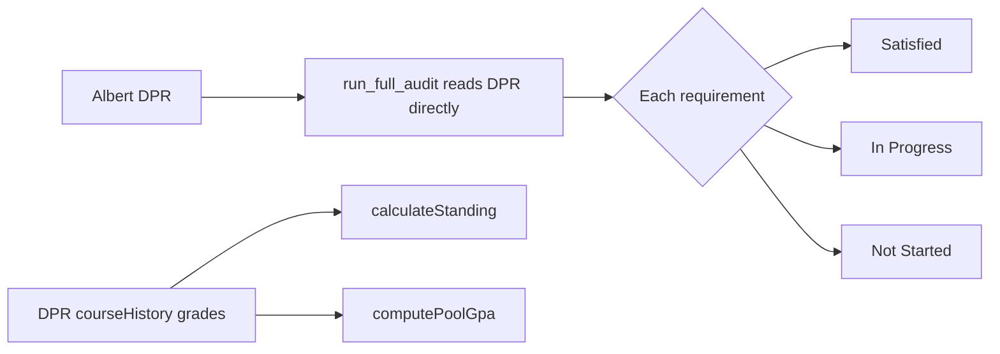
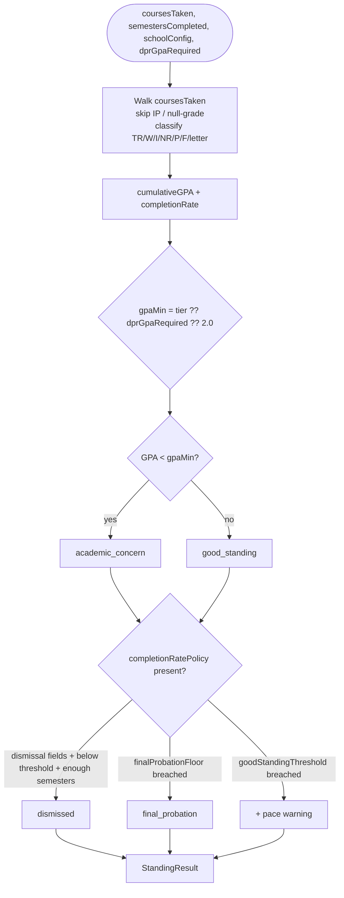

# Audit Subsystem

> Last verified against code: 2026-06-10 (post planning-engine rebuild, PRs #35-#41).

## TL;DR

This is the "are you on track to graduate" support layer. After the DPR-only pivot, the headline degree audit (`run_full_audit`) reads NYU's official Degree Progress Report directly and refuses if none is loaded — there is no authored-rules audit anymore. The whole authored rule engine that used to live in this folder (`degreeAudit`, `evaluateRule`, `crossProgramAudit`, plus the credit-cap / pass-fail / SPS-enrollment side-guards) was **removed** during the June 4-5 rule-engine decommission. What survives in `packages/engine/src/audit/` is just two pure calculators: **academic standing** (cumulative GPA + standing level + pace policy) and **pool GPA** (a GPA restricted to a subset of courses, e.g. "GPA in economics courses"). Those two are what the agent's standing and audit tools call on top of DPR-derived coursework.



---

## 1. Overview

The audit subsystem is now a pair of **pure math calculators** over a student's coursework. It does NOT evaluate authored program-requirement rules — that engine is gone. The authoritative requirement verdicts (satisfied / in-progress / not-started, credits, GPA, residency, P/F, time limit) come from the student's parsed DPR, surfaced by `run_full_audit` reading `dpr.requirementGroups` and `dpr.cumulative` directly. See the [DPR subsystem doc](./dpr.md) for the parser and the `DegreeProgressReport` shape.

### Module map (the whole folder)

| File | Role |
|---|---|
| `packages/engine/src/audit/academicStanding.ts` | Computes cumulative GPA, credit-completion ("pace") rate, and standing level (good standing → academic concern → final probation → dismissed). Per-school, config-driven pace policy. |
| `packages/engine/src/audit/gpaCalculator.ts` | Computes a GPA restricted to a pool of course IDs / wildcard patterns (e.g. "GPA over all ECON-UA"). |

### Removed in the rule-engine decommission (June 4-5 2026)

These files no longer exist and the doc no longer documents them. Listed here so cross-references from older docs resolve to "gone":

- `ruleEvaluator.ts` — `evaluateRule` (must_take / choose_n / min_credits / min_level dispatch).
- `degreeAudit.ts` — `degreeAudit`, per-program orchestrator + double-count policy.
- `crossProgramAudit.ts` — `crossProgramAudit`, school-level pair/triple-count limits.
- `passfailGuard.ts` — `checkPassFailViolations`.
- `spsEnrollmentGuard.ts` — `decideSpsEnrollment` / `isSpsCourse`. (SPS logic now lives, in a different form, in `dpr/spsDivision.ts` — the degree-level-first division/cap resolver; see the [DPR doc](./dpr.md).)
- `creditCapValidator.ts` — `validateCreditCaps`. Cumulative/career caps now come from the DPR's `cumulative` block, surfaced by the `get_credit_caps` tool, not from an authored validator.

The tools that used to wrap the rule engine are also gone or repurposed: `check_overlap` (wrapped `crossProgramAudit`) is **removed from the tool registry**, and `what_if_audit` no longer runs any authored audit — it returns a pure-RAG estimate (see §4).

---

## 2. Academic Standing

`packages/engine/src/audit/academicStanding.ts`

`calculateStanding(coursesTaken, semestersCompleted, schoolConfig, dprGpaRequired)` (line 113) produces a `StandingResult` summarizing cumulative GPA, completion rate, and standing level. The signature gained a fourth argument since the pre-rebuild doc: `dprGpaRequired` (the per-student GPA floor from the DPR), and `schoolConfig` no longer carries `overallGpaMin`.

### Inputs

| Arg | Type | Meaning |
|---|---|---|
| `coursesTaken` | `CourseTaken[]` | All of the student's courses. |
| `semestersCompleted` | `number` (default 0) | Distinct completed semesters — used for the tiered GPA lookup and the dismissal-after-N-semesters check. |
| `schoolConfig` | `SchoolConfig \| null` (default null) | Source of `gpaTierTable`, `completionRatePolicy`, `finalProbationGpaFloor`, `name`. |
| `dprGpaRequired` | `number \| null` (default null) | The student's DPR-required cumulative GPA floor (`dpr.cumulative.cumulativeGpaRequired`). This is the authoritative flat floor. |

### Cumulative GPA computation (lines 127-189)

Walks every `CourseTaken`, skipping in-progress / ungraded rows first (`ct.isInProgress || ct.grade === null` — the DPR-2 nullable-grade contract). For each remaining course:

- Grade `"TR"` (transfer): **skipped entirely**. Not attempted, not in GPA. (CAS bulletin: transfer credits omitted from cumulative GPA.)
- Grade `"W"`, `"I"`, `"NR"`: count as **attempted** credits but not earned and not in GPA.
- Grade `"P"`: count as attempted AND **completed** (earned credit), but NOT in GPA.
- Grade `"F"`: in GPA at 0 points, attempted, NOT completed.
- Letter grades (A through D): in GPA at the corresponding points, attempted, AND completed if in `PASSING_GRADES` (A through D plus P, line 96).

`cumulativeGPA = totalGradePoints / totalGPACredits` (0 if no GPA credits). `completionRate = totalCompletedCredits / totalAttemptedCredits` (1 if no attempted). The grade-point table (line 81) is the standard NYU scale: A=4.0 … D=1.0, F=0.

### GPA floor resolution (lines 197-198)

```
flatGpaMin = dprGpaRequired ?? 2.0          // DEFAULT_OVERALL_GPA_MIN
gpaMin     = resolveTieredGpaMin(schoolConfig.gpaTierTable, semestersCompleted) ?? flatGpaMin
```

So the order of precedence is: a per-semester tiered table (when the school publishes one, e.g. Tandon) supersedes the flat floor; otherwise the DPR's per-student required GPA; otherwise the NYU-wide 2.0. `resolveTieredGpaMin` (line 25) picks the largest finite tier row whose `semestersCompleted <= count`, falling through to the open-ended (`null`) row past the highest finite tier.

### Completion-rate ("pace") policy is per-school (lines 204, 220-276)

The credit-completion rule — both the advisory warning and the hard dismissal — is **fully config-driven** via `schoolConfig.completionRatePolicy`. There is **no hard-coded default**:

- **No `completionRatePolicy`** → the school gets NO completion-rate standing at all: no pace warning, no pace dismissal. (GPA-only / tiered schools like Stern, Tandon, Steinhardt, Nursing.)
- **Policy with `dismissalThreshold` + `dismissalAfterSemesters`** → a hard dismissal is possible: when `semestersCompleted >= dismissalAfterSemesters` AND `completionRate < dismissalThreshold`, the level becomes `dismissed`. (CAS carries the full pair, e.g. 0.50 / 2 semesters.)
- **Policy with only `goodStandingThreshold`** (no dismissal fields) → an advisory pace warning is emitted, but the student is never dismissed on pace grounds.

The warning text is phrased per the school's measurement `basis` (`completionRatePolicy.basis`): `annual` ("…each academic year…"), `term` ("…each term…"), `cumulative` ("…of cumulative attempted credits…"), or a generic fallback (lines 266-274).

### Standing level resolution

The result is a single `StandingLevel` (the type at line 51 declares seven; `calculateStanding` only emits four):

| Level | Emitted? | Trigger |
|---|---|---|
| `good_standing` | yes | Default. `cumulativeGPA >= gpaMin`. |
| `academic_concern` | yes | `cumulativeGPA < gpaMin`. |
| `final_probation` | yes | `schoolConfig.finalProbationGpaFloor` is set AND `cumulativeGPA < finalProbationFloor` AND level ≠ `dismissed`. (Tandon's 1.5 floor.) |
| `dismissed` | yes | Per the pace policy above (only when the policy carries both dismissal fields). |
| `continued_concern`, `required_leave`, `pre_dismissal` | no | Declared in the `StandingLevel` union but never produced by `calculateStanding`. Reserved. |

### Warnings emitted

- `"Cumulative GPA is below the X.X minimum required for good academic standing."` (when below `gpaMin`).
- `"Completion rate N% is below M% after K semesters — may result in dismissal."` (only when the pace policy's dismissal fields fire).
- `"Cumulative GPA below X.X triggers Final Probation regardless of credits completed (<school> policy)."` (when the final-probation floor triggers).
- A basis-phrased pace warning (annual / term / cumulative / generic) when `completionRate < completionRatePolicy.goodStandingThreshold` and the level is not `dismissed`.

### Output shape

```
StandingResult {
  level: StandingLevel,
  cumulativeGPA: number,           // 3 decimals
  semesterGPA?: number,            // unused by calculateStanding itself
  completionRate: number,          // 3 decimals
  inGoodStanding: boolean,         // cumulativeGPA >= gpaMin
  message: string,
  warnings: string[],
}
```

### `computeSemesterGPA(coursesTaken, semester)` (line 292)

Standalone helper. Filters to one semester, skips in-progress / null-grade rows, applies the same grade exclusions (P, TR, W, I, NR all skipped), divides points by credits, rounds to 3 decimals. Returns 0 if no graded courses.

### Mermaid: standing pipeline



---

## 3. Pool GPA Calculator

`packages/engine/src/audit/gpaCalculator.ts`

Computes a GPA restricted to a pool of course IDs / wildcard patterns. Used anywhere a bulletin asks for a GPA over a subset (e.g., the CAS Econ BA honors track's "3.65 average in economics courses"), and by `run_full_audit` to derive a per-program GPA.

### Grade-point table (line 20)

| Grade | Points |  | Grade | Points |
|---|---|--|---|---|
| A | 4.000 |  | C | 2.000 |
| A− | 3.667 |  | C− | 1.667 |
| B+ | 3.333 |  | D+ | 1.333 |
| B | 3.000 |  | D | 1.000 |
| B− | 2.667 |  | F | 0.000 |
| C+ | 2.333 |  | | |

F is included so a failed pool course drags the pool GPA down, even though F earns no credits.

### Exclusions

A grade is excluded whenever it's NOT a key in `GRADE_POINTS` (line 80) — `P`, `TR`, `W`, `I`, `NR`, plus any non-standard string. Only letter grades A through F count. In-progress / null-grade rows are skipped up front (`ct.isInProgress || ct.grade === null`, line 78 — DPR-2).

### `computePoolGpa(coursesTaken, pool, courseCatalog?)` (line 56)

1. Split `pool` into wildcard prefixes (anything containing `*`, e.g. `"ECON-UA *"`) and exact IDs.
2. For each `CourseTaken`: skip IP/null-grade; skip if grade isn't in `GRADE_POINTS`; check pool membership (exact-ID set OR any wildcard prefix matches via `id.startsWith(p)`); look up credits from `courseCatalog.get(id)?.credits ?? ct.credits ?? 4`.
3. Accumulate `points = gradePoint × credits` and credit total.
4. `gpa = totalPoints / totalCredits`, rounded to 3 decimals. Returns 0 if no graded courses matched.

### `PoolGpaResult` shape

```
{
  gpa: number,                       // 3 decimals
  countedCourses: number,            // courses that contributed
  countedCredits: number,            // sum of denominators
  contributingCourseIds: string[],   // matched + graded course IDs
}
```

### Pool-matching note

The module does NOT consult any cross-listing `EquivalenceResolver` — it matches the literal `ct.courseId`. Callers who need cross-listing normalization must do it before passing the pool. (The doc comment at line 49 still references "ruleEvaluator's matchesPool semantics"; `ruleEvaluator` no longer exists, but the described matching behavior — exact + wildcard prefix — is what the code does.)

There is no `computeMajorGpaByDeptPrefix` helper anymore; `computePoolGpa` is the only export.

---

## 4. How These Tie Together

### `run_full_audit` — DPR-only, no rule engine

`packages/engine/src/agent/tools/runFullAudit.ts` is the entry point. There is exactly one path.

`validateInput` requires `session.degreeProgressReport && session.student` and refuses otherwise ("I can only run an audit from your Albert Degree Progress Report (DPR). Please upload your DPR and try again."). The no-DPR branch in `call` is unreachable and throws a hard error if ever reached.

On the DPR path:

- `dprToAuditResults(dpr)` (from the [DPR adapter](./dpr.md)) returns `AuditResult[]` derived from NYU's pre-computed numbers — one per declared program.
- `notSatisfiedRequirements(dpr.requirementGroups)` produces the deduped unmet-requirement list surfaced verbatim.
- Standing is **synthesized inline** from `dpr.cumulative` (cumulative GPA vs `dpr.cumulative.cumulativeGpaRequired ?? 2.0`). `calculateStanding` is **not** called here.
- `computePoolGpa` (from this subsystem) is called once per program to derive a per-program GPA from the DPR's graded `courseHistory` rows restricted to that program's `coursesSatisfying` pool union.
- `degreeAudit`, `crossProgramAudit`, `validateCreditCaps`, `checkPassFailViolations` are **not** called — they no longer exist.

The `RunFullAuditOutput` still carries a `source: "dpr" | "authored"` field and the `summarizeResult` has an "authored-rules fallback" branch, but `source` is always `"dpr"` in practice — the authored branch is dead code kept for shape compatibility.

### `what_if_audit` — pure-RAG estimate (no audit engine)

`packages/engine/src/agent/tools/whatIfAudit.ts`. After the decommission this tool runs **no** authored audit. It requires a DPR (`validateInput`, line 65) to anchor the student's current state, then returns an `unauthored_program_estimate`: a non-removable disclaimer plus guidance pointing the student at `search_policy` (the bulletin requirements) and an adviser. It never claims a deterministic verdict for a hypothetical program. Course-level "what if I take A instead of B" is a different question handled by the forward-schedule solver via `propose_plan_change` / `simulate_alternatives`.

### `get_academic_standing` — wraps `calculateStanding`

`packages/engine/src/agent/tools/getAcademicStanding.ts`. After the DPR-only pivot the guard was **flipped**: the tool now REQUIRES a DPR (`validateInput`, lines 39-46) and refuses when none is loaded, asking the student to upload it. (Previously it refused *when* a DPR was loaded.) It:

- counts distinct completed semesters from `student.coursesTaken` (excluding IP, null-grade, TR, and TE rows);
- calls `calculateStanding(student.coursesTaken, semestersCompleted, session.schoolConfig ?? null, dpr.cumulative.cumulativeGpaRequired ?? null)`;
- returns the DPR's pre-computed cumulative GPA as the authoritative value (falling back to the recompute only on the unreachable no-DPR path), plus the standing level, completion rate, warnings, and the DPR-required `schoolFloor`.

For authoritative GPA / cumulative credits / requirement status the tool's description points the agent at `run_full_audit`; `get_academic_standing` is scoped to probation / SAP standing detail.

### `get_credit_caps` — DPR + config, no validator

`packages/engine/src/agent/tools/getCreditCaps.ts`. Reads the degree total, GPA floor, residency, P/F cap, outside-home cap, and time limit straight from `dpr.cumulative`; reads the per-semester ceiling and F-1 floor from `schoolConfig` (or a shared NYU-undergrad default when no config). For SPS students with a DPR it resolves the advanced-standing cap via `resolveSpsDivision` (see the [DPR doc](./dpr.md)). It runs with EITHER a `schoolConfig` OR a DPR, refusing only when both are absent. It does NOT call the removed `validateCreditCaps`.

### Call graph (current)

```
run_full_audit (runFullAudit.ts)
├── dprToAuditResults                 (dpr/dprToAuditResult.ts)
├── notSatisfiedRequirements          (dpr/schema.ts)
├── computePoolGpa                    (audit/gpaCalculator.ts)   ← per-program GPA
└── [standing synthesized inline from dpr.cumulative]

get_academic_standing (getAcademicStanding.ts)
└── calculateStanding                 (audit/academicStanding.ts)

get_credit_caps (getCreditCaps.ts)
└── resolveSpsDivision                (dpr/spsDivision.ts)   ← SPS students only
```

### Where school config flows

Of the two surviving calculators, only `calculateStanding` accepts `schoolConfig` — it reads `gpaTierTable`, `completionRatePolicy`, `finalProbationGpaFloor`, and `name`. `computePoolGpa` takes no school config (pure GPA math). When `schoolConfig` is `null`, `calculateStanding` falls back to the DPR's GPA floor (or 2.0) and applies no completion-rate policy.

## Known limitations

- The authored rule engine and all its school-policy guards (credit caps, pass/fail rules, SPS enrollment, cross-program double-counting) are **gone**. Any cross-program double-count overlap limits, P/F-on-major-course checks, online/transfer/residency cap enforcement, etc. that the rule engine used to compute are now only present insofar as they appear in the student's DPR. The engine no longer recomputes them from authored rules.
- `StandingLevel` declares three levels (`continued_concern`, `required_leave`, `pre_dismissal`) that are never emitted.
- `run_full_audit`'s `source: "authored"` branch and `getAcademicStanding`'s no-DPR fallback are unreachable dead branches retained for shape/defensive completeness.
