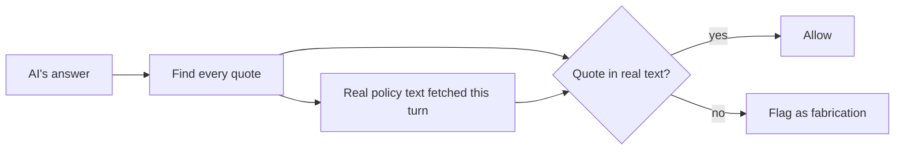
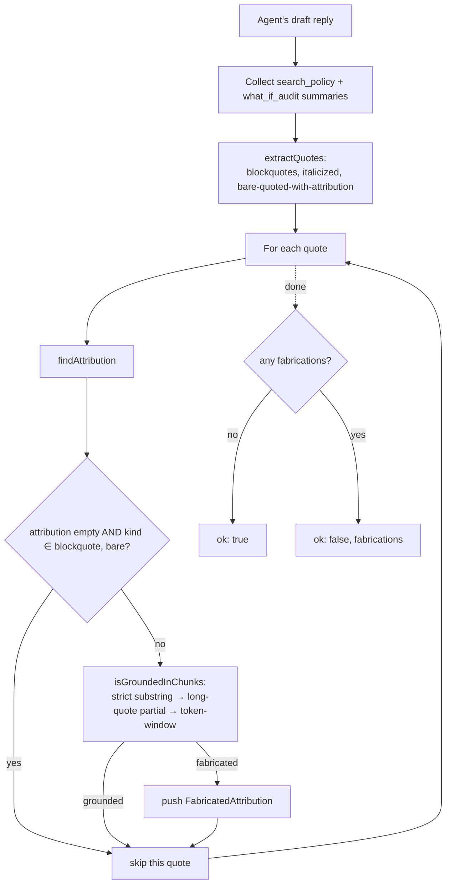

# Blockquote Attribution Verifier

> **Source file:** `packages/engine/src/agent/verifiers/blockquoteAttribution.ts`

## TL;DR

One of the worst things the AI could do is invent a quote and attribute it to an official document — for example, writing "According to the CAS bulletin: 'Students must complete 32 credits per year'" when the bulletin says no such thing. This check catches exactly that. It scans the AI's answer for anything that looks like a quote — text in quotation marks, markdown blockquotes, italicized passages — and then makes sure that quoted text actually appears in the real policy lookups the AI did this turn. If a quote can't be matched to any real source the AI fetched, it's flagged as a fabrication. No exceptions, no creative interpretation. It's a strict literal-string match because fake quotes are too dangerous to let through.



---

The single most aggressive anti-hallucination check. It catches the case where the agent emits a blockquote attributed to "the CAS bulletin" or "§ Internal Transfer Students" with **text that does not appear in any `search_policy` chunk this turn**.

Invoked from `responseValidator.ts` as `checkAttribution`. Pure substring matching. ~2 ms target latency.

---

## 1. The verdict

```
BlockquoteVerdict = {
  ok: boolean
  fabrications: FabricatedAttribution[]
}

FabricatedAttribution = {
  quote: string         // truncated to 200 chars for the violation detail
  attribution: string   // the attribution phrase that triggered the check (or empty for unattributed quotes)
  chunksSearched: number  // how many search_policy summaries were available
}
```

---

## 2. Quote extraction

`extractQuotes(text)` finds three quote shapes:

### Blockquotes

Markdown blockquote lines (`^>\s*(.+)\s*$`). Consecutive `>` lines within 200 chars of each other are merged into one quote (joined with `" "`). An empty `>` line flushes the buffer.

### Italicized quotes

Two regex patterns:
- `\*"([^"]{15,})"\*` — italic asterisk-wrapped double-quoted strings, content ≥ 15 chars.
- `_"([^"]{15,})"_` — italic underscore-wrapped.

### Bare double-quoted strings

`"([^"]{25,500})"` — only verified when an attribution phrase is within ±80 chars of the quote. The attribution regex:

```
\b(?:
  the (CAS )?bulletin
| CAS bulletin
| the policy
| per the (CAS )?bulletin
| according to (the )?bulletin
| § \s* [A-Z][a-zA-Z /\-]+
| the catalog
| NYU bulletin
)\b
```

### Dedup

When a quote's character range sits inside a blockquote's range, the inner one is dropped — the blockquote takes precedence. This prevents `> "..."` from being counted as both a blockquote and a bare quote.

---

## 3. Attribution lookup

For each extracted quote, `findAttribution(text, quoteIndex)`:

1. Build a window: 200 chars before the quote + 80 chars after.
2. Find every attribution-regex match in that window.
3. Prefer the **last attribution that appears before the quote** (the one that introduced it, like `"the bulletin says: > …"`).
4. If no before-match, return the first match overall.
5. Return empty string if no match.

---

## 4. Verification scope

The verifier only checks quotes that are **attributed**:

- A blockquote with **no nearby attribution** is treated as the agent's own framing (sample plan layout, formatted lists, etc.), not a citation. Skipped.
- A bare quote with **no nearby attribution** is treated as dialogue/paraphrase. Skipped.
- An italic-quote with **no nearby attribution** is still verified — italic + quotes was a deliberate stylistic choice the agent made.

---

## 5. Grounding check (`isGroundedInChunks`)

The verifier collects two sources of "ground truth" summaries from `invocations`:

1. Every `search_policy` invocation's `summary`.
2. Every `what_if_audit` invocation's `summary` (because what_if can surface bulletin disclaimers as part of its synthesis).

It normalizes each: lowercase, smart-quotes → straight, em/en-dash → hyphen, collapse whitespace, trim.

Then for each quote it tries, in order:

### Strict substring path
Normalize the quote, check if it appears as a substring of any summary. Most legitimate citations pass here.

### Long-quote partial path
For quotes > 120 chars, slide a 100-char window over the normalized quote stepping by 40 chars. If any window appears in any summary, it's grounded.

### Token-window path
Tokenize the normalized quote by `\W+`, keep tokens of length ≥ 4. Slide a 6-token window over them. If any window string appears in any summary, it's grounded.

If the quote has fewer than 6 long tokens AND failed the substring path, declare it ungrounded.

---

## 6. End-to-end flow



---

## 7. Why this exists

The agent has access to bulletin chunks via `search_policy`. The failure mode this verifier targets: the model writes a confident-looking blockquote attributed to a bulletin section, but the text doesn't appear in any chunk this turn — meaning the model invented the quote and the attribution.

The verifier is **conservative**: it only fails when both (a) a clear attribution is present AND (b) the quote can't be grounded by any of the three matching paths. Token-window matching tolerates light paraphrasing (e.g., "must" → "shall", dropped parentheticals); it only fires when the load-bearing content is absent.

---

## 8. What it never does

- It doesn't call the LLM.
- It doesn't check **unattributed** blockquotes/quotes (they pass through silently).
- It doesn't check whether the attribution phrase itself is real — only that the quoted text exists in the chunks.
- It doesn't read tool args, only summaries.
- It doesn't enforce that the quote be **verbatim** — just that it match one of three paths (substring / 100-char window / 6-token window).
