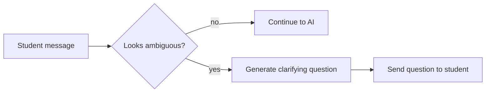
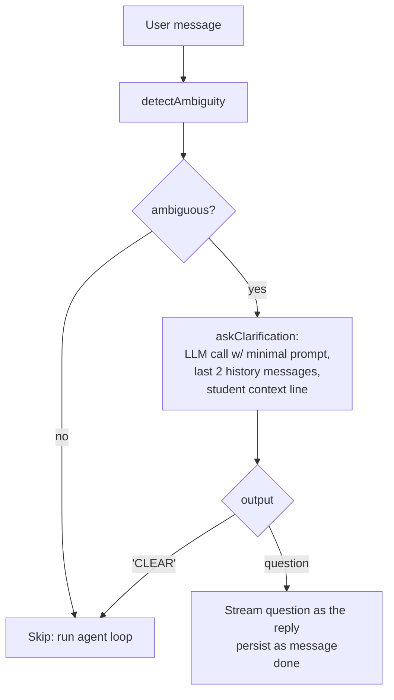

# Clarifier — Ambiguity Gate + Clarification Sub-Agent

> **Source file:** `packages/engine/src/agent/clarifier.ts`

## TL;DR

If a student types something vague like "math" or "what about that?" the system shouldn't guess what they meant — guessing wrong wastes everyone's time. So before the AI does its real work, a quick check looks for signs the message is unclear: too short, too many pronouns with no antecedent, just a bare noun phrase with no question, that kind of thing. If it smells ambiguous, a small AI assistant writes one polite clarifying question back to the student (or politely disagrees and lets the message through if it's actually fine). It's basically the system asking "wait, do you mean X or Y?" before diving in, so students don't get answers to questions they didn't ask.



---

For genuinely ambiguous user messages (one-word queries, dangling pronouns, vague bare noun-phrases), the system asks **one clarifying question** before running the agent loop. The clarifier has two pieces:

1. **`detectAmbiguity(userMessage, history)`** — deterministic gate (no LLM call). Returns whether the message is ambiguous and which signals fired.
2. **`askClarification(client, userMessage, history, studentContext)`** — sub-agent that produces the actual question (or returns `"CLEAR"` to disagree with the gate).

---

## 1. The gate (`detectAmbiguity`)

Pure function. Inputs: `userMessage`, `history` (an array of `LLMMessage`s). Output:

```
{
  ambiguous: boolean,
  signals: AmbiguitySignal[],
  contentTokens: string[]  // tokens left after stop-word removal — useful for debugging
}
```

### The four signals

#### Signal 1 — `ultra_short`

```
contentTokens.length ≤ 4
AND text.length ≤ 80
AND NOT first-person-verb match
```

Catches `"a minor?"`, `"next semester?"`, `"summer term?"`. Skips `"what's my GPA?"` because of the first-person verb anchor.

The stop-word list strips: `a, an, the, and, or, but, if, of, in, on, to, for, is, are, was, were, be, been, being, do, does, did, have, has, had, this, that, these, those, it, its, i, me, my, you, your, we, us, our, what, when, where, how, why, which, who, whom, can, could, would, should, may, might, will, shall, yes, no, ok, okay, please, thanks, thank, really, actually, just, kinda, uh, um`.

The first-person-verb regex is:
```
\b(can\s+i | do\s+i | am\s+i | will\s+i | should\s+i
 | how\s+(many|much) | what(?:'s|\s+is)\s+my | what\s+are\s+my
 | i\s+(want|need|plan|hope)\s+to | did\s+i)\b
```

#### Signal 2 — `pronoun_no_antecedent`

Triggers when the message contains a pronoun (`it`, `that`, `this`, `those`, `them`, `they`) and:
- the prior 4 messages of history are empty, OR
- the recent-history text contains no course/program-shaped noun (regex: `\b(CSCI|MATH|CORE|MUSIC|HIST|CHEM|BIOL|PHYS|PSYCH|ECON|MAJOR|MINOR|SEMESTER|PROGRAM|DEGREE)\b`).

#### Signal 3 — `vague_subject`

```
text.length < 60
AND text ends with "?"
AND NOT first-person-verb
AND NOT generic-verb match
```

Generic-verb regex: `\b(is|are|do|does|can|will|count|satisfy|require|need|count|graduate|take|drop|add|register)\b`.

Catches bare noun-phrase questions like `"a minor?"`, `"the math major?"`.

#### Signal 4 — `fragment`

```
1 ≤ contentTokens.length ≤ 3
AND NOT first-person-verb
AND NOT (i|you|we|the|a|an|is|are|do|can|will)
```

Catches one-to-three-word fragments with no subject or verb at all.

### The continuation-context skip

Even if signals fire, the gate skips when the **prior assistant turn** ended with `?` or was a denial / "I don't have" / "I can't" / "no access" message. In that case the user's short reply is a continuation (e.g. answering the assistant's question), and the main loop has the context to handle it.

The denial regex:
```
\b(i\s+don'?t\s+have | i\s+can'?t | i\s+do\s+not\s+have
 | no\s+access | not\s+(available | in\s+(the\s+)?(dpr|audit)))\b
```

### Final verdict

```
ambiguous = signals.length > 0
            AND text.length < 100
            AND NOT priorTurnIsContinuationContext
```

---

## 2. The sub-agent (`askClarification`)

When the gate fires, the route calls `askClarification(client, userMessage, history, studentContext)`. This is a real LLM call but constrained:

- **System prompt (≤ ~15 lines, verbatim from the source):**
  ```
  You are a clarification specialist for an academic-advising agent at NYU CAS.
  
  Your ONLY job: when the student's message is ambiguous, ask ONE concise clarifying
  question that would let the main agent answer correctly.
  
  You have NO tools. You CANNOT answer the student's question, look up policy, or
  quote the bulletin. You can only ask one question or signal "CLEAR".
  
  OUTPUT RULES (strict):
  - If the message is ambiguous, output: "Could you clarify: [one focused question]?"
  - If the message is actually clear (you disagree with the gate), output exactly: "CLEAR"
  - Do NOT prefix with "Sure" or "Hi" — output the question directly.
  - Do NOT ask multiple questions. Pick the one that most reduces ambiguity.
  
  EXAMPLES:
  - Student: "what about a minor?" → "Could you clarify: which minor are you considering, and are you asking about declaring it or about its requirements?"
  - Student: "can I take that next semester?" → "Could you clarify: which course do you mean by 'that'?"
  - Student: "is this enough?" → "Could you clarify: enough for what — graduation, your major requirements, or something else?"
  - Student: "What's my GPA?" (clear) → "CLEAR"
  
  Stay under 35 words.
  ```

- **Messages:** the last 2 history messages (for pronoun antecedent resolution) plus the user message prefixed with a `[student context: …]` line (assembled from `studentContext.homeSchool`, declared programs, visa status — only the fields that are present).

- **Call parameters:** `temperature: 0.1`, `maxTokens: 80`. This is the only randomness the system ships — kept low so the question shape is stable.

### Return shape

```
{
  output: string,           // the clarifying question OR "CLEAR"
  isClear: boolean,         // true if output == "CLEAR" (case-insensitive)
  promptTokens: number,
  completionTokens: number
}
```

If `isClear`, the route ignores the sub-agent's output and proceeds to the agent loop (the gate was wrong; trust the sub-agent).

---

## 3. The interaction



The gate fires on at most ~10–15% of incoming traffic (per the source-level note). Of those, the sub-agent may further skip a fraction by emitting `"CLEAR"`.

---

## 4. Cost & latency profile

- **Gate**: 0 ms (regex + token split).
- **Sub-agent**: one LLM call. Recommended to a small/fast model (the source notes a Haiku-tier model is appropriate); `maxTokens` is capped at 80 to bound latency and cost.
- The clarifier output is **not persisted** to the agent's tool history. It's a route-level event; the main agent loop has no awareness of it.

---

## 5. What the clarifier never does

- It never calls any tool. It is given no tool list.
- It never answers the student. It can only ask or pass.
- It never persists anything.
- It never sees the full session — only home school, declared programs (as labels), and visa status as a one-line context.
- It is never given more than 2 prior messages of history.
