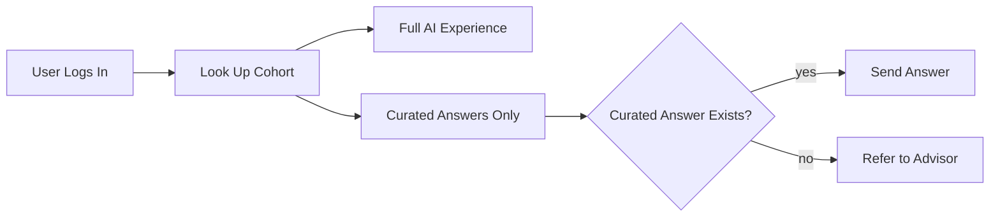
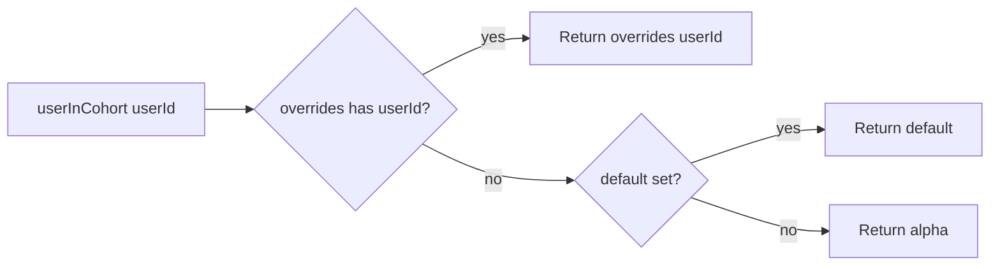
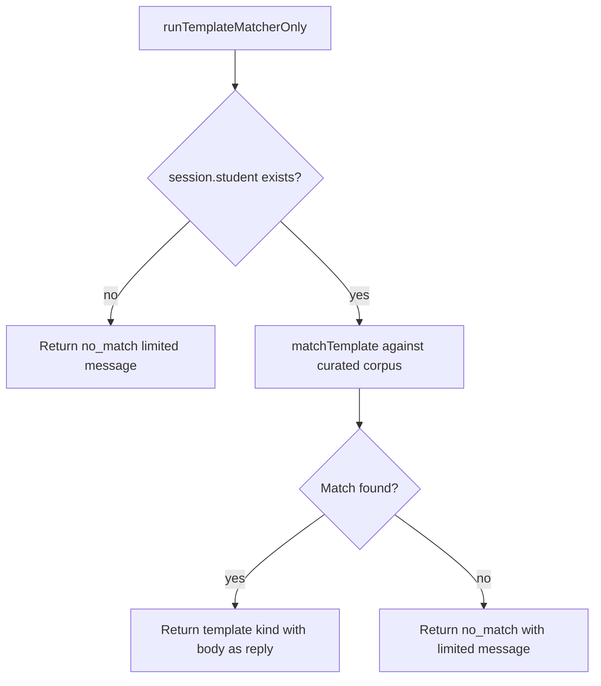

# Cohort Gate

## TL;DR

Not every student gets the same version of the app. The system rolls out in waves, and each wave (called a cohort) has its own settings. Internal testers and a small beta group get the full AI experience with generous turn limits. A wider invite group and the public launch get slightly different settings. There's also a "limited availability" mode where the AI is turned off entirely (for example, when the testing suite is failing) and only curated, hand-verified answers are served. This subsystem is the switch that decides which cohort a given user is in and what they get to see. It also has a recovery path that lets the system fall back to just curated answers when something goes wrong, with a polite "we're in limited mode, please contact your advisor" message when no curated answer fits.

---

## Purpose

The cohort module decides which runtime behavior the engine exposes to a given user. Each user is mapped to one of five cohorts, and each cohort has a configuration that controls whether the agent loop runs at all, how many turns it is allowed per request, and what eval floor the cohort is supposed to clear. When the eval gate for a cohort is failing, the engine routes requests through a template-only fallback — no LLM, no tools, no validators — so the user still gets a useful curated answer or a transparent "limited availability" message.

## Interface / shape

### Types and exported constants

`Cohort` is a string union: `alpha` / `beta` / `invite` / `public` / `limited` (gate.ts:16).

`CohortConfig` shape (gate.ts:18-39):

| Field | Type | Meaning |
|---|---|---|
| `cohort` | `Cohort` | The cohort id this config belongs to. |
| `evalGateFailing` | boolean | When true, the agent loop is disabled for this cohort; only the template matcher serves. |
| `maxTurns` | number | Per-cohort soft cap on agent-loop turns. |
| `composedEvalFloor` | number | Minimum composite eval score required to stay in this cohort. |
| `description` | string | Operator-facing summary. |

`CohortAssignment` shape (gate.ts:89-94):

- `overrides?: Record<userId, Cohort>` — per-user pinning.
- `default?: Cohort` — cohort for users not in `overrides`. Function-level fallback is `alpha` when this is unset.

`TemplateOnlyResult` shape (gate.ts:125-131):

- `kind: 'template' | 'no_match'`.
- `match?: TemplateMatchResult` — present when `kind === 'template'`.
- `reply: string` — always present; the text to surface to the user.

### Public functions

| Function | Shape | Notes |
|---|---|---|
| `setCohortAssignment(a)` | `(CohortAssignment) -> void` | Replaces the module-level current assignment. Used by ops scripts and tests. |
| `getCohortAssignment()` | `() -> CohortAssignment` | Reads the current assignment. |
| `userInCohort(userId)` | `(string) -> Cohort` | Resolves user → cohort with default `alpha` when no assignment is set. |
| `getCohortConfig(cohort)` | `(Cohort) -> CohortConfig` | Indexes into the pinned `COHORT_CONFIGS` table. |
| `runTemplateMatcherOnly(userMessage, session, templates, options?)` | returns `TemplateOnlyResult` | Recovery-mode entry point. No LLM. |

### COHORT_CONFIGS table

`COHORT_CONFIGS` is a hard-coded `Record<Cohort, CohortConfig>` (gate.ts:44-80):

| Cohort | evalGateFailing | maxTurns | composedEvalFloor | Description |
|---|---|---|---|---|
| `alpha` | false | 8 | 0.90 | Internal alpha — team + faculty contacts. |
| `beta` | false | 8 | 0.90 | Closed beta — CAS volunteers. |
| `invite` | false | 10 | 0.90 | Invite-only — CAS + Tandon + Stern. |
| `public` | false | 10 | 0.90 | Public launch. |
| `limited` | true | 0 | 0.0 | Limited availability — template matcher only. |

## Algorithm / behavior

### Cohort resolution

The current assignment is held in module-level mutable state `CURRENT_ASSIGNMENT`, initialized to `{ default: 'alpha' }`. `setCohortAssignment` overwrites the whole object. There is no per-key merge.

### Template-only fallback

`runTemplateMatcherOnly` (gate.ts:138-165) is the entry point for users whose cohort has `evalGateFailing: true` (typically `limited`). Behavior:

1. If `session.student` is missing, return immediately with `kind: 'no_match'` and the `limited` `noMatchMessage`.
2. Call `matchTemplate(userMessage, templates, session.student.homeSchool, { now, transferIntent })`.
3. If a match is found, return `{ kind: 'template', match, reply: match.template.body }`.
4. If no match, return `{ kind: 'no_match', reply: noMatchMessage('limited') }`.

The `now` and `transferIntent` options are forwarded directly into `matchTemplate` (gate.ts:150-153).

### "Limited availability" message

`noMatchMessage('limited')` (gate.ts:167-178) returns a multi-line markdown string that:

- Bolds the header `NYU Path is currently in limited availability mode.`
- Tells the user the system cannot answer right now.
- Directs them to the College Advising Center with a street address and phone number (25 West 4th Street, 5th floor; 212-998-8130).
- Explains that capacity returns once the eval suite is back to baseline.

For any cohort id other than `limited`, the function returns the generic `I don't have a curated answer for that question. Try rephrasing, or contact your academic adviser.`

## Inputs / outputs

| Function | Input | Output |
|---|---|---|
| `userInCohort` | userId | Cohort string |
| `getCohortConfig` | Cohort | CohortConfig object |
| `setCohortAssignment` | CohortAssignment object | void (mutates module state) |
| `getCohortAssignment` | none | CohortAssignment object |
| `runTemplateMatcherOnly` | user message, ToolSession, PolicyTemplate array, options (`now?`, `transferIntent?`) | TemplateOnlyResult |

## Dependencies

- Imports `matchTemplate`, `PolicyTemplate`, and `TemplateMatchResult` from `../rag/policyTemplate.js`.
- Imports `ToolSession` from `../agent/tool.js`.
- Holds mutable module state in `CURRENT_ASSIGNMENT`. There is no persistence layer for cohort assignments inside this module — `setCohortAssignment` is the only way to change them at runtime.

What depends on this module: the request entry point that decides per-request whether to engage the agent loop or to call `runTemplateMatcherOnly`. The `maxTurns` and `evalGateFailing` flags are consumed by the agent-loop runner.

## Edge cases / failure modes

- Unknown user ids fall through to `default` (default `alpha`), so users always have a cohort even if no override is recorded.
- `setCohortAssignment` is a wholesale replace, not a merge — calling it with an empty object effectively resets the assignment to nothing, and `userInCohort` will then fall through to `alpha`.
- The `limited` cohort has `maxTurns: 0` and `evalGateFailing: true` — even if a caller forgets to branch on the flag, the loop's max-turn budget would prevent any agent work.
- `runTemplateMatcherOnly` guards against `!session.student` by returning a `no_match` with the `limited` message immediately. The `matchTemplate` call requires a `homeSchool`, so this guard prevents an undefined dereference.
- The `noMatchMessage` helper returns a generic message for any cohort other than `limited`, so unknown future cohort ids inherit the generic fallback rather than the limited-availability copy.
- The module-level mutable assignment is a process-wide singleton — there is no per-tenant or per-test isolation. Tests are expected to call `setCohortAssignment` to swap in their fixture.
- The cohort table is hard-coded at module load. Ops cannot change `maxTurns` or `evalGateFailing` without editing this file (or layering a JSON override outside this module).

## Where it's consumed

- The chat / request entry route reads `userInCohort(userId)` and then `getCohortConfig(...)` to decide whether to invoke the agent loop or to fall back to `runTemplateMatcherOnly`.
- `maxTurns` is fed to the agent-loop runner so each cohort has its own turn budget.
- `runTemplateMatcherOnly` is the recovery path for the `limited` cohort and any other cohort whose `evalGateFailing` flag has been flipped.
- Admin dashboards read `description` and `composedEvalFloor` to display per-cohort eval status.
