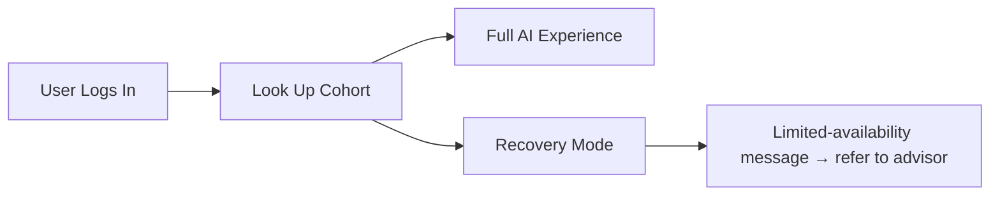
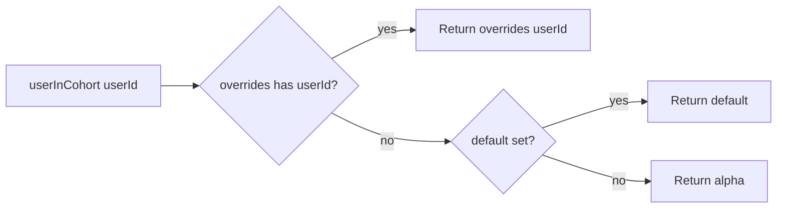
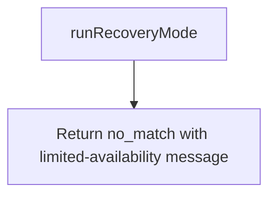

# Cohort Gate

> Last verified against code: 2026-06-13 (doc-sync pass: corrected stale route.ts `runRecoveryMode` import/call line numbers).

## TL;DR

Not every student gets the same version of the app. The system rolls out in waves, and each wave (called a cohort) has its own settings. Internal testers and a small beta group get the full AI experience with generous turn limits; a wider invite group and the public launch get slightly different settings. There's also a "limited availability" mode where the AI is turned off entirely (for example, when the testing suite is failing). In that mode the engine no longer tries to serve a curated answer — the curated-template corpus was removed in the "nothing hardcoded" pass — so it always replies with a transparent "we're in limited mode, please contact your advisor" message. This subsystem is the switch that decides which cohort a given user is in and what they get to see, plus the recovery path the chat route falls back to when a cohort's eval gate is failing.



---

## Purpose

The cohort module decides which runtime behavior the engine exposes to a given user. Each user is mapped to one of five cohorts, and each cohort has a configuration that controls whether the agent loop runs at all, how many turns it is allowed per request, and what eval floor the cohort is supposed to clear. When the eval gate for a cohort is failing (typically the `limited` cohort), the chat route does NOT run the agent loop — it calls `runRecoveryMode`, which returns a fixed "limited availability" message with no LLM, no tools, and no validators.

Source: `packages/engine/src/cohort/gate.ts`.

## Interface / shape

### Types and exported constants

`Cohort` is a string union: `alpha` / `beta` / `invite` / `public` / `limited` (gate.ts:15).

`CohortConfig` shape (gate.ts:17-38):

| Field | Type | Meaning |
|---|---|---|
| `cohort` | `Cohort` | The cohort id this config belongs to. |
| `evalGateFailing` | boolean | When true, the agent loop is disabled for this cohort; the recovery path serves instead. |
| `maxTurns` | number | Per-cohort soft cap on agent-loop turns. |
| `composedEvalFloor` | number | Minimum composite eval score required to stay in this cohort. |
| `description` | string | Operator-facing summary. |

`CohortAssignment` shape (gate.ts:88-93):

- `overrides?: Record<userId, Cohort>` — per-user pinning.
- `default?: Cohort` — cohort for users not in `overrides`. Function-level fallback is `alpha` when this is unset.

`TemplateOnlyResult` shape (gate.ts:124-128) — now a single-variant object (the `template` variant was removed along with the matcher):

- `kind: 'no_match'` — the only kind.
- `reply: string` — the text the chat layer should surface.

### Public functions

| Function | Shape | Notes |
|---|---|---|
| `setCohortAssignment(a)` | `(CohortAssignment) -> void` | Replaces the module-level current assignment. Used by ops scripts and tests. |
| `getCohortAssignment()` | `() -> CohortAssignment` | Reads the current assignment. |
| `userInCohort(userId)` | `(string) -> Cohort` | Resolves user → cohort with default `alpha` when no assignment is set. |
| `getCohortConfig(cohort)` | `(Cohort) -> CohortConfig` | Indexes into the pinned `COHORT_CONFIGS` table. |
| `runRecoveryMode(userMessage, session)` | `(string, ToolSession) -> TemplateOnlyResult` | Recovery-mode entry point. No LLM, no template matching — always returns the limited-availability `no_match`. |

### COHORT_CONFIGS table

`COHORT_CONFIGS` is a hard-coded `Record<Cohort, CohortConfig>` (gate.ts:43-79):

| Cohort | evalGateFailing | maxTurns | composedEvalFloor | Description |
|---|---|---|---|---|
| `alpha` | false | 8 | 0.90 | Internal alpha (~10 testers: team + faculty contacts). |
| `beta` | false | 8 | 0.90 | Closed beta (~50 CAS volunteers). |
| `invite` | false | 10 | 0.90 | Invite-only (~500 across CAS + Tandon + Stern). |
| `public` | false | 10 | 0.90 | Public launch — NYU undergrads at large. |
| `limited` | true | 0 | 0.0 | Limited availability — agent loop disabled; recovery message only. |

## Algorithm / behavior

### Cohort resolution



The current assignment is held in module-level mutable state `CURRENT_ASSIGNMENT`, initialized to `{ default: 'alpha' }` (gate.ts:95). `setCohortAssignment` overwrites the whole object. There is no per-key merge.

### Recovery-mode fallback

`runRecoveryMode` (gate.ts:136-144) is the entry point for users whose cohort has `evalGateFailing: true` (typically `limited`). It takes the user message and the `ToolSession` but ignores both (the parameters are underscore-prefixed). The curated template corpus was removed in the "nothing hardcoded" pass, so a gated/limited cohort no longer has a degraded curated-answer path — `runRecoveryMode` unconditionally returns:

```pseudo
{ kind: "no_match", reply: noMatchMessage("limited") }
```



### "Limited availability" message

`noMatchMessage('limited')` (gate.ts:146-157) returns a multi-line markdown string that:

- Bolds the header `NYU Path is currently in limited availability mode.`
- Tells the user the system cannot answer right now.
- Directs them to the College Advising Center with a street address and phone number (25 West 4th Street, 5th floor; 212-998-8130).
- Explains that capacity returns once the eval suite is back to baseline.

For any cohort id other than `limited`, the function returns the generic `I don't have a curated answer for that question. Try rephrasing, or contact your academic adviser.` In practice `runRecoveryMode` only ever calls it with `"limited"`, so the generic branch is currently unreachable from the public entry point.

## Inputs / outputs

| Function | Input | Output |
|---|---|---|
| `userInCohort` | userId | Cohort string |
| `getCohortConfig` | Cohort | CohortConfig object |
| `setCohortAssignment` | CohortAssignment object | void (mutates module state) |
| `getCohortAssignment` | none | CohortAssignment object |
| `runRecoveryMode` | user message, ToolSession | TemplateOnlyResult (always `kind: 'no_match'`) |

## Dependencies

- Imports only `ToolSession` from `../agent/tool.js`. (The pre-rebuild dependency on `matchTemplate` / `PolicyTemplate` / `TemplateMatchResult` from `../rag/policyTemplate.js` is gone — the matcher was removed.)
- Holds mutable module state in `CURRENT_ASSIGNMENT`. There is no persistence layer for cohort assignments inside this module — `setCohortAssignment` is the only way to change them at runtime.

What depends on this module: the chat v2 route (`apps/web/app/api/chat/v2/route.ts`) imports `runRecoveryMode` (line 34) and calls it at line 535 when the cohort gate is failing. The `maxTurns` and `evalGateFailing` flags are consumed by the agent-loop runner. `userInCohort` / `getCohortConfig` are re-exported from the engine barrel (`packages/engine/src/index.ts`).

## Known limitations

- **The template matcher is gone.** The old `runTemplateMatcherOnly(userMessage, session, templates, options)` and the `kind: 'template'` result variant no longer exist. Several code comments inside `gate.ts` (lines 8, 21, 116) still reference `runTemplateMatcherOnly` and "curated answers" — those comments are stale; the function and corpus were removed. Recovery mode is now message-only.
- The `noMatchMessage` generic (non-`limited`) branch is dead from the public surface — `runRecoveryMode` always passes `"limited"`.

## Edge cases / failure modes

- Unknown user ids fall through to `default` (default `alpha`), so users always have a cohort even if no override is recorded.
- `setCohortAssignment` is a wholesale replace, not a merge — calling it with an empty object effectively resets the assignment to nothing, and `userInCohort` will then fall through to `alpha`.
- The `limited` cohort has `maxTurns: 0` and `evalGateFailing: true` — even if a caller forgets to branch on the flag, the loop's max-turn budget would prevent any agent work.
- `runRecoveryMode` ignores its `userMessage` and `session` arguments entirely; there is no `session.student` guard because there is nothing left to dereference (no `matchTemplate` call needing a `homeSchool`).
- The module-level mutable assignment is a process-wide singleton — there is no per-tenant or per-test isolation. Tests are expected to call `setCohortAssignment` to swap in their fixture.
- The cohort table is hard-coded at module load. Ops cannot change `maxTurns` or `evalGateFailing` without editing this file (or layering a JSON override outside this module).

## Where it's consumed

- The chat v2 request route reads `userInCohort(userId)` and then `getCohortConfig(...)` to decide whether to invoke the agent loop or to fall back to `runRecoveryMode`.
- `maxTurns` is fed to the agent-loop runner so each cohort has its own turn budget.
- `runRecoveryMode` is the recovery path for the `limited` cohort and any other cohort whose `evalGateFailing` flag has been flipped.
- Admin dashboards read `description` and `composedEvalFloor` to display per-cohort eval status.
