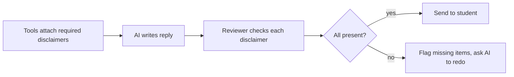
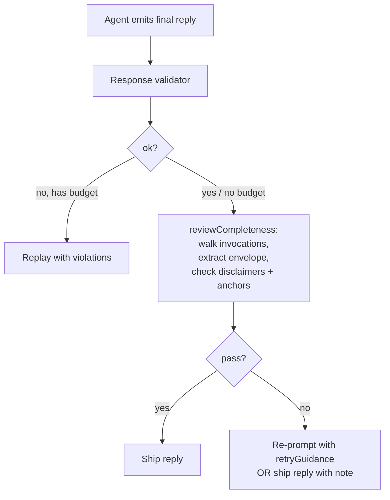

# Completeness Reviewer

> **Source file:** `packages/engine/src/agent/completenessReviewer.ts`

## TL;DR

When tools fetch information, they often tag their results with required disclosures — things like "this rule applies only to F-1 visa students" or "always check with your advisor before relying on this." Those disclosures need to show up in the final answer the student reads, not get quietly dropped. This module is the checker that makes sure they did. After the AI writes its reply, the reviewer goes through every tool that was used this turn, collects all the required warnings and source quotes attached to those results, and verifies each one actually appears in the reply. If something's missing, it flags exactly what was dropped so the AI can be told to add it back. It's pure rule-checking — no AI is involved in the review itself.



---

After the agent emits its final reply, the **completeness reviewer** compares the reply to the union of envelope metadata across every tool call in the turn. If any `disclaimer` or `anchor` from a tool's envelope was dropped, the reviewer returns a structured `FAIL` with reasons — the caller can then re-prompt the agent with those notes.

This is a separate gate from the response validator. The validator polices structural rules (grounding, invocations, caveats, attribution). The reviewer polices **envelope completeness** specifically.

It is deterministic — no LLM call.

---

## 1. What it checks

For each tool invocation in the turn, the reviewer reads the invocation's envelope (`disclaimers` and `anchors`) and asks:

- For every disclaimer: does the reply contain the disclaimer's text (loosely)?
- For every anchor: does the reply contain the anchor's `quote` (loosely, first 80 chars)?

Disclaimers are deduplicated by `id` across multiple tool calls — if both `run_full_audit` and `search_policy` emit the same disclaimer id, it's checked once.

`SuggestedFollowUp` and `confidence` are NOT checked by this reviewer — those are surface concerns for the system prompt's rule 6 (which the model is expected to honor) and the validator's caveat rules.

---

## 2. The verdict

```
CompletenessReviewVerdict = {
  pass: boolean,
  droppedDisclaimers: Disclaimer[],
  droppedAnchors: BulletinAnchor[],
  retryGuidance: string  // empty when pass=true; otherwise a single system message
}
```

`retryGuidance` is a multi-line system-message-shaped string:

```
Your previous draft was incomplete. The following structured tool-result fields were not surfaced verbatim and MUST appear in the next draft:
Missing disclaimers:
  • "<disclaimer.text>"  (reason: <disclaimer.reason>)
  …
Missing bulletin anchors:
  • "<anchor.quote>" — Source: <anchor.source>
  …
Re-issue the reply with these surfaced. Keep everything else intact.
```

---

## 3. The loose containment check

`containsLoosely(haystack, needle)` does:

1. Normalize both: lowercase → smart-quotes (`‘’“”`) → straight (`"`) → collapse whitespace → trim.
2. If `haystack` contains `needle`, return true.
3. Else split `needle` into tokens of length ≥ 4 and check: do at least 60% of those tokens appear in `haystack`?

The token-overlap fallback is lenient on purpose — the LLM legitimately reformats text across paragraphs, swaps quote styles, etc., as long as the load-bearing nouns/verbs remain.

For anchors, the reviewer only checks the first 80 characters of the quote (so long quotes can be partially surfaced).

---

## 4. Where the envelope is read

The `ToolInvocation` shape carries a `summary` field (the string sent back to the LLM) but NOT a `result` field at the public type level. The reviewer probes for `result` defensively:

```
const raw = inv as unknown as { result?: unknown };
const r = raw.result as { disclaimers?, anchors?, confidence?, ... } | undefined;
```

If `result` is absent (which is the current canonical shape), the reviewer returns an empty envelope for that invocation — i.e., it can't fail on disclaimers from a tool whose envelope wasn't threaded through.

In the current code path, this is effectively a no-op for most production runs because the live `ToolInvocation` doesn't carry `result`. The reviewer is **forward-compatible** with a future shape that does. It exists as the "Method B" implementation of completeness checking; the operational system relies on the response validator's `checkCompleteness` rules (which read `summary` text) for caveat enforcement.

---

## 5. Where it sits in a turn



The two gates are independent. The validator runs inside the agent loop and owns the replay budget. The completeness reviewer is intended to run AFTER the loop returns — currently the live web route uses the validator-only path, while the reviewer module is available for callers that want a stricter envelope-completeness check.

---

## 6. Why a separate module

- The validator's `checkCompleteness` is **rule-based** — fixed regex + required-substring patterns for specific caveats like F-1 visa, internal-transfer GPA, low-confidence.
- The reviewer is **data-driven** — every tool can attach disclaimers/anchors to its envelope and they'll be checked without any rule change.

That separation means adding a new envelope disclaimer is a tool-side change with zero validator/prompt impact. The reviewer enforces "if the data says surface it, surface it."

---

## 7. What it never does

- It never calls the LLM.
- It never mutates anything.
- It never blocks the reply by itself. It returns a verdict; the caller decides.
- It never reads `suggestedFollowUps` or `confidence` — those are routed through the validator's rules and the system prompt's rule 6.
