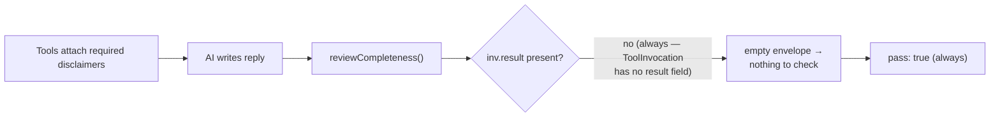
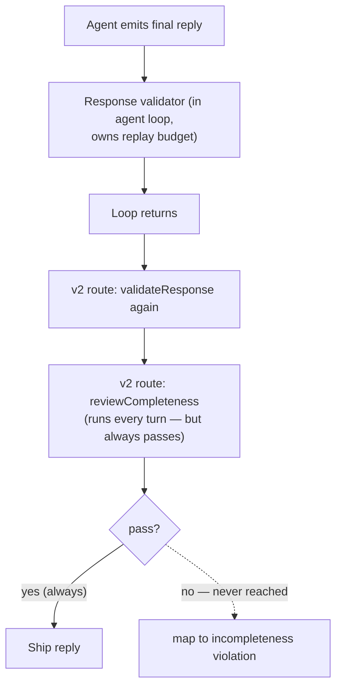

# Completeness Reviewer

> Last verified against code: 2026-06-10 (post planning-engine rebuild, PRs #35-#41).

> **Source file:** `packages/engine/src/agent/completenessReviewer.ts`

## Purpose

The completeness reviewer was *intended* to be a second, data-driven gate that makes sure required tool-result disclosures (an F-1 visa caveat, a "check with your adviser" note, a cited bulletin anchor) actually appear in the final reply instead of being quietly dropped. In the code today it is **dead in production**: it always returns `pass: true` regardless of the reply, because the data it reads no longer exists on the object it reads from. The v2 chat route still calls it on every turn — so it runs, costs a few microseconds, and can never fail. This doc explains what it was meant to do and exactly why it is inert.



---

## Known limitation — DEAD IN PRODUCTION (always passes)

`reviewCompleteness(finalText, invocations)` walks each `ToolInvocation`, calls `extractEnvelope(inv)` to pull the tool's `disclaimers` / `anchors`, and checks each one is present in the reply. The flaw is in `extractEnvelope` (`completenessReviewer.ts:35-48`): it reads the envelope off `inv.result` —

```ts
const raw = inv as unknown as { result?: unknown };
const r = raw.result as { disclaimers?, anchors?, confidence? } | undefined;
if (!r || typeof r !== "object") return {};
```

…but the live `ToolInvocation` interface (`agentLoop.ts:85-99`) has **no `result` field** — it carries `toolName`, `args`, `summary`, `verbatimText`, `error`, `callMs`, `rejected`, and nothing else. So `raw.result` is always `undefined`, `extractEnvelope` always returns `{}`, and the reviewer collects **zero** disclaimers and **zero** anchors. With nothing to check, `reviewCompleteness` always returns `{ pass: true, droppedDisclaimers: [], droppedAnchors: [], retryGuidance: "" }`.

It is **not** dead code in the unreachable sense — it is wired in and runs. The v2 chat route (`apps/web/app/api/chat/v2/route.ts:729-740`) calls `reviewCompleteness` after `validateResponse` on every turn and maps a failure to an `incompleteness` violation. That branch is simply never taken, because the reviewer never fails. The `result`-probe was written to be forward-compatible with a future `ToolInvocation` shape that re-introduces `result`; that shape was never built.

**What actually enforces disclaimer/caveat completeness today** is the response validator's `checkCompleteness` rules (see [`response-validator.md`](response-validator.md) §5), which read each invocation's `summary` text — a field that *does* exist — for the F-1, internal-transfer, and low-confidence caveats. Envelope-driven completeness checking is not operational.

---

## What it was designed to do (for reference)

The rest of this doc describes the reviewer's *intended* behavior. None of it changes the fact above — it is the spec for a gate that currently no-ops.

After the agent emits its final reply, the completeness reviewer was meant to compare the reply to the union of envelope metadata across every tool call in the turn. If any `disclaimer` or `anchor` from a tool's envelope was dropped, the reviewer returns a structured `FAIL` with reasons — the caller can then re-prompt the agent with those notes.

This is a separate gate from the response validator. The validator polices structural rules (grounding, invocations, caveats, attribution). The reviewer was meant to police **envelope completeness** specifically.

It is deterministic — no LLM call.

---

## 1. What it checks

> The logic below is what the code *would* do per invocation. In practice the per-invocation envelope is always empty (§4), so none of these checks ever has anything to evaluate.

For each tool invocation in the turn, the reviewer reads the invocation's envelope (`disclaimers` and `anchors`) and asks:

- For every disclaimer: does the reply contain the disclaimer's text (loosely)?
- For every anchor: does the reply contain the anchor's `quote` (loosely, first 80 chars)?

Disclaimers are deduplicated by `id` across multiple tool calls — if both `run_full_audit` and `search_policy` emit the same disclaimer id, it's checked once.

`SuggestedFollowUp` and `confidence` are NOT checked by this reviewer — those are surface concerns for the system prompt's rule 6 (which the model is expected to honor) and the validator's caveat rules.

---

## 2. The verdict

```
CompletenessReviewVerdict = {
  pass: boolean,
  droppedDisclaimers: Disclaimer[],
  droppedAnchors: BulletinAnchor[],
  retryGuidance: string  // empty when pass=true; otherwise a single system message
}
```

`retryGuidance` is a multi-line system-message-shaped string:

```
Your previous draft was incomplete. The following structured tool-result fields were not surfaced verbatim and MUST appear in the next draft:
Missing disclaimers:
  • "<disclaimer.text>"  (reason: <disclaimer.reason>)
  …
Missing bulletin anchors:
  • "<anchor.quote>" — Source: <anchor.source>
  …
Re-issue the reply with these surfaced. Keep everything else intact.
```

---

## 3. The loose containment check

`containsLoosely(haystack, needle)` does:

1. Normalize both: lowercase → smart-quotes (`‘’“”`) → straight (`"`) → collapse whitespace → trim.
2. If `haystack` contains `needle`, return true.
3. Else split `needle` into tokens of length ≥ 4 and check: do at least 60% of those tokens appear in `haystack`?

The token-overlap fallback is lenient on purpose — the LLM legitimately reformats text across paragraphs, swaps quote styles, etc., as long as the load-bearing nouns/verbs remain.

For anchors, the reviewer only checks the first 80 characters of the quote (so long quotes can be partially surfaced).

---

## 4. Where the envelope is read

The `ToolInvocation` shape carries a `summary` field (the string sent back to the LLM) but NOT a `result` field at the public type level. The reviewer probes for `result` defensively:

```
const raw = inv as unknown as { result?: unknown };
const r = raw.result as { disclaimers?, anchors?, confidence?, ... } | undefined;
```

`result` is **always** absent — it is not on the `ToolInvocation` interface at all (`agentLoop.ts:85-99`), not merely omitted at the public type level. So for **every** invocation on **every** turn the reviewer returns an empty envelope, collects nothing, and cannot fail. This is the mechanism behind the "dead in production" note at the top of this doc — it is a hard no-op, not "effectively a no-op for most runs."

The reviewer is **forward-compatible** with a hypothetical future `ToolInvocation` shape that re-introduces `result`; that shape was never built. It exists as the "Method B" implementation of completeness checking; the operational system relies entirely on the response validator's `checkCompleteness` rules (which read `summary` text) for caveat enforcement.

---

## 5. Where it sits in a turn



The completeness reviewer is **not** an unused module — the v2 chat route (`apps/web/app/api/chat/v2/route.ts:729`) calls it after `validateResponse` on every turn and maps any failure to an `incompleteness` violation. But because `reviewCompleteness` always returns `pass: true` (see §4 and the top of this doc), the failure branch is never taken. In effect the live route is validator-only, despite physically invoking the reviewer.

---

## 6. Why a separate module

- The validator's `checkCompleteness` is **rule-based** — fixed regex + required-substring patterns for specific caveats like F-1 visa, internal-transfer GPA, low-confidence. **This is the gate that actually runs.**
- The reviewer was meant to be **data-driven** — every tool attaches disclaimers/anchors to its envelope and they'd be checked without any rule change.

The intended separation would have meant adding a new envelope disclaimer is a tool-side change with zero validator/prompt impact. In reality the data-driven path is severed (the envelope never reaches the reviewer — §4), so today only the rule-based validator enforces completeness. Closing the gap would require threading the tool result envelope onto `ToolInvocation` and into `reviewCompleteness`.

---

## 7. What it never does

- It never calls the LLM.
- It never mutates anything.
- It never blocks the reply by itself. It returns a verdict; the caller decides.
- It never reads `suggestedFollowUps` or `confidence` — those are routed through the validator's rules and the system prompt's rule 6.
