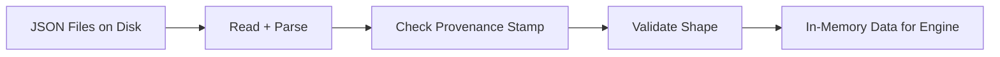
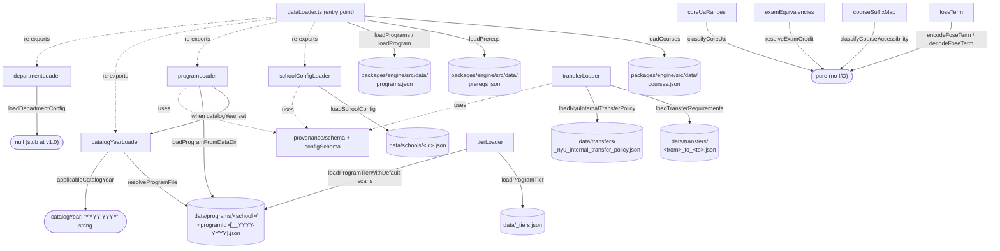

# Data Loader Subsystem

## TL;DR

The app needs a lot of reference data to do its job: the full course catalog, prerequisite rules, the requirements of every major, the policies of every NYU school, transfer rules between schools, AP and IB exam credit mappings, and so on. All that lives in JSON files on disk. This subsystem is the set of functions that read those files, sanity-check that they were authored correctly (every file has to have a stamp saying where the data came from, when it was last verified, and a hash so we know it wasn't tampered with), and hand the data over as typed objects the rest of the engine can use. There's no big startup routine; each function reads its file on demand, and the calling code is in charge of remembering what it loaded.



---

## 1. Overview

The data loader subsystem is the engine's bridge between on-disk JSON data and the in-memory objects the audit, planner, and tool layers consume. Every loader is a pure function that reads a file path, parses JSON, optionally validates a provenance `_meta` block plus a typed body, and returns either the typed object or a discriminated union describing why the load failed.

There is no implicit boot routine and no singleton cache. The engine package does not warm a global on import — each loader call performs a fresh `readFileSync` and `JSON.parse`. Callers (most importantly the web app's session builder) are responsible for invoking the loaders during request handling and holding the results in whatever local lifetime they need. The data layer is therefore fully stateless and re-entrant.

### Entry point

`packages/engine/src/dataLoader.ts` is the canonical import surface. Callers should import everything from `@nyupath/engine/dataLoader` rather than reaching into `data/*` directly. The entry point:

- Directly implements three legacy bundled loaders that read JSON from the engine's own `src/data/` directory:
  - `loadCourses()` — courses.json (dataLoader.ts:24–27)
  - `loadPrereqs()` — prereqs.json (dataLoader.ts:29–32)
  - `loadPrograms()` and `loadProgram(programId, catalogYear?)` — programs.json (dataLoader.ts:34–46)
- Re-exports the Phase 1+ per-school loaders for school config, catalog-year resolution, per-school programs, and department config (dataLoader.ts:49–64).
- Implements the precedence-rule reducer `resolveFact<T>(candidates)` (dataLoader.ts:118–140), which collapses a list of `FactCandidate<T>` values into a single `ResolvedFact<T>` based on the fixed layer order `["school", "program", "department", "course_catalog"]` (dataLoader.ts:105).

### Two on-disk roots

The loaders read from two physically distinct directories:

| Root | Resolved from | Contents |
|---|---|---|
| `packages/engine/src/data/` | `__dirname` in dataLoader.ts:21–22 | Bundled legacy datasets: courses.json, prereqs.json, programs.json, courses-offerings.json, course_catalog_full.json, course_embeddings.json |
| `<repo>/data/` | `__dirname/../../../../data` (e.g. schoolConfigLoader.ts:27, catalogYearLoader.ts:27, programLoader.ts:21, transferLoader.ts:22, tierLoader.ts:16) | Per-school configs, per-school programs, departments, transfers, tiers, plus large auxiliary trees (bulletin-raw, course-catalog, policy-corpus, policy_templates) |

### Validation pattern

Every loader that reads from the repo-root `data/` directory follows the same shape:

1. Resolve a file path; if missing, return `{ ok: false, reason: "not_found", ... }`.
2. `readFileSync` and `JSON.parse`; on either failure, return `{ ok: false, reason: "parse_error", ... }`.
3. Pass the parsed object through `validateFileWithMeta` from `provenance/schema.ts` to check the top-level `_meta` block; on failure, return `{ ok: false, reason: "invalid_meta", errors }`.
4. Strip `_meta`, `_provenance`, and `_notes` from the object and pass the remainder to a Zod body validator from `provenance/configSchema.ts`; on failure, return `{ ok: false, reason: "invalid_body", errors }`.
5. On success, return `{ ok: true, ... }` with the typed body, the parsed `Meta`, and the source path.

The legacy `loadCourses` / `loadPrereqs` / `loadPrograms` in dataLoader.ts:24–37 skip steps 3 and 4 entirely — they trust the bundled engine JSON and cast straight to the shared types.

### Caching

None. Every loader call re-reads its file. Process-level caching would have to be added by the caller (e.g. building a ToolSession once per request and reusing it within that request's tool calls).

---

## 2. Per-loader breakdown

The remaining sections document each loader file. Format for each loader:

- **File(s) it reads** — the JSON path(s) on disk.
- **Output shape** — pseudo-type for the success value.
- **Normalization / validation** — what the loader does to the parsed JSON before returning.
- **Downstream use** — which tools and engine modules consume the output (as observed by the re-export surface and the loader's public signature; the loaders themselves do not call into downstream code).

---

## 3. Program loader

### 3a. Legacy bundled programs (`dataLoader.ts:34–46`)

**File:** `packages/engine/src/data/programs.json`

**Output shape:**
```
Program[]                          // loadPrograms()
Program | undefined                // loadProgram(programId, catalogYear?)
```

`Program` is the shared type from `@nyupath/shared`. The loader does not normalize fields — the JSON is cast directly. `loadProgram` filters the array by `programId`, and when a `catalogYear` is supplied it additionally filters by `p.catalogYear === catalogYear` (dataLoader.ts:41–45).

**Validation:** none beyond JSON parsing.

**Downstream use:** anywhere the engine needs the legacy CAS CS BA + CAS Core program objects that ship inside the engine bundle. The entry point also re-exports the Phase 1 alternative below for callers who want the repo-root program tree.

### 3b. Per-school program loader (`data/programLoader.ts`)

**File:** `<repo>/data/programs/<school>/<programId>.json`, or its catalog-year snapshot variant `<programId>__<YYYY-YYYY>.json` (programLoader.ts:53, with snapshot resolution delegated to `resolveProgramFile`).

**Public function:** `loadProgramFromDataDir(school, programId, opts?: { catalogYear?, programsDir? })`.

**Output shape:**
```
{ ok: true, program: Program, meta: Meta, path: string }
| { ok: false, reason: "not_found",     programId, school }
| { ok: false, reason: "parse_error",   programId, path, error }
| { ok: false, reason: "invalid_meta",  programId, path, errors }
| { ok: false, reason: "invalid_body",  programId, path, errors }
```

(programLoader.ts:24–29)

**Normalization / validation:**

- Path resolution: when `catalogYear` is supplied, defers to `resolveProgramFile` (catalogYearLoader.ts) and uses its returned path; when no catalog year is supplied, looks for the unsuffixed file directly (programLoader.ts:46–57).
- JSON parsing inside a try/catch (programLoader.ts:60–70).
- `_meta` validation via `validateFileWithMeta` (programLoader.ts:72–81).
- Strips `_meta`, `_provenance`, `_notes` (programLoader.ts:84–88).
- Body validation via `validateProgramBody` (programLoader.ts:92–101).
- Returns `bodyResult.body` cast to `Program` (programLoader.ts:103–108).

**Downstream use:** any caller that wants a single per-school program with catalog-year handling and schema validation — i.e. session builders that load the student's declared major from `data/programs/`.

---

## 4. Catalog year loader

**File:** `data/catalogYearLoader.ts`

This module owns the file-naming convention for catalog-year-pinned program files and the function that maps a student's matriculation/readmission/declaration state to the catalog year their program should be evaluated against. It does **not** read or parse program JSON — only resolves paths and computes a catalog-year string.

### Naming convention (catalogYearLoader.ts:30)

- Current: `<programsDir>/<school>/<programId>.json`
- Snapshot: `<programsDir>/<school>/<programId>__<YYYY-YYYY>.json` (matched by the regex `/__(\d{4})-(\d{4})\.json$/`)

A catalog year is required to match `/^\d{4}-\d{4}$/` (catalogYearLoader.ts:31, 67–71).

### `resolveProgramFile(school, programId, catalogYear, opts?)`

**Output shape:**
```
{ kind: "exact",            path, catalogYear }
| { kind: "earlier_snapshot", path, catalogYear, requested }
| { kind: "current_fallback", path,              requested }
| { kind: "not_found", programId, school,        requested }
```

(catalogYearLoader.ts:33–37)

**Resolution algorithm** (catalogYearLoader.ts:86–155):

1. If `<schoolDir>` doesn't exist, log `catalog_year_not_found` and return `not_found`.
2. If `<programId>__<catalogYear>.json` exists, return `exact`.
3. Otherwise scan the school dir for files starting with `<programId>__`, parse the YYYY-YYYY suffix, drop any malformed (start+1 ≠ end), drop any with end-year > requested end-year, sort the remainder by end-year descending, and return the largest as `earlier_snapshot`. Logs `catalog_year_fallback`.
4. Otherwise, if `<programId>.json` exists, return `current_fallback`. Logs `catalog_year_fallback`.
5. Otherwise log `catalog_year_not_found` and return `not_found`.

Logger interface `ResolveLogger` is configurable; the default writes a single-line JSON record to `console.warn` (catalogYearLoader.ts:39–46, 157–161).

### `applicableCatalogYear({ matriculationCatalogYear, readmissionCatalogYear?, declaredUnderCatalogYear? })`

Returns a single catalog-year string. Precedence (catalogYearLoader.ts:174–182):

1. `declaredUnderCatalogYear` if present (per-program override for majors declared after matriculation).
2. Else `readmissionCatalogYear` if present.
3. Else `matriculationCatalogYear`.

**Downstream use:** invoked by `programLoader.loadProgramFromDataDir` when a catalog year is supplied; also the canonical helper for callers that need to compute a student's effective catalog year from their session profile before loading any program file.

---

## 5. Transfer loader

**File:** `data/transferLoader.ts`

**Files it reads:**

- `<repo>/data/transfers/<fromSchool>_to_<toSchool>.json` — pairwise internal-transfer requirements (transferLoader.ts:80).
- `<repo>/data/transfers/_nyu_internal_transfer_policy.json` — NYU-wide floor policy used as fallback when no pair file exists (transferLoader.ts:115).

### `loadTransferRequirements(fromSchool, toSchool, opts?)`

**Output shape:**
```
{ ok: true, requirements: TransferRequirements, meta: Meta, path: string }
| { ok: false, reason: "not_found",   from, to }
| { ok: false, reason: "parse_error", path, error }
| { ok: false, reason: "invalid_meta", path, errors }
| { ok: false, reason: "invalid_body", path, errors }
```

`TransferRequirements` shape (transferLoader.ts:25–49):

```
TransferRequirements {
  fromSchool: string
  toSchool: string
  applicationDeadline: string
  acceptedTerms: string[]
  minCreditsCompleted: number
  disqualifiers?: string[]
  disqualifierReasons?: Record<string, string>
  entryYearRequirements: Array<{
    entryYear: "sophomore" | "junior"
    requiredCourseCategories: Array<{
      category: string
      description: string
      satisfiedBy: string[]   // course IDs that count for the category
    }>
  }>
  equivalencyUrl?: string
  applicationUrl?: string
  notes?: string[]
}
```

**Normalization / validation:** standard pattern — parse, `validateFileWithMeta`, strip provenance keys, `validateTransferRequirementsBody`, cast and return (transferLoader.ts:84–110).

### `loadNyuInternalTransferPolicy(opts?)`

**Output shape:**
```
{ ok: true, policy: NyuInternalTransferPolicy, meta: Meta }
| { ok: false, reason: "not_found" | "parse_error" | "invalid_meta" | "invalid_body", details? }
```

`NyuInternalTransferPolicy` (transferLoader.ts:51–57):

```
NyuInternalTransferPolicy {
  policyKind: "nyu_wide_floor"
  earliestApplicationTerm: string
  latestApplicationTerm: string
  duplicateMajorRule: string
  notes: string[]
}
```

**Normalization / validation:** same pattern, using `validateNyuTransferPolicyBody` (transferLoader.ts:113–144).

**Downstream use:** the transfer-eligibility tool that answers "can I move from school X to school Y, and what classes do I still need?" Callers are expected to try the pair file first and fall back to the NYU-wide policy when `loadTransferRequirements` returns `not_found`.

---

## 6. Department loader

**File:** `data/departmentLoader.ts`

This is a deliberate stub.

**Public function:** `loadDepartmentConfig(school: string, dept: string)`.

**Output shape:**
```
DepartmentConfig {
  readonly _placeholder?: never
} | null
```

(departmentLoader.ts:13–17)

**Behavior:** ignores both arguments and returns `null` for all inputs (departmentLoader.ts:26–31). The interface exists so that the precedence machinery in `dataLoader.ts` (`PrecedenceLayer = "department"`) has a real type to bind, but no department-level overrides are wired at v1.0.

**Downstream use:** the audit/planner consults this when computing precedence-resolved facts. Because it always returns `null`, the `department` candidate in `resolveFact` always contributes `value: undefined`, and the resolver falls straight through to the course-catalog layer below it.

---

## 7. School config loader

**File:** `data/schoolConfigLoader.ts`

**File it reads:** `<repo>/data/schools/<schoolId>.json` (schoolConfigLoader.ts:53).

Two public functions:

### `loadSchoolConfigStrict(schoolId, opts?)`

Discriminated-union loader following the standard pattern.

**Output shape:**
```
{ ok: true, config: SchoolConfig, meta: Meta, path: string }
| { ok: false, reason: "not_found",     schoolId, path }
| { ok: false, reason: "parse_error",   schoolId, path, error }
| { ok: false, reason: "invalid_meta",  schoolId, path, errors }
| { ok: false, reason: "invalid_body",  schoolId, path, errors }
```

(schoolConfigLoader.ts:30–35)

**Normalization / validation:**

- `existsSync` check (schoolConfigLoader.ts:51–53).
- `readFileSync` in try/catch (schoolConfigLoader.ts:55–66).
- `JSON.parse` in try/catch (schoolConfigLoader.ts:68–79).
- `validateFileWithMeta` for `_meta` (schoolConfigLoader.ts:81–90).
- Strip `_meta`, `_provenance`, `_notes` (schoolConfigLoader.ts:93–94).
- `validateSchoolConfigBody` for the body (schoolConfigLoader.ts:98–107).
- Cast and return as `SchoolConfig` (schoolConfigLoader.ts:109–114).

The `SchoolConfig` shape is the shared type — in practice it carries the numeric per-school policy constants the engine treats as authoritative (e.g. `maxCreditsPerSemester`, `f1FullTimeMinCredits`, and other school-wide numeric thresholds), plus any string identifiers needed to identify the school.

### `loadSchoolConfig(schoolId, opts?)`

Convenience wrapper around `loadSchoolConfigStrict`. On success returns `config`; on any failure logs a single-line JSON warning to `console.warn` under the `school_config` tag (schoolConfigLoader.ts:131–144) and returns `null`. Built for the "CAS fallback" call pattern, where the engine module imports its own `CAS_DEFAULTS` constants and uses `loadSchoolConfig(schoolId) ?? CAS_DEFAULTS`.

**Downstream use:** every engine module that reads school-scoped numeric policy. The `dataLoader.ts` precedence reducer treats `"school"` as the highest-authority layer.

---

## 8. FOSE term loader

**File:** `data/foseTerm.ts`

This module is not a JSON loader — it is an encode/decode pair for NYU's class-search term-code format. It is included in the data-layer because it is the single source of truth for the term-code rule the class-search HTTP tool depends on.

### Encoding rule (foseTerm.ts:24–34)

Term-digit table:
- `spring` → 4
- `summer` → 6
- `fall` → 8

Encoded code is the 4-digit string `"1" + (year % 100, zero-padded) + termDigit`.

### Public surface

- `encodeFoseTerm(year, term): string` — validates year in `[2000, 2099]` and term in the table; throws `RangeError` otherwise (foseTerm.ts:42–52).
- `decodeFoseTerm(code): { year, term } | null` — accepts only strings matching `/^1\d{2}[468]$/`, otherwise returns null; reconstitutes year as `2000 + yy` (foseTerm.ts:58–66).
- `foseTermLabel(code): string | null` — decodes and renders as e.g. `"Fall 2026"` (foseTerm.ts:71–75).
- `FoseTerm` and `DecodedFoseTerm` types (foseTerm.ts:17–22).

**Downstream use:** the class-search tool path that hits FOSE; called wherever the engine needs to translate between human-readable semester labels and the 4-digit code the API requires.

---

## 9. Course suffix map

**File:** `data/courseSuffixMap.ts`

Static lookup tables plus a single classification function. No JSON file is read.

### Data

`SUFFIX_META`: a readonly record mapping the 2–4 letter suffix that follows the dash in an NYU course ID (e.g. the `UA` in `CSCI-UA 101`) to school metadata (courseSuffixMap.ts:31–55):

```
SchoolMeta {
  school: string
  undergrad: boolean
  globalSite: "abudhabi" | "shanghai" | null
}
```

The table covers undergraduate suffixes (UA, UB, UY, UE, UF, UT, UN, UP, UH, SHU), graduate suffixes (GA, GY, GU, GH, GX, GB, GS), professional schools (MD, MS, DN, BMSC, BMIN, LW), and the two NYU portal campuses (UH = Abu Dhabi, SHU = Shanghai).

`HOME_SCHOOL_TO_SUFFIX`: the inverse direction, mapping a lowercased school slug to its undergraduate suffix (courseSuffixMap.ts:57–65). Covers cas, stern, tandon, steinhardt, tisch, gallatin, ls.

### `classifyCourseAccessibility(courseId, homeSchool?)`

**Output shape:**
```
AccessibilityResult {
  school: string
  accessibility: "home" | "cross_school" | "global_site" | "graduate" | "unknown"
  note?: string
}
```

(courseSuffixMap.ts:67–73)

**Algorithm** (courseSuffixMap.ts:80–113):

1. Extract the suffix via regex `/-([A-Z]+)\b/`. No match → `unknown`.
2. Look up the suffix in `SUFFIX_META`. If the full suffix isn't found, retry with the last two characters (handles edge cases like longer suffixes whose two-letter tail still maps).
3. If `undergrad` is false → `graduate`, with a note that the course is closed to undergrads except by petition.
4. If `globalSite` is set → `global_site`, with a note that the course is only available during a study-abroad term.
5. Else compare the course's school to the student's home school (translated via `HOME_SCHOOL_TO_SUFFIX`). Equal → `home`. Different → `cross_school`, with a note about approval being required.

**Downstream use:** the course-search tools use this to label search results by their accessibility relative to the student's home school. It is the engine's structured replacement for prose rules about cross-school course eligibility.

---

## 10. Exam equivalencies

**File:** `data/examEquivalencies.ts`

Static lookup tables for AP, IB HL, and A-Level exams, plus a single resolver function. No JSON file is read; the rules are encoded as constants in the file.

### Data structures

Each exam-type table is a `Record<string, Entry[]>` where the key is the exam name and the value is a list of entries that may discriminate by score.

```
ExamResult {
  credits: number
  nyuEquivalent?: string[]      // e.g. ["MATH-UA 121"]
  coreSatisfaction?: string[]   // e.g. ["Quantitative Reasoning"]
  notes?: string[]              // verbatim policy restrictions
}
```

(examEquivalencies.ts:9–18)

#### AP table (`AP_TABLE`, examEquivalencies.ts:31–143)

Entry shape: `{ scores: number[], credits, nyuEquivalent?, coreSatisfaction?, notes? }`. Covers ~30 AP subjects including the score-discriminated cases like Calculus BC (4 vs 5) and Spanish Literature (4 vs 5). Some entries (English Language, Human Geography, Studio Art) appear as empty lists, signalling that no credit is awarded.

#### IB HL table (`IB_TABLE`, examEquivalencies.ts:157–295)

Entry shape identical to AP. All IB HL entries award 8 credits. Includes score-split entries like Analysis and Approaches Mathematics (6 vs 7) and Philosophy (6 vs 7).

#### A-Level table (`ALEVEL_TABLE`, examEquivalencies.ts:310–406)

Entry shape: `{ minScore: string, credits, nyuEquivalent?, coreSatisfaction?, notes? }`. Uses letter-grade minimums (`B` standard, `A` for special cases like Art History or Philosophy). All entries award 8 credits.

### `resolveExamCredit(type, exam, score)`

**Inputs:** `type ∈ { "ap", "ib", "alevel" }`; exam name (case-insensitive match against the table key); score (number for AP/IB, string letter grade for A-Level).

**Output:** `ExamResult | null` (null when the table has no entry, the score is too low, or the grade is invalid).

**Dispatch** (examEquivalencies.ts:418–433):

- `"ap"` → `resolveAP`: iterates entries, returns the first whose `scores` array includes the numeric score (examEquivalencies.ts:435–450).
- `"ib"` → `resolveIB`: same shape as AP (examEquivalencies.ts:452–469).
- `"alevel"` → `resolveALevel`: ranks grades via `A* > A > B > C > D > E` (examEquivalencies.ts:498–503), sorts entries by `minScore` descending so the strictest threshold matches first, and returns the first entry whose threshold the student meets (examEquivalencies.ts:471–495).

`findEntry` performs exact-match then case-insensitive key lookup (examEquivalencies.ts:506–515).

### `EXAM_GENERAL_RULES` (examEquivalencies.ts:519–534)

A frozen constant capturing the policy rules that apply across all exam types:

- `maxAdvancedStandingCredits: 32` — cap on combined AP/IB/A-Level/prior-college credit.
- `noDuplicateSubjectCredit: true` — cannot earn credit for the same subject via more than one exam type.
- `apCreditLostIfEquivalentTaken: true` — AP credit lost if the student takes the equivalent NYU course.
- `noPostHighSchoolExamCredit: true` — no credit for exams taken after high school.
- `ibHLOnly: true` — only HL exams qualify.
- `noASLevelCredit: true` — AS-Level exams do not earn credit.
- `singaporeH2H3Only: true` — Singapore A-Level: only H2/H3, never both in the same subject.

**Downstream use:** any tool that needs to convert a student's exam history into NYU credit and Core satisfaction. The constants are exported so validators can enforce the cross-cutting rules without re-stating them.

---

## 11. Tier loader

**File:** `data/tierLoader.ts`

**File it reads:** `<repo>/data/_tiers.json` (tierLoader.ts:16–17). The file is expected to have shape `{ programs: { [programId]: { tier, rationale } } }`.

The tier classification is the engine's path-selection switch:

- `T1` — run deterministic audit + planner.
- `T2` — run deterministic audit but flag extraction caveats.
- `T3` — skip deterministic audit; invoke RAG bulletin verbatim quote.

```
ProgramTier  = "T1" | "T2" | "T3"
TierEntry    = { tier: ProgramTier, rationale: string }
TierMap      = Record<programId, TierEntry>
```

(tierLoader.ts:19–28)

### Public surface

- `loadProgramTier(programId, opts?)` — reads `_tiers.json` and returns the explicit entry or `null` if the file is missing, parsing fails, or the program is absent (tierLoader.ts:38–50).
- `loadProgramTierWithDefault(programId, opts?)` — same as above, but when no explicit entry exists, scans `<repo>/data/programs/` for any `<school>/<programId>.json` and synthesizes `{ tier: "T1", rationale: "deterministic program JSON exists at data/programs/<school>/<programId>.json" }` if one is found (tierLoader.ts:61–87). Returns `null` only when neither file lookup succeeds.
- `isT3Program(programId, opts?)` — convenience boolean: true iff the explicit entry's tier is `T3` (tierLoader.ts:93–96). Note that this uses `loadProgramTier` (not the with-default variant), so an unenumerated program with a synthesized T1 default will correctly return false.

**Downstream use:** the audit/planner entry point uses this to decide whether to dispatch deterministic processing or fall back to RAG.

---

## 12. Core UA ranges

**File:** `data/coreUaRanges.ts`

Static range table plus three pure helpers. No JSON file is read.

### Data (`CORE_UA_RANGES`, coreUaRanges.ts:33–54)

Readonly array of `CoreUaRange` entries partitioning the CORE-UA catalog-number space:

```
CoreUaRange {
  lo: number              // inclusive lower bound
  hi: number              // inclusive upper bound
  requirement: string     // CCC requirement name
  bulletinSource: string  // citation path
}
```

The four ranges tracked:

| Range | Requirement |
|---|---|
| CORE-UA 400–499 | Texts and Ideas |
| CORE-UA 500–599 | Cultures and Contexts |
| CORE-UA 700–799 | Expressive Culture |
| CORE-UA 800–899 | Societies and the Social Sciences |

Each entry carries a `bulletinSource` path under `bulletin/cas/college-core-curriculum#...` for citation.

### Public surface

- `classifyCoreUa(courseId)` — accepts a course ID, matches `^\s*CORE-UA\s+(\d{1,4})\b/i`, extracts the catalog number, finds the containing range (or null), and returns `{ courseId, catalogNbr, range }`. Returns `null` if the input isn't a CORE-UA course at all (coreUaRanges.ts:71–78).
- `detectCoreUaReferences(query)` — scans a free-text query for any `CORE-UA <number>` mentions, deduplicates by `courseId`, and returns each as a classification (coreUaRanges.ts:86–97).
- `detectRequirementReferences(query)` — case-insensitive substring scan for each `requirement` name in the query; returns the matching ranges (coreUaRanges.ts:105–112).

```
CoreUaClassification {
  courseId: string
  catalogNbr: number
  range: CoreUaRange | null
}
```

(coreUaRanges.ts:56–63)

**Downstream use:** `search_policy` and `run_full_audit` use these helpers to embed structured classifications into their tool envelope outputs, so the agent can answer questions like "which CCC requirement does CORE-UA 700 satisfy?" or "what number is Expressive Culture?" without memorizing the mapping.

---

## 13. On-disk data inventory

The two physical roots contain the following categories (file-level contents not enumerated):

**`packages/engine/src/data/` (bundled, read directly by `dataLoader.ts`)**

- courses.json — course catalog used by `loadCourses`
- prereqs.json — prerequisite table used by `loadPrereqs`
- programs.json — bundled programs used by `loadPrograms` / `loadProgram`
- courses-offerings.json
- course_catalog_full.json
- course_embeddings.json

(Only the first three are referenced by the loaders in scope.)

**`<repo>/data/` (read by all Phase 1+ loaders)**

- `_tiers.json` — read by `tierLoader`
- `schools/` — `<schoolId>.json` files for `schoolConfigLoader`
- `programs/` — `<school>/<programId>.json` and `__<YYYY-YYYY>.json` snapshots for `programLoader` + `catalogYearLoader`
- `transfers/` — `<from>_to_<to>.json` and `_nyu_internal_transfer_policy.json` for `transferLoader`
- `departments/` — reserved for `departmentLoader` (no files consumed at v1.0)
- `bulletin-raw/`, `course-catalog/`, `policy-corpus/`, `policy_templates/` — auxiliary trees not consumed by any loader in this audit.

---

## 14. Boot-time loading graph

There is no formal boot routine inside the data layer. The diagram below shows the dependency graph between the loader modules themselves and the JSON paths they touch — i.e. what could be invoked when a request handler builds a session.



Notes on the graph:

- All paths that touch the repo-root `data/` directory share the same relative computation: `__dirname/../../../../data` (schoolConfigLoader.ts:27, catalogYearLoader.ts:27, programLoader.ts:21, transferLoader.ts:22, tierLoader.ts:16).
- The validation layer (`provenance/schema.ts` + `provenance/configSchema.ts`) is a shared dependency of the three loaders that read repo-root configs; it is intentionally outside the scope of this document.
- `departmentLoader` is wired into the dependency graph for the precedence reducer in `dataLoader.ts` but performs no I/O at v1.0.
- The four "pure" modules (foseTerm, courseSuffixMap, examEquivalencies, coreUaRanges) are listed for completeness — they expose data as constants compiled into the bundle and have no external file inputs.

---

## 15. ToolSession injection (web-app session builder)

The engine's loaders are stateless. The web app's `buildSession` function is the boundary at which loader outputs become fields on the long-lived `ToolSession` object that tools read during a single request.

Although `buildSession` itself lives outside the files in scope for this audit, the loader surface makes the wiring contract explicit:

- `session.courses` ← `loadCourses()` (dataLoader.ts:24–27) returns `Course[]` from the bundled `packages/engine/src/data/courses.json`.
- `session.prereqs` ← `loadPrereqs()` (dataLoader.ts:29–32) returns `Prerequisite[]` from the bundled `packages/engine/src/data/prereqs.json`.
- `session.programs` ← either `loadPrograms()` (bundled, dataLoader.ts:34–37) for the legacy CAS path or `loadProgramFromDataDir(school, programId, { catalogYear })` (programLoader.ts:38–109) for the per-school Phase 1+ path. The latter requires the caller to first compute the catalog year via `applicableCatalogYear(...)` from the student's matriculation/readmission/declaration state (catalogYearLoader.ts:174–182).
- `session.schoolConfig` ← `loadSchoolConfig(schoolId)` (schoolConfigLoader.ts:125–145). On any failure this returns `null` and the caller falls back to module-local `CAS_DEFAULTS` constants.

Auxiliary loaders are typically not preloaded into the session; tools invoke them on demand:

- `loadTransferRequirements` / `loadNyuInternalTransferPolicy` — called by the transfer-eligibility tool.
- `loadProgramTier` / `loadProgramTierWithDefault` / `isT3Program` — called by the audit/planner entry point to choose between deterministic and RAG paths.
- `loadDepartmentConfig` — called inside precedence reduction, currently a no-op.
- The pure helpers (`encodeFoseTerm`, `classifyCourseAccessibility`, `resolveExamCredit`, `classifyCoreUa`, `detectCoreUaReferences`, `detectRequirementReferences`) are imported directly by the tools that need them.

Because no loader caches its result, the cost of a session build is one `readFileSync` + one `JSON.parse` per loader invoked. Callers that need request-lifetime caching must implement it at the session layer, not in the data loaders themselves.
