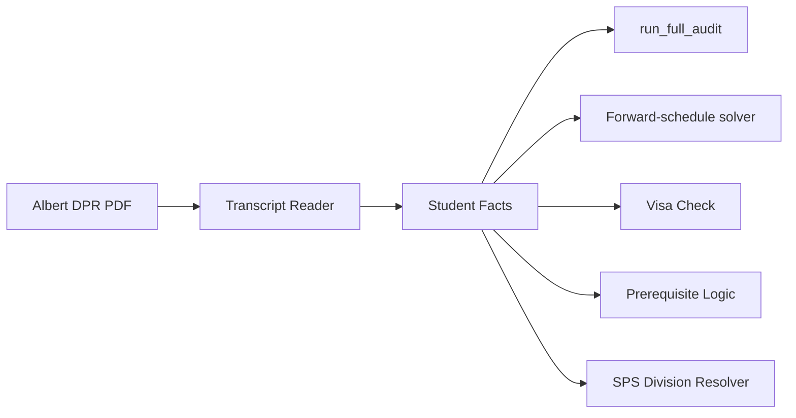
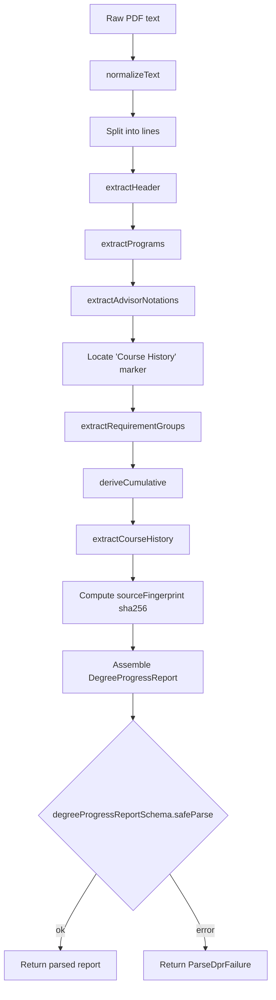
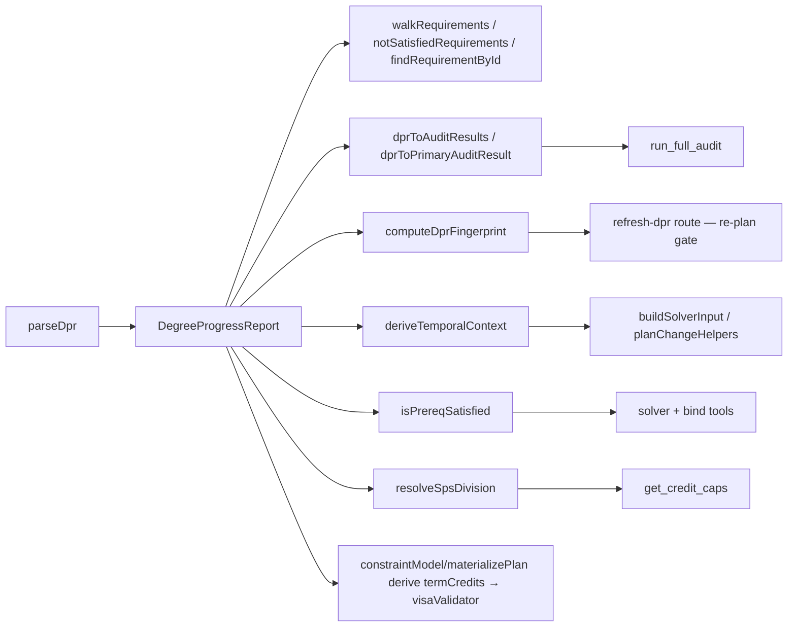

# DPR Subsystem — Technical Audit

> Last verified against code: 2026-06-18 (plan 35 — W / pass-fail → requirement modeling is now COMPUTED via pure `applyWithdrawalToDpr` / `applyPassFailToDpr` DPR transforms + per-school `pfEligibility`, surfaced read-only via `probe_counterfactual` arms + a confirmable `propose_whatif_assumption` flow that persists only the `forward_schedule`; `reportKind` flag + `assertAuthoritativeDpr` guard; Branch-A `/api/whatif-audit` exploration upload; the frozen contract is untouched). Prior: 2026-06-17 (Phase 4 follow-up F3-campus — `academicCalendar.ts` now gives NYU Shanghai + Abu Dhabi their OWN sourced per-season patterns, `SHANGHAI_SEASON_WINDOWS` / `ABU_DHABI_SEASON_WINDOWS`, instead of sharing the NY defaults; genuinely-unsourced windows left absent → hedge). Prior: 2026-06-16 (F3-revise — §13 IP-course changeability temporal model reworked to a **per-SEASON typical-date** model: `academicCalendar.ts` now holds one assumed date-set per season applied every year + `classifyIpChangeability.ts` stamps the term's year onto it and ALWAYS hedges "typical, shifts each year"). Prior: 2026-06-10 (post planning-engine rebuild, PRs #35-#41).

## TL;DR

Think of this as the system's "transcript reader." When a student uploads their official NYU Degree Progress Report PDF, this subsystem reads it like a human would and turns the messy text into clean, organized data the rest of the app can use. It pulls out things like which classes the student has finished, which they're currently taking, what their GPA is, how many credits they have, and which graduation requirements are still incomplete. Because the PDF comes from NYU's official records office, the data here is treated as the source of truth for everything else the app does. It also handles tricky stuff like deciding whether a grade is good enough to count as a prerequisite, figuring out what semester it currently is for the student, checking whether someone on an F-1 visa is taking enough credits, and (for SPS students) deciding which division's advanced-standing cap applies.



---

The DPR subsystem ingests Albert Degree Progress Report PDFs, parses them into a typed in-memory document, and exposes that document to the rest of the engine (the audit tool, the forward-schedule solver, the prereq check, the visa validator, the SPS division resolver). This audit was derived strictly from the code in `packages/engine/src/dpr/`; comments and prior docs were not trusted.

The schema is the only **Zod-validated seam** in the engine's planning data flow — `SolverInput` and `ForwardSchedule` downstream are plain TypeScript types. Validation happens once, at the DPR boundary.

---

## 1. What the DPR is

A "DPR" in this system is the structured form of an Albert **Degree Progress Report**. Source artifact: an Oracle Analytics Publisher PDF that wraps PeopleSoft's Academic Advisement Report. The PDF byte-stream → text extraction happens **upstream in the web app**: `apps/web/app/api/onboard/route.ts` (and `refresh-dpr/route.ts`) call `extractText` from `unpdf` (route.ts:126) and hand the resulting text to `parseDpr` (route.ts:143). The parser itself is text-in, JSON-out and lives in the engine package so the test suite can invoke it without PDF tooling. (The pre-rebuild doc cited `tools/dpr-parser/runParser.ts` as the extraction site; that path no longer exists.)

The parser also accepts **What-If / Career Simulation Reports** — a hypothetical-program variant of the DPR whose title line reads `Degree Progress Report What-If Report` followed by a `Career Simulation Report` sub-title line before the name line. The header extractor handles both (parser.ts:189-208, 211-214). Both bundled fixtures (`dpr_sample.redacted.txt`, `dpr_whatif_sample.redacted.txt`) are CAS reports.

A DPR has these visible regions, in roughly the order they appear in the PDF:

- **Header** — the `Degree Progress Report` title line (or the What-If variant), plus `For <student name> prepared on <MM/DD/YYYY>` and an optional `Requested by` line. (parser.ts:182-231)
- **Programs table** — one row per active program affiliation (career, program, major, minor, concentration), each tagged with a requirement term (catalog year) and a rollup status. (parser.ts:237-300)
- **Advisor Notations** — free-form numbered lines (e.g. `1. Request id 0000013777 ... T. Gurstel 09/17/2024`) capturing manual exceptions/waivers. (parser.ts:306-344)
- **Requirement Groups and Requirements** — the bulk of the document. Section headers of the form `<title> (<RGID|RID>)` where `RG\d+` opens a Requirement Group and `R\d+(/\d+)?` opens a Requirement leaf. (parser.ts:346-559)
- **Cumulative metrics** — derived from a fixed set of well-known requirement IDs. (parser.ts:776-853)
- **Course History** — the chronological tail of the document; every course the student has touched (EN/TE/IP) regardless of which requirement it counted toward. (parser.ts:765-770)

The per-row **`type` column** is the primary semantic axis of the DPR:

- `EN` = enrolled at NYU, course completed (final grade present)
- `TE` = transfer or test credit (AP, IB, study-away, etc.)
- `IP` = in progress — student is currently registered, no grade yet
- Other PeopleSoft type codes are stored verbatim in `DPRCourseRow.type`. (schema.ts:33-44)

The DPR is the **canonical input** for the agent's post-pivot tools: anything the agent claims about credits, GPA, completed courses, in-progress courses, residency, etc. must trace back to a field on the parsed `DegreeProgressReport`.

---

## 2. The schema

Defined in `schema.ts`. Shapes are Zod schemas that double as TypeScript types via `z.infer<…>` (the recursive `DPRRequirementGroup` is a hand-written interface backed by a `z.lazy` schema).

### 2.1 `DPRCourseRow` (schema.ts:33-44)

One row from any "Courses Used" table or from the Course History block.

```pseudo
DPRCourseRow := {
    term:        string  // "2026 Fall", "2024 Spr"
    subject:     string  // "CSCI-UA", "MATH-UA", "ELECTIVE"
    catalogNbr:  string  // "101", "200XG", "9121"
    courseTitle: string
    grade:       string | null  // null when type === "IP"
    units:       number  // 4.00, 2.00, 0.00
    type:        string  // "EN" | "TE" | "IP" | other
    repeatCode?: string  // "RI" | "R" | other (from continuation lines)
    courseTopic?: string // attached topic suffix, when present
}
```

### 2.2 `DPRCounter` (schema.ts:56-75)

The "X required, Y used, Z needed" line that appears under most requirement nodes. Discriminated by `kind`:

```pseudo
DPRCounter :=
    | { kind: "units",   required: number, used: number, needed?: number }
    | { kind: "courses", required: number, used: number, needed?: number }
    | { kind: "gpa",     required: number, completed: number }
```

The `gpa` flavor renames `used` → `completed` to mirror PeopleSoft's wording.

### 2.3 `DPRStatus` (schema.ts:87)

```pseudo
DPRStatus := "satisfied" | "not_satisfied" | "overall_not_satisfied"
```

`overall_not_satisfied` is used on a parent group when at least one of its child requirements is unsatisfied.

### 2.4 `DPRRequirement` (leaf, schema.ts:96-105)

```pseudo
DPRRequirement := {
    rId:         string   // "R1142/20"
    title:       string
    status:      DPRStatus
    statusText:  string   // verbatim status sentence
    description?: string
    counter?:    DPRCounter
    coursesUsed: DPRCourseRow[]
}
```

### 2.5 `DPRRequirementGroup` (recursive, schema.ts:114-132)

```pseudo
DPRRequirementGroup := {
    rgId:        string   // "RG5076"
    title:       string
    status:      DPRStatus
    statusText:  string
    description?: string
    children:    Array<DPRRequirementGroup | DPRRequirement>
}
```

### 2.6 `DPRHeader` (schema.ts:141-146)

```pseudo
DPRHeader := { studentName: string; preparedDate: string; requestedBy?: string }
```

The verbatim `preparedDate` ("04/27/2026", not parsed) lets the agent render staleness messages exactly as printed.

### 2.7 `DPRProgram` (schema.ts:156-162)

```pseudo
DPRProgram := { programType: string; label: string; requirementTerm: string; requirementStatus: DPRStatus }
```

### 2.8 `DPRAdvisorNotation` (schema.ts:173-179)

```pseudo
DPRAdvisorNotation := { requestId?: string; note: string; advisor?: string; date?: string }
```

The full sentence is always preserved as `note`; the structured fields are best-effort regex extractions.

### 2.9 `DPRCumulative` (schema.ts:208-231)

Top-line metrics derived from specific R-IDs. Every field is nullable so the parser can surface "not present" rather than guess.

```pseudo
DPRCumulative := {
    creditsRequired:        number | null   // R1001/10 .required
    creditsUsed:            number | null   // R1001/10 .used
    cumulativeGpa:          number | null   // R1001/20 .completed
    cumulativeGpaRequired:  number | null   // R1001/20 .required
    residencyRequired:      number | null   // R1001/35 .required
    residencyUsed:          number | null   // R1001/35 .used
    passFailUsedUnits:      number | null   // R1680/10 .used
    passFailCapUnits:       number | null   // parsed from R1680/10 desc, default 32
    outsideHomeUsedUnits:   number | null   // R1680/30 .used
    outsideHomeCapUnits:    number | null   // parsed from R1680/30 desc, default 16
    timeLimitYears:         number | null   // first number in R1680/60 desc/statusText
    residencyAll?:          Array<{ rId: string; required: number | null; used: number | null }>
}
```

`residencyAll` (DPR-6) is new since the pre-rebuild doc: every requirement whose title/statusText contains "residenc" (case-insensitive), so callers can see joint-major or program-specific residency rows (e.g. `R1142/80`) beyond the primary `R1001/35`. Non-units counters yield `null` for required/used. The field is omitted when no residency rows are found.

### 2.10 `DPRMeta` (schema.ts:245-256)

```pseudo
DPRMeta := {
    parserVersion:        string    // "1.0.0"
    parsedAt:             string    // ISO timestamp
    sourceFingerprint:    string    // "sha256:<hex>" over the normalized text
    sourcePdfPageCount:   number    // -1 when not provided
    parseDurationMs:      number
    warnings:             string[]  // non-fatal parser warnings
}
```

`sourceFingerprint` here is the hash of the **raw normalized text** (parser.ts:116). That is different from `computeDprFingerprint` (Section 5), which hashes a **content subset** of the parsed report.

### 2.11 `DegreeProgressReport` (schema.ts:258-267)

```pseudo
DegreeProgressReport := {
    _meta; header; programs[]; advisorNotations[]; cumulative; requirementGroups[]; courseHistory[]
}
```

### 2.12 Tree-walking helpers (schema.ts:272-330)

- `walkRequirements(groups)` — depth-first walk yielding every leaf `DPRRequirement`. (schema.ts:272-285)
- `notSatisfiedRequirements(groups)` — filters to unsatisfied leaves, drops synthetic `<rgId>/_summary` rollups, and dedupes parent-vs-leaf duplicates: if `X/n` is in the result, any plain `X` parent is dropped. (schema.ts:304-322)
- `findRequirementById(groups, rId)` — exact-id lookup. (schema.ts:325-330)

---

## 3. The parser

Defined in `parser.ts`. The public entry is `parseDpr(rawText, opts)` (parser.ts:74), returning either `{ ok: true, report }` or `{ ok: false, error, contextLines? }`.



### Step-by-step

1. **Normalize text** (`normalizeText`, parser.ts:148-176): strip `===== PAGE N =====` markers; strip embedded `<a>`/`</a>` anchors; decode HTML entities (`&#160;`, `&nbsp;`, `&amp;`); drop soft-hyphens; fold non-breaking spaces to ASCII; fold all middle-dot glyph variants (`·`, `•`, `‧`, and the U+0387 Greek ano teleia pypdf returns for the canonical CAS report) to a single `·`; strip trailing whitespace per line while preserving leading whitespace (it carries continuation semantics).

2. **Header** (`extractHeader`, parser.ts:182-231): scan the first 20 lines for a line *starting with* `Degree Progress Report` (after stripping a leading `Page N of M` runner) — the `startsWith` check is what admits the What-If variant. Skip any `Career Simulation Report` sub-title line, then the next non-empty line must match `For <name> prepared on <date>`. The line after may begin with `Requested by`. On miss, parse fails with the first 10 lines as context.

3. **Programs table** (`extractPrograms` + `parseProgramRow`, parser.ts:237-300): anchor on `Program Requirement Term Requirement Status`; parse each row right-anchored — peel the trailing status phrase, then the trailing `<Season> <Year>`, then split the remainder by a known program-type vocabulary suffix (`Undergraduate Career`, `Graduate Career`, `Program`, `Major Approved`, `Major`, `Minor Approved`, `Minor`, `Concentration`, `Specialization`). Unknown type prefixes fall back to `programType = "Program"` with a warning.

4. **Advisor notations** (`extractAdvisorNotations`, parser.ts:306-344): anchor on `Advisor Notations`; numbered `N. <text>` lines, continuations appended; a blank line followed by a section-header-shaped line terminates the region. Best-effort regexes extract `Request id`, a trailing `MM/DD/YYYY` date, and an advisor-name token.

5. **Locate Course History boundary** (parser.ts:101-102): find the literal line `Course History`; everything before it is the audit body.

6. **Requirement groups / requirements** (parser.ts:359-559): `findSectionHeaders` scans for `<title> (<RGID|RID>)` (excluding the course-table column header). Each section runs to the next header. `parseSection` walks each body: find the status line (default `satisfied` with a warning if none); collect description; parse counter lines (**last counter wins**); parse an optional `Courses Used` table. Nesting (parser.ts:399-421): each `RG` opens a current group; subsequent `R`s become children; orphan `R`s before the first `RG` (typically `R1680/10` Pass/Fail, `R1680/30` Outside-CAS, `R1680/60` Time Limit) are wrapped in a synthetic `RG_ORPHAN_PRE` group titled "Pre-graduation Limits". A counter directly on an `RG` header is moved into a synthetic `<rgId>/_summary` child (groups have no counter slot); `notSatisfiedRequirements` filters those out.

7. **Counter parsing** (`parseCounter`, parser.ts:565-596): strip leading `·`, try GPA → Units → Courses regexes; when `required` is absent for units/courses, default to `0`.

8. **Course row parsing** (`parseCourseTable` + `parseCourseRow`, parser.ts:638-759): the primary regex is right-anchored on units+type; subject pattern is `[A-Z][A-Z0-9]*-[A-Z]{2,3}` OR the bare token `ELECTIVE`; season vocabulary `Fall | Spring | Spr | Summer | J-Term | January`. A no-grade variant handles IP rows. **Wrapped-title handling** peeks 1-2 lines forward for an optional `(<topic>)` line and a `<grade> <units> <type>` (or `<units> <type>`) tail. **Continuation lines** (5+ leading spaces) attach as `Course Topic:` / `Repeat Code:` / wrapped-title fragments. **Page-footer stripping** (`stripPageFooterPrefix`, parser.ts:634-636) peels a `Page N of M` runner glued onto the first row of a page; the non-greedy `\d+?` plus a year/season lookahead handles `"Page 9 of 9" + "2025"` → `"of 92025"`. Rows matching neither variant emit a warning and are dropped.

9. **Course history** (`extractCourseHistory`, parser.ts:765-770): skip the column header if present, then feed the rest through `parseCourseTable`.

10. **Cumulative metrics** (`deriveCumulative`, parser.ts:776-853): build an `rId → DPRRequirement` map and read counters off `R1001/10` (credits), `R1001/20` (GPA + required), `R1001/35` (residency), `R1680/10` (P/F used; cap from description via `parseUnitCap`, default 32), `R1680/30` (outside-CAS used; cap default 16), `R1680/60` (time-limit years, first number). Also collect `residencyAll` via the "residenc" heuristic. Missing `R1001/10` or `R1001/20` emit warnings but parsing continues with `null`.

11. **Fingerprint and meta** (parser.ts:116-125): `sourceFingerprint = "sha256:" + sha256(normalizedText)`; assemble `_meta`.

12. **Final schema validation** (parser.ts:135-141): the assembled object is run through `degreeProgressReportSchema.safeParse`. On failure the parser returns `ParseDprFailure` with the joined Zod issue paths — the safety net against parser-vs-schema drift.

### Output type guarantees

- `parseDpr` returns `ParseDprResult = ParseDprSuccess | ParseDprFailure` (parser.ts:71).
- `ParseDprSuccess.report` always satisfies `degreeProgressReportSchema`.
- Non-fatal warnings accumulate in `report._meta.warnings`.

---

## 4. dprToAuditResult

`dprToAuditResult.ts` adapts a `DegreeProgressReport` into the `AuditResult` shape from `@nyupath/shared`, the format the agent's `run_full_audit` summarizer already consumes.

### 4.1 `dprToAuditResults(dpr, opts)` (dprToAuditResult.ts:57-92)

Emits **one `AuditResult` per declared program**. Per program: `studentId` defaults to the studentName slug (or `opts.studentId`); `programId` defaults to a slug from `(label, programType)` via `programIdFromLabel` (it is purely a label, not a key into any program JSON catalog); `programName = "<label> (<programType>)"`; `catalogYear = program.requirementTerm`; `overallStatus = dprStatusToRuleStatus(...)`; `totalCreditsCompleted/Required` from `dpr.cumulative`; `rules` = every leaf requirement mapped through `reqToRuleAuditResult`; `warnings` = a copy of `dpr._meta.warnings`.

PeopleSoft doesn't tag each Requirement with its owning program, so the adapter conservatively assigns **every** leaf requirement to **every** program — mirroring the actual audit semantics.

### 4.2 `dprToPrimaryAuditResult(dpr, opts)` (dprToAuditResult.ts:100-111)

Runs `dprToAuditResults`, returns the first whose `programName` contains `"Major"`, falls back to `audits[0]`, returns `null` if no programs.

### 4.3 – 4.5 Per-requirement mapping

- `reqToRuleAuditResult` (dprToAuditResult.ts:115-126): `ruleId = rId`, `label = title`, `status` via `dprStatusToRuleStatus`, `coursesSatisfying` = formatted course IDs, `remaining` via `computeRemaining`, `coursesRemaining = []` (the DPR doesn't enumerate which courses would satisfy).
- `dprStatusToRuleStatus` (dprToAuditResult.ts:128-134): `satisfied → satisfied`; `overall_not_satisfied → in_progress`; `not_satisfied → in_progress` if any course applied else `not_started`.
- `computeRemaining` (dprToAuditResult.ts:136-146): no counter → `0` if satisfied else `1`; gpa counter → `0` if `completed >= required` else `1`; explicit `needed` → `needed`; otherwise `max(0, required − used)`.

### 4.6 One-way conversion

The adapter flattens the recursive `RG → R` tree to a list of leaves; group identity is dropped. Intentional — the `AuditResult` shape has no concept of groups.

---

## 5. Fingerprint

`fingerprint.ts` exports `computeDprFingerprint(report)` (fingerprint.ts:36). Used by the Update-DPR route to decide whether a re-uploaded DPR **meaningfully** differs from a stored one. When fingerprints match, the route short-circuits; when they differ, the existing forward schedule is dropped and replanned. (Login does NOT invoke this — the restore route just reads the stored schedule.)

### 5.1 Algorithm

1. Flatten each `courseHistory` row to `${term}|${subject}|${catalogNbr}|${units}|${grade ?? ""}|${type}`.
2. Sort lexicographically — re-parsing the same PDF in a different order yields the same fingerprint.
3. `JSON.stringify` a canonical object `{ courseHistory: <sorted>, cumulative, programs: programs ?? [], advisorNotations: advisorNotations ?? [] }`.
4. SHA256 → hex (no `sha256:` prefix; raw hex).

### 5.2 What participates / is excluded

`advisorNotations` **DO** participate (DPR-3) — an adviser waiver is a meaningful audit change, so adding/removing one triggers a re-plan. (This is a change from the pre-rebuild doc, which listed advisor notations as excluded.)

Excluded (would force a re-plan on every cosmetic re-upload): `_meta.*`, `header.preparedDate`, and `requirementGroups`.

| Field | Hash input | Used for |
|---|---|---|
| `_meta.sourceFingerprint` | Normalized PDF text | Detect identical PDF uploads, dedupe re-uploads |
| `computeDprFingerprint(report)` | Sorted courseHistory + cumulative + programs + advisorNotations | Detect *meaningful* progress changes; gate re-planning |

---

## 6. Grade comparison

`gradeComparison.ts` defines a total order over NYU letter grades and the `meetsGradeThreshold` comparator. Prereq-satisfaction call sites route through this rather than re-implementing the ladder.

### 6.1 `GRADE_ORDER` (gradeComparison.ts:38-59)

Higher number = better. `A+`=13, `A`=12, `A-`=11, `B+`=10, `B`=9, `B-`=8, `C+`=7, `C`=6, `C-`=5, `D+`=4, `D`=3, `D-`=2, `F`=0. Pass-style marks `P`, `CR`, `S` all map to rank `6` (C-equivalent).

### 6.2 `meetsGradeThreshold(studentGrade, requiredGrade)` (gradeComparison.ts:79-88)

- `studentGrade` null/undefined/empty → `false`.
- Both grades uppercased and trimmed before lookup.
- Either grade not in the table (W, I, NR, audit marks, typos) → `false` (fail-closed).
- Otherwise `studentGrade >= requiredGrade`.

Consequences of the P/CR/S = 6 rule: `P` vs `C` → `true`; `P` vs `B` → `false`; `P` vs `D` → `true`. `F` (rank 0) fails any threshold from `D-` up.

---

## 7. Prereq satisfaction

`prereqSatisfaction.ts` is the canonical optimistic-forward-projection prereq check (`isPrereqSatisfied`, prereqSatisfaction.ts:173). The forward-schedule solver and the bind tools route through it. All course IDs are run through `canonicalizeCourseId` (from `../courseId.js`) on both sides so padded/unpadded forms of the same course (`EXPOS-UA 0001` vs `EXPOS-UA 1`) match.

### 7.1 The rule

Given prereq course Y, dependent course X in solver-format term T, the DPR, the solver's current `plannedPlacements`, optional `minGrades`, and a mode (`"prereq"` strict-before-T, or `"coreq"` at-or-before-T):

| Step | Reason emitted | Trigger |
|---|---|---|
| 1 | `dpr-satisfiedBy` | Y appears in some leaf requirement's `coursesUsed[]` |
| 2 | `ip-attempt` | Y has a `type === "IP"` row in `courseHistory` (assumed-passing) |
| 3 | `future-placement` | `plannedPlacements.has(Y)` AND the placed term is before/at T per mode |
| 4 | `dpr-satisfiedBy-implicit` | `minGrades[Y]` set AND the most-recent EN/TE attempt meets the threshold |
| — | `fail-grade-threshold` | `minGrades[Y]` set AND the most-recent EN/TE attempt is below threshold |
| — | `fail-no-attempt` | No EN/TE rows AND none of paths 1-3 fired |
| — | `fail-no-implicit-acceptance` | EN/TE attempt(s) exist, `minGrades[Y]` absent, Step 1 returned false |

(prereqSatisfaction.ts:193-273; reason union at prereqSatisfaction.ts:39-47)

### 7.2 Term comparison

Solver terms are `"YYYY-season"` (`compareSolverTerms`, season ranks `spring=0, summer=1, fall=2, january=3`). DPR terms are `"YYYY Season"` (`compareDprTerms`). Mode controls Step 3 strictness: `"prereq"` strictly-before-T; `"coreq"` at-or-before-T.

### 7.3 Most-recent attempt selection

When `minGrades[Y]` is set, all matching EN/TE rows are sorted ascending by `compareDprTerms`; the last is the most-recent attempt (ties resolve by array order, last wins, prereqSatisfaction.ts:261-262).

### 7.4 Course-id format

`rowToCourseId` formats as `canonicalizeCourseId("<subject> <catalogNbr>")` (prereqSatisfaction.ts:144-148).

---

## 8. Temporal context

`temporalContext.ts` derives "what term is it right now" and "what is the student currently enrolled in" — two distinct concerns sharing the DPR input.

### 8.1 The core problem

Pre-fix logic took the **latest IP row** as the current term, which broke for students pre-registered for the next semester. The fix decouples wall-clock truth from IP-row truth.

### 8.2 `termInSession(now)` (temporalContext.ts:96-110)

Calendar-only mapping (UTC): Jan-May → `Spring`, Jun-Jul → `Summer`, Aug-Dec → `Fall`. August deliberately rolls into Fall (registration opens late August).

### 8.3 `nextTermAfter(t)` (temporalContext.ts:75-83)

Fall → Spring (next year); Spring → Fall (same year, Summer deliberately skipped); Summer → Fall; Winter → Spring; January → Spring.

### 8.4 `pickCurrentFromIP(parsed, wallClock)` (temporalContext.ts:116-141)

1. Prefer an exact year+season match. 2. Otherwise the earliest IP term `>=` wall-clock (DPR may be stale). 3. If all are past, the latest as best approximation.

### 8.5 `deriveTemporalContext(dpr, options)` (temporalContext.ts:181-224)

```pseudo
DprTemporalContext := {
    currentTerm?:        string    // wall-clock label
    nextTerm?:           string    // wall-clock + 1
    enrolledNowTerm?:    string    // IP-row term overlapping wall-clock
    preRegisteredTerms?: string[]  // IP terms strictly after wall-clock, sorted
}
```

Pipeline: compute wall-clock `currentTerm`/`nextTerm`; filter `courseHistory` to IP; parse terms (drop unparseable); `enrolledNowTerm = pickCurrentFromIP(...)`; `preRegisteredTerms` = remaining IP terms strictly after wall-clock. `currentTerm`/`nextTerm` are clock-only and always returned regardless of DPR contents.

### 8.6 `normalizeGraduationTarget(raw)` (temporalContext.ts:228-242)

Normalizes free-form input (`"spring2027"`, `"spring 27"`, `"fall 2026"`) into canonical `"Spring 2027"`-form; two-digit years bumped by 2000; returns `undefined` on no-match.

---

## 9. Visa validator

`visaValidator.ts` evaluates F-1 / domestic enrollment compliance for a given term + credit count. It is pure — no I/O, no direct DPR access (the credit count is supplied by the caller). Consumed by the forward-schedule solver (`constraintModel.ts`, `materializePlan.ts`) and the section-materialization layer.

### 9.1 / 9.2 Input + result shapes

`VisaInputContext` carries `termCredits`, `term`, a `profile` projection (`visaStatus`, `rclApproved`, `cptEnrolled`, `finalTermException`, `isFinalTerm`, `allowBelowF1Floor`), three nullable floors/caps (`f1Floor` default 12, `domesticPartTimeFloor` default 8, `f1OnlineCreditsPerTermCap` default 3), and an optional precomputed `schedulingPreferenceCheck`.

`VisaValidationResult` returns eight axes (`fullTimeSatisfied`, `creditMinimumSatisfied`, `onlineLimitSatisfied`, `inPersonMinimumSatisfied`, `rclEligible`, `cptConflict`, `finalTermExceptionPossible`, `schedulingPreferenceSatisfied`), each a 4-state `ValidationResult` (`pass | assumed-pass | requires-approval | fail`), plus `overallWarningLevel` and `citations`.

### 9.3 Per-axis logic (visaValidator.ts:98-215)

- **fullTimeSatisfied**: F-1 ≥ floor → `pass`; F-1 below floor with RCL → `pass`; F-1 below floor no RCL → `fail`. Domestic ≥ floor → `pass`; below with `allowBelowF1Floor` → `pass`; else `fail`.
- **creditMinimumSatisfied**: floor = `domesticPartTimeFloor ?? f1Floor ?? 8`; ≥ floor → `pass` else `fail`.
- **onlineLimitSatisfied** / **inPersonMinimumSatisfied**: always `assumed-pass` (no FOSE meetingPattern data yet).
- **rclEligible**: non-F-1 → `pass`; F-1 ≥ floor → `pass`; F-1 below floor with RCL → `pass`; else `requires-approval` (OGS).
- **cptConflict**: F-1 with `cptEnrolled` → `requires-approval` (OGS); else `pass`.
- **schedulingPreferenceSatisfied**: undefined/`absent` → `assumed-pass`; `satisfied` → `pass` (FOSE); `violated` → `fail` with the supplied reason verbatim.
- **finalTermExceptionPossible**: F-1 + final term + below floor + exception flag → `requires-approval` (registrar); F-1 + final term + below floor + no flag → `fail`; else `pass`.

### 9.4 Warning level (visaValidator.ts:219-227)

Highest-severity axis wins: any `fail` → `"high"`; else any `requires-approval` → `"medium"`; else any `assumed-pass` → `"low"`; else `"none"`.

### 9.5 Citations (visaValidator.ts:231-264)

Conditional OGS/Decision citation strings appended based on which axes fired (RCL, CPT, final-term exception, F-1 online-cap — suppressed for non-F-1, and scheduling-preference fail).

---

## 10. SPS division resolver

`spsDivision.ts` — new in this subsystem since the pre-rebuild doc. `resolveSpsDivision(dpr)` (spsDivision.ts:72) reads a `DegreeProgressReport` and returns which advanced-standing cap applies for an SPS student, with high confidence or a confident-route-or-ask low-confidence verdict. Consumed by `get_credit_caps` (`agent/tools/getCreditCaps.ts:78`).

### 10.1 The rule (degree-level-first)

- Every SPS associate (AAS/AA) → DAUS → cap **30**.
- Among bachelor's: Real Estate → Schack Institute (64); Hospitality → Tisch Center (64); Sport → Tisch Institute (64); all other BS/BA → DAUS (80).

Only `Major`-type program rows drive the division — the school rollup ("Sch of Prof Studies") and minor rows are ignored. Degree level is read first from the program label (`degreeLevelFromLabel`); when the label is ambiguous, it falls back to a credits band (`bandFromCredits`: `<=66` associate, `>=100` bachelor's). A label-vs-credits conflict drops that program.

### 10.2 Verdicts

```pseudo
SpsDivisionVerdict :=
  | { confidence: "high"; division; degreeLevel; advancedStandingCap: 64|80|30; matchedLabel }
  | { confidence: "low";  reason; options: SPS_DIVISION_OPTIONS }
```

`high` is returned only when all resolved Major rows collapse to exactly one distinct division+level. Otherwise `low` (no determinable SPS major, or multiple divisions) returns the three scoped caps so the agent can ask the student which applies.

---

## 11. How tools use the DPR

The DPR is a passive, immutable document. Consumers reach into it as follows.



Direct consumers (verified importers):

| Helper / module | Consumed by |
|---|---|
| `dprToAuditResults`, `notSatisfiedRequirements`, `walkRequirements` | `run_full_audit` (`agent/tools/runFullAudit.ts`) |
| `computeDprFingerprint` | `plan_forward_degree`, `confirm_plan_change` tools + the `refresh-dpr` web route |
| `deriveTemporalContext` | `agent/forwardSchedule/buildSolverInput.ts`, `planChangeHelpers.ts` |
| `isPrereqSatisfied` | `agent/forwardSchedule/solverHelpers.ts`, `bind_free_elective`, `bind_pool_slot` |
| `meetsGradeThreshold` | `agent/forwardSchedule/reconcile.ts`, `buildSolverInput.ts` (and `isPrereqSatisfied` internally) |
| `visaValidator` | `agent/forwardSchedule/constraintModel.ts`, `materializePlan.ts`, `agent/sectionMaterialization/types.ts` |
| `resolveSpsDivision` | `agent/tools/getCreditCaps.ts` |

`reconcile.ts` (`agent/forwardSchedule/`) fires re-plans when an IP row resolves to a final grade — the mechanism that flips an optimistically-satisfied IP prereq if the eventual grade is below threshold.

The barrel `dpr/index.ts` exports the schema + types, `parseDpr`, the audit adapter, `deriveTemporalContext` / `normalizeGraduationTarget`, `computeDprFingerprint`, and `resolveSpsDivision` / `SPS_DIVISION_OPTIONS`. It does **not** re-export `gradeComparison`, `prereqSatisfaction`, or `visaValidator` — those are imported by their direct paths from the forward-schedule layer.

---

## 12. Edge cases

### 12.1 Partial DPRs

- **Missing programs**: `extractPrograms` returns `[]` + warning; `dprToAuditResults` returns `[]`; `dprToPrimaryAuditResult` returns `null`.
- **Missing requirement groups**: `[]`; `walkRequirements` returns `[]`; each program still gets an `AuditResult` with an empty `rules` array.
- **Missing course history**: warning pushed; `courseHistory = []`; `deriveTemporalContext` returns just `{ currentTerm, nextTerm }`; `computeDprFingerprint` hashes the empty array.
- **Missing cumulative requirements**: `R1001/10`/`R1001/20` absent → warnings + `null` fields; `dprToAuditResults` coerces those to `0`.
- **Missing P/F / outside-home caps**: defaults `32` / `16` via `parseUnitCap`.
- **Missing time limit**: `null`, no default.

### 12.2 Conflicting / unusual IP rows

Multiple IP terms, no exact match, all-past, and unparseable-term handling are governed by `pickCurrentFromIP` / `deriveTemporalContext` (§8). IP rows are treated as satisfied prereqs unconditionally by `isPrereqSatisfied` Step 2 (no grade yet); `reconcile.ts` flips this when a final grade lands. Retakes are handled by most-recent-attempt selection via `compareDprTerms`.

### 12.3 Counter quirks

Multiple counters on one R → **last wins**. A counter on an `RG` header → moved to a synthetic `<rgId>/_summary` child, filtered by `notSatisfiedRequirements`. Counter-parse miss → no counter; `computeRemaining` falls back to "1 if not satisfied, 0 if satisfied".

### 12.4 Parent vs leaf duplication

`notSatisfiedRequirements` dedupes: if any other rId is `"<thisRId>/<suffix>"`, the parent is dropped (schema.ts:304-322).

### 12.5 Synthetic group / summary

`RG_ORPHAN_PRE` hosts orphan limit-style Rs (status hardcoded `satisfied`, descriptive only). `<rgId>/_summary` leaves appear in `walkRequirements` + the `AuditResult.rules` list but are filtered by `notSatisfiedRequirements`.

### 12.6 Page-footer collision

`stripPageFooterPrefix` peels a `Page N of M` runner glued onto a content row; the non-greedy `\d+?` + year/season lookahead is critical for `"Page 9 of 9" + "2025"`.

### 12.7 Grade ladder closed-world

Any grade outside `GRADE_ORDER` → `false` from `meetsGradeThreshold` (fail-closed).

### 12.8 Schema-validation failure on parser output

The final `degreeProgressReportSchema.safeParse` fails the whole parse with `ParseDprFailure` even when all intermediate steps "succeeded" — the guard against parser-vs-schema drift.

## 13. IP-course changeability — temporal model (Phase 4 follow-up F3)

The DPR marks a course `IP` (in-progress) for BOTH a current-term enrollment and a future-term pre-registration. They are NOT equally changeable, and the difference is real-world registration policy, not planning:

- `deriveTemporalContext(dpr)` (`temporalContext.ts`) separates an IP row into the **current** term (`enrolledNowTerm`, reconciled with wall-clock `termInSession(now)`) vs **future** pre-registered terms (`preRegisteredTerms`) — the two sets are disjoint by construction.
- **`academicCalendar.ts`** is an owner-correctable config of NYU registration windows, modeled **per SEASON** (`Season` = `fall` / `spring` / `summer` / `january` (the J-term)) rather than per specific term-year. The shape is `AcademicCalendar = Record<Campus, Record<Season, SeasonWindows>>` (`Campus` = `ny` / `shanghai` / `abudhabi`, via `campusForHomeSchool`); each `SeasonWindows` carries year-agnostic `"MM-DD"` `MonthDay` strings: `termStartMonthDay` · `addDropMonthDay` · `withdrawMonthDay`. **The dates are TYPICAL/ASSUMED-every-year, NOT a specific year's official dates** (binding `core_philosophy.md`): `DEFAULT_SEASON_WINDOWS` anchors **fall** (09-02 / 09-15 / 11-26) and **spring** (01-22 / 02-04 / 04-03) to NYU's recently-published dates (cs.nyu.edu / bulletins.nyu.edu / the registrar), and gives **summer** (05-27 / 06-02 / 07-15) and **january/J-term** (01-02 / 01-06 / 01-15) as reasonable ESTIMATES. The classifier stamps the IP term's actual year onto the season pattern and ALWAYS hedges that the date is typical and shifts year to year. **Each campus now has its OWN per-season pattern** (they run genuinely different calendars): `ny` → `DEFAULT_SEASON_WINDOWS`; `shanghai` → `SHANGHAI_SEASON_WINDOWS` (fall 09-01 / 09-11 / 11-24, spring 01-18 / 01-29 / **withdrawal absent** — Shanghai publishes its full-term spring withdrawal as TBD; summer 05-17 + january 01-04 hold the sourced start only; cited shanghai.nyu.edu + bulletins); `abudhabi` → `ABU_DHABI_SEASON_WINDOWS` (14-week fall 08-25 / 09-08 / 11-07, spring 01-20 / 02-02 / 04-24; summer 05-20 + january 01-05 start only; cited nyuad.nyu.edu + bulletins). Genuinely-unsourced windows are **left ABSENT (never invented)** so the classifier falls back to its honest hedge (cite-or-hedge per `core_philosophy.md`). `getSeasonWindows(campus, season, calendar?)` looks the pattern up; `seasonOfTerm(term)` maps a term to its `Season` (a literal "winter" → `null` → hedge, since NYU's intersession is the J-term/`january`, never "winter").
- **`classifyIpChangeability(...)`** (`ipCourseChangeability.ts`, pure, `now`/`calendar`-injectable) → `{ window: "future" | "add_drop" | "withdraw_pf" | "closed" | "unknown", editable, hedge?, rationale }`. For a CURRENT-term IP it derives the **season + year**, builds concrete dates by stamping the year onto the season's `"MM-DD"` windows, then classifies. Decision order: future → freely changeable (no hedge); season unrecognized (e.g. literal "winter") → `unknown`; current within add/drop → changeable; current within the withdraw/pass-fail window → editable + a hedge naming the W/PF consequences; current past a KNOWN withdraw deadline → NOT editable (effectively locked); current past add/drop with NO withdraw date OR no usable dates at all → `unknown` (editable + generic hedge — it NEVER falsely locks for lack of data); past/stale → closed. **Every current-term hedge conveys the date is NYU's TYPICAL seasonal deadline (it shifts each year) + "verify with your adviser/registrar; nothing is official until your next DPR"; a SUMMER course appends an extra clause flagging that summer's many overlapping sub-sessions make the deadline especially uncertain.**
- **Consumed by** the sidebar (`apps/web/lib/groupCoursesByTerm.ts` classifies each IP bucket → `TermBucket.ipChangeability` → `slotState.ts`; see [ui-components.md](../web/ui-components.md)) and the agent (`systemPrompt.ts` CORE RULE 15 — a claimed current-term change is an unverified assumption, never recorded as fact; only a new DPR confirms it).

#### What-if requirement modeling (plan 35, 2026-06-18) — the W / pass-fail consequence is now COMPUTED, not just hedged in prose
The previously-deferred "W / pass-fail → requirement-satisfaction" modeling is implemented as **pure DPR transforms that edit the DPR *input* and re-run the UNCHANGED frozen pipeline** (the `applyFailedCourseToDpr` pattern; the solver/validator/`finalizeForwardSchedule` are never touched):
- **`reportKind: "dpr" | "what_if"`** on the parsed report (`schema.ts` + `parser.ts` `detectReportKind`) — `"what_if"` for an Albert What-If/Career-Simulation upload. The guard **`assertAuthoritativeDpr`** (engine `persistence/profileStore.ts`, re-exported to web) refuses to write any non-`"dpr"` report to `students.parsed_dpr` — the binding R1 guardrail.
- **`applyWithdrawalToDpr(dpr, courseId)`** (`agent/forwardSchedule/withdrawTransform.ts`) — clones, sets the row grade `"W"` (GPA-neutral; drops from `coursesTaken`), strips the course from every leaf's `coursesUsed[]`, decrements counters, flips `status → not_satisfied`, stamps `reportKind:"what_if"`. A W universally re-opens the requirement.
- **`applyPassFailToDpr(dpr, courseId, outcome, schoolId)` → `{ dpr, hedges[] }`** (`passFailTransform.ts`) — **pass:** keeps credit (grade `"P"`), re-opens ONLY the major/minor/gen-ed leaves the school does NOT let P/F satisfy (per `pfEligibility`); **fail:** re-opens like the fail transform + a qualitative GPA hedge (the exact new GPA is NOT computed — other in-progress grades are unposted). `defer`/`unknown` eligibility → KEEP the leaf + a hedge (never a wrong deterministic verdict).
- **`pfEligibility(schoolId, category) → "counts" | "elective_only" | "defer" | "unknown"`** (`dpr/pfEligibility.ts`) reads the EXISTING per-school `SchoolConfig.passFail` (`countsForMajor/Minor/GenEd`) — Stern counts toward the major, CAS/Tisch/Tandon/LS/SPS/Nursing/Shanghai/NYUAD electives-only, Gallatin-minor defers, Steinhardt absent→`unknown`/hedge. Fail-safe to `"unknown"`.
- **Surfaced via** the read-only `probe_counterfactual` `withdraw`/`pass_fail` arms (re-solve + the F3 window caveat + the verify rail) and the confirmable `propose_whatif_assumption` tool → `/api/plan/whatif`; **confirm persists ONLY the resulting `forward_schedule`, never the synthetic DPR** (`runConfirmWhatIfAssumption` in `apps/web/lib/planActionOrchestrator.ts`). Branch A (a hypothetical PROGRAM change) is a separate `/api/whatif-audit` upload → labeled **non-committed** exploration. The frozen-engine contract holds throughout.

## Known limitations

- **Non-CAS parsing is untested**: both fixtures (`packages/engine/tests/fixtures/dpr_sample.redacted.txt`, `dpr_whatif_sample.redacted.txt`) are CAS reports. The parser's middle-dot folding, residency heuristic, and cumulative R-ID set were verified against the canonical CAS DPR; other schools' DPRs have not been exercised in tests.
- The cumulative R-ID set (`R1001/10`, `R1001/20`, `R1001/35`, `R1680/10`, `R1680/30`, `R1680/60`) is CAS-specific; a school that numbers these requirements differently would yield `null` cumulative fields plus warnings.

---

## File reference index

- `packages/engine/src/dpr/schema.ts`
- `packages/engine/src/dpr/parser.ts`
- `packages/engine/src/dpr/dprToAuditResult.ts`
- `packages/engine/src/dpr/fingerprint.ts`
- `packages/engine/src/dpr/gradeComparison.ts`
- `packages/engine/src/dpr/prereqSatisfaction.ts`
- `packages/engine/src/dpr/temporalContext.ts`
- `packages/engine/src/dpr/academicCalendar.ts` (F3 — owner-correctable NYU registration-window config)
- `packages/engine/src/dpr/ipCourseChangeability.ts` (F3 — `classifyIpChangeability`)
- `packages/engine/src/dpr/visaValidator.ts`
- `packages/engine/src/dpr/spsDivision.ts`
- `packages/engine/src/dpr/index.ts`
- `apps/web/app/api/onboard/route.ts` (PDF text extraction + `parseDpr` call site)
