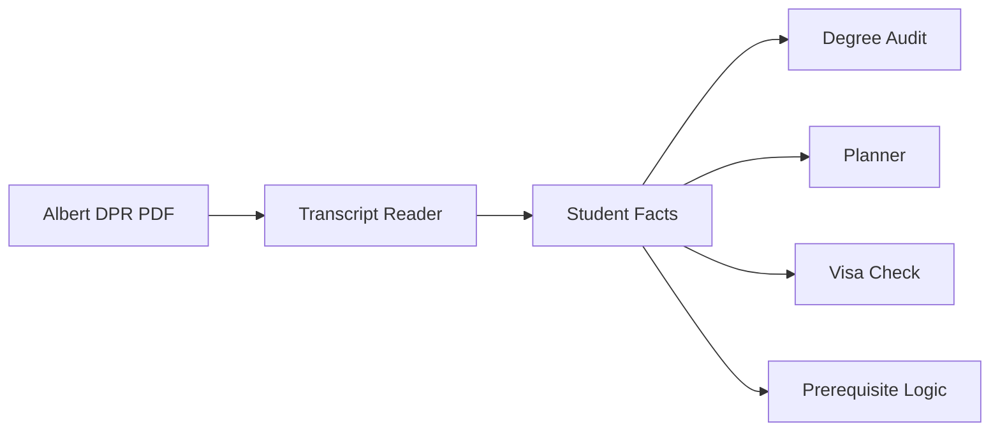
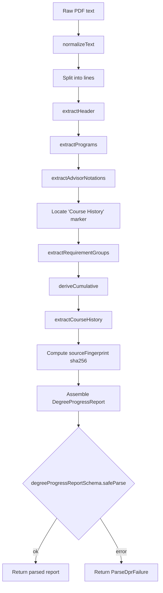
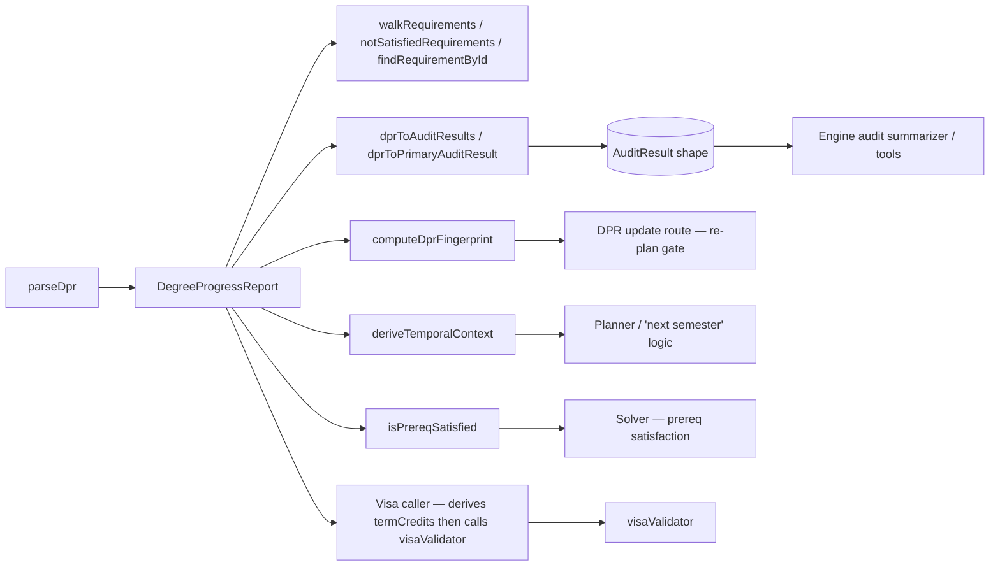
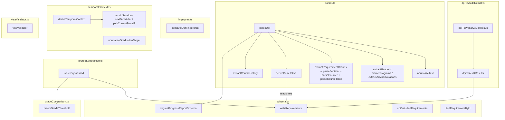

# DPR Subsystem — Technical Audit

## TL;DR

Think of this as the system's "transcript reader." When a student uploads their official NYU Degree Progress Report PDF, this subsystem reads it like a human would and turns the messy text into clean, organized data the rest of the app can use. It pulls out things like which classes the student has finished, which they're currently taking, what their GPA is, how many credits they have, and which graduation requirements are still incomplete. Because the PDF comes from NYU's official records office, the data here is treated as the source of truth for everything else the app does. It also handles tricky stuff like deciding whether a grade is good enough to count as a prerequisite, figuring out what semester it currently is for the student, and checking whether someone on an F-1 visa is taking enough credits.



---

The DPR subsystem ingests Albert Degree Progress Report PDFs, parses them into a typed in-memory document, and exposes that document to the rest of the engine (the audit summarizer, the planner, the prereq solver, the visa validator, etc.). This audit was derived strictly from the code in `packages/engine/src/dpr/`; comments and prior docs were ignored.

---

## 1. What the DPR is

A "DPR" in this system is the structured form of an Albert **Degree Progress Report**. Source artifact: an Oracle Analytics Publisher PDF that wraps PeopleSoft's Academic Advisement Report. The PDF is text-extracted upstream (in `tools/dpr-parser/runParser.ts`, per the parser's module header) and the resulting text is handed to `parseDpr` for structural decoding.

A DPR has these visible regions, in roughly the order they appear in the PDF:

- **Header** — the `Degree Progress Report` title line, plus `For <student name> prepared on <MM/DD/YYYY>` and an optional `Requested by` line. (parser.ts:182–219)
- **Programs table** — one row per active program affiliation (career, program, major, minor, concentration), each tagged with a requirement term (catalog year) and a rollup status. (parser.ts:225–288)
- **Advisor Notations** — free-form numbered lines (e.g. `1. Request id 0000013777 ... T. Gurstel 09/17/2024`) capturing manual exceptions/waivers. (parser.ts:294–332)
- **Requirement Groups and Requirements** — the bulk of the document. Section headers of the form `<title> (<RGID|RID>)` where `RG\d+` opens a Requirement Group and `R\d+(/\d+)?` opens a Requirement leaf. Inside each section: a status sentence (Satisfied / Not Satisfied / Overall Requirement Not Satisfied), an optional description, optional counter lines starting with `·`, and an optional `Courses Used` table. (parser.ts:338–547)
- **Cumulative metrics** — derived from a fixed set of well-known requirement IDs: `R1001/10` credits, `R1001/20` GPA, `R1001/35` residency, `R1680/10` pass/fail, `R1680/30` outside-home-school, `R1680/60` time limit. (parser.ts:764–825)
- **Course History** — the chronological tail of the document; every course the student has touched (EN/TE/IP) regardless of which requirement it counted toward. (parser.ts:753–758)

The per-row **`type` column** is the primary semantic axis of the DPR:

- `EN` = enrolled at NYU, course completed (final grade present)
- `TE` = transfer or test credit (AP, IB, study-away, etc.)
- `IP` = in progress — student is currently registered, no grade yet
- Other PeopleSoft type codes are stored verbatim in `DPRCourseRow.type`. (schema.ts:33–43)

The DPR is the **canonical input** for the agent's post-pivot tools: anything the agent claims about credits, GPA, completed courses, in-progress courses, residency, etc. must trace back to a field on the parsed `DegreeProgressReport`.

---

## 2. The schema

Defined in `schema.ts`. All shapes are Zod schemas that double as TypeScript types via `z.infer<…>`.

### 2.1 `DPRCourseRow` (schema.ts:33–44)

One row from any "Courses Used" table or from the Course History block.

```pseudo
DPRCourseRow := {
    term:        string  // "2026 Fall", "2024 Spr"
    subject:     string  // "CSCI-UA", "MATH-UA", "ELECTIVE"
    catalogNbr:  string  // "101", "200XG", "9121"
    courseTitle: string
    grade:       string | null  // null when type === "IP"
    units:       number  // 4.00, 2.00, 0.00
    type:        string  // "EN" | "TE" | "IP" | other
    repeatCode?: string  // "RI" | "R" | other (from continuation lines)
    courseTopic?: string // attached topic suffix, when present
}
```

### 2.2 `DPRCounter` (schema.ts:56–75)

The "X required, Y used, Z needed" line that appears under most requirement nodes. Discriminated by `kind`:

```pseudo
DPRCounter :=
    | { kind: "units",   required: number, used: number, needed?: number }
    | { kind: "courses", required: number, used: number, needed?: number }
    | { kind: "gpa",     required: number, completed: number }
```

The `gpa` flavor renames `used` → `completed` to mirror PeopleSoft's wording.

### 2.3 `DPRStatus` (schema.ts:87)

```pseudo
DPRStatus := "satisfied" | "not_satisfied" | "overall_not_satisfied"
```

`overall_not_satisfied` is used on a parent group when at least one of its child requirements is unsatisfied.

### 2.4 `DPRRequirement` (leaf, schema.ts:96–105)

```pseudo
DPRRequirement := {
    rId:         string   // "R1142/20"
    title:       string   // "Computer Science: Required Courses"
    status:      DPRStatus
    statusText:  string   // verbatim status sentence
    description?: string  // multi-line description below status
    counter?:    DPRCounter
    coursesUsed: DPRCourseRow[]
}
```

### 2.5 `DPRRequirementGroup` (recursive, schema.ts:114–132)

```pseudo
DPRRequirementGroup := {
    rgId:        string   // "RG5076"
    title:       string
    status:      DPRStatus
    statusText:  string
    description?: string
    children:    Array<DPRRequirementGroup | DPRRequirement>
}
```

The recursion mirrors the actual tree PeopleSoft emits.

### 2.6 `DPRHeader` (schema.ts:141–146)

```pseudo
DPRHeader := {
    studentName:   string
    preparedDate:  string   // "04/27/2026" — kept verbatim, not parsed
    requestedBy?:  string
}
```

The verbatim `preparedDate` is deliberate so the agent can render staleness messages exactly as printed.

### 2.7 `DPRProgram` (schema.ts:156–162)

```pseudo
DPRProgram := {
    programType:       string   // "Undergraduate Career" | "Program" | "Major" | "Minor" | "Concentration" | ...
    label:             string   // "UA-Coll of Arts & Sci", "Computer Science/Math"
    requirementTerm:   string   // "Fall 2024"
    requirementStatus: DPRStatus
}
```

### 2.8 `DPRAdvisorNotation` (schema.ts:173–179)

```pseudo
DPRAdvisorNotation := {
    requestId?: string   // "0000013777"
    note:       string   // full verbatim sentence
    advisor?:   string   // "T. Gurstel"
    date?:      string   // "09/17/2024"
}
```

The full sentence is always preserved as `note`; the structured fields are best-effort regex extractions.

### 2.9 `DPRCumulative` (schema.ts:202–215)

Top-line metrics derived from specific R-IDs. Every field is nullable so the parser can surface "not present" rather than guess.

```pseudo
DPRCumulative := {
    creditsRequired:        number | null   // R1001/10 .required
    creditsUsed:            number | null   // R1001/10 .used
    cumulativeGpa:          number | null   // R1001/20 .completed
    cumulativeGpaRequired:  number | null   // R1001/20 .required
    residencyRequired:      number | null   // R1001/35 .required
    residencyUsed:          number | null   // R1001/35 .used
    passFailUsedUnits:      number | null   // R1680/10 .used
    passFailCapUnits:       number | null   // parsed from R1680/10 desc, default 32
    outsideHomeUsedUnits:   number | null   // R1680/30 .used
    outsideHomeCapUnits:    number | null   // parsed from R1680/30 desc, default 16
    timeLimitYears:         number | null   // first number in R1680/60 desc/statusText
}
```

### 2.10 `DPRMeta` (schema.ts:229–240)

```pseudo
DPRMeta := {
    parserVersion:        string    // "1.0.0"
    parsedAt:             string    // ISO timestamp
    sourceFingerprint:    string    // "sha256:<hex>" over the normalized text
    sourcePdfPageCount:   number    // -1 when not provided
    parseDurationMs:      number
    warnings:             string[]  // non-fatal parser warnings
}
```

`sourceFingerprint` here is the hash of the **raw normalized text** (parser.ts:116). That is different from `computeDprFingerprint` (Section 5), which hashes a **content subset** of the parsed report.

### 2.11 `DegreeProgressReport` (schema.ts:242–251)

Root document:

```pseudo
DegreeProgressReport := {
    _meta:             DPRMeta
    header:            DPRHeader
    programs:          DPRProgram[]
    advisorNotations:  DPRAdvisorNotation[]
    cumulative:        DPRCumulative
    requirementGroups: DPRRequirementGroup[]
    courseHistory:     DPRCourseRow[]
}
```

### 2.12 Tree-walking helpers (schema.ts:256–314)

- `walkRequirements(groups)` — depth-first walk yielding every leaf `DPRRequirement` in left-to-right order. (schema.ts:256–269)
- `notSatisfiedRequirements(groups)` — filters to unsatisfied leaves, drops synthetic `<rgId>/_summary` rollups, and dedupes parent-vs-leaf duplicates: if `X/n` is in the result, any plain `X` parent is dropped. (schema.ts:288–306)
- `findRequirementById(groups, rId)` — exact-id lookup. (schema.ts:309–314)

---

## 3. The parser

Defined in `parser.ts`. The public entry is `parseDpr(rawText, opts)` (parser.ts:74), returning either `{ ok: true, report }` or `{ ok: false, error, contextLines? }`.



### Step-by-step

1. **Normalize text** (`normalizeText`, parser.ts:148–176)
   - Strip `===== PAGE N =====` page markers
   - Strip embedded `<a …>`/`</a>` anchors PeopleSoft includes in descriptions
   - Decode HTML entities `&#160;`, `&nbsp;`, `&amp;`
   - Drop soft-hyphens (U+00AD)
   - Fold non-breaking spaces to ASCII space
   - Fold all middle-dot glyph variants (`·`, `•`, `‧`, U+0387) to a single `·` (U+00B7), because Oracle Analytics Publisher emits several visually-similar characters depending on font and `pypdf` returns U+0387 (Greek ano teleia) for the canonical CAS report
   - Strip trailing whitespace per line; preserve leading whitespace (it carries continuation semantics for course rows)

2. **Header** (`extractHeader`, parser.ts:182–219)
   - Scan the first 20 lines for a line matching `Degree Progress Report` (after stripping any leading `Page N of M` runner)
   - The next non-empty line must match `For <name> prepared on <date>`
   - The line after may begin with `Requested by` → captured as `requestedBy`
   - On miss: parse fails with the entire `parseDpr` returning `ParseDprFailure` and the first 10 lines as context.

3. **Programs table** (`extractPrograms` + `parseProgramRow`, parser.ts:225–288)
   - Anchor: literal line `Program Requirement Term Requirement Status`
   - Iterate following non-empty lines until a blank line or `Advisor Notations`
   - Each row is parsed right-anchored: peel off the trailing status phrase, then the trailing `<Season> <Year>` (Fall|Spring|Spr|Summer|January|J-Term), then split the remainder by a known program-type vocabulary suffix (`Undergraduate Career`, `Graduate Career`, `Program`, `Major Approved`, `Major`, `Minor Approved`, `Minor`, `Concentration`, `Specialization`)
   - Unknown type prefixes fall back to `programType = "Program"` and a warning

4. **Advisor notations** (`extractAdvisorNotations`, parser.ts:294–332)
   - Anchor: literal line `Advisor Notations`
   - Iterate following lines, numbered `N. <text>`; a continuation line (no leading `N.`) appends to the previous note's `note` field with a space joiner
   - A blank line followed by a non-blank that matches a section header pattern (`(RG\d+)` or `(R\d+/\d+)`) terminates the notations region; otherwise a blank is a soft break
   - Best-effort regexes extract `Request id <X>`, a trailing `MM/DD/YYYY` date, and an advisor name token preceding the date

5. **Locate Course History boundary** (parser.ts:101–102)
   - Find the index of the literal line `Course History`; everything before it is the audit body, everything after is the chronological tail

6. **Requirement groups / requirements** (parser.ts:347–547)
   - `findSectionHeaders` scans the audit body for lines matching `<title> (<RGID|RID>)` where `RGID = RG\d+` and `RID = R\d+(/\d+)?`. The course-table column-header line is explicitly excluded as a false positive.
   - Each header opens a section; the section runs to just before the next header (or to the end of the audit body)
   - `parseSection` walks each section body:
     - Find the status line (`Satisfied:` / `Not Satisfied:` / `Overall Requirement Not Satisfied:`); default `satisfied` with a warning if none found
     - Collect description lines (everything between status and the first `·` counter line, `Courses Used` marker, or next section header)
     - Parse one or more counter lines (lines starting with `·`); last counter wins (see Section 11 — Edge cases)
     - If a `Courses Used` literal appears, advance past the column header `Term Subject Catalog Nbr Course Title Grade Units Type` and parse rows until a blank line or the next section header
   - Nesting (parser.ts:387–410):
     - Walk parsed sections left-to-right; each `RG` opens a new "current group"; subsequent `R` sections are pushed as children
     - Orphan `R` sections that appear before any `RG` (typically `R1680/10` Pass/Fail, `R1680/30` Maximum-outside-school, `R1680/60` Time Limit) are wrapped in a synthetic group `RG_ORPHAN_PRE` titled "Pre-graduation Limits"
   - If a section header is an `RG` and the section body itself carried a counter, that group emits a synthetic child `<rgId>/_summary` holding the counter and any `coursesUsed`; the group itself does NOT carry a `counter` field directly (groups have no counter slot in the schema). These synthetic summaries are later filtered out by `notSatisfiedRequirements` (schema.ts:293–295).

7. **Counter parsing** (`parseCounter`, parser.ts:553–584)
   - Strip leading `·` and try three regexes in order:
     - `GPA: <req> required, <completed> completed`
     - `Units: [<req> required, ]<used> used[, <needed> needed]`
     - `Courses: [<req> required, ]<used> used[, <needed> needed]`
   - When `required` is absent for `units`/`courses`, defaults to `0`

8. **Course row parsing** (`parseCourseTable` + `parseCourseRow`, parser.ts:626–747)
   - The primary regex requires: term (year + season) + subject + catalog-number + free title + optional grade + units + type, right-anchored on units+type
   - Subject pattern: `[A-Z][A-Z0-9]*-[A-Z]{2,3}` (e.g. `CSCI-UA`, `MPAJZ-UE`) OR the bare token `ELECTIVE`
   - Season vocabulary: `Fall | Spring | Spr | Summer | J-Term | January`
   - A no-grade variant handles IP rows
   - **Wrapped-title handling**: when the primary regex fails, try matching a partial row (term + subject + catalog + title-only), then peek 1–2 lines forward for an optional `(<topic suffix>)` line and a tail line like `<grade> <units> <type>` or `<units> <type>`; reassemble into a row
   - **Continuation lines**: any line starting with 5+ leading spaces attaches to the previous row as either `Course Topic: <…>` (sets `courseTopic`), `Repeat Code: <…>` (sets `repeatCode`), or a wrapped title fragment (appended to `courseTitle`)
   - **Page-footer stripping** (`stripPageFooterPrefix`, parser.ts:619–624): the PDF text extractor sometimes glues a `Page N of M` runner directly onto the first course row of the next page with no newline (e.g. `Page 9 of 92025 Fall CSCI-UA 472 ...`). A non-greedy regex with a lookahead for a 4-digit year + season (or the column header `Term `) peels off the runner so the row parses
   - Rows that match neither variant emit a warning and are dropped

9. **Course history** (`extractCourseHistory`, parser.ts:753–758)
   - Skip the column header `Term Subject Catalog Nbr Title Grade Units Type` if present, then feed everything from there to end-of-document through the same `parseCourseTable` machine

10. **Cumulative metrics** (`deriveCumulative`, parser.ts:764–825)
    - Walks the requirement tree, builds an `rId → DPRRequirement` map, and reads the counters off:
      - `R1001/10` → `creditsRequired`, `creditsUsed` (kind=units)
      - `R1001/20` → `cumulativeGpa`, `cumulativeGpaRequired` (kind=gpa)
      - `R1001/35` → `residencyRequired`, `residencyUsed` (kind=units)
      - `R1680/10` → `passFailUsedUnits` (kind=units); `passFailCapUnits` parsed from description/statusText via `parseUnitCap`, default `32`
      - `R1680/30` → `outsideHomeUsedUnits` (kind=units); `outsideHomeCapUnits` parsed similarly, default `16`
      - `R1680/60` → `timeLimitYears` parsed as the first number in description (then statusText)
    - Missing `R1001/10` or `R1001/20` emit warnings but parsing continues with `null` values

11. **Fingerprint and meta** (parser.ts:116–125)
    - Compute `sourceFingerprint = "sha256:" + sha256(normalizedText)`
    - Assemble `_meta` with parser version, parsedAt, page count, parse-duration, and accumulated warnings

12. **Final schema validation** (parser.ts:135–141)
    - The assembled object is run through `degreeProgressReportSchema.safeParse`
    - On failure the parser returns `ParseDprFailure` with all Zod issue paths joined into the error string. This is the safety net against type drift between the parser and the schema.

### Output type guarantees

- `parseDpr` returns `ParseDprResult = ParseDprSuccess | ParseDprFailure` (parser.ts:71)
- `ParseDprSuccess.report` always satisfies `degreeProgressReportSchema`
- Warnings (non-fatal) are accumulated in `report._meta.warnings`

---

## 4. dprToAuditResult

`dprToAuditResult.ts` adapts a `DegreeProgressReport` into the legacy `AuditResult` shape from `@nyupath/shared`, the format the agent's `runFullAudit` summarizer and the pre-pivot test suite already consume.

### 4.1 `dprToAuditResults(dpr, opts)` (dprToAuditResult.ts:57–92)

Emits **one `AuditResult` per declared program**. Per program:

- `studentId` defaults to `dpr.header.studentName` lowercased with whitespace folded to `_`, or `opts.studentId`
- `programId` defaults to a slug built from `(label, programType)` via `programIdFromLabel` (dprToAuditResult.ts:161–171) — `"Computer Science/Math" + "Major Approved"` becomes `"computer_science_math_major_approved"`. The slug is purely a label; it does **not** key into the engine's bundled program JSON catalog
- `programName` = `"<label> (<programType>)"`
- `catalogYear` = `program.requirementTerm`
- `overallStatus` = `dprStatusToRuleStatus(program.requirementStatus, hasAnyCourse=true)`
- `totalCreditsCompleted` = `dpr.cumulative.creditsUsed ?? 0`
- `totalCreditsRequired` = `dpr.cumulative.creditsRequired ?? 0`
- `rules` = every leaf requirement (via `walkRequirements`) mapped through `reqToRuleAuditResult`
- `warnings` = a copy of `dpr._meta.warnings`

Note: PeopleSoft does not tag each Requirement with its owning program, so the adapter conservatively assigns **every** leaf requirement to **every** program. That mirrors the actual audit semantics — the audit walks every R against the student's transcript regardless of declared major.

### 4.2 `dprToPrimaryAuditResult(dpr, opts)` (dprToAuditResult.ts:100–111)

Helper that picks one `AuditResult`:

- Run `dprToAuditResults`
- Return the first whose `programName` contains the substring `"Major"`
- Fall back to `audits[0]` if no major found
- Return `null` if no programs declared

### 4.3 `reqToRuleAuditResult(req)` (dprToAuditResult.ts:115–126)

Per requirement:

- `ruleId` = `req.rId`
- `label` = `req.title`
- `status` = `dprStatusToRuleStatus(req.status, hasAnyCourse = (coursesUsed.length > 0))`
- `coursesSatisfying` = `req.coursesUsed.map(c => "<subject> <catalogNbr>")` (whitespace folded)
- `remaining` = `computeRemaining(req)`
- `coursesRemaining = []` — the DPR doesn't enumerate which specific courses would satisfy the requirement, only how many are needed

### 4.4 `dprStatusToRuleStatus` (dprToAuditResult.ts:128–134)

| DPR status                | `hasAnyCourse` | RuleStatus       |
|---------------------------|----------------|------------------|
| `satisfied`               | (any)          | `satisfied`      |
| `overall_not_satisfied`   | (any)          | `in_progress`    |
| `not_satisfied`           | `true`         | `in_progress`    |
| `not_satisfied`           | `false`        | `not_started`    |

### 4.5 `computeRemaining` (dprToAuditResult.ts:136–146)

- No counter → `0` if `satisfied`, else `1`
- `gpa` counter → `0` if `completed >= required`, else `1`
- Counter has explicit `needed` → `needed`
- Otherwise → `max(0, required - used)`

### 4.6 One-way conversion

The adapter flattens the recursive `RG → R` tree to a list of leaves. Requirement Group identity and grouping are dropped; group-level status survives only implicitly through per-leaf status. This is intentional: the legacy `AuditResult` engine has no concept of groups.

---

## 5. Fingerprint

`fingerprint.ts` exports `computeDprFingerprint(report)` (fingerprint.ts:32). Used to decide whether a re-uploaded DPR **meaningfully** differs from a stored one. When fingerprints match, the upload route short-circuits; when they differ, the existing forward schedule is dropped and replanned.

### 5.1 Algorithm

1. Flatten each `courseHistory` row into a stable tuple string: `${term}|${subject}|${catalogNbr}|${units}|${grade ?? ""}|${type}`
2. Sort those strings lexicographically — re-parsing the same PDF in different order must yield the same fingerprint
3. Stringify a canonical object `{ courseHistory: <sorted>, cumulative, programs: programs ?? [] }`
4. SHA256 → hex (no `sha256:` prefix on this one; raw hex)

### 5.2 What is deliberately excluded

The fingerprint is content-only. The following fields **do not** participate:

- `_meta.*` (parsedAt, parserVersion, source fingerprint, etc.)
- `header.preparedDate`
- `requirementGroups` — would force re-plan on every parser-output reshuffle
- `advisorNotations` — adviser-added notes don't change course progress

This contrasts with `_meta.sourceFingerprint` (set by the parser, parser.ts:116) which is `sha256` over the **raw normalized text**. The two serve different purposes:

| Field                                 | Hash input                          | Used for                                                |
|---------------------------------------|-------------------------------------|---------------------------------------------------------|
| `_meta.sourceFingerprint`             | Normalized PDF text                 | Detect identical PDF uploads, dedupe re-uploads          |
| `computeDprFingerprint(report)` value | Sorted courseHistory + cumulative + programs | Detect *meaningful* progress changes; gate re-planning |

---

## 6. Grade comparison

`gradeComparison.ts` defines a single total order over NYU letter grades and the `meetsGradeThreshold` comparator. Every prereq-satisfaction call site must route through this helper rather than re-implementing the ladder.

### 6.1 `GRADE_ORDER` (gradeComparison.ts:38–59)

Higher number = better grade.

| Grade  | Rank |  | Grade | Rank |
|--------|------|--|-------|------|
| `A+`   | 13   |  | `C+`  | 7    |
| `A`    | 12   |  | `C`   | 6    |
| `A-`   | 11   |  | `C-`  | 5    |
| `B+`   | 10   |  | `D+`  | 4    |
| `B`    | 9    |  | `D`   | 3    |
| `B-`   | 8    |  | `D-`  | 2    |
|        |      |  | `F`   | 0    |

Pass-style marks (`P`, `CR`, `S`) all map to rank `6` — treated as **C-equivalent**.

### 6.2 `meetsGradeThreshold(studentGrade, requiredGrade)` (gradeComparison.ts:79–88)

- `studentGrade` is `null` / `undefined` / empty → `false`
- Both grades uppercased and trimmed before lookup
- Either grade not in the table (W, I, NR, audit marks, typos) → `false` (fail-closed)
- Otherwise: `studentGrade >= requiredGrade`

Concrete consequences of the P/CR/S = 6 rule:

- `P` vs `C` threshold → `true`
- `P` vs `B` threshold → `false` (a pass mark cannot satisfy a B-or-higher prereq)
- `P` vs `D` threshold → `true`

`F` is rank `0` (below `D-`), so any failing grade fails any threshold from `D-` up.

---

## 7. Prereq satisfaction

`prereqSatisfaction.ts` is the canonical implementation of the optimistic-forward-projection prereq-satisfaction rule. The solver and any future tool that checks prereqs route through `isPrereqSatisfied` rather than re-implementing the logic.

### 7.1 The rule

Given prereq course Y, dependent course X in term T, the student's DPR, the solver's current placements, optional `minGrades`, and a mode (`"prereq"` strict-before-T, or `"coreq"` at-or-before-T):

Y satisfies X iff **any** of the four positive paths fires; otherwise the negative path classifies the failure.

| Step | Reason emitted              | Trigger                                                                                       |
|------|-----------------------------|-----------------------------------------------------------------------------------------------|
| 1    | `dpr-satisfiedBy`           | Y appears in some leaf requirement's `coursesUsed[]` — registrar already counted it          |
| 2    | `ip-attempt`                | Y has a row with `type === "IP"` in `courseHistory` — assumed-passing for planning           |
| 3    | `future-placement`          | `plannedPlacements.has(Y)` AND the placed term is before/at T per mode                       |
| 4    | `dpr-satisfiedBy-implicit`  | `minGrades[Y]` is set AND the most-recent EN/TE attempt meets the threshold                  |
| —    | `fail-grade-threshold`      | `minGrades[Y]` is set AND the most-recent EN/TE attempt is below threshold                   |
| —    | `fail-no-attempt`           | No EN/TE rows AND none of paths 1–3 fired                                                    |
| —    | `fail-no-implicit-acceptance` | EN/TE attempt(s) exist, `minGrades[Y]` is absent, and Step 1 already returned false        |

(prereqSatisfaction.ts:170–261; reason union at prereqSatisfaction.ts:38–46)

### 7.2 Term comparison

Solver terms are `"YYYY-season"` strings (e.g. `"2026-fall"`). `parseSolverTerm` + `compareSolverTerms` (prereqSatisfaction.ts:62–94) parse and compare them with season ranks `spring=0, summer=1, fall=2, january=3`.

DPR terms are `"YYYY Season"` strings (e.g. `"2026 Fall"`, `"2024 Spr"`). `parseDprTerm` + `compareDprTerms` (prereqSatisfaction.ts:101–136) parse them; the season-token mapping accepts `Spr/Spring`, `Sum/Summer`, `Fall/Fa`, `Win/Winter`, `J-Term/JTerm/Jan`.

Mode controls the strictness of Step 3:
- `"prereq"` → placed term must be strictly **before** T
- `"coreq"` → placed term may be **at or before** T

### 7.3 Most-recent attempt selection

When `minGrades[Y]` is set, all matching `EN`/`TE` rows in `courseHistory` are sorted ascending by `compareDprTerms` and the last element is the most-recent attempt. Ties resolve by array order, last wins (prereqSatisfaction.ts:247–251).

### 7.4 Course-id format

`rowToCourseId` formats as `"<subject> <catalogNbr>"` with a single space (e.g. `"CSCI-UA 101"`). This must match the format used throughout the solver and bulletin parser (prereqSatisfaction.ts:143–145).

---

## 8. Temporal context

`temporalContext.ts` derives "what term is it right now" and "what is the student currently enrolled in" — two distinct concerns that share an input (the DPR) but answer different questions.

### 8.1 The core problem

Pre-fix logic took the **latest IP row** as the current term. That broke for students with pre-registration for the next semester: a Spring-2026 student who has registered for Fall 2026 has two IP terms, and "latest" picked Fall 2026 — so "next semester" resolved to Spring 2027, skipping Fall 2026.

The fix decouples wall-clock truth from IP-row truth.

### 8.2 `termInSession(now)` (temporalContext.ts:96–110)

Calendar-only mapping of a `Date` to an NYU term:

| Calendar month (UTC) | NYU term in session |
|----------------------|---------------------|
| Jan – May            | `Spring <year>`     |
| Jun – Jul            | `Summer <year>`     |
| Aug – Dec            | `Fall <year>`       |

`August` deliberately rolls into `Fall` because registration opens in late August and students asking "this semester" in August mean Fall.

### 8.3 `nextTermAfter(t)` (temporalContext.ts:75–83)

| Current   | Next      |
|-----------|-----------|
| Fall      | Spring (next year) |
| Spring    | Fall (same year)  |
| Summer    | Fall (same year)  |
| Winter    | Spring (same year) |
| January   | Spring (same year) |

Summer is deliberately skipped by Spring → Fall ("most students treat Spring's next as the following Fall, not Summer").

### 8.4 `pickCurrentFromIP(parsed, wallClock)` (temporalContext.ts:116–141)

Given parsed IP terms + the wall-clock term:

1. Prefer an **exact** year + season match
2. Otherwise pick the **earliest** IP term that is `>=` the wall-clock term (DPR may be stale and missing the current term)
3. If all IP terms are in the past, return the latest as a best approximation

### 8.5 `deriveTemporalContext(dpr, options)` (temporalContext.ts:181–224)

Returns:

```pseudo
DprTemporalContext := {
    currentTerm?:         string    // wall-clock label, e.g. "Spring 2026"
    nextTerm?:            string    // wall-clock + 1
    enrolledNowTerm?:     string    // IP-row term overlapping wall-clock
    preRegisteredTerms?:  string[]  // IP terms strictly after wall-clock, sorted
}
```

Pipeline:
1. `wallClock = termInSession(now)` → `currentTerm`, `nextTerm` computed from this
2. Filter `courseHistory` to rows with `type === "IP"`
3. Parse each IP row's term; drop unparseable
4. `enrolledNowTerm = pickCurrentFromIP(parsed, wallClock)`
5. `preRegisteredTerms` = all parsed IP terms except `enrolledNow`, sorted, then filtered to **strictly-after** wall-clock (anything earlier or equal is either current or stale-and-already-finished)
6. If no IP rows or none parsed, return just `{ currentTerm, nextTerm }`

`currentTerm` and `nextTerm` are clock-only and always returned regardless of DPR contents.

### 8.6 `normalizeGraduationTarget(raw)` (temporalContext.ts:228–242)

Helper that normalizes free-form input like `"spring2027"`, `"Spring 2027"`, `"spring 27"`, `"fall 2026"` into canonical `"Spring 2027"`-form:

- Lowercase, regex-match `(spring|summer|fall|winter|jterm|j-term)\s*(\d{2,4})`
- Two-digit years are bumped to 4-digit by adding 2000
- Returns `undefined` on no-match

### 8.7 Term-format note

The DPR uses `"<year> <Season>"` (PeopleSoft canonical). Display strings in `DprTemporalContext` use `"<Season> <year>"`. The internal parser `parseTerm` (temporalContext.ts:45–64) accepts both forms — this is the only place in the subsystem that handles the display order.

---

## 9. Visa validator

`visaValidator.ts` evaluates F-1 / domestic enrollment compliance for a given term + credit count. It is pure — no I/O, no DPR access directly (the credit count is supplied by the caller, typically derived from DPR data upstream).

### 9.1 Input

```pseudo
VisaInputContext := {
    termCredits: number
    term:        string   // "2026-fall"
    profile: {
        visaStatus?:         "f1" | ...
        rclApproved?:        boolean
        cptEnrolled?:        boolean
        finalTermException?: boolean
        isFinalTerm?:        boolean
        allowBelowF1Floor?:  boolean
    }
    f1Floor:                       number | null   // default 12 when null
    domesticPartTimeFloor:         number | null   // default 8 when null
    f1OnlineCreditsPerTermCap:     number | null   // default 3 when null
    schedulingPreferenceCheck?:
        | { kind: "absent" }
        | { kind: "satisfied" }
        | { kind: "violated", reason: string }
}
```

### 9.2 Result shape

```pseudo
VisaValidationResult := {
    fullTimeSatisfied:              ValidationResult
    creditMinimumSatisfied:         ValidationResult
    onlineLimitSatisfied:           ValidationResult
    inPersonMinimumSatisfied:       ValidationResult
    rclEligible:                    ValidationResult
    cptConflict:                    ValidationResult
    finalTermExceptionPossible:     ValidationResult
    schedulingPreferenceSatisfied:  ValidationResult
    overallWarningLevel: "none" | "low" | "medium" | "high"
    citations: string[]
}
```

Each axis returns a 4-state `ValidationResult`: `pass | assumed-pass | requires-approval | fail`.

### 9.3 Per-axis logic

**`fullTimeSatisfied`** (visaValidator.ts:98–127)
- F-1 student at or above `f1Floor` (default 12) → `pass` (verifiedFrom DPR)
- F-1 student below floor but `rclApproved === true` → `pass` (verifiedFrom student-input)
- F-1 student below floor without RCL → `fail`
- Domestic at or above floor → `pass`
- Domestic below floor with `allowBelowF1Floor === true` → `pass` (verifiedFrom student-input)
- Domestic below floor without opt-in → `fail`

**`creditMinimumSatisfied`** (visaValidator.ts:129–140)
- Floor = `domesticPartTimeFloor ?? f1Floor ?? 8`
- At or above floor → `pass`; else `fail`

**`onlineLimitSatisfied`** (visaValidator.ts:142–149)
- Always `assumed-pass` (no FOSE meetingPattern data available yet); whatWouldFlipIt mentions the cap (default 3)

**`inPersonMinimumSatisfied`** (visaValidator.ts:151–157)
- Always `assumed-pass`

**`rclEligible`** (visaValidator.ts:159–174)
- Non-F-1 → `pass`
- F-1 at or above floor → `pass`
- F-1 below floor with `rclApproved === true` → `pass` (verifiedFrom student-input)
- Otherwise → `requires-approval` (authority OGS)

**`cptConflict`** (visaValidator.ts:176–182)
- F-1 with `cptEnrolled === true` → `requires-approval` (OGS)
- Otherwise → `pass`

**`schedulingPreferenceSatisfied`** (visaValidator.ts:184–198)
- `undefined` or `{kind: "absent"}` → `assumed-pass`
- `{kind: "satisfied"}` → `pass` (verifiedFrom FOSE)
- `{kind: "violated", reason}` → `fail` with the supplied reason verbatim

**`finalTermExceptionPossible`** (visaValidator.ts:200–215)
- F-1 + `isFinalTerm === true` + below floor + `finalTermException === true` → `requires-approval` (registrar)
- F-1 + final term + below floor + no exception flag → `fail`
- Otherwise → `pass`

### 9.4 Warning level (visaValidator.ts:219–227)

Highest-severity axis wins:
- Any `fail` → `"high"`
- Else any `requires-approval` → `"medium"`
- Else any `assumed-pass` → `"low"`
- Else → `"none"`

### 9.5 Citations (visaValidator.ts:231–264)

Conditional citation strings appended based on which axes fired:

- `rclEligible.requires-approval` → "OGS Policy: Reduced Course Load (RCL) for F-1 students"
- `cptConflict.requires-approval` → "OGS Policy: Curricular Practical Training (CPT)"
- `finalTermExceptionPossible.requires-approval` OR `fail` → "OGS Policy: F-1 Final-Term Enrollment Exception"
- F-1 student AND `onlineLimitSatisfied.assumed-pass` → "OGS Policy: F-1 Online Course Limit (3 credits per term)" (suppressed for non-F-1)
- `schedulingPreferenceSatisfied.fail` → "Decision #43: Student-supplied scheduling preferences"

---

## 10. How tools use the DPR

The DPR is a passive document; it does not call out to anything. Consumers reach into it as follows:



Direct consumers visible in this subsystem:

| Consumer (within the DPR module)             | What it reads                                                                                    |
|----------------------------------------------|--------------------------------------------------------------------------------------------------|
| `walkRequirements`                            | `requirementGroups` (tree)                                                                       |
| `notSatisfiedRequirements`                    | `requirementGroups` (tree) — filters by status, drops `_summary`, dedupes parent-vs-leaf         |
| `findRequirementById`                         | `requirementGroups` (tree) — exact `rId` lookup                                                  |
| `dprToAuditResults` / `dprToPrimaryAuditResult` | `header.studentName`, `programs[]`, `cumulative.creditsUsed/Required`, every leaf requirement, `_meta.warnings` |
| `computeDprFingerprint`                       | `courseHistory[]`, `cumulative`, `programs[]`                                                    |
| `deriveTemporalContext`                       | `courseHistory[]` (filtered to `type === "IP"`)                                                  |
| `isPrereqSatisfied`                           | `requirementGroups` (via `walkRequirements`) for Step 1, `courseHistory[]` for Steps 2 + 4       |

Downstream consumers outside `packages/engine/src/dpr/` (referenced by the module docstrings/types but not present in this audit's file set):

- The agent's `runFullAudit` tool — consumes the `AuditResult` shape produced by `dprToAuditResults` (per `dprToAuditResult.ts` header)
- The agent's `plan_semester` / `what_if_audit` tools — read `session.degreeProgressReport` directly (per `schema.ts` header)
- The Update-DPR route (Task 16.B per `fingerprint.ts` header) — uses `computeDprFingerprint` to gate replanning
- Phase 13 solver — uses `isPrereqSatisfied` plus `Prerequisite.minGrades` (per `prereqSatisfaction.ts` header)
- Phase 15 section materializer — supplies `schedulingPreferenceCheck` into `visaValidator` (per `visaValidator.ts:74–93`)
- `reconcile.ts` — fires re-plans when an IP row resolves to a final grade (referenced from `prereqSatisfaction.ts:198–199`)

The DPR module exports nothing that mutates the report; all consumers treat the `DegreeProgressReport` as immutable.

### 10.1 Per-module call graph (within this subsystem)



`schema.ts` has no dependencies on the other modules. `parser.ts` depends only on the schema. The downstream helpers depend on the schema; `prereqSatisfaction` additionally depends on `gradeComparison`. `visaValidator` is independent of the DPR types but is part of this subsystem because its inputs are derived from a DPR by the caller.

---

## 11. Edge cases

### 11.1 Partial DPRs

- **Missing programs**: `extractPrograms` returns `[]` and pushes a warning. `dprToAuditResults` returns `[]`; `dprToPrimaryAuditResult` returns `null`. (parser.ts:227–230, dprToAuditResult.ts:103–104)
- **Missing requirement groups**: `extractRequirementGroups` returns `[]` if no section headers found. `walkRequirements` returns `[]`. `dprToAuditResults` still emits one `AuditResult` per program, with an empty `rules` array. (parser.ts:369)
- **Missing course history**: a warning is pushed (`"Course History block missing or empty."`); `courseHistory` is `[]`. Downstream `deriveTemporalContext` returns just `{ currentTerm, nextTerm }`, and `computeDprFingerprint` hashes the empty array. (parser.ts:112–114)
- **Missing cumulative requirements**: `R1001/10` (credits) or `R1001/20` (GPA) absent → warnings pushed and the corresponding `creditsRequired/Used`, `cumulativeGpa/Required` fields land as `null`. `dprToAuditResults` coerces those to `0` for the `AuditResult`. (parser.ts:809–810, dprToAuditResult.ts:85–86)
- **Missing pass-fail / outside-home caps**: defaults of `32` (P/F) and `16` (outside-home) kick in when `parseUnitCap` finds no number in description or statusText. (parser.ts:800–801)
- **Missing time limit**: returns `null`; no default. (parser.ts:803–807)
- **Missing parser version field** at the schema level: the parser always supplies `parserVersion = "1.0.0"`, so this is only a risk when other tools synthesize a report by hand. The final `safeParse` (parser.ts:135–141) catches such drift.

### 11.2 Conflicting / unusual IP rows

- **Multiple IP terms** (e.g. current semester + pre-registered next semester): `deriveTemporalContext` picks the IP term that exactly matches `termInSession(now)` as `enrolledNowTerm`; later IP terms become `preRegisteredTerms`. (temporalContext.ts:201–217)
- **No exact match**: picks the earliest IP term `>=` wall-clock term as `enrolledNowTerm`; only strictly-after terms can be `preRegisteredTerms`. (temporalContext.ts:128–141, 211–215)
- **All IP terms in the past** (stale DPR): the latest IP term wins as `enrolledNowTerm`; `preRegisteredTerms` will be empty. (temporalContext.ts:139–140)
- **IP row with unparseable term token**: dropped from the parsed list; if all are unparseable, `deriveTemporalContext` falls back to wall-clock only. (temporalContext.ts:194–199)
- **IP row treated as satisfied prereq**: `isPrereqSatisfied` Step 2 unconditionally returns `satisfied` for IP attempts — no grade check (there is no grade yet). The reconcile path (out-of-scope here) is what flips this if the eventual final grade is below threshold. (prereqSatisfaction.ts:200–204)
- **Retakes (RI/R)**: the parser records `repeatCode` on the row but doesn't filter; the most-recent EN/TE attempt is chosen for grade-threshold checks via `compareDprTerms` ordering (prereqSatisfaction.ts:247–251), so a later retake supersedes an earlier failing attempt automatically.

### 11.3 Counter quirks

- **Multiple counter lines on one Requirement** (e.g. `Units` then `GPA` both present): `parseSection` keeps overwriting `counter` — **last counter wins** (parser.ts:466–475). Note in the source: "Multiple counter lines on one R are rare but possible … Last one wins; we keep both would require multi-counter support — defer until needed."
- **Counter on an `RG` header**: groups have no `counter` field directly; the counter is moved into a synthetic child `<rgId>/_summary` (parser.ts:511–522). `notSatisfiedRequirements` filters these out (schema.ts:294–295).
- **Unknown program-type prefix**: row is captured with `programType = "Program"` and a warning logged. (parser.ts:284–288)
- **Counter parser misses**: `parseCounter` returns `null` and the section gets no `counter` field. `computeRemaining` then falls back to "1 if not satisfied, 0 if satisfied". (parser.ts:583–584, dprToAuditResult.ts:137–138)

### 11.4 Parent vs leaf duplication

PeopleSoft sometimes emits both a parent group **and** its leaf marked `not_satisfied` (e.g. `R1004 "Texts & Ideas"` + `R1004/10`). `notSatisfiedRequirements` dedupes: if any other rId in the result is `"<thisRId>/<suffix>"`, the parent is dropped. (schema.ts:288–306)

### 11.5 Synthetic group / synthetic summary

- `RG_ORPHAN_PRE` ("Pre-graduation Limits") is synthesized to host any limit-style `R` sections that appear before any `RG` header. Status hardcoded to `satisfied` ("descriptive only"). (parser.ts:391–408)
- `<rgId>/_summary` synthetic leaf requirements are created when an `RG` section had a counter directly attached. These appear in `walkRequirements` output and in the `AuditResult.rules` list, but `notSatisfiedRequirements` filters them. Downstream tools that rely on `notSatisfiedRequirements` will not see them; tools that walk the tree raw will. (parser.ts:511–522, schema.ts:294–295)

### 11.6 Page-footer collision

PDFs occasionally concatenate `Page N of M` with the first content line of the next page. `stripPageFooterPrefix` uses a non-greedy regex with a lookahead for `\d{4}\s+(Fall|Spring|...|January)` or `Term ` to peel off the runner. Without this, the affected course row would silently fail to parse and the row would be lost with only a warning. The non-greedy `\d+?` is critical because the page-total digit often abuts a content year (`"Page 9 of 9" + "2025"` → `"of 92025"`); a greedy `\d+` would consume `92025`. (parser.ts:619–624)

### 11.7 Grade ladder closed-world

Any grade outside the `GRADE_ORDER` table (W, I, NR, audit marks, typos, unexpected casing after trim) returns `false` from `meetsGradeThreshold` — fail-closed. The same applies inside `isPrereqSatisfied` when `minGrades` is set: a row with an unrecognized grade returns `fail-grade-threshold`. (gradeComparison.ts:83–87)

### 11.8 Subject vocabulary

The course-row regex's subject pattern `[A-Z][A-Z0-9]*-[A-Z]{2,3}` matches standard codes like `CSCI-UA`, `MPAJZ-UE`, but the bare token `ELECTIVE` is special-cased so transfer-credit "ELECTIVE CREDIT" rows parse. Anything else (e.g. lowercase subjects, missing hyphen) is rejected and triggers a warning. (parser.ts:594)

### 11.9 Fingerprint stability

The fingerprint is sensitive to:
- Any change in any course history row's `term`, `subject`, `catalogNbr`, `units`, `grade`, or `type`
- Any change in `cumulative` (credits, GPA, residency, pass-fail, outside-home, time-limit)
- Any change in `programs[]` (label, type, requirement term, status)

It is **not** sensitive to: parser version, parsedAt, advisor notations, requirement group shape, or course-row ordering (sorted lexicographically before hashing). This is a deliberate trade-off so that re-uploading the same PDF doesn't always force a re-plan, while structural progress changes always do.

### 11.10 Schema-validation failure on parser output

The very last step of `parseDpr` runs `degreeProgressReportSchema.safeParse(report)`. If the assembled object doesn't satisfy the schema (e.g. a field came back as `undefined` where `null` was required), the entire parse fails with `ParseDprFailure` even though all intermediate steps "succeeded". This is the guard against parser-vs-schema drift. (parser.ts:135–141)

---

## File reference index

- `/Users/edoardomongardi/Desktop/Ideas/NYU Path/packages/engine/src/dpr/schema.ts`
- `/Users/edoardomongardi/Desktop/Ideas/NYU Path/packages/engine/src/dpr/parser.ts`
- `/Users/edoardomongardi/Desktop/Ideas/NYU Path/packages/engine/src/dpr/dprToAuditResult.ts`
- `/Users/edoardomongardi/Desktop/Ideas/NYU Path/packages/engine/src/dpr/fingerprint.ts`
- `/Users/edoardomongardi/Desktop/Ideas/NYU Path/packages/engine/src/dpr/gradeComparison.ts`
- `/Users/edoardomongardi/Desktop/Ideas/NYU Path/packages/engine/src/dpr/prereqSatisfaction.ts`
- `/Users/edoardomongardi/Desktop/Ideas/NYU Path/packages/engine/src/dpr/temporalContext.ts`
- `/Users/edoardomongardi/Desktop/Ideas/NYU Path/packages/engine/src/dpr/visaValidator.ts`
- `/Users/edoardomongardi/Desktop/Ideas/NYU Path/packages/engine/src/dpr/index.ts`
