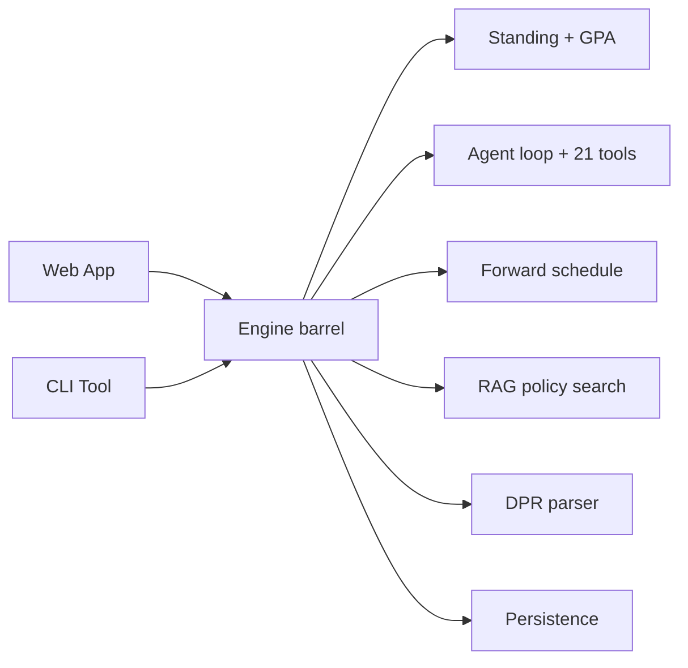

# `@nyupath/engine` Package Index

> Last verified against code: 2026-06-10 (post planning-engine rebuild, PRs #35-#41).

## Purpose

Everything the rest of the app needs from the engine flows through one front door. This document is the map of that door. `@nyupath/engine` is a TypeScript library (no website, no server, just code) that bundles the business logic: academic-standing/GPA calculators, the DPR parser, the agent loop and its 21 tools, the forward-schedule planner, the RAG policy-search stack, the LLM client adapters, and the persistence interfaces. The web app and CLI import only the names listed in this barrel, not the deep internals — so the engine can reorganize inside without breaking consumers, as long as the exported names keep working.



---

## 1. Overview

The package surface is defined by two barrel files:

- `packages/engine/src/index.ts` — the top-level package barrel. This is what `import { ... } from "@nyupath/engine"` resolves to.
- `packages/engine/src/agent/index.ts` — the agent-subsystem barrel. The package barrel re-exports a curated subset of it.

> **Known limitation — what the rebuild removed.** This package no longer exports a deterministic rule-engine audit or a per-program planner. The pre-rebuild barrel exported `degreeAudit`, `evaluateRule`, `validateCreditCaps`, `checkPassFailViolations`, `PrereqGraph`, `EquivalenceResolver`, `planNextSemester`, `scoreCourses`, `detectGraduationRisks`, the program/catalog-year/transfer/tier/department loaders, and `RecorderLLMClient`. **None of those are exported (or even present in `src/`) anymore.** The `audit/`, `graph/`, `equivalence/`, `planner/`, and most of `data/` modules were deleted. If a downstream import of one of those names fails to resolve, that is expected — the symbol is gone, not renamed. The replacements are the DPR pipeline (`dpr/`), the forward-schedule subsystem (`agent/forwardSchedule/`), and the RAG stack (`rag/`).

---

## 2. The real `src/` tree

All paths relative to `packages/engine/src/`.

```
index.ts                      ← top-level barrel
dataLoader.ts                 ← loadCourses/loadPrereqs/loadOfferings/loadOffCatalogCredits + schoolConfig re-export
courseId.ts                   ← canonicalizeCourseId(Set)

audit/
  academicStanding.ts         ← calculateStanding, computeSemesterGPA
  gpaCalculator.ts            ← computePoolGpa
data/
  schoolConfigLoader.ts       ← loadSchoolConfig / loadSchoolConfigStrict
  schoolDefaults.ts           ← shared registration defaults + school display names
  foseTerm.ts                 ← NYU class-search term codec
  courseSuffixMap.ts          ← course-accessibility classifier
provenance/
  schema.ts                   ← metaSchema, validateMeta, isStale
  configSchema.ts             ← Zod body validators for school configs
observability/
  fallbackLog.ts              ← FallbackSink, emitFallback, sinks
api/
  nyuClassSearch.ts           ← FOSE search client
dpr/
  index.ts parser.ts schema.ts fingerprint.ts dprToAuditResult.ts
  temporalContext.ts gradeComparison.ts prereqSatisfaction.ts
  visaValidator.ts spsDivision.ts
rag/
  index.ts chunker.ts corpus.ts embedder.ts vectorStore.ts reranker.ts
  policySearch.ts policyCorpusCache.ts sectionRetrieval.ts ragScopeFilter.ts retry.ts
cohort/
  gate.ts                     ← COHORT_CONFIGS, cohort assignment, runRecoveryMode
persistence/
  sessionStore.ts profileStore.ts scheduleStore.ts chatHistoryStore.ts
agent/
  index.ts agentLoop.ts loopState.ts tool.ts toolEnvelope.ts
  systemPrompt.ts responseValidator.ts clarifier.ts
  llmClient.ts recordingClient.ts registry.ts
  clients/        openaiClient.ts anthropicClient.ts index.ts
  verifiers/      multiIntentDetector.ts blockquoteAttribution.ts
  tools/          21 tool modules (see §4)
  forwardSchedule/    solver, search, validator, materialize, alternatives, ...
  sectionMaterialization/  materialize, conflictDetection, foseAvailabilityGate, ...
```

Note: there is **no** `agent/templateMatcher.ts` and **no** `agent/recorderClient.ts` — both removed.

---

## 3. Top-level barrel export categories

File ranges refer to `packages/engine/src/index.ts`.

| Category | Lines | Public exports |
|---|---|---|
| Academic standing + GPA | `:2` | `calculateStanding`, `computeSemesterGPA` |
| Data loaders | `:3` | `loadCourses`, `loadPrereqs`, `loadSchoolConfig` |
| Course-id canonicalization | `:4` | `canonicalizeCourseId`, `canonicalizeCourseIdSet` |
| School defaults (de-CAS) | `:6-12` | `DEFAULT_PER_SEMESTER_CEILING`, `DEFAULT_F1_FULLTIME_MIN_CREDITS`, `perSemesterCeilingFor`, `schoolDisplayName`, `SCHOOL_DISPLAY_NAMES` |
| NYU API client | `:14-23` | `searchCourses`, `getCourseDetails`, `fetchTermCourses`, `extractAvailableCourseIds`, `extractAllCourseIds`, `generateTermCode`, `getRecentTermOptions` |
| Provenance | `:25-32` | `metaSchema`, `validateMeta`, `isStale`, `STALENESS_DAYS`, `Meta` |
| Observability | `:34-46` | `InMemoryFallbackSink`, `JsonlFileSink`, `NULL_SINK`, `defaultProductionSink`, `emitFallback`, plus `FallbackEvent`/`FallbackEventKind`/`FallbackSink` types |
| Agent loop + clients + tools | `:48-114` | curated re-exports from `./agent/index.js` (see §4) |
| DPR | `:116-150` | `parseDpr`, `degreeProgressReportSchema`, `walkRequirements`, `notSatisfiedRequirements`, `findRequirementById`, `dprToAuditResults`, `dprToPrimaryAuditResult`, `deriveTemporalContext`, `normalizeGraduationTarget`, and the `DPR*` types |
| Embedders | `:153-157` | `LocalHashEmbedder`, `OpenAIEmbedder`, `cosineSim`, `Embedder` |
| RAG (vector store, reranker, search, section retrieval) | `:159-209` | `VectorStore`, `LocalLexicalReranker`, `CohereReranker`, `policySearch`, `CONFIDENCE_HIGH`/`CONFIDENCE_MEDIUM`/`COHERE_CONFIDENCE_BANDS`, `buildCorpus`, `loadPolicyCorpusFromCache`, `locateBestSource`/`reassembleSource`/`reassembleSection`, plus many types |
| Semantic course search | `:201-209` | `searchCoursesTool`, `createSemanticCourseSearchFn`, `CourseSearchFn`, `SemanticCourseSearchOptions`, `CourseCatalogEntry` |
| Cohort gate | `:211-225` | `COHORT_CONFIGS`, `setCohortAssignment`, `getCohortAssignment`, `userInCohort`, `getCohortConfig`, `runRecoveryMode`, plus `Cohort`/`CohortConfig`/`CohortAssignment`/`TemplateOnlyResult` |
| Persistence | `:227-258` | session store (`InMemorySessionStore`, `FileBackedSessionStore`, `defaultSessionStore`, `summariesAsPriorMessage`, `MAX_SESSION_SUMMARIES`), `InMemoryProfileStore`, `InMemoryScheduleStore` + `pruneCompletedPins`, `InMemoryChatHistoryStore`, plus `*Store` types |
| DPR fingerprint | `:259` | `computeDprFingerprint` |

The agent group (`index.ts:48-114`) re-exports: the loop (`runAgentTurn`, `runAgentTurnStreaming`), `buildDefaultRegistry`, `buildSystemPrompt`, the validators (`validateResponse`, `detectMultiIntent`, `renderMultiIntentBriefing`, `detectAmbiguity`, `askClarification`, `extractClaimNumbers`), `RecordingLLMClient`, the two live clients (`OpenAIEngineClient`, `AnthropicEngineClient`), the factories (`createPrimaryClient`, `createFallbackClient`) + `DEFAULT_PRIMARY_MODEL` / `DEFAULT_FALLBACK_MODEL`, `materializeSections`, and a curated subset of the tool constants (`runFullAuditTool`, `whatIfAuditTool`, `searchPolicyTool`, `getProgramRequirementsTool`, `updateProfileTool`, `confirmProfileUpdateTool`, `getCreditCapsTool`, `searchAvailabilityTool`, `planForwardDegreeTool`, `proposePlanChangeTool`, `confirmPlanChangeTool`) for routes that invoke a tool programmatically without the loop.

---

## 4. The agent barrel (`agent/index.ts`) and the 21 live tools

The agent barrel re-exports the loop, validators, clients, loop-state utilities, section-materialization types, and the tool registry. The registry (`registry.ts`) wires **exactly 21 live tools** into `ALL_NYUPATH_TOOLS`:

```
run_full_audit              what_if_audit              search_policy
get_program_requirements    update_profile             confirm_profile_update
get_credit_caps             search_availability        get_academic_standing
search_courses              plan_forward_degree        view_forward_plan
propose_plan_change         probe_counterfactual       confirm_plan_change
simulate_alternatives       compare_plan_alternatives  bind_free_elective
bind_pool_slot              materialize_sections       confirm_section_combination
```

> **Removed tools.** `check_overlap`, `check_transfer_eligibility`, and `plan_semester` are gone — their tool modules no longer exist in `agent/tools/`. Older docs and the agent-barrel comment that list `checkOverlapTool` / `checkTransferEligibilityTool` / `planSemesterTool` are stale.

Highlights of the agent-barrel re-exports (paths relative to `agent/`):

| Agent-barrel export | Source file |
|---|---|
| `buildTool`, `ToolRegistry`, types `Tool`, `ToolUseContext`, `ToolSession`, `ValidationResult` | `./tool.ts` |
| `ALL_NYUPATH_TOOLS`, `buildDefaultRegistry`, and the curated `*Tool` constants | `./registry.ts` |
| `createSemanticCourseSearchFn`, `CourseSearchFn`, `SemanticCourseSearchOptions`, `CourseCatalogEntry` | `./tools/semanticCourseSearch.ts`, `./tools/searchCourses.ts` |
| `LLMClient`, `LLMCompletion`, `LLMMessage`, `LLMToolCall`, `LLMToolDef`, `LLMStreamEvent` | `./llmClient.ts` |
| `runAgentTurn`, `runAgentTurnStreaming`, `AgentTurnOptions`, `ChatTurnResult`, `ToolInvocation`, `AgentStreamEvent` | `./agentLoop.ts` |
| `createLoopState`, `recordTransition`, `enforceToolResultBudget`, `measureContextPressure`, `estimateTokens`, the `MAX_TOOL_RESULT_BUDGET` / `TOOL_RESULT_KEEP_RECENT` / `DEFAULT_MODEL_WINDOW_TOKENS` / `TIER2_TRIP_FRACTION` / `TIER3_TRIP_FRACTION` constants, plus `LoopState`/`ContextPressure` types | `./loopState.ts` |
| `buildSystemPrompt`, `SystemPromptOptions` | `./systemPrompt.ts` |
| `validateResponse`, `extractClaimNumbers`, `Violation`/`ViolationKind`/`ValidatorVerdict`/`ValidatorContext` | `./responseValidator.ts` |
| `detectMultiIntent`, `renderMultiIntentBriefing` | `./verifiers/multiIntentDetector.ts` |
| `detectAmbiguity`, `askClarification` | `./clarifier.ts` |
| `RecordingLLMClient` | `./recordingClient.ts` |
| `AvailabilityState`, `MaterializationResult`, `MaterializedSemester`, `SchedulingPreferenceCheck` (note: `SectionView` deliberately NOT re-exported to avoid a name collision with `searchAvailability`'s same-named type — `agent/index.ts:128-141`) | `./sectionMaterialization/types.ts` |
| `materializeSections`, `MaterializeArgs` | `./sectionMaterialization/materialize.ts` |
| `OpenAIEngineClient`, `toOpenAIMessage`, `OpenAIClientOptions` | `./clients/openaiClient.ts` |
| `AnthropicEngineClient`, `toAnthropicMessage`, `AnthropicClientOptions` | `./clients/anthropicClient.ts` |
| `createPrimaryClient`, `createFallbackClient`, `DEFAULT_PRIMARY_PROVIDER`/`DEFAULT_PRIMARY_MODEL`/`DEFAULT_FALLBACK_PROVIDER`/`DEFAULT_FALLBACK_MODEL` | `./clients/index.ts` |

> Note the package barrel re-exports a **narrower** set of `*Tool` constants than the agent barrel defines. Tools like `viewForwardPlanTool`, `simulateAlternativesTool`, `comparePlanAlternativesTool`, `bindFreeElectiveTool`, `bindPoolSlotTool`, `materializeSectionsTool`, and `confirmSectionCombinationTool` are registered in `ALL_NYUPATH_TOOLS` (so they run inside the loop) but are not individually re-exported at the package top level — consumers that need them programmatically reach them through `buildDefaultRegistry()` rather than by name.

---

## 5. What consumers (apps/web, apps/cli) import most

- **The agent loop** — `runAgentTurn`, `runAgentTurnStreaming`, plus `AgentTurnOptions`, `ChatTurnResult`, `ToolInvocation`, `AgentStreamEvent`.
- **The tool registry** — `buildDefaultRegistry` (per-session registry, optionally injecting a custom `searchCoursesFn`).
- **LLM client setup** — `createPrimaryClient`, `createFallbackClient`, `DEFAULT_PRIMARY_MODEL`, `DEFAULT_FALLBACK_MODEL`, the concrete `OpenAIEngineClient` / `AnthropicEngineClient`, and `RecordingLLMClient` for test fixtures.
- **Validators / clarifier / multi-intent** — `validateResponse`, `detectMultiIntent`, `renderMultiIntentBriefing`, `detectAmbiguity`, `askClarification`.
- **System prompt** — `buildSystemPrompt`.
- **DPR pipeline** — `parseDpr`, `dprToAuditResults`, `dprToPrimaryAuditResult`, `deriveTemporalContext`, `normalizeGraduationTarget`, `computeDprFingerprint`. The Update-DPR route is the heaviest consumer.
- **Programmatic tool entry points** — `planForwardDegreeTool` (Update-DPR route), `proposePlanChangeTool` / `confirmPlanChangeTool` (sidebar Add/Swap/Drop/Lock/Move/Confirm verbs), `materializeSections` (`/api/plan/stage2`). These let routes run engine logic without the agent loop.
- **RAG stack** — `loadPolicyCorpusFromCache`, `LocalHashEmbedder`, `OpenAIEmbedder`, `VectorStore`, `LocalLexicalReranker`, `CohereReranker`, `policySearch`. Used by the v2 route to hydrate the policy corpus and inject a `CourseSearchFn`.
- **Persistence interfaces** — `defaultSessionStore`, `InMemoryProfileStore`, `InMemoryScheduleStore`, `InMemoryChatHistoryStore`, plus the `*Store` types. The web app swaps in the Postgres adapters under `apps/web/lib/db/` behind the same interfaces (see [persistence.md](./persistence.md)).
- **Section-materialization types** — `AvailabilityState`, `MaterializationResult`, `MaterializedSemester`, `SchedulingPreferenceCheck`, `MaterializeArgs` — used to type the `forward_materialization_update` SSE payload.
