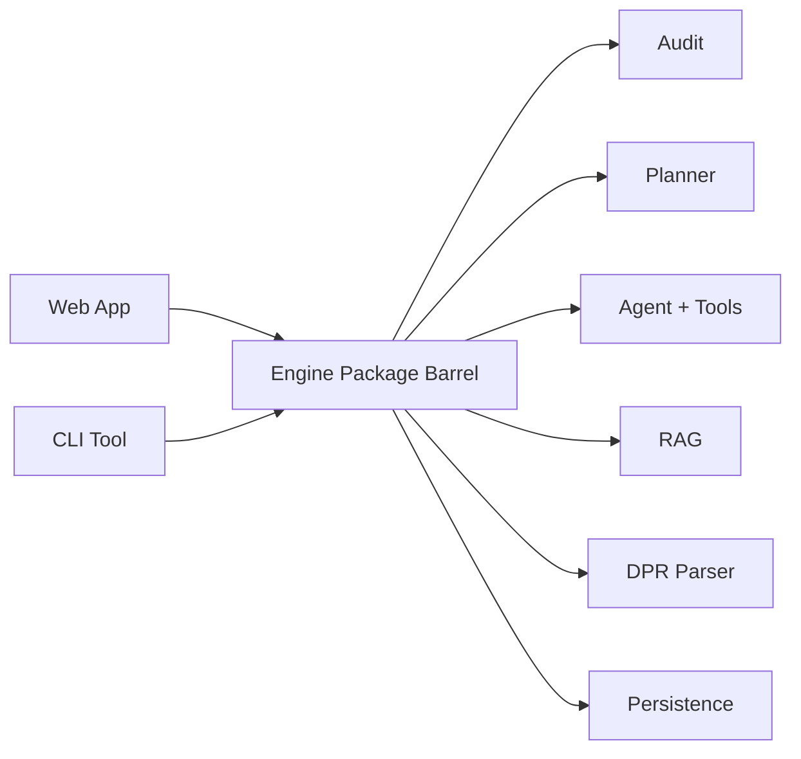

# `@nyupath/engine` Package Index

## TL;DR

Everything the rest of the app needs from the engine flows through one single front door. This document is the map of that door. The engine package is a TypeScript library (no website, no server, just code) that bundles every business-logic piece together: the degree audit, the planner, the agent that drives chat, the AI client adapters for OpenAI and Anthropic, the bulletin search, the transcript reader, the persistence interfaces, and so on. Other parts of the project (the website, the command-line tool) import only the names listed in this barrel, not the deep internals. That gives the engine room to reorganize its inside without breaking the rest of the app, as long as the exported names keep working the same way.

---

## 1. Overview

`@nyupath/engine` is the engine workspace package for NYU Path. It's a TypeScript library — no UI, no HTTP server — that bundles every piece of deterministic and agent-driven business logic the apps (`apps/web`, `apps/cli`) need: the degree-audit evaluator, the prerequisite graph, the planner, the agent loop and its tools, the LLM client adapters, the RAG/policy-search stack, the DPR parser, and the persistence interfaces.

The package surface is defined by two barrel files:

- `/Users/edoardomongardi/Desktop/Ideas/NYU Path/packages/engine/src/index.ts` — the top-level package barrel. This is what `import { ... } from "@nyupath/engine"` resolves to.
- `/Users/edoardomongardi/Desktop/Ideas/NYU Path/packages/engine/src/agent/index.ts` — the agent-subsystem barrel. The package barrel re-exports a curated subset of this one.

The two-tier barrel structure lets the agent subsystem maintain its own self-consistent public face while letting `index.ts` decide which agent symbols are part of the package's external contract.

---

## 2. Major export categories

The package barrel groups exports into the following logical areas (file ranges refer to `packages/engine/src/index.ts`):

| Category | Lines | What it covers |
|----------|-------|----------------|
| Degree audit | `:2-6` | `degreeAudit`, `evaluateRule`, `validateCreditCaps`, `checkPassFailViolations`, `calculateStanding`, `computeSemesterGPA` |
| Prereq graph + equivalences | `:7-8` | `PrereqGraph`, `EquivalenceResolver` |
| Data loaders | `:9-11` | `loadCourses`, `loadPrereqs`, `loadPrograms`, `loadProgram`, `loadSchoolConfig`, `resolveExamCredit`, `EXAM_GENERAL_RULES` |
| Planner | `:12-15` | `planNextSemester`, `scoreCourses`, `detectGraduationRisks` |
| NYU API client | `:17-26` | `searchCourses`, `getCourseDetails`, `fetchTermCourses`, `extractAvailableCourseIds`, `extractAllCourseIds`, `generateTermCode`, `getRecentTermOptions` |
| Provenance / catalog year | `:28-42` | `metaSchema`, `validateMeta`, `isStale`, `STALENESS_DAYS`, `resolveProgramFile`, `applicableCatalogYear` |
| Departments stub | `:44-48` | `loadDepartmentConfig` |
| Tool registry primitives | `:50-60` | `buildTool`, `getTool`, `listTools`, `registerTool` plus types `Tool`, `ToolContext`, `ToolDef`, `ValidationResult` (the legacy back-compat surface — see section 3) |
| Observability | `:62-74` | `InMemoryFallbackSink`, `JsonlFileSink`, `NULL_SINK`, `defaultProductionSink`, `emitFallback`, plus `FallbackEvent`, `FallbackEventKind`, `FallbackSink` types |
| Agent loop + clients + tools | `:76-147` | Curated re-exports from `./agent/index.js` (see section 5) |
| DPR | `:150-183` | `parseDpr`, `degreeProgressReportSchema`, `walkRequirements`, `notSatisfiedRequirements`, `findRequirementById`, `dprToAuditResults`, `dprToPrimaryAuditResult`, `deriveTemporalContext`, `normalizeGraduationTarget`, and a wide set of `DPR*` types |
| RAG (policy search) | `:186-227` | `loadPolicyTemplates`, embedders (`LocalHashEmbedder`, `OpenAIEmbedder`, `cosineSim`), `VectorStore`, rerankers (`LocalLexicalReranker`, `CohereReranker`), `policySearch`, confidence bands, `buildCorpus`, `loadPolicyCorpusFromCache`, plus types |
| Semantic course search | `:228-236` | `searchCoursesTool`, `createSemanticCourseSearchFn`, plus `CourseSearchFn`, `SemanticCourseSearchOptions`, `CourseCatalogEntry` types |
| Cohort gate | `:238-252` | `COHORT_CONFIGS`, `setCohortAssignment`, `getCohortAssignment`, `userInCohort`, `getCohortConfig`, `runTemplateMatcherOnly` |
| Persistence | `:255-285` | Session store (`InMemorySessionStore`, `FileBackedSessionStore`, `defaultSessionStore`, `summariesAsPriorMessage`, `MAX_SESSION_SUMMARIES`), profile store, schedule store + `pruneCompletedPins`, chat history store |
| DPR fingerprint | `:286` | `computeDprFingerprint` |

---

## 3. Why the public surface is stable

The tool registry surface (`buildTool`, `getTool`, `listTools`, `registerTool`, `Tool`, `ToolContext`, `ToolDef`, `ValidationResult`) is exported from `./tools/index.js` (`index.ts:50-60`). The package-barrel comment at `index.ts:50` flags this as a "legacy Phase 0 surface, still consumed downstream".

This means: consumers of `@nyupath/engine` (most importantly `apps/web` and `apps/cli`) wrote their imports against the original tool-registry shape from Phase 0. The engine has since grown a richer agent-subsystem barrel (`agent/index.ts`) with its own `Tool`, `ToolUseContext`, `ToolSession`, `ValidationResult` types coming from `agent/tool.ts`. To avoid breaking those downstream consumers, the package barrel keeps re-exporting from the original `tools/` location alongside the newer agent surface.

The result is a stable, additive public surface: anything that worked against the Phase-0 tool-registry types still resolves; new agent-loop callers get the richer agent barrel.

---

## 4. Map of public re-exports to source modules

The table below maps each public export grouping to its source file. All paths are relative to `packages/engine/src/`.

| Public export(s) | Source module | Re-exported via |
|------------------|---------------|-----------------|
| `degreeAudit`, `evaluateRule`, `validateCreditCaps`, `checkPassFailViolations`, `calculateStanding`, `computeSemesterGPA` | `./audit/*.js` | `index.ts:2-6` |
| `PrereqGraph` | `./graph/prereqGraph.js` | `index.ts:7` |
| `EquivalenceResolver` | `./equivalence/equivalenceResolver.js` | `index.ts:8` |
| `loadCourses`, `loadPrereqs`, `loadPrograms`, `loadProgram`, `loadSchoolConfig` | `./dataLoader.js` | `index.ts:9` |
| `resolveExamCredit`, `EXAM_GENERAL_RULES` | `./data/examEquivalencies.js` | `index.ts:10` |
| `planNextSemester`, `scoreCourses`, `detectGraduationRisks` | `./planner/*.js` | `index.ts:13-15` |
| `searchCourses`, `getCourseDetails`, `fetchTermCourses`, `extractAvailableCourseIds`, `extractAllCourseIds`, `generateTermCode`, `getRecentTermOptions` | `./api/nyuClassSearch.js` | `index.ts:18-26` |
| `metaSchema`, `validateMeta`, `isStale`, `STALENESS_DAYS`, `Meta` | `./provenance/schema.js` | `index.ts:30-35` |
| `resolveProgramFile`, `applicableCatalogYear`, `ResolveResult` | `./data/catalogYearLoader.js` | `index.ts:39-42` |
| `loadDepartmentConfig`, `DepartmentConfig` | `./data/departmentLoader.js` | `index.ts:46-48` |
| `buildTool`, `getTool`, `listTools`, `registerTool`, `Tool`, `ToolContext`, `ToolDef`, `ValidationResult` | `./tools/index.js` | `index.ts:52-60` |
| `InMemoryFallbackSink`, `JsonlFileSink`, `NULL_SINK`, `defaultProductionSink`, `emitFallback`, plus types | `./observability/fallbackLog.js` | `index.ts:63-74` |
| `runAgentTurn`, `runAgentTurnStreaming`, `buildDefaultRegistry`, `buildSystemPrompt`, `preLoopDispatch`, `validateResponse`, `reviewCompleteness`, `detectMultiIntent`, `renderMultiIntentBriefing`, `detectAmbiguity`, `askClarification`, `extractClaimNumbers`, `RecordingLLMClient`, `RecorderLLMClient`, `OpenAIEngineClient`, `AnthropicEngineClient`, `createPrimaryClient`, `createFallbackClient`, `DEFAULT_PRIMARY_MODEL`, `DEFAULT_FALLBACK_MODEL`, every `*Tool`, `materializeSections` | `./agent/index.js` (which itself re-exports from `./agent/agentLoop.js`, `./agent/registry.js`, `./agent/systemPrompt.js`, `./agent/templateMatcher.js`, `./agent/responseValidator.js`, `./agent/completenessReviewer.js`, `./agent/verifiers/multiIntentDetector.js`, `./agent/clarifier.js`, `./agent/recordingClient.js`, `./agent/recorderClient.js`, `./agent/clients/openaiClient.js`, `./agent/clients/anthropicClient.js`, `./agent/clients/index.js`, `./agent/sectionMaterialization/materialize.js`) | `index.ts:77-147` |
| `AgentTurnOptions`, `AgentStreamEvent`, `ChatTurnResult`, `ToolInvocation`, `ToolSession`, `LLMClient`, `LLMCompletion`, `LLMMessage`, `LLMStreamEvent`, `LLMToolCall`, `LLMToolDef`, `Violation`, `ViolationKind`, `ValidatorVerdict`, `ValidatorContext`, `CompletenessReviewVerdict`, `PreLoopResult`, `PreLoopOptions`, `SystemPromptOptions`, `AvailabilityState`, `MaterializationResult`, `MaterializedSemester`, `SchedulingPreferenceCheck`, `MaterializeArgs` | `./agent/index.js` (re-exporting from `agent/tool.js`, `agent/agentLoop.js`, `agent/llmClient.js`, `agent/responseValidator.js`, `agent/completenessReviewer.js`, `agent/templateMatcher.js`, `agent/systemPrompt.js`, `agent/sectionMaterialization/types.js`, `agent/sectionMaterialization/materialize.js`) | `index.ts:115-144` |
| `parseDpr`, `degreeProgressReportSchema`, `walkRequirements`, `notSatisfiedRequirements`, `findRequirementById`, `dprToAuditResults`, `dprToPrimaryAuditResult`, `deriveTemporalContext`, `normalizeGraduationTarget`, plus all DPR types | `./dpr/index.js` | `index.ts:154-183` |
| `loadPolicyTemplates`, `PolicyTemplate` | `./rag/index.js`, `./rag/policyTemplate.js` | `index.ts:187-188` |
| `LocalHashEmbedder`, `OpenAIEmbedder`, `cosineSim`, `Embedder` | `./rag/embedder.js` | `index.ts:193-194` |
| `VectorStore`, `VectorSearchHit`, `IndexedChunk` | `./rag/vectorStore.js` | `index.ts:199-200` |
| `LocalLexicalReranker`, `CohereReranker`, `Reranker`, `RerankedHit`, `CohereRerankerOptions` | `./rag/reranker.js` | `index.ts:201-202` |
| `policySearch`, `CONFIDENCE_HIGH`, `CONFIDENCE_MEDIUM`, `COHERE_CONFIDENCE_BANDS`, `matchTemplate`, `buildCorpus`, `DEFAULT_ENTRIES`, `loadPolicyCorpusFromCache`, plus types | `./rag/index.js` | `index.ts:204-227` |
| `searchCoursesTool`, `createSemanticCourseSearchFn`, `CourseSearchFn`, `SemanticCourseSearchOptions`, `CourseCatalogEntry` | `./agent/index.js` (which re-exports from `./agent/tools/semanticCourseSearch.js` and `./agent/tools/searchCourses.js`) | `index.ts:229-236` |
| `COHORT_CONFIGS`, `setCohortAssignment`, `getCohortAssignment`, `userInCohort`, `getCohortConfig`, `runTemplateMatcherOnly`, plus types | `./cohort/gate.js` | `index.ts:239-252` |
| `InMemorySessionStore`, `FileBackedSessionStore`, `defaultSessionStore`, `summariesAsPriorMessage`, `MAX_SESSION_SUMMARIES`, `SessionStore`, `SessionSummary`, `StudentSessionRecord` | `./persistence/sessionStore.js` | `index.ts:256-266` |
| `InMemoryProfileStore`, `ProfileStore`, `ProfileMutationAuditEntry` | `./persistence/profileStore.js` | `index.ts:269-273` |
| `InMemoryScheduleStore`, `pruneCompletedPins`, `ScheduleStore` | `./persistence/scheduleStore.js` | `index.ts:277-280` |
| `InMemoryChatHistoryStore`, `ChatHistoryStore`, `ChatMessageRecord` | `./persistence/chatHistoryStore.js` | `index.ts:281-285` |
| `computeDprFingerprint` | `./dpr/fingerprint.js` | `index.ts:286` |

### The agent barrel (`./agent/index.ts`)

The agent barrel is itself a curated facade. Highlights of what it re-exports and from where (all paths relative to `packages/engine/src/agent/`):

| Agent-barrel export | Source file |
|---------------------|-------------|
| `buildTool`, `ToolRegistry`, types `Tool`, `ToolUseContext`, `ToolSession`, `ValidationResult` | `./tool.ts` |
| `ALL_NYUPATH_TOOLS`, `buildDefaultRegistry`, every `*Tool` (`runFullAuditTool`, `checkTransferEligibilityTool`, `whatIfAuditTool`, `searchPolicyTool`, `getProgramRequirementsTool`, `updateProfileTool`, `confirmProfileUpdateTool`, `getCreditCapsTool`, `searchAvailabilityTool`, `getAcademicStandingTool`, `checkOverlapTool`, `searchCoursesTool`, `planForwardDegreeTool`, `proposePlanChangeTool`, `confirmPlanChangeTool`) — `planSemesterTool` was **removed** in Phase F | `./registry.ts` |
| `createSemanticCourseSearchFn`, types `SemanticCourseSearchOptions`, `CourseCatalogEntry` | `./tools/semanticCourseSearch.ts` |
| `CourseSearchFn` type | `./tools/searchCourses.ts` |
| `LLMClient`, `LLMCompletion`, `LLMMessage`, `LLMToolCall`, `LLMToolDef`, `LLMStreamEvent` | `./llmClient.ts` |
| `runAgentTurn`, `runAgentTurnStreaming`, types `AgentTurnOptions`, `ChatTurnResult`, `ToolInvocation`, `AgentStreamEvent` | `./agentLoop.ts` |
| `createLoopState`, `recordTransition`, `enforceToolResultBudget`, `measureContextPressure`, `estimateTokens`, constants `MAX_TOOL_RESULT_BUDGET`, `TOOL_RESULT_KEEP_RECENT`, `DEFAULT_MODEL_WINDOW_TOKENS`, `TIER2_TRIP_FRACTION`, `TIER3_TRIP_FRACTION`, types `LoopState`, `LoopStateOptions`, `TransitionReason`, `TransitionRecord`, `ContextPressure` | `./loopState.ts` |
| `buildSystemPrompt`, type `SystemPromptOptions` | `./systemPrompt.ts` |
| `preLoopDispatch`, types `PreLoopResult`, `PreLoopOptions` | `./templateMatcher.ts` |
| `validateResponse`, `extractClaimNumbers`, types `Violation`, `ViolationKind`, `ValidatorVerdict`, `ValidatorContext` | `./responseValidator.ts` |
| `reviewCompleteness`, type `CompletenessReviewVerdict` | `./completenessReviewer.ts` |
| `detectMultiIntent`, `renderMultiIntentBriefing`, types `MultiIntentReport`, `MultiIntentSignal` | `./verifiers/multiIntentDetector.ts` |
| `detectAmbiguity`, `askClarification`, types `AmbiguityReport`, `AmbiguitySignal`, `ClarificationResult` | `./clarifier.ts` |
| `RecordingLLMClient` | `./recordingClient.ts` |
| `RecorderLLMClient`, types `RecorderOptions`, `RecorderMatchStrategy` | `./recorderClient.ts` |
| Section-materialization types `AvailabilityState`, `MaterializationResult`, `MaterializedSemester`, `SchedulingPreferenceCheck` | `./sectionMaterialization/types.ts` (`SectionView` is intentionally NOT re-exported here to avoid colliding with `tools/searchAvailability.ts`'s same-named type — `agent/index.ts:138-148`) |
| `materializeSections`, type `MaterializeArgs` | `./sectionMaterialization/materialize.ts` |
| `OpenAIEngineClient`, `toOpenAIMessage`, type `OpenAIClientOptions` | `./clients/openaiClient.ts` |
| `AnthropicEngineClient`, `toAnthropicMessage`, type `AnthropicClientOptions` | `./clients/anthropicClient.ts` |
| `createPrimaryClient`, `createFallbackClient`, constants `DEFAULT_PRIMARY_PROVIDER`, `DEFAULT_PRIMARY_MODEL`, `DEFAULT_FALLBACK_PROVIDER`, `DEFAULT_FALLBACK_MODEL` | `./clients/index.ts` |

---

## 5. What consumers (apps/web, apps/cli) import most

Reading the package barrel `index.ts` end-to-end, the curated agent re-exports (`index.ts:77-147`) form the bulk of the surface meant for application-layer consumers. The big-ticket items:

- **The agent loop** — `runAgentTurn`, `runAgentTurnStreaming`, plus `AgentTurnOptions`, `ChatTurnResult`, `ToolInvocation`, `AgentStreamEvent` — for the chat experience.
- **The tool registry** — `buildDefaultRegistry` and every `*Tool` constant. Consumers spin up a registry per session, optionally injecting custom search functions.
- **LLM client setup** — `createPrimaryClient`, `createFallbackClient`, `DEFAULT_PRIMARY_MODEL`, `DEFAULT_FALLBACK_MODEL`, plus the concrete `OpenAIEngineClient` and `AnthropicEngineClient` adapters. Recording variants (`RecordingLLMClient`, `RecorderLLMClient`) for fixtures and replay.
- **Validators / clarifier / multi-intent** — `validateResponse`, `reviewCompleteness`, `detectMultiIntent`, `renderMultiIntentBriefing`, `detectAmbiguity`, `askClarification`, `preLoopDispatch`. The agent-loop pipeline depends on these; consumers also call them directly when wiring orchestration outside the loop.
- **System prompt builder** — `buildSystemPrompt` for any consumer that needs to assemble a prompt outside `runAgentTurn`.
- **DPR pipeline** — `parseDpr`, `dprToAuditResults`, `dprToPrimaryAuditResult`, `deriveTemporalContext`, `normalizeGraduationTarget`, `computeDprFingerprint`. The Update-DPR route in `apps/web` is the heaviest consumer.
- **Planner + audit** — `degreeAudit`, `planNextSemester`, `scoreCourses`, `detectGraduationRisks`, `validateCreditCaps`, `checkPassFailViolations`, `calculateStanding`. Used by both the agent's tools and by route handlers that need to render deterministic results without an LLM in the loop.
- **Programmatic tool entry points** — `planForwardDegreeTool` (Update-DPR route, `index.ts:108`), `proposePlanChangeTool` and `confirmPlanChangeTool` (Phase-17 sidebar verbs Add/Swap/Drop/Lock/Move/Confirm, `index.ts:111-113`), `materializeSections` (`/api/plan/stage2` route, `index.ts:147`). These three groups are the main pathway for routes that need engine logic without spinning up the agent loop.
- **RAG stack** — `loadPolicyTemplates`, `LocalHashEmbedder`, `OpenAIEmbedder`, `VectorStore`, `LocalLexicalReranker`, `CohereReranker`, `policySearch`, `loadPolicyCorpusFromCache`. Used by the v2 web route to hydrate the policy corpus and inject a `CourseSearchFn` into agent sessions.
- **Persistence interfaces** — `defaultSessionStore`, `InMemoryProfileStore`, `InMemoryScheduleStore`, `InMemoryChatHistoryStore`, plus the `*Store` types. In-memory implementations are used as defaults; consumers swap in file-backed or DB-backed implementations.
- **Section-materialization types** — `AvailabilityState`, `MaterializationResult`, `MaterializedSemester`, `SchedulingPreferenceCheck`, `MaterializeArgs`. Used by the apps/web sidebar to type the `forward_materialization_update` SSE payload (`index.ts:135-144`) and by `/api/plan/stage2` to call the orchestrator directly.
