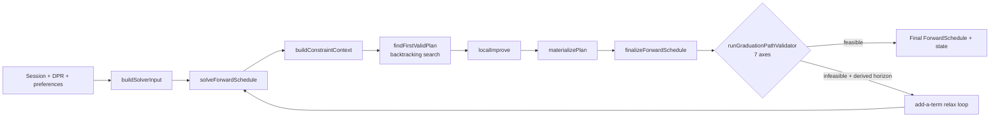
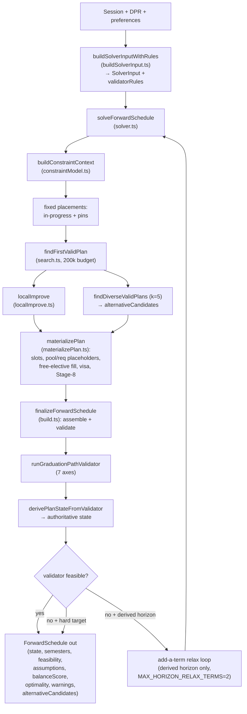

# Forward-Schedule Subsystem — Technical Audit

> Last verified against code: 2026-06-10 (post planning-engine rebuild, PRs #35-#41).

## Purpose

This is the brain that lays out an entire degree plan from now until graduation, term by term. Think of it like a constraint solver for course planning: it takes every requirement the student still needs, plus prerequisites, credit limits, F-1 visa rules, and the student's own preferences, and assigns each requirement a specific future term and a specific course such that the *whole* plan works end-to-end. Unlike the old greedy version, it does this with a real backtracking **feasibility-first search**: it explores placements, undoes ones that hit a dead end, and returns the first plan that passes every hard constraint — then nudges it toward the student's preferred balance with a small local-improvement step. After a plan is built, a separate 7-axis **graduation-path validator** is the authoritative gate that decides whether the student really would graduate on time; that verdict (not the solver's own coarse guess) sets the plan's state. The subsystem also produces diverse alternative plans, a "what if you fail your in-progress class" fallback path, reconciliation when a fresh degree report arrives, and a cited advisory for students juggling multiple majors/minors.



---

This document describes the modules under `packages/engine/src/agent/forwardSchedule/` (23 files, ~8.4k lines). It is separate from the user-facing tool docs (see [tool-registry.md](./tool-registry.md)) — this audit covers the algorithmic core and how its modules cooperate.

> Source-of-truth note: every claim below is derived from the source files. The module header comments are mostly accurate post-rebuild but a few are stale; where a comment and the code disagreed, the code won.

---

## 1. Overview

### What the subsystem does

The forward-schedule subsystem builds a forward-looking, multi-term degree plan that:

- Starts from a student's `DegreeProgressReport` (DPR), the courses they have taken, and the courses currently in progress.
- Walks remaining requirement groups and assigns each a concrete course (or a pool placeholder) across the remaining academic terms via a sound backtracking search.
- Respects prerequisite ordering, per-term credit ceilings, F-1 visa floors, residency minima, the degree credit minimum, the graduation target term, and per-student preferences (pins, exclusions, load styles, summer/J-term opt-in).
- Produces a `ForwardSchedule` containing semesters, slots, a feasibility report, an authoritative `state`, assumptions, a balance score, a structured `optimality` signal, optional `warnings`, and (when a plan is found) diverse `alternativeCandidates`.

### How the pipeline fits together

`build.ts`'s `buildForwardSchedule` is the entry point. It composes a `SolverInput` (via the shared builder in `buildSolverInput.ts`), calls `solveForwardSchedule` (`solver.ts`), and then routes the result through the shared `finalizeForwardSchedule` step — which assembles the `ForwardSchedule`, runs the 7-axis `runGraduationPathValidator`, and overrides the solver's coarse state with the validator's verdict. The same `finalizeForwardSchedule` seam is reused by the edit tools (propose / confirm) and the alternatives path, so **every** plan-producing path runs through the one authoritative gate.

Internally, `solveForwardSchedule` is a thin orchestrator over four pure, individually-tested modules:

1. `buildConstraintContext` (`constraintModel.ts`) — precompute the immutable problem context (future-term window, prereq depths, dependents index).
2. `findFirstValidPlan` (`search.ts`) — feasibility-first backtracking search; returns the first valid leaf and stops.
3. `localImprove` (`localImprove.ts`) — bounded steepest descent to lower the soft objective without breaking validity.
4. `materializePlan` (`materializePlan.ts`) — turn the search's `PartialPlan` into a full `SolverOutput` (rich slots, placeholders, free-elective fill, visa invariants, Stage-8 checks, balance score, feasibility, coarse state).

Diverse alternatives come from `findDiverseValidPlans` (k=5), each materialized and summarized against the winner.

---

## 2. Types

The data shapes are in `types.ts`. The two that matter to callers:

### 2.1 SolverInput (`types.ts`)

A frozen, immutable bundle passed into the solver. It carries student state (`coursesTaken`, `coursesInProgress` with per-row terms, `currentTerm`, `graduationTerm`, a `graduationTermWasDerived` flag), per-term targets/floors/ceilings (`creditTargetPerSemester`, `f1Floor`, `domesticPartTimeFloor`, `creditCeiling`, `graduationCreditMinimum`, `creditsEarned`), header-level caps (pass/fail, online, outside-home, GPAs and GPA floors), the walked `unmetRequirements` (each with `rId`, `title`, `category`, `credits`, `candidateCourses`, and an optional `pool` descriptor), catalog data (`prereqs`, `offerings`, `offeringConfidence`, `courseCatalog`, `offCatalogCredits`, `dprCourseHistoryHash`, the full `dpr`), `programRules`, optional bulletin metadata, optional `preferences` (`SchedulePreferences`), an optional `coreqs` map, and a `warnings` array for build-time advisories.

> **`offerings` / `offeringConfidence` source (with gap-fill).** Both maps are populated first from the global `courses-offerings.json` cache (`loadOfferings`), which is **authoritative**. They are then **gap-filled from `session.courses[i].termsOffered`** for any course id the global cache lacks (e.g. a session-injected / synthetic non-CAS catalog): such ids get an offering row from their static `termsOffered` and a `"historically_likely"` confidence tier (a structural "offered in these seasons" signal, not a live-FOSE confirmation). The global cache always wins for ids it already has; `session.courses` fills only the gaps; a course with empty/absent `termsOffered` is skipped (no known offering → stays a placeholder). `courseCatalog` (title/credits) is built separately from `session.courses`.

### 2.2 SolverOutput (`types.ts`)

`{ semesters, feasibility, balanceScore, assumptions, state, alternativeCandidates?, warnings?, optimality? }`. `state` is the solver's *coarse* `PlanState` — it is OVERRIDDEN by the validator in `finalizeForwardSchedule`. `optimality` is a structured signal (see §4.4).

### 2.3 ForwardSchedule, ForwardSemester, ScheduleSlot

`ForwardSchedule` is the durable, persisted shape produced by `build.ts` and validated by `graduationPathValidator.ts`. Each `ForwardSemester` carries `term`, `plannedCredits`, `notes[]`, `loadRationale` (`hardCount`, `easyCount`, `weightedCredits`, `slack`, …), and a list of `ScheduleSlot`s. A `ScheduleSlot` is a discriminated union by `kind`: `specific_planned` (concrete course, the only kind axis-1 treats as a bound satisfier), `placeholder` (unbound — pool slots carry `poolBinding`, free electives do not), `completed`, and `in_progress`.

### 2.4 PlanState (4-state)

`derivePlanStateFromValidator` (`graduationPathValidator.ts`) emits one of:

- **`valid-clean`** — every axis passes and the plan has no IP assumptions, petition slots, low-confidence offerings, or placeholders.
- **`valid-with-trade-offs`** — no axis fails, but at least one returned `assumed-pass`/`requires-approval`, OR the plan has IP assumptions, petition slots, low-confidence (`irregular`/`permission_only`) slots, or any placeholder.
- **`infeasible-draft`** — at least one axis returned `fail`.
- **`student-preferred-invalid-draft`** — set UPSTREAM when a student persists a knowingly invalid plan; the validator never emits it.

> The `SchedulePreferences` and `PlanMutation` shapes (pins, exclusions, load styles, summer/J-term opt-in, the 14 mutation kinds) live in `@nyupath/shared` and are consumed by `planChangeHelpers.ts`. They are documented with the plan-change tools rather than here. `SchedulePreferences` also carries the optional `softObjectives?: GenericSoftConstraint[]` array (D6.2), read only by the ranker (§3.4) — it does NOT widen the frozen solver-read surface.

---

## 3. The constraint model (`constraintModel.ts`, 805 ln)

This module defines the CSP variable model, the hard-constraint predicates, and the soft objective. It is the contract the search and the validator agree on: a complete plan passing every hard predicate here is intended to also pass `runGraduationPathValidator` (each predicate documents — via its `axis` — which validator axis it mirrors).

### 3.1 ConstraintContext

`buildConstraintContext(input)` precomputes the immutable `{ input, futureTerms, prereqDepths, dependentsIndex }`. `futureTerms` is the chronological window from `enumerateTerms(currentTerm, graduationTerm, …)`; optional terms (summer / january) appear ONLY when the student opted in via preferences — fall/spring are always present.

### 3.2 Requirement variables and pools (Option B)

`buildRequirementVariables` turns each unmet requirement into a CSP variable of `kind` `"specific"` or `"pool"`:

- **specific** — satisfied by one of an enumerated candidate list (catalog-present, not excluded, not study-abroad). Search values are per-`(candidate × offering-legal term)`.
- **pool** — a "choose-N from a pool" requirement carrying a `pool` descriptor (e.g. `CSCI-UA 400–499`). `poolMembersFor` expands it to its REAL catalog members (dept + level range, union explicit catalog-present candidates, minus study-abroad/excluded). The search then places ONE synthetic `POOL-<rId>` placeholder — NOT N branches — legal in a term iff `poolTermLegal`: at least one real member is offered there AND its prereqs are satisfiable by that term from taken/IP context alone.

A pool whose members are **chain-linked** (some member is a prereq-provider of another required course) is instead ENUMERATED as a `"specific"` variable so the member can be placed concretely; pools are only collapsed to one heavy placeholder when terminal.

### 3.3 The 12 hard predicates

`HARD_CONSTRAINTS` holds 12 predicates split by phase:

- **Incremental (5)** — `offeringSeasonMatch`, `prereqsSatisfied`, `notClauseClear`, `coreqsSameTerm`, `perTermCeiling`. (4 of these — all but `prereqsSatisfied` — are the sound incremental prune used by the search; see §4.1.)
- **Completion (7)** — `perTermFloor` (visa floors, optional terms exempt), `requirementCoverage` (axis 1; only `source ∈ {requirement, pin}` count — NOT `ip`, NOT free), `creditMinimum` (axis 3), `graduationTarget` (axis 7), `residencyFloor` and `majorCreditFloor` (axis 4; residency counts requirement/pin/ip, major counts requirement/pin only), `gpaFloors` (placement-independent).

`checkHardConstraints(plan, ctx, phase?)` runs them all (or one phase).

### 3.4 Soft objective — `scorePlan` (LOWER is better)

`scorePlan = weights.balance × balanceCost + weights.timeToDegree × timeToDegreeIndex + weights.softObjective × softObjectiveCost`, with `DEFAULT_OBJECTIVE_WEIGHTS = { balance: 1, timeToDegree: 0.5, softObjective: 0.25 }`.

- `balanceCost` = `computeBalanceScore` over per-term aggregates, using the student's `preferences.loadStyle` (default `"balanced"`). Only NON-optional (fall/spring) terms contribute, so opting into summer never inflates variance.
- `timeToDegreeIndex` = the 0-based index in `futureTerms` (optional included) of the first term where running credits reach the degree minimum; earlier completion ⇒ lower cost.
- `softObjectiveCost` (D6.2 — rung-2 generic SOFT-objective primitive) = `computeSoftObjectiveCost(plan, preferences.softObjectives ?? [])`. This reads ONLY `plan.placed[]` (course ids/terms) and the `preferences.softObjectives` array — **never any solver/validity surface** — so it is a pure RANKING signal: it can change which already-VALID plan ranks first, but can never make a valid plan invalid (or vice versa). The `softObjective` weight is `0.25` — deliberately *below* `balance`/`timeToDegree` so a recorded soft preference biases ranking among already-balanced valid plans rather than overriding the core objectives. The term is **default-off**: `computeSoftObjectiveCost(plan, [])` returns `0`, so when no `softObjectives` are recorded every plan's score is byte-identical to the pre-D6.2 formula (every existing scorePlan/solver/search/ranking test is unchanged). Each objective is a `GenericSoftConstraint` (`{ id, framing: "soft", dimension, preference, weight? }`, weight default `1`) carried on `SchedulePreferences.softObjectives[]`. Dispatch is on `dimension`; the one implemented dimension is `"departmentDiversity"` (preference `"diverse"` ⇒ cost = placedCount − distinctDeptCount, fully diverse ⇒ 0; preference `"concentrated"` ⇒ cost = distinctDeptCount − 1, single dept ⇒ 0). A dimension the ranker cannot evaluate from the plan returns `0` cost — **recorded-not-enforced** (D6.5 surfaces this honestly).

**Precedence (the invariant):** the soft objective is read by the RANKER (`scorePlan`) only. The **hard solver contract — `buildRequirementVariables`, the 12 hard predicates, feasibility/validity — is byte-identical with vs without `softObjectives`** (none of them read the array). `softObjectives` enters the model exclusively through `scorePlan`, so it can re-rank valid plans but adds no solver-read capability.

The objective is **non-monotonic** in placements (balance variance can drop as courses are added, e.g. `[16,0]` scores worse than `[8,8]`), which is why the search cannot prune on score (§4.1).

---

## 4. The search (`search.ts`, 873 ln)

A deterministic backtracking + forward-checking traversal over the requirement variables, replacing the deleted greedy core.

### 4.1 Soundness and pruning

The search prunes a branch ONLY on the **sound 4-predicate incremental forward-check**: `{offeringSeasonMatch, notClauseClear, coreqsSameTerm, perTermCeiling}`. Each is later-variable-independent — once violated on a partial plan it stays violated under any further placement — so pruning never discards a branch that would become valid later. `checkPrereqsSatisfied` is **deliberately excluded** from the incremental prune (a prereq may be a yet-unplaced later variable); prereqs, requirement coverage, the major-credit floor, and the residency floor are checked only at the **complete leaf**, where every course is placed. There is **no score-based prune** (the objective is non-monotonic) and **no forward-feasibility/capacity screen** (the only available screen is a false-negative-prone heuristic — unsound as a hard prune).

### 4.2 Variable and value ordering

Variables are ordered by prereq-depth ASC → MRV (fewer candidates) → workload-weight DESC → rId. This is a PERFORMANCE heuristic only; correctness does not depend on it. Values within a variable are ordered best-first by `scorePlan`, with a `softCreditTarget` reorder (placements keeping a term's running credits ≤ `creditTargetPerSemester` — the 16-credit grid — are preferred, falling back to heavier loads up to the ceiling).

### 4.3 Entry points

- **`findFirstValidPlan`** (the PRIMARY path used by the solver) — returns the FIRST valid leaf and stops; node budget `DEFAULT_MAX_NODES = 200_000`. On a null result, `exhaustive: true` means proven-infeasible (budget not hit) and `exhaustive: false` means truncated-without-finding. On a found plan, `exhaustive` is true but does NOT mean "optimum proven" — feasibility-first never proves optimality. It also returns per-requirement `blockers` (offering-absent / prereq-depth / dominant incremental failure) for infeasibility reporting.
- **`findDiverseValidPlans(k)`** — up to k pairwise-distinct valid plans, found cheaply by forbid-signature restart (run, record the requirement signature, re-run forbidding it, repeat). Each iteration is node-capped at `DIVERSE_MAX_NODES = 20_000` (the terminal "no more plans" iteration must search to prove null). `plans[0]` equals the winner.
- **`searchBestPlan` / `searchTopKPlans`** — exhaustive-mode entries that visit every leaf to prove the optimum. **They are TEST-ONLY** — no production caller uses them (see §10).

### 4.4 Optimality and truncation signals (from `solver.ts`)

`deriveOptimality` maps the result to a structured `optimality`: `"best-effort"` when a plan was found, `"feasibility-unconfirmed"` when none was found, and `"optimal"` ONLY on the trivially-empty horizon (graduation == current term, where the empty plan is the only possible plan). `truncationWarning` appends an honest advisory string to `SolverOutput.warnings` when the search truncated.

When the search returns NO plan AND was exhaustive, the solver also runs an exhaustiveness-GATED `computeCapacityDiagnostic` on the null path — a joint-infeasibility "remaining requirements need ~N credits but only M capacity exists" verdict. It is gated on `exhaustive` so a truncated search never reports a false "would need N credits" infeasibility.

---

## 5. localImprove (`localImprove.ts`, 228 ln)

A bounded steepest descent (`MAX_PASSES = 20`) applied to the FOUND pre-fill search plan. Each pass evaluates re-term and swap-candidate moves of every `source:"requirement"` placement, picks the single strictly-improving move with the lowest valid score, and applies it. Pins, in-progress, and free placements are never moved. Validity is checked against the **8 search-leaf predicates** (the 5 incremental + `requirementCoverage` + `majorCreditFloor` + `residencyFloor`) — NOT `checkHardConstraints`, whose fill-dependent completion axes would reject every pre-fill plan. Result invariants: a valid search leaf, score ≤ input, deterministic.

---

## 6. materializePlan (`materializePlan.ts`, 1143 ln)

Turns the search's `PartialPlan` into the full `SolverOutput` — the verbatim tail the old greedy used to inline. It does NOT re-run any placement loop; it re-derives rich per-slot fields and adds the surrounding scaffolding:

- **Rich `specific_planned` slots** with a P2.5 rationale recorder: real counterfactual rejected-alternatives (swap chosen→alternative against the FINAL plan, run the 5 incremental predicates, cite the first failure or the objective gap), `coreqSameTerm` info, and a real `feasibleTermWindow` (earliest/latest term the course can legally sit, given offerings + prereqs).
- **Pool placeholder slots** — a `POOL-<rId>` placement becomes a `kind:"placeholder"` slot whose `poolBinding.candidates` are the REAL catalog members, so the `bind_pool_slot` tool can promote a chosen member and the narrowed validator axis-1 re-allow credits it.
- **Requirement placeholder slots** for any uncovered requirement (so it is never silently dropped).
- **Free-elective fill** — pads each non-optional term up to its effective credit target; optional summer/J-term terms are NOT padded (they carry only opted-in placements). The **F-1 final graduating term takes the REMAINDER** — it fills only enough to reach the degree minimum, may legitimately end below the F-1 floor, and is NOT padded to 16 (the remainder rule is F-1-specific; non-F-1 final terms use the base target).
- **Per-term visa invariants** — `visaNotesForCredits` notes plus `visaValidator`-driven `credit_floor` violations; the F-1 final term below-floor case emits an OGS/RCL **note** (→ validator axis 5 `requires-approval`) instead of a hard violation.
- **Stage-8 global checks** — degree-credit minimum, pass/fail cap, online-credit cap, outside-home cap, cumulative + major GPA floors.
- **`buildAlternativeSummaries`** — compares each alternative's materialized output against the winner's.

> Known limitation surfaced here: `materializePlan` hard-codes `computeBalanceScore(semesters, "balanced")` for the **reported** `balanceScore`, even though the search's `scorePlan` honors `preferences.loadStyle`. The reported plan-level score therefore ignores a frontload/backload preference (the search still optimized for it). See §10.

---

## 7. Graduation-path validator (`graduationPathValidator.ts`, 655 ln)

`runGraduationPathValidator` is the authoritative final gate, routed through `finalizeForwardSchedule` on every build + propose + confirm + simulate path. It runs 7 axes; each returns a `ValidationResult` of status `pass` / `fail` / `assumed-pass` / `requires-approval`.

| # | Axis | What it checks |
|---|------|----------------|
| 1 | `requirementGroupsSatisfied` | Walks `notSatisfiedRequirements(dpr)`. A leaf is covered iff DPR-satisfied (`coursesUsed.length > 0`) OR a `specific_planned` slot lists its `rId`, OR (narrowed re-allow) a **RESOLVABLE pool placeholder** — a `placeholder` with `poolBinding` whose `candidates` are non-empty. Empty/generic placeholders do NOT count. If the covering course is an IP assumption → `assumed-pass`. |
| 2 | `poolSlotsResolvable` | Each pool placeholder's `candidates` are filtered against a running `consumedByPool` set so the same candidate isn't double-counted across slots sharing a `poolId`; zero resolvable left → fail. |
| 3 | `totalCreditsMeetMinimum` | `creditsEarned + Σ plannedCredits ≥ degreeCreditMinimum`. |
| 4 | `thresholdsMet` | Residency: `residencyUsed + plannedResidency ≥ residencyMin` (counts `specific_planned` + `in_progress` + resolvable pool placeholders). Major: `Σ credits` over `specific_planned` (and resolvable pool placeholders) with `workloadTier ∈ {major-required, major-elective}` ≥ `majorCreditMinimum`. **Null residency or major floor → `requires-approval`** (never a silent pass — the PLAN-4 Bug-A fix). Minor / school-core nulls are silent-skipped. Upper-level floor is intentionally NOT checked (no reliable DPR counter). |
| 5 | `visaAxesPass` | Any `feasibility.constraintViolations` of kind `credit_floor` / `credit_ceiling` / `gpa_floor` → fail. Any semester note containing `ogs` / `rcl` / `cpt` → `requires-approval` (authority `"OGS"`). |
| 6 | `assumptionsExplicit` | For each IP course in `dpr.courseHistory`, if an `IP_COURSE_COMPLETION` assumption for that exact course has cascading slots in the plan, the course must be listed in `coveredByAssumptions`. Narrowly scoped to avoid cross-course false positives. |
| 7 | `graduationTargetMet` | Accumulate credits chronologically; the first term reaching the degree minimum is the completion term. Never reached → fail; later than `graduationTargetTerm` → fail. |

`feasible = no axis is "fail"`. On infeasibility, an `infeasibilityReport` is attached with `conflictSource: "other"`, a `conflictDetail` listing the failing axes, and an empty `relaxationSuggestions`.

`derivePlanStateFromValidator(result, plan)` maps the axis results + plan caveats to the 4-state `PlanState` (§2.4).

---

## 8. The build orchestrator and the relax loop (`build.ts`, 228 ln)

`buildForwardSchedule` composes the input (via `buildSolverInputWithRules`), solves, and finalizes. `finalizeForwardSchedule(solverOutput, solverInput, dpr, validatorRules)` is the shared "one search → one validator" seam: it assembles the `ForwardSchedule`, runs the validator, and derives the authoritative state. It returns both the schedule and the raw `validatorResult`.

### Add-a-term relax loop

When the initial plan is validator-infeasible, build can extend the graduation horizon — but ONLY when the horizon was **credit-derived** (`graduationTermWasDerived === true`); a student-stated target or explicit override is never silently pushed out. The loop adds at most `MAX_HORIZON_RELAX_TERMS = 2` extra main terms, rebuilding BOTH the solver input AND the validator rules together (so the validator's target stays consistent with the extended window), and **adopts an extension only when it actually achieves validator-feasibility** — otherwise it falls back to the original derived-horizon schedule with its honest binding constraints. The loop terminates: it stops on feasibility, after 2 extensions, or when `nextMainTermOrNull` returns null.

---

## 9. Supporting modules

### 9.1 buildSolverInput.ts (633 ln)

The ONE shared `SolverInput` builder for BOTH the build path and the edit path (`planChangeHelpers.buildSolverInputFromSession` is a one-line wrapper over it). It resolves the graduation term by precedence **override > stated target > credit-derived** (setting `graduationTermWasDerived` on the last), uses wall-clock `deriveTemporalContext` for the current term, builds the coreq map, extracts candidates and pool members, classifies requirement kinds (`requirementKind.ts`), and applies defaults. A **missing `creditsRequired` defaults to 128 with a build-time warning** surfaced onto `SolverOutput.warnings`. `buildSolverInputWithRules` returns the input plus the `validatorRules` from a single `buildProgramRules` call (so the validator path doesn't re-derive them).

### 9.2 visaPolicy.ts (45 ln)

`creditTargetForVisa(visa)` → 12 for F-1, else 16. `visaNotesForCredits` produces plain-English warnings: F-1 below floor → an RCL/OGS message (the one that trips validator axis 5), domestic part-time band, and domestic below part-time floor.

### 9.3 workloadTier.ts (167 ln)

`classifyWorkloadTier` resolves a slot's tier from `satisfiesRules[]` by precedence (`major-required` 5 > `major-elective` 4 > `school-core` 3 > `general-elective` 2 > `free-elective` 1), with base weights `1.0 / 1.0 / 1.0 / 0.6 / 0.5`. Additive modifiers (capped at +0.6): +0.20 W (writing-intensive), +0.15 L (lab), +0.20 advanced level (≥3000 Tandon `-UY`, ≥4000 elsewhere), +0.20 capstone (≥3 prereq groups).

### 9.4 balanceScore.ts (124 ln)

`computeBalanceScore(semesters, loadStyle)` (LOWER = better) = `1.0 × variance(plannedCredits) + 2.0 × variance(hardCount) + 0.5 × loadStyleDeviation`, using **population** variance. `balanced`/`light`/`heavy` → deviation 0; `frontload`/`backload` penalize a credit centroid on the wrong side of the median term index. `classifyBalanceDelta` labels a score change `improved` / `negligible` (<1.5) / `degraded-mild` (<4) / `degraded-significant`.

### 9.5 tradeOffEngine.ts (181 ln) + planChangeHelpers.ts (659 ln)

`tradeOffEngine.diffPlanTradeOffs` fills 5 consequence fields (`newRequiresPetition`, `removedRequiresPetition`, `newUnmetRequirements`, `cascadedShifts`, `newAssumptions`) by diffing two `ForwardSchedule`s directly. `planChangeHelpers.buildPlanDiff` assembles the full ~12-field `PlanDiff`: per-term credit / weighted-credit deltas, `workloadTierShifts`, `graduationTermShift`, `balanceImpact` (also using a hard-coded `"balanced"` load style), `planStateChange`, the 5 trade-off fields from `tradeOffEngine`, and `validationResultsChanges` (per-axis transitions, only when the caller passes validator axes). `planChangeHelpers` also owns the Zod `PlanMutationSchema` (14 kinds) and the pure `applyMutationsToPreferences` reducer. D6.2 added two *soft* kinds — `addSoftObjective` (writes a `GenericSoftConstraint` into `prefs.softObjectives[]`, de-duplicating on `id`) and `clearSoftObjectives` (empties the array) — handled by `applyMutationsToPreferences`. These bias ranking only; **no solver-read capability was added** (the union grew, the frozen hard contract did not).

### 9.6 doubleCountAdvisory.ts (118 ln)

A pure detector/builder. `countDeclaredPrograms` and `detectSharedCourses` feed `buildDoubleCountAdvisory`, which returns a CITED `Disclaimer` for multi-program students (≥2 majors/minors/concentrations), quantified from the school's bulletin `doubleCounting` config when present, generic otherwise. It NEVER asserts an uncited number and NEVER enforces or flips feasibility — advisory only. As of D3.2, all four consuming tools — `plan_forward_degree`, `propose_plan_change`, `confirm_plan_change`, and `simulate_alternatives` — carry it the same way: as a structured `Disclaimer` on a `disclaimers[]` envelope field rendered via `renderEnvelopeMeta`, so the `reason` + `bulletinSource` citation surfaces uniformly. (Previously propose/confirm dropped the citation by pushing only the bare `text` into `consequences[]`, and simulate omitted the advisory entirely.)

### 9.7 alternatives.ts (192 ln)

`simulateAlternatives(input)` runs **up to 3** progressively-relaxed re-solves — `include_summer`, `include_jterm`, `extend_grad_one_term` — and returns up to 3 `AlternativeCandidate`s. Each strategy is conditionally skipped when its relaxation is already active or impossible: summer only runs when `!preferences.includeSummer`, J-term only when `!preferences.includeJTerm`, and extend-grad only when `nextMainTermOrNull(graduationTerm)` returns non-null — so it issues 0–3 re-solves, not a fixed 3. Because the search now reads `includeSummer` / `includeJTerm`, strategies 1–2 actually enumerate the optional terms. Each **coarse-feasible** candidate is routed through `finalizeForwardSchedule` and gated on the **validator's** verdict (a coarse-feasible-but-validator-infeasible result becomes a `stillInfeasibleReason`, not a falsely-valid schedule). A candidate the solver already reports coarse-infeasible skips `finalize` (and the validator) entirely and surfaces the solver's concrete per-requirement blockers from `out.feasibility.constraintViolations` as its reason.

### 9.8 reconcile.ts (247 ln)

`reconcileWithDpr` handles a fresh DPR upload by **rewriting**, not re-solving. `hashDprCourseHistory` (SHA-256 over sorted stable identity columns) short-circuits when unchanged. On a hash change it rewrites slots (`specific_planned` → `completed`/`in_progress` per DPR evidence; drop placeholders whose requirement is now satisfied), recomputes per-term credits, prunes stale `IP_COURSE_COMPLETION` assumptions, then re-runs `runGraduationPathValidator` for a fresh state.

---

## 10. Known limitations and test-only code

### Known limitations (deliberate, stated plainly)

- **No double-count / duplicate-course guard in the search (GitHub #19).** The same course can satisfy two requirements; the search does not prevent it. The only mitigation is the cited, non-enforcing `doubleCountAdvisory`.
- **`localImprove` can collapse a diverse alternative onto the winner.** There is no post-improve dedup, so two alternatives that started distinct may converge after local improvement.
- **Reported `balanceScore` hard-codes `"balanced"`** in `materializePlan` (and in `buildPlanDiff`'s `balanceImpact`), while the search's `scorePlan` honors `preferences.loadStyle`. A frontload/backload preference is therefore optimized for but not reflected in the reported score.
- **Course-count (vs credit) major floors are deferred** — the major floor is credit-based only.
- **Non-CAS DPR validation: the non-CAS plan SCHEDULES END-TO-END; the classifier is still CAS-coupled but that does NOT block scheduling.** `classifyRequirementKind` still keys its school-core / general-elective detection on CAS-specific structural rgId families (`RG5004`, `RG5007`, `RG5393`, `RG33308`, `RG5002`, `RG5005`, `RG31394`, `RG31395`) and the `R1142/*` major rId family; non-CAS hierarchies fall to its fallback paths (declared-program title match for the major group, else `unknown`) — that CAS coupling is real and unchanged. A **synthetic, clearly-labeled** non-CAS DPR (NYU Shanghai / CS, with deliberately non-CAS rgId/rId values) now runs through the full `classify → solve → validate` pipeline as a regression pin — `packages/engine/tests/e2e/nonCasPlan.test.ts` + `packages/engine/tests/fixtures/dpr_nonCas_synthetic.ts`. The pin asserts the forward-planner SCHEDULES THE NON-CAS PLAN END-TO-END: `buildForwardSchedule` reaches a **valid** state (`valid-with-trade-offs`) and the major-required leaf `SR7001/10` is covered by a `specific_planned` slot binding the real course `CSCI-SHU 210` (all four `-SHU` requirement courses bind — `CSCI-SHU 210` → `SR7001/10`, `CSCI-SHU 350` → `SR7001/20`, `CORE-SHU 100` → `SR8001/10`, `HUMN-SHU 101` → `SR9001/10` — even though `SR8001/10` / `SR9001/10` are classified `unknown` by the CAS-coupled classifier). The classifier resolves the major leaves via the non-CAS-safe declared-program path and falls back to `unknown` on the non-CAS core/elective leaves, and scheduling proceeds regardless. `parseDpr` is intentionally skipped — there is no real non-CAS DPR *text* to parse, and the project philosophy (`Docs/core_philosophy.md` #2) forbids fabricating unverifiable "real" data — so the pin starts from a constructed (Zod-validated) DPR object. **REAL non-CAS DPR validation still remains PENDING a real non-CAS fixture**; this test documents (and now exercises end-to-end) the non-CAS path, but it does not de-CAS the classifier.
  - **The "residual binding gate" framing was WRONG (corrected 2026-06-11).** An earlier version of this bullet claimed the non-CAS pin "still hits its honest `infeasible-draft` branch" because of a "downstream constraint-search / `materializePlan` binding gate" that emitted a placeholder for the major-required leaf. There is no such gate. The earlier `infeasible-draft` was caused entirely by the synthetic **fixture** leaving every requirement leaf's `coursesUsed[]` empty: the deliberate prereq-satisfaction policy (`src/dpr/prereqSatisfaction.ts`, `isPrereqSatisfied`) treats a completed passing course as a prereq satisfier only if the registrar recorded it in some leaf's `coursesUsed[]` (`dpr-satisfiedBy`) or there is an explicit `minGrades` entry — else `fail-no-implicit-acceptance`. With `coursesUsed[]` empty, the completed `CSCI-SHU 101` did not satisfy `CSCI-SHU 210`'s prereq, so `CSCI-SHU 210` could not bind and the plan went infeasible. A **real** DPR records completed courses in `coursesUsed[]`; the fixture now models that (a satisfied leaf `SR7001/05` whose `coursesUsed` carries `CSCI-SHU 101`), and the plan schedules end-to-end. No `src/` solver/prereq code changed — the fix was fixture realism. Offerings for session-only courses are also gap-filled from `session.courses[i].termsOffered` (see §2.1), so the synthetic `-SHU` courses carry offering rows.
- **Upper-level credit floor is not validated** (no reliable DPR counter); the field is intentionally left null.

### Test-only code paths (no production caller)

- **`searchBestPlan` / `searchTopKPlans` (`search.ts`)** — the exhaustive-mode entry points; TEST-ONLY, no production caller (the solver uses `findFirstValidPlan` / `findDiverseValidPlans`).

---

## 11. End-to-end solve flow



### Plan-state transitions

```mermaid
stateDiagram-v2
  [*] --> infeasible_draft : initial solve, an axis fails
  [*] --> valid_with_tradeoffs : feasible + IP/petition/placeholder/low-confidence/RCL
  [*] --> valid_clean : all axes pass, no caveats

  infeasible_draft --> valid_with_tradeoffs : relax loop (derived horizon) lands feasible
  infeasible_draft --> valid_with_tradeoffs : simulateAlternatives finds a feasible relaxation

  valid_with_tradeoffs --> valid_clean : reconcileWithDpr completes IP/placeholders;<br/>no petition/low-confidence slots remain
  valid_clean --> valid_with_tradeoffs : student adds petition course / placeholder / RCL term

  valid_clean --> infeasible_draft : edit that fails an axis
  valid_with_tradeoffs --> infeasible_draft : edit that fails an axis

  valid_clean --> student_preferred_invalid_draft : student persists an invalid plan (upstream)
  valid_with_tradeoffs --> student_preferred_invalid_draft : student persists an invalid plan (upstream)
  infeasible_draft --> student_preferred_invalid_draft : student persists an invalid plan (upstream)

  state "valid-clean" as valid_clean
  state "valid-with-trade-offs" as valid_with_tradeoffs
  state "infeasible-draft" as infeasible_draft
  state "student-preferred-invalid-draft" as student_preferred_invalid_draft
```

The validator only emits `valid-clean`, `valid-with-trade-offs`, or `infeasible-draft`; `student-preferred-invalid-draft` is set upstream when a student persists a knowingly invalid plan.

---

## 12. File reference index

| Module | Path | Role |
|---|---|---|
| Build orchestrator | `forwardSchedule/build.ts` | `buildForwardSchedule`, `finalizeForwardSchedule`, relax loop |
| Shared input builder | `forwardSchedule/buildSolverInput.ts` | `buildSolverInput`, `buildSolverInputWithRules` |
| Solver orchestrator | `forwardSchedule/solver.ts` | `solveForwardSchedule`, `truncationWarning`, `deriveOptimality`, capacity diagnostic |
| Constraint model | `forwardSchedule/constraintModel.ts` | `buildConstraintContext`, requirement variables, pools, 12 hard predicates, `scorePlan` |
| Search | `forwardSchedule/search.ts` | `findFirstValidPlan`, `findDiverseValidPlans`, `searchBestPlan`/`searchTopKPlans` (test-only) |
| Local improve | `forwardSchedule/localImprove.ts` | `localImprove` |
| Materialize | `forwardSchedule/materializePlan.ts` | `materializePlan`, `buildAlternativeSummaries` |
| Validator | `forwardSchedule/graduationPathValidator.ts` | `runGraduationPathValidator`, `derivePlanStateFromValidator` |
| Trade-off engine | `forwardSchedule/tradeOffEngine.ts` | `diffPlanTradeOffs` |
| Plan-change helpers | `forwardSchedule/planChangeHelpers.ts` | `PlanMutationSchema`, `applyMutationsToPreferences`, `buildSolverInputFromSession`, `buildPlanDiff` |
| Double-count advisory | `forwardSchedule/doubleCountAdvisory.ts` | `buildDoubleCountAdvisory` (cited, no enforcement) |
| Alternatives | `forwardSchedule/alternatives.ts` | `simulateAlternatives` |
| Reconcile | `forwardSchedule/reconcile.ts` | `reconcileWithDpr`, `hashDprCourseHistory` |
| Visa policy | `forwardSchedule/visaPolicy.ts` | `creditTargetForVisa`, `visaNotesForCredits` |
| Workload tier | `forwardSchedule/workloadTier.ts` | `classifyWorkloadTier` |
| Balance score | `forwardSchedule/balanceScore.ts` | `computeBalanceScore`, `classifyBalanceDelta` |
| Requirement kind | `forwardSchedule/requirementKind.ts` | `classifyRequirementKind` |
| Solver helpers | `forwardSchedule/solverHelpers.ts` | term/prereq primitives, `buildIpAssumptions`, `derivePlanState` |
