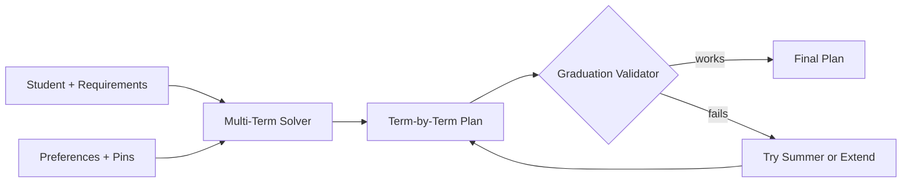
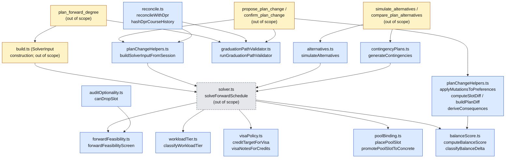
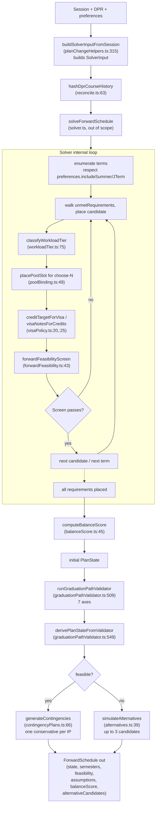
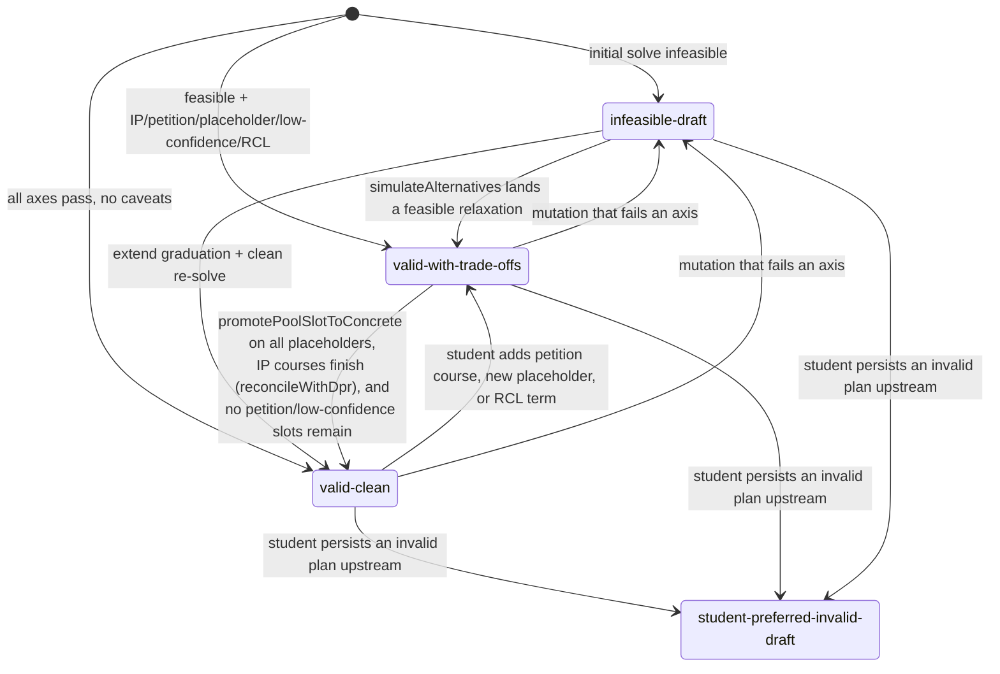

# Forward-Schedule Subsystem — Technical Audit

## TL;DR

This is the brain that lays out an entire degree plan from now until graduation, semester by semester. Think of it like a chess engine for course planning: it looks at every requirement the student still needs, considers prerequisites, credit limits, visa rules, and the student's own preferences, then assigns each requirement to a specific future term in a way that actually works end-to-end. It can deal with locked-in courses the student wants in a specific semester, courses they want to avoid, summer or January terms they're open to, and different pacing styles like "front-load" or "balanced." After it builds a plan, a separate validator double-checks that the student really would graduate on time. If the plan can't fit, it tries fallback strategies like adding summer or pushing graduation back a term. There's also a "what if you fail your current class" mode that builds a backup plan, and reconciliation logic that updates the plan when a fresh degree report comes in.



---

This document describes the internal modules that implement the multi-term degree-plan solver living under `packages/engine/src/agent/forwardSchedule/`. It is intentionally separate from the documentation for the user-facing `plan_forward_degree` tool — this audit covers the algorithmic core and how its modules cooperate.

> Source-of-truth note: every claim below is derived only from the source files in `forwardSchedule/`. Comments, surrounding docs, and historical reports were ignored.

---

## 1. Overview

### What the subsystem does

The forward-schedule subsystem builds a forward-looking, multi-term degree plan that:

- Starts from a student's `DegreeProgressReport` (DPR), the set of courses they have taken, and the courses currently in progress.
- Walks remaining requirement groups and places concrete courses or pool placeholders across remaining academic terms.
- Respects prerequisite ordering, per-term credit caps, F-1 visa floors, residency minima, and per-student scheduling preferences (pins, exclusions, load styles, summer/J-term opt-in).
- Produces a `ForwardSchedule` object containing semesters, slots, a feasibility report, plan state, assumptions, balance score, and (optionally) alternative-plan summaries.

### Why it lives apart from `planner/`

The `planner/` package historically focuses on the within-term planning surface (current-term registration, day/time conflicts). The forward-schedule subsystem solves a different problem: a cross-term assignment where the unit of decision is "in which future term does requirement R get satisfied, and by which course." It has its own:

- Internal `SolverInput` / `SolverOutput` / `SolverNode` types (`types.ts:43`, `types.ts:162`, `types.ts:179`) that are not shared with the within-term planner.
- A dedicated final-gate validator (`graduationPathValidator.ts:509`) that checks degree-completion axes.
- A reconciliation step (`reconcile.ts:107`) for re-aligning the saved plan after a new DPR upload.
- Sub-modules for workload tiering, balance scoring, optionality auditing, pool-slot late binding, and contingency planning that have no direct analog inside `planner/`.

---

## 2. Types

This section walks the data shapes the subsystem produces and consumes. All names below are TypeScript identifiers; the source of truth is `types.ts` plus the shared types referenced from `@nyupath/shared`.

### 2.1 SolverInput  (`types.ts:43`)

A frozen, immutable bundle passed into the solver. The solver never mutates it. Pseudo-shape:

```
SolverInput = {
  // Student-side state
  studentId, homeSchoolId, visaStatus
  coursesTaken: Set<courseId>
  coursesInProgress: Map<courseId, { term }>      // each IP row carries its own term
  currentTerm, graduationTerm

  // Per-term targets / floors / ceilings
  creditTargetPerSemester
  f1Floor                  // typically 12 when applicable, else null
  domesticPartTimeFloor    // typically 8 when applicable, else null
  creditCeiling            // typically 18
  graduationCreditMinimum  // typically 128 for CAS
  creditsEarned

  // Header-level caps from DPR
  passFailCap / passFailUsed
  onlineCreditCap / onlineCreditsUsed
  outsideHomeCreditCap / outsideHomeCreditsUsed
  cumulativeGpa, majorGpa
  graduationGpaFloor, majorGpaFloor

  // Unmet requirements walked off DPR.notSatisfiedRequirements
  unmetRequirements: Array<{
    rId, title, category, credits, candidateCourses[]
  }>

  // Catalog data
  prereqs: Map<courseId, PrereqGroup[]>
  offerings: Map<courseId, Array<"fall"|"spring"|"summer"|"january">>
  offeringConfidence: Map<courseId, ConfidenceTier>
  courseCatalog: Map<courseId, { title, credits }>
  dprCourseHistoryHash
  dpr: DegreeProgressReport

  // Program rules
  programRules: {
    majorRuleKinds:           Map<rId, "must_take"|"choose_n">
    schoolCoreRuleIds:        Set<rId>
    generalCategoryRuleIds:   Set<rId>
    residencyMinCredits
    majorCreditMinimum
    upperLevelMinCredits
  }

  // Optional bulletin metadata
  courseTitles, courseBulletinKeywords
  minGrades: Map<courseId, Record<prereqId, gradeLetter>>

  // Per-student preferences (optional)
  preferences?: SchedulePreferences

  // Same-term co-requisite map
  coreqs?: Map<courseId, courseId[]>
}
```

### 2.2 SolverOutput  (`types.ts:162`)

```
SolverOutput = {
  semesters: ForwardSemester[]
  feasibility: FeasibilityReport
  alternativeCandidates?: AlternativePlanSummary[]
  balanceScore: number          // lower is better
  assumptions:  Assumption[]    // IP_COURSE_COMPLETION, etc.
  state: PlanState
}
```

### 2.3 SolverNode  (`types.ts:179`)

Mutable in-flight state during greedy placement; never returned to callers.

```
SolverNode = {
  perTerm:        Map<term, ScheduleSlot[]>
  placedCourses:  Set<courseId>
  excludedCourses: Set<courseId>
  perTermCredits: Map<term, number>
  decisions:      string[]      // breadcrumb log
}
```

### 2.4 ForwardSchedule, ForwardSemester, semester slot

`ForwardSchedule` is the durable, persisted shape that flows out of the subsystem (built by `build.ts`, consumed by routes, validated by `graduationPathValidator.ts`). Each `ForwardSemester` carries a `term`, `plannedCredits`, `notes[]`, `loadRationale` (with `hardCount`, `easyCount`, `weightedCredits`), and a list of `ScheduleSlot`s.

A `ScheduleSlot` is a discriminated union by `kind`:

- `specific_planned` — concrete course chosen by the solver. Carries `courseId`, `title`, `credits`, `satisfiesRules[]`, `reason`, `rationale`, `flexibility`, `downstreamImpact`, `workloadTier`, `workloadWeight`, `bindingState`, `confidence`, `isCriticalPath`, optional `requiresPetition`, optional `optionalReason`, optional `approvalAuthority`.
- `placeholder` — reserved slot whose course is not yet bound (pool slot or generic-category reservation). Carries `placeholderId`, `category`, `credits`, `satisfiesRules[]`, `bindingState` (`"placeholder-pending"` or `"placeholder-deferred"`), `workloadTier`, `workloadWeight`, optional `poolBinding`.
- `completed` — already passed; carries `courseId`, `title`, `credits`, `grade`.
- `in_progress` — currently IP; carries `courseId`, `title`, `credits`.

### 2.5 Plan states (PlanState 4-state)

The validator derives one of four states from its per-axis results (`graduationPathValidator.ts:549`, `derivePlanStateFromValidator`):

- **`valid-clean`** — every axis returns `"pass"` and the plan has no in-progress assumptions, petition slots, low-confidence offerings, or placeholders.
- **`valid-with-trade-offs`** — no axis fails, but at least one axis returned `"assumed-pass"` or `"requires-approval"`, OR the plan contains IP assumptions, petition slots, low-confidence (`irregular`/`permission_only`) offerings, or placeholders.
- **`infeasible-draft`** — at least one validator axis returned `"fail"`.
- **`student-preferred-invalid-draft`** — a plan-state label produced upstream of this subsystem when the student insists on a structurally invalid plan; the validator itself only emits `valid-clean`, `valid-with-trade-offs`, or `infeasible-draft`. The fourth state lives in the `PlanState` shared union to allow user-initiated draft persistence.

### 2.6 SchedulePreferences shape

A shared-package type the solver reads via `SolverInput.preferences`. Walking the touch-points in this folder, it includes at minimum:

```
SchedulePreferences = {
  loadStyle?:        "balanced" | "frontload" | "backload"
  loadStylePerTerm?: Record<term, "light" | "heavy" | "balanced">
  pins?:             Array<{ courseId, term }>
  exclusions?:       Array<{ courseId, term? }>
  creditTargetPerTerm?: Record<term, number>
  includeSummer?:    boolean
  includeJTerm?:     boolean
  schedulingPreferences?: SchedulingPreferences   // within-term day/time prefs
}
```

The within-term `SchedulingPreferences` substructure (avoidDays, avoidTimeWindows, preferTimeWindows, desiredFreeDay, avoidConsecutiveLongBlocks) is fully described by `planChangeHelpers.ts:31` (`SchedulingPreferencesSchema`).

### 2.7 PlanChangeProposal / PlanMutation variants

The solver does not consume mutations directly; instead, mutation requests flow through `planChangeHelpers.ts:55` (`PlanMutationSchema`). The supported mutation kinds, exactly as enumerated in that union:

| kind | payload | effect on preferences |
|---|---|---|
| `pin` | `{courseId, term, freeze?}` | When `freeze !== false`, removes any duplicate `(courseId, term)` from `prefs.pins[]` and appends. When `freeze === false`, no-op at prefs layer (route-layer transient placement). |
| `exclude` | `{courseId, term?}` | Adds (deduped) to `prefs.exclusions[]`. |
| `swap` | `{drop, add, term}` | Excludes `drop` (term-agnostic dedupe by courseId) and pins `add` to `term`. |
| `move` | `{courseId, fromTerm, toTerm}` | Atomic drag-to-move. Excludes courseId (dedupe by courseId, records `fromTerm`); does NOT write to `prefs.pins[]`. The actual move happens at the route layer. |
| `unpin` | `{courseId, term}` | Removes matching pin entry. |
| `addTerm` | `{term}` | If term contains "summer" → `includeSummer = true`. If "january"/"jterm"/"j-term" → `includeJTerm = true`. Fall/spring are no-ops. |
| `loadStyleOverride` | `{term?, style}` | With `term`: writes `prefs.loadStylePerTerm[term]`, but rejects `"frontload"` / `"backload"` (plan-level only) with a no-op consequence. Without `term`: writes `prefs.loadStyle`, but rejects `"light"` / `"heavy"` (per-term only) with a no-op consequence. |
| `bindFreeElective` | `{slotId, courseId}` | No-op at prefs layer; consequence string emitted. |
| `unbindFreeElective` | `{slotId}` | No-op at prefs layer; consequence string emitted. |
| `bindPoolSlot` | `{slotId, courseId}` | No-op at prefs layer; consequence string emitted. |
| `setSchedulingPreference` | `{value}` | Writes `prefs.schedulingPreferences`. |
| `clearSchedulingPreference` | none | Deletes `prefs.schedulingPreferences`. |

Mutations are applied left-to-right; later mutations override earlier ones for the same field (`planChangeHelpers.ts:117`).

---

## 3. Forward feasibility — the screen, not the oracle

`forwardFeasibility.ts` is a fast pruning heuristic used during placement. It is NOT the final feasibility oracle (that role belongs to the graduation-path validator).

### 3.1 Inputs

```
ForwardFeasibilityArgs = {
  placedCreditsByTerm:  Map<term, number>
  creditCeilingByTerm:  Map<term, number>
  remainingUnmet:       Array<{ courseId, credits, minDepth }>
  remainingTerms:       string[]
  confidenceByCourse:   Map<courseId, ConfidenceTier>
}
```

### 3.2 Two-stage screen  (`forwardFeasibility.ts:43`)

**Stage A — Capacity check.** Sum `max(0, ceiling[t] − placed[t])` over remaining terms (`forwardFeasibility.ts:58`). Sum demand across remaining unmet courses, applying a **2.0× multiplier** for courses whose `ConfidenceTier` is `"irregular"` or `"permission_only"` (`forwardFeasibility.ts:24`, `forwardFeasibility.ts:67`). If total demand exceeds total capacity, return `false`.

Defensive default: a missing ceiling entry contributes 0 capacity (`forwardFeasibility.ts:60`). This errs toward "infeasible" if the caller forgot to populate the ceiling map.

**Stage B — Depth check.** For every remaining unmet course, ensure `minDepth ≤ remainingTerms.length` (`forwardFeasibility.ts:78`). `minDepth` encodes the longest prereq chain depth still to walk; if any course's chain is longer than the number of terms left, no permutation can fit it.

If both stages pass, return `true`. Otherwise return `false`.

### 3.3 What it does NOT do

This screen does not check rule satisfaction, prereq satisfaction, residency, GPA, F-1 floors, balance, or assumptions. Its only job is to cheaply prune doomed branches. False positives and false negatives are both possible by design; the truth gate is Stage 8's validator.

### 3.4 Where the solver places candidates

The actual placement walk (term-by-term, prereq-aware, balance-aware, preference-aware) lives in `solver.ts`, which is intentionally outside this audit's file list. The solver calls the feasibility screen at each candidate placement to decide whether to recurse or backtrack.

What we can describe from this folder alone:

- The solver consumes `SolverInput.unmetRequirements` plus `prereqs`, `offerings`, and `coreqs` to drive placement.
- It respects `preferences.pins` (lock a courseId to a term), `preferences.exclusions` (forbid placement), `preferences.loadStyle` (plan-level shape), `preferences.loadStylePerTerm` (per-term override), and `preferences.includeSummer` / `includeJTerm` (term-enumeration opt-in).
- Co-requisites (`SolverInput.coreqs`) force same-term placement.
- The solver's per-term credit demand is informed by `creditTargetPerSemester`, `creditCeiling`, and the visa-aware target from `visaPolicy.ts:20`.

---

## 4. Graduation-path validator

`graduationPathValidator.ts:509` (`runGraduationPathValidator`) is the final feasibility gate. It runs after the solver converges and decides whether the plan reaches graduation.

### 4.1 Inputs

```
GraduationPathValidatorArgs = {
  plan: ForwardSchedule
  dpr:  DegreeProgressReport
  programRules: {
    degreeCreditMinimum
    residencyMinCredits
    majorCreditMinimum
    minorCreditMinimum
    upperLevelMinCredits
    schoolCoreMinCredits
    graduationTargetTerm
  }
}
```

### 4.2 Seven axes

Every axis produces a `ValidationResult` whose `status` is `"pass"`, `"fail"`, `"assumed-pass"`, or `"requires-approval"`.

| # | Axis | What it checks |
|---|------|----------------|
| 1 | `requirementGroupsSatisfied` (`graduationPathValidator.ts:85`) | Walks `notSatisfiedRequirements(dpr.requirementGroups)`. For each leaf, ensures it is either DPR-satisfied (`coursesUsed.length > 0`) or covered by a plan slot whose `satisfiesRules[]` includes its `rId`. Placeholder slots count as coverage. If the covering course is in `plan.assumptions` as `IP_COURSE_COMPLETION`, the axis returns `"assumed-pass"`. |
| 2 | `poolSlotsResolvable` (`graduationPathValidator.ts:188`) | Walks placeholder slots that carry `poolBinding`. Each pool's `candidates[]` is filtered against the running `consumedByPool` set so the same candidate isn't double-counted across slots sharing a `poolId`. If a slot has zero resolvable candidates left, fail. |
| 3 | `totalCreditsMeetMinimum` (`graduationPathValidator.ts:225`) | `creditsEarned + Σ plannedCredits ≥ degreeCreditMinimum`. |
| 4 | `thresholdsMet` (`graduationPathValidator.ts:248`) | Residency check: `residencyUsed + plannedResidency ≥ residencyMin` (treats all `specific_planned` + `in_progress` slots as residency-eligible). Major credit check: sum of credits over slots with `workloadTier ∈ {major-required, major-elective}` ≥ `majorCreditMinimum`. Minor / school-core thresholds are skipped when null. |
| 5 | `visaAxesPass` (`graduationPathValidator.ts:308`) | Examines `plan.feasibility.constraintViolations`. Any violation whose `kind` is `credit_floor`, `credit_ceiling`, or `gpa_floor` fails the axis. If any semester `note` contains `ogs`, `rcl`, or `cpt` (case-insensitive), returns `requires-approval` (authority: `"OGS"`). |
| 6 | `assumptionsExplicit` (`graduationPathValidator.ts:342`) | For every IP course in `dpr.courseHistory`, if an `IP_COURSE_COMPLETION` assumption exists whose `courseId` matches AND whose `cascadingSlots[]` includes a planned course, then the IP course MUST also be listed in `coveredByAssumptions` (it always will be if the previous condition is met — the check is therefore narrowly scoped, intentionally avoiding cross-course false positives). |
| 7 | `graduationTargetMet` (`graduationPathValidator.ts:435`) | Accumulate credits chronologically across semesters; find the first term where cumulative ≥ `degreeCreditMinimum`. If never reached → fail. If reached but later than `graduationTargetTerm` → fail with detail. |

### 4.3 Plan-state derivation  (`graduationPathValidator.ts:549`)

```
if anyAxis is "fail"                                          → infeasible-draft
elif anyAxis is "assumed-pass" or "requires-approval"
   OR plan has IP assumptions
   OR plan has any specific_planned slot with requiresPetition
   OR plan has low-confidence slots ("irregular"/"permission_only")
   OR plan has any placeholder slot
                                                              → valid-with-trade-offs
else                                                          → valid-clean
```

The fourth state `student-preferred-invalid-draft` is not produced by this validator; it is set upstream when a student saves a knowingly invalid plan.

### 4.4 Infeasibility report  (`graduationPathValidator.ts:528`)

When `feasible === false`, the function attaches:

```
infeasibilityReport = {
  conflictSource: "other"
  conflictDetail: "Axes failed: axis1: reason; axis2: reason; …"
  relaxationSuggestions: []   // empty in this module
}
```

---

## 5. Reconcile — re-aligning a plan after DPR upload

`reconcile.ts:107` (`reconcileWithDpr`) handles the case where a student uploads a new DPR after a plan was last computed. The function inspects whether the DPR's course-history has changed, and if so, rewrites the existing plan rather than re-solving from scratch.

### 5.1 Hashing  (`reconcile.ts:63`)

`hashDprCourseHistory` produces a SHA-256 over the DPR's course history. The function sorts rows by `term → subject → catalogNbr`, then serializes only the stable identity columns: `term`, `subject`, `catalogNbr`, `grade`, `type`, `units`. Insertion-order differences and per-parser metadata don't affect the hash.

### 5.2 Short-circuit  (`reconcile.ts:112`)

If the new hash equals `schedule.dprCourseHistoryHash`, return `{ hashChanged: false, schedule (unchanged), transformations: [] }`.

### 5.3 Slot rewriting  (`reconcile.ts:137`)

If the hash differs:

- Build `completedByKey` and `inProgressByKey` maps from the new DPR's `courseHistory`, using `isCompletedRow` (EN/TE with a grade that passes the D threshold via `meetsGradeThreshold`; explicit F/W/WD always fail) and `isInProgressRow` (`type === "IP"`).
- Build `satisfiedRIds` — the set of requirement IDs whose `coursesUsed.length > 0` in the new DPR.
- Walk every semester. For each slot:
  - `specific_planned` with `courseId` in `completedByKey` → replace with a `completed` slot carrying the new grade (default `"P"`). Emit `slot-completed` transformation.
  - `specific_planned` with `courseId` in `inProgressByKey` → replace with an `in_progress` slot. Emit `slot-in-progress` transformation.
  - `placeholder` whose `satisfiesRules[]` overlaps `satisfiedRIds` → drop the slot. Emit `placeholder-removed` transformation with the matched rId.
  - All other slots pass through unchanged.
- Recompute `plannedCredits` per semester after slot replacement (`reconcile.ts:204`).

### 5.4 Pruning stale assumptions  (`reconcile.ts:221`)

Filter `schedule.assumptions[]` to drop any `IP_COURSE_COMPLETION` entry whose `courseId` is now in `completedByKey`. This prevents the agent from surfacing a caveat for a course the registrar has already marked passed.

### 5.5 Re-validate + return  (`reconcile.ts:233`)

Re-run `runGraduationPathValidator` against the rewritten schedule, derive a fresh `PlanState` via `derivePlanStateFromValidator`, and return `{ hashChanged: true, schedule: { …rewritten, state: newState }, transformations }`.

> Reconcile does NOT re-solve. It only rewrites slots that DPR evidence makes unambiguous (course passed, course IP, requirement now satisfied). Re-solving is a separate decision made upstream (e.g., the agent calling `plan_forward_degree` again).

---

## 6. Alternatives — fallback candidates when infeasible

`alternatives.ts:39` (`simulateAlternatives`) runs only when the primary solve returned `feasibility.feasible === false`. It tries up to three progressively-relaxed re-solves and returns up to three `AlternativeCandidate` objects.

### 6.1 The three strategies, in order

1. **`include_summer`** — adds `preferences.includeSummer = true`. Skipped if the input already had it set (`alternatives.ts:44`).
2. **`include_jterm`** — adds `preferences.includeJTerm = true`. Skipped if already set (`alternatives.ts:63`).
3. **`extend_grad_one_term`** — advances `graduationTerm` by one main term using `computeNextMainTerm` (`alternatives.ts:116`): `YYYY-spring → YYYY-fall`, `YYYY-fall → (YYYY+1)-spring`. Returns null (and the strategy is skipped) for non-main-term inputs like `YYYY-summer`.

Each strategy invokes `solveForwardSchedule(modifiedInput)` and constructs a candidate via `buildCandidate` (`alternatives.ts:170`):

- If the relaxed solve is feasible: `schedule` is populated from `buildScheduleFromOutput` (`alternatives.ts:132`), which mirrors the construction in `build.ts` without re-running the full validator.
- If still infeasible: `schedule: null` and `stillInfeasibleReason` is set to the solver's reported reason, falling back to the candidate-specific fallback string.

Final return: `candidates.slice(0, 3)`.

### 6.2 Consumers

This helper feeds `simulate_alternatives` and `compare_plan_alternatives` user-facing tools. The compare tool sits one layer above and does not appear in this folder.

---

## 7. Visa policy

`visaPolicy.ts` provides two pure helpers.

### 7.1 Per-term credit target  (`visaPolicy.ts:20`)

```
creditTargetForVisa(visa):
  if visa == "f1": return 12
  else:            return 16
```

### 7.2 Per-term visa notes  (`visaPolicy.ts:25`)

Takes `{ credits, visa, f1Floor, domesticPartTimeFloor }` and produces a list of plain-English warnings:

- **F-1 below floor.** If `visa === "f1"` and `credits < f1Floor`: emit "Below F-1 full-time floor of N credits — Reduced Course Load (RCL) approval from NYU OGS required before registration." This is the message that later trips the validator's Axis 5 `requires-approval` branch (because it contains `rcl`/`ogs`/`cpt` keywords).
- **Domestic part-time band.** If `visa !== "f1"` and credits sit in `[domesticPartTimeFloor, f1Floor)`: emit a part-time financial-aid notice.
- **Domestic below part-time floor.** If `visa !== "f1"` and credits sit below `domesticPartTimeFloor`: emit a "not registered for standing" notice.

Notes are accumulated and returned; no exception is thrown.

---

## 8. Workload tier

`workloadTier.ts:75` (`classifyWorkloadTier`) is a pure classifier that, given a slot's metadata, produces `{ tier, weight }` consumed by per-term `loadRationale.hardCount` / `weightedCredits` / balance scoring.

### 8.1 Tier resolution  (`workloadTier.ts:86`)

Starting from `free-elective` (lowest precedence), walk `satisfiesRules[]` and upgrade the tier if any rule matches:

```
TIER_PRECEDENCE (high → low):
  major-required   (5)
  major-elective   (4)
  school-core      (3)
  general-elective (2)
  free-elective    (1)
```

Mapping rule:

- `majorRuleKinds.get(rId) === "must_take"` → upgrade candidate to `major-required`.
- `majorRuleKinds.get(rId) === "choose_n"`  → upgrade candidate to `major-elective`.
- `schoolCoreRuleIds.has(rId)`              → upgrade candidate to `school-core`.
- `generalCategoryRuleIds.has(rId)`         → upgrade candidate to `general-elective`.

The slot keeps the highest-precedence tier it matched. `isOptional` is a fallback label for slots with no rule match; an explicit rule always wins.

### 8.2 Base weights  (`workloadTier.ts:61`)

```
major-required:   1.0
major-elective:   1.0
school-core:      1.0
general-elective: 0.6
free-elective:    0.5
```

### 8.3 Stacking modifiers  (`workloadTier.ts:163`)

Modifiers add to the base weight, capped at +0.6 total (`workloadTier.ts:69`, `MAX_MODIFIER`):

- **+0.20 — W modifier.** `courseId` ends with "W" (`workloadTier.ts:133`), or `bulletinKeywords` includes any of "writing-intensive", "intensive writing", "expository writing".
- **+0.15 — L modifier.** `courseId` ends with "L", or `bulletinTitle` matches `\bLab\b`.
- **+0.20 — Advanced level.** For Tandon courses (`-UY`): course number ≥ 3000. For all other schools (CAS, `-UA`, etc.): course number ≥ 4000.
- **+0.20 — Capstone.** `prereqsEntry.prereqGroups.length >= 3` — a heuristic proxy for courses with deep prereq trees.

Final weight = base + `min(sum_of_modifiers, 0.6)`.

---

## 9. Balance score

`balanceScore.ts:45` (`computeBalanceScore`) reduces a list of `ForwardSemester`s and a `LoadStyle` to a single non-negative scalar. **Lower is better.**

### 9.1 Formula

```
score = α * variance(plannedCredits)
      + β * variance(hardCount)
      + γ * loadStyleDeviation(credits, loadStyle)
```

with calibrated coefficients (`balanceScore.ts:31`):

```
α = 1.0  // weightedCreditsVariance
β = 2.0  // hardCountVariance
γ = 0.5  // loadStyleDeviation
```

Variance is population variance (`mean(x²) − mean(x)²`), not sample variance — each term is treated as a census, not a sample (`balanceScore.ts:81`).

### 9.2 LoadStyleDeviation  (`balanceScore.ts:102`)

- `balanced` / `light` / `heavy` → deviation = 0 (per-term overrides are captured in `loadRationale`, not at plan level).
- `frontload` → deviation = `max(0, centroid − medianTermIdx)` (penalize when credit centroid is later than median).
- `backload` → deviation = `max(0, medianTermIdx − centroid)` (penalize when centroid is earlier than median).

`centroid = Σ(credits[i] × i) / Σ(credits[i])`; `medianTermIdx = (n − 1) / 2`.

Edge cases: returns 0 for `semesters.length === 0`, `n ≤ 1`, or `totalCredits === 0`.

### 9.3 Delta classification  (`balanceScore.ts:65`)

`classifyBalanceDelta(before, after)` translates a score change into a label:

```
delta = after − before
delta <= 0   → "improved"
delta < 1.5  → "negligible"
delta < 4    → "degraded-mild"
otherwise    → "degraded-significant"
```

This is used by `planChangeHelpers.ts:611` (`buildPlanDiff`) to populate the `balanceImpact` field of a `PlanDiff` after a mutation.

---

## 10. Audit optionality

`auditOptionality.ts:49` (`canDropSlot`) decides whether a slot can be removed from a plan without breaking any global degree constraint. Used by the agent to surface "you could drop X" suggestions and by helpers that decide whether to consume optional requirements.

### 10.1 Inputs

```
AuditOptionalityArgs = {
  slot, plan
  programRules: { degreeCreditMinimum, residencyMinCredits, majorCreditMinimum,
                  upperLevelMinCredits, graduationTargetTerm }
  f1Floor
  perTermCreditsAfterRemoval: Map<term, number>  // caller pre-computes
  forwardFeasibilityAfterRemoval: boolean         // result of forwardFeasibilityScreen
}
```

### 10.2 Seven checks, all evaluated (not short-circuited)

Every failing check is added to `blockingConstraints[]`. The slot is droppable iff `blockingConstraints` ends empty.

1. **Degree-credit-minimum.** `Σ plannedCredits − slot.credits ≥ degreeCreditMinimum`.
2. **Residency.** Approximation: all planned credits treated as residency-eligible. `Σ plannedCredits − slot.credits ≥ residencyMinCredits` (when not null).
3. **Major-credit-minimum.** Only checked when `slotContributesMajorCredits(slot)` is true (workloadTier ∈ {major-required, major-elective}). Compares total major credits in plan minus this slot's credits against `majorCreditMinimum`.
4. **Upper-level-credit count.** Only checked when `slotIsUpperLevel(slot)` is true. Upper-level inference: parse trailing number from `courseId`; ≥ 3000 → upper-level (broad heuristic, see `auditOptionality.ts:170`). Compares plan total upper-level credits minus this slot against `upperLevelMinCredits`.
5. **F-1 floor across affected terms.** For each term in `perTermCreditsAfterRemoval`: if `creditsAfter < f1Floor` (when `f1Floor !== null`), block.
6. **Graduation-target-term.** Always passes — dropping a slot never moves the target forward. Documented as trivially true.
7. **Forward-feasibility.** If the pre-computed `forwardFeasibilityScreen` post-removal returned `false`, block.

Returns `{ droppable: true }` when nothing blocked, or `{ droppable: false, blockingConstraints: [...] }` with a human-readable reason for each failure.

---

## 11. Pool binding — late binding for choose-N pools

`poolBinding.ts` handles "reserve credits + a tier slot now, decide the specific course later" semantics for elective pools (free electives, major-elective choose-N pools).

### 11.1 Reserving a pool slot  (`poolBinding.ts:49`)

`placePoolSlot({ poolBinding })` produces a `RequirementPoolSlot`:

```
RequirementPoolSlot = {
  kind: "requirement-pool"
  ruleId:        poolBinding.satisfiesRule
  candidates:    [...poolBinding.candidates]
  constraints:   []
  bindingState:  "unbound"
  bound:         undefined
}
```

The caller wraps this inner `RequirementPoolSlot` inside a parent `ScheduleSlotPlaceholder` carrying `credits`, `term`, and `placeholderId`. The args interface is deliberately minimal so callers cannot pass fields that would be silently dropped (`poolBinding.ts:31`).

### 11.2 Promoting to a concrete course  (`poolBinding.ts:98`)

`promotePoolSlotToConcrete({ parentSlot, placeholder, chosenCourseId, courseTitle })`:

**Guard 1** — parent slot must have `bindingState` of `"placeholder-pending"` or `"placeholder-deferred"`. Otherwise return `{ success: false, rejectedBecause: "already-promoted" }`.

**Guard 2** — `chosenCourseId` must be in `placeholder.candidates`. Otherwise return `{ success: false, rejectedBecause: "not-in-candidates" }`.

**Success** — build a `ScheduleSlotSpecificPlanned`:

```
{
  kind: "specific_planned"
  courseId:        chosenCourseId
  title:           courseTitle
  credits:         parentSlot.credits
  satisfiesRules:  parentSlot.satisfiesRules
  reason:          "Bound from pool: <ruleId>"
  rationale:       parentSlot.rationale
  flexibility:     parentSlot.flexibility
  downstreamImpact: parentSlot.downstreamImpact
  workloadTier:    parentSlot.workloadTier
  workloadWeight:  parentSlot.workloadWeight
  bindingState:    "bound"
  confidence:      parentSlot.confidence
  isCriticalPath:  parentSlot.isCriticalPath
  (optionalReason / approvalAuthority forwarded if present)
}
```

The caller (`confirm_plan_change` / `bindPoolSlot` tool) splices this concrete slot in place of the parent placeholder. The `RequirementPoolSlot` itself is never mutated to a `bound` state — the parent slot is replaced entirely.

---

## 12. Contingency plans — IP-failure what-ifs

`contingencyPlans.ts:66` (`generateContingencies`) builds a "what if this in-progress course fails?" sibling plan for each `IP_COURSE_COMPLETION` assumption in an optimistic plan.

### 12.1 Inputs and output

```
generateContingencies(optimistic: ForwardSchedule, baseInput: SolverInput) →
  { optimistic, conservatives: [{ ipCourseAssumed, plan }, …] }
```

If the optimistic plan has no `IP_COURSE_COMPLETION` assumptions, returns `{ optimistic, conservatives: [] }`.

### 12.2 Per-IP transformation  (`contingencyPlans.ts:82`)

For each IP assumption:

1. **Strip the IP course from in-progress.** `derivedCoursesInProgress = new Map(baseInput.coursesInProgress); .delete(ipCourseId)`.
2. **Strip from taken.** `derivedCoursesTaken = new Set(baseInput.coursesTaken); .delete(ipCourseId)` — in case it was double-counted.
3. **Synthesize a retake requirement.** Unless the same course already appears as a candidate in `baseInput.unmetRequirements`, append:

```
{
  rId:              "IP_RETAKE_<sanitized courseId>"
  title:            "Retake: <courseId> (IP course failed)"
  category:         "ip_retake"
  credits:          courseCatalog credits (default 4)
  candidateCourses: [ipCourseId]
}
```

4. **Re-solve.** Call `solveForwardSchedule(derivedInput)`.
5. **Wrap the output** with `solverOutputToForwardSchedule` (`contingencyPlans.ts:35`), reusing the original `studentId`, `homeSchoolId`, `graduationTerm`, credit floors, ceilings, and `dprCourseHistoryHash`. `degreeCreditsMet` is computed as `creditsEarned >= graduationCreditMinimum` (note: does NOT add planned credits — slightly more conservative than the `alternatives.ts` analog).

The result is a list of conservative plans, one per IP course, each independent.

---

## 13. Plan-change helpers

`planChangeHelpers.ts` contains the pure utilities shared between `propose_plan_change` and `confirm_plan_change` tools. Five major exports:

### 13.1 Zod schemas  (`planChangeHelpers.ts:31`, `:55`, `:97`)

- `SchedulingPreferencesSchema` — within-term day/time preferences. Uses `.passthrough()` so unknown fields survive round-trips.
- `PlanMutationSchema` — discriminated union over all 12 mutation kinds. Single source of truth.
- `PlanChangeInputSchema` — `{ mutations: PlanMutation[] }` with `min(1)`.

### 13.2 `applyMutationsToPreferences`  (`planChangeHelpers.ts:117`)

A pure, left-to-right reducer over mutations that produces a new `SchedulePreferences` plus a list of `noOpConsequences` (strings explaining mutations that didn't take effect at the preferences layer).

Key behaviors per kind (full table above in §2.7):

- **Deep-clones** `pins`, `exclusions`, `loadStylePerTerm`, `creditTargetPerTerm` before mutating, so the caller's input is never mutated (`planChangeHelpers.ts:122`).
- **Pin with `freeze: false`** doesn't write to `prefs.pins[]` — the route layer handles transient placement.
- **Swap and Move** dedupe exclusions by courseId only, NOT by the `(courseId, term)` tuple. This matches the solver's exclusion-set semantics (keyed on courseId only). A comment in the source flags that if the solver ever becomes term-aware on exclusions, both kinds must switch together.
- **AddTerm** is term-string-pattern-matched (`includes("summer")`, `includes("january")` / `includes("jterm")` / `includes("j-term")`); fall and spring are always implicit no-ops.
- **LoadStyleOverride** enforces a strict per-term-vs-plan-level dichotomy: per-term accepts `"light" | "heavy" | "balanced"` only; plan-level accepts `"balanced" | "frontload" | "backload"` only. Mismatches are rejected with a no-op consequence rather than silently coerced.
- **bindFreeElective / unbindFreeElective / bindPoolSlot** are pure no-ops at the preferences layer; they emit consequence strings explaining that Phase 14 Task 6 wires slot-level binding elsewhere.
- **TypeScript exhaustiveness guard** at the default branch (`planChangeHelpers.ts:286`) forces compile-time failure if a new `PlanMutation` kind is added without updating the switch.

### 13.3 `buildSolverInputFromSession`  (`planChangeHelpers.ts:315`)

Factor of the SolverInput construction so propose/confirm tools don't duplicate it. Builds:

- `coursesTaken` (rows whose grade passes D threshold) and `coursesInProgress` (`type === "IP"` rows; each preserves its own term via `psTermToSolverTerm`, falling back to `currentTerm`).
- `currentTerm` via `inferCurrentTermFromDpr` — takes the latest IP row's term, converting Peoplesoft-style `"YYYY Fall"` / `"YYYY Spr"` / `"YYYY Sum"` / `"YYYY J Term"` to solver-style `"YYYY-fall"` etc. Default fallback: `"2026-fall"`.
- `graduationTerm` via `deriveGraduationTermFromCredits` — advances from `currentTerm` by `ceil(creditsNeeded / creditTargetPerSemester)` main terms.
- `unmetRequirements` via `notSatisfiedRequirements(dpr.requirementGroups)`. Each entry's `credits` defaults to 4 via `inferRequirementCredits`; `candidateCourses` are extracted by regex-scanning the requirement's description + statusText + title for course-id patterns (`COURSE_ID_RE = /\b([A-Z][A-Z0-9]*-[A-Z]{2,3})\s+(\d{1,4}[A-Z]?)\b/g`).
- `programRules` (`buildProgramRulesFromSession`) — uses **text classification** on rule titles (substring `"major"` / `"concentration"` / `"required"` / `"core"`) to bucket leaves into `majorRuleKinds`, `schoolCoreRuleIds`, `generalCategoryRuleIds`. `residencyMinCredits` comes from DPR or school config; `majorCreditMinimum` and `upperLevelMinCredits` are null at this layer.
- `dprCourseHistoryHash` via the same `hashDprCourseHistory` exported by `reconcile.ts`.
- Defaults: `creditTargetPerSemester = 16`, `creditCeiling = schoolConfig?.maxCreditsPerSemester ?? 18`, `f1Floor = 12` (only for F-1), `domesticPartTimeFloor = 8`, `graduationGpaFloor = schoolConfig?.overallGpaMin ?? 2.0`.

When called with an override `preferences` argument, the override replaces `session.schedulePreferences`.

### 13.4 `computeSlotDiff` / `buildPlanDiff`  (`planChangeHelpers.ts:437`, `:546`)

`computeSlotDiff(before?, after)` builds an index of slots keyed by `<term>::<kind>::<courseId or placeholderId>` and computes `{ added, removed }` arrays of `{ term, slot }` entries.

`buildPlanDiff(before?, after)` returns a richer `PlanDiff`:

- `creditsByTermDelta` — per-term `(after.plannedCredits − before.plannedCredits)`, only including non-zero deltas.
- `weightedCreditsByTermDelta` — same shape, against `loadRationale.weightedCredits`.
- `workloadTierShifts[]` — `{ term, before: {hardCount, easyCount, weightedCredits}, after: ... }` entries for terms where any of those three numbers changed.
- `graduationTermShift` — signed semester distance via `termDelta` (`SEASON_ORD = { spring: 0, summer: 1, fall: 2, january: 3 }`).
- `balanceImpact` — `{ before, after, delta, classification }` using `computeBalanceScore(loadStyle = "balanced")` and `classifyBalanceDelta`.
- `planStateChange` — `{ from, to }` when `before.state !== after.state`.
- Several fields (`cascadedShifts`, `newRequiresPetition`, `removedRequiresPetition`, `newUnmetRequirements`, `newAssumptions`, `validationResultsChanges`) are populated as empty in this helper; richer derivation happens at higher layers.

### 13.5 `deriveConsequences`  (`planChangeHelpers.ts:494`)

Builds plain-English strings combining:

- The `noOpConsequences` list from `applyMutationsToPreferences`.
- A feasibility verdict line (`"Plan remains feasible after mutation."` or `"Plan is infeasible after mutation: <reason>"` + up to three constraint-violation lines).
- An "Added: …" line listing `<courseId or "placeholder"> → <term>` pairs.
- A "Removed: …" line listing `<courseId or "placeholder"> (was in <term>)` pairs.

---

## 14. End-to-end solve flow

### 14.1 Per-module call graph



### 14.2 Full solver pipeline (session + preferences → ForwardSchedule)



### 14.3 Plan-state transitions



Notes on transitions:

- The validator only emits `valid-clean`, `valid-with-trade-offs`, or `infeasible-draft` (`graduationPathValidator.ts:549`). `student-preferred-invalid-draft` is set upstream when a student persists a knowingly invalid plan.
- `reconcileWithDpr` (`reconcile.ts:107`) is the typical pathway for `valid-with-trade-offs → valid-clean`: it replaces `specific_planned` slots with `completed` ones when DPR evidence arrives, and drops placeholders whose requirements are now satisfied.
- `simulateAlternatives` (`alternatives.ts:39`) is the typical pathway out of `infeasible-draft`: by adding summer, adding J-term, or extending graduation by one main term.

---

## 15. File-line reference index

| Module | Path | Key entry points |
|---|---|---|
| Types | `packages/engine/src/agent/forwardSchedule/types.ts` | `SolverInput :43`, `SolverOutput :162`, `SolverNode :179` |
| Forward feasibility | `packages/engine/src/agent/forwardSchedule/forwardFeasibility.ts` | `forwardFeasibilityScreen :43`, `LOW_CONFIDENCE_TIERS :24` |
| Graduation-path validator | `packages/engine/src/agent/forwardSchedule/graduationPathValidator.ts` | `runGraduationPathValidator :509`, `derivePlanStateFromValidator :549`, axes at `:85`, `:188`, `:225`, `:248`, `:308`, `:342`, `:435` |
| Reconcile | `packages/engine/src/agent/forwardSchedule/reconcile.ts` | `reconcileWithDpr :107`, `hashDprCourseHistory :63`, `isCompletedRow :88`, `isInProgressRow :99` |
| Alternatives | `packages/engine/src/agent/forwardSchedule/alternatives.ts` | `simulateAlternatives :39`, `computeNextMainTerm :116`, `buildScheduleFromOutput :132`, `buildCandidate :170` |
| Visa policy | `packages/engine/src/agent/forwardSchedule/visaPolicy.ts` | `creditTargetForVisa :20`, `visaNotesForCredits :25` |
| Workload tier | `packages/engine/src/agent/forwardSchedule/workloadTier.ts` | `classifyWorkloadTier :75`, tier precedence `:53`, base weights `:61`, modifier helpers `:132`–`:161` |
| Balance score | `packages/engine/src/agent/forwardSchedule/balanceScore.ts` | `computeBalanceScore :45`, `classifyBalanceDelta :65`, coefficients `:31`, deviation `:102` |
| Audit optionality | `packages/engine/src/agent/forwardSchedule/auditOptionality.ts` | `canDropSlot :49`, helpers `:143`–`:191` |
| Pool binding | `packages/engine/src/agent/forwardSchedule/poolBinding.ts` | `placePoolSlot :49`, `promotePoolSlotToConcrete :98` |
| Contingency plans | `packages/engine/src/agent/forwardSchedule/contingencyPlans.ts` | `generateContingencies :66`, `solverOutputToForwardSchedule :35` |
| Plan-change helpers | `packages/engine/src/agent/forwardSchedule/planChangeHelpers.ts` | `SchedulingPreferencesSchema :31`, `PlanMutationSchema :55`, `PlanChangeInputSchema :97`, `applyMutationsToPreferences :117`, `buildSolverInputFromSession :315`, `computeSlotDiff :437`, `deriveConsequences :494`, `buildPlanDiff :546` |
