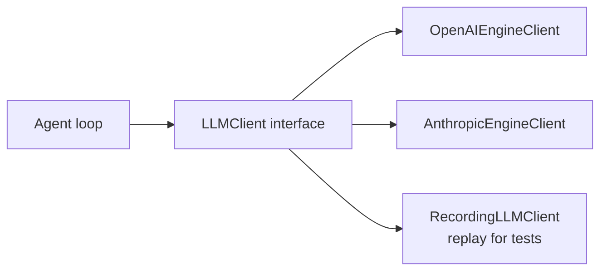

# LLM Clients

> Last verified against code: 2026-06-13 (doc-sync pass: corrected the barrel re-export claim — only `DEFAULT_PRIMARY_MODEL` + `DEFAULT_FALLBACK_MODEL` are re-exported, not all four `DEFAULT_*`).

> **Source files:** `packages/engine/src/agent/llmClient.ts`, `agent/clients/index.ts`, `clients/openaiClient.ts`, `clients/anthropicClient.ts`, `agent/recordingClient.ts`.

## Purpose

The system isn't married to one AI vendor. Whether the model doing the thinking is OpenAI's or Anthropic's, the rest of the codebase talks through one shared interface — a universal remote that works on either. The interface defines two operations: "give me a complete answer" and "stream me the answer as you generate it." Three implementations ship: one that calls OpenAI, one that calls Anthropic, and one that replays saved transcripts so unit tests don't hit a live model. This lets the team swap models and run cheap deterministic tests without touching the agent loop.



---

The engine talks to language models through a **vendor-neutral `LLMClient` interface**. Three concrete implementations ship: OpenAI, Anthropic, and a test-only recording (replay) client.

> **Known limitation — `RecorderLLMClient` was removed.** The pre-rebuild engine shipped a fourth implementation, `RecorderLLMClient` (`agent/recorderClient.ts`), that wrapped a live client to write a JSONL replay fixture. That file and its barrel export no longer exist. Replay fixtures, where still used, are authored directly rather than recorded live.

---

## 1. The `LLMClient` interface

```
interface LLMClient {
  readonly id: string
  complete(args): Promise<LLMCompletion>
  streamComplete?(args): AsyncGenerator<LLMStreamEvent>
}
```

`complete(args)` is required. `streamComplete(args)` is optional — when absent, the agent loop's streaming variant falls back to `complete()` and yields a single `text_delta` with the full text.

### `complete` args
```
{
  system: string
  messages: LLMMessage[]
  tools?: LLMToolDef[]
  maxTokens?: number
  temperature?: number
  signal?: AbortSignal
}
```

### `LLMCompletion`
```
{
  text: string
  toolCalls: LLMToolCall[]
  latencyMs: number
  usage?: { promptTokens?, completionTokens? }
  modelEcho?: string                                         // optional echo of the vendor's model id
  finishReason?: "stop" | "length" | "tool_calls" | "content_filter" | "other"
}
```

The agent loop reads `finishReason === "length"` to trigger output-truncation recovery.

### `LLMStreamEvent`
```
| { type: "text_delta", text }
| { type: "thinking_delta", text }
| { type: "done", completion: LLMCompletion }
```

Tool-call argument JSON is NOT streamed — it is delivered fully formed inside the final `done` event.

---

## 2. The production factory (`agent/clients/index.ts`)

Two factories:

- `createPrimaryClient(env = process.env): LLMClient | null`
- `createFallbackClient(env = process.env): LLMClient | null`

Both read environment variables and instantiate the appropriate client:

| Env var | Default | Purpose |
|---|---|---|
| `NYUPATH_PRIMARY_PROVIDER` | `"anthropic"` (`DEFAULT_PRIMARY_PROVIDER`) | `"openai"` or `"anthropic"` |
| `NYUPATH_PRIMARY_MODEL` | **`"claude-sonnet-4-6"`** (`DEFAULT_PRIMARY_MODEL`, `clients/index.ts:66`) | Vendor model id |
| `NYUPATH_FALLBACK_PROVIDER` | `"openai"` (`DEFAULT_FALLBACK_PROVIDER`) | Same set |
| `NYUPATH_FALLBACK_MODEL` | `"gpt-4.1-mini"` (`DEFAULT_FALLBACK_MODEL`) | Vendor model id |
| `OPENAI_API_KEY` | (required if provider = openai) | |
| `ANTHROPIC_API_KEY` | (required if provider = anthropic) | |

The default primary is **`claude-sonnet-4-6`** on the `anthropic` provider. The choice is intentional: the Phase 9 live RAG eval found Haiku reliable on clean single-topic policy but variable on hard multi-part policy questions (it flipped between the correct and an over-strict double-counting rule across runs and needed up to 12 tool calls), whereas Sonnet answered the same corpus reliably in ~3 calls. For an advising tool where wrong policy answers carry real consequences, Sonnet is the primary (`clients/index.ts:51-66`).

> **Doc-vs-comment caveat.** The large header comment at the top of `clients/index.ts` (lines 1-37) still describes `claude-haiku-4-5-20251001` as the default primary and even lists it in the "Env vars" block. **That header is stale.** The authoritative value is the exported constant `DEFAULT_PRIMARY_MODEL = "claude-sonnet-4-6"` (line 66), whose adjacent comment block (lines 51-64) documents the switch. Trust the constant, not the file header.

If the configured provider's API key is absent, the factory returns `null`. Callers use that signal to fall back to a recording client or refuse to run live. Unknown provider strings throw `Unknown LLM provider: "X"`.

`createPrimaryClient`, `createFallbackClient`, and two of the four `DEFAULT_*` constants — `DEFAULT_PRIMARY_MODEL` and `DEFAULT_FALLBACK_MODEL` — are re-exported from `@nyupath/engine` (`src/index.ts:71-74`). The two `DEFAULT_*_PROVIDER` constants are **not** re-exported from the barrel (they live only in `clients/index.ts:65-68`).

---

## 3. `OpenAIEngineClient`

> **Source file:** `packages/engine/src/agent/clients/openaiClient.ts`

Wraps the OpenAI Chat Completions API.

- Converts `LLMMessage`s to OpenAI message shape via `toOpenAIMessage`.
- Converts `LLMToolDef`s to OpenAI `tools` (`{ type: "function", function: { name, description, parameters } }`).
- Maps OpenAI's `finish_reason` to the neutral `finishReason` union.
- Supports streaming via SSE; emits `text_delta` from `delta.content` chunks and `done` from the final aggregated completion.
- Defaults `temperature = 0` if unset.
- Reads `assistantMsg.tool_calls` to produce `LLMToolCall[]` with stable ids.

The OpenAI client does NOT emit `thinking_delta` events — Chat Completions doesn't surface internal reasoning text in a stream-friendly form.

---

## 4. `AnthropicEngineClient`

> **Source file:** `packages/engine/src/agent/clients/anthropicClient.ts`

Wraps the Anthropic Messages API.

- Converts `LLMMessage`s via `toAnthropicMessage`.
- Converts `LLMToolDef`s to Anthropic `tools` (`{ name, description, input_schema }`).
- Maps Anthropic's `stop_reason` to the neutral `finishReason` union.
- Streaming: yields `text_delta` for text content blocks, `thinking_delta` for extended-thinking blocks when present.
- Surfaces token usage from `usage.input_tokens` / `usage.output_tokens`.
- Reads `tool_use` blocks to produce `LLMToolCall[]`.

---

## 5. `RecordingLLMClient` (replay)

> **Source file:** `packages/engine/src/agent/recordingClient.ts`

A test-only client that replays canned completions from an in-memory array (or a JSONL file). It is **not dead code** — five engine test suites drive the agent loop through it deterministically without network calls (`tests/eval/phase5.test.ts`, `refusalCascade.test.ts`, `fallbackLog.test.ts`, `agentLoopStreaming.test.ts`, `architectureGapsLoop.test.ts`). It is also re-exported from `@nyupath/engine` for downstream test rigs.

### Match shape
```
Recording = {
  match: {
    userMessageEquals?: string         // exact match on latest user message
    userMessageContains?: string       // substring match on latest user message
    latestToolResultContains?: string  // substring match on latest tool message
    assistantTurnIndex?: number        // assistant-turn count (0-based)
  }
  completion: {
    text: string
    toolCalls?: Array<{ id, name, args }>
    latencyMs?: number
    usage?: { promptTokens?, completionTokens? }
  }
}
```

### Match algorithm (`complete`, recordingClient.ts:67-107)

1. `latestUser` = content of the last `role: "user"` message.
2. `latestTool` = content of the last `role: "tool"` message.
3. `assistantTurnIndex` = count of `role: "assistant"` messages.
4. Find the first recording whose `match` object's non-undefined fields all satisfy.
5. If no match, throw with a debug message (latest user + turn index).
6. Build an `LLMCompletion` from the matched recording; `modelEcho` is the client `id`.

### Loading

`RecordingLLMClient.fromJsonl(path, opts?)` reads a JSONL file (one JSON object per line; blank lines and `//` lines stripped) and constructs an instance.

### Stream support

The recording client does **not** implement `streamComplete`. The agent loop falls back to `complete()` and yields one `text_delta`.

---

## 6. Conversion helpers

### `toOpenAIMessage(m: LLMMessage)`
- `role: "system"` → `{ role: "system", content }`
- `role: "user"` → `{ role: "user", content }`
- `role: "assistant"` with `toolCalls` → `{ role: "assistant", content, tool_calls: [...] }`, without → `{ role: "assistant", content }`
- `role: "tool"` → `{ role: "tool", content, tool_call_id }`

### `toAnthropicMessage(m: LLMMessage)`
- `role: "system"` — Anthropic takes system separately (request-level `system` param), not as a message.
- `role: "user"` → `{ role: "user", content: [{ type: "text", text }] }`
- `role: "assistant"` with `toolCalls` → `{ role: "assistant", content: [{ type: "text", text }, ...tool_use blocks] }`
- `role: "tool"` → `{ role: "user", content: [{ type: "tool_result", tool_use_id, content }] }`

---

## 7. The two-client (primary + fallback) policy

The agent loop accepts `options.client` (primary) and `options.fallbackClient` (optional). The fallback fires when:

1. The primary throws from `complete()` — `callWithFallback` tries the fallback once.
2. **Tier-2 compaction** uses the fallback as the cheap summarizer (6–12 bullets of older conversation).
3. **Reactive compact** uses the fallback as the summarizer when the primary returns a context-length error.

The fallback's `id` is recorded as `modelUsedId` and a `model_fallback_triggered` event fires on the observability bus.

---

## 8. Vendor capabilities the engine exploits

| Capability | OpenAI client | Anthropic client | Recording client |
|---|---|---|---|
| `complete` | ✓ | ✓ | ✓ |
| `streamComplete` | ✓ | ✓ | ✗ (falls back) |
| `text_delta` events | ✓ | ✓ | n/a |
| `thinking_delta` events | ✗ | ✓ | n/a |
| `finishReason` mapped | ✓ | ✓ | n/a |
| Tool call invocations | ✓ | ✓ | ✓ |
| Token usage telemetry | ✓ | ✓ | ✓ (from recording) |
| AbortSignal honored | ✓ | ✓ | n/a |

The agent loop's behavior is uniform regardless of vendor — the same loop runs against either live client or the replay client.
