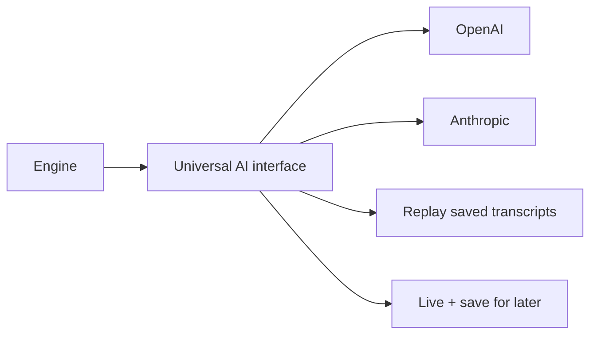

# LLM Clients

> **Source files:** `packages/engine/src/agent/llmClient.ts`, `agent/clients/index.ts`, `clients/openaiClient.ts`, `clients/anthropicClient.ts`, `agent/recordingClient.ts`, `agent/recorderClient.ts`

## TL;DR

The system isn't married to one AI vendor. Whether the actual brain doing the thinking is OpenAI's or Anthropic's, the rest of the codebase doesn't care — it talks through a single shared interface, like a universal remote that works on multiple TVs. The interface defines two operations: "give me a complete answer" and "stream me the answer word by word as you generate it." Four versions of this interface exist: one that calls OpenAI, one that calls Anthropic, one that replays saved conversations for testing (so tests don't actually hit the live AI), and one that does both — talks to a live AI and saves the transcript for replay later. This lets the team swap models, run cheap tests, and protect against vendor lock-in without touching the agent loop.



---

The engine talks to language models through a **vendor-neutral `LLMClient` interface**. Four concrete implementations ship: OpenAI, Anthropic, recording (replay), and recorder (live + write fixture).

---

## 1. The `LLMClient` interface

```
interface LLMClient {
  readonly id: string
  complete(args): Promise<LLMCompletion>
  streamComplete?(args): AsyncGenerator<LLMStreamEvent>
}
```

`complete(args)` is required. `streamComplete(args)` is optional — when absent, the agent loop's streaming variant falls back to `complete()` and yields a single `text_delta` with the full text.

### `complete` args
```
{
  system: string
  messages: LLMMessage[]
  tools?: LLMToolDef[]
  maxTokens?: number
  temperature?: number
  signal?: AbortSignal
}
```

### `LLMCompletion`
```
{
  text: string
  toolCalls: LLMToolCall[]
  latencyMs: number
  usage?: { promptTokens?, completionTokens? }
  modelEcho?: string                                         // optional echo of the vendor's model id string
  finishReason?: "stop" | "length" | "tool_calls" | "content_filter" | "other"
}
```

The agent loop reads `finishReason === "length"` to trigger output-truncation recovery.

### `LLMStreamEvent`
```
| { type: "text_delta", text }
| { type: "thinking_delta", text }
| { type: "done", completion: LLMCompletion }
```

Tool-call argument JSON is NOT streamed — it's delivered fully formed inside the final `done` event.

---

## 2. The production factory

`agent/clients/index.ts` exports two factories:

- `createPrimaryClient(env = process.env): LLMClient | null`
- `createFallbackClient(env = process.env): LLMClient | null`

Both read environment variables and instantiate the appropriate client:

| Env var | Default | Purpose |
|---|---|---|
| `NYUPATH_PRIMARY_PROVIDER` | `"anthropic"` | `"openai"` or `"anthropic"` |
| `NYUPATH_PRIMARY_MODEL` | `"claude-haiku-4-5-20251001"` | Vendor model id |
| `NYUPATH_FALLBACK_PROVIDER` | `"openai"` | Same set |
| `NYUPATH_FALLBACK_MODEL` | `"gpt-4.1-mini"` | Vendor model id |
| `OPENAI_API_KEY` | (required if provider=openai) | |
| `ANTHROPIC_API_KEY` | (required if provider=anthropic) | |

If the configured provider's API key is absent, the factory returns `null`. Callers can use that signal to fall back to a recording client or refuse to run live.

Unknown provider strings throw `Unknown LLM provider: "X"`.

---

## 3. `OpenAIEngineClient`

> **Source file:** `packages/engine/src/agent/clients/openaiClient.ts`

Wraps the OpenAI Chat Completions API.

- Converts `LLMMessage`s to OpenAI message shape via `toOpenAIMessage`.
- Converts `LLMToolDef`s to OpenAI `tools` (each `{ type: "function", function: { name, description, parameters } }`).
- Maps OpenAI's `finish_reason` to the neutral `finishReason` union.
- Supports streaming via Server-Sent Events; emits `text_delta` events from the `delta.content` chunks and `done` from the final aggregated completion.
- Defaults `temperature = 0` if unset.
- Reads `assistantMsg.tool_calls` to produce `LLMToolCall[]` with stable ids.

The OpenAI client does NOT emit `thinking_delta` events — OpenAI's Chat Completions API doesn't surface internal reasoning text in a stream-friendly form.

---

## 4. `AnthropicEngineClient`

> **Source file:** `packages/engine/src/agent/clients/anthropicClient.ts`

Wraps the Anthropic Messages API.

- Converts `LLMMessage`s to Anthropic message shape via `toAnthropicMessage`.
- Converts `LLMToolDef`s to Anthropic `tools` (`{ name, description, input_schema }`).
- Maps Anthropic's `stop_reason` to the neutral `finishReason` union.
- Streaming: yields `text_delta` for `content_block_delta` events of `text_delta` type, `thinking_delta` for `thinking_delta` events (when Anthropic returns extended-thinking content).
- Surfaces token usage from `usage.input_tokens` / `usage.output_tokens`.
- Reads `tool_use` blocks to produce `LLMToolCall[]`.

---

## 5. `RecordingLLMClient` (replay)

> **Source file:** `packages/engine/src/agent/recordingClient.ts`

A test-only client that replays canned completions from an in-memory array (or a JSONL file). Used by unit tests to drive the agent loop deterministically without network calls.

### Match shape

```
Recording = {
  match: {
    userMessageEquals?: string         // exact match on latest user message
    userMessageContains?: string       // substring match on latest user message
    latestToolResultContains?: string  // substring match on latest tool message
    assistantTurnIndex?: number        // exact assistant-turn index (0-based)
  }
  completion: {
    text: string
    toolCalls?: Array<{ id, name, args }>
    latencyMs?: number
    usage?: { promptTokens?, completionTokens? }
  }
}
```

### Match algorithm

`complete(args)`:
1. Extract `latestUser` = content of the last `role: "user"` message.
2. Extract `latestTool` = content of the last `role: "tool"` message.
3. Compute `assistantTurnIndex` = count of `role: "assistant"` messages.
4. Find the first recording whose `match` object ALL non-undefined fields satisfy.
5. If no match, throw with a debug message.
6. Return an `LLMCompletion` built from the matched recording.

### Loading

`RecordingLLMClient.fromJsonl(path, opts?)` reads a JSONL file (one JSON object per line, blank lines and `//` lines stripped) and constructs an instance.

### Stream support

The recording client does **not** implement `streamComplete`. The agent loop will fall back to `complete()` and yield one `text_delta`.

---

## 6. `RecorderLLMClient` (live + record)

> **Source file:** `packages/engine/src/agent/recorderClient.ts`

Wraps a real `LLMClient` to **record** every call to a JSONL fixture file. Used by the eval harness to build replay fixtures from a single live cohort run.

Each call passes through to the inner client. On success, it appends a single JSON line to the configured fixture path, carrying enough context (latest user message, latest tool result, assistant turn index, the completion) to be replayed later by `RecordingLLMClient`.

Configurable via `RecorderOptions`:
- The match strategy to write into the fixture (`userMessageEquals` vs `userMessageContains` vs `latestToolResultContains` vs `assistantTurnIndex`).
- The fixture path.
- An optional id.

---

## 7. Conversion helpers

### `toOpenAIMessage(m: LLMMessage)`

- `role: "system"` → `{ role: "system", content }`
- `role: "user"` → `{ role: "user", content }`
- `role: "assistant"` with `toolCalls` → `{ role: "assistant", content, tool_calls: [...] }`
- `role: "assistant"` without → `{ role: "assistant", content }`
- `role: "tool"` → `{ role: "tool", content, tool_call_id }`

### `toAnthropicMessage(m: LLMMessage)`

- `role: "system"` — Anthropic takes system separately; this is handled at the request level (system param), not as a message conversion.
- `role: "user"` → `{ role: "user", content: [{ type: "text", text: m.content }] }`
- `role: "assistant"` with `toolCalls` → `{ role: "assistant", content: [{type:"text", text}, ...tool_use blocks] }`
- `role: "tool"` → `{ role: "user", content: [{ type: "tool_result", tool_use_id, content }] }`

---

## 8. The two-client (primary + fallback) policy

The agent loop accepts `options.client` (primary) and `options.fallbackClient` (optional). The fallback fires when:

1. The primary throws an error from `complete()`. `callWithFallback` then tries the fallback once.
2. **Tier-2 compaction** uses the fallback as the summarizer (cheap call to produce 6–12 bullets of older conversation).
3. **Reactive compact** uses the fallback as the summarizer too, when the primary returns a context-length error.

The fallback's `id` is recorded as `modelUsedId` and a `model_fallback_triggered` event fires on the observability bus.

---

## 9. Vendor capabilities the engine exploits

| Capability | OpenAI client | Anthropic client | Recording client |
|---|---|---|---|
| `complete` | ✓ | ✓ | ✓ |
| `streamComplete` | ✓ | ✓ | ✗ (falls back) |
| `text_delta` events | ✓ | ✓ | n/a |
| `thinking_delta` events | ✗ | ✓ | n/a |
| `finishReason` mapped | ✓ | ✓ | n/a |
| Tool call invocations | ✓ | ✓ | ✓ |
| Token usage telemetry | ✓ | ✓ | ✓ (from recording) |
| AbortSignal honored | ✓ | ✓ | n/a |

The agent loop's behavior is uniform regardless of vendor — the same loop runs against either.
