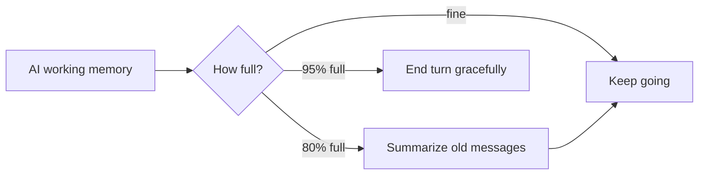
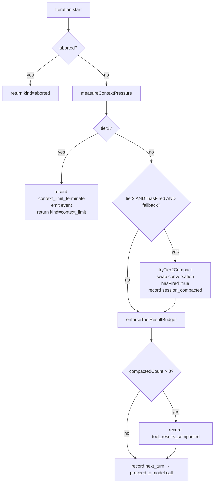
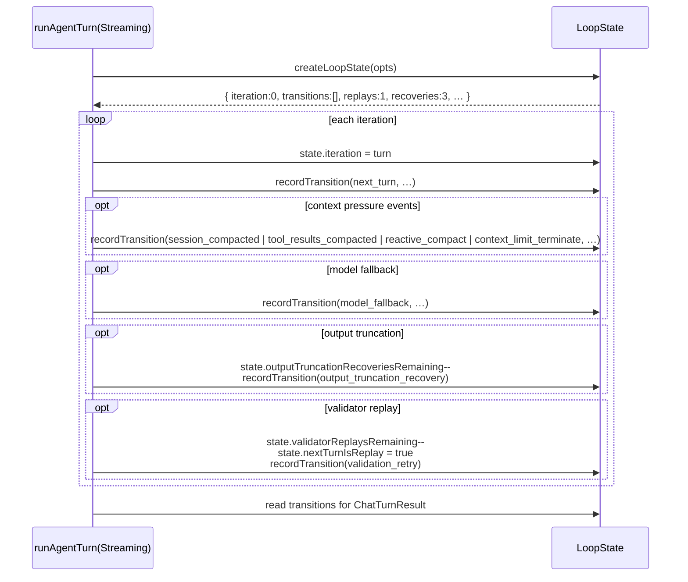

# Loop State, Context Pressure, and Compaction

> Last verified against code: 2026-06-10 (post planning-engine rebuild, PRs #35-#41).

> **Source file:** `packages/engine/src/agent/loopState.ts`. Consumed by both agent-loop entry points in `packages/engine/src/agent/agentLoop.ts`.

## Purpose

This module is the agent loop's "desk manager." AI models have a limited working memory; if a conversation drags on with lots of tool results, the model runs out of room to think. `loopState.ts` keeps a running log of what happened this turn, tracks how many retries the loop has left, and watches how close the conversation is to overflowing. When pressure hits ~80% it asks the cheaper fallback model to summarize older messages (Tier-2); at ~95%+ it gives up gracefully and tells the student to start a fresh chat (Tier-3). It also trims long tool results that pile up over multiple rounds. See [agent-loop.md](./agent-loop.md) for how the loop wires these helpers together.

## TL;DR

AI models have a limited working memory — like a desk with only so much room for papers. If a conversation drags on with lots of tool results, the desk gets full and the model can't think anymore. This module is the system's desk manager. It keeps a running log of what happened this turn, tracks how many retries the AI has left, and watches how close the conversation is to overflowing. When things get crowded (about 80% full), it asks a cheaper backup model to summarize older parts of the conversation so the main AI keeps room to work. When it's almost completely full (95%+), it gives up gracefully and tells the student to start a fresh chat. It also trims long tool results that pile up over multiple rounds so they don't hog space.



---

This module owns everything the agent loop tracks **across iterations of a single turn**: transition records, validator-replay budget, output-truncation retries, reactive-compact bookkeeping, and the helpers for the three context-pressure tiers.

---

## 1. `LoopState` fields

| Field | Type | Purpose |
|---|---|---|
| `iteration` | number | Current loop iteration (0-indexed). Set at the top of each iteration. |
| `transitions` | `TransitionRecord[]` | Append-only log of state changes — surfaces in `ChatTurnResult.transitions`. |
| `validatorReplaysRemaining` | number | Default 1. Decremented when a validator-driven replay is queued. |
| `outputTruncationRecoveriesRemaining` | number | Default 3. Decremented for each `finish_reason=length` continuation. |
| `hasAttemptedReactiveCompact` | boolean | Set true after the first reactive compaction fires; prevents looping. |
| `hasFiredTier2Compaction` | boolean | Set true after Tier-2 fires; prevents firing again the next iteration before there's new content. |
| `nextTurnIsReplay` | boolean | Set by `maybeQueueValidatorReplay`; read+cleared by the next iteration to suppress `thinking_delta` yields. |

`createLoopState(opts)` returns a fresh state. `LoopStateOptions` exposes:
- `validatorReplayLimit` — default 1; set to 0 to disable replays entirely.
- `outputTruncationRecoveryLimit` — default 3.

---

## 2. Transition records

`TransitionReason` is an exhaustive union:

```
next_turn                  — every iteration start
stop_hook_retry            — defined but currently unused by the loop
validation_retry           — validator rejected and replay queued
error_recovery             — defined but currently unused by the loop
model_fallback             — fallback client served this request
tool_results_compacted     — enforceToolResultBudget truncated messages
session_compacted          — Tier-2 compaction fired
context_limit_terminate    — Tier-3 fired
output_truncation_recovery — output was truncated and got auto-continued
reactive_compact           — context-length error caused mid-turn compaction
```

`recordTransition(state, reason, sink, detail?, correlationId?)` does two things:
1. Pushes `{ iteration, reason, ts, detail? }` onto `state.transitions`.
2. Emits a `transition` event on the `FallbackSink` (the observability bus).

---

## 3. Tool-result budget (`enforceToolResultBudget`)

Constants:
- `MAX_TOOL_RESULT_BUDGET = 32_000` characters across all `role: "tool"` messages.
- `TOOL_RESULT_KEEP_RECENT = 2` (the most recent two are kept verbatim).

Algorithm:

```mermaid
flowchart TD
    START[Walk every message, collect indexes<br/>of role=tool messages + their lengths] --> SUM[total = sum of tool message lengths]
    SUM --> CHECK{total ≤ 32k<br/>OR<br/>tool messages ≤ 2?}
    CHECK -->|yes| BAIL[Return 0]
    CHECK -->|no| LASTFULL[lastFullIdx = third-from-last tool message idx]
    LASTFULL --> LOOP[For each tool msg from oldest forward]
    LOOP --> KEEP_RECENT{idx ≥ lastFullIdx?}
    KEEP_RECENT -->|yes| END
    KEEP_RECENT -->|no| SMALL{content ≤ 200 chars?}
    SMALL -->|yes| SKIP[skip — already small]
    SMALL -->|no| TRUNC[truncate to first 200 chars +<br/>'…[older tool result truncated under<br/>MAX_TOOL_RESULT_BUDGET; N chars elided]']
    SKIP --> RECOMP
    TRUNC --> INC[compactedCount++]
    INC --> RECOMP[total = recompute]
    RECOMP --> UNDER{total ≤ 32k?}
    UNDER -->|yes| END[Return compactedCount]
    UNDER -->|no| LOOP
```

The function mutates `messages` in place. Returns the count of messages it touched, so the caller emits a `tool_results_compacted` transition only when something actually changed.

---

## 4. Token estimation

```
estimateTokens(messages, systemPrompt) = ceil(sum(content lengths + systemPrompt length) / 4)
```

A flat 4-chars-per-token heuristic. Real callers can swap a tokenizer in if accuracy matters, but the tier thresholds (80%, 95%) have enough slack that the estimate suffices.

Constants:
- `DEFAULT_MODEL_WINDOW_TOKENS = 128_000` (gpt-4.1-mini default).
- `TIER2_TRIP_FRACTION = 0.80`
- `TIER3_TRIP_FRACTION = 0.95`

---

## 5. Context-pressure tiers

`measureContextPressure(messages, systemPrompt, windowTokens?)` returns:

```
{
  estimated: <int>,
  windowTokens: <int>,
  fraction: estimated / windowTokens,
  tier2: fraction ≥ 0.80,
  tier3: fraction ≥ 0.95
}
```

Used by the agent loop at the top of every iteration.

### Tier 3 — terminate

If `tier3` is true:
- Loop records `context_limit_terminate` transition.
- Emits a `context_limit_terminate` fallback event.
- Returns `ChatTurnResult` with `kind = "context_limit"` and a fixed `finalText`:
  > "I'm running out of context for this conversation. Please start a new chat with the question you'd like me to focus on — I'll have your prior session summary loaded so we don't lose progress."

No model call is made.

### Tier 2 — proactive compact

If `tier2` is true AND `!hasFiredTier2Compaction` AND a fallback client is configured:

1. Call `tryTier2Compact(conversation, fallbackClient, systemPrompt, signal)`.
2. That builds a single condensed string from the head (each message as `[role]: <first 800 chars>`) and asks the fallback client to summarize it into 6–12 bullets preserving every fact about courses, GPA, declared programs, deadlines, visa status. `temperature: 0`, `maxTokens: 800`.
3. `compactConversation` replaces the head with a single `role: "system"` message:
   > "[Conversation auto-compacted under Tier-2 pressure. Earlier turns summarized below.]\n<summary>"
4. Keeps the last 6 messages verbatim.
5. Sets `hasFiredTier2Compaction = true`.
6. Records `session_compacted` transition.

If the summarizer throws, `tryTier2Compact` returns null and the loop proceeds without compacting (the next iteration's pressure check will likely fire Tier-3).

### Reactive compact (mid-turn) — block path only

> **Known limitation.** This path lives only in `runAgentTurn` (the block entry point). The streaming entry point `runAgentTurnStreaming` — which production uses — has **no** reactive-compact handling; a 413 from the primary routes straight to the fallback client. So `hasAttemptedReactiveCompact` and the `reactive_compact` transition never fire in production. See [agent-loop.md §11](./agent-loop.md#11-block-vs-streaming--feature-asymmetry).

If the primary client throws an error matching `isContextLengthExceededError` (substring match against `context_length_exceeded`, `context length exceeded`, `maximum context length`, `too long for context`, `maximum allowed input`, `413`) AND `!hasAttemptedReactiveCompact` AND a fallback client is configured:

1. Run `tryTier2Compact` (same summarizer flow).
2. Set `hasAttemptedReactiveCompact = true` and `hasFiredTier2Compaction = true`.
3. Record `reactive_compact` transition.
4. Retry the primary client once with the compacted conversation.
5. If the retry also fails, call `callWithFallback` (which uses the fallback to actually produce a completion).
6. If even that fails, return `kind = "model_error_no_fallback"` with the original primary error message.

---

## 6. `compactConversation`

```
compactConversation(messages, { summarize, keepTrailing = 6 })
```

- If `messages.length ≤ keepTrailing + 1`, return as-is (no point compacting).
- Otherwise split: head = first `len - keepTrailing`, tail = last `keepTrailing`.
- Call `await summarize(head)` to get a string.
- Return `[{ role: "system", content: "[Conversation auto-compacted under Tier-2 pressure. Earlier turns summarized below.]\n<summary>" }, …tail]`.

Pure function with respect to inputs; the summarizer is the caller's injection point. The agent loop wires the fallback client in as the summarizer.

---

## 7. Decision tree at the top of each iteration



---

## 8. Output-truncation recovery (post-model call) — block path only

Defined in the agent loop, but the budget (`outputTruncationRecoveriesRemaining`) lives in `LoopState`.

> **Known limitation.** Like reactive compaction, this loop lives only in `runAgentTurn`. `runAgentTurnStreaming` (production) has no output-truncation recovery — a reply that hits `maxTokens` is simply truncated. The route compensates by raising `maxTokens` to 4096. So `outputTruncationRecoveriesRemaining` and the `output_truncation_recovery` transition never fire in production. See [agent-loop.md §11](./agent-loop.md#11-block-vs-streaming--feature-asymmetry).

After a successful model call (block path):

```
while (
  completion.finishReason === "length"
  AND completion.toolCalls.length === 0
  AND state.outputTruncationRecoveriesRemaining > 0
) {
  state.outputTruncationRecoveriesRemaining -= 1;
  perCallMaxTokens = min(perCallMaxTokens * 2, 16_384);
  record output_truncation_recovery transition;
  emit fallback event;
  call model again with conversation + assistant(<partial text>) + user("Continue from where you left off. Do not repeat earlier text.");
}
```

The continuation prompt is fixed. The completion's `text` from each retry is then concatenated by the loop into the final reply.

---

## 9. `isContextLengthExceededError`

```
isContextLengthExceededError(message) =
  message.toLowerCase() contains any of:
    "context_length_exceeded"
    "context length exceeded"
    "maximum context length"
    "too long for context"
    "maximum allowed input"
    "413"
```

A loose heuristic so the loop can recognize vendor-specific 413/over-context errors without parsing each vendor's error shape. False positives are very low because none of those strings occur in normal error messages.

---

## 10. Lifetime of a `LoopState`



A `LoopState` is per-turn, not per-conversation. Each call to `runAgentTurn` creates a fresh one.
