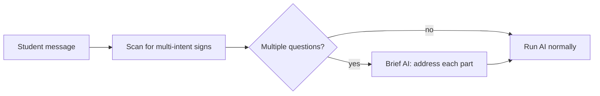
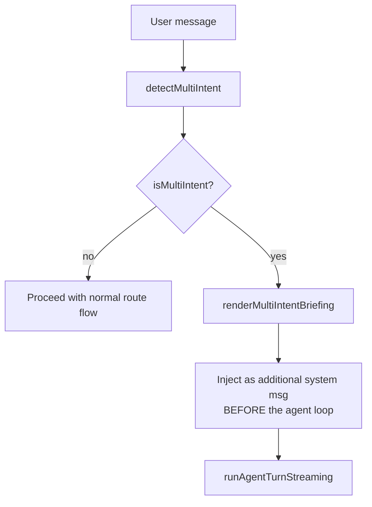

# Multi-Intent Detector

> **Source file:** `packages/engine/src/agent/verifiers/multiIntentDetector.ts`

## TL;DR

Sometimes a student crams two or three questions into one message: "What's my GPA AND can I add a math minor AND when's the deadline?" Without a heads-up, the AI might answer only the first part and miss the rest. This detector runs before the AI even starts — it's a quick scan using a handful of text patterns to spot signs of multiple questions: more than one question mark, words like "and" or "also" connecting clauses, two different "can I" or "should I" verbs, things like that. If it finds any of those signs, it tells the system "this looks like multiple questions, here are the pieces I split it into," and the system adds a note to the AI's instructions: "remember to address each of these sub-questions." Fast, no AI call, takes under a millisecond.



---

A deterministic regex-based detector that runs **before** the agent loop. When the user packed multiple distinct requests into one message ("What's my GPA AND can I add a math minor?"), the detector reports it and the route can inject a briefing system message that enumerates the sub-questions, ensuring the agent addresses each.

No LLM call. ~4 regex checks. Designed for ~< 1ms execution.

---

## 1. Output shape

```
MultiIntentReport = {
  isMultiIntent: boolean
  detectedSubQuestions: string[]   // best-effort split; may be empty if signals don't split naturally
  signals: MultiIntentSignal[]
}
```

```
MultiIntentSignal =
  | "multiple_question_marks"
  | "coordinating_conjunction"
  | "compound_what_if"
  | "two_distinct_first_person_verbs"
```

---

## 2. The four signals

### `multiple_question_marks`

The message contains at least two `?` AND between the first and last `?` there are ≥ 3 word tokens (each token defined as `\W+`-separated, length ≥ 2). This catches `"What's my GPA? Can I add a Math minor?"` while skipping emphasis like `"Really??"`.

### `two_distinct_first_person_verbs`

The message contains ≥ 2 first-person verb phrases AND at least one coordinator (`and|also|plus|then|;|,\s+(and|also)`) sits between any two of those verb phrases.

First-person verb regex:
```
\b(can\s+i | do\s+i | am\s+i | will\s+i | should\s+i
 | how\s+(many|much|do\s+i) | what(?:'s|\s+is)\s+my | what\s+are\s+my
 | have\s+i | did\s+i | when\s+do\s+i | where\s+(can|do)\s+i
 | i\s+(want|need|plan|hope)\s+to)\b
```

The coordinator only needs to fall between the earliest and the latest verb match — not necessarily between the 1st and 2nd — so multi-clause queries fire correctly.

### `compound_what_if`

The message contains ≥ 2 occurrences of `\bwhat\s+if\b`. Catches `"What if I add a minor and what if I drop calculus?"`.

### `coordinating_conjunction`

Looser version of the first-person-verb signal. The message contains ≥ 2 generic intent verbs (`plan|drop|add|register|switch|graduate|take|count|satisfy|meet|need|want|change|declare|transfer|find|search|check|see|know`) AND a coordinator sits between the first two of them.

---

## 3. Sub-question splitting

When `isMultiIntent` is true, `splitIntoSubQuestions(text)` tries to break the message into pieces:

1. **`?`-split**: if the message contains `?`, split on it. Keep fragments of length ≥ 4. If ≥ 2 fragments survive, return them with `?` re-appended.
2. **Coordinator-split** (fallback): split on `\b(and|also|plus|then)\b`. Keep fragments of length ≥ 8. If ≥ 2 survive, return.
3. Otherwise return `[]`.

---

## 4. The briefing

`renderMultiIntentBriefing(report)` produces a system-message-shaped string for the route to inject:

```
MULTI-INTENT DETECTED: the user's message contains multiple distinct requests.
Sub-questions to address:
  1. <fragment>
  2. <fragment>
  …
Address EACH sub-question in your reply. Don't drop one half. If two questions need different tools, call them all (in parallel when independent).
```

If `detectedSubQuestions` is empty (some signal fired but no natural split was possible), the briefing reports the raw signal names instead.

---

## 5. Where it sits



The briefing becomes a `role: "system"` message prepended to `priorMessages` before the agent loop runs. The model sees the briefing first, then the prior history, then the user message.

---

## 6. Why deterministic

The detector is intentionally pre-LLM:

- It costs nothing (regex execution).
- It is fully observable — a sub-question that the agent misses is a verifiable failure ("the briefing listed 3 items, the reply addressed 2").
- It can't be coaxed by adversarial input (no model reasoning to manipulate).

The trade-off is heuristic accuracy. False negatives are tolerated (the agent might still address both questions on its own). False positives are tolerated too — an extra briefing is at worst a few wasted tokens.
