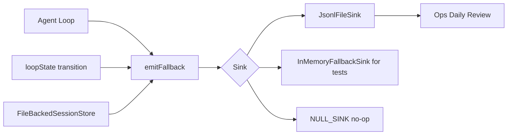
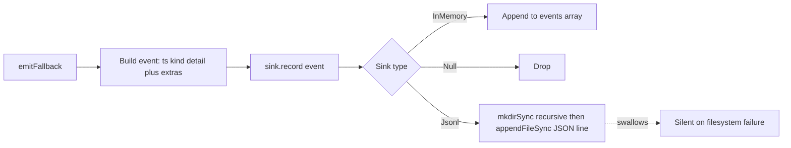
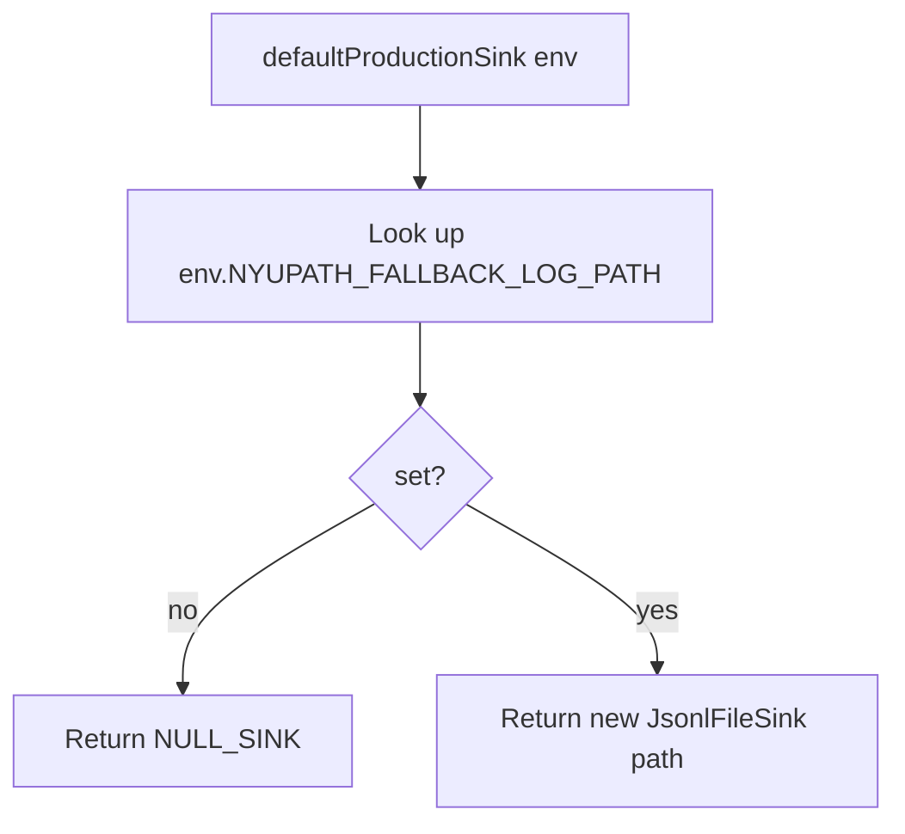

# Observability — Fallback Log

> Last verified against code: 2026-06-10 (post planning-engine rebuild, PRs #35-#41).

> **Source file:** `packages/engine/src/observability/fallbackLog.ts`

## Purpose

Whenever something operationally interesting happens inside the engine, this is where it gets recorded. An interesting event might be "the main AI model failed and we switched to a backup," "the conversation got too long and had to be compacted," "a model returned truncated output and we retried," or "a tool wasn't recognized." Each event becomes one line of structured JSON appended to a log file (or kept in memory during tests). The point is so the operations team can scan a single file and see exactly which fallback/recovery paths fired. File-writing failures are silently swallowed because logging itself should never crash the app.

---

## Purpose / overview

The observability module is a single structured event log that the agent loop, loop-state transition tracer, and persistence layer write to whenever something operationally interesting happens. Each event is one line of JSON appended to a configurable file (or held in memory for tests). The point is to make "what fired during a fallback or recovery path" a single `tail` away.

> **Correction vs. prior doc:** the old doc said the module "exposes one barrel file (`observability/index.ts`)." **There is no `observability/index.ts`.** The directory contains only `fallbackLog.ts`. The public surface is re-exported directly from the package root `packages/engine/src/index.ts` (lines 34-46), which imports from `./observability/fallbackLog.js`.

## Interface / shape

### `FallbackEventKind`

A string union of every event kind the type *declares* (`fallbackLog.ts:22-43`). Not all are emitted — see the "Emitter?" column:

| Kind | Trigger context | Emitter? |
|---|---|---|
| `model_fallback_triggered` | Primary LLM failed and a fallback model recovered. | ✅ agentLoop |
| `model_error_no_fallback` | Primary LLM failed and no fallback recovered. | ✅ agentLoop |
| `max_turns` | Agent loop hit the turn budget. | ✅ agentLoop |
| `validator_block` | (Intended: response validator blocked a reply.) | ❌ **no emitter** |
| `tool_unsupported` | A tool call wasn't found / returned unsupported. | ✅ agentLoop |
| `low_confidence_rag` | (Intended: RAG match below the confidence floor.) | ❌ **no emitter** |
| `data_conflict_unresolved` | Persistence write failed (optimistic-concurrency conflict). | ✅ sessionStore |
| `transition` | Agent-loop iteration transition (per-iteration trace event). | ✅ loopState |
| `tool_results_compacted` | Older tool results compacted under `MAX_TOOL_RESULT_BUDGET`. | ✅ agentLoop |
| `session_compacted` | Tier-2 conversation auto-compaction fired. | ✅ agentLoop |
| `context_limit_terminate` | Tier-3 graceful termination fired. | ✅ agentLoop |
| `validator_replay` | Response validator triggered a re-prompt. | ✅ agentLoop |
| `output_truncation_recovery` | `finish_reason: "length"` recovery loop fired. | ✅ agentLoop |
| `reactive_compact` | `context_length_exceeded` reactive compact fired. | ✅ agentLoop |

> **Correction vs. prior doc:** the old doc described `validator_block` and `low_confidence_rag` as live emitted events ("the response validator emits `validator_block`…", "the RAG layer emits `low_confidence_rag`"). **Neither kind is emitted anywhere in the codebase today** — they are declared in the union but have no production call site. Treat them as reserved/placeholder kinds. (See "Known limitations.")

### `FallbackEvent` (`fallbackLog.ts:45-60`)

| Field | Type | Notes |
|---|---|---|
| `kind` | `FallbackEventKind` | |
| `ts` | string | ISO timestamp, set automatically by `emitFallback`. |
| `detail` | string | Free-form human-readable message. |
| `correlationId` | optional string | Stable id tying events together across a request. |
| `toolName` | optional string | Set when the event is tool-scoped. |
| `modelId` | optional string | Set when the event references a specific model. |
| `extra` | optional `Record<string, unknown>` | Open per-kind structured payload. |

### `FallbackSink`

A one-method interface (`fallbackLog.ts:62-64`): `record(ev: FallbackEvent): void`.

### Implementations

`InMemoryFallbackSink` (`fallbackLog.ts:67-75`):
- Holds events in a public `events: FallbackEvent[]` array.
- `record` pushes onto the array.
- `clear()` resets the array.

`NULL_SINK` (`fallbackLog.ts:78`):
- A constant sink whose `record` is a no-op. Drops every event silently. The default when no sink is configured.

`JsonlFileSink` (`fallbackLog.ts:81-92`):
- Constructor takes a path.
- `record` calls `mkdirSync(dirname(path), { recursive: true })`, then `appendFileSync(path, JSON.stringify(ev) + "\n", "utf-8")`.
- All file errors are caught and silently swallowed — logging failures must never break the agent.

### Public helpers

| Helper | Shape | Notes |
|---|---|---|
| `defaultProductionSink(env)` (`fallbackLog.ts:96-100`) | `(Record<string, string?>) -> FallbackSink` | Returns a `JsonlFileSink` pointed at `env.NYUPATH_FALLBACK_LOG_PATH` when set, otherwise `NULL_SINK`. Defaults the env arg to `process.env`. |
| `emitFallback(sink, kind, detail, extra?)` (`fallbackLog.ts:103-115`) | `(FallbackSink, FallbackEventKind, string, Omit<FallbackEvent, 'kind' \| 'ts' \| 'detail'>) -> void` | Builds the event, stamps `ts` with `new Date().toISOString()`, spreads the optional fields, and calls `sink.record`. |

### Public re-exports

`packages/engine/src/index.ts` (lines 35-46) re-exports the public names — `InMemoryFallbackSink`, `JsonlFileSink`, `NULL_SINK`, `defaultProductionSink`, `emitFallback`, plus the types `FallbackEvent`, `FallbackEventKind`, `FallbackSink` — directly from `./observability/fallbackLog.js`. There is no intermediate `observability/index.ts` barrel.

## Algorithm / behavior

### Emit path

`emitFallback` is the canonical call site. It guarantees the event carries a `ts` and includes `kind` and `detail` regardless of what `extra` carries. Spreading `...(extra ?? {})` lets any field on `FallbackEvent` (`correlationId`, `toolName`, `modelId`, `extra`) be supplied via the helper.

### File-backed default selection

The selection is purely env-driven. Tests typically construct a sink directly (`new InMemoryFallbackSink()`) and pass it in.

### File writes never throw

`JsonlFileSink.record` wraps `mkdirSync` and `appendFileSync` in a single `try / catch` that drops the error. The agent never sees a logging failure; ops is expected to backfill from STDOUT if disk writes start failing silently.

## Inputs / outputs

| Helper | Input | Output |
|---|---|---|
| `emitFallback` | sink, kind, detail, optional extras | void (event written to sink) |
| `defaultProductionSink` | env dict | `FallbackSink` (Jsonl or Null) |
| `InMemoryFallbackSink.record` | event | void; appended to `events` array |
| `JsonlFileSink.record` | event | void; appended to file or silently dropped on error |

The `extra` argument to `emitFallback` is typed `Omit<FallbackEvent, 'kind' | 'ts' | 'detail'>`, so callers can pass any subset of `correlationId`, `toolName`, `modelId`, `extra`.

## Dependencies

- `fallbackLog.ts` imports `appendFileSync` and `mkdirSync` from `node:fs`, and `dirname` from `node:path`. No engine-package imports.

What depends on this module:
- **`packages/engine/src/agent/agentLoop.ts`** is the heaviest emitter. It emits `context_limit_terminate`, `session_compacted`, `tool_results_compacted`, `reactive_compact`, `output_truncation_recovery`, `model_error_no_fallback`, `model_fallback_triggered`, `tool_unsupported`, `max_turns`, and `validator_replay` across both the streaming and non-streaming loop paths.
- **`packages/engine/src/agent/loopState.ts`** (`:98`) emits the per-iteration `transition` trace event.
- **`packages/engine/src/persistence/sessionStore.ts`** (`:158-163`) emits `data_conflict_unresolved` when `FileBackedSessionStore.replace` hits an optimistic-concurrency write conflict.

## Edge cases / failure modes

- `JsonlFileSink.record` swallows every error from `mkdirSync` and `appendFileSync`. No retry, no STDERR write, no propagation. A misconfigured path silently drops events.
- `defaultProductionSink` does not validate the env path string. A path that is a directory or a non-writable file produces silent drops at write time.
- `InMemoryFallbackSink.events` is a public mutable array. Tests may inspect it freely; callers sharing a sink across tests must invoke `clear()`.
- `NULL_SINK` is a single shared constant — no per-call allocation. The canonical "discard" sink.
- `emitFallback` stamps `ts` to `new Date().toISOString()` *after* spreading `extra` (`fallbackLog.ts:109-114`), so an `extra.ts` would technically overwrite the auto-stamp. In practice the `Omit<...>` on the `extra` parameter excludes `ts`, so this never happens.
- The `extra` field is open-shaped — there is no per-kind schema. Replay/dashboard consumers must know the shape per kind.

## Known limitations

- **`validator_block` and `low_confidence_rag` are declared but never emitted.** Any ops dashboard or eval query filtering for these kinds will always come up empty against the current code. Surfacing a validator block or a low-confidence RAG match in this log would require adding emit sites in the response validator and RAG layer respectively.

## Where it's consumed

- Ops review consumes the resulting JSONL via daily-tail or eval-pipeline scripts; the file path is set by `NYUPATH_FALLBACK_LOG_PATH`. When the env var is unset, `defaultProductionSink` returns `NULL_SINK` and nothing is written.
