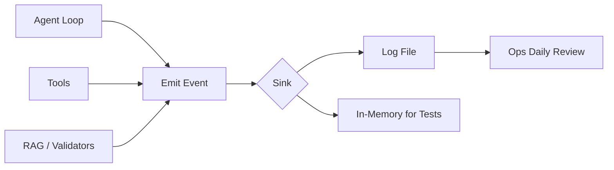
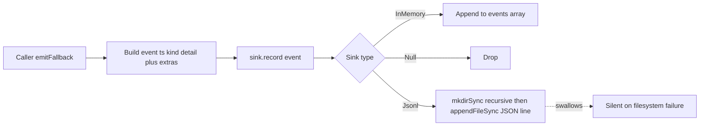
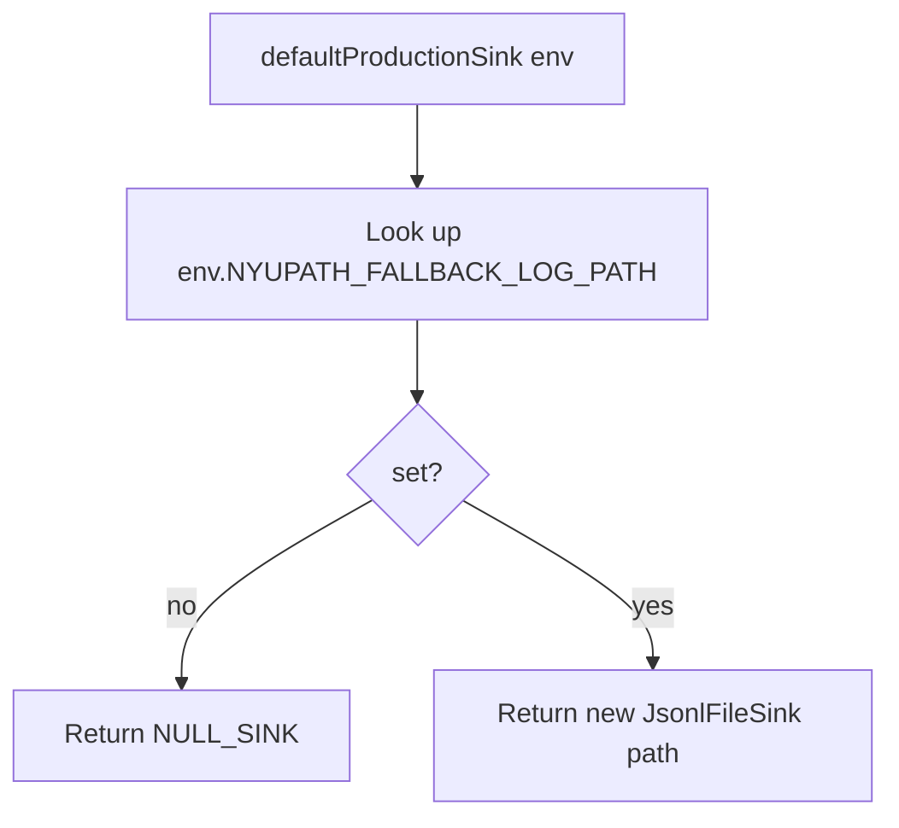

# Observability — Fallback Log

## TL;DR

Whenever something interesting happens inside the engine, this is the place it gets recorded. An interesting event might be "the main AI model failed and we switched to a backup," "the response checker blocked a reply that looked unsafe," "a tool returned nothing useful," "the conversation got too long and had to be compacted," or "the planner couldn't find a workable schedule." Each event becomes one line of structured JSON appended to a log file (or kept in memory during tests). The point is so the operations team can scan a single file at the end of the day and see exactly which fallback paths fired. File-writing failures are silently swallowed because logging itself should never crash the app.

---

## Purpose

The observability module is a single structured event log the agent loop, tools, and persistence layer write to whenever something operationally interesting happens — a model fallback, a validator block, a tool returning unsupported, a context-limit termination, a fallback model error, an auto-compaction, and so on. Each event is one line of JSON appended to a configurable file (or held in memory for tests). The point is to make the daily ops review of "what fired during a fallback or recovery path" a single `tail` away.

The package exposes one barrel file (`observability/index.ts`) that re-exports the public surface of `fallbackLog.ts`.

## Interface / shape

### `FallbackEventKind`

A string union of every event kind the engine emits (fallbackLog.ts:22-43):

| Kind | Trigger context |
|---|---|
| `model_fallback_triggered` | Primary LLM failed and a fallback model is used. |
| `model_error_no_fallback` | Primary LLM failed and no fallback was available. |
| `max_turns` | Agent loop hit the turn budget. |
| `validator_block` | Response validator blocked an outgoing reply. |
| `tool_unsupported` | A tool call returned the `unsupported` envelope. |
| `low_confidence_rag` | RAG match below the confidence floor. |
| `data_conflict_unresolved` | Data layer hit an unresolved conflict (also reused by `FileBackedSessionStore` for write failures). |
| `transition` | Agent-loop iteration transition (per-iteration trace event). |
| `tool_results_compacted` | Older tool results compacted under the tool-result budget. |
| `session_compacted` | Tier-2 conversation auto-compaction fired. |
| `context_limit_terminate` | Tier-3 graceful termination fired. |
| `validator_replay` | Response validator triggered a re-prompt. |
| `output_truncation_recovery` | `finish_reason: 'length'` recovery loop fired. |
| `reactive_compact` | `context_length_exceeded` reactive compact fired. |

### `FallbackEvent` (fallbackLog.ts:45-60)

| Field | Type | Notes |
|---|---|---|
| `kind` | `FallbackEventKind` | |
| `ts` | string | ISO timestamp, set automatically by `emitFallback`. |
| `detail` | string | Free-form human-readable message. |
| `correlationId` | optional string | Stable id tying events together across a request. |
| `toolName` | optional string | Set when the event is tool-scoped. |
| `modelId` | optional string | Set when the event references a specific model. |
| `extra` | optional `Record<string, unknown>` | Open per-kind structured payload. |

### `FallbackSink`

A one-method interface: `record(ev: FallbackEvent): void`.

### Implementations

`InMemoryFallbackSink` (fallbackLog.ts:67-75):

- Holds events in a public `events: FallbackEvent[]` array.
- `record` pushes onto the array.
- `clear()` resets the array.

`NULL_SINK` (fallbackLog.ts:78):

- A constant sink whose `record` is a no-op. Drops every event silently. Used as a safe default when no sink is configured.

`JsonlFileSink` (fallbackLog.ts:81-92):

- Constructor takes a path.
- `record` calls `mkdirSync(dirname(path), { recursive: true })`, then `appendFileSync(path, JSON.stringify(ev) + '\n', 'utf-8')`.
- All file errors are caught and silently swallowed — logging failures must never break the agent.

### Public helpers

| Helper | Shape | Notes |
|---|---|---|
| `defaultProductionSink(env)` | `(Record<string, string?>) -> FallbackSink` | Returns a `JsonlFileSink` pointed at `env.NYUPATH_FALLBACK_LOG_PATH` when set, otherwise `NULL_SINK`. Defaults the env argument to `process.env`. |
| `emitFallback(sink, kind, detail, extra?)` | `(FallbackSink, FallbackEventKind, string, Omit<FallbackEvent, 'kind' \| 'ts' \| 'detail'>) -> void` | Builds the event, stamps `ts` with `new Date().toISOString()`, spreads optional fields, and calls `sink.record`. |

### Barrel re-exports

`observability/index.ts` re-exports the public names: `InMemoryFallbackSink`, `JsonlFileSink`, `NULL_SINK`, `defaultProductionSink`, `emitFallback`, plus types `FallbackEvent`, `FallbackEventKind`, `FallbackSink`.

## Algorithm / behavior

### Emit path

`emitFallback` is the canonical call site. It guarantees the event carries a `ts` and includes `kind` and `detail` regardless of what `extra` carries. Spreading `...extra ?? {}` means any field on `FallbackEvent` (`correlationId`, `toolName`, `modelId`, `extra`) can be supplied via the helper.

### File-backed default selection

The selection is purely env-driven. Tests typically construct a sink directly (`new InMemoryFallbackSink()`) and pass it in.

### File writes never throw

`JsonlFileSink.record` wraps `mkdirSync` and `appendFileSync` in a single `try / catch` that drops the error. The comment in the catch block is the only behavior — the agent never sees a logging failure. Ops is expected to backfill from STDOUT if disk writes start failing silently.

## Inputs / outputs

| Helper | Input | Output |
|---|---|---|
| `emitFallback` | sink, kind, detail, optional extras | void (event written to sink) |
| `defaultProductionSink` | env dict | `FallbackSink` (Jsonl or Null) |
| `InMemoryFallbackSink.record` | event | void; appended to `events` array |
| `JsonlFileSink.record` | event | void; appended to file or silently dropped on error |

The `extra` argument to `emitFallback` is typed as `Omit<FallbackEvent, 'kind' | 'ts' | 'detail'>`, so callers can pass any subset of `correlationId`, `toolName`, `modelId`, `extra`.

## Dependencies

- `fallbackLog.ts` imports `appendFileSync` and `mkdirSync` from `node:fs`, and `dirname` from `node:path`.
- No engine package imports.

What depends on this module:

- `packages/engine/src/persistence/sessionStore.ts` imports `FallbackSink`, `NULL_SINK`, `emitFallback`, and `defaultProductionSink`, and uses them in `FileBackedSessionStore.replace` to record `data_conflict_unresolved` events when JSON writes fail.
- The agent loop and every tool that emits a fallback event (model fallback, validator block, tool unsupported, transition, compaction, etc.).

## Edge cases / failure modes

- `JsonlFileSink.record` swallows every error from `mkdirSync` and `appendFileSync`. There is no retry, no STDERR write, no exception propagation. A misconfigured path silently drops events.
- `defaultProductionSink` does not validate the env path string. A path string that is a directory or a non-writable file will produce silent drops at write time.
- `InMemoryFallbackSink.events` is a public mutable array. Tests may inspect it freely; callers that share a sink across tests need to invoke `clear()`.
- `NULL_SINK` is a single shared constant — there is no per-call allocation. Treat it as the canonical "discard" sink.
- `emitFallback` always stamps `ts` to `new Date().toISOString()` — passing a pre-built `ts` via the `extra` argument has no effect because the helper sets `ts` after spreading `extra`. Wait — the spread happens *after* `ts` in the object literal (fallbackLog.ts:109-114), so technically `extra.ts` *would* overwrite the auto-stamp. In practice, the typed `Omit<...>` on the `extra` parameter excludes `ts` from the allowed keys, so this is not a real path.
- The `extra` field on the event is itself optional and open-shaped — there is no per-kind schema for it. Consumers (eval dashboards, replay tools) need to know the shape of `extra` per kind.
- `FallbackEvent.correlationId` is optional. Callers that want to thread one through a request must include it on every emit.

## Where it's consumed

- The agent loop emits `transition`, `tool_results_compacted`, `session_compacted`, `context_limit_terminate`, `validator_replay`, `output_truncation_recovery`, `reactive_compact`, `max_turns`, and the model-fallback events as the loop runs through its tiers.
- Tools emit `tool_unsupported` when they return the unsupported envelope.
- The response validator emits `validator_block` when it short-circuits a reply.
- The RAG layer emits `low_confidence_rag`.
- The data and persistence layer emit `data_conflict_unresolved` — `FileBackedSessionStore` is one concrete site (sessionStore.ts:158-163).
- Ops review consumes the resulting JSONL via daily-tail or eval-pipeline scripts; the file path is set by `NYUPATH_FALLBACK_LOG_PATH`.
