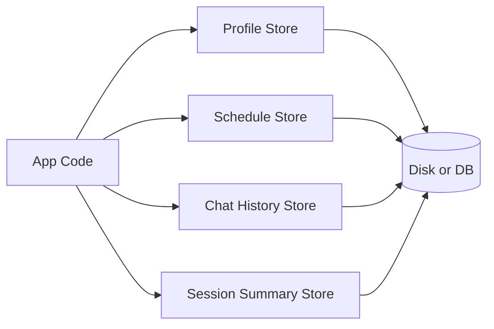
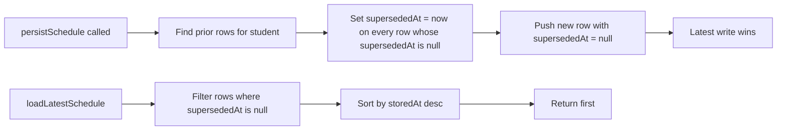
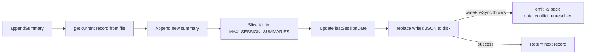

# Persistence Layer

> Last verified against code: 2026-06-10 (post planning-engine rebuild, PRs #35-#41).

## TL;DR

This is the engine's filing cabinet. Four separate drawers handle four kinds of saved state: the student's confirmed profile (declared major, courses taken, visa status), their latest forward schedule and scheduling preferences, the full chat transcript so conversations survive page refreshes, and end-of-session summaries so the AI remembers what was discussed last time. Each drawer is described as an interface — a contract for what "save this" and "load that" must do — and the engine ships simple in-memory and file-based versions for testing. The real production app plugs in versions that talk to a database, but the engine itself doesn't know or care. When a schedule is replaced, the old one is marked as superseded rather than deleted, so there's always a history.

---

## Purpose

The persistence layer defines four independent storage surfaces the engine uses to keep student state across requests, sessions, and process restarts: confirmed profile mutations, the latest forward schedule and its preferences, the rolling chat transcript, and rolling end-of-session summaries. Each surface is a TypeScript interface plus a default in-memory or file-backed implementation. The web app supplies Postgres-backed implementations behind the same interfaces.

## Interface / shape

The package exposes four store interfaces, each with at least one default implementation that lives in `packages/engine/src/persistence/`.

### `ProfileStore` (profileStore.ts:31-62)

Public methods:

| Method | Shape | Notes |
|---|---|---|
| `get(studentId)` | returns `StudentProfile` or `null` | `null` means no persisted profile yet; the caller should fall back to the in-memory profile. |
| `persistMutation(profile, audit, parsedDpr?)` | returns void | Writes both the updated `StudentProfile` and an immutable `ProfileMutationAuditEntry` in one operation. The optional `parsedDpr` lets a single call also persist the parsed Degree Progress Report. |
| `getParsedDpr(studentId)` | optional method, returns `DegreeProgressReport` or `null` | Reads the parsed DPR persisted by an earlier `persistMutation` call. |

`ProfileMutationAuditEntry` carries: `pendingMutationId`, `field` (the StudentProfile field that changed), `before`, `after`, and `confirmedAt` (ISO timestamp).

Default implementation: `InMemoryProfileStore` (profileStore.ts:65-96) — keeps profiles, parsed DPRs, and the audit log in maps that clear on process exit.

### `ScheduleStore` (scheduleStore.ts:31-60)

Public methods:

| Method | Shape | Notes |
|---|---|---|
| `persistSchedule(studentId, schedule, dprFingerprint)` | returns void | Inserts a new schedule row; implementations supersede prior live rows for the same student. |
| `loadLatestSchedule(studentId)` | returns `{ schedule, dprFingerprint }` or `null` | Returns only the row that has not been superseded. |
| `persistPreferences(studentId, prefs)` | returns void | Upsert by `studentId` — latest write fully replaces the prior preferences row. |
| `loadPreferences(studentId)` | returns `SchedulePreferences` or `null` | |
| `clearScheduleForStudent(studentId)` | returns void | Wipes the stored schedule; preferences are not touched by this call. |

A pure helper `pruneCompletedPins(prefs, completedCourseIds)` (scheduleStore.ts:75-87) filters `prefs.pins` to drop any pin whose `courseId` is in the completed set, preserving every other preference field. If all pins are dropped, the `pins` key is removed entirely.

Default implementation: `InMemoryScheduleStore` (scheduleStore.ts:105-159) — stores an array of `ScheduleRecord` per student where each record carries `storedAt` and `supersededAt` timestamps; `loadLatestSchedule` picks the live row with the most recent `storedAt`.

### `ChatHistoryStore` (chatHistoryStore.ts:39-51)

Public methods:

| Method | Shape | Notes |
|---|---|---|
| `appendMessage(studentId, message)` | returns void | Append one record to the student's transcript. |
| `loadRecentMessages(studentId, limit?)` | returns array of `ChatMessageRecord` in chronological order (oldest to newest) | When `limit` is omitted, defaults to 50. |
| `clearForStudent(studentId)` | returns void | Wipe every message for one student. |

`ChatMessageRecord` carries: `role` (`user` / `assistant` / `system`), `content`, optional `thinkingText`, optional `toolInvocations` array, optional `validatorViolations` array (each with `kind`, `detail`, optional `caveatId`), optional `pendingMutationId`, and `createdAt` (ISO timestamp).

Default load limit constant: 50 (chatHistoryStore.ts:53).

Default implementation: `InMemoryChatHistoryStore` (chatHistoryStore.ts:62-89) — one array per student, slice-tail load.

### `SessionStore` (sessionStore.ts:47-55)

Public methods:

| Method | Shape | Notes |
|---|---|---|
| `get(studentId)` | returns `StudentSessionRecord` | If none exists, returns an empty record (the studentId plus an empty `sessionSummaries` array). |
| `appendSummary(studentId, summary)` | returns the updated record | Appends one `SessionSummary`, trims to `MAX_SESSION_SUMMARIES`, persists. |
| `replace(record)` | returns void | Replace the whole record (used by tests and by `appendSummary` internally). |

`SessionSummary` carries `date` and a `summary` string. `StudentSessionRecord` carries `studentId`, `sessionSummaries`, and optional `lastSessionDate`.

`MAX_SESSION_SUMMARIES = 5` (sessionStore.ts:45).

Two default implementations:

- `InMemorySessionStore` (sessionStore.ts:61-87).
- `FileBackedSessionStore` (sessionStore.ts:93-166) — writes one JSON file per student under a root directory, naming the file `${sanitizedStudentId}.json`. Student id is sanitized by replacing every character outside `[a-zA-Z0-9_.-]` with underscore.

A helper `summariesAsPriorMessage(record, count = 3)` (sessionStore.ts:194-202) formats the most-recent `count` summaries as a single string prefixed with `Prior advising sessions (most recent last):`, one bullet per summary in the form `- ${date}: ${summary}`. Returns `null` when there are no summaries.

## Algorithm / behavior

### Profile mutations

`InMemoryProfileStore.persistMutation` writes the profile keyed by `profile.id`, pushes one entry onto `auditLog`, and stores `parsedDpr` keyed by `profile.id` only if the optional parameter was passed (profileStore.ts:75-85).

### Schedule supersede pattern

`InMemoryScheduleStore.persistSchedule` (scheduleStore.ts:109-127) loops the existing list, stamps `supersededAt = now` on every previously-live row, then appends the new record with `supersededAt = null`. `loadLatestSchedule` (scheduleStore.ts:129-140) filters to rows where `supersededAt === null`, sorts by `storedAt` descending, and returns the top one's `{ schedule, dprFingerprint }`.

### File-backed sessions

`FileBackedSessionStore.get` reads the JSON file. On parse failure or missing file it returns the empty record rather than throwing — corrupt files are recoverable on next write. On successful read it defensively trims `sessionSummaries` to `MAX_SESSION_SUMMARIES` in case an older version wrote more.

`FileBackedSessionStore.replace` writes to the per-student path. On any write failure, it forwards the error to the `FallbackSink` it was constructed with using the `data_conflict_unresolved` event kind, including `rootDir` and `path` in the `extra` payload (sessionStore.ts:144-165).

### Chat history load

`InMemoryChatHistoryStore.loadRecentMessages` returns `list.slice(-limit)` so the result is chronological (oldest at index 0, newest last). Empty / missing student yields an empty array.

## Inputs / outputs

| Store | Read input | Read output | Write input |
|---|---|---|---|
| ProfileStore | `studentId` | `StudentProfile` or `null` | `StudentProfile`, `ProfileMutationAuditEntry`, optional `DegreeProgressReport` |
| ScheduleStore (schedule) | `studentId` | `{ schedule, dprFingerprint }` or `null` | `studentId`, `ForwardSchedule`, `dprFingerprint` |
| ScheduleStore (prefs) | `studentId` | `SchedulePreferences` or `null` | `studentId`, `SchedulePreferences` |
| ChatHistoryStore | `studentId`, optional `limit` (default 50) | `ChatMessageRecord[]` chronological | `studentId`, `ChatMessageRecord` |
| SessionStore | `studentId` | `StudentSessionRecord` (empty if none) | `studentId`, `SessionSummary` |

## Dependencies

What these modules import:

- `chatHistoryStore.ts` imports `ToolInvocation` from `../agent/agentLoop.js`.
- `scheduleStore.ts` imports `ForwardSchedule` and `SchedulePreferences` from `@nyupath/shared`.
- `profileStore.ts` imports `StudentProfile` from `@nyupath/shared`, `PendingProfileMutation` from `../agent/tool.js`, and `DegreeProgressReport` from `../dpr/schema.js`.
- `sessionStore.ts` imports `FallbackSink`, `NULL_SINK`, `emitFallback`, and `defaultProductionSink` from `../observability/fallbackLog.js`, plus Node's `node:fs` and `node:path`.

What depends on these modules: any code that reads or mutates persistent student state — the agent loop's profile-confirm tool, the forward-planner route, the chat-history bootstrap route, and the SSE turn handler that writes session summaries.

### Postgres-backed implementations

The engine ships only in-memory and file-backed defaults. The web layer supplies Postgres-backed implementations that satisfy each of the four interfaces — one adapter per store under `apps/web/lib/db/`: `profileStorePostgres.ts`, `scheduleStorePostgres.ts`, `chatHistoryStorePostgres.ts`, `sessionStorePostgres.ts`. The engine cares only about the interface contract; the engine itself never imports from `apps/web`. See [web/db-and-stores.md](../web/db-and-stores.md) for the adapter details and the `forward_schedules` / `chat_messages` / `students` table mapping.

## Edge cases / failure modes

- `ProfileStore.persistMutation` is declared to be transactional where possible and not to throw on failure — the agent loop's session is the source of truth for the current turn (profileStore.ts:42-44).
- `FileBackedSessionStore.replace` swallows write errors and forwards them to the `FallbackSink` as `data_conflict_unresolved` events. The live turn never sees the error (sessionStore.ts:144-165).
- `FileBackedSessionStore.get` swallows JSON parse errors and returns an empty record, so a corrupt file does not crash a turn — the next `appendSummary` overwrites it cleanly (sessionStore.ts:118-130).
- `FileBackedSessionStore.get` always re-trims to `MAX_SESSION_SUMMARIES` in case a prior write left more.
- `pruneCompletedPins` returns the same `prefs` object reference (no clone) when there are no pins or no pins to drop (scheduleStore.ts:79-81). Otherwise it strips `pins` entirely when all pins are dropped, or returns a shallow clone with the filtered `pins` array.
- Schedule load with no rows returns `null`; load when every row has been superseded also returns `null` (scheduleStore.ts:132-135).
- `ChatHistoryStore` clears are per-student. A test-affordance "Clear" button surfaces through `clearForStudent` (chatHistoryStore.ts:50).
- `InMemoryProfileStore`, `InMemoryScheduleStore`, `InMemoryChatHistoryStore`, and `InMemorySessionStore` each expose a synchronous `clear()` test helper that wipes every student's state.
- File path safety: `FileBackedSessionStore.pathFor` strips every character outside `[a-zA-Z0-9_.-]` from the student id before composing the path, preventing directory traversal (sessionStore.ts:109-113).

## Where it's consumed

- `ProfileStore` is the persistence hook for the `confirm_profile_update` tool — after the two-step `update_profile` → `confirm_profile_update` contract, the apply step calls `persistMutation`. `getParsedDpr` is used by the login-restore route to recover the parsed DPR alongside the profile.
- `ScheduleStore` is consumed by the forward-planner write paths and by the Update-DPR route, which uses `pruneCompletedPins` and `clearScheduleForStudent` after a fingerprint mismatch.
- `ChatHistoryStore` is consumed by the chat layer at every turn boundary and at login restore.
- `SessionStore` is consumed at end-of-turn (the agent loop appends an end-of-session summary) and at the start of a new session (the loop pulls the rolling window via `summariesAsPriorMessage`).
- `FileBackedSessionStore` is selected automatically by `defaultSessionStore(env)` (sessionStore.ts:177-181) when `NYUPATH_SESSION_STORE_PATH` is set; otherwise the in-memory store is returned.
