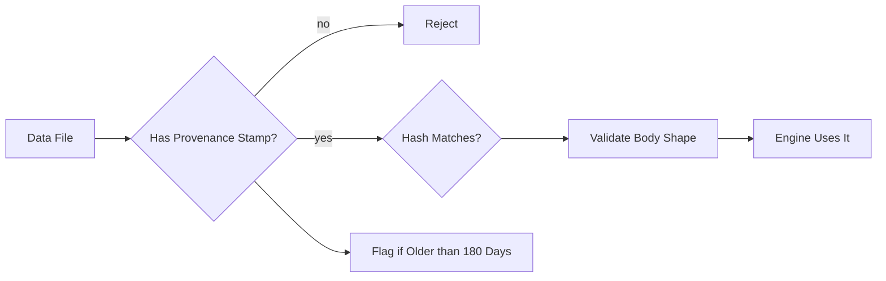
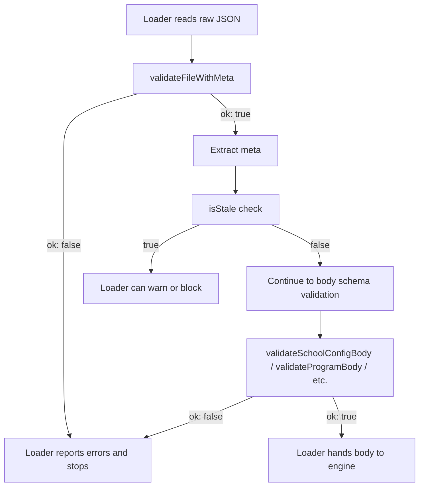

# Data Provenance

> Last verified against code: 2026-06-10 (post planning-engine rebuild, PRs #35-#41).

> **Source files:** `packages/engine/src/provenance/schema.ts`, `packages/engine/src/provenance/configSchema.ts`

## TL;DR

Every piece of authored data the engine relies on (school policies, major requirements, transfer rules, curated policy answers) has to be traceable. Where did this fact come from? What URL did we copy it from? Who verified it? When? Has it gone stale? This subsystem enforces that contract by requiring every data file to carry a small "provenance stamp" at the top with the source URL, the date it was verified, a content hash so we can tell if the underlying NYU page changed, and a note about whether it was extracted by hand, by AI, or by a scraper. It also validates that the body of each file matches the expected shape. If any file is missing a stamp or doesn't match its schema, the loader rejects it instead of letting bad data into the engine. There's a built-in staleness check that flags any data older than 180 days for re-verification.

---

## Purpose

The provenance module enforces a hard contract on every JSON data file the engine loads: each file must carry a top-level `_meta` block whose fields are validated, including a hash of the source, a verification timestamp, and a record of who or what extracted the data. A second module in the same directory validates the body schemas of school configurations, programs, transfer policies, and policy templates, layered on top of the provenance metadata.

The combined effect is "every record carries traceable provenance, and every body conforms to a typed schema before the engine reads it."

## Interface / shape

### schema.ts — `_meta` provenance

The `Meta` shape:

| Field | Type | Notes |
|---|---|---|
| `catalogYear` | string `YYYY-YYYY` where second year = first year + 1 | Enforced by regex + refine. |
| `sourceUrl` | string, valid URL | |
| `lastVerified` | string `YYYY-MM-DD` | |
| `sourceHash` | string `sha256:<64 lowercase hex>` | Sole accepted algorithm prefix. |
| `extractedBy` | enum `manual` / `llm-assisted` / `scraper` | |
| `verifiedBy` | enum `hand-review` / `eval-suite` / `unreviewed` / `spot-check` | |
| `sourceRef` | optional object `{ anchor?: string \| null, pdfPage?: positive int \| null }` (strict) | |

The schema is `strict()` — unknown keys are rejected (schema.ts:69).

A wrapper schema validates "any data file with a `_meta` block on top":

- `fileWithMetaSchema` (schema.ts:75-79) — `passthrough()` body, requires only the `_meta` key. The rest of the file's keys flow through unvalidated by this schema; body validation is each schema's own job.

Public functions:

| Function | Shape | Notes |
|---|---|---|
| `validateMeta(input)` | returns `{ ok: true, meta }` or `{ ok: false, errors: string[] }` | Validates a raw `_meta` object. Never throws on validation failure. |
| `validateFileWithMeta(input)` | same shape | Validates a full file object; returns the inner `meta` on success. |
| `isStale(meta, now?)` | `(Meta, Date) -> boolean` | Compares `lastVerified` to `now`; true when older than `STALENESS_DAYS`. |

Exported constants:

- `STALENESS_DAYS = 180` (schema.ts:130).

`ValidateResult` is the shared discriminated-union shape: `{ ok: true, meta }` or `{ ok: false, errors }`. Errors are formatted as `path.dotted: message` strings, one per Zod issue.

### configSchema.ts — body schemas

This module defines Zod schemas for the *bodies* of:

- **SchoolConfig** files (`schoolConfigBodySchema`, configSchema.ts:140).
- **Program** files (`programBodySchema`, configSchema.ts:224).
- **Transfer requirements** files (`transferRequirementsBodySchema`, configSchema.ts:275).
- **NYU internal transfer policy** files (`nyuInternalTransferPolicyBodySchema`, configSchema.ts:289).
- **PolicyTemplate** files (`policyTemplateBodySchema`, configSchema.ts:310).

All body schemas use `.passthrough()` at the top level so that the documentation keys `_meta`, `_provenance`, and `_notes` flow through unvalidated (the `_meta` key is validated separately by `schema.ts`).

Each body schema has a paired validator that returns `ValidateBodyResult<T>` (`{ ok: true, body }` / `{ ok: false, errors }`):

| Validator | Body schema |
|---|---|
| `validateSchoolConfigBody` | school config body |
| `validateProgramBody` | program body |
| `validateTransferRequirementsBody` | transfer requirements body |
| `validateNyuTransferPolicyBody` | NYU-internal transfer policy body |
| `validatePolicyTemplateBody` | policy template body |

Reusable atoms (configSchema.ts:18-38):

- `programTypeSchema` — `major` / `minor` / `concentration`.
- `residencyTypeSchema` — `suffix_based` / `total_nyu_credits`.
- `careerLimitTypeSchema` — `credits` / `courses` / `percent_of_program`.
- `perTermUnitSchema` — `semester` / `academic_year`.
- `creditCapTypeSchema` — `non_home_school` / `online` / `transfer` / `advanced_standing` / `independent_study` / `internship` / `specific_school`.
- `ruleTypeSchema` — `must_take` / `choose_n` / `min_credits` / `min_level`.
- `doubleCountPolicySchema` — `allow` / `limit_1` / `disallow`.

The program rule schema is a union of four shapes — one per `ruleType` — built from a `baseRuleSchema` (configSchema.ts:173-182) containing `ruleId`, `label`, `type`, `doubleCountPolicy`, `catalogYearRange` (a 2-tuple of strings), plus the optional exemption fields `conditionalExemption`, `flagExemption`, `exemptionLabel`. Each variant `.extend()`s the base and pins `type` to a `z.literal(...)`:

| Rule type | Required fields |
|---|---|
| `must_take` | `courses: string[]` |
| `choose_n` | `n`, `fromPool`, plus optional `excludeFromPool`, `minLevel`, `mathSubstitutionPool`, `maxMathSubstitutions` |
| `min_credits` | `minCredits`, `fromPool`, optional `excludeFromPool` |
| `min_level` | `minLevel`, `minCount`, `fromPool`, optional `excludeFromPool` |

## Algorithm / behavior

### Provenance validation flow

`validateMeta` runs `metaSchema.safeParse`. On success it returns `{ ok: true, meta }` with the parsed object. On failure it walks `result.error.issues` and converts each to `path: message`. `validateFileWithMeta` follows the same shape and reaches into `result.data._meta` on success.

### Staleness

`isStale(meta, now)` (schema.ts:136-145) parses `meta.lastVerified` as `YYYY-MM-DDT00:00:00Z`. If the resulting `Date` is invalid, it returns `true` (fail-closed). Otherwise it computes `(now - verified) / 1000 / 60 / 60 / 24` and returns true when that exceeds 180 days. The `now` argument defaults to `new Date()` so production calls do not need to thread the clock.

### Body validators

All five body validators follow the same pattern: `safeParse`, then either return `{ ok: true, body }` or convert issues to `path: message` strings (configSchema.ts:240-343). They never throw on validation failure.

### Cross-rule typing

`ruleSchema` is a `z.union` of four extended-base schemas (configSchema.ts:217-222), each tagged by `type: z.literal('...')`. The base schema is `.passthrough()`, so any forward-compatible field added to a rule definition will not break a load.

### Catalog-year refinement

`catalogYearSchema` checks the `YYYY-YYYY` regex shape, then refines: it parses both years and asserts `b === a + 1`. A string like `2024-2026` fails the refine even though it matches the regex.

## Inputs / outputs

| Function | Input | Output |
|---|---|---|
| `validateMeta` | unknown object | `{ ok, meta }` or `{ ok, errors }` |
| `validateFileWithMeta` | unknown object expected to have `_meta` | `{ ok, meta }` or `{ ok, errors }` |
| `isStale` | parsed `Meta`, optional `now: Date` | boolean |
| `validateSchoolConfigBody` | unknown object | `{ ok, body }` or `{ ok, errors }` |
| `validateProgramBody` | unknown object | `{ ok, body }` or `{ ok, errors }` |
| `validateTransferRequirementsBody` | unknown object | `{ ok, body }` or `{ ok, errors }` |
| `validateNyuTransferPolicyBody` | unknown object | `{ ok, body }` or `{ ok, errors }` |
| `validatePolicyTemplateBody` | unknown object | `{ ok, body }` or `{ ok, errors }` |

## Dependencies

- Both modules import `zod`. They have no other engine-package imports.
- `configSchema.ts` does not import from `schema.ts`; the two modules are independent but share the `ValidateBodyResult` / `ValidateResult` pattern.

What depends on these modules: the data loader layer that reads `data/schools/`, `data/programs/`, `data/transfers/`, and `data/departments/` JSON files. The loader is expected to call both a `validateFileWithMeta` and the appropriate body validator before handing a parsed file to the engine.

## Edge cases / failure modes

- `metaSchema` is strict — adding any new field to a `_meta` block without updating the schema causes a validation error rather than silently passing through.
- `sourceHash` only accepts `sha256:<64 lowercase hex>`. Other algorithms or uppercase hex are rejected.
- `catalogYear`'s regex would accept `2024-2026`, but the refine catches it; both checks must pass.
- `extractedBy` and `verifiedBy` are closed enums — a typo like `LLM-assisted` (wrong case) fails validation.
- `sourceRef.pdfPage` must be a positive integer (`z.number().int().positive()`). Zero or negative page numbers are rejected.
- `isStale` is fail-closed on an unparseable `lastVerified` even though `metaSchema` should have caught it. The function defends against being called with hand-built meta objects.
- The body schemas all use `.passthrough()` at the top level. This means unrecognized fields *do not* fail validation. The strictness lives at the `_meta` schema and at the discriminated rule schemas.
- `ruleSchema` is a union, not a discriminated union with a true `discriminator` keyword — Zod tries each variant. The first matching wins.
- `programBodySchema` requires `totalCreditsRequired`, while `schoolConfigBodySchema` allows it to be `nullable`.
- `transferRequirementsBodySchema.entryYearRequirements` requires the `entryYear` enum to be either `sophomore` or `junior` — other values (like `freshman`) are rejected.

## Where it's consumed

- The data loader for `data/schools/`, `data/programs/`, `data/transfers/`, and `data/departments/` is the primary consumer: it calls `validateFileWithMeta` for the metadata gate, then routes to the right body validator based on file type.
- `isStale` is consumed by any operator-facing dashboard, eval suite, or loader-time warning that surfaces "this data has not been re-verified in N days."
- `STALENESS_DAYS` is the single source of truth for the 180-day window.
- The body validators are imported by the loaders for each respective file family. The `Validate*` functions are pure and return errors instead of throwing, so loaders can aggregate failures across many files in one pass.
