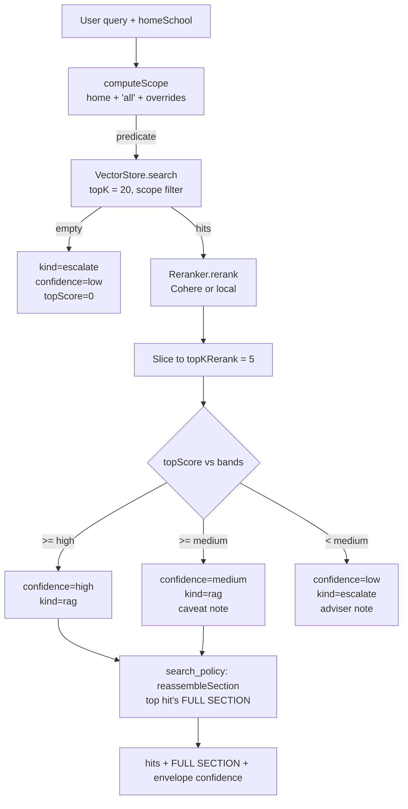

# RAG Subsystem

> Last verified against code: 2026-06-10 (post planning-engine rebuild, PRs #35-#41).

## Purpose

This is the "look it up in the bulletin" librarian. When the agent needs to answer a policy or curriculum question (like "can I take a major course pass/fail?" or "which CS courses are required for the joint major?"), it can't make up an answer from memory; it has to cite NYU's official bulletin. This subsystem chops the whole undergraduate bulletin into searchable chunks, embeds them with OpenAI vectors, and for any question returns the chunks most likely to contain the answer. It scopes the search to the parts of the bulletin that apply to the student's home school (plus NYU-wide pages). Each result comes with a confidence band so the agent knows whether to quote it, caveat it, or refer the student to an adviser. Two agent tools sit on top: `search_policy` (best-matching fragments + the top hit's whole section) and `get_program_requirements` (a whole program page reassembled).


---

## 1. Overview

The RAG (retrieval-augmented generation) subsystem is the engine's policy-grounding layer. Its single job: when the agent needs to answer a question governed by NYU bulletin text (academic policies, admissions and internal-transfer rules, program curricula, the College Core Curriculum, OGS visa/immigration rules), it returns the most relevant slices of that bulletin so the agent quotes them instead of synthesizing from memory.

The subsystem lives under `packages/engine/src/rag/`. After the "nothing hardcoded" pass it is a pure pipeline — there are **no curated answer templates** anymore (see §7). The cooperating stages:

1. **Corpus builder** (`corpus.ts`) — walks the whole bulletin tree and chunks every page.
2. **Chunker** (`chunker.ts`) — turns bulletin markdown into searchable units.
3. **Embedder** (`embedder.ts`) — turns text into vectors (OpenAI in production, a deterministic local hash in tests).
4. **Vector store** (`vectorStore.ts`) — holds the embedded chunks and runs cosine top-K.
5. **Scope filter** (`ragScopeFilter.ts`) — restricts candidates to schools the student belongs to.
6. **Reranker** (`reranker.ts`) — re-scores the cosine top-K (Cohere in production, a local lexical reranker as fallback).
7. **Policy search orchestrator** (`policySearch.ts`) — the entry point that runs scope → vector → rerank → confidence band.
8. **Section-complete retrieval** (`sectionRetrieval.ts`) — reassembles whole sections / whole pages for the two tools.
9. **Disk cache** (`policyCorpusCache.ts`) — loads precomputed `(chunk, embedding)` rows so the runtime skips a cold-start embed pass.

The barrel export at `packages/engine/src/rag/index.ts` lists everything the rest of the engine may import. Note what is **not** exported anymore: there is no `policyTemplate` / `policyTemplateLoader` export, no `matchTemplate`, and no `buildCorpus` discovery options for program pages — the corpus walk is unconditional.

### Two agent tools sit on top

- **`search_policy`** (`agent/tools/searchPolicy.ts`) — runs `policySearch`, then expands the **top hit** to its full bulletin section via `reassembleSection`. Returns the reranked fragments plus that `FULL SECTION` block.
- **`get_program_requirements`** (`agent/tools/getProgramRequirements.ts`) — runs `locateBestSource` (preferring `program` / `core_curriculum` / `school_overview` pages) and reassembles the **entire page** via `reassembleSource`, so a whole major/minor/core page arrives in one block.

Both are wired through `session.rag`, the bundle constructed by `apps/web/lib/policyRagSetup.ts` (§11).

---

## 2. Corpus

**File:** `packages/engine/src/rag/corpus.ts`

The corpus is the set of bulletin markdown files that get chunked, embedded, and indexed. The "nothing hardcoded" pass **deleted the hand-authored entry list** (`DEFAULT_ENTRIES`) and the per-section discovery helpers. The builder now does **one recursive walk of the whole bulletin tree** — every `.md` page is ingested and auto-tagged by school + category from its path.

### Source location

The bulletin lives at the monorepo root under `data/bulletin-raw/`. The path is computed from the file's own location (`corpus.ts:27-29`): four `..` up from `packages/engine/src/rag/`, then `data/bulletin-raw/`.

### What gets ingested (`discoverAllEntries`, `corpus.ts:151-193`)

1. **The entire `undergraduate/` tree.** For each `undergraduate/<school-dir>/`, `walkMarkdownRelPaths` collects every `.md` recursively. The directory maps to an engine school id via `SCHOOL_DIR_TO_ID` (`corpus.ts:58-73`): `arts-science → cas`, `business → stern`, `engineering → tandon`, `arts → tisch`, `culture-education-human-development → steinhardt`, `individualized-study → gallatin`, `liberal-studies → liberal_studies`, `professional-studies → sps`, `nursing`, `social-work → social_work`, `public-service → public_service`, `dentistry`, `abu-dhabi → nyuad`, `shanghai`. Unlisted dirs fall back to the dir name with dashes → underscores.
2. **Three NYU-wide trees**, all tagged `school: "all"` so they pass scope for every student (`corpus.ts:174-190`):
   - `internal-transfer-equivalencies/` (internal-transfer requirements)
   - `ogs/` (Office of Global Services — F-1 / J-1 / RCL / CPT / OPT visa rules)
   - `nyu/` (NYU-wide pages)

Excluded by design (`corpus.ts:12-14`): `graduate/` (out of undergrad scope) and `courses/` (the full course catalog is embedded **separately** for `search_courses` — see §15 — so duplicating it here would bloat the policy corpus).

### Category tagging (`categoryFor`, `corpus.ts:137-146`)

Each page is auto-tagged from its path: `/programs/ → program`, `college-core-curriculum → core_curriculum`, `/admissions` or `internal-transfer → admissions`, `academic-polic… → academic_policy`, `ogs/ → academic_policy`, else `school_overview`. The category rides on every chunk's metadata so the reranker and `get_program_requirements` can prefer the right kind of source.

### Build flow

`buildCorpus(embedder, options)` (`corpus.ts:207-259`):

1. Resolve catalog year (default `"2025-2026"`) and bulletin dir.
2. `entries = options.entries ?? discoverAllEntries(bulletinDir)` — tests inject a fixed set; production walks the tree.
3. Create a fresh `VectorStore` bound to the embedder.
4. For each entry: read the markdown, run `chunkMarkdown`, accumulate `PolicyChunk[]` tagged with `source`, `school`, `year`, `sourcePath`, and `category`.
5. Collect missing files into `skipped`. If `strict === true`, throw; otherwise `console.warn` a `{ kind: "corpus_entries_skipped", count, paths }` payload (unless `warnOnSkip === false`).
6. `await store.addChunks(allChunks)` — embeds everything in one pass.
7. Return `{ store, chunks, skipped }`.

> **In production the runtime never calls `buildCorpus`** — it loads the precomputed cache instead (§11). `buildCorpus` is the offline path the embed tool uses to produce that cache, and the path tests use with a deterministic embedder.

### What's actually in the production corpus today

The committed cache at `data/policy-corpus/policy_chunks.jsonl` (a gitignored ~470 MB build artifact) carries, per its `policy_chunks.meta.json`:

- **14,273 chunks**, embedded with `openai:text-embedding-3-small`, dimension **1536**, built 2026-06-04.

So internal-transfer requirements and OGS visa depth (F-1/J-1/RCL/CPT/OPT) **are** searchable in the live corpus today — they were folded into the unconditional walk. The cache only reflects bulletin changes after the embed pipeline is re-run (`tools/policy-corpus-embed/embed.ts`, an ops step needing an OpenAI key; cost is negligible).

### Chunk shape after corpus build

```
PolicyChunk {
  text: string
  meta: {
    source: string              // e.g. "CAS — Academic Policies"
    school: string              // lowercase school id, or "all"
    year: string                // catalog year
    section: string             // heading the chunk lives under
    chunkId: string             // stable, slug-derived id
    sourcePath: string          // bulletin-raw-relative path
    sourceLine: number          // 1-indexed line where the chunk begins
    category?: "academic_policy" | "admissions" | "program"
             | "core_curriculum" | "course_catalog" | "school_overview"
  }
}
```

(`chunker.ts:19-44`)

---

## 3. Chunker

**File:** `packages/engine/src/rag/chunker.ts`

Pure function. Same markdown in, same chunks out — no randomness, no LLM call.

### Pipeline

`chunkMarkdown(markdown, base, options)` (`chunker.ts:65-114`):

1. **Strip boilerplate** via `stripBulletinBoilerplate` (`chunker.ts:202-216`): removes `//<![CDATA[ … //]]>` inline-JS blocks, tab-anchor nav lines (`* [Label](#somethingcontainer)`), and `On This Page` TOC markers. Noise lines are replaced with empty lines, not deleted, so `sourceLine` stays correct.
2. **Split into sections** via `splitIntoSections` (`chunker.ts:122-168`): scans line-by-line for headings (`/^(#{1,6})\s+(.+?)\s*$/`), flushing each section (and tracking `startLine`). Heading-only sections are still flushed so the heading gets indexed; the synthetic `(preamble)` is dropped when empty.
3. **Split oversized sections** via `splitOversized` (`chunker.ts:174-187`): tokenizes the body on whitespace; if `tokens.length <= maxTokens`, returns the body unchanged; otherwise slides a window of `maxTokens` with stride `maxTokens - overlapTokens`. A "token" here is just `.split(/\s+/)` — not a real subword tokenizer.

### Defaults

- `maxTokens`: 500 (`chunker.ts:70`).
- `overlapTokens`: 50 (`chunker.ts:71`).
- `slug`: slugified `base.source` (`chunker.ts:72`, `chunker.ts:189-194`).

### chunkId format

Each chunk's `chunkId` is `${slug}_${pad3(runningIndex)}` (`chunker.ts:94`, `chunker.ts:107`; `pad3` zero-pads to three digits). The running index increases in document order **within a single source**, which is exactly what `sectionRetrieval` relies on to put pieces back in order (§8).

### Heading-only sections

If a section has no body, the chunker emits one chunk whose `text` is the heading itself (`chunker.ts:81-98`), keeping the heading discoverable.

> **Consequence — pages fragment, and the tools reassemble them.** A program/policy page splits into many ~500-token chunks. The single-shot `policySearch` path returns the top reranked fragments, so a multi-part rule whose pieces span a page could have some parts fall outside the top-5 window. The fix lives in `sectionRetrieval.ts` (§8): `search_policy` reassembles the **top hit's whole section**, and `get_program_requirements` reassembles the **whole page** — so the agent reads the complete rule, not a lone fragment.

---

## 4. Embedder

**File:** `packages/engine/src/rag/embedder.ts`

### Interface

```
Embedder {
  readonly dim: number
  readonly modelId: string
  embed(text: string): Promise<Float32Array>
  embedBatch(texts: string[]): Promise<Float32Array[]>
}
```

(`embedder.ts:19-26`)

### LocalHashEmbedder (test/offline)

`LocalHashEmbedder` (`embedder.ts:43-73`) is a deterministic bag-of-hashed-features vectorizer: tokenize (lowercase, strip non-`[a-z0-9\s/-]`, drop tokens shorter than 2), count frequencies, bucket each token via `fnv1a32(token) % dim` incremented by `log(1 + count)`, then L2-normalize. Default `dim` 256, `modelId` `local-hash-${dim}`. `embedBatch` maps `embedSync` over the input. It is real (not a stub) but lower-resolution than a semantic model, so production swaps it out.

### OpenAIEmbedder (production)

`OpenAIEmbedder` (`embedder.ts:90-145`):

- Default model `"text-embedding-3-small"` (`embedder.ts:103`); dim 1536 (3072 for `-3-large`).
- `modelId` `openai:${model}`.
- `embedBatch` batches inputs at **100 per HTTP call** and L2-normalizes every returned vector (so cosine simplifies to a dot product). Each batch call is wrapped in `withRetry` (`retry.ts`) so transient 429/5xx/network blips back off instead of surfacing mid-retrieval.
- Empty input returns `[]`. Lazy-imports `openai` so local-only callers don't pull the SDK. Accepts an `injectedClient` for tests.

### Cosine similarity

`cosineSim(a, b)` (`embedder.ts:147-155`) is a dot product; assumes unit-normalized inputs (both embedders normalize) and throws on dimension mismatch.

---

## 5. Vector store

**File:** `packages/engine/src/rag/vectorStore.ts`

A **pure in-memory array of `IndexedChunk` records** — no FAISS, no ANN. Brute-force cosine over every in-scope candidate.

```
IndexedChunk extends PolicyChunk { embedding: Float32Array }
```

`VectorStore` holds a private `items: IndexedChunk[]` plus its bound `embedder` (`vectorStore.ts:25-31`).

### Loading paths

- **`addChunks(chunks)`** (`vectorStore.ts:41-46`) — `embedder.embedBatch(...)` on every chunk's text, then store the rows. Used by `buildCorpus`.
- **`addPrecomputed(items)`** (`vectorStore.ts:55-65`) — accepts pre-embedded rows from disk cache; validates each `embedding.length === embedder.dim` and throws on mismatch. No network.

### Top-K search

`search(query, topK, predicate?)` (`vectorStore.ts:72-87`): embed the query once; if a `predicate` is given, pre-filter `items` with it (this is the **scope filter**, applied before cosine); score the survivors with `cosineSim`; sort descending; return the top `topK` as `VectorSearchHit { chunk, score }[]`. `listAll()` snapshots all chunks (used by `sectionRetrieval`).

---

## 6. Reranker

**File:** `packages/engine/src/rag/reranker.ts`

Re-scores the cosine top-K with a more discriminating model. Two implementations behind the `Reranker` interface (`reranker.ts:21-29`):

```
RerankedHit extends VectorSearchHit { rerankScore: number }   // in [0, 1]
```

### LocalLexicalReranker (fallback / offline)

`LocalLexicalReranker` (`reranker.ts:31-70`) blends a body-overlap fraction (0.7 weight) and a heading-overlap fraction (0.3 weight) against the chunk's `meta.section`, clamped to `[0,1]`. Tokenizer drops tokens shorter than 3 (stricter than the embedder's length-2 filter). Empty query → all hits get `rerankScore: 0`. Sort: `rerankScore` desc, tie-break on `chunkId` lexicographically. `modelId` `"local-lexical"`.

### CohereReranker (production cross-encoder)

`CohereReranker` (`reranker.ts:122-186`) wraps Cohere Rerank v3.5. Default model `"rerank-v3.5"`, `modelId` `cohere:${model}`. Each document sent is `${heading}\n\n${body}` when a non-empty section exists. `top_n` = full input length. Reads `relevanceScore` or `relevance_score` (v2 camelCase / v1 snake_case), clamped to `[0,1]`. Empty input returns `[]`. The call is wrapped in `withRetry` for the same rate-limit reason as the embedder. Lazy-imports `cohere-ai`, preferring `CohereClientV2` over `CohereClient`. Same sort as the local reranker.

### Threshold behavior

Neither reranker drops anything. The threshold decision is made by `policySearch` (§7) and by the tool envelope (§13).

---

## 7. Policy search (the orchestrator)

**File:** `packages/engine/src/rag/policySearch.ts`

`policySearch(query, options, deps)` (`policySearch.ts:92-167`) is the entry point. It composes scope → vector → rerank → confidence band. **There is no template stage.** The curated-template subsystem (and the deterministic CORE-UA table) were removed in the "nothing hardcoded" pass; `search_policy` answers purely from the embedded bulletin.

### Dependencies (injected)

```
PolicySearchDeps {
  store:    VectorStore
  embedder: Embedder
  reranker: Reranker
}
```

(`policySearch.ts:83-87`) — note there is no `matchTemplate` function dependency anymore.

### Options

```
PolicySearchOptions extends ScopeOptions {
  topKVector?:      number              // default 20
  topKRerank?:      number              // default 5
  confidenceBands?: { high, medium }    // default lexical bands
}
```

(`policySearch.ts:72-81`)

### Flow

1. **Compute scope.** `computeScope(query, options)` (`policySearch.ts:103`). If an explicit cross-school override matched, push a telemetry note.
2. **Vector search.** `deps.store.search(query, topKVector, scope.predicate)`.
3. **Handle empty hits.** Return `kind: "escalate"`, `confidence: "low"`, `topScore: 0`, empty hits, and a "No chunks in scope" note (`policySearch.ts:115-129`).
4. **Rerank** and slice to `topKRerank`. `topScore = top[0]?.rerankScore ?? 0`.
5. **Confidence gate** (see §13).
6. Return `{ kind, hits, confidence, topScore, scopedSchools, overrideTriggered, candidateCount, notes }`.

### Result shape

```
PolicySearchResult {
  kind:              "rag" | "escalate"   // NO "template" kind
  hits?:             RerankedHit[]
  confidence:        "high" | "medium" | "low"
  topScore:          number               // numeric top rerank score in [0,1]
  scopedSchools:     string[]
  overrideTriggered: boolean
  candidateCount:    number               // hits after scope, before rerank slice
  notes:             string[]
}
```

(`policySearch.ts:49-70`)

`topScore` is exposed so callers (the tool envelope) can band more finely than the three-way `confidence` collapse.

---

## 8. Section-complete retrieval

**File:** `packages/engine/src/rag/sectionRetrieval.ts`

Pure data manipulation over the in-memory store — no network, no LLM (the only `await` is the query embed inside `locateBestSource`). It adds the retrieval mode `policySearch` lacks: returning a **whole document** instead of fragments.

### Reassembly

- **`reassembleSource(store, sourcePath)`** (`sectionRetrieval.ts:137-154`) — groups every chunk sharing `sourcePath`, orders them (`inDocumentOrder`: by `sourceLine`, then `chunkId` ordinal), strips the splitter's inter-piece overlap (`stripLeadingOverlap`, bounded by 80 tokens), and renders `## heading` + body per section into one `ReassembledUnit`. Used by `get_program_requirements`.
- **`reassembleSection(store, sourcePath, section)`** (`sectionRetrieval.ts:158-181`) — same, scoped to one `(sourcePath, section)`. Used by `search_policy` for its `FULL SECTION` block.

A `ReassembledUnit` carries `sourcePath`, `source`, `school`, `year`, `category`, `sections[]`, `chunkCount`, the rendered `text`, and the underlying `chunks[]` (`sectionRetrieval.ts:38-58`).

### Locate

`locateBestSource(query, options, deps)` (`sectionRetrieval.ts:226-258`) mirrors the first half of `policySearch` but returns a **source document**, not a fragment: scope → vector top-K → rerank → optional soft `preferCategories` filter → pick the highest-scoring chunk → return its `sourcePath` + `topScore`. `get_program_requirements` calls it with `preferCategories: ["program", "core_curriculum", "school_overview"]` so a curriculum lookup prefers a real program page over a policy chunk that merely name-drops the major, then reassembles that page.

---

## 9. RAG scope filter

**File:** `packages/engine/src/rag/ragScopeFilter.ts`

Applied **before** vector search, as a `(chunk) → boolean` predicate handed to `VectorStore.search`.

### What it scopes by

**Only school.** Year filtering is advisory, not a hard gate (`ragScopeFilter.ts:78-91`): the predicate only checks `scopedSchools.includes(chunk.meta.school)`. (Year was dropped from the hard filter because NYU's program pages are essentially the same year-over-year and only the latest scrape is ingested — a year-mismatch would otherwise make every program page unreachable.)

### Default-hard schools

`computeScope(query, options)` (`ragScopeFilter.ts:65-99`):

- Always-included: `homeSchool` (lowercased) plus the literal `"all"` (the NYU-wide tag the corpus puts on `internal-transfer-equivalencies/`, `ogs/`, and `nyu/`).
- **Explicit override** (default on): the query is matched against `SCHOOL_NAME_PATTERNS` (`ragScopeFilter.ts:46-56`); any matched school other than the home school is added.

### School name patterns

```
cas             ← "cas", "college of arts and science", "arts and science"
stern           ← "stern"
tandon          ← "tandon", "engineering school"
tisch           ← "tisch"
steinhardt      ← "steinhardt"
nursing         ← "nursing", "meyers"
liberal_studies ← "liberal studies", "ls program"
gallatin        ← "gallatin"
sps             ← "sps", "school of professional studies", "professional studies"
```

All case-insensitive with word-boundary anchors; no alias resolution beyond the table. `detectExplicitSchools(query)` (`ragScopeFilter.ts:105-111`) returns just the matched ids for telemetry.

### Return value

```
ScopeDecision {
  predicate:              (chunk) → boolean
  scopedSchools:          string[]   // [homeSchool, "all", ...overrides] dedup'd
  overrideTriggered:      boolean
  overrideMatchedSchools: string[]
}
```

(`ragScopeFilter.ts:32-44`)

---

## 10. Policy corpus cache

**File:** `packages/engine/src/rag/policyCorpusCache.ts`

Lets the runtime skip the cold-start `embedBatch(...)` by loading precomputed `(chunk, embedding)` rows from a JSONL file produced by `tools/policy-corpus-embed/embed.ts`. (Several in-code comments still say `embed.mjs`; the actual file is `embed.ts`.)

### Layout

The cache is `data/policy-corpus/policy_chunks.jsonl` (one `{ chunk, embedding }` object per line) plus a companion `policy_chunks.meta.json`:

```
PolicyCorpusCacheMeta {
  embedderModelId?, dimension?, chunkCount?,
  skippedEntries?, embeddedAt?, sourceHash?, format?
}
```

(`policyCorpusCache.ts:19-27`)

### Streaming reader

`readJsonlChunks(path)` (`policyCorpusCache.ts:44-70`) reads the JSONL with low-level `openSync`/`readSync` and a 64 KB buffer (`1 << 16`), splitting on newlines — the file is ~470 MB, well past V8's single-string char limit.

### Loader

`loadPolicyCorpusFromCache(opts)` (`policyCorpusCache.ts:78-98`): resolve `metaPath` from `cachePath.replace(/\.jsonl$/, ".meta.json")`; read meta if present; if `validateMeta` (default) and `meta.dimension` differs from `embedder.dim`, throw with a re-run-the-embed-tool message; create a `VectorStore`; stream rows into `Float32Array`; `store.addPrecomputed(items)` (which re-validates each row's dim); return `{ store, meta }`. The function **throws** if the cache file is missing — callers `existsSync`-check first and fall back to `buildCorpus` from markdown.

---

## 11. Production wiring

**File:** `apps/web/lib/policyRagSetup.ts`

`getPolicyRagBundle()` is a lazy-loaded singleton that builds `session.rag` for the chat route. It:

1. Requires `OPENAI_API_KEY`; otherwise records a failure reason and returns `null`.
2. Requires `data/policy-corpus/policy_chunks.jsonl` to exist; otherwise warns and returns `null` (and `search_policy`'s `validateInput` then surfaces "RAG corpus not loaded").
3. Constructs an `OpenAIEmbedder` (query-time embedding only — chunk vectors are precomputed) and hydrates the store via `loadPolicyCorpusFromCache`.
4. Picks a reranker: **`CohereReranker` when `COHERE_API_KEY` is set, otherwise `LocalLexicalReranker`** (with a warning). When Cohere is active it also attaches `COHERE_CONFIDENCE_BANDS` so `policySearch` uses the Cohere-tuned thresholds; with the local reranker it lets `policySearch` use its lexical defaults.

So the runtime degrades gracefully: no OpenAI key → no RAG at all; OpenAI but no Cohere key → vectors + local lexical reranker.

---

## 12. The retrieval pipeline



---

## 13. Confidence bands

Two banding decisions run: the one inside `policySearch`, and a finer one inside the `search_policy` tool envelope.

### policySearch bands

From `policySearch.ts:136-155`, using the top reranked hit's `rerankScore`:

| Top score | `confidence` | `kind` | Notes side-effect |
|---|---|---|---|
| `>= high` | `"high"` | `"rag"` | (none) |
| `>= medium` and `< high` | `"medium"` | `"rag"` | "Confidence is medium (N.NN). Surface the cited policy text but caveat that the match may be partial." |
| `< medium` | `"low"` | `"escalate"` | "Confidence is low (N.NN). Do NOT synthesize an answer; recommend the student contact their adviser." |

Defaults (lexical reranker): `CONFIDENCE_HIGH = 0.6`, `CONFIDENCE_MEDIUM = 0.3` (`policySearch.ts:31-32`). Cohere-tuned: `COHERE_CONFIDENCE_BANDS = { high: 0.7, medium: 0.3 }` (`policySearch.ts:39-42`), passed in by `policyRagSetup` when Cohere is active.

### search_policy tool envelope

`searchPolicy.ts:95-120` re-bands on the **numeric `topScore`** into an anti-hallucination envelope confidence (`uncertain | low | medium | high`):

- `kind === "escalate"` → `uncertain` + a "couldn't find a specific policy; contact your adviser" disclaimer.
- `kind === "rag"` and `topScore < 0.5` → `low` + a "treat the citation as approximate" disclaimer.
- `kind === "rag"` and `topScore < 0.7` → `medium`.
- otherwise → `high`.

This is a finer split than the three-way `confidence`, made possible by `topScore` being exposed on the result.

---

## 14. Edge cases

### Empty corpus / no chunks in scope

`VectorStore.search` returns `[]`; `policySearch` enters its empty-hits branch and returns `kind: "escalate"`, `confidence: "low"`, `topScore: 0`, with the "No chunks in scope" note (`policySearch.ts:115-129`). `search_policy` renders this as `POLICY UNCERTAINTY` and recommends an adviser.

### All scores below threshold

If `top[0].rerankScore < bands.medium`, `policySearch` sets `confidence: "low"`, `kind: "escalate"`. The hits are still returned so callers can log them, but the `kind` tells the agent not to quote them as authoritative.

### Empty rerank input

`LocalLexicalReranker` returns `[]` over zero hits; `CohereReranker` short-circuits `if (hits.length === 0) return []`. Either way `top[0]?.rerankScore ?? 0` falls into the `< medium` branch → escalate.

### Empty query

`LocalLexicalReranker` short-circuits an empty query to all-zero scores, so the orchestrator escalates.

### Embedder dimension mismatch on cache load

`loadPolicyCorpusFromCache` validates `meta.dimension === embedder.dim` and throws a re-run-the-embed-tool message if they differ; `VectorStore.addPrecomputed` re-checks each row's dim as a second line of defense.

### Missing bulletin entries (offline build)

`buildCorpus` collects missing files into `skipped`; `strict === true` throws, otherwise `warnOnSkip` (default) emits a JSON `console.warn`. The `skipped` list is always returned.

### Heading-only sections in source

Chunked specially by the chunker — a single chunk whose body is the heading itself — so it stays indexed and discoverable via cosine on the heading text.

---

## 15. Not part of this corpus: the course catalog

Course **descriptions** are embedded **separately** for the `search_courses` tool, not in the policy corpus:

- `data/course-catalog/course_descriptions.json` (17,122 courses) + `course_embeddings_openai.jsonl` (17,122 vectors, `openai:text-embedding-3-small`, dim 1536).
- Built into a `CourseSearchFn` by `packages/engine/src/agent/tools/semanticCourseSearch.ts` and wired in production by `apps/web/lib/courseCatalogSearch.ts`. It streams the ~530 MB embeddings file lazily on the first `search_courses` call, embeds the query, does a cosine sweep, and returns top-K — with an exact-course-code fast path and a keyword fallback when the embedder throws.

This is **semantic discovery only**. Planner-validity facts (prerequisites, offerings, credits) come from the authored JSON in `packages/engine/src/data/` (e.g. the 8,558-course `courses.json`, `prereqs.json`, `courses-offerings.json`), not from these embeddings. See [data-loaders](data-loaders.md).

> **Known limitations.** (1) The runtime depends on a precomputed, gitignored cache that must be regenerated (with an OpenAI key) whenever the bulletin changes — the code change is live the moment a page is added to `data/bulletin-raw/`, but retrieval only sees it after `tools/policy-corpus-embed/embed.ts` re-runs. (2) Without a Cohere key the system falls back to the lexical reranker, which cannot distinguish topically-similar-but-different policies the way a cross-encoder can. (3) The vector store is brute-force in-memory; it scales fine for the current corpus but has no ANN index.
