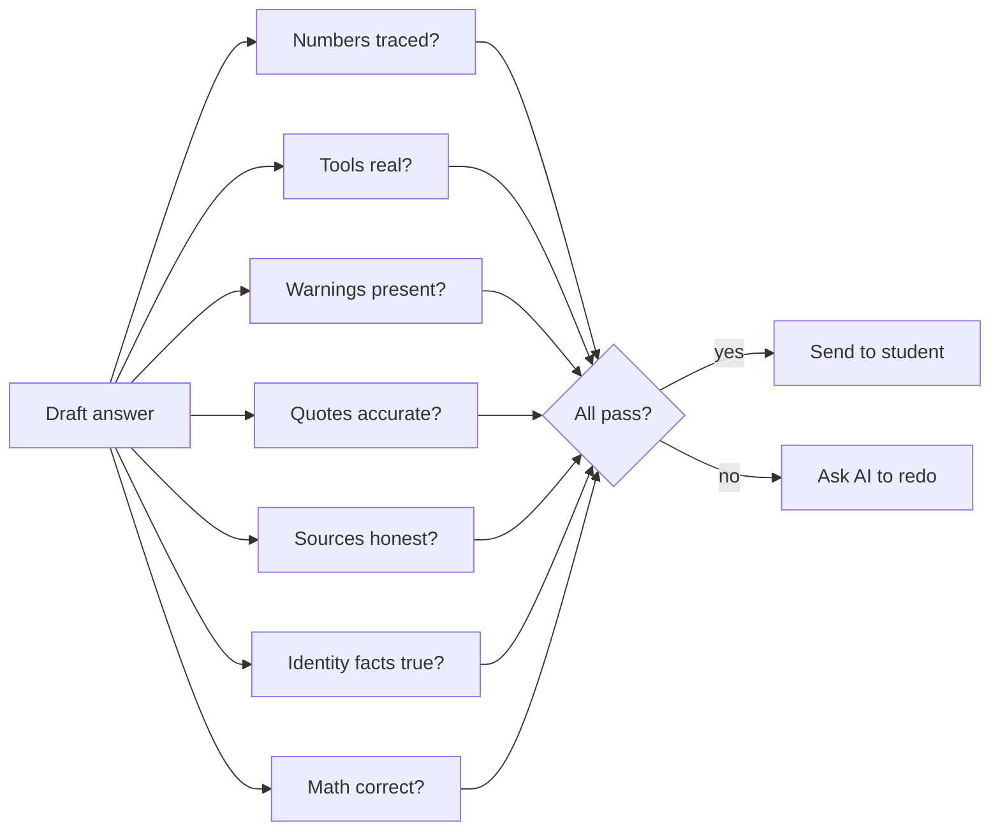
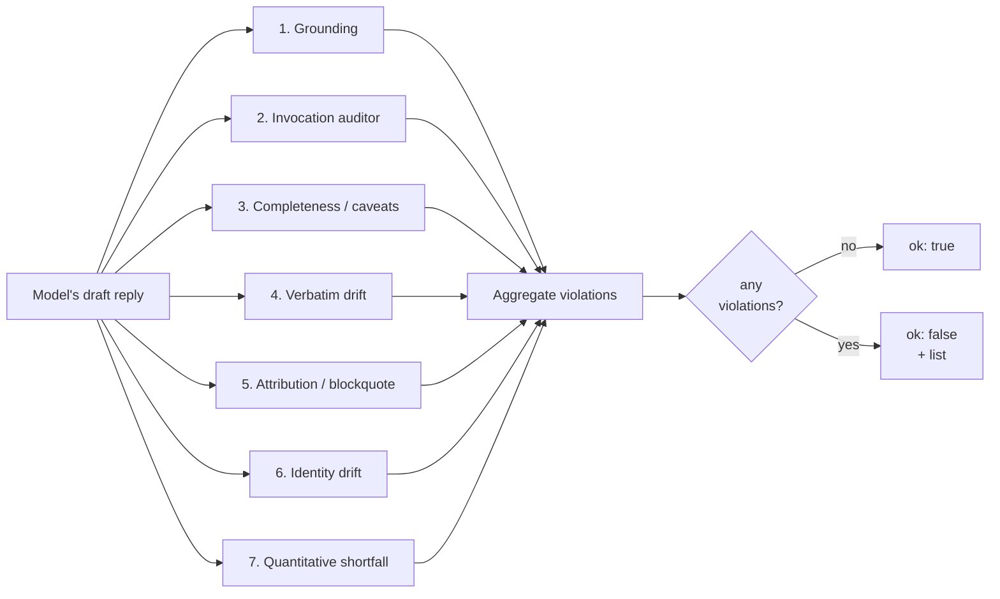

# Response Validator

> Last verified against code: 2026-06-10 (post planning-engine rebuild, PRs #35-#41).

> **Source files:** `packages/engine/src/agent/responseValidator.ts`, `agent/verifiers/blockquoteAttribution.ts`

## TL;DR

Before any answer reaches the student, it goes through seven safety checks — like a copy editor that catches dangerous mistakes before publication. The first check makes sure every number in the answer actually came from a real lookup this turn (no making things up from training data). The second makes sure the AI didn't claim to have run a tool it never ran. The next checks make sure required warnings weren't dropped, that any quote from a school document matches the real text, that quotes have honest sources (not fabricated bulletins), that the AI didn't invent fake identity facts about the student, and that quantitative answers like "you need X more credits" use real math. If any check fails and the AI has a retry available, the system asks the AI to redo the answer with notes on what to fix. None of these checks involves another AI call — they're all fast, deterministic code.



---

This is the structural gate every final reply passes through before the user sees it. It is **pure** — no LLM call. It consumes the model's draft text, the list of `ToolInvocation`s from this turn, and a small slice of session context, and returns either `{ ok: true }` or a list of typed `Violation`s.

When a violation fires *and* the agent loop has any replay budget left, the loop appends a system message describing the violations and asks the model to redo the reply (see [`agent-loop.md`](agent-loop.md) §4). If the budget is exhausted, the reply goes out *with* the violations and the chat layer can still surface them.

There are **seven** validators. All run on every reply; the final verdict is the union of their violations.

---

## 1. The seven validators at a glance



The function name on each is internal: `checkGrounding`, `checkInvocations`, `checkCompleteness`, `checkVerbatim`, `checkAttribution` (delegates to `verifyBlockquoteAttribution`), `checkIdentityDrift`, `checkQuantitativeShortfall`. The public entry point is `validateResponse(ctx) → ValidatorVerdict`.

---

## 2. Violation kinds

```
ungrounded_number          — a number in the reply isn't backed by any tool result this turn
missing_invocation         — claim made that required a specific tool, and the tool wasn't called
missing_caveat             — required disclaimer not included
verbatim_drift             — semi-hardened tool's required verbatim text not preserved
fabricated_attribution     — blockquote attributed to "the bulletin" but not in any search_policy chunk
identity_drift             — agent told the user to "call me" / "email me" (it isn't a separate entity)
quantitative_shortfall     — user asked for N units, agent delivered fewer and didn't acknowledge
incompleteness             — never emitted by validateResponse itself; the v2 chat route reuses
                             this kind for completeness-reviewer failures, but the reviewer is
                             dead in production (always passes), so it never actually fires. See
                             completeness-reviewer.md.
```

---

## 3. Validator 1 — Grounding (the Cardinal Rule)

> **Rule:** every "claim number" in the reply must appear verbatim in a tool result this turn, or in the user's question, or be expressible as `a ± b` for two grounded numbers within ε = 1e-9.

### What counts as a claim number

Walked by `extractClaimNumbers(text)`:

- **All decimals** (e.g., `3.402`, `0.5`) are always claims.
- **Integers** are claims **only when** they are immediately followed (within the next 25 characters) by a unit keyword from this allow-list:

```
credit, credits, credit-hour(s)
gpa, average, mean
course, courses
rule, rules, requirement, requirements
semester, semesters, term, terms
%, percent
deadline, deadlines, date, dates, due, by
application, applications, year, years, ay
```

This is intentionally conservative. Integers without a unit context (the `1` in "step 1") aren't claims; integers next to a unit ("12 credits") are.

### What counts as grounded

The grounding corpus is concatenated from:
- Every invocation's `summary` (lowercased)
- Every invocation's `args` (JSON-stringified, lowercased)
- The user's last message (lowercased, if `ctx.userQuestion` is provided)

A claim is grounded if:
1. The claim string appears as a substring of the corpus, **or**
2. There exist two numbers `a, b` extracted from the same corpus such that `|a + b − claim| < 1e-9` or `|a − b − claim| < 1e-9`.

Numbers are extracted with the regex `-?\d+(?:\.\d+)?`, so negatives are included.

### Tier-2 estimate exemption (improvement plan, Phase D)

A reasoned **integer** count that isn't grounded by the rule above is **exempt** when ALL hold:
1. a **Tier-2 estimate tool** ran this turn with a non-high-confidence / estimate result — i.e. an invocation of `search_policy`, `get_program_requirements`, or `what_if_audit` (the exact `TIER2_ESTIMATE_TOOLS` set, `responseValidator.ts:192-196`) whose summary matches `confidence[:=](low|medium|uncertain)`, `(low|medium) confidence`, `POLICY UNCERTAINTY`, or `(estimate` (the `TIER2_LOW_CONF_RE`);
2. the claim is **explicitly hedged** in the reply — immediately preceded by `about` / `approximately` / `roughly` / `around` / `estimated?` / `ballpark` / `on the order of` / `~`;
3. the claim is an **integer** — decimals (GPAs, percentages) are **never** exempt.

This lets a Tier-2 answer ship a labeled estimate ("per the bulletin, about 5 requirements remain") that the agent reasoned from cited text but that isn't verbatim in the tool summary, **without** weakening Tier-1: DPR-grade numbers (from `run_full_audit`) aren't hedged and aren't backed by a Tier-2 estimate tool, so they stay hard-grounded. The exemption **interlocks** with the `low_confidence_consult_adviser` caveat (§5): an exempt estimate that omits the consult-adviser caveat still fails completeness — so an ungroundable number can only ship when it is hedged **and** cited **and** adviser-caveated.

### Why the ε comparison

Strict equality would fail for things like `0.1 + 0.2 ≠ 0.3` in IEEE-754, which would falsely flag GPA-delta claims like "your GPA rises by 0.3 (3.1 → 3.4)". Using ε = 1e-9 sidesteps this without permitting arbitrary numbers.

### Violation shape

```
{ kind: "ungrounded_number", number: "<claim>", detail: "Number 'X' appears in the reply but does not appear verbatim in any tool result this turn, nor is it a sum or difference of two grounded numbers. Either call the tool that returns it or remove the claim." }
```

---

## 4. Validator 2 — Invocation auditor

> **Rule:** when the reply makes a claim from a specific category, the agent must have called at least one tool from that category's allowed set this turn.

The rules live in `INVOCATION_RULES`. Each rule has:
- `triggers`: regexes that fire on the reply text
- `requiresAnyOf`: tool names that, if called, satisfy the rule
- `description`: text used for the violation detail

### The rules

| Trigger pattern (any match fires) | Required (any-of) | Why |
|---|---|---|
| `your gpa is` / `cumulative gpa is` / `you have a <digit>` | `run_full_audit` | GPA/credit claims need the audit tool. |
| `remaining requirements?` / `unmet rules?` / `you (still) need to take` | `run_full_audit` | Unmet-requirement language must come from the audit. |
| `next semester … take|enroll|register` / `plan(ning)? … fall|spring|summer` | `plan_forward_degree`, `view_forward_plan` | Planning recommendations need the forward planner. (The legacy `plan_semester` was removed; these two are the only planning tools.) |
| `internal[- ]transfer` / `transfer to cas|stern|tandon|tisch|steinhardt` / `switch (my )?school` | `search_policy` | Transfer claims must be grounded in a bulletin retrieval. The authored `check_transfer_eligibility` tool was **removed** (pure-RAG decommission); `search_policy` over the internal-transfer pages is now the grounding source. |
| `what if` / `compar(e\|ing) … vs|to|with` / `if i (added|switched|dropped)` | `what_if_audit`, `propose_plan_change`, `simulate_alternatives` | Hypothetical / what-if claims need the appropriate hypothetical tool. |
| `policy/catalog/bulletin says|states|requires|notes|specifies` / `nyu (requires|allows|prohibits|mandates)` / `p/f, pass/fail, withdraw(al), residency, overload, repeat …(rule|policy|limit)` / `according to (the )?policy|catalog|bulletin` | `search_policy` | Policy assertions must be sourced via the RAG corpus. |

### Negation guard

Before a trigger fires, the validator scans the 30 characters before the matched phrase for a negation marker (`not`, `isn't`, `aren't`, `never`, `no longer`, `rather than`, `NOT`). If a negation is present, the trigger is **skipped**. This prevents replies like *"this is NOT an internal transfer"* from being forced to call `search_policy`.

### Violation shape

```
{ kind: "missing_invocation", detail: "<rule description>" }
```

---

## 5. Validator 3 — Completeness / caveats

> **Rule:** when a caveat's trigger conditions are met (both a session condition AND a reply pattern), the reply must contain certain substrings.

The rules live in `CAVEAT_RULES`.

### The rules

| Caveat id | Session trigger | Reply pattern (any-of fires) | Required substrings (all must be present) | Why |
|---|---|---|---|---|
| `f1_visa` | `student.visaStatus === "f1"` | `(credit load\|semester credits\|withdraw(al)?\|part-time\|full-time)` OR `\b\d{1,2}\s+credits\s+(this\|per\|next)\s+(term\|semester)\b` OR `(drop(ping)?\|leave\|leaving\|reduce(d)?\|reducing\|enroll(ing\|ed)?)…\d{1,2}\s+credits` | `\bf-?1\b` | F-1 students need an explicit F-1 mention whenever the agent discusses credit load, withdrawal, or part-time/full-time status. |
| `internal_transfer_gpa_note` | always | `internal transfer` / `transfer (to\|into) (cas\|stern\|tandon\|tisch\|steinhardt)` | `\bgpa\b` AND `(not published\|aren't published\|isn't published\|do(es)?n't (publish\|disclose)\|not (public\|disclosed))` | Internal-transfer replies must note that GPA thresholds are not published. |
| `low_confidence_consult_adviser` | any **Tier-2 estimate tool** (`search_policy`, `get_program_requirements`, `what_if_audit`) returned a non-high-confidence / estimate result this turn — summary matches `confidence[:=](low\|medium\|uncertain)`, `(low\|medium) confidence`, `POLICY UNCERTAINTY`, or `(estimate` (Phase D generalized this from search_policy-only) | any reply | `(adviser\|advisor\|consult)` | When a Tier-2 lookup was low/medium confidence (or an estimate), the reply must direct the student to consult their adviser. Also the interlock for the grounding exemption (§3). |

The same negation guard from §4 applies to the reply pattern.

### Violation shape

```
{ kind: "missing_caveat", caveatId: "f1_visa" | "internal_transfer_gpa_note" | "low_confidence_consult_adviser", detail: "<rule description>" }
```

---

## 6. Validator 4 — Verbatim drift

> **Rule:** when a tool result this turn carries `verbatimText` (i.e. the tool's `outputMode === "semi_hardened"`), the reply must include that text — or, if not, must at minimum quote any number from it *with* a nearby attribution noun.

The **semi_hardened** tools — the ones that emit `verbatimText` — are exactly three: `get_credit_caps` (`getCreditCaps.ts:38`), `run_full_audit` (`runFullAudit.ts:172`), and `what_if_audit` (`whatIfAudit.ts:61`). **The source comment at `responseValidator.ts:530-534` claiming "currently get_credit_caps + run_full_audit" is stale — it omits `what_if_audit`.** `verbatimText` is populated in the agent loop only when `tool.outputMode === "semi_hardened"` and the tool defines `extractVerbatim` (`agentLoop.ts:576-584`); this validator just consumes whatever landed on each invocation.

### Algorithm

For each invocation with a `verbatimText`:

1. Normalize both reply and verbatim text by collapsing whitespace.
2. **Case-insensitive substring match** — if the lowercase reply contains the lowercase verbatim, the verbatim is satisfied. Continue.
3. **Numeric-overlap layer.** Extract numbers from the verbatim. For each number that also appears in the reply, check the 60-char window around the number in the reply for an attribution noun: `dpr`, `degree progress report`, `audit`, `transcript`, `albert`, `registrar`, `bulletin`, `tool`, `gpa( breakdown)?`. If at least one number appears AND all such numbers are nearby attributions → treat as satisfied. If numbers appear but at least one lacks attribution → fire `verbatim_drift`.
4. **No-number-no-keyword skip** (only when `ctx.userQuestion` is set). If the reply shares no numbers AND no keywords (length ≥ 3) with the user's question, the verbatim is irrelevant to this answer — skip the violation.
5. **Conservative fallback** — if `ctx.userQuestion` is undefined (legacy callers, unit tests), always fire when neither substring nor numeric-overlap path matched.

### Why these layers

The validator must catch true drift (paraphrasing around the verbatim text) without firing on every reply that touches a different topic than what the verbatim covers. The numeric-overlap layer is the strongest signal of drift; the keyword overlap is the weakest, used to avoid noisy false positives.

### Violation shape

```
{ kind: "verbatim_drift", detail: "Tool 'X' returned verbatim text the reply must quote unchanged, but the reply [does not contain it | paraphrased it]. Required text: ..." }
```

---

## 7. Validator 5 — Blockquote attribution

> **Rule:** every blockquote or attributed quote in the reply must be grounded in at least one `search_policy` (or `what_if_audit`) chunk this turn.

This validator lives in its own file (`agent/verifiers/blockquoteAttribution.ts`) and is invoked by `responseValidator.ts:checkAttribution`.

### Quote extraction

`extractQuotes` finds three quote shapes:

1. **Markdown blockquotes** — lines starting with `>`, with consecutive `>` lines collapsed into one quote (if they're within 200 chars of each other).
2. **Italicized quotes** — `*"..."*` or `_"..."_` with content ≥ 15 chars.
3. **Bare double-quoted strings** — `"..."` with content 25–500 chars, **only if** an attribution phrase is within ±80 chars: `(the (CAS )?bulletin|CAS bulletin|the policy|per the (CAS )?bulletin|according to (the )?bulletin|§ <Section>|the catalog|NYU bulletin)`.

Quotes whose ranges sit inside a blockquote's range are deduplicated (the blockquote takes precedence).

### Attribution lookup

For each quote, scan the 200 chars before and 80 chars after the quote position for an attribution phrase. Prefer the **last attribution before** the quote (the one that introduced it). If no attribution exists and the quote is a blockquote or bare quote, skip — that's the agent's own framing, not a citation. Italic quotes are always verified even without nearby attribution.

### Grounding check

For each verified quote, normalize (smart-quote → straight, em-dash → hyphen, lowercase, collapse whitespace), then:

1. **Strict substring path** — if any `search_policy` or `what_if_audit` summary contains the normalized quote, it's grounded.
2. **Long-quote partial path** — for quotes > 120 chars, also try every contiguous 100-char window (stepping by 40 chars).
3. **Token-window path** — split the normalized quote into tokens of length ≥ 4. Slide a 6-token window over them. If any window appears verbatim in any summary, it's grounded.

If none of those match, the quote is fabricated.

### Violation shape

```
{ kind: "fabricated_attribution", detail: "Blockquote attributed to '...' was not found in any of the N search_policy result(s) this turn. Either re-run search_policy with a query that surfaces the source, or rephrase without the verbatim attribution. Quote: ..." }
```

---

## 8. Validator 6 — Identity drift

> **Rule:** the agent must never tell the user to contact it. It is the assistant; there's no separate entity to "call" / "email" / "reply to".

A single regex check:

```
\b(?:call|email|message|contact|text|reach)\s+(?:back\s+)?(?:to\s+)?(?:me|us)\b
| \breply\s+(?:back\s+)?(?:to\s+)?(?:me|us)\b
```

If the reply contains "email me" / "call me" / "reply back to me" etc., the violation fires. Pronouns are restricted to `me|us` so "call OGS" and "email your adviser" pass through.

### Violation shape

```
{ kind: "identity_drift", detail: "Identity drift: assistant referred to itself as a contactable third party with the phrase 'X'. The agent is the assistant — there is nothing for the user to 'contact'. Rephrase as a direct first-person commitment ('I'll suggest electives in the next message') or as a concrete tool the user can take action on." }
```

---

## 9. Validator 7 — Quantitative shortfall

> **Rule:** when the user asks for N <unit>, and the agent's reply contains a smaller delivered count for the same unit, the agent must explicitly acknowledge the shortfall.

### Algorithm

1. Extract `(number, unit)` pairs from `ctx.userQuestion` matching `\b(\d+)\s+(?:[a-z]+\s+)?(credits?|courses?|electives?|units?|classes)\b` (singularized).
2. If any pair was extracted, check whether the reply contains any shortfall acknowledgement:

```
could not fill
below the requested
short of the requested
f-?1 floor
credit ceiling
less than (the )?requested
unable to (fill|reach) the (requested )?(target|amount)
```

3. If yes, exit clean.
4. Otherwise for each requested `(N, unit)`, find the highest delivered count for the same unit in the reply (`\b(\d+)\s+<unit>s?\b`). If `0 < highest < N`, fire a violation.

### Violation shape

```
{ kind: "quantitative_shortfall", detail: "User requested N <unit>; assistant delivered M. Either deliver the full request, or explicitly acknowledge the shortfall ('could not fill', 'below the requested N', etc.) and explain why. Do not punt with a clarifying question after a partial delivery." }
```

---

## 10. The validator context

```
ValidatorContext = {
  assistantText: string,        // the model's draft this turn
  invocations: ToolInvocation[],// every tool the model called this turn
  student?: StudentProfile,     // gates the F-1 caveat rule
  transferIntent?: boolean,     // currently unread by any rule; kept for forward use
  userQuestion?: string,        // last user message, used by verbatim's F4c skip + shortfall check
}
```

The agent loop wires this in via the `validateResponse` callback passed to `runAgentTurnStreaming`. The web chat route in `apps/web/app/api/chat/v2/route.ts` constructs the context per turn.

---

## 11. Where the validator does NOT police

- It does not check tool *call* correctness (input shape, semantic appropriateness). That is each tool's `validateInput` and the model's own routing.
- It does not check spelling, grammar, or tone.
- It does not call the LLM. Every rule is regex / substring / set lookup.
- It does not enforce that *every* claim is grounded — only "claim numbers" as defined above. Words like "you're on track" or "this is fine" can be made without grounding, by design.
- It does not block reply delivery on its own. The agent loop owns the replay budget and final return.

### Known limitation — plan-shaped claims are not checked against the engine plan

The grounding validator (§3) only verifies that **numbers** trace to a tool summary, args, the user question, or an `a±b` derivation. It has **no check that a plan-shaped claim — "you'll take CSCI-UA 310 in Fall 2026", "MATH-UA 121 is in your second semester" — actually matches the term placement the forward planner produced in `session.forwardSchedule`.** Course codes and term labels are strings, not "claim numbers", so the agent can mis-state which course lands in which term (or invent a placement the planner never made) and no validator fires. This is a known **Phase-3 gap**: the post-rebuild planner (`finalizeForwardSchedule` → 7-axis `runGraduationPathValidator`) is the authority on the plan itself, but the *response* validator does not cross-check the agent's prose against that authoritative plan. Closing it would mean a new validator that diffs the reply's stated placements against the stored schedule.
