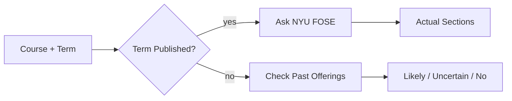
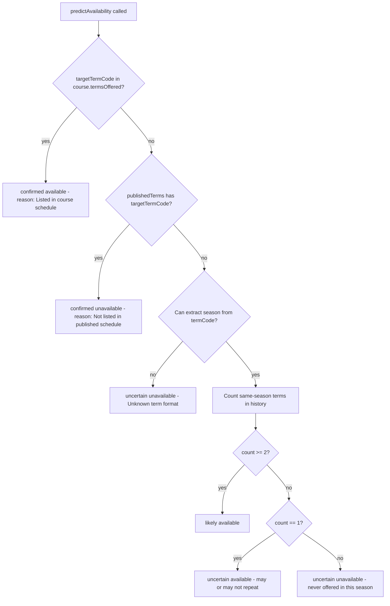

# Class Search and Availability Prediction

## TL;DR

NYU has a public class-search system called FOSE, and this subsystem talks to it. When the app needs to know "what sections of CSCI-UA 101 are offered this fall" or "is this course actually showing up on the published schedule," this module sends the query, parses the response, and hands back the answers. It also tackles a harder question: if the target semester is far enough in the future that NYU hasn't released the schedule yet, will the course probably be offered then? It looks at the course's history of past offerings; if the same season shows up multiple times in history, it predicts "likely available," if it shows up once, "uncertain," and if never, "probably not." Once NYU publishes the actual schedule, predictions get upgraded to confirmations.

---

## Purpose

Two modules under the search and api directories cover everything related to "is this course offered in this term":

- `nyuClassSearch.ts` is the live HTTP client for NYU's public Leepfrog/FOSE class-search API. It powers any tool that needs current-term sections.
- `availabilityPredictor.ts` answers the harder question: given a course's history of being offered, will it be offered in a *future* term whose schedule is not yet published. It returns a labeled prediction with a confidence level.

## Interface / shape

### nyuClassSearch.ts

Types:

- `FoseSearchResult` — one row from the FOSE search endpoint. Fields: `key`, `code`, `title`, `crn`, `srcdb`, `stat`, optional `schd`, optional `no`, optional `meets`, optional `meetingTimes` (JSON-string array), optional deprecated `hours`, optional `instr`, optional `credits` (nyuClassSearch.ts:24-63).
- `FoseSearchResponse` — `{ results, totalCount, srcdb }`.
- `FoseDetailResponse` — open-shape detail object with optional `description`, `clssnotes`, legacy `classnotes`, `hours_html`, `hours`, `registration_restrictions`, plus index signature for raw passthrough.
- `TermOption` — `{ code, label, year, term }` where term is `spring` / `summer` / `fall`.

Functions:

| Function | Shape | Notes |
|---|---|---|
| `generateTermCode(year, term)` | `(number, 'spring' \| 'summer' \| 'fall') -> string` | Delegates to `encodeFoseTerm` from the data layer. |
| `getRecentTermOptions()` | `() -> TermOption[]` | Returns one TermOption per (year, season) for the prior, current, and next calendar year. |
| `searchCourses(termCode, keyword)` | `(string, string) -> Promise<FoseSearchResult[]>` | Posts to the FOSE search endpoint. |
| `getCourseDetails(termCode, crn)` | `(string, string) -> Promise<FoseDetailResponse>` | Posts to the FOSE details endpoint with key `crn:${crn}`. |
| `fetchTermCourses(termCode)` | `(string) -> Promise<{ csci, math }>` | Convenience: runs two `searchCourses` calls in parallel for `CSCI-UA` and `MATH-UA`. |
| `extractAvailableCourseIds(results)` | `(FoseSearchResult[]) -> string[]` | Keeps only `stat === 'O'` or `stat === 'W'`, dedupes by course code. |
| `extractAllCourseIds(results)` | `(FoseSearchResult[]) -> string[]` | Dedupes every course code in the result set regardless of enrollment status. |

The FOSE API base is `https://bulletins.nyu.edu/class-search/api/` (nyuClassSearch.ts:144).

### availabilityPredictor.ts

Types:

- `AvailabilityConfidence` — string union: `confirmed` / `likely` / `uncertain`.
- `AvailabilityResult` — `{ courseId, available: boolean, confidence, reason: string }`.
- `CatalogEntryWithTerms` — `{ courseId, termsOffered: string[] }` — the input shape: a course plus the historical FOSE term codes it appeared in.

Functions:

| Function | Shape | Notes |
|---|---|---|
| `isTermPublished(termCode)` | `(string) -> Promise<boolean>` | Probes FOSE with a `CSCI-UA` keyword query for the term. Returns true iff the response's `count > 0`. Network or parse errors return `false`. |
| `predictAvailability(course, targetTermCode, publishedTerms?)` | returns `AvailabilityResult` | Pure function. The decision tree is described below. |
| `predictAvailabilityBatch(courses, targetTermCode, publishedTerms?)` | returns `Map<string, AvailabilityResult>` | Loops `predictAvailability` over a list of courses. |

A private helper `getSeason(termCode)` returns `spring` / `summer` / `fall` / `null` based on the *last digit* of the term code: `4` = spring, `6` = summer, `8` = fall (availabilityPredictor.ts:31-37).

## Algorithm / behavior

### Live FOSE search

`searchCourses` POSTs to `?page=fose&route=search` with JSON body `{ other: { srcdb: termCode }, criteria: [{ field: 'keyword', value: keyword }] }`. On non-2xx it throws `Error('FOSE search failed: ...')`. On success it returns `data.results ?? []` (nyuClassSearch.ts:153-175).

`getCourseDetails` POSTs to `?page=fose&route=details` with body `{ srcdb, key: 'crn:' + crn }`. On non-2xx it throws (nyuClassSearch.ts:184-203).

`fetchTermCourses` runs `searchCourses(termCode, 'CSCI-UA')` and `searchCourses(termCode, 'MATH-UA')` in `Promise.all` and returns `{ csci, math }` (nyuClassSearch.ts:212-222).

`extractAvailableCourseIds` filters to `stat === 'O'` (open) or `stat === 'W'` (waitlist), then walks once with a `Set<string>` to dedupe by `code` (nyuClassSearch.ts:228-239). `extractAllCourseIds` is the same dedupe walk without the status filter.

### Term-code year window

`getRecentTermOptions` walks `year` from `currentYear - 1` to `currentYear + 1` inclusive, and for each year emits one TermOption per season in the order spring, summer, fall (nyuClassSearch.ts:125-142).

### Availability prediction

The prediction tree in `predictAvailability` (availabilityPredictor.ts:73-138):

The `publishedTerms` argument is the differentiator between "we don't know if FOSE has data for this term" and "FOSE has the data and the course is not in it". When `publishedTerms.has(targetTermCode)` is true, missing-from-`termsOffered` is upgraded from "uncertain" to a confirmed unavailability.

The same-season filter uses `getSeason(termCode)` to compare seasons (so `1254` and `1244` both classify as spring). The count thresholds (`>= 2` → likely; `1` → uncertain available; `0` → uncertain unavailable) are hard-coded.

### Probing whether a term is published

`isTermPublished` posts a `CSCI-UA` keyword search to the term and reads `count`. Any positive count signals the term's schedule has been released by FOSE. Network errors or non-OK responses are treated as "not published" — the function returns `false` and the caller falls back to history-based prediction.

## Inputs / outputs

### nyuClassSearch.ts

| Function | Input | Output |
|---|---|---|
| `searchCourses` | `termCode`, `keyword` | `FoseSearchResult[]` or throws on non-2xx |
| `getCourseDetails` | `termCode`, `crn` | `FoseDetailResponse` or throws on non-2xx |
| `fetchTermCourses` | `termCode` | `{ csci: FoseSearchResult[], math: FoseSearchResult[] }` |
| `generateTermCode` | `year`, `term` | FOSE term code string |
| `extractAvailableCourseIds` | `FoseSearchResult[]` | deduped string array of open / waitlisted course codes |
| `extractAllCourseIds` | `FoseSearchResult[]` | deduped string array of every course code |
| `getRecentTermOptions` | none | `TermOption[]` for prior, current, next year × 3 seasons |

### availabilityPredictor.ts

| Function | Input | Output |
|---|---|---|
| `predictAvailability` | `course: { courseId, termsOffered }`, `targetTermCode`, optional `publishedTerms: Set<string>` | `AvailabilityResult` |
| `predictAvailabilityBatch` | course array, target term, optional published set | `Map<courseId, AvailabilityResult>` |
| `isTermPublished` | `termCode` | `Promise<boolean>` |

## Dependencies

- `availabilityPredictor.ts` imports `generateTermCode` from `../api/nyuClassSearch.js`.
- `nyuClassSearch.ts` imports `encodeFoseTerm` from `../data/foseTerm.js`.
- Both modules use the global `fetch` API directly. No HTTP client wrapper, no shared retry layer.

## Edge cases / failure modes

- `isTermPublished` is wrapped in `try / catch` and returns `false` on any throw or non-OK response (availabilityPredictor.ts:43-62). It also returns `false` when `data.count` is `0`.
- `searchCourses` and `getCourseDetails` throw on non-2xx, including the status code and statusText in the message — callers must handle the thrown `Error`.
- `searchCourses` returns `[]` when the response shape lacks `results` (the `data.results ?? []` guard).
- `getSeason` returns `null` for any term code whose last character is not `4`, `6`, or `8`; this propagates to a `uncertain` / `Unknown term format` result.
- `extractAvailableCourseIds` dedupes by course code, which collapses multiple sections of the same course into one entry. Callers that need section-level data should not dedupe.
- The deprecated `hours` field on `FoseSearchResult` is retained because legacy callers still read it; in practice FOSE never returns it (nyuClassSearch.ts:50-58).
- `getRecentTermOptions` is purely a calendar-year sweep; it has no awareness of whether a term has been published. To check publication, the caller pipes the resulting codes through `isTermPublished`.

## Where it's consumed

- `nyuClassSearch.ts` is the canonical FOSE client used by every tool that asks "what sections of X are on the schedule" — the search-availability tool family and the forward-planner's offered-this-term lookups.
- `availabilityPredictor.ts` is used by planning code that needs to decide whether to slot a future-term course based on the catalog's `termsOffered` history. The optional `publishedTerms` parameter lets a caller upgrade predictions to confirmations once FOSE has published the term.
- `extractAvailableCourseIds` and `extractAllCourseIds` are post-processing helpers for the search tool output that feeds into validation and presentation layers.
