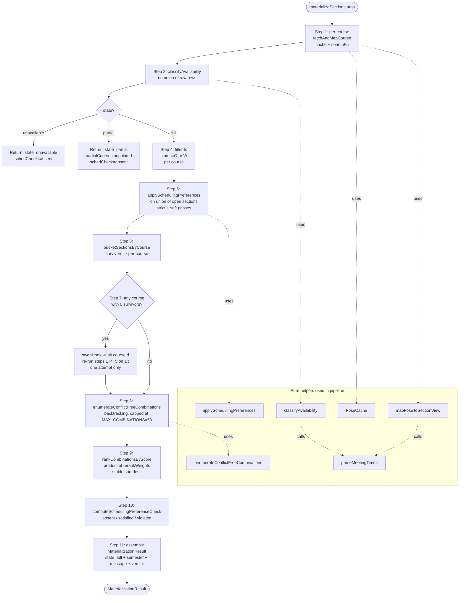

# Section Materialization Subsystem

> Last verified against code: 2026-06-19 (re-verified during the FOSE-prep audit — no drift; `MAX_COMBINATIONS=50`, the `swapHook` stub, and the 11-step orchestrator all confirmed against the live `sectionMaterialization/` layer). Prior: 2026-06-10 (post planning-engine rebuild, PRs #35-#41).

## TL;DR

The multi-term planner says "take Intro to CS next fall" but doesn't tell you which lecture, with which professor, meeting at which time. This subsystem bridges that gap. It hits NYU's live class-search to find every section available for each course on your plan, then figures out which combinations of sections actually fit together without scheduling conflicts. Imagine you've got three classes and each has four time slots; this code is the thing that finds every conflict-free pick of one section per course. It also respects student preferences like "no early morning classes" or "keep Fridays open," and if a strict preference wipes out all the sections of a course, it asks the planner for a backup course. NYU only publishes section data about six months ahead of time, so sometimes the answer is "we don't have data yet" — and this subsystem reports that honestly instead of guessing.

---

## 1. Overview

Section materialization is the engine subsystem that turns a structural plan (a list of course IDs for a particular term, e.g. `["CSCI-UA 101", "MATH-UA 121"]` for Fall 2026) into actual, schedulable course sections — each with a Course Registration Number (CRN), an instructor, a concrete meeting pattern (e.g. Mon/Wed 9:30–10:45 AM), and a section identifier.

The structural plan tells you *what* to take; section materialization tells you *which specific sections* you can actually register for, and which combinations of sections fit together without time conflicts.

The subsystem lives under `packages/engine/src/agent/sectionMaterialization/` and is composed of seven internal modules. The orchestrator (`materialize.ts`) is the entry point; the other six are pure helpers it composes in sequence. The two agent-facing tools that drive it — `materialize_sections` (read-only staging) and `confirm_section_combination` (the write) — live in `packages/engine/src/agent/tools/materializeSections.ts` (see [tool-registry](tool-registry.md)).

Data source: NYU's FOSE (Full Online Schedule of Events) search API, accessed through `searchCourses` in `packages/engine/src/api/nyuClassSearch.ts` (the same client documented in [search-availability](search-availability.md)). FOSE only publishes section-level data roughly six months out from the term, so the subsystem has to gracefully report when it has no data, partial data, or full data for the target term.

---

## 2. Types

All shared types live in `packages/engine/src/agent/sectionMaterialization/types.ts`.

### DayOfWeek (`types.ts:16`)
A 7-string union: `"M" | "Tu" | "W" | "Th" | "F" | "Sa" | "Su"`.

### MeetingPattern (`types.ts:24-25`, re-exported from `@nyupath/shared`)
Pseudo-shape:
- `day: DayOfWeek`
- `startMin: number` — minutes since midnight
- `endMin: number` — minutes since midnight

### ParseResult (`types.ts:27-30`)
A discriminated union describing the outcome of parsing FOSE meeting-time strings:
- `{ kind: "ok", patterns: MeetingPattern[] }` — successfully parsed
- `{ kind: "asynchronous" }` — definitive "no meeting time" (online, async, TBA, "Does Not Meet")
- `{ kind: "unparseable", raw: string }` — present but couldn't make sense of it

### SectionView (`types.ts:32-74`)
The materialized view of one FOSE section. Pseudo-shape:
- `courseId: string` — e.g. `"CSCI-UA 421"`
- `title: string`
- `crn: string` — Course Registration Number
- `credits: string` — FOSE returns credits as a string
- `instructor: string` — surfaced verbatim from FOSE `instr`
- `status: string` — `"O"` open, `"W"` waitlist, `"C"` closed, `"A"` pre-reg active
- `meetingPatterns: MeetingPattern[]`
- `isAsynchronous: boolean` — true when patterns is empty AND parser said "asynchronous"
- `rawMeets: string` — original FOSE `meets` string, kept for display/debug
- `meetingTimes?: string` — raw FOSE JSON
- `schd?: string` — section type: `"LEC"`, `"LAB"`, `"RCT"`, `"TUT"`, `"SEM"`, `"IND"`
- `section?: string` — section number from FOSE `no` field (e.g. `"002"`)

### MaterializedSemester (`types.ts:76-100`)
The output bundle when materialization succeeds. Pseudo-shape:
- `term: string` — term code, e.g. `"1268"`
- `courses: Array<{ courseId, title, sections: SectionView[] }>` — per-course section bundles
- `combinations: Array<{ sections: SectionView[], weeklyHours: number }>` — every conflict-free pick, one section per course, capped at MAX_COMBINATIONS
- `combinationsTruncated: boolean` — true when the cap was hit

### AvailabilityState (`types.ts:102`)
A 3-state enum: `"full" | "partial" | "unavailable"`. Reflects how much usable section data FOSE returned for the requested term.

### SchedulingPreferenceCheck (`types.ts:118-121`)
A precomputed verdict the materializer hands to the visa-validator's scheduling axis. Discriminated union:
- `{ kind: "absent" }` — no prefs provided, OR FOSE state is partial/unavailable so there was nothing to verify against
- `{ kind: "satisfied" }` — prefs provided AND at least one combination survives the strict filter
- `{ kind: "violated", reason: string }` — strict pref wiped all sections of some course AND the swap cascade ran out of alternatives

### MaterializationResult (`types.ts:123-145`)
The top-level return shape. Pseudo-shape:
- `state: AvailabilityState`
- `semester?: MaterializedSemester` — populated when `state === "full"`
- `partialCourses?: Array<{ courseId, title, sections: SectionView[] }>` — populated when `state === "partial"`
- `message: string` — always populated, plain-English explanation for the student
- `schedulingPreferenceCheck?: SchedulingPreferenceCheck`

---

## 3. FOSE Cache

`packages/engine/src/agent/sectionMaterialization/foseCache.ts`

A simple TTL cache for raw FOSE query results, deduplicating identical `(termCode, keyword)` lookups across a single materialization run and across rapid successive runs.

- Default TTL: 5 minutes (`DEFAULT_TTL_MS = 5 * 60 * 1000`, `foseCache.ts:15`).
- Key shape: `"${termCode}|${keyword}"` via static `FoseCache.keyFor` (`foseCache.ts:48-50`).
- Storage: an in-memory `Map<string, { value, expiresAt }>` (`foseCache.ts:30`).
- Eviction: lazy — entries are checked for expiry only on `get`. If `now() >= expiresAt`, the entry is deleted and `undefined` returned (`foseCache.ts:60-64`).
- Clock injection: the constructor accepts a `now: () => number` function (`foseCache.ts:39`) so tests can advance time without faking timers.
- `size()` walks the store and counts only non-expired entries (`foseCache.ts:89-98`).

The orchestrator holds a module-level singleton `DEFAULT_CACHE` (`materialize.ts:63`) shared across production calls; tests inject their own `FoseCache` via `MaterializeArgs.cache`.

---

## 4. FOSE Availability Gate

`packages/engine/src/agent/sectionMaterialization/foseAvailabilityGate.ts`

FOSE publishes section-level data on a rolling window — typically not until ~6 months before the term starts. The gate classifies, per call, whether FOSE has enough data to actually materialize sections, by inspecting the response.

`classifyAvailability(sections)` (`foseAvailabilityGate.ts:49-62`) takes a flat array of FOSE rows (the union across all courses for that term) and applies these rules:

| Condition | State |
|-----------|-------|
| `sections.length === 0` | `"unavailable"` |
| `<50%` of sections have a `ParseResult.kind` of `"ok"` or `"asynchronous"` | `"partial"` |
| `>=50%` of sections are parseable | `"full"` |

Key nuance: `"asynchronous"` counts as parseable because it's a *definitive* answer ("this section has no meeting time, it's online/async"), not a data gap. The gate is only trying to distinguish "FOSE knows what's happening" from "FOSE is still loading".

`FoseSection` (`foseAvailabilityGate.ts:30-38`) is the gate's minimal view: just `meets?: string` and `meetingTimes?: string` — both optional because FOSE sometimes omits them. The gate delegates the parseability check to `parseMeetingTimes`.

---

## 5. Parse Meeting Times

`packages/engine/src/agent/sectionMaterialization/parseMeetingTimes.ts`

Turns FOSE's two meeting-time fields into structured `MeetingPattern[]` instances.

### Input fields
- `meets` — human-readable string, e.g. `"MoWeFr 10:00am-11:15am"`, `"TR 8-9:15a"`, `"Does Not Meet"`.
- `meetingTimes` — structured JSON string, e.g. `[{"meet_day":"0","start_time":"930","end_time":"1045"}, ...]`.

### Day index mapping (`parseMeetingTimes.ts:25-33`)
FOSE encodes the day of the week as a string index `"0"`–`"6"`:

| Index | Day |
|-------|-----|
| `"0"` | `M` (Mon) |
| `"1"` | `Tu` (Tue) |
| `"2"` | `W` (Wed) |
| `"3"` | `Th` (Thu) |
| `"4"` | `F` (Fri) |
| `"5"` | `Sa` (Sat) |
| `"6"` | `Su` (Sun) |

### `hhmmToMinutes(s)` (`parseMeetingTimes.ts:50-67`)
Converts a 3-or-4 char 24h time string to minutes since midnight:
- `"800"` → 480 (8:00 AM)
- `"930"` → 570 (9:30 AM)
- `"1045"` → 645 (10:45 AM)
- `"1400"` → 840 (2:00 PM)

Rejects non-digit strings, strings of wrong length, and minute values >=60. Returns `null` on failure.

### `parseMeetingTimes(rawMeets, meetingTimesJson?)` (`parseMeetingTimes.ts:143-160`)
Strategy:

1. If `meetingTimesJson` is present and non-empty, try to parse it as JSON. Each entry must have `meet_day`, `start_time`, `end_time` as strings; `meet_day` must map via `DAY_INDEX_MAP`; both time strings must parse. If everything checks out, return `{ kind: "ok", patterns }`.
2. If the JSON path returns null (empty, `"[]"`, malformed, unknown day index, or bad time), fall back to async detection against `rawMeets`. Async regexes (`parseMeetingTimes.ts:36-43`) match any of: `"Does Not Meet"`, `"asynchronous"`, `"async"`, `"TBA"`, empty/whitespace-only, `"online"`. If matched, return `{ kind: "asynchronous" }`.
3. Otherwise return `{ kind: "unparseable", raw: rawMeets }`.

Note: "Does Not Meet" sections have `meetingTimes: "[]"` AND `meets: "Does Not Meet"`, so the JSON path returns null, and step 2's async detector catches them.

---

## 6. Conflict Detection

`packages/engine/src/agent/sectionMaterialization/conflictDetection.ts`

Pure helpers that decide whether two sections time-conflict, and enumerate every conflict-free combination across a set of courses.

### Interval semantics
Half-open `[startMin, endMin)`. Two patterns conflict iff `a.day === b.day` AND `aStart < bEnd` AND `bStart < aEnd` (`conflictDetection.ts:21-24`). A boundary touch (`aEnd === bStart`) is NOT a conflict — sections that meet back-to-back on the same day are allowed.

### `patternsOverlap(a, b)` (internal, `conflictDetection.ts:21-24`)
The core pairwise overlap check on two `MeetingPattern` instances.

### `conflicts(a, b)` (`conflictDetection.ts:30-37`)
True iff ANY pattern in array `a` overlaps ANY pattern in array `b`. Asynchronous sections have empty pattern arrays, so they never conflict with anything.

### `MAX_COMBINATIONS` (`conflictDetection.ts:14`)
`50`. Hard cap on the combination enumeration to prevent combinatorial blowup.

### `enumerateConflictFreeCombinations(courses, cap)` (`conflictDetection.ts:85-140`)
Recursive backtracking algorithm:

- For each course in order, try each section.
- Before recursing, prune: skip any section that conflicts with the already-picked stack.
- A course with zero sections is silently skipped (the resulting combination just doesn't include that course; the orchestrator surfaces this elsewhere).
- When `out.length` hits the cap (default 50), the recursion sets a `hitCap` flag and exits early.

Each emitted combination carries:
- `sections: SectionView[]` — one section per non-empty course.
- `weeklyHours: number` — sum of `(endMin - startMin) / 60` over every pattern in every picked section, rounded to 2 decimal places (`conflictDetection.ts:60-69`).

Returns `{ combinations, truncated }` where `truncated` reflects whether the cap was hit.

---

## 7. Apply Scheduling Preferences

`packages/engine/src/agent/sectionMaterialization/applySchedulingPreferences.ts`

Filters and reranks a flat pool of sections against a `SchedulingPreferences` object (defined in `@nyupath/shared`). Applied to the union of all open sections across all courses in one pass *before* combination enumeration — it's cheaper to filter sections than to filter combinations.

### Two pass model
- **Strict pass** — a `strict: true` entry HARD filters: sections matching the constraint are dropped and recorded in `eliminatedByStrict` with a human-readable reason.
- **Soft pass** — a `strict: false` entry SOFT deboosts: sections matching get a multiplicative penalty in `(0, 1]`. Sections without any soft contribution are omitted from `rerankWeights` (the implicit default is 1.0).

### Preference types supported
From the `SchedulingPreferences` shape (read inline against `applySchedulingPreferences.ts`):

| Preference | Strict effect | Soft effect |
|------------|---------------|-------------|
| `avoidDays[]` (each entry: `{ day, strict }`) | Drop section if any meeting is on that day | Multiply by `AVOID_DAYS_SOFT_PENALTY` (0.7) per match |
| `avoidTimeWindows[]` (`{ days[], startMin, endMin, strict }`) | Drop section if any meeting on those days overlaps the window | Multiply by `AVOID_TIMEWINDOW_SOFT_PENALTY` (0.7) per match |
| `preferTimeWindows[]` (`{ days[], startMin, endMin, weight }`) | (always soft) | Multiply by `PREFER_BOOST_BASE + PREFER_BOOST_PER_WEIGHT * weight` (1.0 + 0.5×weight) per match |
| `desiredFreeDay: { day, strict }` (day may be `"any"`) | Drop section that meets on the resolved free day | n/a |
| `avoidConsecutiveLongBlocks: boolean` | (always soft) | Multiply by `LONG_BLOCK_SOFT_PENALTY` (0.7) if back-to-back chain of >=2 patterns on the same day spans >=180 min |

Constants live at `applySchedulingPreferences.ts:67-73`.

### `desiredFreeDay: "any"` resolution
`resolveDesiredFreeDay` (`applySchedulingPreferences.ts:256-280`) — when the user says "give me any free day", the function picks the weekday Monday–Friday on which the FEWEST sections in the pool meet. Ties broken in favor of earlier weekdays (`M < Tu < W < Th < F`).

### Async sections pass through
Sections with `isAsynchronous: true` have an empty `meetingPatterns` array, so every day/time-based filter is vacuously satisfied — they survive the strict pass and get a soft multiplier of 1.0.

### `isPrefsEmpty(prefs)` (`applySchedulingPreferences.ts:193-201`)
Exported predicate: true when ALL of `avoidDays`, `avoidTimeWindows`, `preferTimeWindows` are empty/undefined AND `desiredFreeDay` is undefined AND `avoidConsecutiveLongBlocks` is falsy. The orchestrator reuses this when computing the `SchedulingPreferenceCheck` verdict so the filter behavior and the verdict agree on what "empty" means.

### `ApplyResult` (`applySchedulingPreferences.ts:29-48`)
Pseudo-shape:
- `surviving: SectionView[]` — sections that passed every strict filter, in input order
- `rerankWeights: Map<string, number>` — keyed by `section.crn`, values are the product of every soft multiplier that applied to that section (omitted when the product is 1.0)
- `eliminatedByStrict: Array<{ sectionId: string, reason: string }>` — one entry per dropped section, where `sectionId` is the CRN

---

## 8. Materialize Pipeline

`packages/engine/src/agent/sectionMaterialization/materialize.ts`

The orchestrator. Composes every other module in this subsystem. Public entry point: `materializeSections(args: MaterializeArgs)` (`materialize.ts:228`).

### `MaterializeArgs` (`materialize.ts:67-94`)
Pseudo-shape:
- `termCode: string` — e.g. `"1268"`
- `courseIds: string[]` — structural plan for that one term
- `swapHook: (failedCourseId, reason) => Promise<string | null>` — callback the structural solver provides; when a course wipes, the orchestrator asks the hook for a structural alternative
- `schedulingPreferences?: SchedulingPreferences` — optional, from `session.schedulePreferences?.schedulingPreferences`
- `searchFn?: (termCode, keyword) => Promise<unknown[]>` — test-injectable; defaults to `searchCourses` from `nyuClassSearch.ts`
- `cache?: FoseCache<unknown[]>` — test-injectable; defaults to the module-level `DEFAULT_CACHE`

### The 11-step pipeline (`materialize.ts:228-448`)

**Step 1 — Per-course fetch + map** (`materialize.ts:241-258`).
For each course ID, call `fetchAndMapCourse` (`materialize.ts:198-219`). That helper:
- Hits the cache via `cache.get(termCode, courseId)`; on miss, calls `searchFn(termCode, courseId)`, populates the cache, and proceeds.
- Filters the raw FOSE rows down to exact-code matches (`r.code === courseId`) — FOSE keyword search is substring, so unrelated rows can leak in.
- Maps each surviving row through `mapFoseToSectionView` (`materialize.ts:104-123`) — pure projection from `FoseSearchResult` to `SectionView`, calling `parseMeetingTimes` along the way.

**Step 2 — Classify availability** (`materialize.ts:260-262`).
Flatten the raw rows across all courses into one array and feed it to `classifyAvailability`.

**Step 3 — State branching** (`materialize.ts:264-293`).
- `state === "unavailable"`: return immediately with a message and `schedulingPreferenceCheck: { kind: "absent" }`.
- `state === "partial"`: return immediately with `partialCourses` populated (so the UI can show what's known so far), the same `"absent"` verdict, and a warning message that registration data isn't fully published yet.
- Otherwise: proceed.

**Step 4 — Open-section filter** (`materialize.ts:295-314`).
For each course, keep only sections with `status === "O"` or `status === "W"` (open or waitlist; the `isOpenStatus` helper at `materialize.ts:222-224`). Track `openCountBeforePrefs` per course so the swap step can later distinguish "no open sections at all" from "strict prefs wiped the open sections".

**Step 5 — Apply scheduling preferences** (`materialize.ts:316-318`).
Flatten all open sections across all courses into one union pool. Call `applySchedulingPreferences(unionOpen, prefs)` once on the union — this returns `{ surviving, rerankWeights, eliminatedByStrict }`.

**Step 6 — Re-bucket survivors** (`materialize.ts:320-324`).
Run `bucketSectionsByCourse` (`materialize.ts:134-145`) to split `applyResult.surviving` back into per-course arrays, preserving the input course order.

**Step 7 — Swap cascade** (`materialize.ts:326-396`).
For each course:
- If it has surviving sections, push it to `finalBundles` and continue.
- Otherwise determine the reason: `"unavailable"` if `openCountBeforePrefs === 0`, else `"scheduling-prefs-eliminated"`.
- Call `swapHook(courseId, reason)`. If it returns null, record a drop and continue.
- If it returns an alternative course ID, re-run steps 1, 4, 5 on the alternative (one attempt only — no recursion).
- If the alt survives, push it to `finalBundles` (the alt's `rerankWeights` are dropped here — see in-code comments at `materialize.ts:356-377` for the deferred Phase-16 audit).
- If the alt also produces zero survivors, record a drop with the alt ID attached.

**Step 8 — Enumerate combinations** (`materialize.ts:398-401`).
Feed `finalBundles` into `enumerateConflictFreeCombinations`. Get back `{ combinations, truncated }`.

**Step 9 — Rank by rerank-weight product** (`materialize.ts:403-412`).
Run `rankCombinationsByScore` (`materialize.ts:170-187`). Each combination's score is the product `Π section.crn → rerankWeights.get(crn) ?? 1` (`scoreCombination`, `materialize.ts:154-163`). Sort descending; ties preserve enumeration order via a decorate-sort-undecorate to guarantee stability.

**Step 10 — Compute the scheduling-preference verdict** (`materialize.ts:414-418`).
`computeSchedulingPreferenceCheck` (`materialize.ts:467-487`):
- Prefs undefined OR empty (via `isPrefsEmpty`) → `{ kind: "absent" }`.
- Any dropped course with `reason === "scheduling-prefs-eliminated"` → `{ kind: "violated", reason: "All sections of {courseId} were eliminated..." }`.
- Otherwise → `{ kind: "satisfied" }`. (No conflict-free combinations existing is NOT a violation — that's a time-conflict issue, not a strict-pref one.)

**Step 11 — Build the result** (`materialize.ts:420-447`).
Assemble the `MaterializationResult` with `state: "full"`, the populated `semester` (term, course bundles, ranked combinations, truncation flag), a message that mentions the count of conflict-free combinations and any dropped courses, and the verdict.

---

## 8b. The two-step tool contract

**File:** `packages/engine/src/agent/tools/materializeSections.ts`

The orchestrator above is driven by a `materialize_sections` / `confirm_section_combination` tool pair that mirrors the `update_profile` / `confirm_profile_update` two-step write (Architecture §7.2).

- **`materialize_sections`** (`isReadOnly: true`) takes a single `targetTerm` (solver format, e.g. `"2026-fall"`), validates that the term exists in `session.forwardSchedule` and is not locked, then builds the FOSE keyword list from **`specific_planned` slots only**. Placeholder slots (no concrete course yet) and `in_progress` (IP) slots are skipped — IP courses are pinned to a CRN in Albert that the DPR doesn't carry, so the tool appends an honest caveat that the proposed combinations can't conflict-check against them. It calls the orchestrator, then **stages** each conflict-free combination into `session.pendingMaterializations` under a deterministic `proposalId` (`prop_<term>_<1-indexed>`) and returns the proposal list. It does **not** mutate the schedule.
- **`confirm_section_combination`** (the write) looks up a `proposalId`, walks the target semester's `specific_planned` slots, and adds the concrete-section fields (`crn`, `meetingPatterns`, `instructor`, `schd`, `sectionNumber`) in-place. The pending entry is consumed on success, so confirming the same id twice is rejected.

> **Known limitation — swap cascade is stubbed at the tool layer.** The orchestrator's Step-7 swap cascade is fully implemented, but the `swapHook` the `materialize_sections` tool passes in always returns `null` (`materializeSections.ts:198-201`). Wiring it into the structural solver's swap path is deferred (marked Phase 16 in-code). In practice this means a wiped course surfaces cleanly in the result's `dropped` list with no alternative offered.

---

## 9. Pipeline diagram

