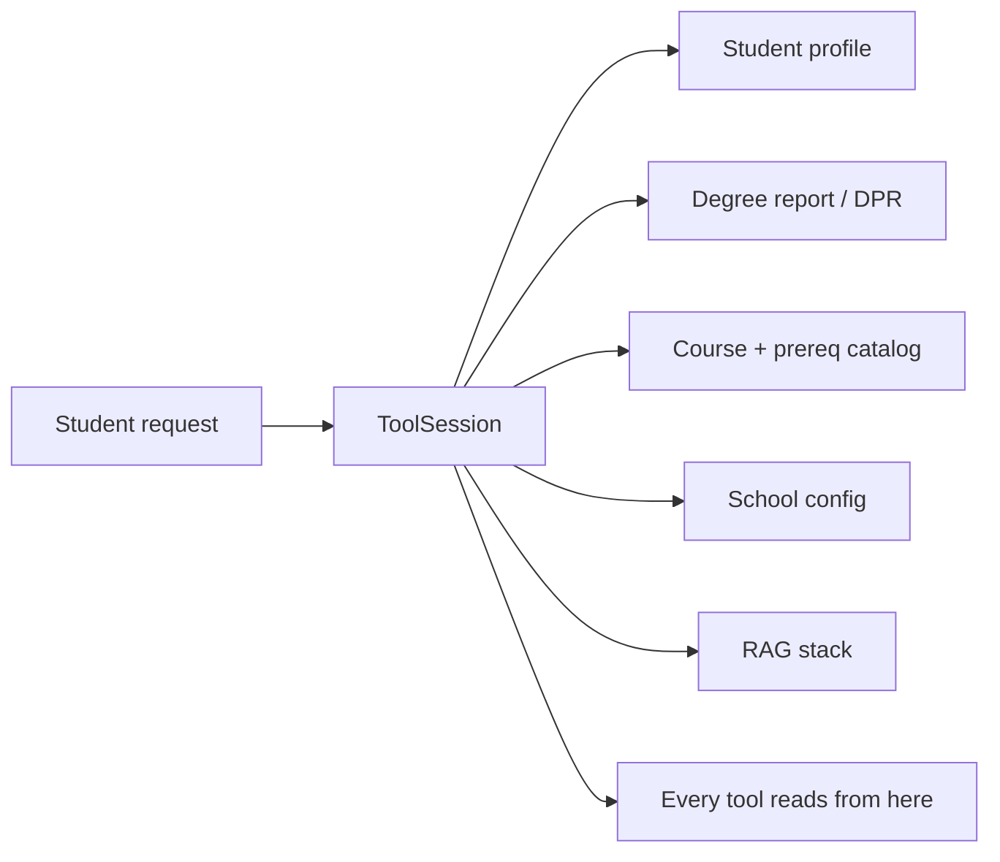

# Session State (`ToolSession`)

> Last verified against code: 2026-06-10 (post planning-engine rebuild, PRs #35-#41).

> **Source file:** `packages/engine/src/agent/tool.ts` (the `ToolSession` interface).

## Purpose

When a student sends a message, the web layer assembles a folder of everything that might be relevant — who the student is, their parsed degree report, the course + prereq catalog, the home school's policy config, the RAG retrieval stack, and the persistence handles. This `ToolSession` folder rides along with every tool call during the turn, so any tool can reach in for the student's data without re-loading. Some tools also drop things into the folder for a later step — `update_profile` stages a pending change that `confirm_profile_update` reads and applies. The folder is fresh per request and lives only in memory; durable saving is the route layer's job.



---

The `ToolSession` is the **shared state object** that flows through every tool invocation in a turn. It is built by the web layer per request (the chat route's session literal, `apps/web/app/api/chat/v2/route.ts:256-278`), passed into the agent loop, and read (and sometimes mutated) by tools. It is in-memory only — persistence is a separate concern owned by the route layer.

---

## 1. The fields

The interface is defined at `agent/tool.ts:39-187`. Every field is optional.

### Identity / profile
- **`student?: StudentProfile`** (tool.ts:41) — the active student. Many tools require it. Built by `apps/web/lib/buildSession.ts` (`buildStudentProfileFromDpr`) from the parsed DPR, with optional onboarding overrides for visa status and home school.
- **`degreeProgressReport?: DegreeProgressReport`** (tool.ts:82) — parsed Albert DPR. The **authoritative tier-1 source** of the student's coursework, standing, and program requirements. Read by `run_full_audit`, `plan_forward_degree`, `what_if_audit`, `get_academic_standing`, `get_credit_caps`, the forward-schedule subsystem, and most planners. Written by the chat route from the onboarding/refresh DPR parse. **Mandatory for every personal tool** (see the DPR-first box below).

> **DPR-first doctrine.** The DPR is tier 1 (authoritative); bulletin RAG is tier 2 (cited, hedged). Every **personal** tool (anything that answers a question about the student's own record) hard-refuses in its `validateInput` when `session.degreeProgressReport` is absent, returning a "please upload your DPR" `userMessage`. The personal tools that enforce this include `run_full_audit`, `what_if_audit`, `get_academic_standing`, `plan_forward_degree`, and the plan-change family. **Impersonal** tools stay DPR-free at the tool level: `search_policy`, `search_courses`, `search_availability`, `update_profile`, `confirm_profile_update`. (`get_credit_caps` reads the DPR opportunistically when present but does not require it.)
>
> The old unofficial-transcript upload path is gone — the DPR is the only source of the student's coursework.

### Catalog data
- **`courses?: Course[]`** (tool.ts:43) — full course catalog. **The production chat route DOES set this** — `apps/web/app/api/chat/v2/route.ts:272` attaches `catalog.courses` from `getCatalog()` (module-cached `loadCourses()`, `apps/web/lib/loadCatalog.ts`). The forward planner reads course titles/credits from it.
- **`prereqs?: Prerequisite[]`** (tool.ts:44) — prereq + coreq groups per course. **Also set** by the chat route at line 272 (`catalog.prereqs`).
- **`schoolConfig?: SchoolConfig | null`** (tool.ts:45) — per-school numeric config. Loaded from `data/schools/<school>.json` via `loadSchoolConfig(student.homeSchool)` (route.ts:238-244, attached at 271). All **11 school configs** exist today (`cas`, `gallatin`, `liberal_studies`, `nursing`, `nyuad`, `shanghai`, `sps`, `steinhardt`, `stern`, `tandon`, `tisch`) — a student in any of them gets a real config; an unrecognized school gets `null` and tools fall back to the shared defaults in `data/schoolDefaults.ts`. See [data-loaders.md](./data-loaders.md) §3a.

> **There is no `programs` field anymore.** The pre-rebuild `ToolSession` carried `programs?: Map<string, Program>` for a deterministic per-program rule engine. That field and the rule engine are **gone**. The planner and audit now read program requirements from the DPR (`degreeProgressReport`) and the bulletin RAG corpus. Any older doc describing a `programs`-not-wired "data gap" is describing a field that no longer exists.

### User intent
- **`transferIntent?: boolean`** (tool.ts:47) — true when the user is exploring a transfer. Toggles a system-prompt line and some template applicability checks. (Note: the `check_transfer_eligibility` tool that once consumed this is removed; the flag survives as a prompt signal.)
- **`lastUserMessage?: string`** (tool.ts:55) — the latest user message text. Threaded by the route (`route.ts:270`) so tools' `validateInput` can apply scope guards. When unset, scope guards no-op.

### Mutation staging
- **`pendingMutations?: Map<string, PendingProfileMutation>`** (tool.ts:62) — keyed by stable id. Written by `update_profile.call`; read + applied + cleared by `confirm_profile_update`. Two-step contract: `update_profile` never mutates the profile directly. A `PendingProfileMutation` (tool.ts:29-37) carries `id`, `field` (one of `homeSchool`, `catalogYear`, `declaredPrograms`, `visaStatus`), `before`, `after`, and a free-form `impacts` array.
- **`pendingMaterializations?: Map<string, { termCode, sections }>`** (tool.ts:153-159) — keyed by `proposalId`. Written by `materialize_sections.call` (one entry per conflict-free combination); read + applied by `confirm_section_combination`. Same two-step contract.

### RAG
- **`rag?: { store, embedder, reranker, confidenceBands? }`** (tool.ts:64-72) — the policy retrieval stack. The chat route builds it once at boot (`getPolicyRagBundle()` from `policyRagSetup.ts`) and attaches it (`route.ts:273`). `search_policy` is the only tool that reads it; if `rag` is absent, `search_policy` fails its `validateInput`.

### Persistence handles (optional)
- **`profileStore?: ProfileStore`** (tool.ts:90) — when present, `confirm_profile_update` writes the post-mutation profile + an audit row. The chat route also writes a bootstrap row here so the DPR/profile survive a refresh. Failures are swallowed.
- **`scheduleStore?: ScheduleStore`** (tool.ts:100) — when present, `plan_forward_degree` and `confirm_plan_change` persist the schedule (and any pref mutation) after a successful call. The `/api/session/restore` route and `planActionOrchestrator.ts` read `loadLatestSchedule` + `loadPreferences` on bootstrap. Failures are swallowed.
- **`chatHistoryStore?: ChatHistoryStore`** (tool.ts:111) — the route owns writes (it has the assistant's final text after the loop). Tools never write here; the field exists so future tools can read prior turns via `loadRecentMessages`.

### Temporal
- **`graduationTarget?: string`** (tool.ts:123) — onboarding-stated target term in display form (e.g. `"Spring 2027"`). Set by the route after normalizing the free-form input (`route.ts:320-331`). `plan_forward_degree` reads it as the default for `graduationTermOverride` when the LLM doesn't pass one.

### Forward-schedule outputs
- **`forwardSchedule?: ForwardSchedule`** (tool.ts:128) — the solved forward plan. Written only when the result state is `"valid-clean"` or `"valid-with-trade-offs"`. Read by `view_forward_plan`, the SSE chat route (sidebar updates), and the forward-schedule subsystem.
- **`studentDraftPlan?: ForwardSchedule`** (tool.ts:134) — draft schedule whose state is `"infeasible-draft"` or `"student-preferred-invalid-draft"`. These never write to `forwardSchedule` so the agent doesn't endorse an illegal plan (Decision #32).
- **`schedulePreferences?: SchedulePreferences`** (tool.ts:142) — student-driven prefs (load styles, pins, exclusions, summer/J-term opt-in, scheduling preferences). Mutated by `confirm_plan_change`; read by `solveForwardSchedule`. In-memory; lost on session end unless `scheduleStore` is configured.

### Section materialization side channel
- **`lastMaterializationResult?`** (tool.ts:176-186) — populated by `materialize_sections.call` as a side effect of staging proposals. Carries the full `MaterializationResult`, `targetTerm`, `proposals` (one `{ proposalId, sections, weeklyHours }` per conflict-free combination), and `computedAt` (epoch ms). The SSE route snapshots `computedAt` before the turn and compares afterward to fire the `forward_materialization_update` event.

> **`searchCoursesFn` is attached as a route-side extension, not an interface field.** The chat route appends `searchCoursesFn` to the session object via an intersection type (`route.ts:274-278: ... as ToolSession & { searchCoursesFn?: ... }`). It is the semantic course-search function injected for `search_courses`. It is not a declared member of the `ToolSession` interface in `tool.ts`.

---

## 2. Who writes what

```mermaid
graph LR
    subgraph Route as Web route (apps/web)
        BS[chat v2 route literal]
    end
    subgraph Boot as Module-cached loaders
        CAT[getCatalog]
        SC[loadSchoolConfig]
        RAGSETUP[policyRagSetup]
    end
    subgraph Tools as Tool calls
        UP[update_profile]
        CPU[confirm_profile_update]
        PFD[plan_forward_degree]
        CPC[confirm_plan_change]
        MS[materialize_sections]
        CSC[confirm_section_combination]
    end

    BS -->|student, lastUserMessage,<br/>graduationTarget,<br/>profileStore, scheduleStore,<br/>chatHistoryStore| ToolSession
    BS -->|degreeProgressReport| ToolSession
    CAT -->|courses, prereqs| ToolSession
    SC -->|schoolConfig| ToolSession
    RAGSETUP -->|rag| ToolSession

    UP -->|pendingMutations[id]| ToolSession
    CPU -->|apply + clear pendingMutations<br/>+ mutate student| ToolSession
    PFD -->|forwardSchedule OR studentDraftPlan| ToolSession
    CPC -->|schedulePreferences + re-solved plan| ToolSession
    MS -->|pendingMaterializations + lastMaterializationResult| ToolSession
    CSC -->|apply + clear pendingMaterializations<br/>+ pin CRNs into forwardSchedule| ToolSession
```

The chat route builds a **fresh** session each turn. It does not restore `forwardSchedule` / `schedulePreferences` from the store into the chat session itself — that restore happens in `/api/session/restore` and `planActionOrchestrator.ts` for the sidebar/plan-action paths.

---

## 3. Who reads what

Most tools read **at minimum** `student` and `degreeProgressReport`. Non-obvious cases:

- **`search_policy`** is the only tool that reads `rag`. Absent `rag` → `validateInput` fails.
- **`materialize_sections`** reads `schedulePreferences` (scheduling-pref filters), `forwardSchedule` (locked terms), and writes `pendingMaterializations` + `lastMaterializationResult`.
- **`plan_forward_degree`** reads `degreeProgressReport`, `schedulePreferences`, `graduationTarget`, `courses` / `prereqs`, and `schoolConfig`; writes `forwardSchedule` or `studentDraftPlan`.
- **`confirm_section_combination`** reads `pendingMaterializations` for the chosen combination and `forwardSchedule` to pin the CRN/section into the matching semester slot.

---

## 4. The `ToolSession` lifecycle inside a turn

```mermaid
sequenceDiagram
    participant Web as chat v2 route
    participant DB
    participant Loop as Agent loop
    participant Tool
    participant Persist as scheduleStore / profileStore

    Web->>DB: load profile, schedule, prefs, chat history (separate routes)
    Web->>Web: assemble ToolSession (in-memory, fresh per turn)
    Web->>Loop: pass session
    Loop->>Tool: call(input, { signal, session })
    Tool->>Tool: read fields
    Tool-->>Loop: output (+ side effects on session)
    Loop->>Tool: ... more tools ...
    Loop-->>Web: ChatTurnResult + invocations
    Web->>Persist: optional async writes (schedule, prefs, profile)
    Web->>DB: append messages to chat history
```

The session is **not serialized between turns**. The route holds it in memory for one SSE request, then lets it go; the next request rebuilds, pulling durable pieces from the DB.

---

## 5. Mutability rules in practice

The interface is not frozen. Tools mutate `session.*` freely. The two-step staging (`pendingMutations`, `pendingMaterializations`) is a **convention**, not a runtime guard — the validator does not police mutations. What the system DOES guarantee by convention:

- `forwardSchedule` is written only by `plan_forward_degree` and `confirm_section_combination` (pin), and only on success.
- `studentDraftPlan` is written only by `plan_forward_degree`, only when the plan is infeasible/draft.
- `schedulePreferences` is mutated only via `confirm_plan_change`.
- `student` is mutated only via `confirm_profile_update`.

---

## 6. Why this design

The session-as-bag pattern keeps tools loosely coupled: a tool can be unit-tested with a partial `ToolSession` (just the fields it reads); new tools can read new fields without touching others; the web layer constructs the session however it wants (DB, request body, test fixture). The trade-off is no compile-time guarantee that a session carries the fields a tool needs — which is why every tool has a `validateInput` that returns a `userMessage` on missing data.
