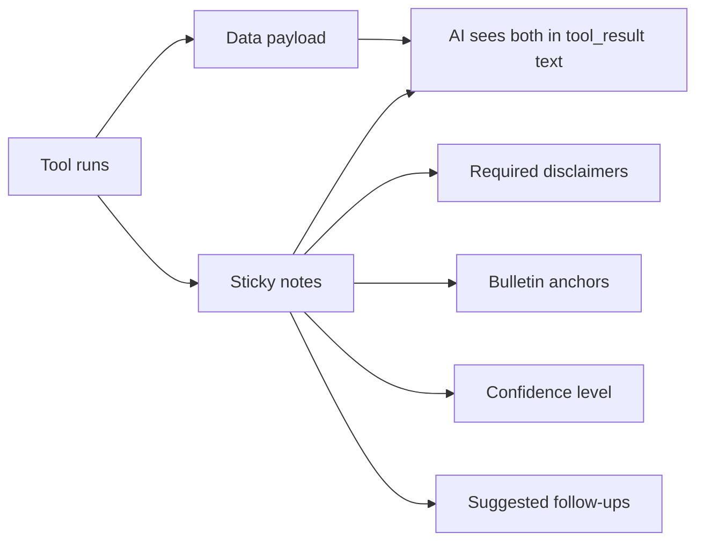
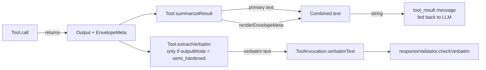

# Tool Envelope

> Last verified against code: 2026-06-10 (post planning-engine rebuild, PRs #35-#41).

> **Source file:** `packages/engine/src/agent/toolEnvelope.ts`

## Purpose

When a tool returns data — say, the result of auditing a degree — it often needs to attach context alongside the data, like a sticky note clipped to a report. The "envelope" is that bundle of sticky notes. A tool might attach a required warning ("this assumes the student stays full-time"), a verbatim quote from a bulletin that must appear in the answer, a confidence level ("low — data is from last semester"), or a suggested follow-up question the AI should offer the student. Tools that don't need any of this skip the envelope entirely. The AI sees these notes rendered into the tool result, so the model itself is prompted to surface each warning and quote.



---

Every agent tool **may** return a structured envelope alongside its primary `data` payload. The envelope is metadata each tool's `summarizeResult` renders into the `tool_result` text the model reads.

The envelope is **additive** — tools that don't opt in continue to work. Tools that do opt in declare disclaimers, anchors, follow-ups, and confidence right next to their data.

> **Important scope note (corrected vs. prior doc):** the old doc claimed the response validator and completeness reviewer *read envelope fields structurally* to enforce surfacing. In the code today, the envelope's only live effect is **textual** — `renderEnvelopeMeta` writes the disclaimers/anchors/follow-ups into the tool-result string, and the system prompt instructs the model to surface them. There is no structural consumer that reads `EnvelopeMeta` objects after the fact (see §8 on `mergeEnvelopes`).

---

## 1. The envelope shape

`EnvelopeMeta` (`toolEnvelope.ts:97-103`):

```
EnvelopeMeta = {
  disclaimers?:        Disclaimer[]
  suggestedFollowUps?: SuggestedFollowUp[]
  anchors?:            BulletinAnchor[]
  confidence?:         "high" | "medium" | "low" | "uncertain"
  verbatim?:           string | null
}

EnvelopeAware<T> = T & EnvelopeMeta   // toolEnvelope.ts:109
```

A tool's `call` returns `EnvelopeAware<T>` and its `summarizeResult` serializes the primary payload AND the rendered envelope into the single string the LLM sees as `tool_result` content.

---

## 2. `Disclaimer`

`toolEnvelope.ts:38-50`:

```
Disclaimer = {
  id: string                  // stable id used for dedup within a render
  text: string                // verbatim text the agent must surface (no paraphrase)
  reason: string              // why this disclaimer applies (LLM sees this for context)
  bulletinSource?: string     // optional citation pointer (bulletin URL fragment, school config path, template id)
}
```

The system prompt instructs the model to surface these **verbatim**. Note the dedup contract is **per render call**: `renderEnvelopeMeta` dedups disclaimers inside a single envelope; cross-tool dedup across a turn would require `mergeEnvelopes`, which is currently dead (§8).

---

## 3. `SuggestedFollowUp`

`toolEnvelope.ts:59-66`:

```
SuggestedFollowUp = {
  tool: string                // tool name as registered
  args: Record<string, unknown>  // pre-computed args ready to pass
  why: string                 // one-sentence rationale for the LLM
}
```

These replace the legacy "MANDATORY HANDOFF" prose rules. When `run_full_audit` detects a generic requirement, it can attach a `SuggestedFollowUp` pointing at `search_policy` with the right query. The agent calls the suggested tool because the rendered envelope says so, not because the prompt enumerates the case.

---

## 4. `BulletinAnchor`

`toolEnvelope.ts:74-82`:

```
BulletinAnchor = {
  source: string              // e.g., "CAS Math/CS BA — Sample Plan of Study, Year 4 Fall"
  quote: string               // verbatim text, ≤ 240 chars (kept short for summary frames)
  relevance: string           // why this anchor was attached
}
```

Used for "the sample plan of study places CSCI-UA 421 in 7th semester" anchors — the planner attaches the table row, the agent surfaces it with citation.

---

## 5. `EnvelopeConfidence`

`toolEnvelope.ts:89`:

```
"high" | "medium" | "low" | "uncertain"
```

`"uncertain"` maps to the "I couldn't find a specific policy on X" cascade. `"high"` means the tool found an exact match. The renderer omits the confidence line when it is `"high"` (§7), so only sub-high confidence reaches the model as an explicit note.

---

## 6. `verbatim`

A canonical anchor text field. It is **separate** from the `semi_hardened` verbatim path: the response validator's `checkVerbatim` reads `ToolInvocation.verbatimText`, which the loop populates from `tool.extractVerbatim(output)` when `outputMode === "semi_hardened"` (`agentLoop.ts:576-578`) — *not* from `EnvelopeMeta.verbatim`. No live tool populates `EnvelopeMeta.verbatim`; treat it as a reserved-but-unused field.

---

## 7. `renderEnvelopeMeta`

This helper (`toolEnvelope.ts:116-149`) converts an `EnvelopeMeta` to text the LLM reads as part of the tool_result. It is plain string assembly, emitting up to four sections in this order:

```
-- DISCLAIMERS YOU MUST SURFACE (verbatim) --
  • <disclaimer.text>
    (reason: <reason>; source: <bulletinSource>)
  …

-- BULLETIN ANCHORS (cite the source when surfacing) --
  • "<quote>"
    Source: <source> — Relevance: <relevance>
  …

-- SUGGESTED FOLLOW-UPS (call the tool if the question is unanswered) --
  • call `<tool>` with <JSON.stringify(args)> — <why>
  …

-- CONFIDENCE: <value> (relay this honestly to the student) --
```

Behavior to note:
- Returns the empty string when `meta` is undefined or every array is empty.
- The disclaimer `(reason; source)` tail line is omitted when both `reason` and `bulletinSource` are absent.
- The confidence line is emitted **only when `confidence` is set AND not `"high"`**.

Each opting-in tool's `summarizeResult` calls `renderEnvelopeMeta(...)` after rendering the primary payload and concatenates the two strings. Live callers: `runFullAudit.ts`, `searchPolicy.ts`, `getProgramRequirements.ts`, `planForwardDegree.ts`.

---

## 8. `mergeEnvelopes` — DEAD CODE

`mergeEnvelopes(...metas)` (`toolEnvelope.ts:157-180`) combines multiple envelopes into one (disclaimers deduped by id first-seen-wins; follow-ups and anchors concatenated; confidence reduced to the lowest across all envelopes).

> **Correction vs. prior doc:** its doc comment claims "the response validator + completeness reviewer use it to assess whether the agent surfaced every disclaimer across all envelopes." **This is wrong.** A repo-wide search finds **no non-test caller** of `mergeEnvelopes`. It is exported but unused in the runtime path — dead code. Cross-turn disclaimer dedup/union is not performed anywhere today.

### Known limitations

- **No turn-level envelope union.** Because `mergeEnvelopes` is unwired, two tools in the same turn that each attach the same disclaimer id will render it twice (once per tool's `summarizeResult`). Dedup is only within a single `renderEnvelopeMeta` call.
- **`EnvelopeMeta.verbatim` is unused** — the hardened-verbatim path runs entirely through `extractVerbatim` / `outputMode === "semi_hardened"` (§6).
- **No structural validator consumption.** Surfacing is enforced only by the rendered text + system-prompt instruction, not by post-hoc inspection of envelope objects.

---

## 9. End-to-end flow



Note: the envelope reaches the model as **text inside the tool_result**, and the verbatim contract reaches the validator via `verbatimText`. There is no third path where a downstream component reads the structured `EnvelopeMeta` object.

---

## 10. Why this design

- **Data, not prompt.** Adding a disclaimer for a new edge case is a code-side change (new `Disclaimer` object) rather than a system-prompt edit.
- **Tool authors own the safety contract.** A tool knows what's load-bearing in its output and surfaces it as disclaimers/anchors; `renderEnvelopeMeta` formats it consistently.
- **Conservative confidence posture.** Sub-high confidence is always surfaced to the model as an explicit note.

See also [`response-validator.md`](response-validator.md) for the verbatim-enforcement side.
