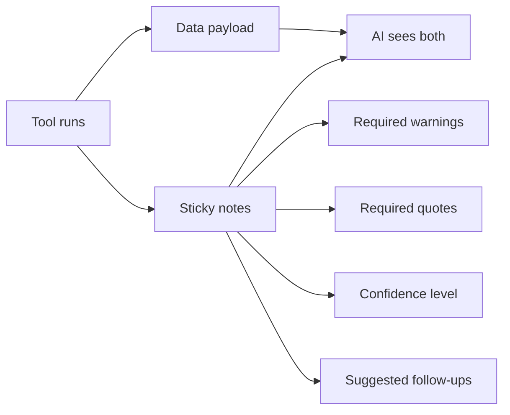
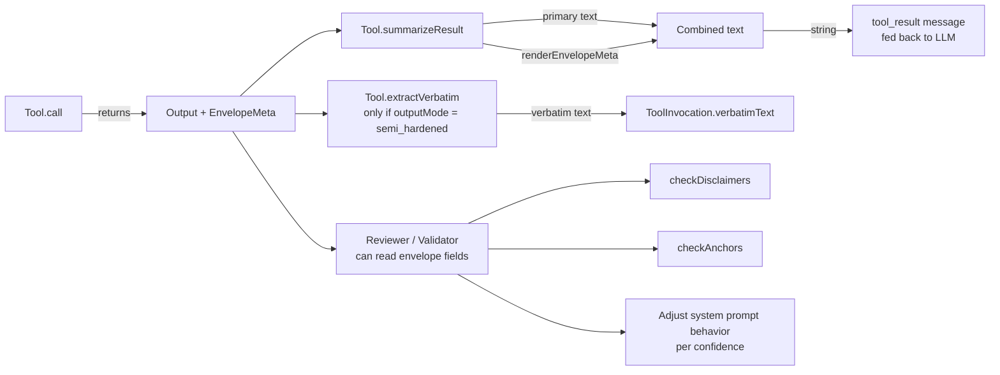

# Tool Envelope

> **Source file:** `packages/engine/src/agent/toolEnvelope.ts`

## TL;DR

When a tool returns data — say, the result of auditing a degree — it often needs to attach context along with the data, kind of like a sticky note clipped to a report. The "envelope" is that bundle of sticky notes. A tool might attach a required warning ("this assumes the student stays full-time"), a verbatim quote from a bulletin that must appear in the answer, a confidence level ("low — data is from last semester"), or a suggested follow-up question the AI should offer the student. Tools that don't need any of this can skip the envelope entirely. The AI sees these notes in the tool result, and the downstream safety checks use them to confirm the final answer respects each warning and quote. It's how tools communicate "here's the data, and here's what you must say about it."



---

Every agent tool **may** return a structured envelope alongside its primary `data` payload. The envelope is metadata the rendering layer (and the validator + reviewer) consult to enforce surfacing rules.

The envelope is **additive** — tools that don't opt in continue to work. Tools that do opt in declare disclaimers, anchors, follow-ups, and confidence right next to their data.

---

## 1. The envelope shape

```
EnvelopeMeta = {
  disclaimers?:        Disclaimer[]
  suggestedFollowUps?: SuggestedFollowUp[]
  anchors?:            BulletinAnchor[]
  confidence?:         "high" | "medium" | "low" | "uncertain"
  verbatim?:           string | null
}

EnvelopeAware<T> = T & EnvelopeMeta
```

A tool's `call` returns `EnvelopeAware<T>` and its `summarizeResult` is responsible for serializing the primary payload AND the envelope into a single string the LLM sees as `tool_result` content.

---

## 2. `Disclaimer`

```
Disclaimer = {
  id: string                  // stable id used for dedup across multiple tool calls
  text: string                // verbatim text the agent must surface (no paraphrase)
  reason: string              // why this disclaimer applies (LLM sees this for context)
  bulletinSource?: string     // optional citation pointer (bulletin URL fragment, school config path, template id)
}
```

The dedup contract: if `run_full_audit` and `search_policy` both attach a disclaimer with `id = "cas_pf_no_major"`, the renderer surfaces it once.

The system prompt's rule 6 mandates these be surfaced **verbatim**. The validator's `checkCompleteness` rules and the completeness reviewer both check that disclaimers actually appeared in the reply.

---

## 3. `SuggestedFollowUp`

```
SuggestedFollowUp = {
  tool: string                // tool name as registered
  args: Record<string, unknown>  // pre-computed args ready to pass
  why: string                 // one-sentence rationale for the LLM
}
```

These replace the legacy "MANDATORY HANDOFF" prose rules. When `run_full_audit` detects a generic requirement, it can attach a `SuggestedFollowUp` pointing at `search_policy` with the right query. The agent's system prompt instructs it to call the suggested tool because the envelope says so, not because the prompt enumerates the case.

---

## 4. `BulletinAnchor`

```
BulletinAnchor = {
  source: string              // e.g., "CAS Math/CS BA — Sample Plan of Study, Year 4 Fall"
  quote: string               // verbatim text, ≤ 240 chars (kept short for summary frames)
  relevance: string           // why this anchor was attached
}
```

Used for "the sample plan of study places CSCI-UA 421 in 7th semester" anchors — the planner attaches the table row, the agent surfaces it with citation.

---

## 5. `EnvelopeConfidence`

```
"high" | "medium" | "low" | "uncertain"
```

`"uncertain"` maps to the "I couldn't find a specific policy on X" cascade. `"high"` means the tool found an exact match.

When `confidence === "low"` or `"uncertain"`, the system prompt's rule 6 ANTI-FABRICATION clause forbids the agent from formatting text as a bulletin verbatim quote — it must surface the disclaimer text and recommend the adviser.

---

## 6. `verbatim`

A canonical Cardinal-Rule-§2.1 anchor text. The response validator's `checkVerbatim` reads `ToolInvocation.verbatimText`, which is populated from this field by `tool.extractVerbatim(output)` when the tool's `outputMode === "semi_hardened"`.

---

## 7. `renderEnvelopeMeta`

This helper converts an `EnvelopeMeta` to text the LLM can read as part of the tool_result. The renderer is plain string assembly:

```
-- DISCLAIMERS YOU MUST SURFACE (verbatim) --
  • <disclaimer.text>
    (reason: <reason>; source: <bulletinSource>)
  …

-- BULLETIN ANCHORS (cite the source when surfacing) --
  • "<quote>"
    Source: <source> — Relevance: <relevance>
  …

-- SUGGESTED FOLLOW-UPS (call the tool if the question is unanswered) --
  • call `<tool>` with <JSON.stringify(args)> — <why>
  …

-- CONFIDENCE: <value> (relay this honestly to the student) --
```

Empty arrays are skipped. Confidence is only included when it's NOT `"high"`.

Each tool's `summarizeResult` typically calls `renderEnvelopeMeta(meta)` after rendering the primary data payload and concatenates the two strings.

---

## 8. `mergeEnvelopes`

For the validator/reviewer that need to assess "all envelopes this turn," `mergeEnvelopes(...metas)` returns a single combined envelope:

- **Disclaimers**: deduplicated by id, first-seen wins.
- **Follow-ups**: concatenated (no dedup).
- **Anchors**: concatenated (no dedup).
- **Confidence**: the *lowest* across all envelopes (ordered `high → medium → low → uncertain`).

This is used by the completeness reviewer (Method B) and by future verifiers that need to reason over a turn's full envelope union.

---

## 9. End-to-end flow



---

## 10. Why this design

- **Data, not prompt.** Adding a new disclaimer for a new edge case is a code-side change (new disclaimer object) without prompt edits.
- **Multi-tool dedup.** Two tools can independently know the same disclaimer applies; the renderer dedupes by id.
- **Single confidence axis.** The lowest confidence across the turn wins, which is the correct conservative posture for academic advising.
- **Tool authors own the safety contract.** A tool knows what's load-bearing in its output; it surfaces that as disclaimers/anchors and the renderer + validator handle the rest.
