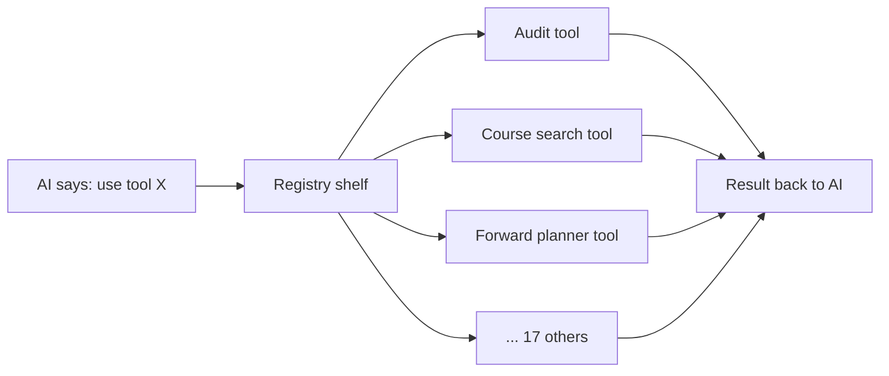

# Tool Registry & Tool Contract

> Last verified against code: 2026-06-19 (Plan 37 — `proposeWhatIfAssumption` `validateInput` gains the D-7 IP-membership guard + D-4 P/F-eligibility gate; `/api/plan/add` gains the E3 course-existence 422; `/api/plan/whatif` route now runs `validateInput` before `.call`; **tool count corrected to 22** — `propose_whatif_assumption` was added in plan 35 but the count was not updated; the ordered list below now shows all 22).

> **Source files:** `packages/engine/src/agent/tool.ts`, `packages/engine/src/agent/registry.ts`

## Purpose

The AI doesn't look up the student's transcript or search the bulletin itself — it asks specialized helpers called "tools" to do those jobs. There are 22 such tools, each good at one thing (auditing a degree, finding a course, planning the remaining degree, etc.). To keep them consistent, every tool follows the same recipe: a name the AI can call, a description telling the AI what it does, a list of inputs it accepts, the actual code that runs, and a way to turn its result into text the AI can read. The "registry" is just a labeled shelf — when the AI says "use the find-a-course tool," the registry grabs the right one off the shelf and runs it. Tools also come in three flavors depending on how strictly the AI must repeat their output: some surface a verbatim string the reply MUST contain, the rest are synthesized freely.



---

This module defines the abstract contract every agent tool must satisfy, the factory used to build one, the registry that holds them, and the default registry that wires up the 22 live tools.

---

## 1. The `Tool` contract

Every tool implements this shape (generic over a Zod input schema and an output type — `tool.ts:202-230`):

| Field | Type | Purpose |
|---|---|---|
| `name` | string | Stable identifier the model uses (e.g., `run_full_audit`). |
| `description` | string | Free-form description shown to the model. Concatenated with `prompt(session)` in `toLLMToolDefs`. |
| `inputSchema` | Zod schema | Validates the model's tool call args before `call` runs (`safeParse` in the loop). |
| `isReadOnly` | boolean | Defaults to true via `buildTool`. Mutating tools set it to false — `plan_forward_degree`, `confirm_plan_change`, `confirm_section_combination`, and `update_profile` all declare `isReadOnly: false`. It is a labeling field (the loop does not gate on it), but it does flag the four tools that write to session. |
| `maxResultChars` | number | Cap on the stringified result (default 2000). `summarizeResult` output is truncated to this. |
| `outputMode?` | `"template" \| "semi_hardened" \| "synthesis"` | Defaults to `"synthesis"`. See §3. |
| `validateInput?(input, ctx)` | async fn | Optional pre-call check. Returns `{ ok: true }` or `{ ok: false, userMessage }`. A failed result is wrapped by the loop as `validation failed: <userMessage>`. |
| `prompt(ctx: { session })` | fn → string | Dynamic per-session prompt block appended to the static `description` in `toLLMToolDefs`. Lets a tool emit context-aware hints (e.g., "DPR loaded, prefer me"). |
| `call(input, ctx)` | async fn | Runs the tool. Must honor `ctx.signal`. Returns the typed output. |
| `summarizeResult(output)` | fn → string | Produces the model-facing string surfaced as the `tool_result` content. Capped to `maxResultChars` by the factory. |
| `extractVerbatim?(output)` | fn → string \| null | Only consulted when `outputMode === "semi_hardened"`. Returns the text the response validator will require to appear in the final reply. |

`ToolUseContext` (`tool.ts:22-27`) carries:
- `signal: AbortSignal` — threaded from the agent loop
- `session: ToolSession` — the per-request state (see [`session-state.md`](session-state.md))

`ToolSession` (`tool.ts:39-187`) is the wide per-request bag the tools read and write: `student`, `courses`, `prereqs`, `schoolConfig`, the parsed `degreeProgressReport` (DPR), the RAG corpus handle, `forwardSchedule` / `studentDraftPlan` / `schedulePreferences` for the forward planner, the `pendingMutations` and `pendingMaterializations` two-step staging maps, and the optional persistence hooks (`profileStore`, `scheduleStore`, `chatHistoryStore`).

---

## 2. `buildTool` — the factory

`buildTool` (`tool.ts:237-269`) produces a fully-typed `Tool` from a literal definition. It applies these defaults:

- `isReadOnly`: `true`
- `maxResultChars`: `2000`
- `outputMode`: `"synthesis"`

It also wraps `summarizeResult` so the final output is automatically truncated:

```
const raw = def.summarizeResult(output);
const cap = def.maxResultChars ?? 2000;
return raw.length > cap ? raw.slice(0, cap) + "…" : raw;
```

No other transformation is applied; the tool author owns input validation, error handling inside `call`, and the structure of `summarizeResult`.

---

## 3. The three output modes

`OutputMode` is declared at `tool.ts:200`.

| Mode | Semantics | Validator behavior |
|---|---|---|
| `"synthesis"` (default) | Free LLM synthesis around the tool result. | Only the standard grounding/invocation/caveat rules apply. |
| `"semi_hardened"` | Tool surfaces a `verbatimText` (via `extractVerbatim`) that the reply MUST contain unchanged. | Validator's `checkVerbatim` runs (see [`response-validator.md`](response-validator.md)). The loop only calls `extractVerbatim` when `outputMode === "semi_hardened"` (`agentLoop.ts:576-578`). |
| `"template"` | Intended to bypass the LLM entirely. **No live tool sets this mode** — it exists only as a declared variant and a comment referencing the pre-loop template fast-path. | n/a |

Three live tools opt into `"semi_hardened"`: `run_full_audit` (`runFullAudit.ts:172`), `get_credit_caps` (`getCreditCaps.ts:38`), and `what_if_audit` (`whatIfAudit.ts:61`). Each implements `extractVerbatim` to return the disclaimer/cap text the reply must echo.

> **Correction vs. prior doc:** the old doc named only `run_full_audit` and `get_credit_caps` as semi-hardened. `what_if_audit` is the third.

---

## 4. `ToolRegistry` — a name-indexed map

The registry (`tool.ts:275-298`) is a tiny class around `Map<string, Tool>`:

- Constructor throws on duplicate names.
- `get(name)` returns the tool or undefined.
- `list()` returns an array of values.
- `has(name)` checks existence.

The agent loop calls `registry.list()` once at the start of each turn (via `toLLMToolDefs`, `agentLoop.ts:727-731`) to build the LLM's tool list, and `registry.get(toolName)` for each tool call the model issues (`agentLoop.ts:412`, `:1045`).

---

## 5. `ALL_NYUPATH_TOOLS` — the wired set

`agent/registry.ts` exports a single array, `ALL_NYUPATH_TOOLS` (`registry.ts:73-96`), containing exactly **22** tools in this fixed order:

```
1.  run_full_audit
2.  what_if_audit
3.  search_policy
4.  get_program_requirements
5.  update_profile
6.  confirm_profile_update
7.  get_credit_caps
8.  search_availability
9.  get_academic_standing
10. search_courses
11. plan_forward_degree
12. view_forward_plan
13. propose_plan_change
14. probe_counterfactual
15. propose_whatif_assumption      ← added plan 35 (Branch-B what-if confirm)
16. confirm_plan_change
17. simulate_alternatives
18. bind_free_elective
19. bind_pool_slot
20. compare_plan_alternatives
21. materialize_sections
22. confirm_section_combination
```

`buildDefaultRegistry()` (`registry.ts:102-104`) constructs a fresh `ToolRegistry` from a copy of `ALL_NYUPATH_TOOLS`. The chat route calls it once per turn, inline in the `runAgentTurnStreaming(...)` arguments (`apps/web/app/api/chat/v2/route.ts`).

### Plan 37 tool enhancements (guards on existing tools)

No new tools were added **in plan 37**; the registry contains 22 tools (plan 35 added `propose_whatif_assumption`, correcting the previously-stated count of 21). Three live tool behaviors changed in plan 37:

- **`propose_whatif_assumption` — D-7 IP-membership guard + D-4 P/F-eligibility gate.** `proposeWhatIfAssumptionTool.validateInput` now checks two conditions before calling the tool:
  1. **IP-membership (D-7):** the `courseId` arg must be an `in_progress` row in the authoritative DPR. A withdraw/pass-fail targeting a `completed` or `specific_planned` course is rejected with a clear message ("Withdraw / pass-fail applies only to a course you're currently taking (in progress). <course> is <completed / planned> — to remove a planned course, drop it instead."). This makes the D-2 PLANNED-slot restriction a real engine guard, not just a dormant UI gate.
  2. **P/F eligibility (D-4, follow-up fix):** if the action is `pass` or `fail` AND the student's home school has `canElect: false` (Tandon) OR the slot category makes the course ineligible (e.g. a course counting toward a major at a school that bans major-course P/F elections), `validateInput` rejects the call before the tool runs. This closes the D-4 eligibility gap that existed when the what-if path bypassed `validateInput`.
  The `/api/plan/whatif` route also now **explicitly runs `validateInput` before `.call`** (this was the follow-up fix — the editor path previously bypassed validation).

- **`/api/plan/add` — E3 course-existence 422.** The add-course route validates the submitted `courseId` against `courseExists(courseId, session.courses)` — a pure catalog lookup (`apps/web/lib/courseExists.ts`). An unknown course id returns HTTP 422 with a clear message. The same check also runs client-side in the `+ Add course` affordance before the route is called.

- **`proposeWhatIfAssumption` threading (C2 follow-up).** The `solveWhatIfAssumption` and `solveAndDiff` helpers that this tool calls now receive `passFailConfig` from the school config and thread it into `finalizeForwardSchedule`, so the 8th `passFailLimitsRespected` axis fires for P/F elections via the what-if path.

### Removed tools (do not document as live)

Three tools the old doc listed are **gone** from the registry:

- **`check_transfer_eligibility`** — the authored CAS→Stern transfer route (`data/transfers/*.json`) was removed during the pure-RAG decommission. Internal-transfer questions now go through `search_policy` over the bulletin's internal-transfer pages (every school, not one hardcoded route).
- **`check_overlap`** — the authored cross-program double-count audit (`crossProgramAudit` over `programs.json`) was removed in the same decommission. Double-count policy now comes from `search_policy`; per-program requirement satisfaction comes from `run_full_audit` (the DPR).
- **`plan_semester`** — the Phase 5 single-term planner and its `planFeasibility` verifier were deleted. It had been unregistered since May 2026 and is fully superseded by `plan_forward_degree`, which plans every remaining term, writes `session.forwardSchedule`, and cooperates with `propose_plan_change`. There is now one way to plan.

(The header comment in `registry.ts:1-46` is the authoritative record of these removals.)

---

## 6. How the registry plugs into the loop

```mermaid
sequenceDiagram
    participant Route as /api/chat/v2
    participant Reg as ToolRegistry
    participant Loop as runAgentTurnStreaming
    participant LLM as LLM
    participant Tool as Tool.call

    Route->>Reg: buildDefaultRegistry()
    Reg-->>Route: registry (22 tools)
    Route->>Loop: runAgentTurnStreaming(client, registry, session, msg, opts)
    Loop->>Reg: registry.list() (via toLLMToolDefs)
    Reg-->>Loop: [Tool, …]
    Loop->>Loop: toLLMToolDefs:<br/>name + (description + prompt(session)) + JSON schema
    Loop->>LLM: complete(system, history, tools=[…])
    LLM-->>Loop: toolCalls = [{ id, name, args }]
    loop each toolCall
        Loop->>Reg: registry.get(tc.name)
        Reg-->>Loop: Tool | undefined
        alt undefined
            Loop->>Loop: emit tool_unsupported, push error tool_result
        else found
            Loop->>Tool: inputSchema.safeParse(tc.args)
            alt Zod fail
                Loop->>Loop: error "validation failed: …"
            else ok
                Loop->>Tool: validateInput(parsed, ctx)
                alt rejected
                    Loop->>Loop: error "validation failed: <userMessage>"
                else accepted
                    Loop->>Tool: call(parsed, ctx) (retry once if transient)
                    Tool-->>Loop: output
                    Loop->>Tool: summarizeResult(output)
                    Tool-->>Loop: summary
                    alt semi_hardened
                        Loop->>Tool: extractVerbatim(output)
                        Tool-->>Loop: verbatimText | null
                    end
                end
            end
        end
        Loop->>LLM: tool_result message
    end
```

`toLLMToolDefs` (`agentLoop.ts:727-731`) builds the model-facing tool list: each entry is `name`, `description + "\n\n" + prompt({ session })`, and the JSON-Schema form of `inputSchema`. The per-call execution (validate → call with a single transient-error retry → summarize → extract verbatim) lives in the `executeTool` helper around `agentLoop.ts:515-625`.

---

## 7. No legacy `tools/` surface

> **Correction vs. prior doc:** the old §7 described a `packages/engine/src/tools/` directory (`tools/index.ts`, `tools/types.ts`) re-exporting `buildTool`, `getTool`, `listTools`, `registerTool`, etc. as a "legacy Phase 0 surface." **That directory no longer exists.** The only `tools` directory under the engine is `packages/engine/src/agent/tools/`, which holds the live tool implementations (`runFullAudit.ts`, `searchCourses.ts`, …).

The public type and value surface (`buildTool`, `ToolRegistry`, `Tool`, `buildDefaultRegistry`, `LLMToolDef`, etc.) is re-exported from `packages/engine/src/index.ts`, which sources them from `./agent/index.js` — not from a separate `tools/` barrel.

---

## 8. Why the registry is rebuilt per turn

The registry is a thin map but it's built per turn for a real reason: the tool descriptions (`prompt(ctx: { session })`) are dynamic. They read `session.degreeProgressReport`, `session.student?.homeSchool`, `session.forwardSchedule`, etc., to emit context-sensitive hints. A long-lived global registry would bake stale hints in.

The Map itself is constructed in O(N) (N = 21), so per-turn rebuild has no measurable cost.

---

## 9. What the registry never does

- It does not **execute** tools. That's the agent loop's `executeTool` helper.
- It does not **validate** inputs. Tools do that via `inputSchema` + optional `validateInput`.
- It does not **persist** anything. Tool side effects on `session` are in-memory; the route layer chooses what to flush to disk after each turn (through the `profileStore` / `scheduleStore` / `chatHistoryStore` hooks).
- It does not perform **authorization**. Per-user scoping is the web layer's responsibility.
