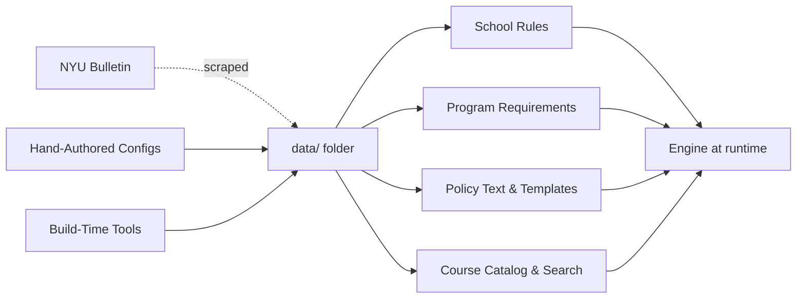
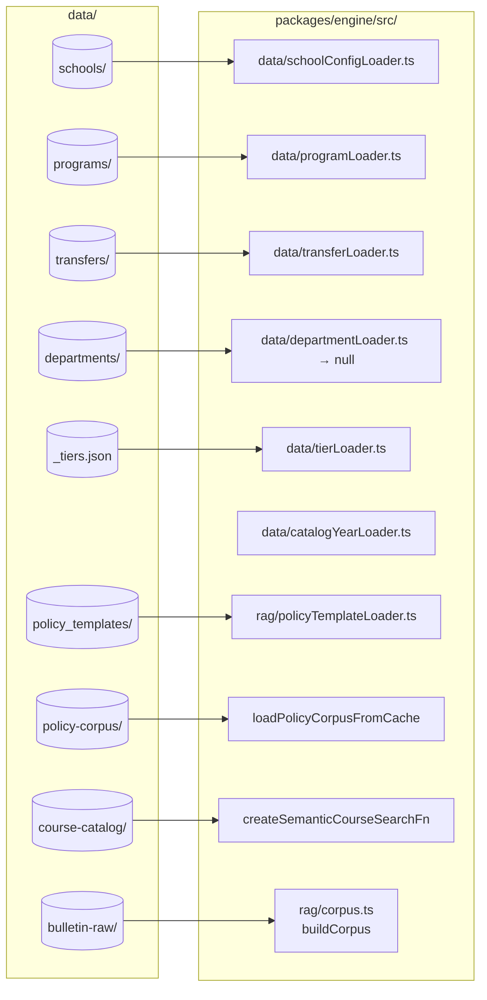

# `data/` — On-Disk Catalog Walk

## TL;DR

This folder is the engine's reference library — the on-disk store of everything it needs to know about NYU's programs, schools, courses, and policies. It contains mirrored copies of the public NYU bulletin, school-specific rules (Stern, Tandon, CAS), per-program degree requirements, transfer policies between schools, prepared search indexes for finding courses and policy text, and hand-curated answers to recurring questions like "how does pass/fail work in my major?". Every file here was either scraped from NYU's website, extracted by one of the build-time tools, or carefully hand-written by a human and spot-checked. At startup, the engine's loaders walk through this folder and read what they need. Every file carries a small audit trail noting where the information came from, when it was last verified, and who checked it, so when the bulletin changes someone can trace which rule needs updating. Think of this as the cookbook the engine reads from — students never see it directly, but everything the system tells a student traces back to a line in one of these files.

---

## 1. Overview

The repository's `/Users/edoardomongardi/Desktop/Ideas/NYU Path/data/` directory is the canonical store of every piece of catalog, policy, program, and corpus data the runtime relies on. Everything here is either:

- scraped from `bulletins.nyu.edu` (raw `_index.md` / `_index.html`),
- extracted by a tool under `tools/` (program JSONs, embeddings),
- or hand-authored (school configs, transfer policies, policy templates, tier mapping).

Engine loaders at boot time read from this directory; the JSON files match the type shapes declared in `@nyupath/shared`. The directory contains a single top-level file and eight subdirectories:

| Path | Kind | Source |
| --- | --- | --- |
| `data/_tiers.json` | Tier mapping | Hand-authored. |
| `data/bulletin-raw/` | Mirrored bulletin markdown + HTML | `bulletin-scraper`, `playwright-scraper`. |
| `data/course-catalog/` | Course description dump + OpenAI embeddings | Postgres dump + `course-catalog-embed`. |
| `data/departments/` | Reserved (empty) | Schema deferred. |
| `data/policy-corpus/` | Policy embeddings cache | `policy-corpus-embed`. |
| `data/policy_templates/` | Curated canned-answer chunks | Hand-authored. |
| `data/programs/` | Per-program degree-requirement JSONs | `program-extractor` (extract + promote). |
| `data/schools/` | Per-school configuration JSONs | Hand-authored / LLM-assisted with spot-check. |
| `data/transfers/` | Inter-school transfer policy JSONs | Hand-authored / LLM-assisted with spot-check. |

## 2. Top-Level Files

### `data/_tiers.json`

A small registry mapping `programId → tier` where the tier is one of `T1`, `T2`, `T3`:

- `T1` — fully deterministic JSON in `data/programs/<school>/`.
- `T2` — LLM-extracted with caveat.
- `T3` — RAG-only (no deterministic rules); typically Gallatin and Liberal Studies.

The file carries `_meta` (catalog year, source URL / hash, who extracted and verified it) and a `programs` map. Drift detection uses a sha256 of the canonical (sorted-keys) body of the `programs` map. Current entries map `cs_major_ba`, `cas_core`, `cas_econ_ba` (T1), `gallatin_ba`, `liberal_studies` (T3).

Loaded at runtime by `packages/engine/src/data/tierLoader.ts`.

## 3. `data/bulletin-raw/` — Mirrored Bulletin

This is the raw output of `bulletin-scraper/scrape_bulletin.py` (plus the `playwright-scraper` overlay for WAF-gated nyu.edu pages). Structure mirrors the URL path exactly. Every page is stored as two files:

- `_index.html` — raw HTML.
- `_index.md` — markdownified body with a `url` / `title` / `scraped_at` frontmatter block.

Top-level subdirectories observed:

- `courses/` — per-department course pages (e.g. `csci_ua/_index.md`). The directory name follows `<dept>_<suffix>` where `<suffix>` matches the school suffix tail (`ua`, `ub`, `ue`, `uh`, `ut`, `uy`, `shu`). These are the input to `bulletin-parser`'s prereq, offering, coreq, and grade-threshold extractors.
- `programs/` — bulletin landing for academic programs.
- `undergraduate/` — root undergraduate pages by school (e.g. `arts-science`, `business`, `engineering`, `culture-education-human-development`, `dentistry`, `global-public-health`, `abu-dhabi`, `arts`). The `program-extractor` reads program-requirement bulletin pages from here.
- `graduate/` — root graduate pages.
- `nyu/` — pages under `nyu.edu` itself (about, academic-calendar, admissions).
- `ogs/` — Office of Global Services pages (the visa / F-1 RCL guidance the `f1_credit_floor` template cites).
- `internal-transfer-equivalencies/` — pages under nyu.edu/admissions/undergraduate-admissions/how-to-apply/internal-transfers (input for transfer-equivalency work).
- Plus the root `_index.html` / `_index.md` files (the homepage).

The `policy-corpus-embed` tool walks this tree via the engine's `buildCorpus` to produce the policy embeddings cache.

## 4. `data/course-catalog/` — Course Descriptions and Embeddings

Three files:

- `course_descriptions.json` — Postgres dump of 17,122 courses, exported from the `nyucourses` reference database. Each entry carries `courseCode`, `title`, `description`, `catalogData` (often null), and `updatedAt`. The `_meta` block records `dumpedAt`, `rowCount`, `sourceDb`, and `sourceHash`.
- `course_embeddings_openai.jsonl` — JSONL produced by `tools/course-catalog-embed/embed.mjs`. One JSON object per line (JSONL because the full array would exceed V8's `JSON.stringify` cap). Embeddings are 1536-dim `text-embedding-3-small`.
- `course_embeddings_openai.meta.json` — `embedderModelId`, `dimension`, `embeddedAt`, `rowCount`, `sourceHash`, `format`. Hash and row count drift make stale embeddings loud on re-run.

Consumed at runtime by the engine's semantic-course-search layer (`createSemanticCourseSearchFn` in the engine's index).

## 5. `data/departments/` — Reserved (Empty)

Contains only a `_README.md`. The directory exists to reserve the **department config** precedence slot in the architecture's data-source precedence rule:

`school config > program config > department config > course catalog`

The `DepartmentConfig` schema is deliberately deferred until either (a) the `data_conflict_unresolved` log shows ≥5 cases where a department-level distinction would have helped, or (b) a ticket requires a department-specific rule that fits neither the school nor the program schema. Until then the loader at `packages/engine/src/data/departmentLoader.ts` returns `null` for every lookup, and the audit engine uses program JSONs directly.

## 6. `data/policy-corpus/` — Embeddings Cache

Two files, both produced by `tools/policy-corpus-embed/embed.ts`:

- `policy_chunks.jsonl` — one JSON record per chunk. Each record has a `chunk` (with `text` and `meta`: `source`, `school`, `year`, `sourcePath`, `section`, `chunkId`, `sourceLine`) and an `embedding` (1536-dim `text-embedding-3-small`).
- `policy_chunks.meta.json` — model id, dimension, `chunkCount`, `skippedEntries`, `embeddedAt`, `sourceHash`, `format`.

The engine's `loadPolicyCorpusFromCache` hydrates a VectorStore from this JSONL at boot so cold-starts never re-embed. The current snapshot has ~5,400 chunks.

## 7. `data/policy_templates/` — Curated Canned-Answer Chunks

Hand-authored, verbatim-quote-heavy answers to recurring policy questions. Each file is a single JSON object with:

- `_meta` — `catalogYear`, `sourceUrl`, `lastVerified`, `sourceHash`, `extractedBy`, `verifiedBy`.
- `id`, `school` (e.g. `cas`, `stern`, `tandon`, `all`), `source` (textual citation), `lastVerified`.
- `triggerQueries[]` — phrases that should route to this template.
- `body` — the markdown answer (often direct verbatim bulletin quotes plus operator notes).

Current files cover the CAS-specific cases (`cas_advanced_standing_cap`, `cas_credit_overload`, `cas_double_counting`, `cas_grad_courses_for_undergrad`, `cas_grade_points`, `cas_minor_basics`, `cas_pf_career_cap`, `cas_pf_major`, `cas_residency_64_credits`, `cas_summer_at_nyu`, `cas_to_stern_transfer`, `cas_withdrawal`), the Stern-specific ones (`stern_double_count_strict`, `stern_pf_major`, `stern_residency`), the Tandon-specific ones (`tandon_double_major`, `tandon_residency`), the universal F-1 floor (`f1_credit_floor`, `school: "all"`), and the internal transfer additional requirements (`internal_transfer_additional_requirements`).

Loaded at runtime by `packages/engine/src/rag/policyTemplateLoader.ts` via the engine's `loadPolicyTemplates`.

## 8. `data/programs/` — Per-Program Requirements

Two-stage layout:

- `data/programs/_candidates/` — LLM-extracted programs awaiting human spot-check. The `program-extractor/extract.ts` tool lands here. Currently contains `cas_philosophy_ba.json`.
- `data/programs/<school>/` — promoted programs that the engine loads at runtime. Promotion is the `program-extractor/promote.ts` step (requires `--spotCheckedBy <name>`). Currently `data/programs/cas/cas_econ_ba.json` is the only promoted file.

Each program JSON carries:

- `_meta` — catalog year, source URL, source hash, lastVerified, extractedBy (`manual` or `llm-assisted`), verifiedBy (`hand-review` or `spot-check`), `sourceRef` (`anchor` + `pdfPage`).
- `_provenance[]` — a per-field claim trail: each entry has `path` (dot-path inside the program body), `claim` (the verbatim bulletin quote), `bulletinSection`, and `sourceLine`. This is the audit log that lets a reviewer trace any rule in the program back to a specific line of the bulletin.
- The program body itself — matching the `Program` shape from `@nyupath/shared` (`programId`, `name`, `catalogYear`, `school`, `department`, `totalCreditsRequired`, `rules[]`).

Loaded by `packages/engine/src/data/programLoader.ts`.

## 9. `data/schools/` — School Configurations

One JSON per NYU undergraduate school, all hand-authored or LLM-assisted with a hand-review pass:

- `cas.json` — College of Arts and Science (BA, `-UA` suffix, 128 credits, 64-credit residency).
- `stern.json` — Stern School of Business (`-UB` suffix, 64-credit residency, strict double-count posture).
- `tandon.json` — Tandon School of Engineering (residency rule keyed to "half of required credits", currently 64; the file's `_notes` flag this as needing a per-program override when the first non-128-credit Tandon program lands).

Each file carries:

- `_meta` — catalog year, source URL, source hash, lastVerified, extractedBy, verifiedBy, sourceRef.
- `_provenance[]` — same claim trail as programs.
- Optional `_notes[]` — free-form caveats and TODOs (Tandon currently calls out that `gradeThresholds` is omitted and falls through to CAS defaults).
- The `SchoolConfig` body — `schoolId`, `name`, `degreeType`, `courseSuffix[]`, `totalCreditsRequired`, `overallGpaMin`, `residency`, `creditCaps[]`, plus the optional composed configs (`passFail`, `spsPolicy`, `doubleCounting`, `transferCreditLimits`, `gradeThresholds`, `gpaTierTable`, `overloadRequirements`, `lifecycle`, `advisingContact`, …).

Loaded by `packages/engine/src/data/schoolConfigLoader.ts`.

## 10. `data/transfers/` — Inter-School Transfer Policies

JSON definitions for inter-school internal transfer rules:

- `_nyu_internal_transfer_policy.json` — the universal CAS-level "Internal Transfer Students" policy (earliest application term, full-time semester rule, etc.).
- `cas_to_stern.json` — the CAS-to-Stern application-deadline and acceptance-term policy (`applicationDeadline: March 1`, `acceptedTerms: fall only`).

Each file has the same `_meta` + `_provenance` envelope as programs and schools, then a transfer-policy body. Loaded by `packages/engine/src/data/transferLoader.ts`.

## 11. Boot-Time Loading

The engine's runtime contract with `data/` is concentrated in a handful of loaders under `packages/engine/src/data/` plus the RAG layer:

Cross-references:

- `data/schools/<id>.json` → `schoolConfigLoader.ts` (shape: `SchoolConfig` from `@nyupath/shared`).
- `data/programs/<school>/<id>.json` → `programLoader.ts` (shape: `Program`).
- `data/transfers/*.json` → `transferLoader.ts`.
- `data/departments/` → `departmentLoader.ts` (always returns null at v1.0).
- `data/_tiers.json` → `tierLoader.ts`.
- `data/policy_templates/*.json` → `policyTemplateLoader.ts` (curated canned answers).
- `data/policy-corpus/policy_chunks.jsonl` → `loadPolicyCorpusFromCache` (VectorStore hydration).
- `data/course-catalog/course_descriptions.json` + `course_embeddings_openai.jsonl` → `createSemanticCourseSearchFn`.
- `data/bulletin-raw/**/_index.md` → `rag/corpus.ts`'s `buildCorpus` (only re-walked when re-embedding).

Two additional files live under the engine's bundled `data/` directory rather than the repo root `data/`:

- `packages/engine/src/data/prereqs.json` — written by `bulletin-parser` (prereqs + grade thresholds + coreqs).
- `packages/engine/src/data/courses-offerings.json` — written by `bulletin-parser`'s offerings + offering-confidence extractors.

These two are bundled with the engine package because they are tight-loop reads inside the solver — see `engine/data-loaders.md` for the in-package loader contract.

## 12. Provenance and Trust Conventions

Every hand-authored or LLM-extracted JSON in `data/schools/`, `data/programs/`, `data/transfers/`, and `data/policy_templates/` carries a common envelope:

- `_meta.catalogYear` — the catalog year these rules apply to.
- `_meta.sourceUrl` — the bulletin (or NYU.edu) page the rules come from.
- `_meta.sourceHash` — sha256 of the canonical body, so changes to the source upstream are detectable.
- `_meta.lastVerified` — date a human last spot-checked.
- `_meta.extractedBy` — `manual` or `llm-assisted`.
- `_meta.verifiedBy` — `hand-review` or `spot-check`.
- `_meta.sourceRef.anchor` / `_meta.sourceRef.pdfPage` — deep-link inside the source.
- `_provenance[]` — per-field claim trail with `path`, `claim` (the bulletin verbatim), `bulletinSection`, `sourceLine`.
- Optional `_notes[]` — free-form caveats (Tandon's `gradeThresholds` omission is the canonical example).

This envelope is the human audit trail. When the bulletin changes, the workflow is: rescrape (bulletin-scraper) → recompute the source hash → spot the drift in CI → re-extract or re-edit the affected JSON → bump `lastVerified` → update the relevant `_provenance` rows.
