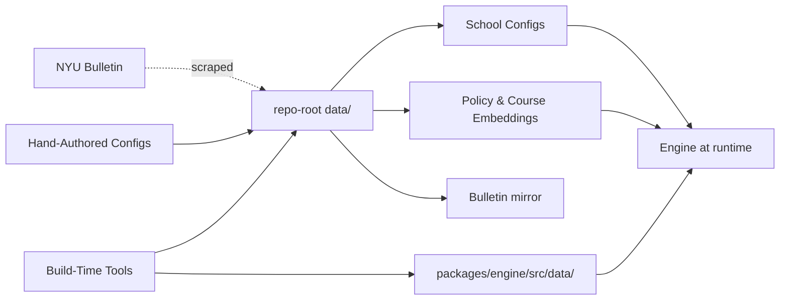
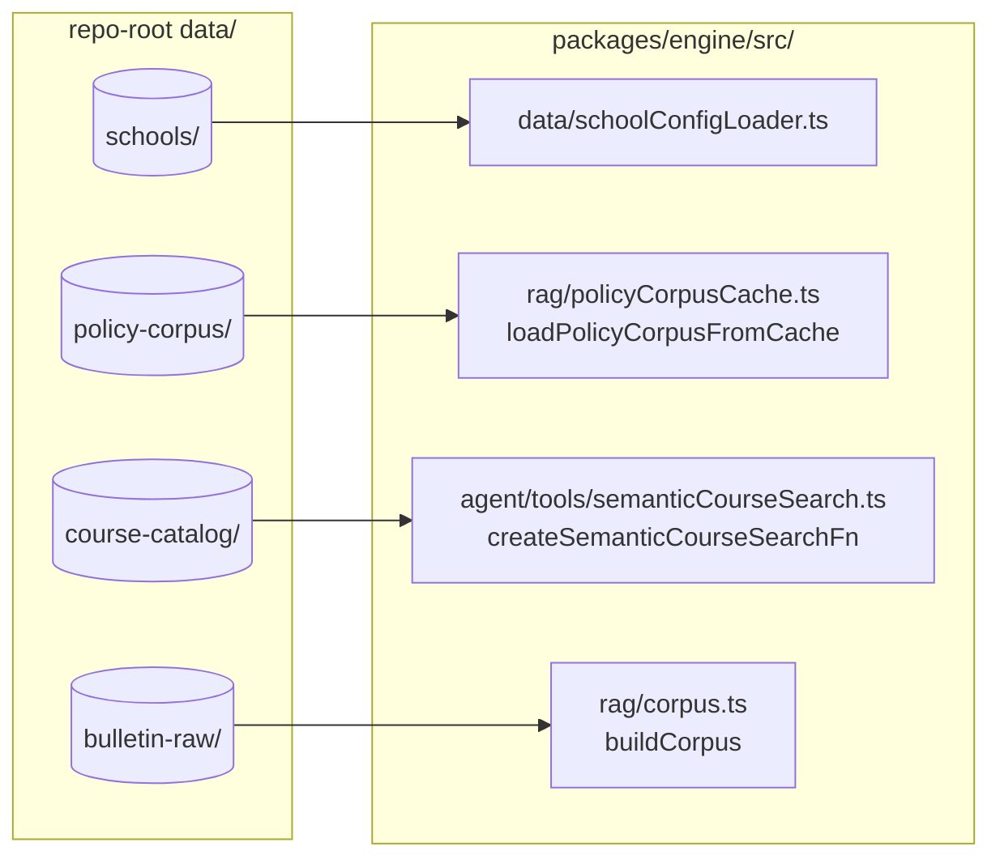

# `data/` — On-Disk Catalog Walk

> Last verified against code: 2026-06-10 (post planning-engine rebuild, PRs #35-#41).

## Purpose

This folder is the engine's reference library — the on-disk store of everything it needs to know about NYU's bulletins, schools, courses, and policies. It holds mirrored copies of the public NYU bulletin, per-school configuration JSONs, the full course-description dump plus its search embeddings, and the embedded policy corpus that powers `search_policy`. Most files were either scraped from NYU's website, generated by one of the build-time tools, or hand-authored and spot-checked. At startup the engine's loaders walk through this folder and read what they need. Hand-authored files carry a `_meta` provenance block (where the info came from, when it was last verified, who checked it), so when the bulletin changes someone can trace which rule needs updating. Students never see this folder directly, but everything the system tells a student traces back to a line in one of these files.

> The runtime data the **forward planner** reads lives in a *different* place — bundled inside the engine at `packages/engine/src/data/`, not under the repo-root `data/`. That split is the single most important thing to know about this directory and is covered in §8.

---

## 1. Overview

The repo-root `data/` directory holds catalog, policy, and corpus data the runtime relies on. Everything here is either scraped from `bulletins.nyu.edu` / `nyu.edu`, generated by a tool under `tools/`, or hand-authored (school configs).

The directory has **five subdirectories and no top-level files** (the legacy `_tiers.json` was removed). It is `.gitignore`d as a whole, with `data/schools/` force-tracked so the per-school configs ship in the repo.

| Path | Kind | Source | Tracked? |
| --- | --- | --- | --- |
| `data/bulletin-raw/` | Mirrored bulletin markdown + HTML | `bulletin-scraper`, `playwright-scraper`. | gitignored |
| `data/course-catalog/` | Course-description dump + OpenAI embeddings | Postgres dump + `course-catalog-embed`. | gitignored |
| `data/policy-corpus/` | Policy embeddings cache | `policy-corpus-embed`. | gitignored |
| `data/programs/` | Sample program JSON (artifact only) | `program-extractor` (historical; tool removed). | gitignored |
| `data/schools/` | Per-school configuration JSONs | Hand-authored / LLM-assisted with spot-check. | **force-tracked** |

> Removed since the 2026-06-03 doc: `data/_tiers.json`, `data/departments/`, `data/policy_templates/`, `data/transfers/`. The tier registry, department-config slot, curated canned-answer templates, and inter-school transfer JSONs **no longer exist on disk** and have no runtime loader. The corresponding loaders (`tierLoader.ts`, `departmentLoader.ts`, `programLoader.ts`, `transferLoader.ts`, `catalogYearLoader.ts`, `policyTemplateLoader.ts`) are all gone — `packages/engine/src/data/` now contains only `schoolConfigLoader.ts`, `schoolDefaults.ts`, `courseSuffixMap.ts`, and `foseTerm.ts`.

## 2. `data/bulletin-raw/` — Mirrored Bulletin

Raw output of `bulletin-scraper/scrape_bulletin.py` (plus the `playwright-scraper` overlay for WAF-gated nyu.edu pages). Structure mirrors the URL path exactly. Every page is stored as two files: `_index.html` (raw) and `_index.md` (markdownified body with a `url`/`title`/`scraped_at` frontmatter block).

Top-level subdirectories observed:
- `courses/` — per-department course pages (e.g. `csci_ua/_index.md`), named `<dept>_<suffix>`. These are the input to `bulletin-parser`'s course/prereq/offering/coreq/grade-threshold extractors.
- `programs/` — bulletin landing pages for academic programs.
- `undergraduate/` — root undergraduate pages by school.
- `graduate/` — root graduate pages.
- `nyu/` — pages under `nyu.edu` (about, academic-calendar, admissions).
- `ogs/` — Office of Global Services pages (F-1 / RCL guidance).
- `internal-transfer-equivalencies/` — internal-transfer admissions pages.
- Plus the root `_index.html` / `_index.md` (homepage).

The engine's `buildCorpus` (`packages/engine/src/rag/corpus.ts`) walks this tree to assemble the policy corpus, and `policy-corpus-embed` re-embeds it.

## 3. `data/course-catalog/` — Course Descriptions and Embeddings

Three files:
- `course_descriptions.json` (~14 MB) — Postgres dump of **17,122** courses from the `nyucourses` reference DB. Each entry has `courseCode`, `title`, `description`, `catalogData` (often null), `updatedAt`. The `_meta` block records `dumpedAt`, `rowCount` (17,122), `sourceDb`, `sourceHash`.
- `course_embeddings_openai.jsonl` (~534 MB) — JSONL of 1536-dim `text-embedding-3-small` embeddings, one object per line (JSONL because the full array would blow V8's `JSON.stringify` cap). Produced by `tools/course-catalog-embed/embed.mjs`.
- `course_embeddings_openai.meta.json` — `embedderModelId`, `dimension` (1536), `embeddedAt`, `rowCount` (17,122), `sourceHash`, `format`.

Consumed at runtime by the engine's semantic course-search adapter (`packages/engine/src/agent/tools/semanticCourseSearch.ts`, wired via `createSemanticCourseSearchFn`). Loading is deferred to the first `search_courses` call so a chat that never searches pays no cost. **This embedding store is semantic-search-only** — it is not the planner's course catalog (see §8).

## 4. `data/policy-corpus/` — Embeddings Cache

Two files, both produced by `tools/policy-corpus-embed/embed.ts`:
- `policy_chunks.jsonl` (~490 MB) — one `{chunk, embedding}` record per line; each chunk carries `text` and `meta` (`source`, `school`, `year`, `sourcePath`, `section`, `chunkId`, `sourceLine`); embeddings are 1536-dim `text-embedding-3-small`.
- `policy_chunks.meta.json` — model id, dimension, `chunkCount`, `skippedEntries`, `embeddedAt`, `sourceHash`, `format`.

The engine's `loadPolicyCorpusFromCache` (`packages/engine/src/rag/policyCorpusCache.ts`) hydrates a `VectorStore` from this JSONL at boot via a streaming reader, so cold starts never re-embed. The current snapshot has **14,273 chunks** (per `policy_chunks.meta.json`).

## 5. `data/programs/` — Sample Program JSON (Artifact Only)

Two-stage layout left over from the now-removed `program-extractor` tool:
- `data/programs/_candidates/` — LLM-extracted programs awaiting spot-check. **Currently empty / absent.**
- `data/programs/cas/cas_econ_ba.json` — the single promoted program file. It matches the `Program` shape from `@nyupath/shared` and carries the `_meta` + `_provenance` envelope.

> Known limitation: this directory is a **dead artifact at runtime**. The `programLoader.ts` that once read it is gone, and degree-requirement evaluation now comes from the per-student DPR, not static program JSONs. The `program-extractor` tool that produced these files has also been removed from `tools/`. The file remains only as a sample of the extraction format.

## 6. `data/schools/` — School Configurations

One JSON per NYU undergraduate school. **Eleven configs** are present (the 2026-06-03 doc listed only three):

`cas.json`, `gallatin.json`, `liberal_studies.json`, `nursing.json`, `nyuad.json`, `shanghai.json`, `sps.json`, `steinhardt.json`, `stern.json`, `tandon.json`, `tisch.json`.

Each file carries:
- `_meta` — catalog year, source URL, source hash, lastVerified, extractedBy, verifiedBy, sourceRef.
- `_provenance[]` — per-field claim trail (`path`, `claim`, `bulletinSection`, `sourceLine`).
- Optional `_notes[]` — free-form caveats / TODOs.
- The `SchoolConfig` body — `schoolId`, `name`, `courseSuffix[]`, plus the optional composed configs (`residency`, `creditCaps[]`, `passFail`, `spsPolicy`, `doubleCounting`, `transferCreditLimits`, `gpaTierTable`, `overloadRequirements`, `completionRatePolicy`, …). Note the `SchoolConfig` shape was trimmed in Step 8e — see [shared-package.md](./shared-package.md) §3.4.

Loaded by `packages/engine/src/data/schoolConfigLoader.ts`, which validates `_meta` against the provenance schema and Zod-validates the body. It returns `null` for unknown schoolIds, and callers fall back to the near-universal defaults in `packages/engine/src/data/schoolDefaults.ts` (per-semester ceiling 18, F-1 floor 12, credit target 16, domestic part-time floor 8) plus the `SCHOOL_DISPLAY_NAMES` map.

## 7. Boot-Time Loading

The engine's only repo-root-`data/` loader is the school-config loader plus the RAG layer:

Cross-references:
- `data/schools/<id>.json` → `schoolConfigLoader.ts` (shape: `SchoolConfig`).
- `data/policy-corpus/policy_chunks.jsonl` → `loadPolicyCorpusFromCache` (VectorStore hydration).
- `data/course-catalog/course_descriptions.json` + `course_embeddings_openai.jsonl` → semantic course search.
- `data/bulletin-raw/**/_index.md` → `rag/corpus.ts`'s `buildCorpus` (only re-walked when re-embedding).

## 8. The Planner's Bundled Data — `packages/engine/src/data/`

The forward planner does **not** read from repo-root `data/`. Its catalog/prereq/offering data is bundled inside the engine package (tight-loop reads inside the solver) and loaded by `packages/engine/src/dataLoader.ts`. Counts verified 2026-06-10:

| File | Shape | Entries | Loader |
| --- | --- | --- | --- |
| `courses.json` | `Course[]` | 8,558 | `loadCourses()` |
| `prereqs.json` | `Prerequisite[]` (prereqs + grade thresholds + coreqs) | 7,083 | `loadPrereqs()` |
| `courses-offerings.json` | map `courseId → { termsOffered, rawLine, inferred, confidence }` | 7,963 | `loadOfferings()` |
| `off-catalog-credits.json` | map `courseId → { title, credits }` (grad/professional courses, for resolving an explicit pin) | 8,570 | `loadOffCatalogCredits()` |
| `course_catalog_full.json` | full lexical catalog (13,863 rows) | — | read by `searchCourses.ts` for the keyword fallback path |

Supporting TypeScript modules in the same folder:
- `schoolConfigLoader.ts` — the repo-root `data/schools/` loader (re-exported from `dataLoader.ts`).
- `schoolDefaults.ts` — the near-universal registration defaults + `SCHOOL_DISPLAY_NAMES`.
- `courseSuffixMap.ts` — maps a course-id suffix (`-UA`, `-UB`, `-UY`, `-GA`, `-UH`, …) to its offering school + undergrad/graduate accessibility; used by `searchCourses.ts` and `searchPolicy.ts`.
- `foseTerm.ts` — FOSE term-code helpers for the section materializer.

`courses.json`, `prereqs.json`, `courses-offerings.json`, and `off-catalog-credits.json` are all written by `tools/bulletin-parser/` (see [data-pipeline.md](./data-pipeline.md)). There is **no `equivalencies.json` file** — exam-with-score equivalencies are minted as synthetic course IDs inside the prereq strings (`tools/bulletin-parser/syntheticCourseIds.ts`), not stored as a separate catalog file.

## 9. Provenance and Trust Conventions

Every hand-authored or LLM-extracted JSON in `data/schools/` (and the sample `data/programs/cas/cas_econ_ba.json`) carries a common envelope:
- `_meta.catalogYear` — the catalog year these rules apply to.
- `_meta.sourceUrl` — the bulletin / NYU.edu page.
- `_meta.sourceHash` — sha256 of the canonical body, so upstream changes are detectable.
- `_meta.lastVerified` — date a human last spot-checked.
- `_meta.extractedBy` — `manual` or `llm-assisted`.
- `_meta.verifiedBy` — `hand-review` or `spot-check`.
- `_meta.sourceRef.anchor` / `_meta.sourceRef.pdfPage` — deep-link inside the source.
- `_provenance[]` — per-field claim trail (`path`, `claim` (bulletin verbatim), `bulletinSection`, `sourceLine`).
- Optional `_notes[]` — free-form caveats.

This envelope is the human audit trail. When the bulletin changes, the workflow is: rescrape (bulletin-scraper) → recompute the source hash → spot the drift → re-extract or re-edit the affected JSON → bump `lastVerified` → update the relevant `_provenance` rows.
