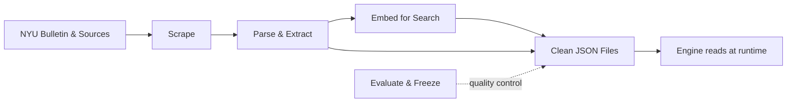
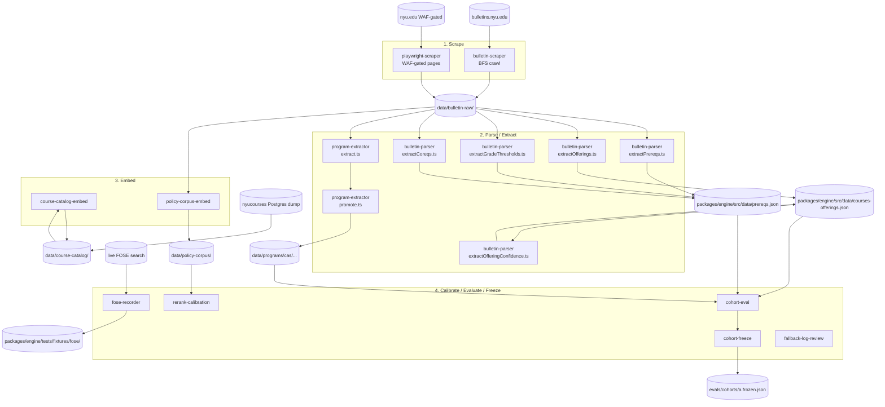

# `tools/` — The Build-Time Data Pipeline

## TL;DR

These tools are the kitchen staff that prep the ingredients before the restaurant opens — they never run while a student is using the app. Each tool is a small standalone script that does one job: scrape NYU's online bulletin pages, parse course descriptions to figure out prerequisites and when classes are typically offered, pull program requirements out of bulletin text using AI, or generate the search indexes the engine uses to find courses and policies. The output of all this work is a pile of clean JSON files that get checked into the repository, and at runtime the engine simply reads those finished files. Engineers run these scripts by hand or in CI when NYU updates its bulletin, when a new program needs to be added, or when policy text changes. There is also tooling here for testing and quality control — running the engine against fixed test cases, freezing those test cases so they cannot drift silently, and reviewing logs of edge cases. The key thing to remember: nothing in this folder is alive at runtime. It all produces inputs, and the engine consumes those inputs later.

---

## 1. Overview

Everything under `/Users/edoardomongardi/Desktop/Ideas/NYU Path/tools/` is **build-time**, not runtime. Each subdirectory is a self-contained script (Python or `npx tsx`) operated by hand or in CI. None of them are imported by the engine, the CLI, or the web app at runtime — they produce the JSON files that the engine then loads from `packages/engine/src/data/`, `data/course-catalog/`, `data/programs/`, `data/schools/`, `data/policy-corpus/`, `data/policy_templates/`, and `data/transfers/`.

The pipeline runs in roughly four bands:

1. **Scrape** raw bulletin and NYU.edu pages into local mirrored markdown / HTML.
2. **Parse / extract** structured JSON out of the markdown (prereqs, offerings, programs).
3. **Embed** for semantic search (course descriptions and the policy corpus).
4. **Calibrate / evaluate / freeze** the resulting system (rerank thresholds, cohort evals, frozen snapshots, fallback-log triage).

A separate tool (`fose-recorder`) captures live FOSE responses for fixture-style testing of the section-materializer.

The full tool inventory:

| Tool | Language | Purpose |
| --- | --- | --- |
| `bulletin-scraper` | Python | BFS-crawl `bulletins.nyu.edu` into local markdown. |
| `bulletin-parser` | TypeScript | Regex + LLM extraction of prereqs, offerings, grade thresholds, coreqs, exam equivalencies, offering confidence. |
| `program-extractor` | TypeScript | LLM-driven extraction of program-requirement JSONs from bulletin pages, with a separate human-promotion step. |
| `course-catalog-embed` | Node ESM | Build OpenAI embeddings of course descriptions. |
| `policy-corpus-embed` | TypeScript | Build OpenAI embeddings of the policy markdown corpus. |
| `fose-recorder` | TypeScript | Record real FOSE search responses as test fixtures. |
| `rerank-calibration` | TypeScript | A/B-compare lexical-only vs Cohere reranker on policy queries. |
| `cohort-eval` | TypeScript | Run multiple bake-off / baseline / adversarial cohort evals. |
| `cohort-freeze` | TypeScript | Hash-and-freeze cohort eval-set snapshots so silent edits fail CI. |
| `fallback-log-review` | TypeScript | Summarize the engine's `fallback_log.jsonl` for the review meeting. |
| `playwright-scraper` | Python (Playwright) | Browser-driven scraper for WAF-gated nyu.edu pages. |

## 2. Per-Tool Summary

### 2.1 `bulletin-scraper` (`tools/bulletin-scraper/scrape_bulletin.py`)

A Python BFS crawler that walks `bulletins.nyu.edu` from the root, follows every internal link, and mirrors the URL path structure into `data/bulletin-raw/`. Each page is saved as `_index.html` (raw) and `_index.md` (markdownified with a frontmatter block carrying `url`, `title`, and `scraped_at`). Skip-substrings exclude assets, social media, and the dynamic class-search / archive paths. The script keeps progress in `.scrape_progress.json` so `--resume` picks up where it left off.

- **Inputs:** the live `https://bulletins.nyu.edu/` site.
- **Outputs:** `data/bulletin-raw/**/(_index.html, _index.md)`.
- **Used by:** the parser layer (bulletin-parser, program-extractor) and the policy-corpus embedder.

### 2.2 `bulletin-parser`

A folder of focused extractors that read `data/bulletin-raw/courses/<dept>_<suffix>/_index.md` and write to `packages/engine/src/data/prereqs.json` (or `courses-offerings.json`). Files of note:

- `extractPrereqs.ts` — LLM-driven prereq extraction using the Anthropic SDK; loads `.env.local`, walks the in-scope course suffixes (`ua`, `ub`, `ue`, `uh`, `ut`, `uy`, `shu`), and produces `PrereqGroup` shapes. Has a smoke output at `/tmp/prereqs.smoke.json` for testing.
- `extractOfferings.ts` — purely deterministic regex; chunks each dept's markdown by the `**<COURSE-ID>**` heading pattern, finds the "Typically offered" line, and emits `Term[]` arrays. No LLM. Output: `packages/engine/src/data/courses-offerings.json`.
- `extractOfferingConfidence.ts` — runs after offerings; counts a course's appearance in the last 4 same-season terms, assigns a `ConfidenceTier` (`historically_likely` / `historically_partial` / `irregular`), then a second pass scans the bulletin chunk for permission-only / major-restricted enrollment signals and overrides where found.
- `extractGradeThresholds.ts` — regex-only, extracts the "with a Minimum Grade of X" annotations and writes them into `prereqs.json` as a per-entry `minGrades` map.
- `extractCoreqs.ts` — LLM-assisted coreq extractor; runs a cheap regex pre-filter first, only calls the LLM for courses whose chunk contains coreq language, and skips courses already having non-empty coreqs.
- `syntheticCourseIds.ts` — mints synthetic course IDs for AP / IB exam-with-score equivalencies referenced inside prereq strings (`AP-<SUBJECT>-<SCORE>`, `IB-<SUBJECT>-<LEVEL>-<SCORE>`).
- `validateCurated.ts` and `validatePrereqs.ts` — verify the parser output against a 16-course curated "ground truth" snapshot. `validatePrereqs.ts` is the strict canary that fails CI on any drift.

- **Inputs:** `data/bulletin-raw/courses/*/_index.md`.
- **Outputs:** `packages/engine/src/data/prereqs.json` and `courses-offerings.json`.

### 2.3 `program-extractor` (`tools/program-extractor/extract.ts` + `promote.ts`)

A two-step program-requirement extractor:

- `extract.ts` reads a bulletin markdown file, calls the production LLM via `OpenAIEngineClient` using `tools/program-extractor/prompt.md`, validates the returned JSON against the engine's `programBodySchema`, and writes the candidate to `data/programs/_candidates/<programId>.json`.
- `promote.ts` is the human-in-the-loop step. The candidate is **not** auto-promoted into `data/programs/<school>/` — a human spot-checker runs `promote.ts` with `--spotCheckedBy <name>`, which validates again and moves the file.

This is the "T2" tier in the architecture: LLM-extracted, manually verified, deterministic at runtime.

- **Inputs:** A bulletin markdown file, plus the `prompt.md` template.
- **Outputs:** `data/programs/_candidates/<id>.json` → after promotion → `data/programs/<school>/<id>.json`.

### 2.4 `course-catalog-embed` (`tools/course-catalog-embed/embed.mjs`)

A Node ESM script that reads `data/course-catalog/course_descriptions.json` (17,122 courses dumped from a `nyucourses` Postgres) and produces a JSONL of OpenAI `text-embedding-3-small` embeddings at `data/course-catalog/course_embeddings_openai.jsonl`, plus a `.meta.json` sibling carrying model id, dimension, embed timestamp, row count, source hash, and format. JSONL because the full array would exceed V8's `JSON.stringify` string-length limit. Re-runs are resumable — already-embedded course codes are skipped.

- **Inputs:** `data/course-catalog/course_descriptions.json`, `OPENAI_API_KEY`.
- **Outputs:** `data/course-catalog/course_embeddings_openai.jsonl` + `course_embeddings_openai.meta.json`.

### 2.5 `policy-corpus-embed` (`tools/policy-corpus-embed/embed.ts`)

Reads the policy markdown via the engine's `buildCorpus`, re-embeds every chunk with OpenAI `text-embedding-3-small`, and writes JSONL one `{chunk, embedding}` row per line to `data/policy-corpus/policy_chunks.jsonl`, plus a companion meta. At runtime the engine's `loadPolicyCorpusFromCache` hydrates a VectorStore from this cache so cold-start does not re-embed.

- **Inputs:** the engine's `buildCorpus` (reads bulletin markdown), `OPENAI_API_KEY`.
- **Outputs:** `data/policy-corpus/policy_chunks.jsonl` + `policy_chunks.meta.json`.

### 2.6 `fose-recorder` (`tools/fose-recorder/recordFixtures.ts`)

A one-off recorder that hits live FOSE for ~28 representative queries and saves each raw JSON response under `packages/engine/tests/fixtures/fose/`. Used by the section-materializer's tests as ground-truth — without this, the `meets`-string parser and the `meetingTimes` array parser would have to be designed blind. Documents the actual FOSE response shape: `meets` (human-readable, e.g. `TR 8-9:15a`), `meetingTimes` (JSON-string array with `meet_day` 0-4 and `HHMM` `start_time` / `end_time`), `crn`, `instr`, `schd`, `no`.

- **Inputs:** live FOSE.
- **Outputs:** `packages/engine/tests/fixtures/fose/*.json`.

### 2.7 `rerank-calibration` (`tools/rerank-calibration/compare.ts`)

Runs N realistic policy queries through the live OpenAI vector search, then reranks the same candidate sets with both `LocalLexicalReranker` and `CohereReranker` v3.5, and dumps a side-by-side markdown comparison so an operator can see whether Cohere is actually pulling more relevant chunks. The output lands in `tools/rerank-calibration/results.md`.

- **Inputs:** the engine's policy corpus cache, `OPENAI_API_KEY`, `COHERE_API_KEY`.
- **Outputs:** `tools/rerank-calibration/results.md`.

### 2.8 `cohort-eval`

A grab-bag of bake-off, baseline, adversarial, and surrogate-evaluation scripts. Each `run*.ts` runs the engine end-to-end against a frozen cohort of test cases. Files include:

- `runBakeoffPhase8.ts`, `runSurrogateW8.ts`, `analyzeW8.ts` — Phase 8 bake-off and Week-8 surrogate analysis.
- `runF4ValidatorTradeoff.ts` — the F4 validator tradeoff scan.
- `runPhase10Baseline.ts`, `runPhase10MethodB.ts`, `runPhase10Adversarial.ts`, `runPhase10Spot.ts` — Phase 10 measurement bench against the 26-case edge-case cohort, with a methods comparison and an adversarial variant.
- `runSmokeW10.ts` — a fast smoke run.
- `renderPhase10Comparison.ts` — composes the phase-comparison markdown.
- `results/` — output directory.

These produce per-case JSON, markdown summaries (PASS/FAIL grids), and section A/B breakdowns the team reads in review meetings.

- **Inputs:** evals/cohorts case fixtures, the engine package, the relevant API keys.
- **Outputs:** under `tools/cohort-eval/results/` (per-case JSON + markdown summaries).

### 2.9 `cohort-freeze` (`tools/cohort-freeze/freeze.ts`)

The "lock" step on top of cohort-eval. The CLI takes either `freeze a` (write `evals/cohorts/a.frozen.json` with the current case set's sha256 plus a `--note`) or `verify a` (recompute the hash and report any mismatch). The cohort registry currently has one entry, `cohort_a`. Once frozen, silent edits to the cohort file fail CI because the hash changes.

- **Inputs:** `evals/cohorts/cohort_a.ts`.
- **Outputs:** `evals/cohorts/a.frozen.json`.

### 2.10 `fallback-log-review` (`tools/fallback-log-review/review.ts`)

Pure JSONL parser + aggregator that reads `fallback_log.jsonl` and emits the human-readable summary the daily / weekly review meeting walks through. Sections: total events + unique correlation IDs + time range, per-kind counts, top 10 unsupported tools, top 10 model-fallback triggers, and per-correlationId narratives for the worst-case turns. Importantly engine-free — the script duplicates the `FallbackEvent` interface inline so it can run in CI without building the engine workspace.

- **Inputs:** A fallback-log JSONL path, optional `--since <ISO>`.
- **Outputs:** stdout text report.

### 2.11 `playwright-scraper` (`tools/playwright-scraper/scrape_nyu_edu.py`)

A Playwright/Chromium scraper for the `nyu.edu/students/...` and `nyu.edu/admissions/...` paths that the `requests`-based `bulletin-scraper` cannot reach because of AWS WAF JS-challenge gating. Scope is bounded by a path-prefix allowlist passed via `--prefix` so the crawler does not run away into all of nyu.edu. Output mirrors `data/bulletin-raw/`'s convention (`_index.html` + `_index.md` with the same frontmatter block).

- **Inputs:** A `--seed` URL, a `--prefix` allowlist, an `--output-subdir`.
- **Outputs:** `data/bulletin-raw/<subdir>/**`.

## 3. Pipeline Map — Raw Bulletin to Runtime JSON

## 4. Where the Produced Data Lives

The tools land their outputs into the following on-disk locations (also see `data-directory.md`):

| Pipeline output | Destination |
| --- | --- |
| Raw bulletin mirror | `data/bulletin-raw/` |
| Course-catalog dump and embeddings | `data/course-catalog/course_descriptions.json`, `course_embeddings_openai.jsonl`, `course_embeddings_openai.meta.json` |
| Policy-corpus embeddings | `data/policy-corpus/policy_chunks.jsonl`, `policy_chunks.meta.json` |
| Program JSONs | `data/programs/_candidates/` (pre-promotion), `data/programs/<school>/` (live) |
| School configs (hand-authored — not tool output) | `data/schools/<id>.json` |
| Transfer configs (hand-authored) | `data/transfers/*.json` |
| Policy templates (hand-authored) | `data/policy_templates/*.json` |
| Prereqs JSON | `packages/engine/src/data/prereqs.json` |
| Offerings JSON | `packages/engine/src/data/courses-offerings.json` |
| FOSE fixtures | `packages/engine/tests/fixtures/fose/` |
| Cohort freeze hash | `evals/cohorts/a.frozen.json` |

At runtime, the engine's loaders under `packages/engine/src/data/` (programLoader, schoolConfigLoader, transferLoader, tierLoader, departmentLoader, catalogYearLoader) and the RAG layer (`buildCorpus`, `loadPolicyCorpusFromCache`, `loadPolicyTemplates`) read these files. None of the tools above are imported by the runtime — every file in this directory is a build-time producer.
