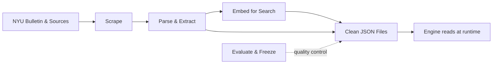
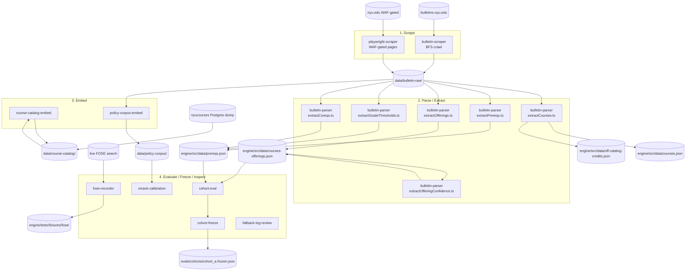

# `tools/` — The Build-Time Data Pipeline

> Last verified against code: 2026-06-10 (post planning-engine rebuild, PRs #35-#41).

## Purpose

These tools are the kitchen staff that prep the ingredients before the restaurant opens — they never run while a student is using the app. Each tool is a small standalone script that does one job: scrape NYU's online bulletin pages, parse course descriptions to figure out prerequisites/offerings, or generate the search embeddings the engine uses to find courses and policies. The output is a pile of JSON files that get read at runtime — some bundled inside the engine (`packages/engine/src/data/`), some under the repo-root `data/`. Engineers run these scripts by hand or in CI when NYU updates its bulletin or when policy text changes. There is also tooling for quality control — running the engine against frozen cohorts, freezing those cohorts so they cannot drift silently, reviewing fallback logs, and a couple of dev probes for the RAG and solver paths. The key thing to remember: nothing in this folder is alive at runtime. It all produces inputs (or inspects outputs), and the engine consumes those inputs later.

---

## 1. Overview

Everything under `tools/` is **build-time**, not runtime. Each subdirectory (or top-level script) is a self-contained script (Python or `npx tsx`) operated by hand or in CI. None are imported by the engine, CLI, or web app at runtime. They produce the JSON files the engine then loads from `packages/engine/src/data/`, `data/course-catalog/`, `data/policy-corpus/`, and `data/schools/` (hand-authored; see [data-directory.md](./data-directory.md)).

The pipeline runs in roughly four bands:
1. **Scrape** raw bulletin and NYU.edu pages into local mirrored markdown / HTML.
2. **Parse / extract** structured JSON out of the markdown (courses, prereqs, offerings, coreqs, grade thresholds).
3. **Embed** for semantic search (course descriptions and the policy corpus).
4. **Evaluate / freeze / inspect** the resulting system (cohort evals, frozen snapshots, fallback-log triage, rerank calibration, live dev probes).

A separate tool (`fose-recorder`) captures live FOSE responses as fixtures for the section-materializer's tests.

> Removed since the 2026-06-03 doc: the **`program-extractor`** tool is gone. Program-requirement JSONs are no longer extracted into a runtime pipeline; degree requirements come from the per-student DPR. The old `data/programs/cas/cas_econ_ba.json` survives only as a sample artifact.

The current tool inventory:

| Tool | Language | Purpose |
| --- | --- | --- |
| `bulletin-scraper` | Python | BFS-crawl `bulletins.nyu.edu` into local markdown. |
| `bulletin-parser` | TypeScript | Regex + LLM extraction of courses, prereqs, offerings, offering confidence, grade thresholds, coreqs. |
| `course-catalog-embed` | Node ESM | Build OpenAI embeddings of course descriptions. |
| `policy-corpus-embed` | TypeScript | Build OpenAI embeddings of the policy markdown corpus. |
| `fose-recorder` | TypeScript | Record real FOSE search responses as test fixtures. |
| `rerank-calibration` | TypeScript | A/B-compare lexical-only vs Cohere reranker on policy queries. |
| `cohort-eval` | TypeScript | Run bake-off / baseline / adversarial cohort evals. |
| `cohort-freeze` | TypeScript | Hash-and-freeze cohort eval-set snapshots so silent edits fail CI. |
| `fallback-log-review` | TypeScript | Summarize the engine's `fallback_log.jsonl` for the review meeting. |
| `playwright-scraper` | Python (Playwright) | Browser-driven scraper for WAF-gated nyu.edu pages. |
| `live-rag-test.ts` | TypeScript | Dev rig: run the real agent loop over policy questions end-to-end. |
| `retrieval-probe.ts` | TypeScript | Dev rig: show exactly what `search_policy` retrieves for a query set. |

> Note: `tools/live-rag-test.ts` and `tools/retrieval-probe.ts` are loose top-level scripts (not subdirectories). A third no-LLM repro harness lives outside `tools/`, at `packages/engine/scripts/diagnoseInfeasible.ts` — see §3.

## 2. Per-Tool Summary

### 2.1 `bulletin-scraper` (`tools/bulletin-scraper/scrape_bulletin.py`)

A Python BFS crawler that walks `bulletins.nyu.edu` from the root, follows every internal link, and mirrors the URL path into `data/bulletin-raw/`. Each page is saved as `_index.html` (raw) and `_index.md` (markdownified, with `url`/`title`/`scraped_at` frontmatter). Skip-substrings exclude assets and dynamic search paths; `.scrape_progress.json` lets `--resume` pick up where it left off. A sibling `verify_coverage.py` checks crawl coverage.

- **Inputs:** the live `https://bulletins.nyu.edu/` site.
- **Outputs:** `data/bulletin-raw/**/(_index.html, _index.md)`.

### 2.2 `bulletin-parser`

A folder of focused extractors that read `data/bulletin-raw/courses/<dept>_<suffix>/_index.md`. Files of note:

- `extractCourses.ts` — **deterministic, no LLM.** Regex-splits each dept page into per-course chunks and extracts the fields the forward planner needs (title, credits, terms) plus extras (grading, repeatable-for-credit). Writes the undergrad-scoped `Course[]` to `packages/engine/src/data/courses.json` AND the grad/professional `off-catalog-credits.json` map. Prereqs are intentionally skipped here.
- `extractPrereqs.ts` — LLM-driven prereq extraction (Anthropic SDK); loads `.env.local`, walks the in-scope course suffixes (`ua`, `ub`, `ue`, `uh`, `ut`, `uy`, `shu`), produces `PrereqGroup` shapes into `prereqs.json`.
- `extractOfferings.ts` — purely deterministic regex; chunks each dept by the `**<COURSE-ID>**` heading, finds the "Typically offered" line, emits `Term[]`. Output: `packages/engine/src/data/courses-offerings.json`.
- `extractOfferingConfidence.ts` — runs after offerings; counts a course's appearance in the last 4 same-season terms, assigns a `ConfidenceTier` (`historically_likely` / `historically_partial` / `irregular`), then a second pass scans for permission-only / restricted enrollment signals and overrides where found.
- `extractGradeThresholds.ts` — regex-only; extracts "with a Minimum Grade of X" annotations into `prereqs.json` as a per-entry `minGrades` map.
- `extractCoreqs.ts` — LLM-assisted coreq extractor; runs a cheap regex pre-filter and only calls the LLM for chunks containing coreq language; skips courses already having non-empty coreqs; extends the `coreqs` field on existing `prereqs.json` entries.
- `syntheticCourseIds.ts` — mints synthetic course IDs for AP / IB exam-with-score equivalencies referenced inside prereq strings (`AP-<SUBJECT>-<SCORE>`, `IB-<SUBJECT>-<LEVEL>-<SCORE>`).
- `validatePrereqs.ts` — the strict canary; asserts the 16-course curated "ground truth" prereq set is byte-equivalent (under normalization) to a snapshot, so any drift in `prereqs.json` fails CI.
- `validateCurated.ts` — **NEW, untracked** (added during the rebuild). An LLM-assisted curated-prereq validator using the Anthropic SDK directly: it re-parses the curated courses with Claude and compares against the curated ground truth, as a softer companion to the strict `validatePrereqs.ts`.

- **Inputs:** `data/bulletin-raw/courses/*/_index.md`.
- **Outputs:** `packages/engine/src/data/courses.json`, `prereqs.json`, `courses-offerings.json`, `off-catalog-credits.json`.

### 2.3 `course-catalog-embed` (`tools/course-catalog-embed/embed.mjs`)

A Node ESM script that reads `data/course-catalog/course_descriptions.json` (17,122 courses dumped from a `nyucourses` Postgres) and produces a JSONL of OpenAI `text-embedding-3-small` embeddings at `data/course-catalog/course_embeddings_openai.jsonl`, plus a `.meta.json` sibling (model id, dimension, embed timestamp, row count, source hash, format). JSONL because the full array would exceed V8's `JSON.stringify` cap. Re-runs are resumable — already-embedded course codes are skipped.

- **Inputs:** `course_descriptions.json`, `OPENAI_API_KEY`.
- **Outputs:** `course_embeddings_openai.jsonl` + `course_embeddings_openai.meta.json`.

### 2.4 `policy-corpus-embed` (`tools/policy-corpus-embed/embed.ts`)

Reads the policy markdown via the engine's `buildCorpus`, re-embeds every chunk with OpenAI `text-embedding-3-small`, and writes JSONL (one `{chunk, embedding}` row per line) to `data/policy-corpus/policy_chunks.jsonl`, plus a companion meta. At runtime the engine's `loadPolicyCorpusFromCache` hydrates a `VectorStore` from this cache so cold start does not re-embed.

- **Inputs:** the engine's `buildCorpus` (reads bulletin markdown), `OPENAI_API_KEY`.
- **Outputs:** `data/policy-corpus/policy_chunks.jsonl` + `policy_chunks.meta.json` (currently 14,273 chunks).

### 2.5 `fose-recorder` (`tools/fose-recorder/recordFixtures.ts`)

A one-off recorder that hits live FOSE for ~28 representative queries and saves each raw JSON response under `packages/engine/tests/fixtures/fose/`. Used by the section-materializer's tests as ground truth. Documents the FOSE response shape: `meets` (human-readable, e.g. `TR 8-9:15a`), `meetingTimes` (JSON-string array with `meet_day` 0-4 and `HHMM` `start_time` / `end_time`), `crn`, `instr`, `schd`, `no`.

- **Inputs:** live FOSE.
- **Outputs:** `packages/engine/tests/fixtures/fose/*.json`.

### 2.6 `rerank-calibration` (`tools/rerank-calibration/compare.ts`)

Runs realistic policy queries through the live OpenAI vector search, then reranks the same candidate sets with both `LocalLexicalReranker` and `CohereReranker` v3.5, and dumps a side-by-side markdown comparison. This is a **historical** calibration rig — the engine's reranker selection is settled; it is kept for one-off re-checks.

- **Inputs:** the engine's policy corpus cache, `OPENAI_API_KEY`, `COHERE_API_KEY`.
- **Outputs:** `tools/rerank-calibration/results.md`.

### 2.7 `cohort-eval`

A grab-bag of bake-off, baseline, adversarial, and surrogate-evaluation scripts. Each `run*.ts` runs the engine end-to-end against a frozen cohort. Files include `runBakeoffPhase8.ts`, `runSurrogateW8.ts`, `analyzeW8.ts`, `runF4ValidatorTradeoff.ts`, the Phase-10 bench (`runPhase10Baseline.ts`, `runPhase10Adversarial.ts`, `runPhase10Spot.ts`), `runSmokeW10.ts`, `renderPhase10Comparison.ts`, and a `results/` output directory. These produce per-case JSON, PASS/FAIL grids, and A/B breakdowns read in review meetings.

- **Inputs:** cohort case fixtures (`evals/cohorts/`), the engine package, the relevant API keys.
- **Outputs:** `tools/cohort-eval/results/`.

### 2.8 `cohort-freeze` (`tools/cohort-freeze/freeze.ts`)

The "lock" step on top of cohort-eval. The CLI takes `freeze a` (write `evals/cohorts/cohort_a.frozen.json` with the current case set's sha256 plus a `--note`) or `verify a` (recompute and report any mismatch). The registry currently has one entry, `cohort_a`. Once frozen, silent edits fail CI because the hash changes.

- **Inputs:** `evals/cohorts/cohort_a.ts`.
- **Outputs:** `evals/cohorts/cohort_a.frozen.json`.

### 2.9 `fallback-log-review` (`tools/fallback-log-review/review.ts`)

Pure JSONL parser + aggregator over `fallback_log.jsonl`. Emits a human-readable summary: total events + unique correlation IDs + time range, per-kind counts, top unsupported tools, top model-fallback triggers, and per-correlationId narratives for the worst turns. Deliberately engine-free — it duplicates the `FallbackEvent` interface inline so it can run in CI without building the engine.

- **Inputs:** a fallback-log JSONL path, optional `--since <ISO>`.
- **Outputs:** stdout text report.

### 2.10 `playwright-scraper` (`tools/playwright-scraper/scrape_nyu_edu.py`)

A Playwright/Chromium scraper for the `nyu.edu/students/...` and `nyu.edu/admissions/...` paths the `requests`-based `bulletin-scraper` cannot reach (AWS WAF JS-challenge gating). Scope is bounded by a `--prefix` allowlist. Output mirrors `data/bulletin-raw/`'s convention.

- **Inputs:** a `--seed` URL, a `--prefix` allowlist, an `--output-subdir`.
- **Outputs:** `data/bulletin-raw/<subdir>/**`.

## 3. Dev Rigs and Repro Harnesses

Three scripts are developer-only inspection rigs rather than data producers:

- `tools/live-rag-test.ts` — loads the OpenAI-embedded policy corpus + the real Claude agent loop and runs multi-section policy questions (OGS visa, school transfer, add/drop major-minor) end-to-end, printing each answer + the tools called, for comparison against an independently-reasoned ground truth.
- `tools/retrieval-probe.ts` — retrieval-only probe: for a fixed query set, dumps exactly what `search_policy` surfaces (top reranked hits + the full reassembled section), so a failure can be diagnosed as retrieval-side vs LLM-side.
- `packages/engine/scripts/diagnoseInfeasible.ts` — **NEW, untracked** no-LLM repro harness. Reproduces the live forward-schedule for the `SAA_STD_DS.pdf` DPR fixture without going through the LLM: parses the DPR, builds the `StudentProfile`, runs `buildForwardSchedule` + `runGraduationPathValidator`, and dumps the temporal context, solver input summary, `ForwardSchedule.state`, feasibility violations, and per-term slots. Used to debug infeasible-plan reports against the live DPR fixture.

## 4. Pipeline Map — Raw Bulletin to Runtime JSON

## 5. Where the Produced Data Lives

| Pipeline output | Destination |
| --- | --- |
| Raw bulletin mirror | `data/bulletin-raw/` |
| Course-catalog dump and embeddings | `data/course-catalog/course_descriptions.json`, `course_embeddings_openai.jsonl`, `course_embeddings_openai.meta.json` |
| Policy-corpus embeddings | `data/policy-corpus/policy_chunks.jsonl`, `policy_chunks.meta.json` |
| School configs (hand-authored — not tool output) | `data/schools/<id>.json` |
| Courses JSON | `packages/engine/src/data/courses.json` |
| Off-catalog credits JSON | `packages/engine/src/data/off-catalog-credits.json` |
| Prereqs JSON | `packages/engine/src/data/prereqs.json` |
| Offerings JSON | `packages/engine/src/data/courses-offerings.json` |
| FOSE fixtures | `packages/engine/tests/fixtures/fose/` |
| Cohort freeze hash | `evals/cohorts/cohort_a.frozen.json` |

At runtime, the engine's `dataLoader.ts` reads the bundled `packages/engine/src/data/` JSONs, `schoolConfigLoader.ts` reads `data/schools/`, and the RAG layer (`buildCorpus`, `loadPolicyCorpusFromCache`, the semantic course-search adapter) reads the corpora — see [data-directory.md](./data-directory.md). None of the tools above are imported by the runtime; every file in `tools/` is a build-time producer or an offline inspection rig.
