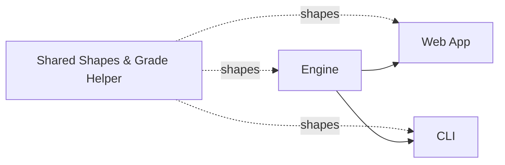

# `packages/shared` — The Type Contract

> Last verified against code: 2026-06-13 (doc-sync pass: removed deleted `PlanChangeProposal`; added D6.2 `GenericSoftConstraint` + `softObjectives` + the two soft-objective `PlanMutation` kinds; refreshed §3.10 line anchors + `types.ts` line count).

## Purpose

This is the shared vocabulary that lets the engine and the web app speak the same language. It is a tiny package containing only data-shape definitions (what a student looks like, what a course looks like, what an audit result looks like, what a forward schedule looks like) plus a small helper for comparing letter grades and normalizing school ids. There is no logic here, no AI, no file reading, no behavior at all — just agreed-upon shapes. It exists so the web app can display an audit or a forward plan without importing the entire heavy engine (with its AI client and big data files). Whenever anyone changes a field on a student record or adds a new kind of plan output, this is where that change is written down so both sides stay in sync. If the engine and the web app are two people working together, this package is the contract they both signed.



---

## 1. Overview

`@nyupath/shared` is the single source of truth for the data shapes flowing between the engine, the CLI, and the web app. It is intentionally tiny: three source files (`index.ts`, `types.ts`, `grades.ts`) plus a single compile-time test. Everything in it is either a `type`/`interface` declaration or a pure utility — no I/O, no engine logic, no LLM, no runtime configuration. If a type appears in more than one workspace, it lives here.

The package contents (`packages/shared/src/`):

| File | Lines | Purpose |
| --- | --- | --- |
| `index.ts` | 2 | Barrel: re-exports `./types.js` and `./grades.js`. |
| `types.ts` | 1366 | Every shared TypeScript type / interface / discriminated union. |
| `grades.ts` | 74 | Letter-grade ordering, `gradesAtOrAbove`, `canonicalSchoolId`. |
| `types.heuristicMappingGuard.compile.test.ts` | 36 | A compile-time guard ensuring the `HEURISTIC_MAPPING` assumption stays soft-only. |

`packages/shared/src/index.ts:1-2` does exactly two `export *` statements, so a consumer imports from `@nyupath/shared` and gets the full surface.

## 2. Why It Lives Separately

Both the engine package and the web app need to talk about students, courses, programs, audit results, and forward schedules. If those types lived inside the engine, the web app would either have to depend on the entire engine (its LLM client, its data bundle, its RAG stack) just to render an audit, or duplicate the types and let them drift. Pulling them into `@nyupath/shared` gives every workspace a lightweight type-only dependency.

There is no runtime code coupled to the engine in this package, which is why the CLI and web app can import shared types without dragging in `Anthropic`, `OpenAI`, embeddings, or any of the engine's data files.

## 3. Types — The Inventory

The types in `types.ts` divide into roughly the cohorts below. Each interface is listed with its field shape (described in plain language; see the cited line range for the exact TypeScript). Line numbers are current as of 2026-06-10.

> Many fields the original (2026-06-03) doc listed on `SchoolConfig`, `ResidencyConfig`, and `PassFailConfig` were **removed in Step 8e** when school-level scalars moved to the per-student DPR. Those removals are called out inline below.

### 3.1 Course Catalog

**`Course`** — `types.ts:7-32`. A single catalog entry.
- `id` — course identifier such as `CSCI-UA 102`.
- `title`, `credits` (planning credits = the MAX of a variable-credit range).
- `departments[]`, `crossListed[]`, `exclusions[]`.
- `termsOffered[]` — `"fall" | "spring" | "summer" | "january"`.
- `catalogYearsActive` — a `[startYear, endYear]` tuple.
- Step-8d bulletin extras (optional; the curated stub omits them): `creditsMin?`, `creditsMax?`, `grading?`, `repeatableForCredit?`.

### 3.2 Prerequisites

**`PrereqGroup`** — `types.ts:62-67`. One AND/OR/NOT clause attached to a course. `type`, `courses[]` (empty for `NOT`), `requiresPetition?`, `notCourses?`.

**`Prerequisite`** — `types.ts:69-91`. One entry-level record per course: `course`, `prereqGroups[]`, `coreqs[]`, and `minGrades?` (courseId → minimum letter grade, sourced by `tools/bulletin-parser/extractGradeThresholds.ts`).

### 3.3 Rules and Programs

**`RuleType`** — `types.ts:95`. `"must_take" | "choose_n" | "min_credits" | "min_level"`.

**`DoubleCountPolicy`** — `types.ts:96`. `"allow" | "limit_1" | "disallow"`.

**`BaseRule`** — `types.ts:98-111`. `ruleId`, `label`, `type`, `doubleCountPolicy`, `catalogYearRange`, `conditionalExemption?`, `flagExemption?`, `exemptionLabel?`.

**`MustTakeRule`** — `types.ts:114-117`. `BaseRule` plus `courses[]`.

**`ChooseNRule`** — `types.ts:119-132`. `BaseRule` plus `n`, `fromPool[]`, `excludeFromPool?`, `minLevel?`, `mathSubstitutionPool?`, `maxMathSubstitutions?`.

**`MinCreditsRule`** — `types.ts:135-141`. `BaseRule` plus `minCredits`, `fromPool[]`, `excludeFromPool?`.

**`MinLevelRule`** — `types.ts:144-151`. `BaseRule` plus `minLevel`, `minCount`, `fromPool[]`, `excludeFromPool?`.

**`Rule`** — `types.ts:153`. Tagged union over the four kinds.

**`Program`** — `types.ts:157-166`. `programId`, `name`, `catalogYear`, `school`, `department`, `totalCreditsRequired`, `rules[]`.

> Known limitation: the `Program` shape still exists and is used by the program-extractor's Zod body schema, but at runtime the engine no longer loads static program JSONs to drive audits — degree requirements come from the per-student DPR (see [data-directory.md](./data-directory.md) §"Programs"). Only `data/programs/cas/cas_econ_ba.json` remains on disk as a sample artifact.

### 3.4 School Configuration

**`ProgramType`** — `types.ts:174`. `"major" | "minor" | "concentration"`.

**`ProgramDeclaration`** — `types.ts:176-185`. `programId`, `programType`, `declaredAt?`, `declaredUnderCatalogYear?`.

**`ResidencyType`** — `types.ts:193`. `"suffix_based" | "total_nyu_credits"`.

**`ResidencyConfig`** — `types.ts:195-207`. `type?`, `suffix?`, `finalCreditsInResidence?`, `majorMinorResidencyPercent?`, `note?`. **Step 8e removed `minCredits`** — the residency credit minimum is now per-student in the DPR (`dpr.cumulative.residencyRequired`).

**`CreditCapType`** — `types.ts:209-216`. `non_home_school`, `online`, `transfer`, `advanced_standing`, `independent_study`, `internship`, `specific_school`.

**`CreditCap`** — `types.ts:218-248`. One row of a school's credit-cap table. Includes `maxCredits`, `maxCourses`, `maxPerDepartment`, `schoolId`, `subtype`, the newer `appliesTo?` (division/degree scope for multi-unit schools like SPS), `label`, `excludes[]`, `includesInternship`, `gpaMinimum`, `additionalRules[]`.

**`CareerLimitType`** — `types.ts:250`. `"credits" | "courses" | "percent_of_program"`.

**`PerTermUnit`** — `types.ts:251`. `"semester" | "academic_year"`.

**`PassFailConfig`** — `types.ts:253-288`. School-wide P/F policy: `careerLimitType`, `careerLimitScope?`, `perTermLimit?`, `perTermUnit?`, `countsForMajor/Minor/GenEd?`, `creditType?`, `canElect?`, `autoExcludedFromLimit[]`, `excludedCourseTypes[]`, `gradePassEquivalent?`, `failCountsInGpa?`, `exceptions[]`, `warnings[]`, `note`. **Step 8e removed the career-limit *value*** (`careerLimit`); the number now comes from the DPR (`dpr.cumulative.passFailCapUnits`). Only the unit (`careerLimitType`) remains policy data here.

**`SpsPolicy`** — `types.ts:290-303`. `allowed` (master switch), `allowedPrefixes?`, `creditType?`, `countsTowardResidency?`, `countsAgainstNonHomeSchoolCap?`, `excludedCourseTypes?`.

**`DoubleCountingConfig`** — `types.ts:313-347`. Per-school double-counting limit, authored from the bulletin and **surfaced as a CITED advisory only — NOT enforced by the solver/validator**. Two complementary models: a `cap` (max shared courses for major-to-major / major-to-minor / minor-to-minor) and a `floor` (min distinct credits per major, min unique courses/credits per minor). Plus `noTripleCounting`, `requiresApproval`, `note?`, and a required `sourceRef` (the bulletin `path:line` it was read from). Re-introduced 2026-06-07 (PRs #38-#41, data + advisory, no enforcement — see `Docs/plans/31-2026-06-07-double-count-data-advisory.md`).

**`TransferCreditLimits`** — `types.ts:349-354`. `firstYearMaxTotal?`, `transferStudentMaxTotal?`, `springAdmitPostSecondaryMax?`.

**`GpaTierRow`** — `types.ts:369-374`. One row of a tiered minimum-cumulative-GPA table. `semestersCompleted: null` is the open-ended ">N" tier.

**`OverloadRequirement`** — `types.ts:376-387`. `condition`, `minGpa?`, `minSemesters?`, `minCreditsCompleted?`, `maxCredits?`, `note?`.

**`DeansListThreshold`** — `types.ts:389-394`. `minGpa`, `minCredits?`, `per?` (`"term" | "year"`), `note?`.

**`CompletionRatePolicy`** — `types.ts:403-432` (NEW, post-2026-06-03). A school's credit-completion-rate ("pace") academic-standing rule, present only for schools whose bulletin publishes one: `goodStandingThreshold`, `dismissalThreshold?`, `dismissalAfterSemesters?`, `basis?` (`"cumulative" | "annual" | "term"`). Distinct from federal SAP.

**`AdvisorNotation`** — `types.ts:509`. A structural mirror of the engine's DPR advisor-waiver shape: `requestId?`, `note`, `advisor?`, `date?`.

**`SchoolConfig`** — `types.ts:435-504`. Aggregates the above into the per-school config consumed at boot:
- Identity: `schoolId`, `name`. **Step 8e removed `degreeType`** (a school grants many degree types; the student's actual one is in the DPR).
- Course-id ownership: `courseSuffix[]`.
- Composed configs: `doubleCounting?`, `residency`, `creditCaps?`, `passFail?`, `spsPolicy?`, `transferCreditLimits?`.
- Registration: `maxCreditsPerSemester?`, `f1FullTimeMinCredits?`, `creditTargetPerSemester?`, `domesticPartTimeFloor?`.
- Standing: `overloadRequirements?`, `gpaTierTable?`, `finalProbationGpaFloor?`, `completionRatePolicy?`, `maxCourseRepeats?`, `deansListThreshold?`.
- **Step 8e removed**: `overallGpaMin`, `gradeThresholds`, `auditMode`, and the dead structural leftovers `sharedPrograms`, `programExclusions`, `supportedProgramTypes`, `lifecycle`, `advisingContact`, `milestones`, `acceptsTransferCredit`. The GPA floor and grade thresholds are now per-student (DPR) or answered via `search_policy` (RAG).

### 3.5 Student Profile

**`CourseTaken`** — `types.ts:511-526`. `courseId`, `grade` (now `string | null` — null when in-progress/ungraded), `semester`, `credits?`, `isOnline?`, `gradeMode?`, and the newer `isInProgress?` (DPR "IP" rows, excluded from GPA) and `repeatCode?` (DPR repeat codes like `"RI"`/`"R"`).

**`TransferCredit`** — `types.ts:528-537`. `source`, `scoreOrGrade`, `nyuEquivalent?`, `credits`.

**`StudentProfile`** — `types.ts:539-583`. `id`, `catalogYear`, `homeSchool` (required), `declaredPrograms[]`, `coursesTaken[]`, `transferCourses?`, `genericTransferCredits?`, `flags?[]`, the newer `advisorNotations?[]`, `visaStatus?`, `currentSemester?`, the suffix-based counters (`uaSuffixCredits`, `nonCASNYUCredits`, `onlineCredits`, `passfailCredits`), and `matriculationYear?`.

### 3.6 Audit Results

**`RuleStatus`** — `types.ts:587`. `"satisfied" | "in_progress" | "not_started"`.

**`RuleAuditResult`** — `types.ts:589-601`. `ruleId`, `label`, `status`, `coursesSatisfying[]`, `remaining`, `coursesRemaining[]`, `exemptReason?`.

**`AuditResult`** — `types.ts:603-615`. Identity + `overallStatus`, `totalCreditsCompleted`, `totalCreditsRequired`, `rules[]`, `warnings[]`.

### 3.7 Single-Semester Planner

> Known limitation: `PlannerConfig` / `CourseSuggestion` / `GraduationRisk` / `SemesterPlan` (`types.ts:619-688`) are the legacy single-semester planner shapes. The corresponding `plan_semester` tool was **removed** from the registry in the planning-engine rebuild; these types remain defined but are no longer driven by a live tool. See [tool-registry.md](../engine/tool-registry.md).

### 3.8 Offerings and Confidence Tiers

**`ConfidenceTier`** — `types.ts:700-706`. `"historically_likely" | "historically_partial" | "irregular" | "permission_only" | "restricted" | "confirmed"`.

**`OfferingEntry`** — `types.ts:716-722`. One row in `courses-offerings.json`: `termsOffered[]`, `rawLine`, `inferred`, `confidence?`.

### 3.9 Forward Planner

The largest cohort. The forward planner emits a multi-term schedule, and `@nyupath/shared` is where every shape it references lives.

**`DataSource`** — `types.ts:728`. `"DPR" | "FOSE" | "bulletin" | "program-rules" | "student-input"`.

**`ApprovalAuthority`** — `types.ts:729`. `"instructor" | "department" | "advisor" | "registrar" | "OGS" | "school-dean"`.

**`ValidationResult`** — `types.ts:731-735`. 4-state union: `pass` / `assumed-pass` / `requires-approval` / `fail`.

**`WorkloadTier`** — `types.ts:739-744`. `"major-required" | "major-elective" | "school-core" | "free-elective" | "general-elective"`.

**`LoadRationale`** — `types.ts:746-757`. `strategy`, `creditsTarget`, `slack`, `weightedCredits`, `hardCount`, `easyCount`, `alternativeDistributionsConsidered[]`.

**`Assumption`** — `types.ts:770-803`. Discriminated union: `IP_COURSE_COMPLETION`, `LLM_RANKED_ALTERNATIVE`, `HEURISTIC_MAPPING` (the last carries the literal `studentConstraintFraming: "soft"` enforced by the compile guard, and a `mappedToMutation: PlanMutation | null`).

**`PoolBinding`** — `types.ts:809-813`. `poolId`, `candidates[]`, `satisfiesRule`.

**`RequirementPoolSlot`** — `types.ts:815-833`. `bindingState` is `"unbound" | "candidate-set"`; `"bound"` is intentionally absent (a successful bind transitions the *parent* slot to `specific_planned`). A transient `bound?` field exists for transition staging.

**`FreeCreditSlot`** — `types.ts:835-849`. `defaultWeight: 0.3`, `bindingState: "placeholder-pending" | "placeholder-deferred"`.

**`AdvisingPlaceholderSlot`** — `types.ts:851-864`. `advisingNote`, `bindingState: "advisor-pending"`.

**`PlaceholderSlot`** — `types.ts:868-871`. Union over the three placeholder kinds.

**`TermConstraintKind`** — `types.ts:875-882`. `"prereqChain" | "offering" | "creditCeiling" | "creditSlack" | "creditFloor" | "visaFloor" | "coreqSameTerm"`.

**`TermConstraint`** — `types.ts:884-887`. `kind` + `detail`.

**`SlotRationale`** — `types.ts:889-898`. `satisfiesRequirements[]`, `termConstraints[]`, `consideredAlternatives[]`, `decisionsApplied[]`, `petitionTrigger?`.

**`SlotFlexibility`** — `types.ts:900-904`. `earliestPossibleTerm`, `latestPossibleTerm`, `alternativeCourses[]`.

**`DownstreamImpact`** — `types.ts:906-909`. `courseIds[]`, `graduationDelay` (terms).

**`ScheduleSlotKind`** — `types.ts:913`. `"completed" | "in_progress" | "specific_planned" | "placeholder"`.

**`ScheduleSlotCompleted`** — `types.ts:915-921`. Locked completed course with `grade`.

**`ScheduleSlotInProgress`** — `types.ts:923-928`. Currently-enrolled course.

**`ScheduleSlotSpecificPlanned`** — `types.ts:931-968`. A future term's pinned course with full rationale, `workloadTier` + `workloadWeight`, `bindingState: "bound"`, `confidence`, `isCriticalPath`, optional `optionalReason` / `approvalAuthority`, and optional concrete-section fields after a FOSE section is picked (`crn`, `meetingPatterns[]`, `instructor`, `schd`, `sectionNumber`).

**`ScheduleSlotPlaceholder`** — `types.ts:971-995`. Reserved-credits placeholder with rich rationale, `bindingState`, `placeholderId`, optional `poolBinding`.

**`ScheduleSlot`** — `types.ts:997-1001`. Union over the four kinds.

**`ForwardSemester`** — `types.ts:1005-1012`. `term`, `locked`, `slots[]`, `plannedCredits`, `notes[]`, `loadRationale`.

**`PlanState`** — `types.ts:1016-1020`. `"valid-clean" | "valid-with-trade-offs" | "infeasible-draft" | "student-preferred-invalid-draft"`.

**`AlternativePlanSummary`** — `types.ts:1025-1037`. Top-K alternative-plan summary (≤5): balance score, per-term weighted credits, per-term hard/easy counts, per-term subject distribution, distinct-subjects count, petition/assumption counts, graduation term, `topDiffsFromWinner[]`.

**`FeasibilityReport`** — `types.ts:1041-1062`. Per-axis feasibility. `constraintViolations[]` kinds: `prereq_unsatisfiable`, `offering_pattern`, `credit_floor`, `credit_ceiling`, `graduation_total`, `not_clause`, `pass_fail_cap`, `online_credit_cap`, `outside_home_credit_cap`, `gpa_floor`, `other`. Also `placementRationale`.

**`InfeasibilityReport`** — `types.ts:1064-1072`. `conflictSource` (`"pin" | "exclusion" | "loadStyleOverride" | "schedulingPreference" | "other"`), `conflictDetail`, `relaxationSuggestions[]`, `fallbackSchedule?`.

**`ForwardSchedule`** — `types.ts:1076-1109`. The full forward-plan output:
- Identity + targets: `studentId`, `homeSchoolId`, `graduationTerm`, `creditTargetPerSemester`, `f1Floor`, `domesticPartTimeFloor`.
- Totals: `graduationCreditMinimum`, `degreeCreditsMet`.
- `semesters[]`.
- Determinism / freshness: `dprCourseHistoryHash`, `computedAt`.
- Verdicts: `feasibility`, `state`, `balanceScore`.
- `assumptions[]`, `alternativeCandidates?[]`.
- Newer fields: `warnings?[]` (non-fatal build-time advisories) and `optimality?` (`"optimal" | "best-effort" | "feasibility-unconfirmed"` — `"best-effort"` is the common result on the feasibility-first primary path; omitted is treated as `"optimal"` for back-compat).

### 3.10 Scheduling Preferences and the Mutation API

**`Day`** — `types.ts:1130`. `"M" | "Tu" | "W" | "Th" | "F" | "Sa" | "Su"`.

**`MeetingPattern`** — `types.ts:1143-1147`. `day`, `startMin`, `endMin` (minutes since midnight). The engine's `sectionMaterialization/types.ts` re-exports this; shared is the single source of truth.

**`SchedulingPreferences`** — `types.ts:1149-1155`. Time/day filters: `avoidDays?`, `avoidTimeWindows?`, `preferTimeWindows?`, `desiredFreeDay?` (with `"any"` sentinel), `avoidConsecutiveLongBlocks?`. Each `avoid*` entry carries a `strict` flag (hard filter vs soft deboost), independent from Decision #42's hard-vs-soft constraint framing.

**`GenericSoftConstraint`** — `types.ts:1193-1202` (NEW, D6.2). The rung-2 generic SOFT-objective primitive: `id`, `framing: "soft"` (literal — a HARD-framed instance is a TS error), `dimension`, `preference`, and `weight?` (bounded to `[0, 1]` at the schema boundary, not by the structural type). Read ONLY by the RANKER (`scorePlan`), never by the solver's hard feasibility/validity logic, so adding one can change which valid plan ranks first but can never make a valid plan invalid (or vice-versa).

**`SchedulePreferences`** — `types.ts:1211-1229`. Solver-level preferences: `loadStyle?`, `loadStylePerTerm?`, `creditTargetPerTerm?`, `pins?`, `exclusions?`, `includeSummer?`, `includeJTerm?`, `allowBelowF1Floor?`, nested `schedulingPreferences?`, and (D6.2) `softObjectives?: GenericSoftConstraint[]` — additive + optional (absent ⇒ no change to any plan's score or validity).

**`PlanChangeOutcome`** — `types.ts:1233-1241`. `feasible`, `diff` (`added`/`removed` slots), `consequences[]`, `conflicts?[]`.

**`AlternativeCandidate`** — `types.ts:1243-1248`. `summary`, `relaxation`, `schedule` (nullable), `stillInfeasibleReason?`.

**`PlanMutation`** — `types.ts:1263-1329`. Discriminated union of 14 mutation kinds: `pin` (with `freeze?`), `exclude`, `swap`, `move`, `unpin`, `addTerm`, `loadStyleOverride`, `bindFreeElective`, `unbindFreeElective`, `bindPoolSlot`, `setSchedulingPreference`, `clearSchedulingPreference`, and (D6.2) `addSoftObjective` (carries a `GenericSoftConstraint`), `clearSoftObjectives`.

**`PlanDiff`** — `types.ts:1337-1366`. The structured delta returned by `propose_plan_change`: `creditsByTermDelta`, `graduationTermShift`, `newRequiresPetition[]`, `removedRequiresPetition[]`, `newUnmetRequirements[]`, `cascadedShifts[]`, `weightedCreditsByTermDelta`, `workloadTierShifts[]`, `balanceImpact`, `newAssumptions[]`, `validationResultsChanges`, `planStateChange?`.

## 4. The `grades.ts` Utility

`packages/shared/src/grades.ts` is 74 lines and exports four things.

### 4.1 `LETTER_GRADE_ORDER`

`grades.ts:20-31`. A 10-element `as const` array, highest grade first: `A, A-, B+, B, B-, C+, C, C-, D+, D`. Index 0 is best. `F` is excluded (it never satisfies a grade floor); `P` is excluded because pass/fail is governed by `SchoolConfig.passFail`.

### 4.2 `LetterGrade`

`grades.ts:33`. The literal-union type of the entries.

### 4.3 `canonicalSchoolId(s)`

`grades.ts:61-63`. Trims and lowercases a school identifier. Exists because `Program.school` was authored uppercase ("CAS", "Tandon") while newer fields (`StudentProfile.homeSchool`, `SchoolConfig.schoolId`, `data/schools/` filenames) are lowercase. Comparisons crossing those layers must run both sides through this first.

### 4.4 `gradesAtOrAbove(threshold)`

`grades.ts:65-74`. Returns a `Set<string>` of every letter grade meeting or exceeding `threshold`. Looks `threshold` up in `LETTER_GRADE_ORDER`; if not found, **throws** rather than returning an empty set (a typo would otherwise silently disqualify every course). Examples: `gradesAtOrAbove("C")` → `{A, A-, B+, B, B-, C+, C}`; `gradesAtOrAbove("D")` → all 10; `gradesAtOrAbove("A")` → `{A}`.

## 5. The Compile-Time Guard Test

`packages/shared/src/types.heuristicMappingGuard.compile.test.ts` (36 lines) enforces that the `HEURISTIC_MAPPING` variant of `Assumption` cannot be constructed with a hard student-constraint framing. It declares one `okSoft` value (compiles) and one `badHard` value with a `@ts-expect-error` on the `studentConstraintFraming: "hard"` line — `tsc` is the assertion. This is Layer-2 of the 3-layer Tier-D enforcement; if anyone relaxed the literal `"soft"` type, this test would stop failing-to-compile and the guard would break.

## 6. Architectural Position

```mermaid
flowchart LR
    SHARED[@nyupath/shared<br/>types + grades]
    ENGINE[packages/engine]
    CLI[apps/cli]
    WEB[apps/web]
    DATA[(data/ JSON)]

    SHARED -.types only.-> ENGINE
    SHARED -.types only.-> CLI
    SHARED -.types only.-> WEB
    DATA -.shape matches.-> SHARED

    ENGINE --> CLI
    ENGINE --> WEB
```

Every loader in the engine returns one of the shapes defined here. Every web component that consumes a `ForwardSchedule`, an `AuditResult`, or a `SemesterPlan` imports the type from `@nyupath/shared`. JSON files under `data/` and `packages/engine/src/data/` are laid out to match these types after the loader normalizes them.

## 7. File Reference

| Path | Purpose |
| --- | --- |
| `packages/shared/src/index.ts` | Two-line barrel re-exporting both sibling files. |
| `packages/shared/src/types.ts` | All shared types. |
| `packages/shared/src/grades.ts` | `LETTER_GRADE_ORDER`, `LetterGrade`, `gradesAtOrAbove`, `canonicalSchoolId`. |
| `packages/shared/src/types.heuristicMappingGuard.compile.test.ts` | Compile-time guard for the `HEURISTIC_MAPPING` assumption variant. |
