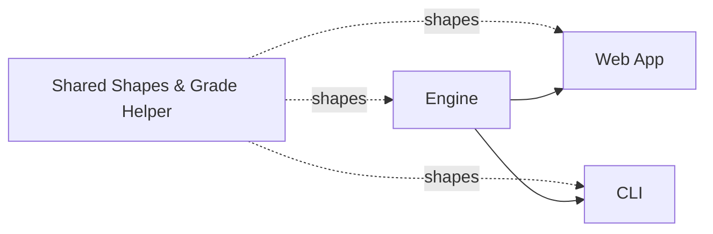

# `packages/shared` — The Type Contract

## TL;DR

This is the shared vocabulary that lets the engine and the web app speak the same language. It is a tiny package containing only data-shape definitions (what a student looks like, what a course looks like, what an audit result looks like) plus a small helper for comparing letter grades. There is no logic here, no AI, no file reading, no behavior at all — just agreed-upon shapes. It exists so the web app can display an audit result without having to import the entire heavy engine (with its AI client and big data files). Whenever anyone changes a field on a student record or adds a new kind of plan output, this is where that change is written down so both sides stay in sync. If the engine and the web app are two people working together, this package is the contract they both signed.



---

## 1. Overview

`@nyupath/shared` is the single source of truth for the data shapes flowing between the engine, the CLI, and the web app. It is intentionally tiny: three source files (`index.ts`, `types.ts`, `grades.ts`) plus a single test file. Everything in it is either a `type`/`interface` declaration or a pure pluggable utility — no I/O, no engine logic, no LLM, no runtime configuration. If a type appears in more than one workspace, it lives here.

The package contents (`/Users/edoardomongardi/Desktop/Ideas/NYU Path/packages/shared/src/`):

| File | Lines | Purpose |
| --- | --- | --- |
| `index.ts` | 2 | Barrel: re-exports `./types.js` and `./grades.js`. |
| `types.ts` | 1244 | Every shared TypeScript type / interface / discriminated union. |
| `grades.ts` | 75 | Letter-grade ordering, `gradesAtOrAbove`, `canonicalSchoolId`. |
| `types.heuristicMappingGuard.compile.test.ts` | (test) | A compile-time guard ensuring `HEURISTIC_MAPPING` assumptions stay soft-only. |

`packages/shared/src/index.ts:1-2` does exactly two `export *` statements, so a consumer just imports from `@nyupath/shared` and gets the full surface.

## 2. Why It Lives Separately

Both the engine package and the web app need to talk about students, courses, programs, audit results, and forward schedules. If those types lived inside the engine, the web app would either have to depend on the entire engine (its LLM client, its data bundle, its RAG stack) just to render an audit, or duplicate the types and let them drift. Pulling them into `@nyupath/shared` gives every workspace a lightweight type-only dependency.

There is no runtime code coupled to the engine in this package, which is why the CLI and web app can import shared types without dragging in `Anthropic`, `OpenAI`, embeddings, or any of the engine's data files.

## 3. Types — The Inventory

The types in `types.ts` divide into roughly seven cohorts. Each interface below is listed with its field shape (described in plain language; see the cited line range for the exact TypeScript).

### 3.1 Course Catalog

**`Course`** — `types.ts:7-22`. A single catalog entry.
- `id` — course identifier such as `CSCI-UA 102`.
- `title`, `credits`.
- `departments[]` — the home departments (an array because cross-listed courses can list multiple).
- `crossListed[]` — equivalent course IDs.
- `exclusions[]` — courses that cannot also count for credit.
- `termsOffered[]` — typical seasons (`"fall" | "spring" | "summer" | "january"`).
- `catalogYearsActive` — a `[startYear, endYear]` tuple delimiting which catalog years the course was live in.

### 3.2 Prerequisites

**`PrereqGroup`** — `types.ts:52-57`. One AND/OR/NOT clause attached to a course.
- `type: "AND" | "OR" | "NOT"`.
- `courses[]` — included course IDs (empty for `NOT` groups).
- `requiresPetition?` — true when the bulletin language allows "or instructor permission".
- `notCourses?` — for `NOT` groups, the excluded course list.

**`Prerequisite`** — `types.ts:59-81`. One entry-level record per course.
- `course` — the course being gated.
- `prereqGroups[]` — array of `PrereqGroup` (all groups must hold).
- `coreqs[]` — corequisite course IDs (may be taken concurrently).
- `minGrades?` — map from courseId to a minimum letter grade required for that course to satisfy the prereq (sourced by the bulletin parser's `extractGradeThresholds.ts`).

### 3.3 Rules and Programs

**`RuleType`** — `types.ts:85`. Discriminator: `"must_take" | "choose_n" | "min_credits" | "min_level"`.

**`DoubleCountPolicy`** — `types.ts:86`. `"allow" | "limit_1" | "disallow"`.

**`BaseRule`** — `types.ts:88-101`. Shared rule shape:
- `ruleId`, `label`, `type`, `doubleCountPolicy`.
- `catalogYearRange: [start, end]`.
- `conditionalExemption?` — program IDs that auto-satisfy this rule.
- `flagExemption?` — student-flag tokens that auto-satisfy this rule.
- `exemptionLabel?` — human-readable exemption reason.

**`MustTakeRule`** — `types.ts:104-107`. `BaseRule` plus `courses[]` (all required).

**`ChooseNRule`** — `types.ts:109-122`. `BaseRule` plus:
- `n` — count required.
- `fromPool[]` — eligible course IDs (or wildcard patterns like `CSCI-UA 4*`).
- `excludeFromPool?` — explicit exclusions from a wildcard match.
- `minLevel?` — optional level floor.
- `mathSubstitutionPool?`, `maxMathSubstitutions?` — for rules that allow math substitutions.

**`MinCreditsRule`** — `types.ts:125-131`. `BaseRule` plus `minCredits` and a `fromPool[]` with optional `excludeFromPool[]`.

**`MinLevelRule`** — `types.ts:134-141`. `BaseRule` plus `minLevel`, `minCount`, `fromPool[]`, `excludeFromPool?`.

**`Rule`** — `types.ts:143`. Tagged union over the four rule kinds.

**`Program`** — `types.ts:147-156`. The degree requirements unit.
- `programId`, `name`, `catalogYear`.
- `school`, `department`.
- `totalCreditsRequired`.
- `rules[]`.

### 3.4 Program Declarations and School Configuration

**`ProgramType`** — `types.ts:164`. `"major" | "minor" | "concentration"`.

**`ProgramDeclaration`** — `types.ts:166-175`. What a student declares:
- `programId`, `programType`.
- `declaredAt?` (free-form), `declaredUnderCatalogYear?`.

**`ResidencyType`** — `types.ts:183`. `"suffix_based" | "total_nyu_credits"`.

**`ResidencyConfig`** — `types.ts:185-196`. School residency rule:
- `type`, optional `suffix` (e.g. `-UA`), `minCredits` (nullable).
- `finalCreditsInResidence?`, `majorMinorResidencyPercent?`.

**`CreditCapType`** — `types.ts:198-205`. A closed set of cap categories including `non_home_school`, `online`, `transfer`, `advanced_standing`, `independent_study`, `internship`, `specific_school`.

**`CreditCap`** — `types.ts:207-229`. One row of a school's credit-cap table. Fields include `maxCredits`, `maxCourses`, `maxPerDepartment`, `schoolId` (for school-specific caps), `subtype`, `label`, `excludes[]`, `includesInternship`, `gpaMinimum`, `additionalRules[]`.

**`CareerLimitType`** — `types.ts:231`. `"credits" | "courses" | "percent_of_program"`.

**`PerTermUnit`** — `types.ts:232`. `"semester" | "academic_year"`.

**`PassFailConfig`** — `types.ts:234-268`. School-wide P/F policy:
- Career limit (`careerLimitType`, `careerLimit`, `careerLimitScope`).
- Per-term cap (`perTermLimit`, `perTermUnit`).
- What P/F counts for: `countsForMajor`, `countsForMinor`, `countsForGenEd`, `creditType`.
- `canElect` — false means the school disallows electing P/F at all (Tandon).
- `autoExcludedFromLimit[]`, `excludedCourseTypes[]`.
- `gradePassEquivalent` (e.g. `"D"`), `failCountsInGpa`.
- `exceptions[]`, `warnings[]`, `note`.

**`SpsPolicy`** — `types.ts:270-283`. Whether the school accepts SPS (School of Professional Studies) credit, which prefixes, what it counts for, and whether it counts toward residency or against the non-home-school cap.

**`DoubleCountingConfig`** — `types.ts:285-311`. The matrix of "how many courses can be shared between two declarations" — major-to-major, major-to-minor, minor-to-minor, plus the concentration variants (Stern). Also `noTripleCounting`, `requiresDepartmentApproval`, and per-program override slots.

**`TransferCreditLimits`** — `types.ts:313-318`. First-year max total, transfer-student max total, and a spring-admit post-secondary cap.

**`GradeThresholds`** — `types.ts:320-333`. Per-category minimum letter grade — `core`, `major`, `minor`, `concentration`, plus the Meyers-specific `nursingPrerequisite` and `nonNursing`.

**`GpaTierRow`** — `types.ts:347-352`. One row of a tiered minimum-cumulative-GPA table (Tandon publishes one). `semestersCompleted: null` represents the open-ended ">N" tier.

**`OverloadRequirement`** — `types.ts:354-365`. Conditions and ceilings for overloading credits per semester (e.g. minimum GPA, minimum semesters completed, hard ceiling).

**`DeansListThreshold`** — `types.ts:367-372`. Min GPA, min credits, term-vs-year scope.

**`AdvisingContact`** — `types.ts:374-378`. `name`, optional `email`, optional `url`.

**`LifecycleConfig`** — `types.ts:380-392`. School-specific lifecycle (Liberal Studies' forced-exit transition, Gallatin's advising-only mode); fields include `type`, `expectedTransitionSemesters`, `maxSemesters`, `transitionTarget`, `dualAuditMode`.

**`SchoolConfig`** — `types.ts:394-462`. Aggregates everything above into the per-school configuration consumed at boot:
- Identity: `schoolId`, `name`, `degreeType`.
- Course-id ownership: `courseSuffix[]`.
- Degree totals: `totalCreditsRequired`, `overallGpaMin`, `auditMode`.
- Composed configs: `residency`, `creditCaps`, `gradeThresholds`, `passFail`, `spsPolicy`, `doubleCounting`, `transferCreditLimits`, `lifecycle`, `advisingContact`.
- Visa: `f1FullTimeMinCredits`.
- Standing: `overloadRequirements`, `gpaTierTable`, `finalProbationGpaFloor`, `goodStandingReturnThreshold`, `maxCourseRepeats`.
- Misc: `acceptsTransferCredit`, `maxCreditsPerSemester`, `sharedPrograms`, `timeLimitYears`, `programExclusions`, `deansListThreshold`, `supportedProgramTypes`, `milestones`.

### 3.5 Student Profile

**`CourseTaken`** — `types.ts:466-476`. One completed course on the student's record.
- `courseId`, `grade`, `semester` (e.g. `"2023-fall"`).
- `credits?` — override when the course is not in the catalog.
- `isOnline?` — for online-cap checks.
- `gradeMode?` — `"letter" | "pf"`.

**`TransferCredit`** — `types.ts:478-487`. AP / IB / external transfer credit.
- `source`, `scoreOrGrade`.
- `nyuEquivalent?` — when the credit maps to a specific course.
- `credits`.

**`StudentProfile`** — `types.ts:489-531`. The student record:
- `id`, `catalogYear`, `homeSchool`.
- `declaredPrograms[]: ProgramDeclaration[]`.
- `coursesTaken[]`.
- `transferCourses?`, `genericTransferCredits?`.
- `flags?[]` — e.g. `nonEnglishSecondary`, `bsBsProgram`, `flExemptByExam`.
- `visaStatus?: "f1" | "domestic" | "other"`.
- `currentSemester?: { term, courses[] }` — in-progress enrollment for prereq risk.
- Suffix-based counters: `uaSuffixCredits`, `nonCASNYUCredits`, `onlineCredits`, `passfailCredits`.
- `matriculationYear?` — for the 8-year time limit.

### 3.6 Audit Results

**`RuleStatus`** — `types.ts:535`. `"satisfied" | "in_progress" | "not_started"`.

**`RuleAuditResult`** — `types.ts:537-549`. One rule's evaluation:
- `ruleId`, `label`, `status`.
- `coursesSatisfying[]`, `remaining`, `coursesRemaining[]`.
- `exemptReason?` — set when exempted via `conditionalExemption` or `flagExemption`.

**`AuditResult`** — `types.ts:551-563`. The full audit:
- Identity (`studentId`, `programId`, `programName`, `catalogYear`, `timestamp`).
- Roll-up (`overallStatus`, `totalCreditsCompleted`, `totalCreditsRequired`).
- `rules[]: RuleAuditResult[]`.
- `warnings[]`.

### 3.7 Single-Semester Planner

**`PlannerConfig`** — `types.ts:567-586`. Inputs to `planNextSemester(...)`:
- `targetSemester`, `maxCourses`, `maxCredits`.
- `minCredits?` (defaults vary by F-1 vs domestic).
- `targetGraduation?` — enables balanced pacing.
- `isFinalSemester?` — relaxes F-1 minimums.
- `onlineCourseIds?`, `preferredCourses?`, `avoidCourses?`.

**`CourseSuggestion`** — `types.ts:588-608`. One planner output entry:
- `courseId`, `title`, `credits`.
- `reason`, `priority`, `blockedCount`.
- `satisfiesRules[]`, `category` (`"required" | "elective"`).
- `prereqRisk?` — courses currently in-progress that this suggestion depends on.

**`GraduationRisk`** — `types.ts:610-617`. `level` (`"none" | "low" | "medium" | "high" | "critical"`), `message`, `courses[]`.

**`SemesterPlan`** — `types.ts:619-636`. The planner result:
- `studentId`, `targetSemester`.
- `suggestions[]: CourseSuggestion[]`.
- `risks[]: GraduationRisk[]`.
- `estimatedSemestersLeft`, `plannedCredits`, `projectedTotalCredits`, `freeSlots`.
- `enrollmentWarnings[]`.

### 3.8 Offerings and Confidence Tiers

**`ConfidenceTier`** — `types.ts:648-654`. The closed set of offering-confidence labels: `"historically_likely" | "historically_partial" | "irregular" | "permission_only" | "restricted" | "confirmed"`.

**`OfferingEntry`** — `types.ts:664-670`. One row in `courses-offerings.json`:
- `termsOffered[]`, `rawLine`, `inferred`.
- `confidence?: ConfidenceTier`.

### 3.9 Forward Planner (Phase 13+)

This is the largest single cohort. The forward planner emits a multi-term schedule, and `@nyupath/shared` is where every shape it references lives.

**`DataSource`** — `types.ts:676`. `"DPR" | "FOSE" | "bulletin" | "program-rules" | "student-input"`.

**`ApprovalAuthority`** — `types.ts:677`. `"instructor" | "department" | "advisor" | "registrar" | "OGS" | "school-dean"`.

**`ValidationResult`** — `types.ts:679-683`. A 4-state discriminated union for any per-axis validation:
- `{ status: "pass", verifiedFrom }`
- `{ status: "assumed-pass", assumption, whatWouldFlipIt }`
- `{ status: "requires-approval", authority }`
- `{ status: "fail", reason }`

**`WorkloadTier`** — `types.ts:687-692`. `"major-required" | "major-elective" | "school-core" | "free-elective" | "general-elective"`.

**`LoadRationale`** — `types.ts:694-705`. Per-term explanation of credit distribution:
- `strategy: "balanced" | "frontload" | "backload" | "light" | "heavy"`.
- `creditsTarget`, `slack`, `weightedCredits`.
- `hardCount`, `easyCount`.
- `alternativeDistributionsConsidered[]`.

**`Assumption`** — `types.ts:718-751`. Discriminated union over what the planner *assumed* to produce the schedule:
- `IP_COURSE_COMPLETION` — student must pass an in-progress course (and at what grade).
- `LLM_RANKED_ALTERNATIVE` — an LLM picked between feasible plans on a student-stated factor.
- `HEURISTIC_MAPPING` — a soft, student-framing-bound heuristic translation (the `studentConstraintFraming` is a literal `"soft"` because the compile guard test rules out the hard variant).

**`PoolBinding`** — `types.ts:757-761`. `poolId`, `candidates[]`, `satisfiesRule`.

**`RequirementPoolSlot`** — `types.ts:763-781`. A placeholder that resolves into one of a candidate set. `bindingState` is either `"unbound"` or `"candidate-set"`; `"bound"` is intentionally absent (a successful bind transitions the *parent* slot to `specific_planned`).

**`FreeCreditSlot`** — `types.ts:783-797`. A free-elective slot with `defaultWeight: 0.3` and `bindingState: "placeholder-pending" | "placeholder-deferred"`.

**`AdvisingPlaceholderSlot`** — `types.ts:799-812`. An advising-required slot with `bindingState: "advisor-pending"`.

**`PlaceholderSlot`** — `types.ts:816-819`. Discriminated union over the three placeholder kinds above.

**`TermConstraintKind`** — `types.ts:823-830`. Reasons a course landed where it landed: `"prereqChain" | "offering" | "creditCeiling" | "creditSlack" | "creditFloor" | "visaFloor" | "coreqSameTerm"`.

**`TermConstraint`** — `types.ts:832-835`. `kind` + `detail`.

**`SlotRationale`** — `types.ts:837-846`. Per-slot rationale:
- `satisfiesRequirements[]: ruleIds`.
- `termConstraints[]`.
- `consideredAlternatives[]` — `{ courseId, rejectedBecause }`.
- `decisionsApplied[]` — symbolic decision tags.
- `petitionTrigger?` — `{ fromCourse, bulletinText }`.

**`SlotFlexibility`** — `types.ts:848-852`. `earliestPossibleTerm`, `latestPossibleTerm`, `alternativeCourses[]`.

**`DownstreamImpact`** — `types.ts:854-857`. `courseIds[]`, `graduationDelay` (in terms).

**`ScheduleSlotKind`** — `types.ts:861`. `"completed" | "in_progress" | "specific_planned" | "placeholder"`.

**`ScheduleSlotCompleted`** — `types.ts:863-869`. Locked completed course with `grade`.

**`ScheduleSlotInProgress`** — `types.ts:871-876`. Currently-enrolled course.

**`ScheduleSlotSpecificPlanned`** — `types.ts:879-916`. A future term's pinned course, carrying full rationale (`rationale`, `flexibility`, `downstreamImpact`), `workloadTier` + `workloadWeight`, `bindingState: "bound"`, `confidence: ConfidenceTier`, `isCriticalPath`, optional `optionalReason`, optional `approvalAuthority`, and optional concrete-section fields populated after the student picks a FOSE section: `crn`, `meetingPatterns[]`, `instructor`, `schd`, `sectionNumber`.

**`ScheduleSlotPlaceholder`** — `types.ts:919-943`. Reserved-credits placeholder slot with rich rationale, `bindingState: "placeholder-pending" | "placeholder-deferred"`, `placeholderId`, optional `poolBinding`.

**`ScheduleSlot`** — `types.ts:945-949`. Discriminated union over the four kinds.

**`ForwardSemester`** — `types.ts:953-960`. One semester's plan: `term`, `locked`, `slots[]`, `plannedCredits`, `notes[]`, `loadRationale`.

**`PlanState`** — `types.ts:964-968`. `"valid-clean" | "valid-with-trade-offs" | "infeasible-draft" | "student-preferred-invalid-draft"`.

**`AlternativePlanSummary`** — `types.ts:973-985`. Stage-7 top-K alternative-plan summary. Carries balance score, per-term weighted credits, per-term hard/easy counts, per-term subject distribution, distinct-subjects count, petition count, assumption count, graduation term, and `topDiffsFromWinner[]`.

**`FeasibilityReport`** — `types.ts:989-1010`. Per-axis feasibility. `constraintViolations[]` enumerates kinds like `prereq_unsatisfiable`, `offering_pattern`, `credit_floor`, `credit_ceiling`, `graduation_total`, `not_clause`, `pass_fail_cap`, `online_credit_cap`, `outside_home_credit_cap`, `gpa_floor`, `other`.

**`InfeasibilityReport`** — `types.ts:1012-1020`. Emitted when a mutation makes the plan infeasible. Carries a `conflictSource` (`"pin" | "exclusion" | "loadStyleOverride" | "schedulingPreference" | "other"`), a `conflictDetail`, `relaxationSuggestions[]`, and a `fallbackSchedule?` (the schedule the solver would have produced absent the conflict).

**`ForwardSchedule`** — `types.ts:1024-1042`. The full forward-plan output:
- Identity + targets: `studentId`, `homeSchoolId`, `graduationTerm`, `creditTargetPerSemester`, `f1Floor`, `domesticPartTimeFloor`.
- Totals: `graduationCreditMinimum`, `degreeCreditsMet`.
- `semesters[]: ForwardSemester[]`.
- Determinism / freshness: `dprCourseHistoryHash`, `computedAt`.
- Verdicts: `feasibility`, `state`, `balanceScore`.
- `assumptions[]: Assumption[]`.
- `alternativeCandidates?[]: AlternativePlanSummary[]`.

### 3.10 Scheduling Preferences and the Mutation API

**`Day`** — `types.ts:1063`. `"M" | "Tu" | "W" | "Th" | "F" | "Sa" | "Su"`.

**`MeetingPattern`** — `types.ts:1076-1080`. One weekly meeting:
- `day`, `startMin`, `endMin` — minutes since midnight.

**`SchedulingPreferences`** — `types.ts:1082-1088`. Time/day preferences:
- `avoidDays?`, `avoidTimeWindows?`, `preferTimeWindows?`.
- `desiredFreeDay?` (with `"any"` sentinel).
- `avoidConsecutiveLongBlocks?`.

**`SchedulePreferences`** — `types.ts:1097-1110`. Solver-level preferences:
- `loadStyle?`, `loadStylePerTerm?`, `creditTargetPerTerm?`.
- `pins?`, `exclusions?`.
- `includeSummer?`, `includeJTerm?`, `allowBelowF1Floor?`.
- Nested `schedulingPreferences?` (the time/day cohort above).

**`PlanChangeProposal`** — `types.ts:1114-1117`. `{ kind, payload }` — a flat shape used by `propose_plan_change`.

**`PlanChangeOutcome`** — `types.ts:1119-1127`. `feasible`, `diff`, `consequences[]`, `conflicts?[]`.

**`AlternativeCandidate`** — `types.ts:1129-1134`. `summary`, `relaxation` kind, `schedule` (nullable), `stillInfeasibleReason?`.

**`PlanMutation`** — `types.ts:1149-1206`. Discriminated union of mutation kinds:
- `pin` (with `freeze?` boolean — `false` means "place but don't lock").
- `exclude`.
- `swap` (drop one, add another, same term).
- `move` (one term to another, atomic).
- `unpin`.
- `addTerm`.
- `loadStyleOverride`.
- `bindFreeElective`, `unbindFreeElective`.
- `bindPoolSlot`.
- `setSchedulingPreference`, `clearSchedulingPreference`.

**`PlanDiff`** — `types.ts:1214-1243`. The structured delta returned by `propose_plan_change`:
- `creditsByTermDelta`, `graduationTermShift`.
- `newRequiresPetition[]`, `removedRequiresPetition[]`, `newUnmetRequirements[]`.
- `cascadedShifts[]` — `{ courseId, fromTerm, toTerm, becauseOf }`.
- `weightedCreditsByTermDelta`, `workloadTierShifts[]`.
- `balanceImpact` — `{ before, after, delta, classification }`.
- `newAssumptions[]`.
- `validationResultsChanges` — per-axis `before/after` `ValidationResult` transitions.
- `planStateChange?` — when the mutation flips `PlanState`.

## 4. The `grades.ts` Utility

`/Users/edoardomongardi/Desktop/Ideas/NYU Path/packages/shared/src/grades.ts` is 75 lines and exports three things:

### 4.1 `LETTER_GRADE_ORDER`

`grades.ts:20-31`. A 10-element `as const` array, highest grade first:

`A, A-, B+, B, B-, C+, C, C-, D+, D`

Index 0 is the best. Index N+1 is strictly worse than index N. `F` is intentionally excluded (it never satisfies a grade-floor rule); `P` is also excluded because pass/fail is governed by `SchoolConfig.passFail` rather than the letter ladder.

### 4.2 `LetterGrade`

`grades.ts:33`. The literal-union type of the entries in `LETTER_GRADE_ORDER`.

### 4.3 `canonicalSchoolId(s)`

`grades.ts:61-63`. Trims and lowercases a school identifier. The function exists because `Program.school` was authored uppercase ("CAS", "Tandon") while newer fields (`StudentProfile.homeSchool`, `SchoolConfig.schoolId`, the filenames in `data/schools/`, the directory names in `data/programs/`) are lowercase. Comparisons that cross those layers must run both sides through `canonicalSchoolId` first.

### 4.4 `gradesAtOrAbove(threshold)`

`grades.ts:65-74`. Returns a `Set<string>` containing every letter grade that meets or exceeds `threshold`. Implementation: looks up `threshold` in `LETTER_GRADE_ORDER`; if not found, **throws** rather than returning an empty set. The reasoning baked into the function is that a typo in `SchoolConfig.gradeThresholds` would otherwise silently disqualify every course; failing loudly is safer.

Examples implied by the code:
- `gradesAtOrAbove("C")` → `{A, A-, B+, B, B-, C+, C}`.
- `gradesAtOrAbove("D")` → all 10 grades.
- `gradesAtOrAbove("A")` → `{A}`.

This function is the single source of truth used across `degreeAudit`, `passfailGuard`, `creditCapValidator`, `ruleEvaluator`, and `academicStanding`.

## 5. The Compile-Time Guard Test

`packages/shared/src/types.heuristicMappingGuard.compile.test.ts` exists to enforce that the `HEURISTIC_MAPPING` variant of `Assumption` cannot be constructed with a hard student-constraint framing. This is the Layer-2 enforcement that the schema-level discriminator (`studentConstraintFraming: "soft"` literal) provides — if anyone ever tried to relax the literal type, this test would fail to compile.

## 6. Architectural Position

```mermaid
flowchart LR
    SHARED[@nyupath/shared<br/>types + grades]
    ENGINE[packages/engine]
    CLI[apps/cli]
    WEB[apps/web]
    DATA[(data/ JSON)]

    SHARED -.types only.-> ENGINE
    SHARED -.types only.-> CLI
    SHARED -.types only.-> WEB
    DATA -.shape matches.-> SHARED

    ENGINE --> CLI
    ENGINE --> WEB
```

Every loader in the engine returns one of the shapes defined here. Every web component that consumes a `ForwardSchedule`, an `AuditResult`, or a `SemesterPlan` imports the type from `@nyupath/shared`. Every JSON file under `data/` is laid out to match one of these types after the loader normalizes it.

## 7. File Reference

| Path | Purpose |
| --- | --- |
| `packages/shared/src/index.ts` | Two-line barrel re-exporting both sibling files. |
| `packages/shared/src/types.ts` | All shared types — courses, prereqs, rules, programs, school configs, student profile, audit, single-term planner, forward planner, mutations, scheduling preferences. |
| `packages/shared/src/grades.ts` | `LETTER_GRADE_ORDER`, `LetterGrade`, `gradesAtOrAbove`, `canonicalSchoolId`. |
| `packages/shared/src/types.heuristicMappingGuard.compile.test.ts` | Compile-time guard for the `HEURISTIC_MAPPING` assumption variant. |
