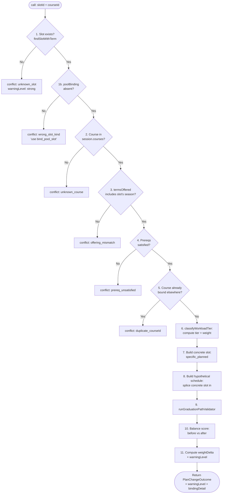
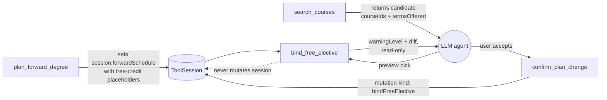

# bind_free_elective — Technical Audit

## TL;DR

When the planner builds your roadmap, it doesn't always know which specific course should fill every blank — for any-course-counts-toward-credits requirements, it leaves a "free credit, 4 units" placeholder in a future semester. Later, when you say "I want to use Intro to Linguistics for that free elective slot in Spring 2027" or "fill that empty 4-credit spot with this course," this tool previews that decision. It checks the course is real, that you haven't already taken it, that prerequisites are fine, that it's actually offered in that term, and then builds a hypothetical version of the schedule with the binding applied. It reruns the graduation validator and tells you: is the plan still on track, how does the workload tier shift, and is this a smooth swap (none) or potentially heavier (mild / strong warning)? Like the propose tool, it writes nothing — the actual commit goes through the confirm-plan-change pathway. Requires a forward plan and a DPR loaded.

```mermaid
flowchart LR
    Q[Student: use Course X for free-credit slot Y] --> T[bind_free_elective]
    T --> V[Validate: prereqs, offering, not already taken]
    V --> H[Build hypothetical schedule]
    H --> R[Re-run graduation validator]
    R --> S[Score workload + balance shift]
    S --> P[Preview: feasible? + diff + warning level]
    P --> C[Student confirms via confirm_plan_change]
```



---

A read-only preview tool that takes a specific course and a "free-credit" placeholder slot from the active forward schedule and asks: *if we put this course there, would the plan still graduate cleanly, and how does the workload shift?* It returns a diff, a feasibility verdict, and a warning level — it never writes to session state. Committing the change is the job of `confirm_plan_change`.

Source: `packages/engine/src/agent/tools/bindFreeElective.ts` (lines 1-491).

---

## 1. Purpose

When the planner runs (`plan_forward_degree`), it doesn't always know which specific course should fill every remaining credit. For requirements that the school treats as "any course that counts as credit toward your degree" (free electives), it parks a generic "free-credit" placeholder in a semester — a slot that reserves *N* credits and a workload tier but carries no `courseId`. The student later picks a real course to drop into that slot.

`bind_free_elective` is the preview-before-commit step of that pick. It validates that the chosen course is legal in that term, recomputes the workload tier the slot will now carry, builds a *hypothetical* schedule with the binding applied, re-runs the graduation-path validator on that hypothetical, and surfaces:

- whether the plan is still feasible (`feasible: true/false`)
- the symbolic diff (one placeholder removed, one concrete slot added)
- consequences in plain English
- a `warningLevel` of `none | mild | strong` based on how much extra workload + balance loss this binding creates

A "free elective" is distinguished from a *pool slot* (handled by `bind_pool_slot`) by the absence of a `poolBinding` field on the placeholder — see line 236 (`if (parentSlot.poolBinding) { ... reject ... }`). Pool slots have a fixed candidate list; free-credit slots accept any catalog course that satisfies prereqs and offering rules.

Decision tags that govern this tool's behavior (per file header, lines 1-24):

- **Decision #37** — free-credit slots default to weight 0.3 and tier "free-elective".
- **Decision #38** — PlaceholderSlot is a tagged union; `FreeCreditSlot` is one kind, distinguished from `RequirementPoolSlot` (no `poolBinding`) and `AdvisingPlaceholderSlot`.
- **Decision #24 / #35** — workload tier classification.
- **Decision #25** — balance-impact classification.

---

## 2. Input Schema

Declared at lines 61-70.

```
{
  slotId:   string (>=1 char)   // placeholderId of the free-credit slot
  courseId: string (>=1 char)   // course to bind into that slot
}
```

Both fields are required. The Zod schema enforces non-empty strings; everything else is validated inside `call()`.

---

## 3. Session Prerequisites

The `validateInput` hook (lines 174-191) hard-rejects the call unless both of the following hold:

| Requirement | Rejection message |
|---|---|
| `session.forwardSchedule` is set | "No forward plan exists in this session. Call plan_forward_degree first, then bind free-elective slots." |
| `session.degreeProgressReport` is set | "No Degree Progress Report loaded. Cannot validate free-elective binding without DPR data." |

Both must be present at validation time. If either is missing, the call never reaches `call()` and the LLM gets back a `ValidationResult` with `ok: false` and the message above. Rationale: the forward schedule supplies the slot universe; the DPR supplies the prereq oracle and the credit-completed audit.

---

## 4. What It Reads

From `ToolSession` (see `packages/engine/src/agent/tool.ts:39-189`):

| Field | Used for |
|---|---|
| `session.forwardSchedule` (line 197) | universe of slots; both the original and hypothetical schedules |
| `session.degreeProgressReport` (line 198) | prereq oracle + validator input |
| `session.courses` (line 199, default `[]`) | catalog lookup for the candidate `courseId` |
| `session.prereqs` (line 200, default `[]`) | prereq groups for the candidate course |
| `session.schoolConfig?.residency?.minCredits` (line 410) | passed to the graduation-path validator |
| `session.schedulePreferences?.loadStyle` (line 419, default `"balanced"`) | input to the balance-score function |

From the `ForwardSchedule` itself:

- `schedule.semesters[]` — iterated to find the target slot (lines 90-100).
- `schedule.graduationCreditMinimum` (line 408) — sent to the validator as the degree credit floor *for this plan*, not the raw school config.
- `schedule.graduationTerm` (line 414) — sent to the validator as the target term.

From the matched placeholder slot:

- `parentSlot.poolBinding` — must be absent (line 236).
- `parentSlot.satisfiesRules` — copied into the new concrete slot and fed to the tier classifier (lines 366, 382).
- `parentSlot.credits` — copied verbatim onto the concrete slot (line 381).
- `parentSlot.rationale`, `parentSlot.flexibility`, `parentSlot.downstreamImpact`, `parentSlot.confidence`, `parentSlot.isCriticalPath` — inherited by the concrete slot (lines 384-391).
- `parentSlot.workloadWeight` — baseline for computing the `weightDelta` (line 425).

---

## 5. Algorithm

Ten ordered validation/computation steps, all in `call()` (lines 196-477). The first failed step aborts with `feasible: false` and a hard `conflict` entry; only the last step produces the success path.



### Step 1 — Slot lookup and free-elective gating

`findSlotWithTerm(schedule, slotId)` (lines 86-101) iterates every semester and every slot, returning the first match where `slot.kind === "placeholder"` and `slot.placeholderId === slotId`, along with the containing semester's `term` string (e.g. `"2026-fall"`).

If no match → `feasible: false`, conflict `unknown_slot`, warning `strong` (lines 204-212).

If a match is found, the tool checks `parentSlot.poolBinding` (line 236). If that field is present, the placeholder is a *pool* slot, not a free-credit slot. The tool refuses and returns `wrong_slot_kind` with the message "Use bind_pool_slot for requirement-pool slots" (lines 237-244). Free-credit slots are defined here purely by the *absence* of `poolBinding` (see file lines 216-235 — even the in-code comments acknowledge this is "the best signal available on the outer ScheduleSlotPlaceholder").

### Step 2 — Course exists in catalog

Linear scan of `session.courses` for `c.id === input.courseId` (line 247). If absent → `unknown_course` conflict (lines 248-256).

### Step 3 — Course is offered in the slot's term

`termSeason(slotTerm)` (lines 76-80) splits `"2026-fall"` on the first dash and returns `"fall"`. If the season parses and `course.termsOffered` does *not* include it → `offering_mismatch` (lines 260-271). The check is skipped if the term string can't be parsed (defensive).

### Step 4 — Prereqs satisfied

The tool looks up the candidate course in `session.prereqs` by `p.course === input.courseId` (line 274). If no prereq entry exists, this step is a no-op (lines 275-342: the body is wrapped in `if (prereqEntry)`).

If an entry exists, it builds a `plannedPlacements` map from the *current* schedule — courseId → term for every `specific_planned` slot (lines 277-284). Then for each prereq group:

- **AND group**: every member must individually satisfy `isPrereqSatisfied(...)` (lines 287-309). On the first failure, abort with `prereq_unsatisfied` and the upstream reason string.
- **OR group**: at least one member must satisfy. If none do, abort (lines 310-339).
- **NOT groups**: explicitly not handled here (line 340: "NOT groups are exclusion constraints handled elsewhere").

`isPrereqSatisfied` is called with `mode: "prereq"` (as opposed to `"coreq"`), the slot's term as the `dependentTerm`, the DPR for completed coursework, and `prereqEntry.minGrades` for grade-floor checks.

### Step 5 — Course not already bound

`isCourseAlreadyBound(schedule, courseId)` (lines 107-128) sweeps every slot and returns true if any slot of kind `specific_planned`, `in_progress`, or `completed` carries the same `courseId`. This catches:

- already pinned in a future term
- already enrolled this term (in_progress)
- already on the transcript (completed — would mean a re-take attempt without explicit retake handling)

Hit → `duplicate_courseId` conflict (lines 345-355).

### Step 6 — Workload tier classification

Calls `classifyWorkloadTier(...)` (lines 364-374) with:

- the candidate's `courseId`
- `satisfiesRules` from the parent placeholder
- *empty* `majorRuleKinds`, `schoolCoreRuleIds`, `generalCategoryRuleIds` (line 368: free-credit slots are always classified as "free-elective" tier regardless of major context — the empty maps force that outcome)
- the candidate's `title` as `bulletinTitle`, no keywords
- the prereq groups (or `undefined`) — used by the tier classifier to detect "has prereqs" as a difficulty signal
- `isOptional: true` — free-credit slots are optional by definition (line 374)

Returns `{ tier, weight }` — both are written onto the concrete slot.

### Step 7 — Build the concrete slot

A `ScheduleSlotSpecificPlanned` is constructed (lines 377-392). It inherits credits, satisfiesRules, rationale, flexibility, downstreamImpact, confidence, and isCriticalPath from the parent placeholder. It gets a fresh `workloadTier` and `workloadWeight` from Step 6. The `reason` is hard-coded to `"Bound from free-credit placeholder (Decision #37)"`. `bindingState` is set to `"bound"`.

### Step 8 — Hypothetical schedule

`buildHypotheticalSchedule(original, slotId, concreteSlot)` (lines 134-154) is a pure replace-by-id pass: it spreads every semester and every slot, swapping the matching placeholder for `concreteSlot`. No mutation; the original schedule is untouched.

### Step 9 — Re-validation

The hypothetical schedule is fed to `runGraduationPathValidator(...)` (lines 402-416). The `programRules` bundle passed in is intentionally narrow:

- `degreeCreditMinimum`: taken from `schedule.graduationCreditMinimum` (not the raw school config), because the schedule's value already accounts for total planned credits — see lines 406-408.
- `residencyMinCredits`: from `session.schoolConfig?.residency?.minCredits ?? null`.
- `majorCreditMinimum`, `minorCreditMinimum`, `upperLevelMinCredits`, `schoolCoreMinCredits`: all `null` (not enforced here).
- `graduationTargetTerm`: `schedule.graduationTerm`.

The validator returns `{ feasible, infeasibilityReport? }`. This is the source of truth for the returned `feasible` field — see line 468. Note: a binding can pass Steps 1-8 yet still come back `feasible: false` here (e.g., if removing the placeholder destabilizes some downstream credit count); in that case the conflict surfaced is `plan_infeasible` with the validator's `conflictDetail`.

### Step 10 — Balance score

`computeBalanceScore(semesters, loadStyle)` is called twice — once on the original `schedule.semesters` and once on the hypothetical (lines 420-421). `classifyBalanceDelta(before, after)` (line 422) returns one of `"unchanged"`, `"improved"`, `"degraded-mild"`, `"degraded-significant"` (the exact tags read off lines 428-437).

### Step 11 — Warning level

The decision rule (lines 425-438):

```
weightDelta = workloadResult.weight - parentSlot.workloadWeight

if balanceClassification == "degraded-significant" OR weightDelta > 0.7
    -> "strong"
else if balanceClassification == "degraded-mild" OR (0.2 < weightDelta <= 0.7)
    -> "mild"
else
    -> "none"
```

The `weightDelta` measures how much heavier the concrete-bound course is compared to the placeholder's default weight (which is 0.3 for free-credit slots, per Decision #37). A binding that lifts the weight by more than 0.7 is "strong" on its own; a balance-degrading binding is "strong" even if the weight barely moves.

---

## 6. What It Writes Back to Session

**Nothing.** The tool is declared `isReadOnly: true` (line 172) and the source explicitly contracts this at line 23: "isReadOnly: true — MUST NOT write to session state." `session.forwardSchedule`, `session.schedulePreferences`, and every other session field are read-only from this tool's perspective. The actual write happens later in `confirm_plan_change` once the user accepts the preview.

---

## 7. Returns Shape

The output is a `BindFreeElectiveOutput` (lines 51-55), which extends `PlanChangeOutcome` from `@nyupath/shared` with two extra fields:

| Field | Type | Source |
|---|---|---|
| `feasible` | boolean | `validatorResult.feasible` (line 468) |
| `diff.added` | array of `{ term, slot }` | one entry: the new concrete slot in the original term (lines 441-443) |
| `diff.removed` | array of `{ term, slot }` | one entry: the original placeholder (lines 444-446) |
| `consequences` | string[] | up to 3 plain-English lines (lines 448-465) |
| `conflicts` | optional array of `{ kind, detail }` | absent when feasible; set to `[{kind:"plan_infeasible", detail}]` when validator fails (lines 471-473). On hard rejections from Steps 1-5/8, populated with a single specific kind. |
| `warningLevel` | `"none" \| "mild" \| "strong"` | from Step 11 |
| `bindingDetail` | string | always present on success: `<courseId> (<tier>, weight=<n.nn>) → slot <slotId> in <term>` (line 475) |

`consequences` content (lines 448-465):

1. (if `strong`) "This binding significantly increases workload (weight delta: +X.XX) or degrades plan balance."
2. (if `mild`) "This binding moderately increases workload (weight delta: +X.XX)."
3. Always: "Balance impact: \<classification\> (\<before\> → \<after\>)."
4. (if validator failed) "Warning: hypothetical plan fails validation. \<detail\>"

On hard-failure paths (Steps 1-5, 8 fail-fast), `consequences` carries a single line describing the specific failure (e.g., `Course "CSCI-UA 472" is already placed in the schedule.`) and `diff` is `{ added: [], removed: [] }`.

---

## 8. Envelope Behavior

Set in the `buildTool` call (lines 160-173):

| Property | Value |
|---|---|
| `name` | `"bind_free_elective"` |
| `isReadOnly` | `true` |
| `maxResultChars` | `3000` |
| `outputMode` | default `"synthesis"` (no `outputMode` field set, factory default at `tool.ts:260`) |
| `validateInput` | session-prerequisite hook (Section 3) |

Because `outputMode` defaults to `"synthesis"`, the LLM is free to paraphrase the result. There is no `extractVerbatim` (line 231 in `tool.ts` defines the optional contract; this tool does not implement it). The `summarizeResult` output (Section 9) is the safe surface the response validator can ground against.

---

## 9. Summary Text Format

`summarizeResult` (lines 478-489) produces the string the agent loop quotes to the LLM. Shape:

```
BIND FREE ELECTIVE — feasible: <true|false>, warning: <none|mild|strong>
  Binding: <bindingDetail>                       (omitted if bindingDetail absent)
  • <consequences[0]>
  • <consequences[1]>
  • <consequences[2]>
  • <consequences[3]>                            (max 4 bullets)
  Conflicts: <kind1>, <kind2>, ...               (omitted if no conflicts)
```

The summary is then truncated to 3000 chars by the `buildTool` factory wrapper (`tool.ts:264-268`) before being passed to the LLM.

---

## 10. Validation / Edge Cases

A consolidated map of failure modes, each with the line range that produces it.

| Case | Conflict `kind` | Lines | Notes |
|---|---|---|---|
| `slotId` does not match any placeholder in any semester | `unknown_slot` | 204-212 | warning level forced to `strong` |
| Slot exists but is a *pool* slot (`poolBinding` present) | `wrong_slot_kind` | 236-244 | detail explicitly points to `bind_pool_slot` |
| `courseId` not in `session.courses` | `unknown_course` | 248-256 | |
| Course not offered in the slot's term (season parse + `termsOffered` miss) | `offering_mismatch` | 258-271 | Skipped if term string lacks a `-` separator |
| Prereq AND-group member unsatisfied | `prereq_unsatisfied` | 297-308 | First failing member triggers abort |
| Prereq OR-group has zero satisfied members | `prereq_unsatisfied` | 327-338 | |
| `courseId` already on the schedule as `specific_planned`, `in_progress`, or `completed` | `duplicate_courseId` | 117-127, 345-355 | This was the post-fix scope (see line 113-119 comment): pre-fix only matched `specific_planned`, allowing IP courses to be re-pinned in future terms |
| Hypothetical plan fails graduation-path validator | `plan_infeasible` | 462-473 | `feasible: false`, but `warningLevel` is still computed and returned |
| Course catalog missing for session (`courses ?? []`) | covered by `unknown_course` | 199, 247 | Empty array → next lookup fails |
| No prereq entry exists for the course | (no failure) | 274-275 | Treated as "no prereqs to satisfy"; skip the block |
| NOT-type prereq group | (no failure) | 340-341 | Source explicitly defers: "handled elsewhere" |
| Term season cannot be parsed (no dash in term string) | (no failure) | 259-260 | Offering check is conditional on `if (season && ...)` |

Special notes:

- Steps 1, 1b, 2, 3, 4, 5 are *hard rejections* — they exit with `feasible: false`, `warningLevel: "strong"`, empty diff, and a single conflict entry.
- Step 9 (graduation-path validator) is *soft*: it still returns the diff and a computed warning level even when `feasible: false`. This lets the LLM/UI present the diff and the failure reason side-by-side.

---

## 11. Interactions



| Tool | Relationship to `bind_free_elective` |
|---|---|
| `plan_forward_degree` | Hard prerequisite. Without `session.forwardSchedule`, validateInput rejects the call (lines 175-182). The planner is what creates the free-credit placeholders this tool binds into. |
| `confirm_plan_change` | The downstream commit step. `bind_free_elective` produces the diff; `confirm_plan_change` is the only path that splices the new `specific_planned` slot into `session.forwardSchedule`. The tool description (lines 162-170) explicitly tells the LLM: "Use this BEFORE calling confirm_plan_change with a bindFreeElective mutation." |
| `search_courses` | Typical upstream source of candidate `courseId`s. The agent uses it to find courses that fit a free-credit slot's term, then feeds the chosen id into this tool. |
| `bind_pool_slot` | Sibling tool. If the LLM passes a *pool* slot's id to `bind_free_elective`, the `wrong_slot_kind` rejection at line 241 explicitly redirects to `bind_pool_slot`. They share the same validation skeleton; the only differences are the absence/presence of `poolBinding` and the choose-n constraint that `bind_pool_slot` adds. |
| `runGraduationPathValidator` (internal) | Called inline as the re-solve step at line 402. It owns the `feasible` verdict. |
| `computeBalanceScore` / `classifyBalanceDelta` (internal) | Called inline at lines 420-422; supply the balance side of the warning level. |
| `classifyWorkloadTier` (internal) | Called inline at lines 364-374; supplies the workload side of the warning level. |
| `isPrereqSatisfied` (internal) | Called inline in Step 4. Same helper used by the planner itself (Decision #4). |

The full preview-then-commit pattern matches the two-step write contract `tool.ts:59-64` documents for `pendingMutations` — `bind_free_elective` is the preview half, `confirm_plan_change` is the apply half.
