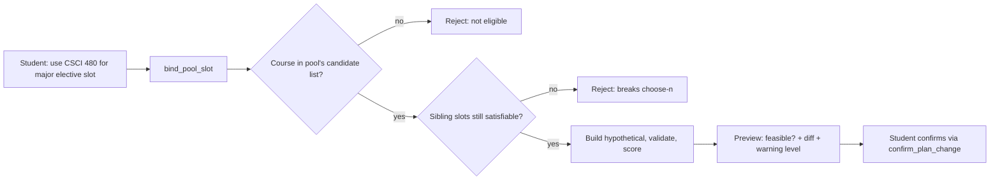
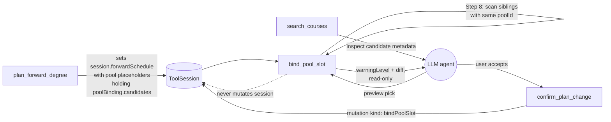

# bind_pool_slot — Technical Audit

> Last verified against code: 2026-06-19 (plan 37 — J1: `validateInput` now accepts `session.studentDraftPlan` in addition to `session.forwardSchedule` as a valid baseline; J2: a binding committed via `confirm_plan_change` survives re-plans because `resolveBindMutations` translates the `bindPoolSlot` mutation into a `pin(courseId, term, freeze:true)` before the prefs walk; 8-axis validator reference updated).

## Purpose

Many NYU requirements say "pick 3 from this list of 8 courses." When the planner schedules those, it places 3 placeholder slots all tagged with the same pool, each one a generic "you'll pick something from this list later." When you say "use CSCI 480 for one of my CS major elective slots in Fall 2026," this tool previews that pick. It first confirms the course is actually in that pool's candidate list (a major elective slot won't accept a random art history course), then checks the harder constraint: if you commit this course here, do the other sibling pool slots still have enough remaining candidates to satisfy the choose-n rule? If you only have 4 candidates left for 3 remaining slots, you're fine; if you'd box yourself in, the tool flags it. It re-runs the graduation validator on a hypothetical schedule, scores workload and balance impact, and returns a feasibility verdict and warning level. Like its free-elective sibling, it writes nothing — committing goes through `confirm_plan_change`. Needs an active plan and a DPR loaded.



---

A read-only preview tool that takes a specific course and a *requirement-pool* placeholder slot from the active forward schedule and asks: *can we satisfy this pool with this course, in this term, without breaking the choose-n constraint for the rest of the pool?* It returns a diff, a feasibility verdict, and a warning level — it never writes session state. Committing is the job of `confirm_plan_change`.

Source: `packages/engine/src/agent/tools/bindPoolSlot.ts` (lines 1-567).

> **Important (post-rebuild):** This tool reimplements pool promotion **inline** (Step 10, lines 453-468), building the concrete `specific_planned` slot directly. The former standalone solver-side pool-promotion module under `forwardSchedule/` has been **removed** — the inline constructor at Step 10 is the only pool-promotion path.

---

## 1. What it does

NYU degree requirements often take the form "*pick N courses from this list*" — for instance, *choose 3 from {CSCI-UA 470, 472, 473, 480}* for a CS major elective requirement. The planner can place a *pool slot* in a future semester: a placeholder that reserves credits + tier + a candidate list, but commits to no specific course. Later, the student decides which course goes in which slot.

`bind_pool_slot` is the preview-before-commit for that decision. A "pool slot" — also called a *requirement-pool slot* — differs from a "free-credit" slot (handled by [`bind_free_elective`](./bind_free_elective.md)) in three ways:

1. **It has a `poolBinding` field** (line 288 — the very first kind-check the tool runs).
2. **The candidate set is finite**. `poolBinding.candidates` is the authoritative list of courses that satisfy this pool. The chosen `courseId` MUST be in it (line 304).
3. **It participates in a choose-n constraint shared with sibling slots**. If a pool requires *N* selections, the planner places *N* slots all carrying the same `poolBinding.poolId`. Binding one slot consumes one candidate; the remaining *N-1* slots must still each have at least one unused candidate, or the pool becomes unsatisfiable.

Compared to `bind_free_elective`:

| Aspect | `bind_free_elective` | `bind_pool_slot` |
|---|---|---|
| Slot identification | `placeholder` with `poolBinding` *absent* | `placeholder` with `poolBinding` *present* |
| Candidate course universe | Any course in `session.courses` | Restricted to `poolBinding.candidates` |
| Workload tier | Forced to `"free-elective"` (empty rule maps) | Uses actual `satisfiesRules` + `optional` flag |
| Slot constraint | None (each slot is independent) | Choose-n: sibling pool slots must remain satisfiable |
| `isOptional` flag fed to tier classifier | Hard-coded `true` | Read from `parentSlot.optional` |
| `reason` text on concrete slot | `"Bound from free-credit placeholder (Decision #37)"` | `"Bound from pool: <poolId> / <satisfiesRule>"` |
| `in_progress` / `completed` dup check | Yes | **No** — only checks `specific_planned` |

The tool's structure is otherwise the same: validate the binding, build a hypothetical schedule, re-run the graduation-path validator, score balance impact, classify a warning level, return a `PlanChangeOutcome` + `warningLevel`. Commit is deferred to `confirm_plan_change`.

Governing decisions per the file header (lines 1-26): Decision #28 (late-binding for choose_n pools), #38 (PlaceholderSlot tagged union), #4 (`isPrereqSatisfied`), #24/#35 (workload tier), #25 (balance impact).

---

## 2. Input Schema

Lines 61-70.

```
{
  slotId:   string (>=1 char)   // placeholderId of the requirement-pool slot
  courseId: string (>=1 char)   // course to bind (must be in poolBinding.candidates)
}
```

Both required. The Zod schema enforces non-empty strings; the candidate-membership check happens inside `call()` at Step 3.

---

## 3. Session Prerequisites

`validateInput` hard-rejects if either of these is missing:

| Requirement | Rejection message |
|---|---|
| `session.forwardSchedule` OR `session.studentDraftPlan` is set | "No forward plan exists in this session. Call plan_forward_degree first, then bind pool slots." |
| `session.degreeProgressReport` is set | "No Degree Progress Report loaded. Cannot validate pool-slot binding without DPR data." |

**Plan 37 (J1):** `validateInput` now accepts `session.studentDraftPlan` as a valid baseline in addition to `session.forwardSchedule`. Inside `call()`, the tool reads `session.forwardSchedule ?? session.studentDraftPlan` as the working schedule. The DPR gate is one half of the DPR-first doctrine — this personalized tool hard-refuses without DPR data.

---

## 4. What It Reads

From `ToolSession`:

| Field | Used for |
|---|---|
| `session.forwardSchedule` (line 268) | Universe of slots; original + hypothetical schedules |
| `session.degreeProgressReport` (line 269) | Prereq oracle + validator input + residency floor |
| `session.courses` (line 270, default `[]`) | Catalog lookup for the candidate `courseId` |
| `session.prereqs` (line 271, default `[]`) | Prereq groups for the candidate course |
| `session.schedulePreferences?.loadStyle` (line 494, default `"balanced"`) | Input to the balance-score function |

From the `ForwardSchedule`:

- `schedule.semesters[]` — iterated to find the slot (lines 90-100), find sibling pool slots (lines 158-171), and build the `plannedPlacements` map (lines 347-354).
- `schedule.graduationCreditMinimum` (line 483) — passed as the degree credit floor to the validator (not the raw school config).
- `schedule.graduationTerm` (line 489) — passed as `graduationTargetTerm`.

From the matched placeholder slot (`parentSlot`):

- `parentSlot.poolBinding` (line 288) — required; carries `poolId`, `satisfiesRule`, `candidates`.
- `parentSlot.satisfiesRules` (line 442) — copied to concrete slot; fed to tier classifier.
- `parentSlot.credits` (line 457) — copied verbatim onto the concrete slot.
- `parentSlot.optional` (line 449) — passed to the tier classifier as `isOptional`. Unlike `bind_free_elective`, this is *not* hard-coded.
- `parentSlot.rationale`, `parentSlot.flexibility`, `parentSlot.downstreamImpact`, `parentSlot.confidence`, `parentSlot.isCriticalPath` — inherited (lines 461-467).
- `parentSlot.workloadWeight` (line 500) — baseline for the `weightDelta`.

From sibling pool slots (during the choose-n check, lines 158-171): their `placeholderId` and `poolBinding.candidates`.

---

## 5. Algorithm

Twelve ordered steps in `call()` (lines 267-554). The first failure aborts with a typed conflict; the last step assembles the success output.


### Step 1 — Slot lookup

`findSlotWithTerm(schedule, slotId)` (lines 86-101) scans every semester's slots for `slot.kind === "placeholder"` and `slot.placeholderId === slotId`. Miss → `unknown_slot`, `feasible: false`, warning `strong` (lines 275-283).

### Step 2 — Slot must have a `poolBinding`

Line 288 checks `parentSlot.poolBinding`. If absent, the slot is a free-credit or advising placeholder. Reject with `wrong_slot_kind`, detail "Slot has no poolBinding — not a requirement-pool slot" (lines 289-298). The user-facing message tells the agent to call `bind_free_elective` instead (line 294).

### Step 3 — `courseId` is in the candidate list

`poolBinding.candidates.includes(input.courseId)` (line 304). A miss returns `not_in_pool_candidates`, and the rejection message embeds the entire candidate list verbatim (lines 309-310: "Available candidates: \<comma-joined list\>") — so the LLM gets the candidate set to pick from on the next turn without an extra tool call.

### Step 4 — Course exists in catalog

`courses.find((c) => c.id === input.courseId)` (line 318). Miss → `unknown_course` (lines 319-327).

### Step 5 — Course is offered in the slot's term

`termSeason(slotTerm)` parses `"2026-fall"` → `"fall"`. If `course.termsOffered` doesn't include the season → `offering_mismatch` (lines 330-342).

### Step 6 — Prereqs satisfied

Identical pattern to `bind_free_elective` (lines 345-410):

1. Look up `prereqEntry` in `session.prereqs` by `p.course === input.courseId`. Absent → skip.
2. Build `plannedPlacements` from current `specific_planned` slots.
3. For each `prereqEntry.prereqGroups`:
   - **AND**: every member must satisfy `isPrereqSatisfied(...)` with the slot's term as the dependent term. First failure aborts.
   - **OR**: at least one member must satisfy.
   - NOT groups: only `AND` and `OR` branches are present (lines 357 and 380); a NOT group simply falls through (no handling here).
4. Each failure → `prereq_unsatisfied` (lines 367-377 for AND, 396-406 for OR).

### Step 7 — Course not already bound

`isCourseAlreadyBound(schedule, courseId)` (lines 107-116) returns true only if any slot is `specific_planned` with the same `courseId`. Hit → `duplicate_courseId` (lines 413-421).

**Asymmetry with `bind_free_elective`**: this version checks ONLY `kind === "specific_planned"` (line 110), whereas `bind_free_elective` also checks `in_progress` and `completed`. The pool-slot tool will *not* refuse to bind a course currently in-progress or already on the transcript. This is a behavioral divergence in the source.

### Step 8 — Choose-n constraint

`checkPoolConstraint(schedule, slotId, courseId)` (lines 129-198) enforces the shared-pool invariant. Three passes:

1. **Find target's `poolId`** (lines 139-152). If not found → `{ ok: true }` (line 154).
2. **Collect siblings** — every other placeholder slot whose `poolBinding?.poolId === targetPoolId`, capturing `{ candidates, placeholderId }` (lines 157-171).
3. **Greedy feasibility check** — if no siblings → `ok: true` (lines 173-176). Otherwise seed `consumedCourses` with `boundCourseId` (line 181), then for each sibling compute `available = candidates.filter(c => !consumed)`; if empty → `{ ok: false, detail }` naming the starved slot (lines 184-192); else greedily consume `available[0]` (line 194).

This is a *necessary but not sufficient* check — the greedy "take the first available" can produce false negatives if two siblings have overlapping small candidate sets a smarter assignment could resolve. The validator at Step 11 is the gate for hidden infeasibilities the greedy check misses. Hit → `pool_constraint_violation` (lines 425-433).

### Step 9 — Workload tier classification

`classifyWorkloadTier(...)` (lines 440-450) with the candidate's `courseId`, `parentSlot.satisfiesRules`, *empty* rule maps, the course's `title` as `bulletinTitle`, the prereq groups (or `undefined`), and `isOptional: parentSlot.optional` — **this differs from `bind_free_elective`**, which hard-codes `true`. Pool slots that satisfy required rules pass `false`. Returns `{ tier, weight }`.

### Step 10 — Build the concrete slot

`ScheduleSlotSpecificPlanned` constructed inline (lines 453-468). Inherits credits, satisfiesRules, rationale, flexibility, downstreamImpact, confidence, isCriticalPath from the parent. Gets fresh `workloadTier` + `workloadWeight` from Step 9. `bindingState: "bound"`. The `reason` is `"Bound from pool: <poolId> / <satisfiesRule>"` (line 459).

> This inlined constructor at Step 10 is the only pool-promotion path at runtime.

### Step 11 — Hypothetical plan + validator

`buildHypotheticalSchedule(...)` is the same replace-by-id pass. The result is fed to `runGraduationPathValidator(...)` — the **authoritative 8-axis validator** (7 graduation-path axes + the plan-37 `passFailLimitsRespected` axis) — with this narrow `programRules` shape:

- `degreeCreditMinimum`: `schedule.graduationCreditMinimum`
- `residencyMinCredits`: **`session.degreeProgressReport?.cumulative.residencyRequired ?? null`** (line 484). (The pre-rebuild docs cited `session.schoolConfig?.residency?.minCredits`; the current code reads the residency floor off the DPR cumulative counters.)
- `majorCreditMinimum`, `minorCreditMinimum`, `upperLevelMinCredits`, `schoolCoreMinCredits`: all `null`
- `graduationTargetTerm`: `schedule.graduationTerm`

The validator's `feasible` is the final word on whether the binding is legal (returned at line 543).

### Step 12 — Balance score + warning level

Lines 493-513. Same logic and thresholds as `bind_free_elective`:

```
weightDelta = workloadResult.weight - parentSlot.workloadWeight
if degraded-significant OR weightDelta > 0.7        -> "strong"
else if degraded-mild OR (0.2 < weightDelta <= 0.7) -> "mild"
else                                                -> "none"
```

---

## 6. What It Writes Back to Session

**Nothing.** Declared `isReadOnly: true` (line 242). The file header (line 25) contractually states: "isReadOnly: true — MUST NOT write to session state." The actual write — replacing the placeholder with the concrete slot in `session.forwardSchedule.semesters[].slots[]` — happens later in `confirm_plan_change`.

---

## 7. Returns Shape

`BindPoolSlotOutput` (lines 51-55) extends `PlanChangeOutcome` from `@nyupath/shared`:

| Field | Type | Source |
|---|---|---|
| `feasible` | boolean | `validatorResult.feasible` (line 543) |
| `diff.added` | array of `{ term, slot }` | one entry: the new concrete slot (lines 516-518) |
| `diff.removed` | array of `{ term, slot }` | one entry: the original placeholder (lines 519-521) |
| `consequences` | string[] | up to 3 plain-English lines (lines 523-540) |
| `conflicts` | optional array of `{ kind, detail }` | undefined on success; `[{kind:"plan_infeasible", detail}]` on validator fail (lines 546-548); single specific kind on hard rejections in Steps 1-8 |
| `warningLevel` | `"none" \| "mild" \| "strong"` | from Step 12 |
| `bindingDetail` | string | `<courseId> (<tier>, weight=<n.nn>) → pool slot <slotId> [pool: <poolId>] in <term>` (lines 550-552) |

`consequences` content mirrors `bind_free_elective` (strong/mild workload line, always a balance-impact line, and a validation-failure line when the validator returns infeasible). On hard-failure paths (Steps 1-8 fail-fast), `consequences` carries a single specific line and `diff` is `{ added: [], removed: [] }`; Step 3's failure embeds the full candidate list (line 309-310).

---

## 8. Envelope Behavior

| Property | Value |
|---|---|
| `name` | `"bind_pool_slot"` |
| `isReadOnly` | `true` |
| `maxResultChars` | `3000` |
| `outputMode` | default `"synthesis"` |
| `validateInput` | session-prerequisite hook (Section 3) |

Default `outputMode` means the LLM is free to paraphrase. There is no `extractVerbatim`. The `summarizeResult` output (Section 9) is the truncated safe surface.

---

## 9. Summary Text Format

`summarizeResult` (lines 555-566):

```
BIND POOL SLOT — feasible: <true|false>, warning: <none|mild|strong>
  Binding: <bindingDetail>                       (omitted if bindingDetail absent)
  • <consequences[0]>
  • ... (max 4 bullets)
  Conflicts: <kind1>, <kind2>, ...               (omitted if no conflicts)
```

`bindingDetail` includes both the slot id AND the pool id (`[pool: <poolId>]`), the key visible difference from `bind_free_elective`'s summary. Truncated to 3000 chars by the `buildTool` factory wrapper.

---

## 10. Validation / Edge Cases

| Case | Conflict `kind` | Lines | Notes |
|---|---|---|---|
| `slotId` does not match any placeholder | `unknown_slot` | 275-283 | warning `strong` |
| Slot has no `poolBinding` (free-credit/advising) | `wrong_slot_kind` | 288-299 | Message points to `bind_free_elective` |
| `courseId` not in `poolBinding.candidates` | `not_in_pool_candidates` | 304-315 | Rejection embeds the full candidate list |
| `courseId` not in `session.courses` | `unknown_course` | 318-327 | |
| Course not offered in slot's term | `offering_mismatch` | 330-342 | |
| Prereq AND-group member unsatisfied | `prereq_unsatisfied` | 367-378 | First failing member aborts |
| Prereq OR-group has zero satisfied members | `prereq_unsatisfied` | 396-407 | |
| `courseId` already `specific_planned` | `duplicate_courseId` | 110, 413-421 | **Asymmetry**: does NOT catch `in_progress` or `completed` |
| Binding starves a sibling pool slot | `pool_constraint_violation` | 183-191, 425-433 | Greedy check — can false-negative on tight overlapping pools |
| Hypothetical plan fails graduation validator | `plan_infeasible` | 537-548 | `feasible: false` but warning still computed |
| `prereqEntry` absent | (no failure) | 345-346 | Treated as no prereqs |
| Term season unparseable | (no failure) | 330-331 | Guarded by `if (season && ...)` |
| Parent slot's `optional` is `undefined` | passes through | 449 | classifier receives `undefined` for `isOptional` |

The choose-n check (Step 8) is *necessary but not sufficient*; the validator at Step 11 is the gate for hidden infeasibilities the greedy check misses.

---

## 11. Known limitations

- **Does NOT surface the double-count advisory.** The double-count advisory (PR #41) is wired into `plan_forward_degree`, `propose_plan_change`, `confirm_plan_change`, and `simulate_alternatives` (`buildDoubleCountAdvisory` call sites) — but NOT the bind tools.
- **`in_progress` / `completed` are not caught as duplicates.** A course currently in-progress or already completed can be bound into a pool slot without a `duplicate_courseId` refusal (Step 7 asymmetry above). `bind_free_elective` does catch these; `bind_pool_slot` does not.
- **Pool promotion is inlined.** `bind_pool_slot` builds the concrete `specific_planned` slot inline at Step 10; there is no separate solver-side promotion module. The slot's `reason` is `"Bound from pool: <poolId> / <satisfiesRule>"` and it does not carry `optionalReason` / `approvalAuthority`.
- **Greedy choose-n screen.** Step 8 is a fast greedy screen, not a complete bipartite-matching oracle; it can reject a binding that a smarter sibling assignment would have allowed.

---

## 12. Interactions



| Tool | Relationship to `bind_pool_slot` |
|---|---|
| `plan_forward_degree` | Hard prerequisite. Without `session.forwardSchedule`, validateInput rejects (lines 245-252). The planner creates the pool placeholders this tool binds into and populates each pool slot's `poolBinding.candidates`. |
| `confirm_plan_change` | The commit step. `bind_pool_slot` produces the diff; [`confirm_plan_change`](./confirm_plan_change.md) is the only path that splices the concrete slot into `session.forwardSchedule`. **Plan 37 (J2):** `confirm_plan_change` calls `resolveBindMutations(currentPlan, mutations)` before the prefs walk. This translates the `bindPoolSlot(slotId, courseId)` mutation into a `pin(courseId, term, freeze:true)` by looking up the slot's term in the current plan. The resulting pin lands in `schedulePreferences.pins[]` and therefore survives a future re-solve, so the binding is durable rather than lost on the next re-plan. |
| `bind_free_elective` | Sibling tool. The `wrong_slot_kind` rejection at line 294 redirects the LLM if it passes a free-credit slot id here. Shared validation skeleton; `bind_pool_slot` adds the candidate-membership check (Step 3) and the choose-n constraint (Step 8), and reads `parentSlot.optional` for the workload tier (Step 9). |
| `runGraduationPathValidator` (internal, line 477) | Owns the `feasible` verdict — the same authoritative 8-axis gate used by the build, propose, confirm, and simulate paths. |
| `computeBalanceScore` / `classifyBalanceDelta` (internal, lines 495-497) | Supply the balance side of the warning level. |
| `classifyWorkloadTier` (internal, lines 440-450) | Supplies the workload side. |
| `isPrereqSatisfied` (internal, Step 6) | Same helper used by the planner itself (Decision #4). |

The two-step preview-then-commit pattern matches the `pendingMutations` contract — `bind_pool_slot` is the preview half; only `confirm_plan_change` is allowed to mutate `session.forwardSchedule`.
