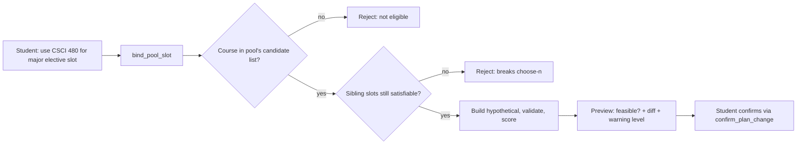
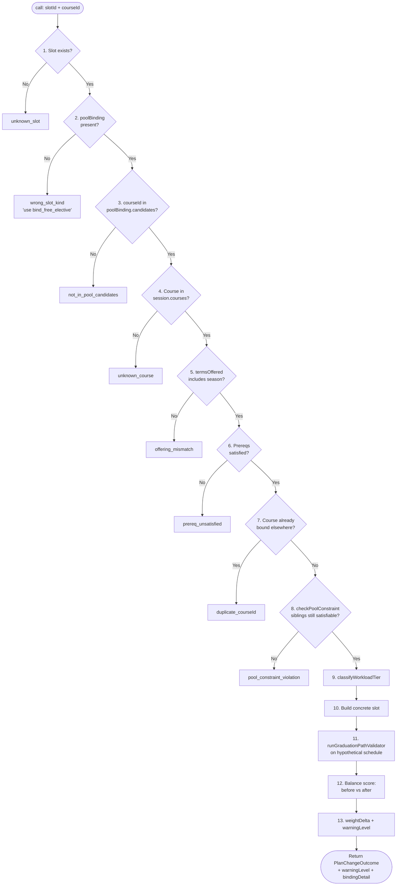
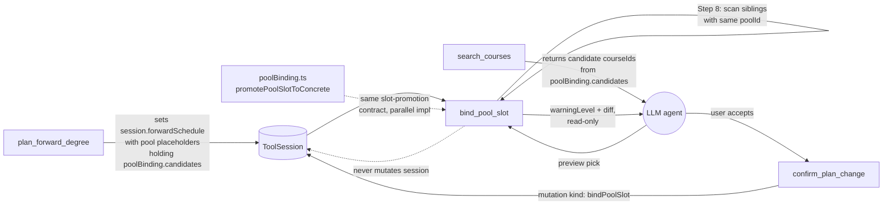

# bind_pool_slot — Technical Audit

## TL;DR

Many NYU requirements say "pick 3 from this list of 8 courses." When the planner schedules those, it places 3 placeholder slots all tagged with the same pool, each one a generic "you'll pick something from this list later." When you say "use CSCI 480 for one of my CS major elective slots in Fall 2026," this tool previews that pick. It first confirms the course is actually in that pool's candidate list (a major elective slot won't accept a random art history course), then checks the harder constraint: if you commit this course here, do the other sibling pool slots still have enough remaining candidates to satisfy the choose-n rule? If you only have 4 candidates left for 3 remaining slots, you're fine; if you'd box yourself in, the tool flags it. It re-runs the graduation validator on a hypothetical schedule, scores workload and balance impact, and returns a feasibility verdict and warning level. Like its free-elective sibling, it writes nothing — committing goes through confirm-plan-change. Needs an active plan and a DPR loaded.



---

A read-only preview tool that takes a specific course and a *requirement-pool* placeholder slot from the active forward schedule and asks: *can we satisfy this pool with this course, in this term, without breaking the choose-n constraint for the rest of the pool?* It returns a diff, a feasibility verdict, and a warning level — it never writes session state. Committing is the job of `confirm_plan_change`.

Source: `packages/engine/src/agent/tools/bindPoolSlot.ts` (lines 1-567). The promotion mechanics shared with the solver live in `packages/engine/src/agent/forwardSchedule/poolBinding.ts` (lines 1-133).

---

## 1. Purpose

NYU degree requirements often take the form "*pick N courses from this list*" — for instance, *choose 3 from {CSCI-UA 470, 472, 473, 480}* for a CS major elective requirement. The planner can place a *pool slot* in a future semester: a placeholder that reserves credits + tier + a candidate list, but commits to no specific course. Later, the student decides which course goes in which slot.

`bind_pool_slot` is the preview-before-commit for that decision. A "pool slot" — also called a *requirement-pool slot* — differs from a "free-credit" slot (handled by `bind_free_elective`) in three ways:

1. **It has a `poolBinding` field** (line 288 — the very first kind-check the tool runs).
2. **The candidate set is finite**. `poolBinding.candidates` is the authoritative list of courses that satisfy this pool. The chosen `courseId` MUST be in it (line 304).
3. **It participates in a choose-n constraint shared with sibling slots**. If a pool requires *N* selections, the planner places *N* slots all carrying the same `poolBinding.poolId`. Binding one slot consumes one candidate; the remaining *N-1* slots must still each have at least one unused candidate, or the pool becomes unsatisfiable.

Compared to `bind_free_elective`:

| Aspect | `bind_free_elective` | `bind_pool_slot` |
|---|---|---|
| Slot identification | `placeholder` with `poolBinding` *absent* | `placeholder` with `poolBinding` *present* |
| Candidate course universe | Any course in `session.courses` | Restricted to `poolBinding.candidates` |
| Workload tier | Forced to `"free-elective"` (empty rule maps) | Uses actual `satisfiesRules` + `optional` flag |
| Slot constraint | None (each slot is independent) | Choose-n: sibling pool slots must remain satisfiable |
| `isOptional` flag fed to tier classifier | Hard-coded `true` | Read from `parentSlot.optional` |
| `reason` text on concrete slot | `"Bound from free-credit placeholder (Decision #37)"` | `"Bound from pool: <poolId> / <satisfiesRule>"` |

The tool's structure is otherwise the same: validate the binding, build a hypothetical schedule, re-run the graduation-path validator, score balance impact, classify a warning level, return a `PlanChangeOutcome` + `warningLevel`. Commit is deferred to `confirm_plan_change`.

Governing decisions per the file header (lines 1-26):

- **Decision #28** — Late-binding for choose_n elective pools.
- **Decision #38** — PlaceholderSlot tagged union; `RequirementPoolSlot` is the kind this tool handles.
- **Decision #4** — `isPrereqSatisfied` for prerequisite checks.
- **Decision #24 / #35** — workload tier classification.
- **Decision #25** — balance-impact classification.

---

## 2. Input Schema

Lines 61-70.

```
{
  slotId:   string (>=1 char)   // placeholderId of the requirement-pool slot
  courseId: string (>=1 char)   // course to bind (must be in poolBinding.candidates)
}
```

Both required. The Zod schema enforces non-empty strings; the candidate-membership check happens inside `call()` at Step 3.

---

## 3. Session Prerequisites

`validateInput` (lines 244-261) hard-rejects if either of these is missing:

| Requirement | Rejection message |
|---|---|
| `session.forwardSchedule` is set | "No forward plan exists in this session. Call plan_forward_degree first, then bind pool slots." |
| `session.degreeProgressReport` is set | "No Degree Progress Report loaded. Cannot validate pool-slot binding without DPR data." |

Same two preconditions as `bind_free_elective`. Both must hold before `call()` runs.

---

## 4. What It Reads

From `ToolSession`:

| Field | Used for |
|---|---|
| `session.forwardSchedule` (line 268) | Universe of slots; original + hypothetical schedules |
| `session.degreeProgressReport` (line 269) | Prereq oracle + validator input |
| `session.courses` (line 270, default `[]`) | Catalog lookup for the candidate `courseId` |
| `session.prereqs` (line 271, default `[]`) | Prereq groups for the candidate course |
| `session.schoolConfig?.residency?.minCredits` (line 484) | Passed to the graduation-path validator |
| `session.schedulePreferences?.loadStyle` (line 494, default `"balanced"`) | Input to the balance-score function |

From the `ForwardSchedule`:

- `schedule.semesters[]` — iterated to find the slot (lines 90-100), to find sibling pool slots (lines 158-171), and to build the `plannedPlacements` map for prereq checking (lines 347-354).
- `schedule.graduationCreditMinimum` (line 483) — passed as the degree credit floor to the validator (not the raw school config — see lines 481-483).
- `schedule.graduationTerm` (line 489) — passed as `graduationTargetTerm`.

From the matched placeholder slot (`parentSlot`):

- `parentSlot.poolBinding` (line 288) — required; carries `poolId`, `satisfiesRule`, `candidates`.
- `parentSlot.satisfiesRules` (line 442) — copied to concrete slot; fed to tier classifier.
- `parentSlot.credits` (line 457) — copied verbatim onto the concrete slot.
- `parentSlot.optional` (line 449) — passed to the tier classifier as `isOptional`. Unlike `bind_free_elective`, this is *not* hard-coded — pool slots can be optional or required depending on the rule.
- `parentSlot.rationale`, `parentSlot.flexibility`, `parentSlot.downstreamImpact`, `parentSlot.confidence`, `parentSlot.isCriticalPath` — inherited by the concrete slot (lines 461-467).
- `parentSlot.workloadWeight` (line 500) — baseline for the `weightDelta` used by the warning level.

From sibling pool slots (during the choose-n check at lines 158-171):

- Their `placeholderId` and `poolBinding.candidates` arrays.

---

## 5. Algorithm

Twelve ordered steps in `call()` (lines 267-554). The first failure aborts with a typed conflict; the last step assembles the success output.



### Step 1 — Slot lookup

`findSlotWithTerm(schedule, slotId)` (lines 86-101) scans every semester's slots for `slot.kind === "placeholder"` and `slot.placeholderId === slotId`. Returns `{ slot, term }` or `null`. Miss → `unknown_slot`, `feasible: false`, warning `strong` (lines 275-283).

### Step 2 — Slot must have a `poolBinding`

Line 288 checks `parentSlot.poolBinding`. If absent, the slot is a free-credit or advising placeholder, not a pool slot. Reject with `wrong_slot_kind`, detail: "Slot has no poolBinding — not a requirement-pool slot" (lines 289-298). The user-facing message tells the agent to call `bind_free_elective` instead (line 294).

### Step 3 — `courseId` is in the candidate list

`poolBinding.candidates.includes(input.courseId)` (line 304). A miss returns `not_in_pool_candidates` and the rejection message includes the entire candidate list verbatim — see line 309-310: "Available candidates: \<comma-joined list\>". This is intentional: it gives the LLM the candidate set to pick from on the next turn without an extra tool call.

### Step 4 — Course exists in catalog

Same as in `bind_free_elective`: `courses.find((c) => c.id === input.courseId)` (line 318). Miss → `unknown_course` (lines 319-327).

### Step 5 — Course is offered in the slot's term

`termSeason(slotTerm)` parses `"2026-fall"` → `"fall"`. If `course.termsOffered` doesn't include the parsed season → `offering_mismatch` (lines 330-342).

### Step 6 — Prereqs satisfied

Identical pattern to `bind_free_elective` (lines 345-410):

1. Look up `prereqEntry` in `session.prereqs` by `p.course === input.courseId`. Absent → skip.
2. Build `plannedPlacements` from current `specific_planned` slots.
3. For each `prereqEntry.prereqGroups`:
   - **AND**: every member must satisfy `isPrereqSatisfied(...)` with the slot's term as the dependent term. First failure aborts.
   - **OR**: at least one member must satisfy.
   - NOT groups: not handled here (no equivalent of the `// NOT groups` comment in `bind_free_elective` line 340, but the loop falls through identically — only `AND` and `OR` branches are present, lines 357 and 380).
4. Each failure → `prereq_unsatisfied` with the upstream reason string (lines 367-377 for AND, 396-406 for OR).

### Step 7 — Course not already bound

`isCourseAlreadyBound(schedule, courseId)` (lines 107-116) returns true if any slot is `specific_planned` with the same `courseId`. Hit → `duplicate_courseId` (lines 413-421).

**Asymmetry with `bind_free_elective`**: this version only checks `kind === "specific_planned"` (line 110), whereas `bind_free_elective` also checks `in_progress` and `completed` (lines 117-122 of `bindFreeElective.ts`). The pool-slot tool will *not* refuse to bind a course that is currently in-progress or already on the transcript. This is a behavioral divergence in the source.

### Step 8 — Choose-n constraint

`checkPoolConstraint(schedule, slotId, courseId)` (lines 129-198) enforces the shared-pool invariant. Two passes:

1. **Find target's `poolId`**. Iterate all placeholder slots, find the one with `placeholderId === targetSlotId` and a `poolBinding`, capture its `poolId` (lines 139-152). If not found → return `{ ok: true }` (line 154), since the slot mismatch is the caller's problem to handle elsewhere.

2. **Collect siblings**. Iterate all placeholder slots again; for each one whose `placeholderId !== targetSlotId` AND `poolBinding?.poolId === targetPoolId`, push `{ candidates, placeholderId }` into `otherPoolSlots` (lines 157-171).

3. **Greedy feasibility check**. If `otherPoolSlots.length === 0`, no constraint to enforce → `ok: true` (lines 173-176). Otherwise:
   - Initialize `consumedCourses` with `boundCourseId` already inside it (line 181) — this candidate is no longer available to siblings.
   - For each sibling in order, compute `available = candidates.filter((c) => !consumedCourses.has(c))`.
   - If `available` is empty → return `{ ok: false, detail }` with a message naming the sibling slot that's been starved (lines 184-192).
   - Otherwise, greedily consume `available[0]` (line 194) and continue.

This is a *necessary* check (each sibling can still pick a course) but not a sufficient bipartite-matching solution — the greedy "take the first available" can produce false negatives if two siblings have overlapping small candidate sets that a smarter assignment could resolve. The source treats it as a fast screen rather than a complete oracle. Hit → `pool_constraint_violation` (lines 425-433).

### Step 9 — Workload tier classification

`classifyWorkloadTier(...)` (lines 440-450) is called with:

- the candidate's `courseId`
- `parentSlot.satisfiesRules`
- *empty* rule maps (`majorRuleKinds`, `schoolCoreRuleIds`, `generalCategoryRuleIds`) — same as `bind_free_elective`
- the course's `title` as `bulletinTitle`
- the prereq groups (or `undefined`)
- `isOptional: parentSlot.optional` — **this differs from `bind_free_elective`**, which hard-codes `true`. Pool slots that satisfy required rules pass `false`.

Returns `{ tier, weight }`.

### Step 10 — Build the concrete slot

`ScheduleSlotSpecificPlanned` is constructed (lines 453-468). Inherits credits, satisfiesRules, rationale, flexibility, downstreamImpact, confidence, isCriticalPath from the parent. Gets fresh `workloadTier` + `workloadWeight` from Step 9. `bindingState: "bound"`. The `reason` is `"Bound from pool: <poolId> / <satisfiesRule>"` (line 459), which differs from `bind_free_elective`'s decision-tag reason.

The shared promotion helper `promotePoolSlotToConcrete` in `forwardSchedule/poolBinding.ts:98-133` constructs the same shape (plus optional `optionalReason` and `approvalAuthority` carry-overs at lines 128-129). The bind-pool-slot tool inlines a near-equivalent constructor at lines 453-468 — they're parallel implementations of the same slot promotion. The shared helper additionally guards against re-promoting an already-bound slot (lines 102-104 of `poolBinding.ts`: rejects unless `bindingState ∈ { "placeholder-pending", "placeholder-deferred" }`) — but the tool itself does not perform this guard; it relies on the slot still being `kind === "placeholder"` from the `findSlotWithTerm` lookup.

### Step 11 — Hypothetical plan + validator

`buildHypotheticalSchedule(...)` (lines 204-224) is the same replace-by-id pass. The result is fed to `runGraduationPathValidator(...)` (lines 477-491) with the same narrow `programRules` shape as `bind_free_elective`:

- `degreeCreditMinimum`: `schedule.graduationCreditMinimum`
- `residencyMinCredits`: `session.schoolConfig?.residency?.minCredits ?? null`
- `majorCreditMinimum`, `minorCreditMinimum`, `upperLevelMinCredits`, `schoolCoreMinCredits`: all `null`
- `graduationTargetTerm`: `schedule.graduationTerm`

The validator's `feasible` is the final word on whether the binding is legal (returned at line 543).

### Step 12 — Balance score + warning level

Lines 493-513. Same logic as `bind_free_elective`:

```
beforeScore = computeBalanceScore(schedule.semesters, loadStyle)
afterScore  = computeBalanceScore(hypothetical.semesters, loadStyle)
classification = classifyBalanceDelta(beforeScore, afterScore)
weightDelta = workloadResult.weight - parentSlot.workloadWeight

if classification == "degraded-significant" OR weightDelta > 0.7
    -> "strong"
else if classification == "degraded-mild" OR (0.2 < weightDelta <= 0.7)
    -> "mild"
else
    -> "none"
```

Identical thresholds to `bind_free_elective`.

---

## 6. What It Writes Back to Session

**Nothing.** Declared `isReadOnly: true` (line 242). The file header at lines 25 contractually states: "isReadOnly: true — MUST NOT write to session state." The actual write — replacing the placeholder with the concrete slot in `session.forwardSchedule.semesters[].slots[]` — happens later in `confirm_plan_change`.

The solver-side promotion contract (`forwardSchedule/poolBinding.ts:76-85`) confirms this: "Phase 14 Task 6 contract: the binding tool (bindPoolSlot) calls this, then confirm_plan_change splices the new slot into the schedule." Note that the source comment refers to `promotePoolSlotToConcrete` as the helper *bindPoolSlot calls*, but the tool currently inlines an equivalent constructor at lines 453-468 rather than calling the shared helper directly.

---

## 7. Returns Shape

The output is a `BindPoolSlotOutput` (lines 51-55), which extends `PlanChangeOutcome` from `@nyupath/shared`:

| Field | Type | Source |
|---|---|---|
| `feasible` | boolean | `validatorResult.feasible` (line 543) |
| `diff.added` | array of `{ term, slot }` | one entry: the new concrete slot in the original term (lines 516-518) |
| `diff.removed` | array of `{ term, slot }` | one entry: the original placeholder (lines 519-521) |
| `consequences` | string[] | up to 3 plain-English lines (lines 523-540) |
| `conflicts` | optional array of `{ kind, detail }` | undefined on success; `[{kind:"plan_infeasible", detail}]` when validator fails (lines 546-548); single specific kind on hard rejections in Steps 1-8 |
| `warningLevel` | `"none" \| "mild" \| "strong"` | from Step 12 |
| `bindingDetail` | string | `<courseId> (<tier>, weight=<n.nn>) → pool slot <slotId> [pool: <poolId>] in <term>` (lines 550-552) |

`consequences` content (lines 523-540):

1. (if `strong`) "This binding significantly increases workload (weight delta: +X.XX) or degrades plan balance."
2. (if `mild`) "This binding moderately increases workload (weight delta: +X.XX)."
3. Always: "Balance impact: \<classification\> (\<before\> → \<after\>)."
4. (if validator failed) "Warning: hypothetical plan fails validation. \<detail\>"

On hard-failure paths (Steps 1-8 fail-fast), `consequences` carries a single specific line and `diff` is `{ added: [], removed: [] }`. Notably, Step 3's failure (Section 10) embeds the full candidate list in the consequence message — line 309-310.

---

## 8. Envelope Behavior

Set in the `buildTool` call (lines 230-243):

| Property | Value |
|---|---|
| `name` | `"bind_pool_slot"` |
| `isReadOnly` | `true` |
| `maxResultChars` | `3000` |
| `outputMode` | default `"synthesis"` (no `outputMode` field set) |
| `validateInput` | session-prerequisite hook (Section 3) |

Default `outputMode` means the LLM is free to paraphrase. There is no `extractVerbatim` implementation. The `summarizeResult` output (Section 9) is the truncated safe surface.

---

## 9. Summary Text Format

`summarizeResult` (lines 555-566):

```
BIND POOL SLOT — feasible: <true|false>, warning: <none|mild|strong>
  Binding: <bindingDetail>                       (omitted if bindingDetail absent)
  • <consequences[0]>
  • <consequences[1]>
  • <consequences[2]>
  • <consequences[3]>                            (max 4 bullets)
  Conflicts: <kind1>, <kind2>, ...               (omitted if no conflicts)
```

`bindingDetail` includes both the slot id AND the pool id (`[pool: <poolId>]`), which is the key visible difference from `bind_free_elective`'s summary. The summary is then truncated to 3000 chars by the `buildTool` factory wrapper (`tool.ts:264-268`).

---

## 10. Validation / Edge Cases

A consolidated map. Numbers in parentheses are line ranges in `bindPoolSlot.ts`.

| Case | Conflict `kind` | Lines | Notes |
|---|---|---|---|
| `slotId` does not match any placeholder | `unknown_slot` | 275-283 | warning `strong` |
| Slot exists but has no `poolBinding` (free-credit or advising) | `wrong_slot_kind` | 288-299 | Message points to `bind_free_elective` |
| `courseId` not in `poolBinding.candidates` | `not_in_pool_candidates` | 304-315 | Rejection message embeds the full candidate list |
| `courseId` not in `session.courses` | `unknown_course` | 318-327 | Catalog lookup miss |
| Course not offered in slot's term | `offering_mismatch` | 330-342 | Same `termSeason` parse + `termsOffered` check |
| Prereq AND-group member unsatisfied | `prereq_unsatisfied` | 367-378 | First failing member aborts |
| Prereq OR-group has zero satisfied members | `prereq_unsatisfied` | 396-407 | |
| `courseId` already `specific_planned` somewhere | `duplicate_courseId` | 110, 413-421 | **Asymmetry**: unlike `bind_free_elective`, this does NOT catch `in_progress` or `completed` |
| Choose-n constraint: binding starves a sibling pool slot | `pool_constraint_violation` | 183-191, 425-433 | Greedy check — can produce false negatives on tight overlapping pools |
| Hypothetical plan fails graduation-path validator | `plan_infeasible` | 537-548 | `feasible: false` but warning still computed and returned |
| Sibling pool slots exist for the same `poolId` but every sibling still has alternates | (no failure) | 157-197 | Greedy assignment succeeds → continue |
| No sibling pool slots (this is the only slot in its pool) | (no failure) | 173-176 | Constraint trivially satisfied |
| `prereqEntry` absent for the course | (no failure) | 345-346 | Treated as no prereqs |
| Term season unparseable | (no failure) | 330-331 | Offering check is guarded by `if (season && ...)` |
| Parent slot's `optional` is `undefined` | passes through | 449 | `classifyWorkloadTier` receives `undefined` for `isOptional`; behavior depends on classifier defaults |
| Course catalog empty (`courses ?? []`) | covered by `unknown_course` | 270, 318 | |

Special structural notes:

- The choose-n check (Step 8) is *necessary but not sufficient* for full pool feasibility. It's a fast greedy check — adequate for screening obvious violations, but doesn't guarantee a globally optimal pool assignment exists. The validator at Step 11 is the gate for hidden infeasibilities the greedy check misses.

- The shared helper `promotePoolSlotToConcrete` in `forwardSchedule/poolBinding.ts:98-133` exists to guarantee a single shape for the concrete slot, but `bind_pool_slot` does *not* invoke it — it inlines an equivalent constructor at lines 453-468. The fields are the same (kind, courseId, title, credits, satisfiesRules, reason, rationale, flexibility, downstreamImpact, workloadTier, workloadWeight, bindingState, confidence, isCriticalPath) except: the shared helper conditionally adds `optionalReason` and `approvalAuthority` (lines 128-129 of `poolBinding.ts`), while the inlined constructor in `bind_pool_slot` does not propagate those fields.

---

## 11. Interactions



| Tool | Relationship to `bind_pool_slot` |
|---|---|
| `plan_forward_degree` | Hard prerequisite. Without `session.forwardSchedule`, validateInput rejects (lines 245-252). The planner is what creates the pool placeholders this tool binds into; it also populates each pool slot's `poolBinding.candidates` list. |
| `confirm_plan_change` | The commit step. `bind_pool_slot` produces the diff; `confirm_plan_change` is the only path that splices the new `specific_planned` slot into `session.forwardSchedule`. Tool description at lines 230-240 explicitly tells the LLM: "Use this BEFORE calling confirm_plan_change with a bindPoolSlot mutation." |
| `bind_free_elective` | Sibling tool. The `wrong_slot_kind` rejection at line 294 redirects the LLM if it passes a free-credit slot id to this tool. They share the same validation skeleton; `bind_pool_slot` adds the candidate-membership check (Step 3) and the choose-n constraint (Step 8), and differs in how it computes the workload tier (Step 9 uses `parentSlot.optional`, not a hard-coded `true`). |
| `search_courses` | Typical upstream for candidate courseIds, though for pool slots the candidate list is *already known* from `poolBinding.candidates`. Search is more useful for inspecting metadata (title, terms offered, prereqs) on the listed candidates than for discovery. |
| `runGraduationPathValidator` (internal, called at line 477) | Owns the `feasible` verdict. |
| `computeBalanceScore` / `classifyBalanceDelta` (internal, called at lines 495-497) | Supply the balance side of the warning level. |
| `classifyWorkloadTier` (internal, called at lines 440-450) | Supplies the workload side of the warning level. |
| `isPrereqSatisfied` (internal, called inside Step 6) | Same helper used by the planner itself (Decision #4). |
| `promotePoolSlotToConcrete` (`forwardSchedule/poolBinding.ts:98-133`) | Solver-side equivalent of Step 10. Used by the planner during initial schedule construction; the tool inlines parallel logic instead of calling it. |
| `placePoolSlot` (`forwardSchedule/poolBinding.ts:49-59`) | Solver-side initial placement: builds the `RequirementPoolSlot` with `bindingState: "unbound"` and `bound: undefined`. This is what produces the slots `bind_pool_slot` later resolves. |

The two-step preview-then-commit pattern matches the contract `tool.ts:59-64` documents for `pendingMutations`. `bind_pool_slot` is the preview half; `confirm_plan_change` is the apply half — and only `confirm_plan_change` is allowed to mutate `session.forwardSchedule`.
