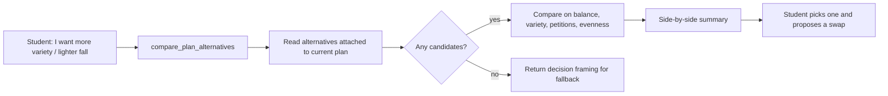
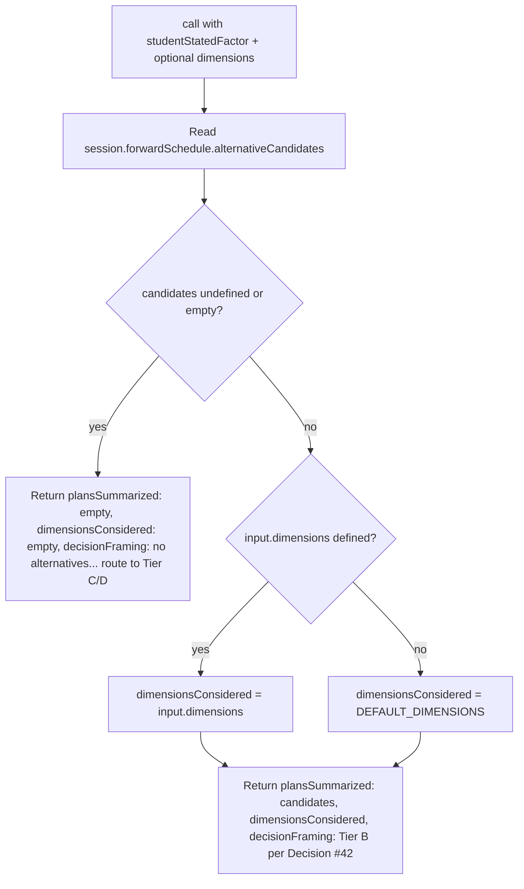

# `compare_plan_alternatives` — Tool Audit

## TL;DR

When you say something soft and qualitative like "I'd prefer lighter fall semesters," "I want more subject variety," "fewer petitions please," or just "show me alternatives to my current plan," this tool surfaces the alternative-plan candidates the solver already attached to your current plan during planning. It's read-only — it just compares the candidates that exist along axes like balance score, subject variety, total petition count, and how even the hard-course load is across terms. It doesn't pick one for you and it doesn't apply anything; once you see the comparison, you'd route your pick through the propose/confirm change flow to actually switch. If the solver didn't generate any alternatives, the tool gracefully tells you so the conversation can fall back to manually proposing changes. This sits in the middle of a fallback hierarchy: it's the "let's see what was already on the menu" step before you start cooking up custom mutations.



---

Source files:
- Tool definition: `packages/engine/src/agent/tools/comparePlanAlternatives.ts`
- Tool contract: `packages/engine/src/agent/tool.ts`
- Alternative summary shape: imported from `@nyupath/shared` as `AlternativePlanSummary`

---

## 1. Purpose

`compare_plan_alternatives` surfaces the solver-generated **alternative-plan candidates** attached to the current `ForwardSchedule`, so the LLM can reason over them when the student states an unmodeled soft preference. Used for things like:

- "I want more subject variety."
- "I prefer lighter fall semesters."
- "Fewer petitions, please."
- "Show me alternatives to my current plan."

This is the read-only Tier B step in a 4-tier fallback hierarchy. The tool itself does NOT decide which alternative to apply; it returns the candidate list and lets the agent route the student's chosen mutation through the existing `confirm_plan_change` two-step.

When the session has no alternatives (or the solver did not emit any), the tool returns an empty candidate list and a fixed `decisionFraming` that routes the LLM to Tier C/D handling.

---

## 2. Input schema

Pseudo-type:

```
{
  studentStatedFactor: string,                    // required
  dimensions?:         string[]                   // optional; defaults to four axes (see below)
}
```

Defined at `comparePlanAlternatives.ts:67-82`.

- `studentStatedFactor` — the student's soft preference being compared (e.g. `"lighter workload"`, `"more subject variety"`, `"fewer petitions"`).
- `dimensions` — optional list of metadata axes to surface. The tool echoes this back in `dimensionsConsidered` for the LLM's reasoning. **Note**: `studentStatedFactor` is required by the schema but is **not consumed by the call function** beyond input validation — it exists for the LLM's own bookkeeping (it ends up nowhere in the tool's output).

Tool flags:
- `isReadOnly` = `true` (line 83).
- `maxResultChars` = 4000 (line 84).
- `outputMode` is the default `"synthesis"`.

### Default dimensions

`DEFAULT_DIMENSIONS` (lines 25-30):

```
["balanceScore", "distinctSubjectsCount", "totalPetitionCount", "hardCount-evenness"]
```

When `input.dimensions` is undefined, this default array is used as `dimensionsConsidered`. When `input.dimensions` is defined (including an empty array), the input value is used as-is.

---

## 3. Session prerequisites + `validateInput`

There is **no `validateInput` hook**. The tool always runs. Missing data is encoded in the output via `plansSummarized: []` and the no-alternatives `decisionFraming` rather than as a rejection.

---

## 4. What it reads

From `ToolSession`:
- `session.forwardSchedule?.alternativeCandidates` — the array of `AlternativePlanSummary` entries emitted by the solver's Stage 7. Optional/may be absent.

It does NOT read `studentDraftPlan`, `schedulePreferences`, the DPR, the student profile, or any catalog. Only the alternative-candidates array on the current valid `forwardSchedule`.

If `session.forwardSchedule` is absent, `candidates` resolves to `undefined`. The tool's empty-list branch fires.

---

## 5. Algorithm

`call()` (lines 89-110):



Step-by-step:

1. **Read candidates**: `candidates = session.forwardSchedule?.alternativeCandidates`. The optional chain handles both "no schedule" and "schedule but no alternatives attached".
2. **Empty branch**: if `candidates` is undefined OR `candidates.length === 0`, return:
   ```
   {
     plansSummarized:      [],
     dimensionsConsidered: [],
     decisionFraming:      NO_ALTERNATIVES_FRAMING
   }
   ```
   Where `NO_ALTERNATIVES_FRAMING` is the literal string (lines 46-48):
   > `"no alternatives available; route to Tier C clarification or (soft-only) Tier D heuristic mapping"`
3. **Non-empty branch**: resolve `dimensionsConsidered`:
   - If `input.dimensions !== undefined`, use the input array (even if empty).
   - Otherwise use `DEFAULT_DIMENSIONS`.
4. Return:
   ```
   {
     plansSummarized:      candidates,
     dimensionsConsidered: <resolved array>,
     decisionFraming:      "Tier B per Decision #42"
   }
   ```

The tool does NOT rank, filter, score, or sort the candidates. It returns them in whatever order the solver produced.

The tool does NOT compare the candidates against the student's `studentStatedFactor`. That mapping is the LLM's job — the tool just surfaces the metadata.

---

## 6. What it returns

```
{
  plansSummarized:      AlternativePlanSummary[],
  dimensionsConsidered: string[],
  decisionFraming:      string
}
```

Each `AlternativePlanSummary` (per the summary's render at line 122-125) carries at least:
- `planIndex`             — number
- `graduationTerm`        — string
- `balanceScore`          — number
- `distinctSubjectsCount` — number
- `totalPetitionCount`    — number

The full shape lives in `@nyupath/shared` and is presumed to include any other fields the solver records (e.g. for the `hardCount-evenness` dimension).

`decisionFraming` is one of two fixed strings:
- `"Tier B per Decision #42"` — when candidates exist.
- The full `NO_ALTERNATIVES_FRAMING` string — when they don't.

---

## 7. Envelope behavior

- **`outputMode: "synthesis"`** (default — no `extractVerbatim`). Validator does not pin any specific text.
- **`isReadOnly: true`** (line 83). The tool description emphasizes this: it MUST NOT mutate `session.forwardSchedule` or any other session field under any branch. Application of a chosen mutation is routed through `confirm_plan_change`.
- **`maxResultChars` = 4000**; summary truncated above that by `buildTool`.
- The tool never writes to `session`.

---

## 8. Summary text format

`summarizeResult` (lines 111-128) emits one of two layouts.

**Empty branch:**

```
COMPARE PLAN ALTERNATIVES — <decisionFraming>
```

For an empty result, that becomes:

```
COMPARE PLAN ALTERNATIVES — no alternatives available; route to Tier C clarification or (soft-only) Tier D heuristic mapping
```

**Non-empty branch:**

```
COMPARE PLAN ALTERNATIVES — <count> candidate(s) (<decisionFraming>)
Dimensions: <dim1>, <dim2>, ...                          # omitted when dimensionsConsidered is empty
  [<planIndex>] grad=<graduationTerm> balance=<N.NN> distinctSubjects=<N> petitions=<N>
  [<planIndex>] ...
  ...
```

The per-candidate line uses 2-decimal `balanceScore` and integer counts. The `dimensionsConsidered` list is only printed when non-empty.

---

## 9. Interactions with other tools

- **`plan_forward_degree`** — Populates `session.forwardSchedule.alternativeCandidates` as part of the solver's Stage 7 output. `compare_plan_alternatives` reads what that step wrote.
- **`view_forward_plan`** — Companion read-only tool that surfaces the current `forwardSchedule` itself. `view_forward_plan` shows the plan; `compare_plan_alternatives` shows its alternatives.
- **`confirm_plan_change`** — The mutation step. After the LLM picks a candidate (in-prompt reasoning), the actual mutation is applied via `confirm_plan_change`'s two-step. The tool description explicitly directs the LLM to that flow.
- **Tier C / Tier D fallback** — When the tool returns the no-alternatives framing, the LLM is supposed to escalate to a Tier C clarification question or, for soft-only preferences, a Tier D heuristic mapping. Those paths are not implemented as a single tool — they're routing the LLM follows based on the `decisionFraming` string.

This tool does NOT chain to anything itself; no `suggestedFollowUps`.

---

## 10. Edge cases

- **No `forwardSchedule` in session** — `candidates` resolves to undefined → empty branch fires. The student is routed to Tier C/D even though the "real" reason is that no plan has been generated. (The tool does NOT separately distinguish "no schedule" from "schedule with empty candidates".)
- **`forwardSchedule` set but `alternativeCandidates` undefined** — Same as above. Empty branch.
- **`forwardSchedule.alternativeCandidates` is `[]`** — Empty branch. The no-alternatives framing fires.
- **`input.dimensions` provided as an empty array** — Used as-is. `dimensionsConsidered: []`. The "Dimensions:" line is omitted from the summary.
- **`input.dimensions` omitted** — Falls back to `DEFAULT_DIMENSIONS` (`balanceScore`, `distinctSubjectsCount`, `totalPetitionCount`, `hardCount-evenness`).
- **`studentStatedFactor`** — Required by the Zod schema. Empty strings would still validate (the schema is `z.string()`, no `min(1)`). The value is otherwise unused by the tool's logic; it is purely for the LLM's own context.
- **Candidates returned unsorted** — The tool does NOT sort or rank. The summary lines appear in solver-emitted order. If the LLM's reasoning depends on ordering by, e.g., `balanceScore`, it must do that itself.
- **More than ~5 candidates** — The tool description mentions "up-to-5" candidates as the solver's contract, but the tool itself imposes no cap. Whatever the solver wrote, the tool returns.
- **`maxResultChars` (4000) exceeded** — Truncated by `buildTool` with a trailing `…`. Structured output is unaffected.
- **DPR loaded** — No special handling. The tool reads only `session.forwardSchedule.alternativeCandidates`, irrespective of DPR presence.
- **`studentDraftPlan` set instead of `forwardSchedule`** — Not read. Per the design, draft plans don't carry alternative candidates that the agent endorses; the tool only consults the valid-plan slot.
- **`decisionFraming` is fixed text, not parameterized** — The two possible values are hard-coded literals. The LLM sees one of them and routes accordingly; there is no per-call customization.

---

## Summary

`compare_plan_alternatives` is a strict read-only surface over `session.forwardSchedule.alternativeCandidates`. It returns either the solver's candidate list (with a fixed `"Tier B per Decision #42"` framing and either caller-provided or default `dimensionsConsidered` axes) or an empty list with a fixed routing-to-Tier-C/D framing string. It does NOT rank, score, sort, or filter; it does NOT consume `studentStatedFactor` beyond input validation; it does NOT mutate session state. The LLM uses the returned metadata to reason in-prompt over the alternatives and routes any chosen mutation through `confirm_plan_change`.
