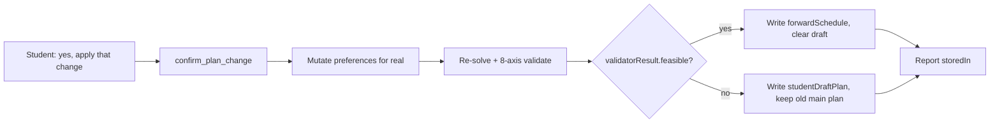
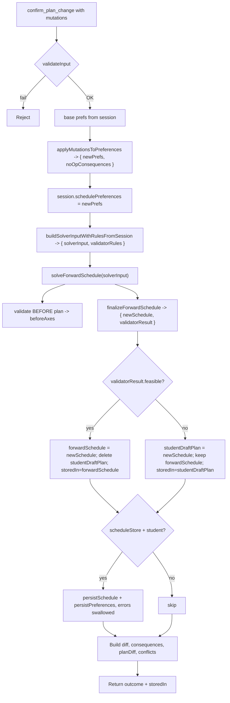

# confirm_plan_change — Technical Audit

> Last verified against code: 2026-06-19 (plan 37 — M1: `persistSchedule` + `persistPreferences` are now **gated on `validatorResult.feasible`** — an infeasible result lives only in the in-memory `studentDraftPlan` scratchpad and is NEVER written to the DB; the previously-committed valid plan stays live. The `force`/"override anyway" path is RETIRED — there is no override; J2: `resolveBindMutations` is called before the prefs walk to translate `bindFreeElective`/`bindPoolSlot` mutations into durable `pin(courseId, term, freeze:true)` entries; C2: `passFailConfig` from `session.schoolConfig` is threaded into `finalizeForwardSchedule` so the 8th `passFailLimitsRespected` axis fires; the tool description clarifies that `confirm_plan_change` accepts only `{ mutations }` — there is no `pendingMutationId` parameter).

## Purpose

This tool runs after the student previewed a change (via [`propose_plan_change`](propose_plan_change.md)) and said "yes, do it." It takes the exact same mutation list — pin this course, drop that one, add summer, swap A for B — and actually applies it to `session.schedulePreferences`, then re-runs the planner so the saved plan reflects the change. The routing is the clever part: if the resulting plan passes the authoritative **8-axis validator** (7 graduation-path axes + the plan-37 `passFailLimitsRespected` axis), it is saved into the main `forwardSchedule` slot and any prior draft is cleared. If the change makes the plan infeasible, it lands in the separate `studentDraftPlan` slot instead, leaving the previously-valid plan untouched so the system never quietly endorses a broken plan. **Plan 37 (M1):** the DB persist (`persistSchedule` + `persistPreferences`) is **gated on feasibility** — an infeasible result is written ONLY to the in-memory `studentDraftPlan` scratchpad and NEVER to the database, so the previously-committed valid plan stays live. The `force`/"Override anyway" path is **RETIRED** — the server rejects any attempt to commit an infeasible plan and there is no override path. The output always reports which slot was updated. This is the only tool in the propose/confirm pair that writes session state.



---

Source files:
- `packages/engine/src/agent/tools/confirmPlanChange.ts`
- `packages/engine/src/agent/forwardSchedule/planChangeHelpers.ts`
- `packages/engine/src/agent/forwardSchedule/build.ts` (`finalizeForwardSchedule`)
- `packages/engine/src/agent/forwardSchedule/tradeOffEngine.ts` (`diffPlanTradeOffs`)
- `packages/engine/src/agent/tool.ts`

---

## 1. What it does

`confirm_plan_change` is the **writing** half of the two-step plan-mutation contract. It accepts the same `mutations[]` array as `propose_plan_change`, applies them to `session.schedulePreferences` (actually mutating it), re-runs the forward solver, routes the new schedule through the **authoritative 8-axis validator** (plan-37: 7 graduation-path axes + `passFailLimitsRespected`), writes the result to one of two session slots per Decision #32, and (when wired and **only when feasible**) persists the schedule + preferences through `session.scheduleStore` (M1).

The routing rule keys on the **validator's verdict**, not the solver's coarse state (this is the post-rebuild PLAN-3 fix):

- `validatorResult.feasible === true` → write `session.forwardSchedule`, delete `session.studentDraftPlan`, `storedIn = "forwardSchedule"`.
- `validatorResult.feasible === false` → write `session.studentDraftPlan`, **keep** `session.forwardSchedule`, `storedIn = "studentDraftPlan"`.

`isReadOnly: false` (`confirmPlanChange.ts:122`) — the only tool in the pair that mutates session state.

---

## 2. Input schema

```
{
  mutations: PlanMutation[],          // min length 1 — shared verbatim with propose
  rankedAlternative?: {               // D6.3 — OPTIONAL re-rank provenance
    studentStatedFactor: string,
    selectedPlanIndex: number,        // planIndex from compare_plan_alternatives
    reasoning: string,
    dimensionsConsidered: string[]
  }
}
```

The 14-kind `PlanMutationSchema` (`planChangeHelpers.ts:74-132`) is **shared verbatim** between propose and confirm — they import the same Zod schema. The kinds are: `pin`, `exclude`, `swap`, `move`, `unpin`, `addTerm`, `loadStyleOverride`, `bindFreeElective`, `unbindFreeElective`, `bindPoolSlot`, `setSchedulingPreference`, `clearSchedulingPreference`, and the two D6.2 soft-objective kinds `addSoftObjective` / `clearSoftObjectives`. Every variant accepted by propose is accepted here. See [propose_plan_change §2](propose_plan_change.md) for the full mutation table; the effects on `session.schedulePreferences` are identical, with the same no-op behavior for `bindFreeElective` / `unbindFreeElective` / `bindPoolSlot` and ill-formed `loadStyleOverride` combinations. Mutations apply left-to-right; a `default: never` branch enforces exhaustiveness.

**`rankedAlternative` is confirm-only (D6.3) and OPTIONAL.** `propose_plan_change` does NOT accept it. The agent passes it **only** when applying an alternative it chose by re-ranking the schedule's `alternativeCandidates` via [`compare_plan_alternatives`](compare_plan_alternatives.md) (Tier B, Decision #42) — its `selectedPlanIndex` / `dimensionsConsidered` come straight from that read-only comparison. When present, confirm records the choice as a **durable `LLM_RANKED_ALTERNATIVE` Assumption** on the confirmed schedule (see §5a). Ordinary edits omit it and no provenance Assumption is added (it is **not** always-on).

---

## 2a. Re-rank provenance durability (D6.3)

The `compare_plan_alternatives` tool is strictly read-only — it surfaces the solver-generated candidate summaries for the LLM to reason over but writes nothing. So when the agent re-ranks those candidates against a student-stated soft factor and applies the winner, the *rationale* for that choice (which alternative, why, which dimensions) would be lost on the next turn unless it is recorded. D6.3 closes that gap **without adding a new persistence channel**:

- The provenance rides on the existing **`ForwardSchedule.assumptions[]`** as an `LLM_RANKED_ALTERNATIVE` Assumption (the variant already defined in `@nyupath/shared` types.ts; discriminated-union per Decision #42).
- `confirm_plan_change` persists the confirmed schedule via `scheduleStore.persistSchedule(...)`, and the P3.1 hydration path (`loadLatestSchedule`) returns the **full** `ForwardSchedule` including `assumptions`. So an Assumption appended to the confirmed schedule **persists, survives hydration, and is re-readable/re-explainable on a later turn** — the parallel-Assumption channel is durable. **No separate per-preference provenance store is needed** (Risk #6 default).

---

## 3. Session prerequisites — hard-refuse without a DPR

`validateInput` (`confirmPlanChange.ts:124`) is identical to propose's:

1. **No prior plan**: neither `forwardSchedule` nor `studentDraftPlan` is set → `"No forward plan exists in this session. Call plan_forward_degree first, then confirm changes."`
2. **No DPR**: `session.degreeProgressReport` is absent → `"No Degree Progress Report loaded. Cannot apply plan changes without DPR data."`

Both reject with `{ ok: false, userMessage }`; no write happens before validation passes. There is **no** check that `propose_plan_change` ran first — the route layer is trusted to enforce ordering; this tool will run cold as a standalone write.

---

## 4. What it reads from session

- `session.degreeProgressReport` — non-null after validation.
- `session.forwardSchedule` first, else `session.studentDraftPlan` (`confirmPlanChange.ts:148`) — the diff **baseline**.
- `session.schedulePreferences` — base preferences (defaults to `{}`).
- `session.schoolConfig` — for the double-count advisory.
- `session.student`, `session.prereqs`, `session.courses` — via `buildSolverInputWithRulesFromSession`.
- `session.scheduleStore` and `session.student.id` — checked to decide whether to persist.

The defensive guard (lines 150-158) returns an early infeasible outcome with `storedIn: "studentDraftPlan"` and conflict kind `"no_plan"` if both schedule slots are missing past validation.

---

## 5. Algorithm



**Step 0 — Resolve slot-level binds into pins (J2, plan 37).** `resolveBindMutations(currentPlan, mutations)` translates any `bindFreeElective(slotId, courseId)` or `bindPoolSlot(slotId, courseId)` mutation into a `pin(courseId, term, freeze:true)` by looking up the slot's term in the current plan. This makes the binding durable across future re-solves (the pin lands in `schedulePreferences.pins[]`). An `exclude` mutation that drops a bound course strips the matching pin. The resulting `resolvedMutations` array is what the prefs walk below operates on.

**Step 1 — Apply mutations and write them.** `applyMutationsToPreferences(session.schedulePreferences ?? {}, resolvedMutations)` returns `{ prefs: newPrefs, noOpConsequences }`. The tool then writes `session.schedulePreferences = newPrefs`.

**Step 2 — Build solver input + validator rules.** `buildSolverInputWithRulesFromSession(session, dpr, newPrefs)` makes ONE `buildProgramRules` call yielding both `solverInput` and `validatorRules`, with `newPrefs` as the override (identical to the just-written session value).

**Step 3 — Re-solve.** `solveForwardSchedule(solverInput)` runs the rebuilt feasibility-first search + materialize. See [forward-schedule audit](../engine/forward-schedule.md).

**Step 4 — Validate BEFORE + finalize AFTER through the 8-axis validator (plan 37).** `runGraduationPathValidator({ plan: currentPlan, passFailConfig: session.schoolConfig?.passFail, … })` produces `beforeAxes` (for `validationResultsChanges`). `finalizeForwardSchedule(solverOutput, solverInput, dpr, validatorRules, session.schoolConfig?.passFail)` (C2, plan 37) assembles `newSchedule` AND runs the validator — including the 8th `passFailLimitsRespected` axis fed by the per-school `passFail` config — returning `{ newSchedule, validatorResult }`. **The routing keys on `validatorResult.feasible`, not on the solver's coarse `state`** — closing the PLAN-3 hole where a confirmed edit could be stored to `forwardSchedule` ("valid") without the full 8-axis validator passing.

**Step 4a — Attach re-rank provenance (D6.3, when `rankedAlternative` was passed).** Immediately after `finalizeForwardSchedule` returns `newSchedule` and **before** the routing/persist below, if `input.rankedAlternative` is present the tool builds an `LLM_RANKED_ALTERNATIVE` Assumption `{ type, studentStatedFactor, selectedPlanIndex, reasoning, dimensionsConsidered }` and appends it to `newSchedule.assumptions[]` (immutably: `newSchedule.assumptions = [...newSchedule.assumptions, provenance]`). Because each `finalizeForwardSchedule` rebuilds `assumptions` fresh from the solver's emitted assumptions (the solver only emits `IP_COURSE_COMPLETION`, never `LLM_RANKED_ALTERNATIVE`), a prior turn's provenance is never carried into `newSchedule` — so this append yields exactly one `LLM_RANKED_ALTERNATIVE` on the live schedule and a re-confirm cannot stack duplicates (no de-dup guard needed). The append lands **before** Step 6's `persistSchedule`, so the provenance is on the row written to the store — and therefore survives `loadLatestSchedule` (P3.1) on a later turn (see §2a).

**Step 5 — Decision #32 routing** (`confirmPlanChange.ts:234`):

```
if (validatorResult.feasible) {
    session.forwardSchedule = newSchedule
    delete session.studentDraftPlan
    storedIn = "forwardSchedule"
} else {
    session.studentDraftPlan = newSchedule
    // forwardSchedule is NOT touched — keep the last valid plan
    storedIn = "studentDraftPlan"
}
```

A student who confirms a mutation that makes the plan infeasible **does not lose** their previous valid `forwardSchedule`. The draft sits in `studentDraftPlan`; the agent can still show the last good plan. The two slots can coexist when the latest confirm produced a draft, but cannot coexist when it produced a valid plan (the valid branch deletes the draft).

**Step 6 — Persist if wired — ONLY when feasible (M1, plan 37).** When both `scheduleStore` and `student` are present **and `validatorResult.feasible` is `true`**, two separate `try/catch` calls run:

- `scheduleStore.persistSchedule(student.id, newSchedule, computeDprFingerprint(dpr))`.
- `scheduleStore.persistPreferences(student.id, newPrefs)`.

Both errors are caught and `console.warn`-logged; they do **not** throw. **Critical change (M1):** before plan 37, both writes ran regardless of `storedIn` (even infeasible drafts were persisted). Now persistence is **gated on `validatorResult.feasible`** — an infeasible result lives only in the in-memory `studentDraftPlan` scratchpad and is NEVER written to the DB as the committed `forward_schedule`. The previously-committed valid plan stays live and is never superseded by a draft. The preferences write is also gated — an infeasible edit must not durably pin the mutation that broke the plan (a future re-solve would re-apply it and re-break).

**Step 7 — Build the outcome.** `computeSlotDiff`, `deriveConsequences`, `buildPlanDiff(currentPlan, newSchedule, { before: beforeAxes, after: validatorResult.axisResults })`. The double-count advisory is derived via `buildDoubleCountAdvisory(dpr, session.schoolConfig)` and — when non-null — attached as the **whole structured `Disclaimer`** (id + `reason` + `bulletinSource`) to the output's `disclaimers[]` envelope field (D3.2; it is **no longer** pushed bare into `consequences`, which previously dropped the citation), mirroring `plan_forward_degree`. When `!validatorResult.feasible`, the tool also pushes an explicit consequence: `"Plan fails graduation-path validation (<failing axes>): <conflictDetail>. Stored as a draft; your last valid plan is unchanged."` (`confirmPlanChange.ts`), plus a `conflicts` entry from the validator's `infeasibilityReport`.

Like propose, `buildPlanDiff` here populates the five trade-off fields (`newRequiresPetition`, `removedRequiresPetition`, `newUnmetRequirements`, `cascadedShifts`, `newAssumptions`) via `diffPlanTradeOffs`, and fills `validationResultsChanges` from the before/after axes.

---

## 6. What it returns

`ConfirmPlanChangeOutput` (`confirmPlanChange.ts:69`) extends `PlanChangeOutcome`:

```
{
  feasible: boolean,                         // validatorResult.feasible (8-axis)
  diff: { added, removed },
  consequences: string[],                    // validator-failure line; NO double-count text (rides disclaimers[])
  conflicts?: Array<{ kind, detail }>,       // from the validator's infeasibilityReport
  planDiff?: { ...same shape as propose's planDiff... },
  storedIn: "forwardSchedule" | "studentDraftPlan",
  disclaimers?: Disclaimer[],                // D3.2 — cited double-count advisory (id + reason + bulletinSource)
  rankedAlternative?: {                      // D6.3 — echoed re-rank provenance (present only when passed in)
    studentStatedFactor, selectedPlanIndex, reasoning, dimensionsConsidered
  }
}
```

The output's `rankedAlternative` mirrors the input and exists so `summarizeResult` can surface the recorded rationale to the student (§9); the **durable** copy is the `LLM_RANKED_ALTERNATIVE` Assumption on the persisted schedule's `assumptions[]` (§2a / §4a-equivalent Step 4a).

`storedIn` is always present. `planDiff` is populated whenever the solver ran. `conflicts` is conditional.

Differences from `propose_plan_change`'s output:
- **No** `explanation` string (propose-only).
- **No** `proposedSchedule` field — the schedule is read from session after the write.
- **Adds** `storedIn`.
- **Same** `disclaimers[]` envelope field — the cited double-count advisory (D3.2).

---

## 7. The contract — no `pendingMutationId`

There is **no** pending-mutation id. `confirm_plan_change` consults no `pendingMutations` map, and `propose_plan_change` populates none. The pattern is **stateless replay** — the route layer passes the same `mutations[]` to both tools. (Contrast `update_profile`/`confirm_profile_update`, which use `session.pendingMutations`, and `materialize_sections`/`confirm_section_combination`, which use `session.pendingMaterializations`.)

**Implication:** there is no staleness guard between the propose preview and the confirm write. Both run independent solver + validator passes. If session state changed between the two calls (DPR reloaded, `schedulePreferences` mutated directly, schoolConfig changed), the confirm result may differ from the preview.

---

## 8. What it writes to session

In order, during a successful call:

1. **`session.schedulePreferences`** — replaced with the post-mutation prefs (`confirmPlanChange.ts:166`).
2. **`newSchedule.assumptions[]`** (D6.3, only when `rankedAlternative` was passed) — gains one `LLM_RANKED_ALTERNATIVE` Assumption, appended **before** the routing/persist below (exactly one — `finalizeForwardSchedule` rebuilds `assumptions` fresh each confirm). This rides on whichever slot `newSchedule` lands in (step 3) and on the persisted row (step 4).
3. **One of:**
   - `session.forwardSchedule = newSchedule` AND `delete session.studentDraftPlan` (when `validatorResult.feasible`).
   - `session.studentDraftPlan = newSchedule` (otherwise; `forwardSchedule` is **kept**).
4. **(Optional, swallowed on failure):** `persistSchedule(...)` then `persistPreferences(...)`. The provenance Assumption from step 2 is on `newSchedule`, so it is part of the persisted row → durable across hydration.

What is NOT written: `studentDraftPlan` is not explicitly cleared on the draft path (only on the valid path); `pendingMutations`, `pendingMaterializations`, `lastMaterializationResult`, `degreeProgressReport`, `student`, `schoolConfig` are never touched.

---

## 9. Envelope behavior

- `name`: `"confirm_plan_change"`; `isReadOnly: false`.
- `maxResultChars: 4000`; `outputMode` defaults to `"synthesis"`; no `extractVerbatim`.

`summarizeResult` (`confirmPlanChange.ts:317`):

1. `CONFIRM PLAN CHANGE — feasible: <true|false>, stored in: session.<forwardSchedule|studentDraftPlan>`
2. If conflicts: `Conflicts (<n>):` then up to 3 `  [<kind>] <detail>` lines.
3. `Added slots: <n>, removed slots: <m>`
4. If consequences: `Consequences:` then up to 5 `  • <consequence>` lines.
5. If `planDiff`: `Balance: <before> → <after> (<classification>)`; if `planStateChange`: `Plan state: <from> → <to>`.
6. If `rankedAlternative` is present (D6.3): `Recorded why this plan was chosen: <reasoning> (dimensions: <dimensionsConsidered>)` — so the student sees the recorded rationale. Adds nothing for ordinary edits.
7. If `disclaimers` is non-empty (D3.2): the `renderEnvelopeMeta` block — a "DISCLAIMERS YOU MUST SURFACE" header with the advisory text and its `(reason: …; source: …)` citation line. Adds nothing when there is no advisory.

Compared to propose's summary: the header line differs (it reports `storedIn`); both share the cited-advisory block.

---

## 10. Interactions

- **`propose_plan_change`** — direct partner. Same input schema, same `PlanMutationSchema`. The two share these helpers from `planChangeHelpers.ts`: `PlanMutationSchema`, `applyMutationsToPreferences`, `buildSolverInputWithRulesFromSession`, `computeSlotDiff`, `deriveConsequences`, `buildPlanDiff`. A change to any of them affects both tools. No tool-layer enforcement of propose-before-confirm. See [propose_plan_change](propose_plan_change.md).
- **`plan_forward_degree`** — strict ordering: `validateInput` requires a schedule slot, which only `plan_forward_degree` creates. `confirm_plan_change` may transition a plan **out of** `forwardSchedule` into `studentDraftPlan` when a mutation makes a previously-valid plan infeasible — deliberately keeping the prior valid plan (Decision #32). See [plan_forward_degree](plan_forward_degree.md).
- **`simulate_alternatives`** — discovers relaxation options but does not commit. To commit one, the agent translates a `relaxation` into a `PlanMutation` (e.g. `include_summer` → `addTerm("summer")`). `extend_grad_one_term` does not map to any mutation kind — it requires a graduation-term override, which is `plan_forward_degree`'s territory.
- **`bind_free_elective` / `bind_pool_slot`** — `bindFreeElective` / `bindPoolSlot` mutation kinds are no-ops here; the real slot-level binding lives in those dedicated tools.

---

## Known limitations

- **The double-count advisory is now carried with its citation (D3.2 — fixed).** Same fix as propose: previously only the advisory's bare `text` was pushed into `consequences`, dropping `reason` + `bulletinSource`. It is now carried as a structured `Disclaimer` on the output's `disclaimers[]` envelope field and rendered by `summarizeResult` via `renderEnvelopeMeta`, matching `plan_forward_degree`. The inconsistency with the planner is closed.
- **`bindFreeElective` / `unbindFreeElective` / `bindPoolSlot` are wasted work here.** They don't change `schedulePreferences`, the re-solve produces essentially the same schedule, and the tool re-persists anyway. They exist in the schema as a forward-compatibility hook; the real bindings live in the dedicated `bind_*` tools.
- **Infeasible drafts are NOT persisted (M1 — fixed in plan 37).** `persistSchedule` and `persistPreferences` are now gated on `validatorResult.feasible`. An infeasible result lives only in the in-memory `studentDraftPlan` scratchpad; the previously-committed valid plan stays live and is never overwritten by a draft.
- **No staleness guard between propose and confirm** (see §7) — the confirm is an independent run from the preview the student saw.
