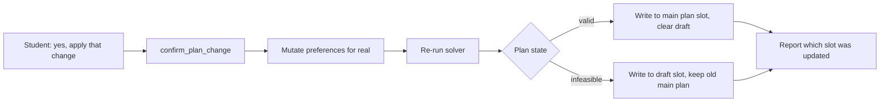
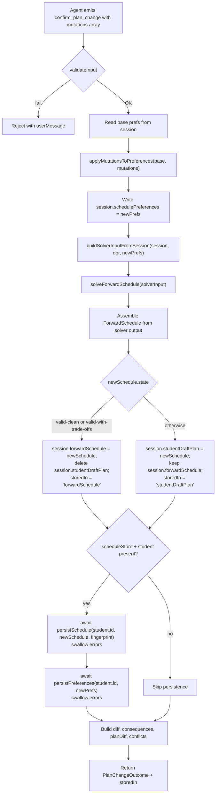
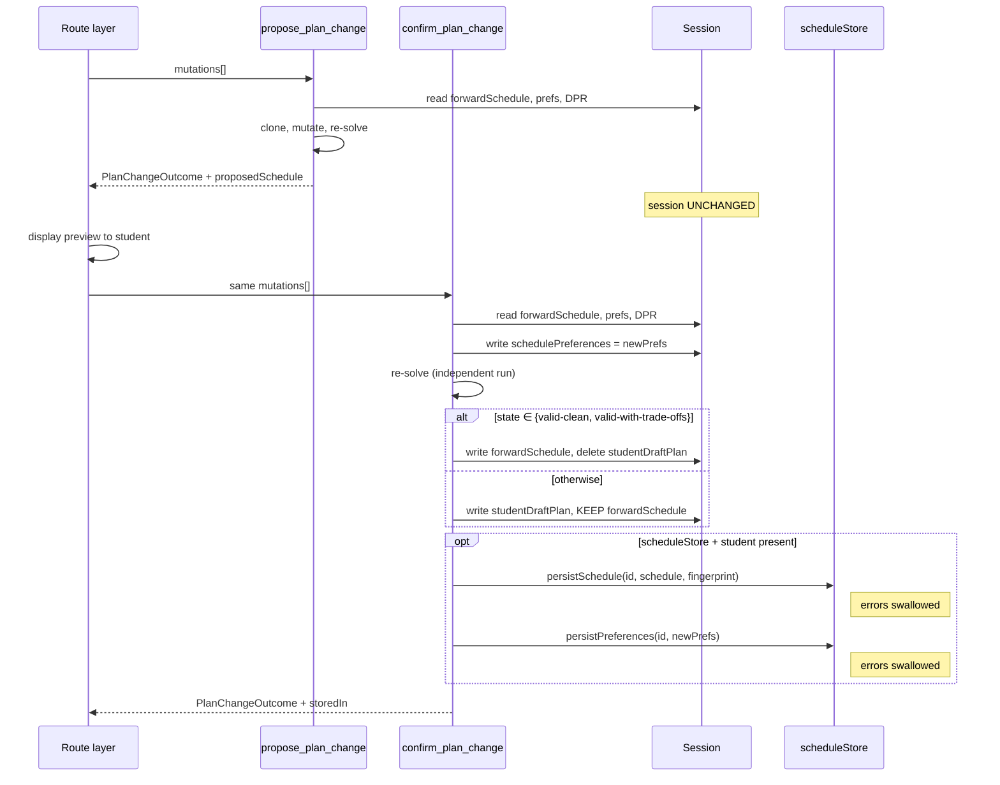

# `confirm_plan_change` — Technical Audit

## TL;DR

This tool runs after you've previewed a change (using the propose tool) and said "yes, do it." It takes the exact same change list — pin this course, drop that one, add summer, swap A for B — and actually applies it to your scheduling preferences, then re-runs the planner so the saved plan reflects the change. The clever part is the routing: if the resulting plan is valid (clean or with acceptable trade-offs), it gets saved into your main plan slot and any prior draft is cleared. But if the change makes the plan infeasible — say, you forced an impossible sequence — it lands in a separate "draft" slot instead, leaving your previously-valid plan alone so the system never quietly endorses a broken plan. You always know which slot was updated because the tool tells you. This is the only tool in the propose/confirm pair that actually writes session state.



---

Source files referenced:
- `packages/engine/src/agent/tools/confirmPlanChange.ts`
- `packages/engine/src/agent/forwardSchedule/planChangeHelpers.ts`
- `packages/engine/src/agent/forwardSchedule/types.ts`
- `packages/engine/src/agent/tool.ts`

---

## 1. Purpose

`confirm_plan_change` is the **writing** half of the two-step plan-mutation contract. It accepts the same `mutations[]` array as `propose_plan_change`, applies those mutations to `session.schedulePreferences` (now actually mutating it, not a clone), re-runs the forward solver, **routes** the new schedule into one of two session slots per Decision #32, and (when wired) persists the schedule + preferences through `session.scheduleStore`.

The routing rule is the substantive new behavior compared to `propose_plan_change`:

- `state ∈ { "valid-clean", "valid-with-trade-offs" }` → write to `session.forwardSchedule`, delete `session.studentDraftPlan`.
- `state ∈ { "infeasible-draft", "student-preferred-invalid-draft" }` (anything else) → write to `session.studentDraftPlan`, **keep** the existing `session.forwardSchedule`.

The output reports `storedIn: "forwardSchedule" | "studentDraftPlan"` so the route layer can tell which slot was updated.

`isReadOnly: false` (`confirmPlanChange.ts:60`) — this is the only tool in the propose/confirm pair that mutates session state.

---

## 2. Input schema

Identical to `propose_plan_change`:

```
{
  mutations: PlanMutation[]   // min length 1
}
```

The `PlanMutationSchema` (`planChangeHelpers.ts:55-94`) is **shared verbatim** between propose and confirm — they import the same Zod schema. Every variant accepted by propose is accepted here:

| `kind` | Effect on `session.schedulePreferences` |
|---|---|
| `pin {courseId, term, freeze?=true}` | Append `{courseId, term}` to `prefs.pins[]`, dedupe by `(courseId, term)`. If `freeze: false`, no write (transient placement). |
| `unpin {courseId, term}` | Remove matching `(courseId, term)` from `prefs.pins[]`. No-op if absent. |
| `exclude {courseId, term?}` | Append `{courseId, term?}` to `prefs.exclusions[]`, dedupe by `(courseId, term)`. |
| `swap {drop, add, term}` | Exclude `drop` (no term — keyed by courseId), pin `add` at `term`. |
| `move {courseId, fromTerm, toTerm}` | Add `{courseId, fromTerm}` to exclusions, dedupe by courseId only. Does NOT pin into `toTerm`. |
| `addTerm {term}` | Sets `prefs.includeSummer = true` (if `term` contains "summer") or `prefs.includeJTerm = true` (if contains "january"/"jterm"/"j-term"). Fall/spring → no-op. |
| `loadStyleOverride {style, term?}` | With `term`: write `prefs.loadStylePerTerm[term] = style` (only if `style ∈ {light, heavy, balanced}`; `frontload`/`backload` → no-op consequence). Without `term`: write `prefs.loadStyle = style` (only if `style ∈ {balanced, frontload, backload}`; `light`/`heavy` → no-op consequence). |
| `bindFreeElective` / `unbindFreeElective` / `bindPoolSlot` | **No-op** at preferences layer. Emit consequence string. |
| `setSchedulingPreference {value}` | Replace `prefs.schedulingPreferences` with `value`. |
| `clearSchedulingPreference` | `delete prefs.schedulingPreferences`. |

Mutations apply left-to-right. The TypeScript exhaustiveness guard (`planChangeHelpers.ts:286-291`) enforces that all kinds are handled.

---

## 3. Session prerequisites and `validateInput` behavior

`validateInput` (`confirmPlanChange.ts:62-79`) is identical to `propose_plan_change`'s:

1. **No prior plan**: neither `session.forwardSchedule` nor `session.studentDraftPlan` is set →
   `"No forward plan exists in this session. Call plan_forward_degree first, then confirm changes."`
2. **No DPR**: `session.degreeProgressReport` is absent →
   `"No Degree Progress Report loaded. Cannot apply plan changes without DPR data."`

Both reject with `{ ok: false, userMessage }`. No write happens before validation passes.

There is **no** check that `propose_plan_change` was called first. The route layer is trusted to enforce the propose-then-confirm ordering; this tool will happily run as a standalone write.

---

## 4. What it reads from session

- `session.degreeProgressReport` — non-null after validation.
- `session.forwardSchedule` first, else `session.studentDraftPlan` (`confirmPlanChange.ts:86`) — used as the **baseline** for the diff.
- `session.schedulePreferences` — base preferences, defaults to `{}` when absent (line 99).
- `session.student`, `session.schoolConfig`, `session.prereqs`, `session.courses` — consumed via `buildSolverInputFromSession`.
- `session.scheduleStore` and `session.student.id` — checked at line 153 to decide whether to persist.

The defensive guard at lines 88-96 (when both `forwardSchedule` and `studentDraftPlan` are missing past validation) returns an early infeasible outcome with `storedIn: "studentDraftPlan"` and conflict kind `"no_plan"` — no mutation, no persistence.

---

## 5. Algorithm



### Step-by-step

**Step 1 — Apply mutations to `session.schedulePreferences`.**
`applyMutationsToPreferences` (`planChangeHelpers.ts:117-301`) is called with `session.schedulePreferences ?? {}` as base. The helper returns `{ prefs: newPrefs, noOpConsequences }` — note that the helper still operates on a clone, but `confirm_plan_change` then writes the result back: `session.schedulePreferences = newPrefs` (`confirmPlanChange.ts:104`).

**Step 2 — Build the solver input.**
`buildSolverInputFromSession(session, dpr, newPrefs)` (`planChangeHelpers.ts:315-427`) constructs a fresh `SolverInput`. Critically, the function reads `session.schedulePreferences` from session but **overrides** it with the explicit `newPrefs` argument (line 391-392: `const effectivePreferences = preferences ?? session.schedulePreferences`). Since Step 1 already wrote `newPrefs` to session, both reads would agree, but the explicit override is what guarantees the in-flight clone is used.

The derivations inside are identical to those used by `propose_plan_change`:
- `currentTerm` from latest IP row, or `"2026-fall"` fallback.
- `graduationTerm` from `deriveGraduationTermFromCredits(currentTerm, creditsEarned, graduationCreditMinimum, 16)`.
- `coursesTaken`/`coursesInProgress` from DPR `courseHistory`, splitting on `row.type === "IP"`.
- `unmetRequirements` from `notSatisfiedRequirements(dpr.requirementGroups)`, enriched with regex-parsed candidate course IDs.
- `creditCeiling = schoolConfig?.maxCreditsPerSemester ?? 18`.
- `creditTargetPerSemester = 16` (hardcoded).
- `f1Floor = schoolConfig?.f1FullTimeMinCredits ?? 12` if `visaStatus === "f1"`, else null.
- `domesticPartTimeFloor = 8` (hardcoded).
- `programRules` inferred from leaf requirement titles by `buildProgramRulesFromSession`.
- `dprCourseHistoryHash = hashDprCourseHistory(dpr)`.

**Step 3 — Re-solve.**
`solveForwardSchedule(solverInput)` returns a `SolverOutput` (`types.ts:162-173`):
- `semesters: ForwardSemester[]`
- `feasibility: FeasibilityReport` — carrying `feasible: boolean`, `infeasibilityReason?: string`, `constraintViolations: Array<{kind, detail}>`.
- `balanceScore: number`
- `state: PlanState` — the four-state Decision #32 classifier.
- `assumptions: Assumption[]`
- `alternativeCandidates?: AlternativePlanSummary[]` (Decision #44).

**Step 4 — Assemble `ForwardSchedule`.**
Lines 111-134 build the schedule from solver output + solver input. Same structure as `propose_plan_change`:
- `degreeCreditsMet` = `(dpr.cumulative.creditsUsed ?? 0) + sum(plannedCredits) >= (dpr.cumulative.creditsRequired ?? 128)`.
- `computedAt = Date.now()`.
- `alternativeCandidates` only spread when defined.

**Step 5 — Decision #32 routing.**
`confirmPlanChange.ts:137-146`:

```
if (state === "valid-clean" || state === "valid-with-trade-offs") {
    session.forwardSchedule = newSchedule
    delete session.studentDraftPlan
    storedIn = "forwardSchedule"
} else {
    session.studentDraftPlan = newSchedule
    // forwardSchedule is NOT touched — keep last valid plan
    storedIn = "studentDraftPlan"
}
```

Implication: a student who confirms a mutation that makes the plan infeasible **does not lose** their previous valid `forwardSchedule`. The draft sits in `studentDraftPlan`; the agent can still display the last good plan from `forwardSchedule`. The two slots can coexist when the latest confirm produced a draft, but **cannot** coexist when the latest confirm produced a valid plan (because the valid branch explicitly deletes the draft).

**Step 6 — Persist if wired.**
`confirmPlanChange.ts:153-174`. Only runs when both `session.scheduleStore` and `session.student` are present. Two separate calls, both inside their own `try/catch`:

- `scheduleStore.persistSchedule(student.id, newSchedule, fingerprint)` where `fingerprint = computeDprFingerprint(dpr)`.
- `scheduleStore.persistPreferences(student.id, newPrefs)`.

Both errors are caught and logged via `console.warn`. They do **not** throw. The rationale (implicit in the code): the in-memory mutation already landed, the live session is the source of truth, and a persistence failure should not break the turn.

Both writes happen regardless of `storedIn` — even infeasible-draft schedules are persisted, so a returning student lands back in their last draft.

**Step 7 — Build the outcome.**
`computeSlotDiff(currentPlan, newSchedule)`, `deriveConsequences(diff, newSchedule, noOpConsequences)`, `buildPlanDiff(currentPlan, newSchedule)` — same helpers as `propose_plan_change`. The `conflicts` array is built from `solverOutput.feasibility.constraintViolations` and included only when non-empty.

Note: `confirm_plan_change` does NOT produce an `explanation` string or a `proposedSchedule` field. Those are propose-only. The new schedule is in `session.forwardSchedule` (or `session.studentDraftPlan`) and the caller reads it from there.

### Credit deltas, term moves, infeasibility detection

Same mechanics as `propose_plan_change`:
- **Credit deltas**: `buildPlanDiff` (`planChangeHelpers.ts:546-638`) enumerates the union of `before` and `after` terms, subtracts `plannedCredits`, and reports non-zero deltas.
- **Term moves**: visible as added/removed slot pairs in the `diff` and as paired credit deltas in `planDiff.creditsByTermDelta`. `graduationTermShift` reports signed semester distance using year × 4 + season ord (`termDelta`, line 653-661).
- **Workload tier shifts** come straight from each semester's `loadRationale.{hardCount, easyCount, weightedCredits}`.
- **Balance impact**: `computeBalanceScore(semesters, "balanced")` on each side, plus `classifyBalanceDelta`. The classification is one of the values that string-classifier emits.
- **Plan-state change**: emitted only when `before.state !== after.state`. Most state transitions happen here precisely because the confirm path is the one that writes a new state into session.
- **Infeasibility detection**: forwarded verbatim from the solver. `feasible: boolean`, `infeasibilityReason: string | undefined`, and the truncated-to-3 `constraintViolations` lines.

---

## 6. What it returns

Output type `ConfirmPlanChangeOutput` (`confirmPlanChange.ts:37-41`) extending `PlanChangeOutcome`:

```
{
  feasible: boolean,
  diff: {
    added:   Array<{ term: string, slot: ScheduleSlot }>,
    removed: Array<{ term: string, slot: ScheduleSlot }>
  },
  consequences: string[],
  conflicts?: Array<{ kind: string, detail: string }>,
  planDiff?: {
    creditsByTermDelta:           Record<term, number>,
    graduationTermShift:          number,
    newRequiresPetition:          [],
    removedRequiresPetition:      [],
    newUnmetRequirements:         [],
    cascadedShifts:               [],
    weightedCreditsByTermDelta:   Record<term, number>,
    workloadTierShifts:           Array<{term, before, after}>,
    balanceImpact: { before, after, delta, classification },
    newAssumptions:               [],
    validationResultsChanges:     {},
    planStateChange?: { from: PlanState, to: PlanState }
  },
  storedIn: "forwardSchedule" | "studentDraftPlan"
}
```

`storedIn` is always present. `planDiff` is always populated when the solver ran. `conflicts` is conditional.

The differences from `propose_plan_change`'s output:
- **No** `explanation` string.
- **No** `proposedSchedule` field — the schedule is read from session.
- **Adds** `storedIn`.

---

## 7. The `pendingMutationId` contract

There is **no** pending-mutation id for plan changes. `confirm_plan_change` does not consult any `pendingMutations` map, nor does `propose_plan_change` populate one (see `proposePlanChange.ts` — no session writes). The pattern is **stateless replay**: the route layer is expected to pass the exact same `mutations[]` array to both tools.

Contrast with `update_profile` / `confirm_profile_update`, which use `session.pendingMutations: Map<string, PendingProfileMutation>` (`tool.ts:63`), and with `materialize_sections` / `confirm_section_combination`, which use `session.pendingMaterializations` (`tool.ts:155`). The plan-change pair deliberately diverges from this pattern.

Implication: there is no staleness guard between the propose preview and the confirm write. Both `propose_plan_change.call()` and `confirm_plan_change.call()` run independent solver passes. If session state changes between the two calls — DPR reloaded, another tool wrote to `schedulePreferences` directly, the schoolConfig changed — the confirm result may differ from the preview. The route layer must accept this or guard against it externally.



---

## 8. What `confirm_plan_change` writes to session

In order, during a successful call:

1. **`session.schedulePreferences`** (always, when validation passed) — replaced with the post-mutation prefs. `confirmPlanChange.ts:104`.
2. **One of**:
   - `session.forwardSchedule = newSchedule` AND `delete session.studentDraftPlan` (when `state ∈ {valid-clean, valid-with-trade-offs}`).
   - `session.studentDraftPlan = newSchedule` (when state is anything else; `session.forwardSchedule` is **kept** at its previous value).
3. **(Optional, swallowed on failure)**:
   - `scheduleStore.persistSchedule(student.id, newSchedule, fingerprint)`
   - `scheduleStore.persistPreferences(student.id, newPrefs)`

The persistence writes happen **after** the in-memory writes and **regardless of routing** — both valid plans and drafts are persisted. The fingerprint `computeDprFingerprint(dpr)` ties the persisted schedule to a specific DPR snapshot; the rationale (implicit) is that `scheduleStore.loadLatestSchedule` can later check whether the stored schedule is still valid against the current DPR.

What is NOT written:
- `session.studentDraftPlan` is **not** explicitly cleared on the draft path (only on the valid path).
- `session.pendingMutations` — not touched.
- `session.pendingMaterializations` — not touched.
- `session.lastMaterializationResult` — not touched.
- `session.degreeProgressReport`, `session.student`, `session.schoolConfig` — never written.

---

## 9. Envelope behavior

From `buildTool` (`tool.ts:239-271`):

- `name`: `"confirm_plan_change"`
- `description`: `"Apply one or more plan mutations permanently to the session. Mutates session.schedulePreferences, re-runs the forward planner, and routes the result per Decision #32 (valid plans → forwardSchedule; infeasible/draft → studentDraftPlan). Call propose_plan_change first to preview the effect. Use confirm_plan_change only after the student has agreed to the change. isReadOnly: false — writes to session.schedulePreferences and schedule slot."` (lines 49-55).
- `inputSchema`: `z.object({ mutations: z.array(PlanMutationSchema).min(1) })`.
- `isReadOnly`: `false` — flagged to the agent loop so it knows this is a write.
- `maxResultChars`: `4000`.
- `outputMode`: defaults to `"synthesis"` (no explicit setting).
- `validateInput`: as described in §3.
- `prompt`: `"Apply plan mutations after the student has confirmed the preview. Mutates session preferences, re-runs the solver, and routes the result to forwardSchedule or studentDraftPlan per Decision #32."` (lines 80-83).

No `extractVerbatim`. The LLM is free to synthesize a final reply from the `summarizeResult` text.

---

## 10. Summary text format

`summarizeResult` (`confirmPlanChange.ts:195-220`):

1. Header: `CONFIRM PLAN CHANGE — feasible: <true|false>, stored in: session.<forwardSchedule|studentDraftPlan>`
2. If `conflicts` non-empty:
   - `Conflicts (<n>):`
   - Up to 3 lines: `  [<kind>] <detail>`
3. `Added slots: <n>, removed slots: <m>`
4. If `consequences` non-empty:
   - `Consequences:`
   - Up to 5 lines: `  • <consequence>`
5. If `planDiff` present:
   - `Balance: <before:.2f> → <after:.2f> (<classification>)`
   - If `planStateChange` present: `Plan state: <from> → <to>`

The summary string is truncated at 4000 chars with `"…"` by the envelope wrapper.

Compared to `propose_plan_change`'s summary, this version differs only in the header line (which now reports `storedIn`).

---

## 11. Interactions with other tools

### With `propose_plan_change`
Direct partner. Same `inputSchema`, same `PlanMutationSchema`. Expected pattern: agent calls `propose_plan_change`, shows the student the preview + `explanation`, gets confirmation, calls `confirm_plan_change` with the same `mutations[]`. There is no enforcement at the tool layer — `confirm_plan_change` will run cold without a preview. The agent's prompt and the LLM behavior are the only guards.

The two tools share five helpers from `planChangeHelpers.ts`:
- `PlanMutationSchema`
- `applyMutationsToPreferences`
- `buildSolverInputFromSession`
- `computeSlotDiff`
- `deriveConsequences`
- `buildPlanDiff`

Any change to one of these helpers immediately affects both tools.

### With `plan_forward_degree`
Strict ordering. `validateInput` requires either `forwardSchedule` or `studentDraftPlan` in session; only `plan_forward_degree` creates these slots from scratch. The error message directs: `"Call plan_forward_degree first, then confirm changes."`.

`confirm_plan_change` may transition a plan **out of** `forwardSchedule` (when a mutation makes a previously-valid plan infeasible) — the new draft goes to `studentDraftPlan` while the prior valid `forwardSchedule` is **kept**. This is deliberate (Decision #32): the system never silently overwrites a valid plan with an infeasible one.

### With `simulate_alternatives`
Independent and complementary. `simulate_alternatives` discovers relaxation options (add summer, add J-term, extend graduation) for an already-infeasible plan but does not commit them. To commit one, the agent translates the chosen `relaxation` into a `PlanMutation` and calls `confirm_plan_change` (e.g., `relaxation: "include_summer"` → `addTerm("summer")` mutation; `relaxation: "extend_grad_one_term"` does not map cleanly to any current mutation kind — it requires graduation-term override outside the mutation vocabulary, which is `plan_forward_degree`'s territory).

### With `compare_plan_alternatives`
Not referenced in `confirmPlanChange.ts`. The two would be used together as: `simulate_alternatives` → `compare_plan_alternatives` (rank options) → `confirm_plan_change` (commit the chosen option as a mutation).

### With `bind_free_elective` / `bind_pool_slot` and unbind counterparts
`PlanMutationSchema` admits `bindFreeElective`, `unbindFreeElective`, `bindPoolSlot` but `applyMutationsToPreferences` treats them as **no-ops at the preferences layer** (`planChangeHelpers.ts:257-277`) and emits `noOpConsequences` strings. So a `confirm_plan_change` call with one of these mutations will:
- Not change `schedulePreferences`.
- Emit a consequence string ("…is a no-op in the solver — Phase 14 Task 6 wires the real slot-level binding logic.")
- Re-solve anyway, producing essentially the same schedule.
- Re-persist preferences + schedule.

The real slot-level bindings live in dedicated `bind_*` tools that mutate `session.forwardSchedule.semesters[].slots[]` directly. The fact that the mutation kinds exist in `PlanMutationSchema` is a forward-compatibility hook; today, sending those mutations through `confirm_plan_change` is wasted work.

### With `scheduleStore` and `chatHistoryStore`
`scheduleStore` is the only persistence hook this tool touches, and only on success. The route layer reads back via `scheduleStore.loadLatestSchedule` and `scheduleStore.loadPreferences` on session bootstrap so a returning student lands back in their last plan (the comment at `tool.ts:94-102` describes this round-trip). `chatHistoryStore` is not touched by this tool — the route layer owns chat persistence after the turn finishes.
