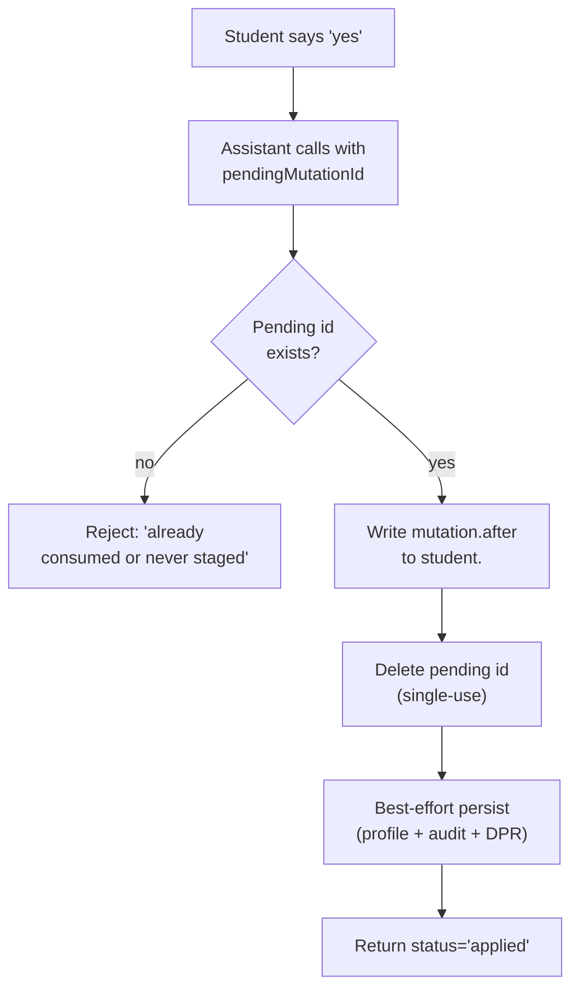
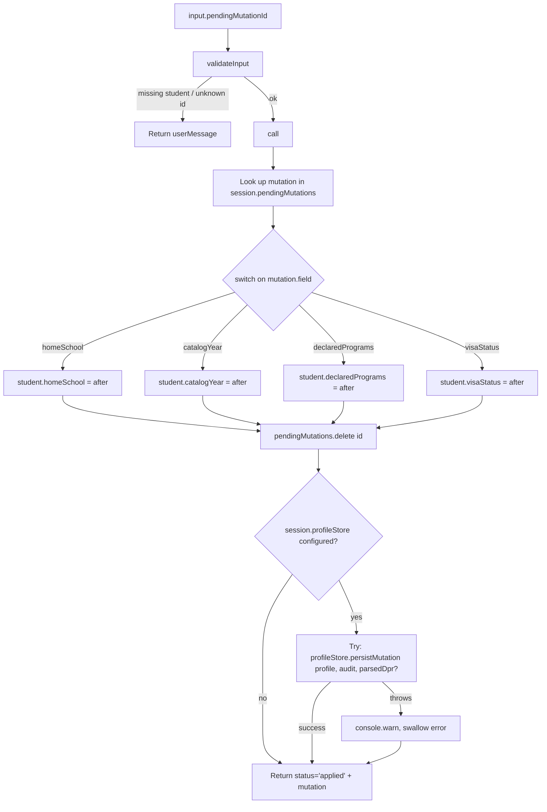
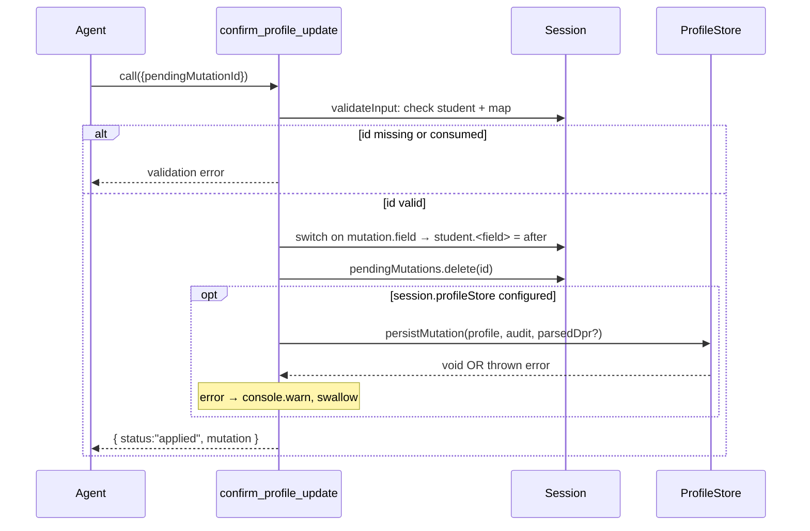

# `confirm_profile_update`

A deep technical audit of the apply half of the two-step profile-mutation contract.

Source: `packages/engine/src/agent/tools/updateProfile.ts` (lines 198-292) and `packages/engine/src/persistence/profileStore.ts`.

---

## TL;DR

This is step two of the profile-update handshake. After the staging tool built a preview and the student said "yes, apply it", the assistant calls this tool with the pending mutation id (e.g. `pm_1700000000000_42`). The tool looks the staged change up in the session's pending-mutations map, writes the new value onto the live student profile, deletes the pending entry so the id can't be reused, and best-effort persists the change (plus a fresh audit row) to durable storage — and if a parsed DPR is loaded, it co-persists that too. Persistence failures are intentionally swallowed (logged but not bubbled up), so the in-memory profile always reflects the user's intent even if the database is briefly unreachable. This is the ONLY tool in the system that mutates the student profile through the agent loop. Calling it with a bogus or already-consumed id fails validation cleanly.



---

## 1. Purpose

`confirm_profile_update` applies a previously-staged `PendingProfileMutation` to the in-memory student profile (`session.student`). It is the only path by which the four supported profile fields (`homeSchool`, `catalogYear`, `declaredPrograms`, `visaStatus`) can be mutated through the agent loop. After mutating the in-memory profile it tries (best-effort) to durably persist the new profile and an audit row through `session.profileStore` if one is wired, and it co-persists the parsed DPR if one is loaded.

It is the only tool in the staging contract for which `isReadOnly` is `false` (`updateProfile.ts:207`).

---

## 2. Input schema

`confirm_profile_update` accepts a single-field object (`updateProfile.ts:204-206`):

```pseudo
{
  pendingMutationId: non-empty string
}
```

That is the entire input. No field name. No new value. Everything else comes from the `PendingProfileMutation` looked up by id.

`maxResultChars: 1000` (`updateProfile.ts:208`).

---

## 3. Session prerequisites + `validateInput`

`validateInput` (`updateProfile.ts:209-221`) runs in this order:

1. **Student must be loaded.** If `session.student` is falsy, returns `{ ok: false, userMessage: "No student profile loaded." }`.
2. **Pending mutation must exist.** Reads `session.pendingMutations?.get(input.pendingMutationId)`. If the result is undefined (either the id is unknown, the map was never created, or the entry has already been consumed by a prior confirm), returns:

   ```
   No pending mutation with id "<id>". Either it was already consumed or update_profile was not called first.
   ```

Both branches reject before `call` runs. `validateInput` does NOT require `session.profileStore` to be present — persistence is optional and degrades silently when absent.

---

## 4. What it reads

- `session.student` — asserted non-null.
- `session.pendingMutations.get(input.pendingMutationId)` — asserted non-null after validation passes.
- `session.profileStore` — checked for presence (`updateProfile.ts:265`). If set, used as a `ProfileStore` (see §11).
- `session.degreeProgressReport` — if defined, threaded into `profileStore.persistMutation` as the optional `parsedDpr` argument (`updateProfile.ts:276`). Reading it is read-only; the tool does not modify it.

Nothing else from the session is touched — no `courses`, `prereqs`, `programs`, `schoolConfig`, `forwardSchedule`, `schedulePreferences`, `chatHistoryStore`, RAG store.

---

## 5. Algorithm



### Step 1 — Look up the mutation

`const mutation = session.pendingMutations!.get(input.pendingMutationId)!` (`updateProfile.ts:228`). The non-null assertion is safe because `validateInput` already proved the entry exists.

### Step 2 — Mutate the in-memory profile

A `switch` on `mutation.field` (`updateProfile.ts:229-242`) assigns `mutation.after` to the appropriate field on `session.student`:

| Field | Assignment | Cast (TS-only) |
|---|---|---|
| `homeSchool` | `student.homeSchool = mutation.after` | `string` |
| `catalogYear` | `student.catalogYear = mutation.after` | `string` |
| `declaredPrograms` | `student.declaredPrograms = mutation.after` | `ProgramDeclaration[]` |
| `visaStatus` | `student.visaStatus = mutation.after` | `"f1" \| "domestic" \| "other"` |

The casts are TypeScript-only; nothing checks the runtime shape again at this point. The shape was already guaranteed at staging time by `update_profile`'s Zod schema.

### Step 3 — Consume the pending entry

`session.pendingMutations!.delete(input.pendingMutationId)` (`updateProfile.ts:247`). After this point the id is "burned" — a second call with the same id will fail `validateInput`.

### Step 4 — Best-effort persistence

If `session.profileStore` is defined, the tool calls `profileStore.persistMutation(student, audit, session.degreeProgressReport)` inside a `try/catch` (`updateProfile.ts:265-282`). The audit entry is built fresh from the mutation:

```pseudo
{
  pendingMutationId: input.pendingMutationId,
  field:             mutation.field,
  before:            mutation.before,
  after:             mutation.after,
  confirmedAt:       new Date().toISOString(),
}
```

The `confirmedAt` timestamp is generated at confirm-time, not at staging-time. The `parsedDpr` arg is whatever is currently on `session.degreeProgressReport` — possibly `undefined`.

If `persistMutation` throws, the catch block logs a single `console.warn` with the error message and continues. Persistence failures NEVER propagate to the agent loop.

### Step 5 — Return

```pseudo
{
  status:   "applied",   // literal
  mutation: PendingProfileMutation,
}
```

The returned `mutation` is the same object that was in `session.pendingMutations` (now removed from the map).

---

## 6. What it writes to session and via `profileStore`

### In-memory writes (always)

- `session.student.<field>` — overwritten with `mutation.after`.
- `session.pendingMutations.delete(id)` — entry removed from staging map.

### Persistence writes (when `session.profileStore` is configured)

Inside `profileStore.persistMutation` (see `profileStore.ts:75-85` for `InMemoryProfileStore`'s implementation; the Postgres-backed adapter is referenced in the source comments but lives outside the files in scope):

- The post-mutation `StudentProfile` is written under `profile.id` (overwrites any prior value).
- A `ProfileMutationAuditEntry` is appended to an audit log (chronological, append-only by convention).
- If `parsedDpr` was supplied, it is also stored under `profile.id` — this **overwrites** the previously-persisted parsed DPR; the DPR column is semantically "the most-recent parsed DPR per student", not an audit trail (the trail lives elsewhere, e.g., `forward_schedules.dprFingerprint`).
- If `parsedDpr` is `undefined`, the existing DPR column is left untouched (`profileStore.ts:82-84`).

### `ProfileStore` interface (from `profileStore.ts:31-62`)

```pseudo
interface ProfileStore {
  get(studentId: string): Promise<StudentProfile | null>
  persistMutation(
    profile:   StudentProfile,
    audit:     ProfileMutationAuditEntry,
    parsedDpr?: DegreeProgressReport,
  ): Promise<void>
  getParsedDpr?(studentId: string): Promise<DegreeProgressReport | null>
}
```

Where `ProfileMutationAuditEntry` is:

```pseudo
{
  pendingMutationId: string,
  field:             "homeSchool" | "catalogYear" | "declaredPrograms" | "visaStatus",
  before:            unknown,
  after:             unknown,
  confirmedAt:       string,   // ISO timestamp
}
```

### `InMemoryProfileStore` (`profileStore.ts:65-96`)

The shipped in-memory implementation maintains three structures:

- `profiles: Map<studentId, StudentProfile>`
- `parsedDprs: Map<studentId, DegreeProgressReport>`
- `auditLog: ProfileMutationAuditEntry[]` (chronological)

`persistMutation` writes all three in one synchronous operation. `clear()` is provided for tests. The implementation is purely in-process and lost on exit. The interface contract anticipates a transactional Postgres adapter in production, but that adapter is not in the files under audit.

---

## 7. What it returns

```pseudo
{
  status:   "applied",
  mutation: {
    id:      string,
    field:   "homeSchool" | "catalogYear" | "declaredPrograms" | "visaStatus",
    before:  unknown,
    after:   unknown,
    impacts: string[],
  }
}
```

There is no `"failed"` return path. Either the tool succeeds end-to-end (mutation applied, persistence attempted, returns `applied`), or it never reaches `call` because `validateInput` rejected it.

Persistence failure does NOT change the return — it is logged via `console.warn` and otherwise swallowed.

---

## 8. Envelope behavior

`confirm_profile_update` does NOT call `renderEnvelopeMeta`. It does NOT produce `Disclaimer` objects. It does NOT participate in the Phase 10 envelope-rendering posture.

`outputMode` is unset (defaults to `"synthesis"` per `tool.ts:260`). No verbatim-text contract.

---

## 9. Summary text format

`summarizeResult` (`updateProfile.ts:289-291`) emits exactly one line:

```
APPLIED <field>: <JSON.stringify(before)> → <JSON.stringify(after)>
```

For example: `APPLIED visaStatus: "domestic" → "f1"`.

The `maxResultChars: 1000` cap is enforced at the wrapper level but the summary is short enough that truncation never fires in practice.

---

## 10. The `pendingMutationId` two-step contract

The contract pairs with `update_profile` (see `update_profile.md` §10 for the staging side). From the apply side:



Key contract properties from source:

- **Single-use ids.** `pendingMutations.delete(id)` runs unconditionally after the in-memory mutation. The next call with the same id is rejected at `validateInput` because the map no longer has the entry. The comment at `updateProfile.ts:243-246` describes this as "Consume so a second confirm of the same id returns the 'already_consumed' path" — but the actual code path is a validation rejection, not a special `already_consumed` status.
- **No idempotency on apply.** A second confirm does not return `"applied"` again; it errors out at validation.
- **`isReadOnly: false`.** The tool advertises mutation through the engine's tool-permission contract.
- **In-memory mutation lands before persistence.** The order in `call` is: switch-assign → delete from map → (optional) persist. So even if `profileStore.persistMutation` throws, the in-memory mutation has already taken effect for the rest of the live turn. The session is the source of truth; persistence is a durability convenience.
- **Co-persisted DPR.** When `session.degreeProgressReport` is present at confirm time, the tool passes it as the third arg to `persistMutation`. This is how the Phase 16 onboarding flow durably attaches a freshly-parsed DPR to the student row in the same transaction as the mutation.

---

## 11. Persistence behavior — failures are swallowed

This is a deliberate architectural choice from `updateProfile.ts:265-282`. The relevant guarantees:

- **Try/catch wraps the entire `await profileStore.persistMutation(...)` call.** No re-throw.
- **Catch handler logs `console.warn` and continues.** It does not push a `Disclaimer`, does not flip the return status, does not mutate the session.
- **The in-memory mutation has ALREADY landed before persistence is attempted** (`updateProfile.ts:229-247` runs strictly before the persistence block at `updateProfile.ts:265-282`). So a persistence failure leaves the agent session correctly updated but the durable store stale.
- **The audit row is built fresh each time** — there is no retry mechanism for failed audit writes, no queue, no dead-letter handling.
- **Subsequent updates overwrite the persisted DPR.** The comment at `updateProfile.ts:259-264` states this is intentional: the `students.parsed_dpr` column is "the most-recent parsed DPR per student", not an audit trail. Each confirm with a DPR loaded overwrites the column. Audit history per profile mutation lives in the separate audit log; per-schedule DPR fingerprinting lives in `forward_schedules.dprFingerprint` (not in scope here).
- **`session.profileStore` undefined** — the entire persistence block is skipped (`updateProfile.ts:265` is a truthy check). The tool still returns `"applied"` because the in-memory mutation succeeded.

---

## 12. Edge cases

- **Missing `session.student`** — rejected at `validateInput` with `"No student profile loaded."`. Never reaches `call`.
- **Unknown / consumed `pendingMutationId`** — rejected at `validateInput` with the "No pending mutation with id" message. Differentiates by id but not by reason (consumed vs. never-existed both produce the same message).
- **`session.pendingMutations` undefined** — handled via the optional-chaining `session.pendingMutations?.get(...)` in `validateInput`; treats undefined map identically to "no entry".
- **Double-confirm in the same turn** — first confirm succeeds, deletes the entry. Second confirm hits the validation reject.
- **Confirm of a mutation staged in a different turn** — works as long as the session object survives between turns and the entry has not been consumed.
- **Mutation with `before` equal to `after`** — applied unconditionally. The tool does not check for no-op writes. The audit row will record before === after, and persistence will still fire.
- **`mutation.field` not one of the four** — would fall through the switch with no case matched. This is impossible in practice because `update_profile`'s Zod discriminated union enforces the field at staging time, but defensively no default branch exists.
- **`session.profileStore.persistMutation` throws synchronously vs. asynchronously** — `await` plus `try/catch` handles both. The catch logs the error via `err instanceof Error ? err.message : String(err)` to handle non-Error throws gracefully.
- **`session.degreeProgressReport` is `undefined` at confirm time** — `parsedDpr` arg is omitted (passed as `undefined`); the store implementation must treat that as "do not touch DPR column" (the `InMemoryProfileStore` does — `profileStore.ts:82-84`).
- **`confirmedAt` timezone** — `new Date().toISOString()` produces a UTC ISO-8601 timestamp.
- **No abort handling** — the tool ignores `ctx.signal`. Even if the agent loop is cancelled mid-call, the synchronous mutation steps have already executed. Only the persistence step is `await`-able and could in theory be cancelled by an outer hand, but the tool itself doesn't wire the signal anywhere.
- **Persistence races** — there is no locking. Two parallel confirms against the same studentId on different sessions would race in the underlying store; the `ProfileStore` interface comment says implementations are "expected to be transactional where possible" but the in-memory implementation is not.
