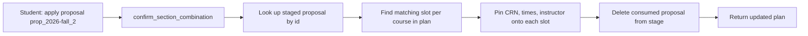
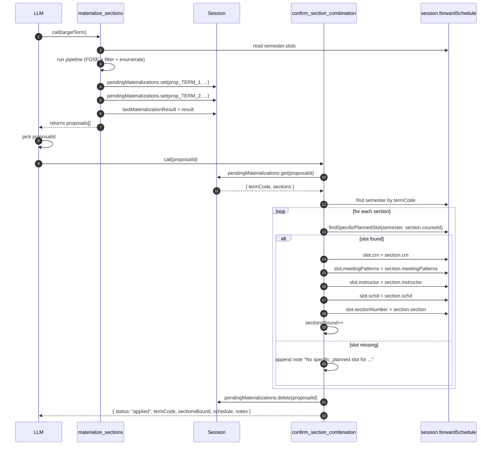

# `confirm_section_combination` — Apply a Staged Section Proposal

## TL;DR

After you've seen a list of staged section combinations from the materialize step and said "yes, give me proposal #2" or "let's go with that combo," this tool actually pins those specific sections into your plan. It looks up the staged proposal by its ID, finds each course's matching slot in your forward schedule for that term, and writes the concrete details onto it — CRN, meeting pattern (days and times), instructor name, schedule type, section number. Once a proposal is applied, it's consumed (deleted from the pending stage), so you can't apply the same one twice. Apply a different combination by materializing again — fresh proposals, fresh IDs. This is the only section-related tool that actually mutates your plan; everything before this was staging and preview.

---

## 1. Purpose

`confirm_section_combination` is the second half of the section-materialization write contract. Where `materialize_sections` STAGES one or more conflict-free section combinations under deterministic `proposalId`s, this tool APPLIES one of them by pinning concrete-section fields (`crn`, `meetingPatterns`, `instructor`, `schd`, `sectionNumber`) onto the matching `specific_planned` slots inside the forward schedule.

A successful confirm consumes (deletes) the pending entry, so the same `proposalId` cannot be applied twice — confirming an already-consumed id is rejected by `validateInput`.

Defined at `packages/engine/src/agent/tools/materializeSections.ts:358-460`.

---

## 2. Input Schema

A single required field (`materializeSections.ts:312-320`):

| Field         | Type   | Required | Description |
|---------------|--------|----------|-------------|
| `proposalId`  | string | yes      | The deterministic id returned by a prior `materialize_sections` call. Form is `prop_<targetTerm>_<1-indexed>`. Each id is single-use. |

---

## 3. Session Prerequisites

`validateInput` (`materializeSections.ts:371-392`) requires:

1. `session.forwardSchedule` must exist. Rejection: "No forward plan exists in this session. Call `plan_forward_degree` then `materialize_sections` first."
2. `session.pendingMaterializations?.get(input.proposalId)` must return a non-undefined entry. Rejection: "No pending section proposal with id `<proposalId>`. Either `materialize_sections` was not called for the enclosing term, or this proposal was already consumed by a prior `confirm_section_combination` call."

If both pass, the tool proceeds to `call`.

---

## 4. What It Reads

### From `session`

- `session.forwardSchedule` — the full forward plan (read + mutated in-place).
- `session.pendingMaterializations` — a `Map<string, { termCode, sections }>` from which the entry under `input.proposalId` is read (`materializeSections.ts:399`) and then deleted (`materializeSections.ts:439`).

### From the pending entry

The staged record carries:

- `termCode`: the solver-format term identifier that was passed to `materialize_sections`.
- `sections`: an array of `SectionView` objects (`types.ts:32-74`), one per course in the combination.

### From the forward schedule

The tool finds `schedule.semesters.find(s => s.term === pending.termCode)` (`materializeSections.ts:400`) and then, per staged section, finds the matching `specific_planned` slot via the helper `findSpecificPlannedSlot` (`materializeSections.ts:346-356`) — a linear scan over `semester.slots` looking for the first slot whose `kind === "specific_planned"` and whose `courseId` matches the section's `courseId`.

---

## 5. Algorithm

The full two-step apply contract:

### Step-by-step (`materializeSections.ts:397-448`)

1. **Lookup**: `const pending = session.pendingMaterializations!.get(input.proposalId)!` — the `!` is safe because `validateInput` guaranteed the entry exists.

2. **Find target semester**: `const semester = schedule.semesters.find(s => s.term === pending.termCode)`.

3. **Semester missing branch** (`materializeSections.ts:405-413`): If the semester no longer exists in the forward schedule (because the structural plan was mutated between stage and confirm), the tool appends a note saying so, skips the binding loop, and falls through to consuming the pending entry. `sectionsBound` stays at 0.

4. **Per-section binding loop** (`materializeSections.ts:414-433`): For each `section` in `pending.sections`:
   - `findSpecificPlannedSlot(semester, section.courseId)` searches the semester's slots for a `specific_planned` slot with the matching `courseId`.
   - If no slot is found (or the slot's `kind` is not `specific_planned`), a note is added: `No specific_planned slot for <courseId> in <termCode>; section CRN <crn> not bound.` The section is skipped.
   - If found, the slot is mutated in-place. Five fields are written:
     - `slot.crn = section.crn`,
     - `slot.meetingPatterns = section.meetingPatterns`,
     - `slot.instructor = section.instructor`,
     - `slot.schd = section.schd`,
     - `slot.sectionNumber = section.section` (note the FOSE field is named `no` and is mapped to `SectionView.section`, then written back as `sectionNumber` on the slot).
   - `sectionsBound` is incremented.

5. **Consume**: `session.pendingMaterializations!.delete(input.proposalId)` (`materializeSections.ts:439`). This makes the id single-use — a second confirm with the same id will fail `validateInput`'s `pending` lookup. Mirrors the idempotency contract of `confirm_profile_update`.

6. **Return**: see section 6.

---

## 6. What It Returns

The output shape is `ConfirmSectionCombinationOutput` (`materializeSections.ts:322-337`):

| Field           | Type                | Description |
|-----------------|---------------------|-------------|
| `status`        | `"applied"` literal | Always this string when `call` returns successfully. |
| `termCode`      | string              | Echo of `pending.termCode`. |
| `sectionsBound` | number              | Count of slots that were successfully mutated with concrete-section fields. May be 0 if the semester vanished or no `specific_planned` slots matched. |
| `schedule`      | `ForwardSchedule`   | The post-apply forward schedule (the SAME instance — mutated in-place, not a copy). |
| `notes`         | string[]            | Per-section / per-semester apply notes. Empty when every section bound cleanly. |

The `notes` array is populated only on defensive paths:

- One entry per section whose `courseId` could not be matched to a `specific_planned` slot in the target semester.
- One entry stating the target semester no longer exists, if that's the case.

In the happy path (`materialize_sections` immediately followed by `confirm_section_combination` with no intervening structural mutation) `notes` is empty.

---

## 7. Envelope Behavior

- `isReadOnly: false` (`materializeSections.ts:369`). Unlike `materialize_sections`, this tool genuinely writes to the schedule.
- `maxResultChars: 2000` (`materializeSections.ts:370`).
- `validateInput` rejects with `{ ok: false, userMessage }` on the conditions in section 3.
- `prompt()` returns: "Apply a previously-staged section combination by id. Mutates the forward schedule's specific_planned slots in-place with concrete CRN + meeting-time + instructor data." (`materializeSections.ts:393-396`).
- `call` does not throw on missing-semester or missing-slot conditions; both are surfaced as `notes` with `sectionsBound` accounting for the difference.

---

## 8. Summary Text Format

`summarizeResult` (`materializeSections.ts:449-459`) returns a multi-line string:

- Header: `CONFIRM_SECTION_COMBINATION — APPLIED to <termCode>: <sectionsBound> slot(s) updated with CRN + meeting times.`
- One `  • <note>` line per entry in `notes`. When `notes` is empty (the happy path), no bullet lines are emitted.

---

## 9. Side-Channel Writes

`confirm_section_combination` has two side effects that are not visible in its return value beyond the schedule reference:

1. **In-place mutation of `ScheduleSlotSpecificPlanned` slots** — the five `crn` / `meetingPatterns` / `instructor` / `schd` / `sectionNumber` fields are written directly onto each matching slot. The `ForwardSchedule` instance held by `session.forwardSchedule` is mutated; callers comparing references will see the same object. This is a strict additive extension — all five slot fields are optional on the slot type, and `bindingState` stays at whatever it was (the tool does not flip a state flag here).

2. **Consumption of the pending entry** — `session.pendingMaterializations.delete(proposalId)`. Other proposals for the same term (or other terms) remain in the map; only this one entry is removed. This makes the id single-use.

Unlike `materialize_sections`, this tool does NOT write `session.lastMaterializationResult`. The SSE route's staleness detector therefore does not fire on a confirm call (see section 10).

---

## 10. Interactions

### With `materialize_sections`

The two tools are a strict producer / consumer pair:

- `materialize_sections` is the only producer of `pendingMaterializations` entries. Their key shape (`prop_<termCode>_<1-indexed>`) is deterministic per term, so an LLM can predict the next id after a re-materialize.
- `confirm_section_combination` is the only consumer.
- Each `proposalId` is single-use.

### With the SSE chat route

Because `confirm_section_combination` does NOT update `session.lastMaterializationResult.computedAt`, the SSE chat route's staleness diff does not detect the confirm itself as a "materialization update" event — the schedule mutation is observable through the schedule's own change pipeline, not through the materialization side channel.

### With the forward schedule lifecycle

`confirm_section_combination` does not change the structural identity of any slot — it only enriches an existing `specific_planned` slot with concrete fields. The `bindingState` is unaffected (`materializeSections.ts` comment at `:425-426` notes "bindingState already === 'bound'", and the tool does not touch that field). Downstream consumers that already considered the slot bound will continue to do so; what changes is the presence of FOSE-derived CRN + meeting metadata on the same slot.

---

## 11. Edge Cases

### `proposalId` already consumed

A second confirm with the same id fails `validateInput` because the map entry was deleted on the first successful confirm (`materializeSections.ts:439`). The rejection message reads: "No pending section proposal with id `<proposalId>`. Either `materialize_sections` was not called for the enclosing term, or this proposal was already consumed by a prior `confirm_section_combination` call."

### Target semester removed between stage and confirm

If something (e.g. a re-run of `plan_forward_degree`) removes the semester whose `term` matches `pending.termCode` between the two tool calls, the tool surfaces a note and consumes the pending entry anyway (`materializeSections.ts:405-413`). The student is not left with a stuck id; they will need to re-run `materialize_sections` against the new plan.

### Matching slot not found for some sections

If a `specific_planned` slot for a section's `courseId` doesn't exist (e.g. the slot was rebound to a different course between stage and confirm), a per-section note is appended and the section is skipped. Other sections in the same proposal continue to bind. `sectionsBound` reflects only the successful binds (`materializeSections.ts:417-422`).

### Slot kind changed between stage and confirm

`findSpecificPlannedSlot` checks both `kind === "specific_planned"` and `courseId` match. If a slot for the same `courseId` exists but its `kind` was switched to something other than `specific_planned` (e.g. converted to `in_progress` after registration was confirmed elsewhere), it is treated as a miss — a note is appended and the section is skipped.

### Partial success

If some sections bind and others don't, `status` is still `"applied"`. `sectionsBound` is strictly less than `pending.sections.length`. The pending entry is still consumed (single-use semantics apply even on partial success).

### No forward schedule

Rejected by `validateInput` (`materializeSections.ts:372-379`) — caller is told to run `plan_forward_degree` then `materialize_sections` first. `call` is never entered.
