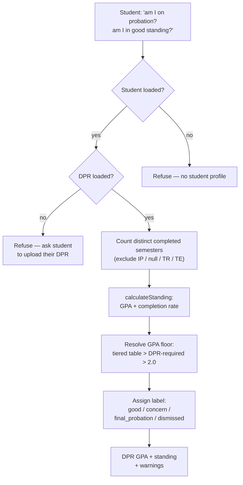
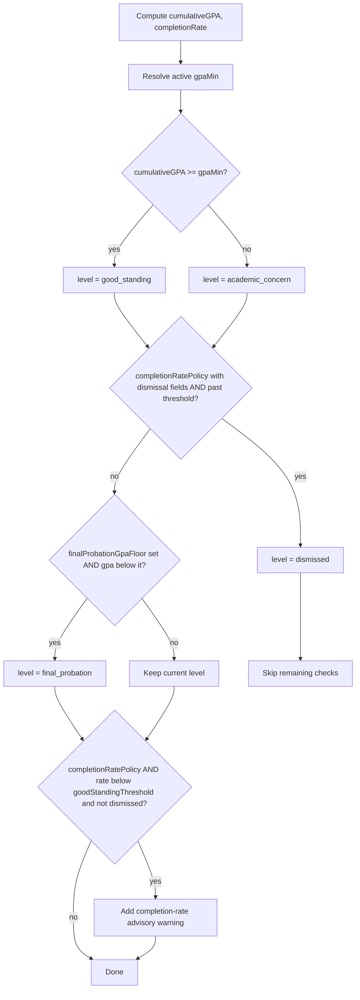

# `get_academic_standing` — Tool Audit

> Last verified against code: 2026-06-10 (post planning-engine rebuild, PRs #35-#41).

Source files:
- Tool definition: `packages/engine/src/agent/tools/getAcademicStanding.ts`
- Standing engine: `packages/engine/src/audit/academicStanding.ts`
- `SchoolConfig` / `CompletionRatePolicy` / `GpaTierRow` types: `packages/shared/src/types.ts`
- Tool contract: `packages/engine/src/agent/tool.ts`

---

## Purpose

When a student asks "am I on academic probation?", "am I in good standing?", or "am I at risk of being dismissed?", this tool computes the answer from their DPR-derived coursework. It walks every course on the student's record, computes cumulative GPA (skipping transfer rows, counting F as zero, treating P/W/I/NR as not in GPA), computes the credit completion rate (earned ÷ attempted), and assigns one of seven standing labels.

It is **DPR-first** in two ways: (1) a DPR **MUST** be loaded or the tool hard-refuses, and (2) the authoritative GPA returned and the GPA floor used both come from the DPR — `dpr.cumulative.cumulativeGpa` is surfaced as the cumulative GPA, and `dpr.cumulative.cumulativeGpaRequired` is the per-student GPA floor. `SchoolConfig` no longer carries `overallGpaMin`; the only school-config inputs that still matter are the per-semester tiered GPA table (`gpaTierTable`), the final-probation floor (`finalProbationGpaFloor`), and the per-school completion-rate policy (`completionRatePolicy`).

This tool is scoped to **probation / SAP / academic-standing detail**. For authoritative GPA, cumulative credits, and requirement status, the assistant should prefer [`run_full_audit`](./run_full_audit.md), which reads the DPR's pre-computed numbers directly.



---

## 1. Input schema

The input is empty (`getAcademicStanding.ts:31`):

```
{ /* no fields */ }
```

- `isReadOnly` = `true` (line 32).
- `maxResultChars` = 1500 (line 33).
- `outputMode` is the default `"synthesis"` (no semi-hardened pin).

---

## 2. Session prerequisites + `validateInput`

`validateInput` (lines 34-48) rejects, in this order:

1. **No student loaded** (`session.student` missing). Returns: `"No student profile loaded."`
2. **No DPR loaded** (`session.degreeProgressReport` missing). Returns: `"I need your Albert Degree Progress Report (DPR) to report academic standing. Please upload your DPR and try again."`

Standing is computed from the student's DPR-derived coursework; with no DPR there is no authoritative record to read, so the tool refuses (there is no transcript fallback). This is the DPR-first no-personalized-without-DPR policy.

---

## 3. What it reads

From `ToolSession`:
- `session.student.coursesTaken` — list of `CourseTaken` rows `{ courseId, grade, credits?, semester, isInProgress? }`. Drives the GPA + completion-rate math.
- `session.degreeProgressReport.cumulative` — reads `cumulativeGpa` (the authoritative GPA surfaced) and `cumulativeGpaRequired` (the per-student GPA floor + `schoolFloor`).
- `session.schoolConfig` — passed through to the standing engine for the tiered GPA table, the final-probation floor, and the completion-rate policy. May be `null`.

### How `semestersCompleted` is derived (lines 61-71)

The tool computes `semestersCompleted` as the count of **distinct** `semester` values among `coursesTaken` rows that are real, completed NYU semesters:

```
semestersCompleted = unique semesters where
    NOT isInProgress AND grade !== null AND grade !== "TR" AND grade !== "TE"
```

This excludes in-progress rows, ungraded rows, transfer (`TR`) and test (`TE`) credits. It is a genuine count of completed semesters — **not** `declaredPrograms.length` (the old proxy, now removed).

### Constants in the standing engine (`academicStanding.ts`)

- `GRADE_POINTS` (lines 81-93) — A=4.000, A-=3.667, B+=3.333, B=3.000, B-=2.667, C+=2.333, C=2.000, C-=1.667, D+=1.333, D=1.000, F=0.000.
- `PASSING_GRADES` (line 96) — `{ A, A-, B+, B, B-, C+, C, C-, D+, D, P }`. P passes for completion-rate purposes.
- `GPA_GRADES` (line 100) — the keys of `GRADE_POINTS`. P is **not** in this set; F **is** (F is computed in GPA).
- `DEFAULT_OVERALL_GPA_MIN = 2.0` (line 49) — the last-resort flat GPA floor when neither the DPR's `cumulativeGpaRequired` nor a tiered table supplies one. The completion-rate ("pace") rule has **no** hard-coded default — it is entirely per-school via `completionRatePolicy`.

---

## 4. Algorithm

`call()` (`getAcademicStanding.ts:53-93`) computes `semestersCompleted` (§3), then calls:

```
calculateStanding(
    student.coursesTaken,
    semestersCompleted,
    session.schoolConfig ?? null,
    dpr?.cumulative.cumulativeGpaRequired ?? null,   // DPR-required GPA floor
)
```

The engine is at `academicStanding.ts:113-286`.

### Step 1 — Iterate `coursesTaken` and accumulate four counters (lines 133-184)

In-progress (`isInProgress`) and `grade === null` rows are skipped entirely. For each remaining row, `grade = ct.grade.toUpperCase()`, `credits = ct.credits ?? 4`:

| Grade               | totalAttempted | totalCompleted | totalGradePoints | totalGPACredits |
|---------------------|----------------|----------------|------------------|-----------------|
| `TR` (transfer)     | skip           | skip           | skip             | skip            |
| `W`, `I`, `NR`      | +credits       | (no)           | (no)             | (no)            |
| `P`                 | +credits       | +credits       | (no)             | (no)            |
| `F`                 | +credits       | (no)           | +0 × credits     | +credits        |
| Any other letter in `GPA_GRADES` | +credits | +credits (if in `PASSING_GRADES`) | +pts × credits | +credits |

So: `TR` is fully excluded; `W`/`I`/`NR` count as attempted but not earned/GPA; `P` earns credits but is not in GPA; `F` is in GPA (0 points) but does not earn credits; letter grades A–D are in GPA and count as completed.

### Step 2 — Derived ratios (lines 186-189)

```
cumulativeGPA  = totalGPACredits > 0  ? totalGradePoints / totalGPACredits : 0
completionRate = totalAttempted > 0   ? totalCompleted / totalAttempted    : 1
```

(Note: the *engine's* `cumulativeGPA` is a local recompute. The tool layer overrides the returned GPA with the DPR's authoritative value — see §6.)

### Step 3 — Resolve the active GPA floor (lines 197-198)

```
flatGpaMin = dprGpaRequired ?? DEFAULT_OVERALL_GPA_MIN (2.0)
gpaMin     = resolveTieredGpaMin(schoolConfig?.gpaTierTable, semestersCompleted) ?? flatGpaMin
```

`resolveTieredGpaMin` (lines 25-41): if a `gpaTierTable` exists, keep the **largest** finite row whose `semestersCompleted <= count`; if the count exceeds every finite row, fall through to the open-ended (`semestersCompleted: null`) row. A tiered table (e.g. Tandon's stepped floor) supersedes the flat floor. The flat floor now comes from the **DPR's** `cumulativeGpaRequired` (per-student), falling back to 2.0 — `schoolConfig.overallGpaMin` was removed.

### Step 4 — Initial level + good-standing check (lines 206-214)

```
inGoodStanding = cumulativeGPA >= gpaMin
level = "good_standing"  (message "In good academic standing.")
if !inGoodStanding:
  level = "academic_concern"
  message = "Academic concern: cumulative GPA is <gpa> (below <gpaMin> minimum)."
  warning  "Cumulative GPA is below the <gpaMin> minimum required for good academic standing."
```

### Step 5 — Completion-rate dismissal check (lines 220-231) — per-school, opt-in

This is now **fully config-driven**. It fires only when `schoolConfig.completionRatePolicy` is present AND publishes both `dismissalThreshold` and `dismissalAfterSemesters`:

```
if completionPolicy.dismissalThreshold and completionPolicy.dismissalAfterSemesters set
   and semestersCompleted >= completionPolicy.dismissalAfterSemesters
   and completionRate < completionPolicy.dismissalThreshold:
  level = "dismissed"
  message = "Academic dismissal risk: only <pct>% of attempted credits completed after <N> semesters."
  warning  "Completion rate <pct>% is below <threshold%> after <N> semesters — may result in dismissal."
```

Schools that publish no completion-rate policy (GPA-only / tiered schools such as Stern, Tandon, Steinhardt, Nursing) can **never** be dismissed on pace grounds. The old hard-coded 50%-after-2-semesters CAS default is gone.

### Step 6 — Final Probation check (lines 238-249) — only if not dismissed

If `schoolConfig.finalProbationGpaFloor` is set AND `cumulativeGPA` is below it AND `level !== "dismissed"`:

```
level = "final_probation"
message = "Final Probation: cumulative GPA <gpa> is below the <floor> floor."
warning  "Cumulative GPA below <floor> triggers Final Probation regardless of credits completed (<schoolName> policy)."
```

(E.g. Tandon's 1.5 floor.)

### Step 7 — Completion-rate advisory warning (lines 257-276) — only if not dismissed

Fires only when a `completionRatePolicy` is present AND `completionRate < completionPolicy.goodStandingThreshold` AND `level !== "dismissed"`. The warning phrasing depends on `completionPolicy.basis` (`"cumulative"` / `"annual"` / `"term"` / unset) so it states the cumulative figure honestly while attributing the threshold to its real measurement window. Schools with no policy emit no completion-rate warning.

### Step 8 — Return result (lines 278-285)

```
{
  level,
  cumulativeGPA:  round to 3 decimals,   // engine's local recompute (tool overrides with DPR value)
  completionRate: round to 3 decimals,
  inGoodStanding,
  message,
  warnings
}
```

### Standing-level enumeration

`StandingLevel` (`academicStanding.ts:51-58`) defines seven labels:

| Level                  | When emitted |
|------------------------|--------------|
| `good_standing`        | Default; cumulative GPA at/above the active floor, not dismissed, no final-probation override. |
| `academic_concern`     | Cumulative GPA below the active GPA floor. |
| `continued_concern`    | Defined in the enum but **never emitted** by `calculateStanding` (reserved). |
| `required_leave`       | Defined but **never emitted** (reserved). |
| `pre_dismissal`        | Defined but **never emitted** (reserved). |
| `final_probation`      | Cumulative GPA below the school's `finalProbationGpaFloor` (when configured) AND not dismissed. |
| `dismissed`            | School publishes a pace-dismissal policy AND `semestersCompleted >= dismissalAfterSemesters` AND completion rate < `dismissalThreshold`. Overrides all other labels. |

### GPA bands → standing labels



---

## 5. Tool-layer result shape (`getAcademicStanding.ts:78-92`)

The tool repackages the engine output and overrides two fields with DPR values:

```
{
  cumulativeGPA:   number,                 // dpr.cumulative.cumulativeGpa (authoritative) ?? engine recompute
  level:           StandingLevel,
  inGoodStanding:  boolean,
  semesterGPA:     number | null,          // standing.semesterGPA ?? null — engine never sets it (always null)
  completionRate:  number,                 // rounded to 3 decimals
  message:         string,
  warnings:        string[],
  schoolFloor:     number | null           // dpr.cumulative.cumulativeGpaRequired ?? null (NOT schoolConfig)
}
```

- `cumulativeGPA` is the **DPR's** pre-computed cumulative GPA when present (`dpr.cumulative.cumulativeGpa`), falling back to the engine's local recompute only if no DPR — unreachable in practice since `validateInput` requires a DPR.
- `schoolFloor` is the **DPR-required** floor (`dpr.cumulative.cumulativeGpaRequired`), **not** `session.schoolConfig.overallGpaMin` (which no longer exists). It is `null` when the DPR omits the field.

---

## 6. Envelope behavior

- **`outputMode: "synthesis"`** (default — no `extractVerbatim`). The validator does not pin any specific text; the LLM grounds in `summarizeResult`.
- **`isReadOnly: true`**, `maxResultChars` = 1500.
- The tool never writes to `session`.

---

## 7. Summary text format

`summarizeResult` (lines 94-109) emits:

```
STANDING: <level> (cumulative GPA <gpa fixed to 2 decimals>)
In good standing: <true|false>
Most recent semester GPA: <gpa fixed to 2 decimals>     # only when semesterGPA !== null (never, in practice)
Credit completion rate: <N>%                            # 0 decimals
School minimum GPA floor: <N>                           # only when schoolFloor !== null (DPR-required floor)
Summary: <message>
Warnings:                                               # only when warnings.length > 0
  - <warning 1>
  ...
```

The cumulative GPA shows 2 decimals in the summary even though the structured value carries 3. The completion-rate percentage is rendered with no decimals.

---

## 8. Interactions with other tools

- **`run_full_audit`** — the authoritative source for GPA, cumulative credits, and requirement status (it reads the DPR's pre-computed `dprCumulative` numbers). This tool's description tells the LLM to prefer `run_full_audit` for those questions and reserve `get_academic_standing` for probation / SAP / standing detail. Both tools now require a DPR and both read the same per-student floor (`dpr.cumulative.cumulativeGpaRequired`). See [`run_full_audit`](./run_full_audit.md).
- **`get_credit_caps`** — the recommended pair per Appendix A rule #5: `get_academic_standing → get_credit_caps` before discussing GPA, credits, graduation progress, or semester planning. See [`get_credit_caps`](./get_credit_caps.md).

This tool does NOT chain to anything; it has no `suggestedFollowUps`.

---

## 9. Edge cases

- **No courses taken** — `totalGPACredits = 0` → engine `cumulativeGPA = 0`; `totalAttempted = 0` → `completionRate = 1`. The returned `cumulativeGPA` is overridden by the DPR's value, so a real student's GPA is correct even with sparse `coursesTaken`. (`validateInput` requires a DPR but does not require non-empty `coursesTaken`.)
- **No DPR loaded** — hard reject in `validateInput` (after the no-student check) before `call()` runs.
- **`coursesTaken` all in-progress** — `semestersCompleted = 0`; the GPA math skips them; `completionRate = 1`. Dismissal check (gated by `semestersCompleted >= dismissalAfterSemesters`) won't fire.
- **`schoolConfig` is null** — flat floor = DPR-required floor (or 2.0); no tiered table; no `finalProbationGpaFloor`; no `completionRatePolicy`, so **no** completion-rate warning or dismissal ever.
- **No `completionRatePolicy`** — neither the dismissal nor the advisory completion-rate warning can fire, regardless of how low the rate is. Pace standing is entirely opt-in per school.
- **Tiered table past every finite row** — `resolveTieredGpaMin` returns the open-ended (`null`) row if any; otherwise undefined → falls back to the flat (DPR-required) floor.
- **Unrecognized grade value** — silently ignored (no counter incremented).
- **`credits` missing on a row** — defaults to 4.
- **Final Probation + Dismissal both apply** — Dismissed wins (final-probation block is gated by `level !== "dismissed"`).
- **`semesterGPA`** — `calculateStanding` never sets it; the tool reads `standing.semesterGPA ?? null`, so it is always `null` from this path. A separate `computeSemesterGPA(coursesTaken, semester)` exists (`academicStanding.ts:292-312`) but this tool does not call it.
- **Reserved levels (`continued_concern`, `required_leave`, `pre_dismissal`)** — declared in the enum but never produced by this engine path.

---

## Known limitations

- **Three reserved standing levels are dead.** `continued_concern`, `required_leave`, and `pre_dismissal` exist in `StandingLevel` but no code path emits them.
- **`semesterGPA` is always null.** The engine's `computeSemesterGPA` helper is never wired into `calculateStanding`, so the tool's `semesterGPA` field never carries a value despite the summary having a line for it.
- **Completion-rate standing requires a per-school policy.** Schools without a `completionRatePolicy` get no pace-based warning or dismissal at all — there is no universal default anymore.

---

## Summary

`get_academic_standing` deterministically computes GPA + completion rate from a student's `coursesTaken`, resolves the active GPA floor (tiered table > DPR-required floor > 2.0), and assigns a standing label. The tool overrides the returned GPA and `schoolFloor` with the DPR's authoritative `cumulativeGpa` / `cumulativeGpaRequired`. Dismissal and the completion-rate advisory are now fully per-school via `completionRatePolicy` — no hard-coded CAS defaults. `semestersCompleted` is a genuine count of distinct completed semesters. The tool REQUIRES a DPR and is scoped to probation / SAP / standing detail; for authoritative GPA, cumulative credits, and requirement status, prefer [`run_full_audit`](./run_full_audit.md).
