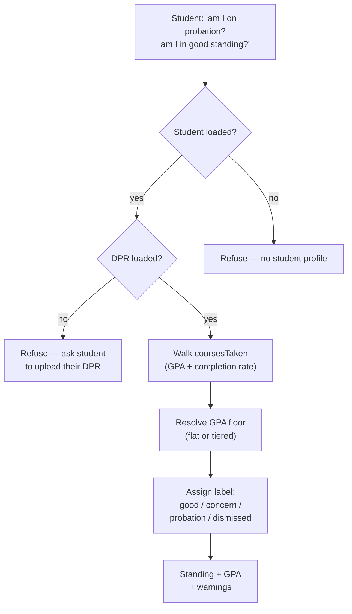
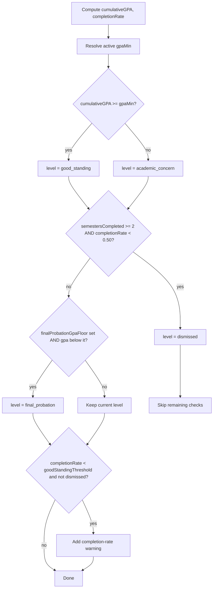

# `get_academic_standing` — Tool Audit

Source files:
- Tool definition: `packages/engine/src/agent/tools/getAcademicStanding.ts`
- Standing engine: `packages/engine/src/audit/academicStanding.ts`
- Tool contract: `packages/engine/src/agent/tool.ts`

---

## TL;DR

When a student asks "am I on academic probation?", "am I in good standing?", or "am I at risk of being dismissed?", this tool computes the answer from their DPR-derived coursework. It walks through every course on the student's record, calculates cumulative GPA (skipping transfer rows, counting F as zero, treating P/W/I as not in GPA), figures out the credit completion rate (earned ÷ attempted), and assigns one of seven standing labels — good standing, academic concern, final probation, dismissed, etc. It uses the school's published GPA floor (which can be tiered — e.g. Tandon's stepped floor by semester count) and the school's dismissal threshold. There's a hard requirement: the student's official NYU Degree Progress Report (DPR) MUST be loaded — if it isn't, the tool refuses and asks the student to upload it (there's no authoritative record to compute standing from otherwise). This tool is scoped to probation / SAP / academic-standing detail; for authoritative GPA, cumulative credits, and requirement status the assistant should prefer `run_full_audit`, which reads the DPR's pre-computed numbers directly.



---

## 1. Purpose

`get_academic_standing` returns a deterministic snapshot of a student's current academic standing computed from their `coursesTaken` and the home school's GPA / completion-rate thresholds. The output includes:

- Cumulative GPA.
- A standing **level** label (one of seven values, see §5).
- A boolean `inGoodStanding`.
- The most recent semester GPA (when determinable).
- Credit completion rate (earned ÷ attempted).
- A human-readable `message`.
- A list of warnings (GPA below floor, completion rate below threshold, etc.).
- The school's `overallGpaMin` floor.

The tool is read-only. It exists to centralize GPA computation, the school-specific GPA floor (including tiered floors), and the dismissal-risk rule, so the LLM cannot hallucinate a GPA or invent a standing label.

---

## 2. Input schema

The input is empty:

```
{ /* no fields */ }
```

Defined at `getAcademicStanding.ts:31`.

- `isReadOnly` = `true` (line 32).
- `maxResultChars` = 1500 (line 33).
- `outputMode` is the default `"synthesis"` (no semi-hardened pin).

---

## 3. Session prerequisites + `validateInput`

`validateInput` (lines 34-47) rejects the call if:

1. **No student loaded** (`session.student` missing). Returns: `"No student profile loaded."`
2. **No DPR loaded** (`session.degreeProgressReport` missing). Returns: `"I need your Albert Degree Progress Report (DPR) to report academic standing. Please upload your DPR and try again."`

The DPR requirement is mechanical and is the reverse of the earlier behavior. Standing is computed from the student's DPR-derived coursework; with no DPR there is no authoritative record to read, so the tool refuses and asks the student to upload one (there is no transcript fallback). The no-student check runs first, then the no-DPR check.

Note: GPA, cumulative credits, and requirement status should prefer `run_full_audit` (it reads the DPR's pre-computed numbers directly). This tool exists for probation / SAP / academic-standing detail.

---

## 4. What it reads

From `ToolSession`:
- `session.student.coursesTaken` — list of `CourseTaken` rows `{ courseId, grade, credits?, semester }`.
- `session.student.declaredPrograms` — used **only** to derive `semestersCompleted = declaredPrograms.length`. (Note: this is a structural proxy for semesters completed, not an actual semester count.)
- `session.schoolConfig` — passed through to the standing engine. Drives the GPA floor (flat or tiered) and the good-standing return threshold.
- `session.schoolConfig.overallGpaMin` — surfaced as `schoolFloor` in the result.

From constants (`academicStanding.ts`):
- `GRADE_POINTS` (lines 81-93) — NYU letter-to-point map: A=4.000, A-=3.667, B+=3.333, B=3.000, B-=2.667, C+=2.333, C=2.000, C-=1.667, D+=1.333, D=1.000, F=0.000.
- `PASSING_GRADES` (line 96) — `{ A, A-, B+, B, B-, C+, C, C-, D+, D, P }`. P passes for completion-rate purposes.
- `GPA_GRADES` (line 100) — the letter-grade keys of `GRADE_POINTS`. P is **not** in this set; F **is** (F is computed in GPA).
- `CAS_DEFAULTS` (lines 42-49):
  - `overallGpaMin: 2.0` (fallback when `schoolConfig.overallGpaMin` is missing).
  - `completionRate.goodStandingThreshold: 0.75`.
  - `completionRate.dismissalThreshold: 0.50`.
  - `completionRate.dismissalAfterSemesters: 2`.

---

## 5. Algorithm

`call()` (`getAcademicStanding.ts:53-71`) defers to `calculateStanding(coursesTaken, declaredPrograms.length, schoolConfig)`. The engine is at `academicStanding.ts:113-248`.

### Step 1 — Iterate `coursesTaken` and accumulate four counters

For each row, `grade = ct.grade.toUpperCase()`, `credits = ct.credits ?? 4`:

| Grade               | totalAttempted | totalCompleted | totalGradePoints | totalGPACredits |
|---------------------|----------------|----------------|------------------|-----------------|
| `TR` (transfer)     | skip           | skip           | skip             | skip            |
| `W`, `I`, `NR`      | +credits       | (no)           | (no)             | (no)            |
| `P`                 | +credits       | +credits       | (no)             | (no)            |
| `F`                 | +credits       | (no)           | +0 × credits     | +credits        |
| Any other letter in `GPA_GRADES` | +credits | +credits (if in `PASSING_GRADES`) | +pts × credits | +credits |

So:
- `TR` is fully excluded (per CAS bulletin: transfer-credit grades omitted from cumulative GPA).
- `W`/`I`/`NR` count as **attempted** but not earned and not in GPA.
- `P` earns credits but is **not** in the GPA computation.
- `F` is **in** the GPA computation (0 points) but does **not** count as completed.
- Letter grades (A through D) are both in the GPA computation and count as completed when in `PASSING_GRADES`.

### Step 2 — Compute derived ratios

```
cumulativeGPA  = totalGPACredits > 0  ? totalGradePoints / totalGPACredits : 0
completionRate = totalAttempted > 0    ? totalCompleted / totalAttempted   : 1
```

A student with no GPA-bearing credits has `cumulativeGPA = 0`. A student with no attempted credits has `completionRate = 1` (vacuously full).

### Step 3 — Resolve the active GPA floor

Two-stage resolution (lines 189-190):

1. **Flat floor**: `flatGpaMin = schoolConfig?.overallGpaMin ?? CAS_DEFAULTS.overallGpaMin (2.0)`.
2. **Tiered floor**: `resolveTieredGpaMin(schoolConfig?.gpaTierTable, semestersCompleted)` (lines 23-39):
   - If no `gpaTierTable`, return undefined.
   - Sort `gpaTierTable` rows where `semestersCompleted` is finite, ascending.
   - Walk through those rows and keep the **largest** row whose `semestersCompleted <= count`. That row's `minCumGpa` is the active tier.
   - If the count exceeds every finite row, fall through to the row with `semestersCompleted === null` (the open-ended ">N" tier) if any.
3. `gpaMin = tieredFloor ?? flatGpaMin`.

The tiered table is how schools like Tandon publish a stepped floor (e.g. 1.5 after 1 semester, 1.8 after 2, 2.0 thereafter). When the table is present, it supersedes the flat floor.

`semestersCompleted` is the student's `declaredPrograms.length` (the tool-layer proxy) — not an actual count of completed semesters.

### Step 4 — Initial level + good-standing check

```
inGoodStanding = cumulativeGPA >= gpaMin
level = "good_standing"
message = "In good academic standing."

if !inGoodStanding:
  level = "academic_concern"
  message = "Academic concern: cumulative GPA is <gpa> (below <gpaMin> minimum)."
  warning: "Cumulative GPA is below the <gpaMin> minimum required for good academic standing."
```

### Step 5 — Dismissal-risk check (independent of GPA)

This runs **regardless** of GPA status (lines 209-214):

```
if semestersCompleted >= 2 AND completionRate < 0.50:
  level = "dismissed"
  message = "Academic dismissal risk: only <pct>% of attempted credits completed after <semestersCompleted> semesters."
  warning: "Completion rate <pct>% is below 50% after <semestersCompleted> semesters — may result in dismissal."
```

The 50% threshold and the 2-semester gating are hard-coded CAS defaults (the comments note this; the structure isn't surfaced through `SchoolConfig` today).

### Step 6 — Final Probation check (only if not dismissed)

If the school config publishes `finalProbationGpaFloor` (e.g. Tandon's 1.5 floor) AND the cumulative GPA is below it AND level is not already `"dismissed"` (lines 221-232):

```
level = "final_probation"
message = "Final Probation: cumulative GPA <gpa> is below the <floor> floor."
warning: "Cumulative GPA below <floor> triggers Final Probation regardless of credits completed (<schoolName> policy)."
```

### Step 7 — Completion-rate warning (only if not dismissed)

If `completionRate < goodStandingThreshold` AND level !== "dismissed" (lines 235-238):

```
warning: "Credit completion rate is <pct>% — below the <pct>% threshold required to return to good standing."
```

`goodStandingThreshold = schoolConfig?.goodStandingReturnThreshold ?? 0.75`.

### Step 8 — Return result

```
{
  level,
  cumulativeGPA: round to 3 decimals,
  completionRate: round to 3 decimals,
  inGoodStanding,
  message,
  warnings
}
```

### Standing-level enumeration

`StandingLevel` (`academicStanding.ts:51-58`) defines seven possible labels:

| Level                  | When emitted |
|------------------------|--------------|
| `good_standing`        | Default; cumulative GPA at/above the active floor, not dismissed, no final-probation override. |
| `academic_concern`     | Cumulative GPA below the active GPA floor. |
| `continued_concern`    | Defined in the enum but not emitted by `calculateStanding` (reserved). |
| `required_leave`       | Defined in the enum but not emitted by `calculateStanding` (reserved). |
| `pre_dismissal`        | Defined in the enum but not emitted by `calculateStanding` (reserved). |
| `final_probation`      | Cumulative GPA below the school's `finalProbationGpaFloor` (when configured) AND not dismissed. |
| `dismissed`            | At least 2 semesters completed AND completion rate < 50%. Overrides all other labels. |

### Tool-layer result shape

The tool layer (`getAcademicStanding.ts:61-70`) repackages the engine's output, adding:
- `semesterGPA` — `standing.semesterGPA ?? null` (the engine doesn't populate this in `calculateStanding`; it remains null in practice for this code path).
- `schoolFloor` — `session.schoolConfig?.overallGpaMin ?? null` (the flat floor, NOT the resolved tiered value).

### GPA bands → standing labels (flowchart)



---

## 6. What it returns

```
{
  cumulativeGPA:   number,                 // rounded to 3 decimals
  level:           StandingLevel,
  inGoodStanding:  boolean,
  semesterGPA:     number | null,
  completionRate:  number,                 // rounded to 3 decimals
  message:         string,
  warnings:        string[],
  schoolFloor:     number | null           // session.schoolConfig.overallGpaMin
}
```

---

## 7. Envelope behavior

- **`outputMode: "synthesis"`** (default — no `extractVerbatim` is defined). The validator does not pin any specific text; the LLM grounds in `summarizeResult`.
- **`isReadOnly: true`**.
- **`maxResultChars` = 1500**; summary is truncated above that.
- The tool never writes to `session`.

---

## 8. Summary text format

`summarizeResult` (lines 72-87) emits:

```
STANDING: <level> (cumulative GPA <gpa fixed to 2 decimals>)
In good standing: <true|false>
Most recent semester GPA: <gpa fixed to 2 decimals>     # only when semesterGPA !== null
Credit completion rate: <N>%                            # 0 decimals
School minimum GPA floor: <N>                           # only when schoolFloor !== null
Summary: <message>
Warnings:                                               # only when warnings.length > 0
  - <warning 1>
  - <warning 2>
  ...
```

The cumulative GPA appears with 2 decimals in the summary even though the structured value carries 3. The completion-rate percentage is rendered with no decimals.

---

## 9. Interactions with other tools

- **`run_full_audit`** — The authoritative source for GPA, cumulative credits, and requirement status (it reads the DPR's pre-computed `dprCumulative` numbers). This tool's description tells the LLM to prefer `run_full_audit` for those questions and reserve `get_academic_standing` for probation / SAP / academic-standing detail. Both tools now REQUIRE a DPR; `get_academic_standing` no longer defers to `run_full_audit` by refusing when a DPR is present — instead it refuses when a DPR is absent.
- **`get_credit_caps`** — Per the tool description's reference to Appendix A rule #5, this tool is the first in a recommended pair: `get_academic_standing → get_credit_caps` before discussing GPA, credits, graduation progress, or semester planning.
- **`creditCapValidator.ts`** — Not a tool, but a sibling audit module that uses CAS_DEFAULTS for cap rules. The standing engine uses its own CAS_DEFAULTS for completion-rate thresholds. The structural defaults are separate.

This tool does NOT chain to anything; it has no `suggestedFollowUps`.

---

## 10. Edge cases

- **No courses taken** — `totalGPACredits = 0` → `cumulativeGPA = 0`; `totalAttempted = 0` → `completionRate = 1`. A student with zero attempts is in good standing per GPA only if `0 >= gpaMin`, which is false for any non-zero floor — so a fresh-start student would actually return `academic_concern` if the floor is `2.0` and they have NO grades. (`validateInput` requires a DPR but does not check that `coursesTaken` is non-empty; the pathology surfaces in the result.)
- **No DPR loaded** — Hard reject in `validateInput` (after the no-student check) before `call()` runs. The tool requires a DPR.
- **`student.declaredPrograms` empty** — `semestersCompleted = 0`. Dismissal-risk check is gated by `semestersCompleted >= 2`, so it won't fire. Tiered GPA lookup uses 0 — picks the smallest tier or the open-ended row if applicable.
- **Tiered GPA table with all rows requiring more semesters than `count`** — `resolveTieredGpaMin` returns the open-ended (`semestersCompleted: null`) row if any; otherwise undefined → falls back to flat `overallGpaMin`.
- **`schoolConfig` is null** — Uses CAS_DEFAULTS: flat floor 2.0, dismissal threshold 50%, good-standing return threshold 75%, no `finalProbationGpaFloor`.
- **`grade` field with unrecognized value** — The else branch (final `if (GPA_GRADES.has(grade))` at line 165) silently ignores it. No counter is incremented.
- **`credits` field missing on a row** — Defaults to 4 (line 128).
- **`P` grade with non-passing semester context** — Still counted as completed (P is in `PASSING_GRADES`) and not in GPA. A row with grade `P` will always advance completed credits.
- **Final Probation floor + Dismissal both apply** — Dismissed wins (the final-probation block is gated by `level !== "dismissed"`).
- **Completion-rate warning + Dismissal** — Suppressed; gated by `level !== "dismissed"`.
- **`semesterGPA`** — The engine's `StandingResult` declares an optional `semesterGPA?: number`, but `calculateStanding` never sets it. The tool layer reads `standing.semesterGPA ?? null`, so this field is always `null` in practice from this code path. A separate `computeSemesterGPA(coursesTaken, semester)` function exists in the engine (lines 254-272) but is not called by this tool.
- **`completion_rate` rounding** — The structured value is rounded to 3 decimals; the summary renders to 0 decimals using `(rate * 100).toFixed(0)`.
- **Reserved levels (`continued_concern`, `required_leave`, `pre_dismissal`)** — Declared in the `StandingLevel` enum but never produced by this engine code path. The tool will never return these.

---

## Summary

`get_academic_standing` deterministically computes GPA from a student's `coursesTaken`, resolves the active GPA floor (flat or tiered per `schoolConfig`), and assigns a standing label. The GPA → label mapping is layered: an initial pass marks `good_standing` or `academic_concern` against the resolved floor; a GPA-independent dismissal-risk check fires when ≥2 semesters of work has a <50% completion rate; an optional `final_probation` label applies when the cumulative GPA drops below the school's `finalProbationGpaFloor` and dismissal hasn't already been declared. The tool REQUIRES a DPR (it refuses when none is loaded) and is scoped to probation / SAP / academic-standing detail; for authoritative GPA, cumulative credits, and requirement status the assistant should prefer `run_full_audit`.
