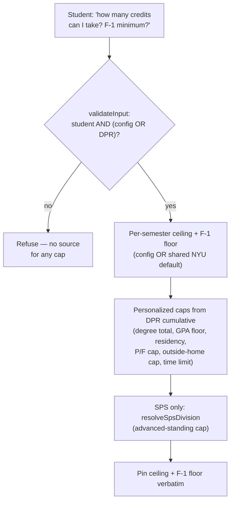
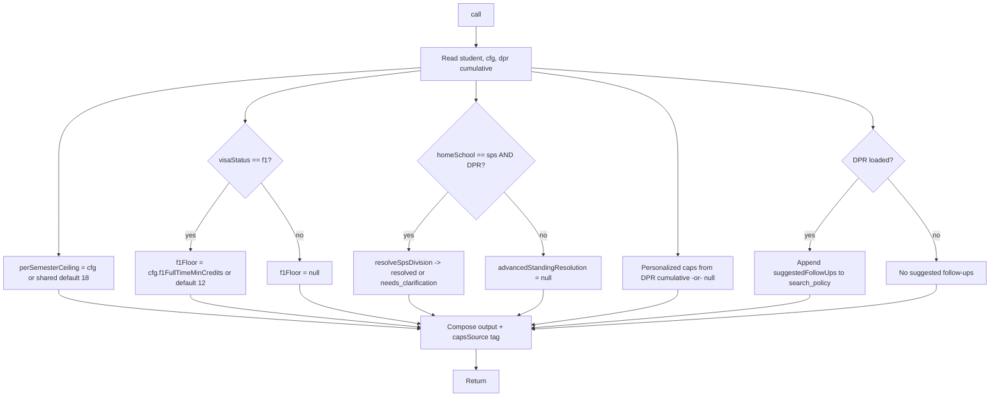

# `get_credit_caps` — Tool Audit

> Last verified against code: 2026-06-10 (post planning-engine rebuild, PRs #35-#41).

Source files:
- Tool definition: `packages/engine/src/agent/tools/getCreditCaps.ts`
- Shared NYU-undergrad registration defaults + school display names: `packages/engine/src/data/schoolDefaults.ts`
- SPS division resolver: `packages/engine/src/dpr/spsDivision.ts`
- Tool contract: `packages/engine/src/agent/tool.ts`
- Suggested-follow-up envelope shape: `packages/engine/src/agent/toolEnvelope.ts`

---

## Purpose

`get_credit_caps` is a deterministic, zero-side-effect data lookup that returns the credit numbers a student needs before any "how many credits can I take?" / "what's my F-1 minimum?" / "can I take 4 courses at another school?" question. It is **DPR-first**: the per-student authoritative caps come from the student's DPR cumulative block; `schoolConfig` is a fallback for school-wide policy, and two registration constants come from a shared NYU-undergrad default.

This tool is the **deliberate no-DPR exception** in the codebase. General school caps are still answerable without a DPR (the per-semester ceiling and F-1 floor are near-universal NYU-undergrad constants), so the tool runs with **either** a DPR **or** a school config. When no DPR is present, the *personalized* fields (degree total, GPA floor, residency, P/F cap, outside-home cap, time limit) come back `null` rather than refusing the whole call — unlike `run_full_audit` / `get_academic_standing`, which hard-refuse without a DPR.

The result returns a `capsSource` tag (`"dpr"`, `"config"`, or `"dpr+config"`) and the school name is derived from `student.homeSchool` (not hardcoded CAS).



---

## 1. Input schema

The input is empty (`getCreditCaps.ts:33`):

```
{ /* no fields */ }
```

Everything comes from `session.student` + `session.schoolConfig` + `session.degreeProgressReport`.

- `isReadOnly` = `true` (line 34).
- `maxResultChars` = 1500 (line 35).
- `outputMode` = `"semi_hardened"` (line 38).

---

## 2. Session prerequisites + `validateInput`

`validateInput` (lines 39-53) rejects only if:

1. **No student loaded** (`session.student` missing). Returns: `"No student profile loaded."`
2. **Neither a schoolConfig NOR a DPR loaded** — no source for any cap at all. Returns: `"No school config or DPR loaded — I can't determine your credit caps."`

The validator **does NOT refuse when only a DPR is loaded, nor when only a config is loaded.** This is the no-DPR exception that makes the tool work for any NYU-undergrad school without a per-school config file: the DPR (already specialized to the student's school + catalog year) supplies the personalized caps, and the shared NYU default supplies the per-semester ceiling and F-1 floor when no config is present.

---

## 3. What it reads

From `ToolSession`:
- `session.student` — reads `visaStatus` (to decide the F-1 floor) and `homeSchool` (for the school id/name fallback and the SPS division check).
- `session.schoolConfig` (`cfg`, may be `null`) — fallback source for: `schoolId`, `name`, `maxCreditsPerSemester`, `overloadRequirements`, `creditCaps`, `transferCreditLimits`, `f1FullTimeMinCredits`. Note: `SchoolConfig` no longer carries `overallGpaMin` or `totalCreditsRequired` for personalized use — those come from the DPR (see below).
- `session.degreeProgressReport` — `call()` reads `degreeProgressReport.cumulative` (`dpr`) for the personalized caps, and uses the full report for the SPS division resolver. The mere presence of a DPR also triggers the `suggestedFollowUps` row.

### Shared defaults (`schoolDefaults.ts`)

- `DEFAULT_PER_SEMESTER_CEILING = 18` (line 21) — near-universal NYU-undergrad per-semester ceiling.
- `DEFAULT_F1_FULLTIME_MIN_CREDITS = 12` (line 34) — F-1 full-time minimum (NYU OGS guidance).
- `PER_SEMESTER_CEILING_OVERRIDES = {}` (line 39) — sparse per-school overrides; **empty today**.
- `perSemesterCeilingFor(homeSchool)` (lines 43-46) — returns an override if one exists, else the shared 18.
- `schoolDisplayName(homeSchool)` (lines 67-70) — full display name per home-school id, falling back to a generic `"NYU"` rather than asserting a school it can't confirm.

---

## 4. Algorithm

`call()` (lines 58-159):

### Step 1 — Read inputs (lines 59-62)

```
student = session.student
cfg     = session.schoolConfig ?? null
dpr     = session.degreeProgressReport?.cumulative ?? null
isF1    = student.visaStatus === "f1"
```

### Step 2 — Per-semester ceiling + overload/cross-school caps (lines 67-69, 93)

The per-semester ceiling and F-1 floor are **not** in the DPR, so they come from config when present, else the shared default:

```
perSemesterCeiling   = cfg.maxCreditsPerSemester ?? perSemesterCeilingFor(student.homeSchool)   // typically 18
overloadRequirements = cfg.overloadRequirements  ?? []
creditCaps           = cfg.creditCaps            ?? []
transferCreditLimits = cfg.transferCreditLimits  ?? null
```

### Step 3 — SPS division-aware advanced-standing cap (lines 70-92)

SPS spans divisions with different advanced-standing caps (64 / 80 / 30). This runs **only** when `student.homeSchool === "sps"` AND a DPR is loaded:

- Call `resolveSpsDivision(dpr)` (`spsDivision.ts:72-114`). It reads only the `"Major"` programType row(s) and the DPR's `creditsRequired` band:
  - Real Estate → Schack Institute → cap **64**; Hospitality → Tisch Center → **64**; Sport → Tisch Institute → **64**; all other bachelor's → DAUS → **80**; every associate → DAUS → **30**.
- **High confidence** (a single division/level resolves): `advancedStandingResolution = { status: "resolved", cap, appliesTo, matchedLabel }`. The matching `advanced_standing` cap row from config supplies `appliesTo`.
- **Low confidence** (zero or conflicting majors): `advancedStandingResolution = { status: "needs_clarification", options }`, where `options` is the three distinct caps (`SPS_DIVISION_OPTIONS`) so the student is asked which division applies.
- For non-SPS students, or SPS with no DPR, `advancedStandingResolution = null` and the three scoped caps (if any are in config) are shown as general policy in the summary.

### Step 4 — Personalized caps from the DPR (lines 95-103, 136-140)

These come from the DPR cumulative block **only** — no config fallback for the personalized ones:

```
totalCreditsRequired = dpr.creditsRequired      ?? null   // degree total — DPR ONLY, no config fallback
overallGpaMin        = dpr.cumulativeGpaRequired ?? null   // GPA floor — DPR ONLY
residencyRequired    = dpr.residencyRequired     ?? null
passFailCapUnits     = dpr.passFailCapUnits       ?? null
outsideHomeCapUnits  = dpr.outsideHomeCapUnits    ?? null
timeLimitYears       = dpr.timeLimitYears          ?? null
capsSource           = dpr ? (cfg ? "dpr+config" : "dpr") : "config"
```

Without a DPR, all six personalized fields are `null` (the no-DPR exception: the tool still returns, with personalized fields nulled). The degree total is program-dependent, so the tool deliberately does **not** state a personalized degree total from config.

### Step 5 — F-1 floor (line 128)

```
f1FullTimeFloor = isF1 ? (cfg.f1FullTimeMinCredits ?? DEFAULT_F1_FULLTIME_MIN_CREDITS) : null   // typically 12
```

For non-F-1 students `f1FullTimeFloor` is `null` regardless of config.

### Step 6 — Compose the result + DPR follow-up (lines 105-158)

`schoolId` / `schoolName` fall back to `student.homeSchool` / `schoolDisplayName(student.homeSchool)` when no config. If a DPR is loaded, append exactly one `suggestedFollowUps` row pointing at `search_policy` (see §8).

### Flow diagram



---

## 5. What it returns

```
{
  schoolId:               string,             // cfg.schoolId ?? student.homeSchool
  schoolName:             string,             // cfg.name ?? schoolDisplayName(homeSchool)
  perSemesterCeiling:     number | null,      // config or shared default 18
  f1FullTimeFloor:        number | null,      // null unless F-1
  visaStatus:             string,             // "f1" | "domestic" | ...
  overloadRequirements:   OverloadRequirement[],
  crossSchoolCaps:        CreditCap[],         // from cfg.creditCaps (may be [])
  advancedStandingResolution: null | { status: "resolved", cap, appliesTo, matchedLabel }
                                  | { status: "needs_clarification", options: { label, cap }[] },
  transferCreditLimits:   object | null,
  totalCreditsRequired:   number | null,      // DPR ONLY (dpr.creditsRequired)
  overallGpaMin:          number | null,      // DPR ONLY (dpr.cumulativeGpaRequired)
  residencyRequired:      number | null,       // DPR (dpr.residencyRequired)
  passFailCapUnits:       number | null,       // DPR (dpr.passFailCapUnits)
  outsideHomeCapUnits:    number | null,       // DPR (dpr.outsideHomeCapUnits)
  timeLimitYears:         number | null,       // DPR (dpr.timeLimitYears)
  capsSource:             "dpr" | "config" | "dpr+config",
  suggestedFollowUps?:    SuggestedFollowUp[]  // only when DPR is loaded
}
```

The `crossSchoolCaps` array surfaces every cap defined in `schoolConfig.creditCaps` (non-home-school, online, transfer, advanced-standing, etc.). Each `CreditCap` may carry `maxCredits`, `maxCourses`, and an `appliesTo` scope label (used by schools where one `schoolId` spans sub-units with different caps, e.g. SPS).

> **Note:** the old enforcement counterpart `audit/creditCapValidator.ts` (`validateCreditCaps`, `nonHomeSchoolMax`, etc.) **no longer exists** — it was removed in the rule-engine decommission. This tool is now purely a data surface; there is no separate audit-time module re-enforcing these exact numbers.

---

## 6. Envelope behavior

- **`outputMode: "semi_hardened"`** (line 38). The validator pins the string returned by `extractVerbatim`.
- **`extractVerbatim`** (lines 228-241) composes one or two fragments:
  - If `perSemesterCeiling !== null`: `"<schoolName> per-semester ceiling: <N> credits."`
  - If `f1FullTimeFloor !== null`: `"F-1 full-time floor: <N> credits per semester."`
  - Joined with `" "`. Returns `null` if both are absent (no pinned text).
- **`isReadOnly: true`** (line 34).
- **`maxResultChars` = 1500**; `summarizeResult` truncated above that by the `buildTool` wrapper.
- The tool never writes to `session`.

The LLM's reply must include the verbatim fragment(s) unchanged. Synthesis around them is allowed.

---

## 7. Summary text format

`summarizeResult` (lines 160-223) emits, in order:

```
SCHOOL: <schoolName> (<schoolId>)
Per-semester ceiling: <N> credits           # OR: "Per-semester ceiling: not published — confirm with adviser"
F-1 full-time floor: <N> credits/semester (visaStatus=<v>)   # only when f1FullTimeFloor !== null
Overload requirement: <JSON of each row>    # one line per overloadRequirement
Credit cap (<type>): max <N> credits|courses [— <appliesTo>]   # one per crossSchoolCap (advanced_standing skipped if resolved below)
Advanced-standing cap: <N> credits [— <scope>] (from your DPR program: <matchedLabel>)   # when SPS division resolved
   OR
Advanced-standing cap depends on your SPS division — confirm which applies:   # when SPS needs clarification
  - <option label>: <N> credits
Transfer credit limits: <JSON>              # only when set
Degree total: <N> credits required          # only when totalCreditsRequired !== null (i.e. DPR present)
Overall GPA min: <N>                         # only when overallGpaMin !== null (i.e. DPR present)
Residency required: <N> credits in residence # only when residencyRequired !== null
Pass/Fail career cap: <N> units              # only when passFailCapUnits !== null
Outside-home-school cap: <N> units           # only when outsideHomeCapUnits !== null
Degree time limit: <N> years                 # only when timeLimitYears !== null
(caps source: <dpr | config | dpr+config>)
```

Overload requirements and transfer limits are rendered with `JSON.stringify`. The `(caps source: …)` line always closes the summary so the reader knows whether the personalized numbers came from the DPR.

---

## 8. Interactions with other tools

- **`search_policy`** — auto-suggested as a follow-up when a DPR is loaded (lines 148-156). The argument is the literal string `"F-1 full-time minimum credit-load policy"`; the `why` notes that the bulletin + OGS text carries the *policy reasoning*, while this tool returns the *numbers*. See [`search_policy`](./search_policy.md).
- **`get_academic_standing`** — the system-prompt routing pair (Appendix A rule #5): "before discussing CREDIT COUNTS, GPA, GRADUATION PROGRESS, or SEMESTER PLANNING, call at minimum: get_academic_standing → get_credit_caps". This tool is the second in that chain. See [`get_academic_standing`](./get_academic_standing.md). Note both tools now read the same per-student DPR-required GPA floor (`dpr.cumulative.cumulativeGpaRequired`).
- **`run_full_audit`** — surfaces the same DPR cumulative budgets (residency, P/F, outside-home, time limit) inside its audit summary; this tool exposes them as standalone caps. See [`run_full_audit`](./run_full_audit.md).
- **`plan_forward_degree`** — not a direct caller, but the forward planner consumes the same per-semester ceiling + F-1 floor when computing valid semester loads. See [`plan_forward_degree`](./plan_forward_degree.md).

The tool does NOT chain to any other tool itself beyond the optional `suggestedFollowUps` row.

---

## 9. Edge cases

- **`cfg.maxCreditsPerSemester` undefined / no config** — `perSemesterCeiling` falls back to `perSemesterCeilingFor(homeSchool)` (18 today, since the override map is empty). The summary always prints a ceiling unless `homeSchool` resolution yields `null` (it does not for known schools).
- **Non-F-1 student** — `f1FullTimeFloor` is `null` regardless of config. The F-1 line is omitted from both the summary and the verbatim text.
- **`student.visaStatus` undefined** — output `visaStatus` defaults to `"domestic"`. F-1 floor stays `null`.
- **F-1 student, no `cfg.f1FullTimeMinCredits`** — falls back to `DEFAULT_F1_FULLTIME_MIN_CREDITS = 12`.
- **No DPR loaded** — the tool still returns (no-DPR exception). All six personalized fields (`totalCreditsRequired`, `overallGpaMin`, `residencyRequired`, `passFailCapUnits`, `outsideHomeCapUnits`, `timeLimitYears`) are `null`; `capsSource = "config"`; no `suggestedFollowUps`.
- **SPS student, DPR loaded, single division resolves** — `advancedStandingResolution.status === "resolved"`; the raw `advanced_standing` cap row is skipped in the summary in favor of the resolved line.
- **SPS student, DPR loaded, no/conflicting major** — `advancedStandingResolution.status === "needs_clarification"`; the summary lists all three division options and asks the student to confirm.
- **Non-SPS student** — `advancedStandingResolution = null`; any `advanced_standing` cap in config is shown as a plain `Credit cap (advanced_standing)` line.
- **Both `perSemesterCeiling` and `f1FullTimeFloor` are null** — `extractVerbatim` returns `null`, disabling the semi-hardened pin for this call. (Rare: `perSemesterCeiling` is null only if `homeSchool` resolution fails.)
- **No `student`** — rejected by `validateInput`. **No config AND no DPR** — rejected.

---

## Known limitations

- **No enforcement module.** The old `creditCapValidator.ts` that re-checked these caps against actual usage is gone. This tool surfaces the numbers; nothing downstream automatically enforces the cross-school caps as upper bounds during an audit.
- **`PER_SEMESTER_CEILING_OVERRIDES` is empty.** Every school currently gets the shared 18-credit ceiling unless it authors `maxCreditsPerSemester` in a `SchoolConfig`. A school that genuinely differs and has no config file would silently report 18.
- **Personalized caps require a DPR.** Without one, degree total, GPA floor, residency, P/F cap, outside-home cap, and time limit all come back `null` — by design, but a student with only a config file gets a partial answer.

---

## Summary

`get_credit_caps` is a DPR-first, zero-side-effect data lookup. It surfaces the per-semester ceiling (config or the shared NYU default 18), the F-1 full-time floor (12 by default, only when F-1), all cross-school caps, overload requirements, transfer limits, and — **from the DPR only** — the degree total, GPA floor, residency, Pass/Fail career cap, outside-home cap, and time limit. For SPS students with a DPR it resolves the division-specific advanced-standing cap (64/80/30) or asks which division applies. It is the deliberate no-DPR exception: it runs with either a DPR or a config, nulling personalized fields when the DPR is absent. The per-semester ceiling and F-1 floor are pinned verbatim so the LLM cannot paraphrase those numbers, and a `capsSource` tag tells the reader where each number came from.
